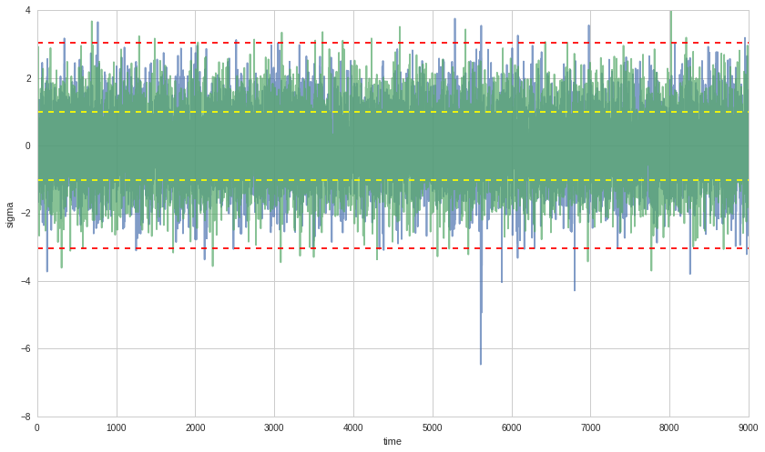
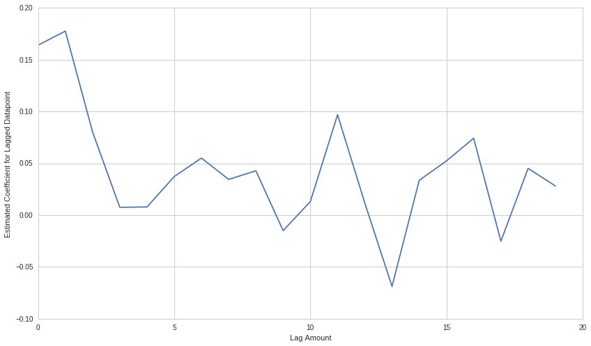

Generalized Method of Moments with ARCH and GARCH Models
========================================================

By Delaney Granizo-Mackenzie and Andrei Kirilenko developed as part of
the Masters of Finance curriculum at MIT Sloan.

Part of the Quantopian Lecture Series:

-  `www.quantopian.com/lectures <https://www.quantopian.com/lectures>`__
-  `github.com/quantopian/research_public <https://github.com/quantopian/research_public>`__

Notebook released under the Creative Commons Attribution 4.0 License.

AutoRegressive Conditionally Heteroskedastic (ARCH) occurs when the
volatility of a time series is also autoregressive.

.. code:: ipython2

    import cvxopt
    from functools import partial
    import math
    import numpy as np
    import scipy
    from scipy import stats
    import statsmodels.api as sm
    from statsmodels.stats.stattools import jarque_bera
    
    import matplotlib.pyplot as plt

Simulating a GARCH(1, 1) Case
-----------------------------

We’ll start by using Monte Carlo sampling to simulate a GARCH(1, 1)
process. Our dynamics will be

.. math::

   \sigma_1 = \sqrt{\frac{a_0}{1-a_1-b_1}} \\
   \sigma_t^2 = a_0 + a_1 x_{t-1}^2+b_1 \sigma_{t-1}^2 \\
   x_t = \sigma_t \epsilon_t \\
   \epsilon \sim \mathcal{N}(0, 1)

Our parameters will be :math:`a_0 = 1`, :math:`a_1=0.1`, and
:math:`b_1=0.8`. We will drop the first 10% (burn-in) of our simulated
values.

.. code:: ipython2

    # Define parameters
    a0 = 1.0
    a1 = 0.1
    b1 = 0.8
    sigma1 = math.sqrt(a0 / (1 - a1 - b1))

.. code:: ipython2

    def simulate_GARCH(T, a0, a1, b1, sigma1):
        
        # Initialize our values
        X = np.ndarray(T)
        sigma = np.ndarray(T)
        sigma[0] = sigma1
        
        for t in range(1, T):
            # Draw the next x_t
            X[t - 1] = sigma[t - 1] * np.random.normal(0, 1)
            # Draw the next sigma_t
            sigma[t] = math.sqrt(a0 + b1 * sigma[t - 1]**2 + a1 * X[t - 1]**2)
            
        X[T - 1] = sigma[T - 1] * np.random.normal(0, 1)    
        
        return X, sigma

Now we’ll compare the tails of the GARCH(1, 1) process with normally
distributed values. We expect to see fatter tails, as the GARCH(1, 1)
process will experience extreme values more often.

.. code:: ipython2

    X, _ = simulate_GARCH(10000, a0, a1, b1, sigma1)
    X = X[1000:] # Drop burn in
    X = X / np.std(X) # Normalize X
    
    def compare_tails_to_normal(X):
        # Define matrix to store comparisons
        A = np.zeros((2,4))
        for k in range(4):
            A[0, k] = len(X[X > (k + 1)]) / float(len(X)) # Estimate tails of X
            A[1, k] = 1 - stats.norm.cdf(k + 1) # Compare to Gaussian distribution
        return A
    
    compare_tails_to_normal(X)

.. parsed-literal::

    array([[  1.54888889e-01,   2.41111111e-02,   1.11111111e-03,
              0.00000000e+00],
           [  1.58655254e-01,   2.27501319e-02,   1.34989803e-03,
              3.16712418e-05]])

Sure enough, the tails of the GARCH(1, 1) process are fatter. We can
also look at this graphically, although it’s a little tricky to see.

.. code:: ipython2

    plt.hist(X, bins=50)
    plt.xlabel('sigma')
    plt.ylabel('observations');

.. image:: notebook_files/notebook_8_0.png

.. code:: ipython2

    # Sample values from a normal distribution
    X2 = np.random.normal(0, 1, 9000)
    both = np.matrix([X, X2])

.. code:: ipython2

    # Plot both the GARCH and normal values
    plt.plot(both.T, alpha=.7);
    plt.axhline(X2.std(), color='yellow', linestyle='--')
    plt.axhline(-X2.std(), color='yellow', linestyle='--')
    plt.axhline(3*X2.std(), color='red', linestyle='--')
    plt.axhline(-3*X2.std(), color='red', linestyle='--')
    plt.xlabel('time')
    plt.ylabel('sigma');

What we’re looking at here is the GARCH process in blue and the normal
process in green. The 1 and 3 std bars are drawn on the plot. We can see
that the blue GARCH process tends to cross the 3 std bar much more often
than the green normal one.

Testing for ARCH Behavior
-------------------------

The first step is to test for ARCH conditions. To do this we run a
regression on :math:`x_t` fitting the following model.

.. math:: x_t^2 = a_0 + a_1 x_{t-1}^2 + \dots + a_p x_{t-p}^2

We use OLS to estimate
:math:`\hat\theta = (\hat a_0, \hat a_1, \dots, \hat a_p)` and the
covariance matrix :math:`\hat\Omega`. We can then compute the test
statistic

.. math:: F = \hat\theta \hat\Omega^{-1} \hat\theta'

We will reject if :math:`F` is greater than the 95% confidence bars in
the :math:`\mathcal(X)^2(p)` distribution.

To test, we’ll set :math:`p=20` and see what we get.

.. code:: ipython2

    X, _ = simulate_GARCH(1100, a0, a1, b1, sigma1)
    X = X[100:] # Drop burn in
    
    p = 20
    
    # Drop the first 20 so we have a lag of p's
    Y2 = (X**2)[p:]
    X2 = np.ndarray((980, p))
    for i in range(p, 1000):
        X2[i - p, :] = np.asarray((X**2)[i-p:i])[::-1]
    
    model = sm.OLS(Y2, X2)
    model = model.fit()
    theta = np.matrix(model.params)
    omega = np.matrix(model.cov_HC0)
    F = np.asscalar(theta * np.linalg.inv(omega) * theta.T)
    
    print np.asarray(theta.T).shape
    
    plt.plot(range(20), np.asarray(theta.T))
    plt.xlabel('Lag Amount')
    plt.ylabel('Estimated Coefficient for Lagged Datapoint')
    
    print 'F = ' + str(F)
    
    chi2dist = scipy.stats.chi2(p)
    pvalue = 1-chi2dist.cdf(F)
    print 'p-value = ' + str(pvalue)
    
    # Finally let's look at the significance of each a_p as measured by the standard deviations away from 0
    print theta/np.diag(omega)

.. parsed-literal::

    (20, 1)
    F = 341.736612805
    p-value = 0.0
    [[ 82.59140112  71.46296619  42.80265659   5.9693111    5.61141539
       30.89781715  36.54379448  21.58236845  30.66660757 -10.92922828
       13.41504385  48.73313057  10.17361295 -70.71538298  23.39274787
       40.53162163  56.12994402 -28.95568019  42.05335583  35.05024461]]

Fitting GARCH(1, 1) with MLE
----------------------------

Once we’ve decided that the data might have an underlying GARCH(1, 1)
model, we would like to fit GARCH(1, 1) to the data by estimating
parameters.

To do this we need the log-likelihood function

.. math:: \mathcal{L}(\theta) = \sum_{t=1}^T - \ln \sqrt{2\pi} - \frac{x_t^2}{2\sigma_t^2} - \frac{1}{2}\ln(\sigma_t^2)

To evaluate this function we need :math:`x_t` and :math:`\sigma_t` for
:math:`1 \leq t \leq T`. We have :math:`x_t`, but we need to compute
:math:`\sigma_t`. To do this we need to make a guess for
:math:`\sigma_1`. Our guess will be :math:`\sigma_1^2 = \hat E[x_t^2]`.
Once we have our initial guess we compute the rest of the
:math:`\sigma`\ ’s using the equation

.. math:: \sigma_t^2 = a_0 + a_1 x_{t-1}^2 + b_1\sigma_{t-1}^2

.. code:: ipython2

    X, _ = simulate_GARCH(10000, a0, a1, b1, sigma1)
    X = X[1000:] # Drop burn in

.. code:: ipython2

    # Here's our function to compute the sigmas given the initial guess
    def compute_squared_sigmas(X, initial_sigma, theta):
        
        a0 = theta[0]
        a1 = theta[1]
        b1 = theta[2]
        
        T = len(X)
        sigma2 = np.ndarray(T)
        
        sigma2[0] = initial_sigma ** 2
        
        for t in range(1, T):
            # Here's where we apply the equation
            sigma2[t] = a0 + a1 * X[t-1]**2 + b1 * sigma2[t-1]
        
        return sigma2

Let’s look at the sigmas we just generated.

.. code:: ipython2

    plt.plot(range(len(X)), compute_squared_sigmas(X, np.sqrt(np.mean(X**2)), (1, 0.5, 0.5)))
    plt.xlabel('Time')
    plt.ylabel('Sigma');

.. image:: notebook_files/notebook_18_0.png

Now that we can compute the :math:`\sigma_t`\ ’s, we’ll define the
actual log likelihood function. This function will take as input our
observations :math:`x` and :math:`\theta` and return
:math:`-\mathcal{L}(\theta)`. It is important to note that we return the
negative log likelihood, as this way our numerical optimizer can
minimize the function while maximizing the log likelihood.

Note that we are constantly re-computing the :math:`\sigma_t`\ ’s in
this function.

.. code:: ipython2

    def negative_log_likelihood(X, theta):
        
        T = len(X)
        
        # Estimate initial sigma squared
        initial_sigma = np.sqrt(np.mean(X ** 2))
        
        # Generate the squared sigma values
        sigma2 = compute_squared_sigmas(X, initial_sigma, theta)
        
        # Now actually compute
        return -sum(
            [-np.log(np.sqrt(2.0 * np.pi)) -
            (X[t] ** 2) / (2.0 * sigma2[t]) -
            0.5 * np.log(sigma2[t]) for
             t in range(T)]
        )

Now we perform numerical optimization to find our estimate for

.. math:: \hat\theta = \arg \max_{(a_0, a_1, b_1)}\mathcal{L}(\theta) = \arg \min_{(a_0, a_1, b_1)}-\mathcal{L}(\theta)

We have some constraints on this

.. math:: a_1 \geq 0, b_1 \geq 0, a_1+b_1 < 1

.. code:: ipython2

    # Make our objective function by plugging X into our log likelihood function
    objective = partial(negative_log_likelihood, X)
    
    # Define the constraints for our minimizer
    def constraint1(theta):
        return np.array([1 - (theta[1] + theta[2])])
    
    def constraint2(theta):
        return np.array([theta[1]])
    
    def constraint3(theta):
        return np.array([theta[2]])
    
    cons = ({'type': 'ineq', 'fun': constraint1},
            {'type': 'ineq', 'fun': constraint2},
            {'type': 'ineq', 'fun': constraint3})
    
    # Actually do the minimization
    result = scipy.optimize.minimize(objective, (1, 0.5, 0.5),
                            method='SLSQP',
                            constraints = cons)
    theta_mle = result.x
    print 'theta MLE: ' + str(theta_mle)

.. parsed-literal::

    theta MLE: [ 0.89882685  0.10272342  0.81126578]

Now we would like a way to check our estimate. We’ll look at two things:

1. How fat are the tails of the residuals.
2. How normal are the residuals under the Jarque-Bera normality test.

We’ll do both in our ``check_theta_estimate`` function.

.. code:: ipython2

    def check_theta_estimate(X, theta_estimate):
        initial_sigma = np.sqrt(np.mean(X ** 2))
        sigma = np.sqrt(compute_squared_sigmas(X, initial_sigma, theta_estimate))
        epsilon = X / sigma
        print 'Tails table'
        print compare_tails_to_normal(epsilon / np.std(epsilon))
        print ''
        
        _, pvalue, _, _ = jarque_bera(epsilon)
        print 'Jarque-Bera probability normal: ' + str(pvalue)
        
    check_theta_estimate(X, theta_mle)

.. parsed-literal::

    Tails table
    [[  1.58888889e-01   2.31111111e-02   1.22222222e-03   0.00000000e+00]
     [  1.58655254e-01   2.27501319e-02   1.34989803e-03   3.16712418e-05]]
    
    Jarque-Bera probability normal: 0.547561671115

GMM for Estimating GARCH(1, 1) Parameters
-----------------------------------------

We’ve just computed an estimate using MLE, but we can also use
Generalized Method of Moments (GMM) to estimate the GARCH(1, 1)
parameters.

To do this we need to define our moments. We’ll use 4.

1. The residual :math:`\hat\epsilon_t = x_t / \hat\sigma_t`
2. The variance of the residual :math:`\hat\epsilon_t^2`
3. The skew moment
   :math:`\mu_3/\hat\sigma_t^3 = (\hat\epsilon_t - E[\hat\epsilon_t])^3 / \hat\sigma_t^3`
4. The kurtosis moment
   :math:`\mu_4/\hat\sigma_t^4 = (\hat\epsilon_t - E[\hat\epsilon_t])^4 / \hat\sigma_t^4`

.. code:: ipython2

    # The n-th standardized moment
    # skewness is 3, kurtosis is 4
    def standardized_moment(x, mu, sigma, n):
        return ((x - mu) ** n) / (sigma ** n)

GMM now has three steps.

Start with :math:`W` as the identity matrix.

1. Estimate :math:`\hat\theta_1` by using numerical optimization to
   minimize

.. math:: \min_{\theta \in \Theta} \left(\frac{1}{T} \sum_{t=1}^T g(x_t, \hat\theta)\right)' W \left(\frac{1}{T}\sum_{t=1}^T g(x_t, \hat\theta)\right)

2. Recompute :math:`W` based on the covariances of the estimated
   :math:`\theta`. (Focus more on parameters with explanatory power)

.. math:: \hat W_{i+1} = \left(\frac{1}{T}\sum_{t=1}^T g(x_t, \hat\theta_i)g(x_t, \hat\theta_i)'\right)^{-1}

3. Repeat until :math:`|\hat\theta_{i+1} - \hat\theta_i| < \epsilon` or
   we reach an iteration threshold.

Initialize :math:`W` and :math:`T` and define the objective function we
need to minimize.

.. code:: ipython2

    def gmm_objective(X, W, theta):
        # Compute the residuals for X and theta
        initial_sigma = np.sqrt(np.mean(X ** 2))
        sigma = np.sqrt(compute_squared_sigmas(X, initial_sigma, theta))
        e = X / sigma
        
        # Compute the mean moments
        m1 = np.mean(e)
        m2 = np.mean(e ** 2) - 1
        m3 = np.mean(standardized_moment(e, np.mean(e), np.std(e), 3))
        m4 = np.mean(standardized_moment(e, np.mean(e), np.std(e), 4) - 3)
        
        G = np.matrix([m1, m2, m3, m4]).T
        
        return np.asscalar(G.T * W * G)
    
    def gmm_variance(X, theta):
        # Compute the residuals for X and theta    
        initial_sigma = np.sqrt(np.mean(X ** 2))
        sigma = np.sqrt(compute_squared_sigmas(X, initial_sigma, theta))
        e = X / sigma
    
        # Compute the squared moments
        m1 = e ** 2
        m2 = (e ** 2 - 1) ** 2
        m3 = standardized_moment(e, np.mean(e), np.std(e), 3) ** 2
        m4 = (standardized_moment(e, np.mean(e), np.std(e), 4) - 3) ** 2
        
        # Compute the covariance matrix g * g'
        T = len(X)
        s = np.ndarray((4, 1))
        for t in range(T):
            G = np.matrix([m1[t], m2[t], m3[t], m4[t]]).T
            s = s + G * G.T
        
        return s / T

Now we’re ready to the do the iterated minimization step.

.. code:: ipython2

    # Initialize GMM parameters
    W = np.identity(4)
    gmm_iterations = 10
    
    # First guess
    theta_gmm_estimate = theta_mle
    
    # Perform iterated GMM
    for i in range(gmm_iterations):
        # Estimate new theta
        objective = partial(gmm_objective, X, W)
        result = scipy.optimize.minimize(objective, theta_gmm_estimate, constraints=cons)
        theta_gmm_estimate = result.x
        print 'Iteration ' + str(i) + ' theta: ' + str(theta_gmm_estimate)
        
        # Recompute W
        W = np.linalg.inv(gmm_variance(X, theta_gmm_estimate))
        
    
    check_theta_estimate(X, theta_gmm_estimate)

.. parsed-literal::

    Iteration 0 theta: [ 0.898825    0.10283861  0.81129305]
    Iteration 1 theta: [ 0.89881434  0.1027472   0.81118925]
    Iteration 2 theta: [ 0.89881434  0.1027472   0.81118925]
    Iteration 3 theta: [ 0.89881434  0.1027472   0.81118925]
    Iteration 4 theta: [ 0.89881434  0.1027472   0.81118925]
    Iteration 5 theta: [ 0.89881434  0.1027472   0.81118925]
    Iteration 6 theta: [ 0.89881434  0.1027472   0.81118925]
    Iteration 7 theta: [ 0.89881434  0.1027472   0.81118925]
    Iteration 8 theta: [ 0.89881434  0.1027472   0.81118925]
    Iteration 9 theta: [ 0.89881434  0.1027472   0.81118925]
    Tails table
    [[  1.58888889e-01   2.32222222e-02   1.22222222e-03   0.00000000e+00]
     [  1.58655254e-01   2.27501319e-02   1.34989803e-03   3.16712418e-05]]
    
    Jarque-Bera probability normal: 0.547586182431

Predicting the Future: How to actually use what we’ve done
----------------------------------------------------------

Now that we’ve fitted a model to our observations, we’d like to be able
to predict what the future volatility will look like. To do this, we can
just simulate more values using our original GARCH dynamics and the
estimated parameters.

The first thing we’ll do is compute an initial :math:`\sigma_t`. We’ll
compute our squared sigmas and take the last one.

.. code:: ipython2

    sigma_hats = np.sqrt(compute_squared_sigmas(X, np.sqrt(np.mean(X**2)), theta_mle))
    initial_sigma = sigma_hats[-1]
    initial_sigma

.. parsed-literal::

    2.9977470389171796

Now we’ll just sample values walking forward.

.. code:: ipython2

    a0_estimate = theta_gmm_estimate[0]
    a1_estimate = theta_gmm_estimate[1]
    b1_estimate = theta_gmm_estimate[2]
    
    X_forecast, sigma_forecast = simulate_GARCH(100, a0_estimate, a1_estimate, b1_estimate, initial_sigma)

.. code:: ipython2

    plt.plot(range(-100, 0), X[-100:], 'b-')
    plt.plot(range(-100, 0), sigma_hats[-100:], 'r-')
    plt.plot(range(0, 100), X_forecast, 'b--')
    plt.plot(range(0, 100), sigma_forecast, 'r--')
    plt.xlabel('Time')
    plt.legend(['X', 'sigma']);

.. image:: notebook_files/notebook_35_0.png

One should note that because we are moving foward using a random walk,
this analysis is supposed to give us a sense of the magnitude of sigma
and therefore the risk we could face. It is not supposed to accurately
model future values of X. In practice you would probably want to use
Monte Carlo sampling to generate thousands of future scenarios, and then
look at the potential range of outputs. We’ll try that now. Keep in mind
that this is a fairly simplistic way of doing this analysis, and that
better techniques, such as Bayesian cones, exist.

.. code:: ipython2

    plt.plot(range(-100, 0), X[-100:], 'b-')
    plt.plot(range(-100, 0), sigma_hats[-100:], 'r-')
    plt.xlabel('Time')
    plt.legend(['X', 'sigma'])
    
    
    max_X = [-np.inf]
    min_X = [np.inf]
    for i in range(100):
        X_forecast, sigma_forecast = simulate_GARCH(100, a0_estimate, a1_estimate, b1_estimate, initial_sigma)
        if max(X_forecast) > max(max_X):
            max_X = X_forecast
        elif min(X_forecast) < min(max_X):
            min_X = X_forecast
        plt.plot(range(0, 100), X_forecast, 'b--', alpha=0.05)
        plt.plot(range(0, 100), sigma_forecast, 'r--', alpha=0.05)
    
    # Draw the most extreme X values specially
    plt.plot(range(0, 100), max_X, 'g--', alpha=1.0)
    plt.plot(range(0, 100), min_X, 'g--', alpha=1.0);

.. image:: notebook_files/notebook_37_0.png

*This presentation is for informational purposes only and does not
constitute an offer to sell, a solicitation to buy, or a recommendation
for any security; nor does it constitute an offer to provide investment
advisory or other services by Quantopian, Inc. (“Quantopian”). Nothing
contained herein constitutes investment advice or offers any opinion
with respect to the suitability of any security, and any views expressed
herein should not be taken as advice to buy, sell, or hold any security
or as an endorsement of any security or company. In preparing the
information contained herein, Quantopian, Inc. has not taken into
account the investment needs, objectives, and financial circumstances of
any particular investor. Any views expressed and data illustrated herein
were prepared based upon information, believed to be reliable, available
to Quantopian, Inc. at the time of publication. Quantopian makes no
guarantees as to their accuracy or completeness. All information is
subject to change and may quickly become unreliable for various reasons,
including changes in market conditions or economic circumstances.*
