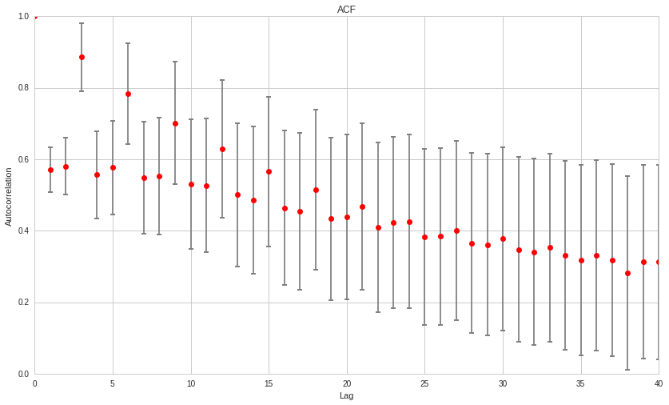

Autoregressive (AR) Models
==========================

by Maxwell Margenot, Delaney Mackenzie, and Lee Tobey

Lee Tobey is the founder of `Hedgewise <https://www.hedgewise.com/>`__.

Part of the Quantopian Lecture Series:

-  `www.quantopian.com/lectures <https://www.quantopian.com/lectures>`__
-  `github.com/quantopian/research_public <https://github.com/quantopian/research_public>`__

--------------

##AR Models An autoregressive, or AR\ :math:`(p)`, model is created by
regressing a time series on its past values, its lags. The simplest form
of an autoregressive model is an AR\ :math:`(1)` model, signifying using
only one lag term. A first order autocorrelation model like this for a
time series :math:`x_t` is:

.. math::

   x_t = b_0 + b_1 x_{t - 1} + \epsilon_t

Where :math:`x_{t - 1}` represents the value of the time series at time
:math:`(t - 1)` and :math:`\epsilon_t` is the error term. We can extend
this to an AR\ :math:`(p)` model, denoted:

.. math::

   x_t = b_0 + b_1 x_{t-1} + b_2 x_{t - 2} \ldots + b_p x_{t - p} + \epsilon_t

For an AR model to function properly, we must require that the time
series is covariance stationary. This means that it follows three
conditions:

1. The expected value of the time series is constant and finite at all
   times, i.e. \ :math:`E[y_t] = \mu` and :math:`\mu < \infty` for all
   values of :math:`t`.
2. The variance of the time series is constant and finite for all time
   periods.
3. The covariance of the time series with itself for a fixed number of
   periods in either the future or the past is constant and finite for
   all time periods, i.e

.. math::

   COV(y_t, y_{t - s}) = \lambda, \  |\lambda| < \infty, \text{ $\lambda$ constant}, \  t = 1, 2, \ \ldots, T; \  s = 0, \pm 1, \pm 2, \ldots, \pm T

Note that this mathematical representation includes condition 2.

If these conditions are not satisfied, our estimation results will not
have real-world meaning. Our estimates for the parameters will be
biased, making any tests that we try to form using the model invalid.
Unfortunately, it can be a real pain to find a covariance-stationary
time series in the wild in financial markets. For example, when we look
at the stock price of Apple, we can clearly see an upward trend. The
mean is increasing with time. There are ways, however to make a
non-stationary time series stationary. Once we have performed this
transformation, we can build an autoregressive models under the above
assumptions.

##Simulating Data

Here we will draw data samples from a simulated AR\ :math:`(3)` process.

.. code:: ipython2

    import numpy as np
    import pandas as pd
    from scipy import stats
    import statsmodels.api as sm
    import statsmodels.tsa as tsa
    import matplotlib.pyplot as plt
    
    # ensures experiment runs the same every time
    np.random.seed(100)
    
    # This function simluates an AR process, generating a new value based on historial values,
    # autoregressive coefficients b1 ... bk, and some randomness.
    def AR(b, X, mu, sigma):
        l = min(len(b)-1, len(X))
        b0 = b[0]
        
        return b0 + np.dot(b[1:l+1], X[-l:]) + np.random.normal(mu, sigma)
    
    b = np.array([0, 0.8, 0.1, 0.05])
    X = np.array([1])
    
    mu = 0
    sigma = 1
    
    for i in range(10000):
        X = np.append(X, AR(b, X, mu, sigma))
        
    plt.plot(X)
    plt.xlabel('Time')
    plt.ylabel('AR Series Value');

.. image:: notebook_files/notebook_3_0.png

Note how this process fluctuates around some central value. This value
is the mean of our time series. As we have a constant mean throughout
time and the fluctuations seem to all stray within a given distance from
the mean, we might hypothesize that this series is stationary. We would
want to rigorously test that in practice, which we will explore lightly
in the examples at the end of this lecture. Also see the `stationarity
lecture <https://www.quantopian.com/lectures/integration-cointegration-and-stationarity>`__
from the Quantopian Lecture Series.

In this case, however, we have constructed the model to be stationary,
so no need to worry about testing for stationarity right now.

##Tail Risk

Autoregressive processes will tend to have more extreme values than data
drawn from say a normal distribution. This is because the value at each
time point is influenced by recent values. If the series randomly jumps
up, it is more likely to stay up than a non-autoregressive series. This
is known as ‘fat-tailledness’ (fat-tailed distribution) because the
extremes on the pdf will be fatter than in a normal distribution.

Much talk of tail risk in finance comes from the fact that tail events
do occur and are hard to model due to their infrequent occurrence. If we
have reason to suspect that a process is autoregressive, we should
expect risk from extreme tail events and adjust accordingly.

AR models are just one of the sources of tail risk, so don’t assume that
because a series is non-AR, it does not have tail risk.

We’ll check for that behavior now.

.. code:: ipython2

    def compare_tails_to_normal(X):
        # Define matrix to store comparisons
        A = np.zeros((2,4))    
        for k in range(4):             
            #stores tail probabilities of the sample series vs a normal series
            A[0, k] = len(X[X > (k + 1)]) / float(len(X)) # Estimate tails of X        
            A[1, k] = 1 - stats.norm.cdf(k + 1) # Compare to Gaussian distribution
        print 'Frequency of std events in X \n1: %s\t2: %s\t3: %s\t4: %s' % tuple(A[0])
        print 'Frequency of std events in a normal process \n1: %s\t2: %s\t3: %s\t4: %s' % tuple(A[1])
        return A
    
    compare_tails_to_normal(X);

.. parsed-literal::

    Frequency of std events in X 
    1: 0.327567243276	2: 0.185481451855	3: 0.0909909009099	4: 0.035796420358
    Frequency of std events in a normal process 
    1: 0.158655253931	2: 0.0227501319482	3: 0.00134989803163	4: 3.16712418331e-05

##Estimations of Variance Will be Wrong

Because an AR process has a tail heavy and non-normal distribution of
outcomes, estimates of variance on AR processes will be wrong. This is
dangerous because variance is used to calculate many quantities in
staistics, most importantly confidence intervals and p-values. Because
the width of the confidence interval is often based on a variance
estimate, we can no longer trust p-values that come from AR processes.
For more information on p-values please see the Hypothesis Testing
notebook in the `Quantopian Lecture
Series <https://www.quantopian.com/lectures>`__.

Let’s check this here. First we’ll define some helper functions that
compute a naive 95% confidence interval for the true value of the mean
on some input series.

.. code:: ipython2

    def compute_unadjusted_interval(X):
        T = len(X)
        # Compute mu and sigma MLE
        mu = np.mean(X)
        sigma = np.std(X)
        # Compute the bounds using standard error
        lower = mu - 1.96 * (sigma/np.sqrt(T))
        upper = mu + 1.96 * (sigma/np.sqrt(T))
        return lower, upper
    
    # We'll make a function that returns true when the computed bounds contain 0
    def check_unadjusted_coverage(X):
        l, u = compute_unadjusted_interval(X)
        # Check to make sure l <= 0 <= u
        if l <= 0 and u >= 0:
            return True
        else:
            return False
        
    def simululate_AR_process(b, T):
        X = np.array([1])
    
        mu = 0
        sigma = 1
    
        for i in range(T):
            X = np.append(X, AR(b, X, mu, sigma))
            
        return X

Now we’ll run an experiment 1000 times in which we compute an AR series,
then estimate the mean and take a naive 95% confidence interval around
it. Then we’ll check if the confidence interval contains 0, the true
long-term mean of our series, and record that in our ``outcomes`` array.

.. code:: ipython2

    trials = 1000
    outcomes = np.zeros((trials, 1))
    
    for i in range(trials):
        #note these are the same values we used to generate the initial AR array
        Z = simululate_AR_process(np.array([0, 0.8, 0.1, 0.05]), 100)
        if check_unadjusted_coverage(Z):
            # The internal contains 0, the true value
            outcomes[i] = 1
        else:
            outcomes[i] = 0

Finally let’s check, if our test is calibrated correctly, then we should
have the confidence interval contain 0, 95% of the time.

.. code:: ipython2

    np.sum(outcomes) / trials

.. parsed-literal::

    0.193

Looks like something is severly wrong. What’s going on here is that the
AR series moves around a lot more, but the estimate of variance assumes
stationarity and doesn’t take into account all of that motion. As a
result the confidence intervals are way smaller than they should be and
don’t contain the correct value nearly enough.

This gives us a false sense of security. Stationarity tests should
usually catch AR behavior and let us know that estimates of variance
will be wrong. For more information please see the Integration,
Cointegration, and Stationarity lecture of the `Quantopian Lecture
Series <https://www.quantopian.com/lectures>`__.

####Correcting for Variance

In practice it can be very difficult to accurately estimate variance on
an AR series, but one attempt to do this is the Newey-West estimation.
You can find information on it
`here <https://en.wikipedia.org/wiki/Newey%E2%80%93West_estimator>`__.

##Testing for AR Behavior

In order to determine the order, :math:`p`, of an AR\ :math:`(p)` model,
we look at the autocorrelations of the time series. These are the
correlations of the series with its past values. The :math:`k`-th order
autocorrelation is

.. math::

   \rho_k = \frac{COV(x_t, x_{t - k})}{\sigma_x^2} = \frac{E[(x_t - \mu)(x_{t - k} - \mu)}{\sigma_x^2}

Where :math:`k` represents the number of periods lagged. We cannot
directly observe the autocorrelations so we estimate them as

.. math::

   \hat{\rho}_k = \frac{\sum_{t = k + 1}^T[(x_t - \bar{x})(x_{t - k} - \bar{x})]}{\sum_{t = 1}^T (x_t - \bar{x})^2}

For our purposes, we can use a pair of tools called the autocorrelation
function (ACF) and the partial autocorrelation function (PACF) in order
to determine the order of our model. The PACF controls for shorter lags,
unlike the ACF. These functions are included with many statistical
packages and compute the sample autocorrelations for us, allowing us to
determine the appropriate value of :math:`p`.

We will demonstrate these functions on our above example of a stationary
series:

.. code:: ipython2

    from statsmodels.tsa.stattools import acf, pacf

.. code:: ipython2

    X = simululate_AR_process(np.array([0, 0.8, 0.1, 0.05]), 1000)

.. code:: ipython2

    # We'll choose 40 lags. This is a bit arbitrary, but you want to include all the lags you think might
    # feasibly impact the current value.
    nlags = 40
    # Note, this will produce nlags + 1 values, as we include the autocorrelation of
    # X[-1] with X[-1], which is trivially 1.
    # The reason this is done is because that is the 0th spot in the array and corresponds
    # to the 0th lag of X[(-1)-0].
    X_acf = acf(X, nlags=nlags)
    print 'Autocorrelations:\n' + str(X_acf) + '\n'
    X_pacf = pacf(X, nlags=nlags)
    print 'Partial Autocorrelations:\n' + str(X_pacf)

.. parsed-literal::

    Autocorrelations:
    [ 1.          0.57070553  0.58001725  0.88553976  0.55669882  0.57640436
      0.78307405  0.54759415  0.55254723  0.70158722  0.53082572  0.52673077
      0.62850967  0.50091633  0.48541475  0.56544198  0.46391848  0.45390828
      0.51491108  0.43375521  0.43938017  0.46783793  0.40843913  0.42270738
      0.42566802  0.38298857  0.38379558  0.40029717  0.36548704  0.36088258
      0.37743521  0.34745858  0.34065687  0.35239327  0.33194099  0.31758452
      0.33113111  0.31688646  0.2818213   0.31237461  0.31252031]
    
    Partial Autocorrelations:
    [ 1.          0.57127624  0.37827414  0.80672256  0.00162478  0.00490887
     -0.04497956  0.04013524 -0.05301909  0.00706455 -0.00528104  0.0051476
     -0.03421094 -0.03637203 -0.06841025  0.00396849 -0.02433695  0.03906542
      0.02344142  0.02958713  0.07306916 -0.01201434  0.00279546  0.01328444
     -0.00679875 -0.01547705 -0.09186641  0.05847768  0.03298422  0.04395628
     -0.01605778  0.00286143 -0.00734411 -0.01496441  0.01152254 -0.01185183
      0.01895763  0.01901218 -0.09532658  0.00791091  0.06173332]

Let’s plot out the values now.

.. code:: ipython2

    plt.plot(X_acf, 'ro')
    plt.xlabel('Lag')
    plt.ylabel('Autocorrelation')
    plt.title("ACF");

.. image:: notebook_files/notebook_19_0.png

.. code:: ipython2

    plt.plot(X_pacf, 'ro')
    plt.xlabel('Lag')
    plt.ylabel('Autocorrelation')
    plt.title("PACF");

.. image:: notebook_files/notebook_20_0.png

####Statistical Testing

Just looking at the graphs alone isn’t enough. We need to use some
degree of statistical rigor. The ``acf`` and ``pacf`` functions will
return confidence intervals on all the autocorrelations. We can check if
these intervals overlap with zero. If they do then we say that zero is
within the set confidence interval for the true parameter value, and
don’t treat the lag as having any meaningful autocorrelation.

NOTE: This only works if the assumptions underlying the confidence
interval computations are satisfied. Please check these assumptions
before you assume the test is meaningful. The assumptions will differ in
every case, so please read the statistical documentation of your own
test and go from there.

.. code:: ipython2

    # We have to set a confidence level for our intervals, we choose the standard of 95%,
    # corresponding with an alpha of 0.05.
    X_acf, X_acf_confs = acf(X, nlags=nlags, alpha=0.05)
    X_pacf, X_pacf_confs = pacf(X, nlags=nlags, alpha=0.05)

After getting the confidence interval data, we’ll write a function to
plot it.

.. code:: ipython2

    def plot_acf(X_acf, X_acf_confs, title='ACF'):
        # The confidence intervals are returned by the functions as (lower, upper)
        # The plotting function needs them in the form (x-lower, upper-x)
        errorbars = np.ndarray((2, len(X_acf)))
        errorbars[0, :] = X_acf - X_acf_confs[:,0]
        errorbars[1, :] = X_acf_confs[:,1] - X_acf
    
        plt.plot(X_acf, 'ro')
        plt.errorbar(range(len(X_acf)), X_acf, yerr=errorbars, fmt='none', ecolor='gray', capthick=2)
        plt.xlabel('Lag')
        plt.ylabel('Autocorrelation')
        plt.title(title);
    plot_acf(X_acf, X_acf_confs)

.. code:: ipython2

    plot_acf(X_pacf, X_pacf_confs, title='PACF')

.. image:: notebook_files/notebook_25_0.png

Notice how for the PACF, only the first three lags are the only ones
that appear to be significantly different from :math:`0`, which makes
sense because we directly constructed an AR model of order :math:`3`.
However, these results may vary for each random series generated in this
notebook.

In a real-world time series, we use these plots to determine the order
of our model. We would then attempt to fit a model using a maximum
likelihood function.

##Fitting a Model

We’ll use one of the functions already implemented in Python to fit an
AR model. We’ll try this on our simulated data first.

.. code:: ipython2

    # Construct an unfitted model
    model = tsa.api.AR(X)
    # Fit it
    model = model.fit()

The ``model`` object has a lot of useful information on it, use the
``?`` notation to find out more. We’ll be focusing on a few attributes,
starting with ``model.params`` the estimated parameters in the model,
one for each lag, and ``model.bse``, the estimated standard error for
each of the parameters.

.. code:: ipython2

    print 'Parameters'
    print model.params
    print 'Standard Error'
    print model.bse

.. parsed-literal::

    Parameters
    [ 0.01001762  0.04631952  0.06669125  0.84444655 -0.02662476  0.07031018
     -0.03883539  0.05362627 -0.06257934  0.03183551  0.02255835  0.06366225
     -0.02663838 -0.00824025 -0.09032174 -0.02259851 -0.05894006 -0.03575162
      0.01899755  0.0265497   0.08158745 -0.00494997]
    Standard Error
    [ 0.03210283  0.03228516  0.03221285  0.03226938  0.04224386  0.04226218
      0.04228528  0.04223737  0.04222499  0.04230633  0.04232241  0.04227582
      0.04230175  0.04232492  0.04221253  0.04221065  0.04218858  0.04214434
      0.04212185  0.03217742  0.03220652  0.03227438]

.. code:: ipython2

    # To plot this we'll need to format a confidence interval 2D array like the previous functions returned
    # Here is some quick code to do that
    model_confs = np.asarray((model.params - model.bse, model.params + model.bse)).T
    
    plot_acf(model.params, model_confs, title='Model Estimated Parameters')

.. image:: notebook_files/notebook_32_0.png

Choosing the Number of Lags
~~~~~~~~~~~~~~~~~~~~~~~~~~~

Estimations Will Yield Too Many Lags
^^^^^^^^^^^^^^^^^^^^^^^^^^^^^^^^^^^^

We can see our model estimated quite a few parameters. In this case we
know there are too many because we simulated the data as an AR(3)
process. The reason that AR models will estimate many more lags than is
actually the case is due to indirect dependency. If :math:`X_t` depends
on :math:`X_{t-1}`, then indirectly and to a lesser extent it will
depend on :math:`X_{t-2}`. In the presence of more than one lag in the
data generating process, we will get potentially complex harmonic
structures in the lags. These indirect dependencies will be picked up by
a simple estimation.

You Want the Fewest Parameters That Yield a Decent Model
^^^^^^^^^^^^^^^^^^^^^^^^^^^^^^^^^^^^^^^^^^^^^^^^^^^^^^^^

In general it’s rarely the case that you can get anything useful out of
a model with many parameters, see the Overfitting lecture for why in the
Quantopian Lecture Series. In this case we want to select a number of
lags that we believe explains what is happening, but without overfitting
and choosing a model with way too many lags.

Observing the ACF and PACF indicates that only the first 3 lags may be
useful. However, we will expand the number of lags to 10 to double-check
our initial data. We will use information criterion, specifically Akaike
Information Criterion (AIC) and Bayes Information Criterion (BIC) to
decide the correct number of parameters. For more information on
choosing models using information criterion, please see the
corresponding lecture in the Quantopian Lecture Series.

Interpreting the AIC and BIC is done as follows. Compute the AIC and BIC
for all models we wish to consider, and note the smallest AIC and BIC
recorded :math:`AIC_{min}` and :math:`BIC_{min}`. These are the models
which minimize information loss under each metric. For each type of IC
We then can compute the *relative likelihood* of each model :math:`i` by
taking

.. math:: l = e^{(IC_{min} - IC_{i})/2}

We can interpret :math:`l` as model :math:`i` is :math:`l` times as
likely to minimize information loss, compared to the minimum AIC model.
It might take a few reads to understand this, so let’s just see it in
action.

.. code:: ipython2

    N = 10
    AIC = np.zeros((N, 1))
    
    for i in range(N):
        model = tsa.api.AR(X)
        model = model.fit(maxlag=(i+1))
        AIC[i] = model.aic
        
    AIC_min = np.min(AIC)
    model_min = np.argmin(AIC)
    
    print 'Relative Likelihoods'
    print np.exp((AIC_min-AIC) / 2)
    print 'Number of parameters in minimum AIC model %s' % (model_min+1)

.. parsed-literal::

    Relative Likelihoods
    [[ 0.54739169]
     [ 0.59052713]
     [ 0.99861675]
     [ 0.997749  ]
     [ 0.99628437]
     [ 0.99619915]
     [ 0.9960884 ]
     [ 1.        ]
     [ 0.99850924]
     [ 0.99809322]]
    Number of parameters in minimum AIC model 8

.. code:: ipython2

    N = 10
    BIC = np.zeros((N, 1))
    
    for i in range(N):
        model = tsa.api.AR(X)
        model = model.fit(maxlag=(i+1))
        BIC[i] = model.bic
        
    BIC_min = np.min(BIC)
    model_min = np.argmin(BIC)
    
    print 'Relative Likelihoods'
    print np.exp((BIC_min-BIC) / 2)
    print 'Number of parameters in minimum BIC model %s' % (model_min+1)

.. parsed-literal::

    Relative Likelihoods
    [[ 0.5508575 ]
     [ 0.59280494]
     [ 1.        ]
     [ 0.99666667]
     [ 0.99274501]
     [ 0.99020386]
     [ 0.98763995]
     [ 0.98905709]
     [ 0.9851272 ]
     [ 0.98226451]]
    Number of parameters in minimum BIC model 3

Our conclusion is that the AIC estimates the 4 parameter model as most
likely, whereas the BIC estimates 3. Because we are always looking for
reasons to knock off a parameter, we choose the 3. In this case it
happened to be the exact right answer, but this will not always be the
case, especially in noisy real data. Don’t assume that using this method
will always get you the right answer.

Evaluating Residuals
~~~~~~~~~~~~~~~~~~~~

One final step we might do before performing an out of sample test for
this model would be to evaluate its residual behavior. The AIC and BIC
already do this to an extent, effectively measuring how much information
is left on the table (in the residuals) after the model has made its
predictions. For more information on residuals analysis see the
Violations of Regression Models lecture. Here we’ll just check for
normality of the residuals.

.. code:: ipython2

    model = tsa.api.AR(X)
    model = model.fit(maxlag=3)
    
    from statsmodels.stats.stattools import jarque_bera
    
    score, pvalue, _, _ = jarque_bera(model.resid)
    
    if pvalue < 0.10:
        print 'We have reason to suspect the residuals are not normally distributed.'
    else:
        print 'The residuals seem normally distributed.'

.. parsed-literal::

    The residuals seem normally distributed.

The residuals seem normally distributed. There are more model validation
steps that could be done, but these are the core ones for an AR model.
The next steps would be testing the model out of sample, and then using
it to make predictions on your data.

References
----------

-  “Quantitative Investment Analysis”, by DeFusco, McLeavey, Pinto, and
   Runkle
-  “Analysis of Financial Time Series”, by Ruey Tsay

*This presentation is for informational purposes only and does not
constitute an offer to sell, a solicitation to buy, or a recommendation
for any security; nor does it constitute an offer to provide investment
advisory or other services by Quantopian, Inc. (“Quantopian”). Nothing
contained herein constitutes investment advice or offers any opinion
with respect to the suitability of any security, and any views expressed
herein should not be taken as advice to buy, sell, or hold any security
or as an endorsement of any security or company. In preparing the
information contained herein, Quantopian, Inc. has not taken into
account the investment needs, objectives, and financial circumstances of
any particular investor. Any views expressed and data illustrated herein
were prepared based upon information, believed to be reliable, available
to Quantopian, Inc. at the time of publication. Quantopian makes no
guarantees as to their accuracy or completeness. All information is
subject to change and may quickly become unreliable for various reasons,
including changes in market conditions or economic circumstances.*
