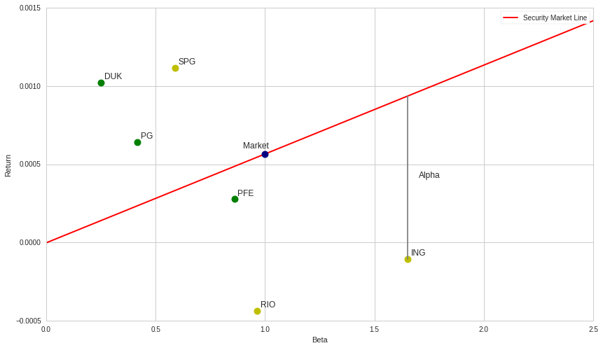
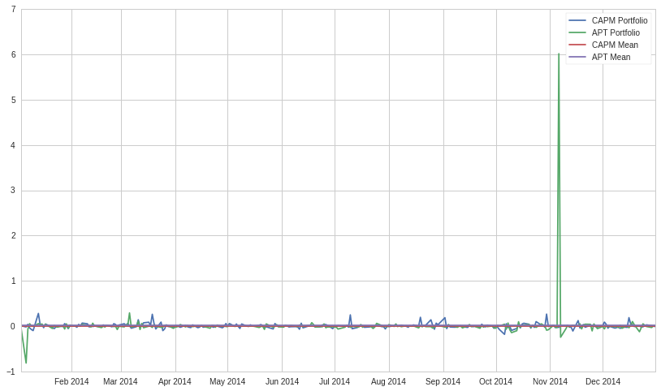

The Capital Asset Pricing Model and Arbitrage Pricing Theory
============================================================

by Beha Abasi, Maxwell Margenot, and Delaney Granizo-Mackenzie

Part of the Quantopian Lecture Series:

-  `www.quantopian.com/lectures <https://www.quantopian.com/lectures>`__
-  https://github.com/quantopian/research_public

--------------

The Capital Asset Pricing Model (CAPM) is a classic measure of the cost
of capital. It is used often in finance to evaluate the price of assets
and to assess the impact of the risk premium from the market at large.
In this lecture, we discuss the CAPM the more general Arbitrage Pricing
Theory (APT) to form a basis for evaluating the risk associated with
various factors.

.. code:: ipython2

    import numpy as np
    import pandas as pd
    import statsmodels.api as sm
    from statsmodels import regression
    import matplotlib.pyplot as plt

Idiosyncratic and Systematic Risk
---------------------------------

In general, portfolios and assets can face two types of risk:
idiosyncratic and systematic risk. **Idiosyncratic risk** refers to
risks that are firm-specific and can be diversified away, such as a
management change or a faulty production, while **systematic risk** is
market-wide and affects all market participants. An example could be a
slowing of the economy or a change in the interest rate. Because all
firms are exposed to systematic risk, it cannot be diversified away.

Risk Premia
-----------

As the number of assets in a portfolio increases, many of the
idiosyncratic risks cancel out and are diversified away. This is the key
reason why we want to avoid `position concentration
risk <https://www.quantopian.com/lectures/position-concentration-risk>`__.
As your portfolio grows larger and makes more independent bets through
diversification, the variance of the portfolio declines until only the
systematic risk remains. As we cannot remove systematic risk, investors
must be given a risk premium above the rate of risk-free return to
compensate them for the risk they take on by investing in this
portfolio. The individual firm-level risks in this portfolio do not have
associated premia as this would create arbitrage opportunities.
Shareholders could collect the risk premium while diversifying away the
risk associated with them. That would mean additional profit without any
additional exposure. This is the definition of an arbitrage opportunity!

From this reasoning we can conclude that the premium on an asset should
have no relation to its idiosyncratic risk, but should instead rely
solely on the level of systematic risk it carries. In order to
accurately compute the risk premium of an asset, and consequently our
expected return, we need to find a measure of systematic risk. If we
have that, then we can theoretically define the return of an asset in
the following way:

.. math:: E[\mbox{Return}] = \mbox{Risk-Free Rate of Return} + \mbox{Risk Premium}

One way to do this is to estimate how changes in the excess return of an
asset are related to changes in the excess return of the market.
Expressing this as a linear regression gives us the relationship as the
change in expected return of an asset for each 1% change in the return
of the market portfolio.

In theory, this market portfolio should have no diversifiable risk left
and would therefore only fluctuate with systematic shocks. In practice,
we use a market index such as the S&P500 as a proxy for the market
portfolio. The beta that we get from regressing an asset’s returns on
the returns of the market will be our measure of systematic risk. This
beta represents the sensitivity of an asset’s return stream to
market-wide shocks.

Given this beta, the risk premium of asset :math:`i` is defined as:

.. math:: \mbox{Risk Premium of Asset}_i = \beta (\mbox{Market Risk Premium})

We call this simplistic model the Capital Asset Pricing Model (CAPM).

Capital Asset Pricing Theory
----------------------------

We can express the CAPM more clearly like so:

.. math:: E[R_i] = R_F + \beta(E[R_M] - R_F)

where :math:`R_i` is the return of asset :math:`i`, :math:`R_F` is the
risk-free rate, and :math:`R_M` is the return of the market. The CAPM is
one of the most basic measures of the cost of capital. It determines the
minimum return required to entice investors to hold a certain asset.

To put it another way, CAPM says that the return of an asset should be
the risk-free rate, which is what we would demand to account for
inflation and the time value of money, as well as something extra to
compensate us for the amount of systematic risk we are exposed to.

.. code:: ipython2

    start_date = '2014-01-01'
    end_date = '2014-12-31'
    
    # choose stock
    R = get_pricing('AAPL', fields='price', start_date=start_date, end_date=end_date).pct_change()[1:]
    
    # risk-free proxy
    R_F = get_pricing('BIL', fields='price', start_date=start_date, end_date=end_date).pct_change()[1:]
    
    # find it's beta against market
    M = get_pricing('SPY', start_date=start_date, end_date=end_date, fields='price').pct_change()[1:]
    
    AAPL_results = regression.linear_model.OLS(R-R_F, sm.add_constant(M)).fit()
    AAPL_beta = AAPL_results.params[1]
    
    M.plot()
    R.plot()
    R_F.plot()
    plt.xlabel('Time')
    plt.ylabel('Daily Percent Return')
    plt.legend();
    
    AAPL_results.summary()

.. raw:: html

    <table class="simpletable">
    <caption>OLS Regression Results</caption>
    <tr>
      <th>Dep. Variable:</th>            <td>y</td>        <th>  R-squared:         </th> <td>   0.192</td>
    </tr>
    <tr>
      <th>Model:</th>                   <td>OLS</td>       <th>  Adj. R-squared:    </th> <td>   0.189</td>
    </tr>
    <tr>
      <th>Method:</th>             <td>Least Squares</td>  <th>  F-statistic:       </th> <td>   59.35</td>
    </tr>
    <tr>
      <th>Date:</th>             <td>Mon, 28 Aug 2017</td> <th>  Prob (F-statistic):</th> <td>3.12e-13</td>
    </tr>
    <tr>
      <th>Time:</th>                 <td>19:11:42</td>     <th>  Log-Likelihood:    </th> <td>  749.29</td>
    </tr>
    <tr>
      <th>No. Observations:</th>      <td>   251</td>      <th>  AIC:               </th> <td>  -1495.</td>
    </tr>
    <tr>
      <th>Df Residuals:</th>          <td>   249</td>      <th>  BIC:               </th> <td>  -1488.</td>
    </tr>
    <tr>
      <th>Df Model:</th>              <td>     1</td>      <th>                     </th>     <td> </td>   
    </tr>
    <tr>
      <th>Covariance Type:</th>      <td>nonrobust</td>    <th>                     </th>     <td> </td>   
    </tr>
    </table>
    <table class="simpletable">
    <tr>
               <td></td>             <th>coef</th>     <th>std err</th>      <th>t</th>      <th>P>|t|</th> <th>[95.0% Conf. Int.]</th> 
    </tr>
    <tr>
      <th>const</th>              <td>    0.0010</td> <td>    0.001</td> <td>    1.331</td> <td> 0.185</td> <td>   -0.000     0.003</td>
    </tr>
    <tr>
      <th>Equity(8554 [SPY])</th> <td>    0.8438</td> <td>    0.110</td> <td>    7.704</td> <td> 0.000</td> <td>    0.628     1.059</td>
    </tr>
    </table>
    <table class="simpletable">
    <tr>
      <th>Omnibus:</th>       <td>74.662</td> <th>  Durbin-Watson:     </th> <td>   1.969</td>
    </tr>
    <tr>
      <th>Prob(Omnibus):</th> <td> 0.000</td> <th>  Jarque-Bera (JB):  </th> <td>2468.684</td>
    </tr>
    <tr>
      <th>Skew:</th>          <td>-0.320</td> <th>  Prob(JB):          </th> <td>    0.00</td>
    </tr>
    <tr>
      <th>Kurtosis:</th>      <td>18.351</td> <th>  Cond. No.          </th> <td>    141.</td>
    </tr>
    </table>

.. image:: notebook_files/notebook_4_1.png

We can then use our calculated beta exposure to make predictions of
returns.

.. code:: ipython2

    predictions = R_F + AAPL_beta*(M - R_F) # CAPM equation
    
    predictions.plot()
    R.plot(color='Y')
    plt.legend(['Prediction', 'Actual Return'])
    
    plt.xlabel('Time')
    plt.ylabel('Daily Percent Return');

.. image:: notebook_files/notebook_6_0.png

CAPM Assumptions
----------------

In our derivation of the CAPM, we made two main assumptions: \* We
assumed that investors are able to trade without delay or cost and that
everyone is able to borrow or lend money at the risk free rate. \* We
assumed that all investors are “mean-variance optimizers”. What this
essentially means is that they would only demand portfolios that have
the highest return attainable for a given level of risk. These
portfolios are all found along the **efficient frontier**.

The following is a programmatic derivation of the efficient frontier for
portfolios of four assets.

.. code:: ipython2

    from scipy import optimize
    import cvxopt as opt
    from cvxopt import blas, solvers

.. code:: ipython2

    np.random.seed(123)
    
    # Turn off progress printing 
    solvers.options['show_progress'] = False
    
    # Number of assets
    n_assets = 4
    
    # Number of observations
    n_obs = 2000
    
    ## Generating random returns for our 4 securities
    return_vec = np.random.randn(n_assets, n_obs)
    
    def rand_weights(n):
        ''' 
        Produces n random weights that sum to 1 
        '''
        k = np.random.rand(n)
        return k / sum(k)
    
    def random_portfolio(returns):
        ''' 
        Returns the mean and standard deviation of returns for a random portfolio
        '''
    
        p = np.asmatrix(np.mean(returns, axis=1))
        w = np.asmatrix(rand_weights(returns.shape[0]))
        C = np.asmatrix(np.cov(returns))
        
        mu = w * p.T
        sigma = np.sqrt(w * C * w.T)
        
        # This recursion reduces outliers to keep plots pretty
        if sigma > 2:
            return random_portfolio(returns)
        return mu, sigma
    
    def optimal_portfolios(returns):
        n = len(returns)
        returns = np.asmatrix(returns)
        
        N = 100000
        
        # Creating a list of returns to optimize the risk for
        mus = [100**(5.0 * t/N - 1.0) for t in range(N)]
        
        # Convert to cvxopt matrices
        S = opt.matrix(np.cov(returns))
        pbar = opt.matrix(np.mean(returns, axis=1))
        
        # Create constraint matrices
        G = -opt.matrix(np.eye(n))   # negative n x n identity matrix
        h = opt.matrix(0.0, (n ,1))
        A = opt.matrix(1.0, (1, n))
        b = opt.matrix(1.0)
        
        # Calculate efficient frontier weights using quadratic programming
        portfolios = [solvers.qp(mu*S, -pbar, G, h, A, b)['x'] 
                      for mu in mus]
        
        ## Calculate the risk and returns of the frontier
        returns = [blas.dot(pbar, x) for x in portfolios]
        risks = [np.sqrt(blas.dot(x, S*x)) for x in portfolios]
        
        return returns, risks
    
    n_portfolios = 50000
    
    means, stds = np.column_stack([random_portfolio(return_vec) for x in range(n_portfolios)])
    
    returns, risks = optimal_portfolios(return_vec)
    
    plt.plot(stds, means, 'o', markersize=2, color='navy')
    plt.xlabel('Risk')
    plt.ylabel('Return')
    plt.title('Mean and Standard Deviation of Returns of Randomly Generated Portfolios');
    
    plt.plot(risks, returns, '-', markersize=3, color='red');
    plt.legend(['Portfolios', 'Efficient Frontier']);

.. image:: notebook_files/notebook_9_0.png

Each blue dot represents a different portfolio, while the red line
skimming the outside of the cloud is the efficient frontier. The
efficient frontier contains all portfolios that are the best for a given
level of risk.

The optimal, or most efficient, portfolio on this line is found by
maximizing the Sharpe ratio, the ratio of excess return and volatility.
We use this to determine the portfolio with the best risk-to-reward
tradeoff.

The line that represents the different combinations of a risk-free asset
with a portfolio of risky assets is known as the Capital Allocations
Line (CAL). The slope of the CAL is the Sharpe ratio. To maximize the
Sharpe ratio, we need to find the steepest CAL, which coincides with the
CAL that is tangential to the efficient frontier. This is why the
efficient portfolio is sometimes referred to as the tangent portfolio.

.. code:: ipython2

    def maximize_sharpe_ratio(return_vec, risk_free_rate):
        """
        Finds the CAPM optimal portfolio from the efficient frontier 
        by optimizing the Sharpe ratio.
        """
        
        def find_sharpe(weights):
            
            means = [np.mean(asset) for asset in return_vec]
            
            numerator = sum(weights[m]*means[m] for m in range(len(means))) - risk_free_rate
            
            weight = np.array(weights)
            
            denominator = np.sqrt(weights.T.dot(np.corrcoef(return_vec).dot(weights)))
            
            return numerator/denominator
        
        guess = np.ones(len(return_vec)) / len(return_vec)
        
        def objective(weights):
            return -find_sharpe(weights)
        
        # Set up equality constrained
        cons = {'type':'eq', 'fun': lambda x: np.sum(np.abs(x)) - 1} 
    
        # Set up bounds for individual weights
        bnds = [(0, 1)] * len(return_vec)
        
        results = optimize.minimize(objective, guess,
                                constraints=cons, bounds=bnds, 
                                method='SLSQP', options={'disp': False})
        
        return results
    
    risk_free_rate = np.mean(R_F)
    
    results = maximize_sharpe_ratio(return_vec, risk_free_rate)
    
    # Applying the optimal weights to each assset to get build portfolio
    optimal_mean = sum(results.x[i]*np.mean(return_vec[i]) for i in range(len(results.x)))
    
    optimal_std = np.sqrt(results.x.T.dot(np.corrcoef(return_vec).dot(results.x)))
    
    # Plot of all possible portfolios
    plt.plot(stds, means, 'o', markersize=2, color='navy')
    plt.ylabel('Return')
    plt.xlabel('Risk')
    
    # Line from the risk-free rate to the optimal portfolio
    eqn_of_the_line = lambda x : ( (optimal_mean-risk_free_rate) / optimal_std ) * x + risk_free_rate    
    
    xrange = np.linspace(0., 1., num=11)
    
    plt.plot(xrange, [eqn_of_the_line(x) for x in xrange], color='red', linestyle='-', linewidth=2)
    
    # Our optimal portfolio
    plt.plot([optimal_std], [optimal_mean], marker='o', markersize=12, color="navy")
    
    plt.legend(['Portfolios', 'Capital Allocation Line', 'Optimal Portfolio']);

.. image:: notebook_files/notebook_11_0.png

We can look at the returns and risk of the individual assets compared to
the optimal portfolio we found to easily showcase the power of
diversification.

.. code:: ipython2

    for a in range(len(return_vec)): 
        print "Return and Risk of Asset", a, ":", np.mean(return_vec[a]), ",",np.std(return_vec[a])   
        
    print "Return and Risk of Optimal Portfolio", optimal_mean, optimal_std

.. parsed-literal::

    Return and Risk of Asset 0 : -0.0155874843425 , 0.979925446819
    Return and Risk of Asset 1 : 0.0384158887148 , 0.985658403299
    Return and Risk of Asset 2 : 0.0206467377992 , 0.991949738581
    Return and Risk of Asset 3 : -0.00443686547651 , 1.00311968218
    Return and Risk of Optimal Portfolio 0.0321127409574 0.73112973553

Capital Market Line is CAL through market portfolio
===================================================

Our optimal portfolio has a decently high return as well as less risk
than any individual asset, as expected. Theoeretically, all investors
should demand this optimal, tangent portfolio. If we accumulate the
portfolios of all investors, we end up with the market portfolio, since
all shares must be held by someone. This means that the tangency
portfolio is the market portfolio, essentially saying that demand must
equal supply.

When a risk-free asset is added to the portfolio, the Capital Asset Line
turns into the Capital Market Line (CML). According to the CAPM, any
stock or portfolio that lies to the right of CML would contain
diversifiable risk and is therefore not efficient.

The mapping of each security’s beta to its expected return results in
the Security Markets Line. The difference between a security’s return
and the expected return as predicted by CAPM is known as the alpha.

.. code:: ipython2

    risk_free_rate = np.mean(R_F)
    
    # We have two coordinates that we use to map the SML: (0, risk-free rate) and (1, market return)
    
    eqn_of_the_line = lambda x : ( (np.mean(M)-risk_free_rate) / 1.0) * x + risk_free_rate        
    xrange = np.linspace(0., 2.5, num=2)
    plt.plot(xrange, [eqn_of_the_line(x) for x in xrange], color='red', linestyle='-', linewidth=2)
    
    plt.plot([1], [np.mean(M)], marker='o', color='navy', markersize=10)
    plt.annotate('Market', xy=(1, np.mean(M)), xytext=(0.9, np.mean(M)+0.00004))
    
    # Next, we will compare to see whether stocks in more cyclical industries have higher betas
    # Of course, a more thorough analysis is required to rigorously answer this question
    
    # Non-Cyclical Industry Stocks
    non_cyclical = ['PG', 'DUK', 'PFE']
    non_cyclical_returns = get_pricing(
        non_cyclical,
        fields='price',
        start_date=start_date,
        end_date=end_date
    ).pct_change()[1:]
    non_cyclical_returns.columns = map(lambda x: x.symbol, non_cyclical_returns.columns)
    
    non_cyclical_betas = [
        regression.linear_model.OLS(
            non_cyclical_returns[asset],
            sm.add_constant(M)
        ).fit().params[1]
         for asset in non_cyclical
    ]
    
    for asset, beta in zip(non_cyclical, non_cyclical_betas):
        plt.plot([beta], [np.mean(non_cyclical_returns[asset])], marker='o', color='g', markersize=10)
        plt.annotate(
            asset,
            xy=(beta, np.mean(non_cyclical_returns[asset])),
            xytext=(beta + 0.015, np.mean(non_cyclical_returns[asset]) + 0.000025)
        )
    
    # Cyclical Industry Stocks
    cyclical = ['RIO', 'SPG', 'ING']
    cyclical_returns = get_pricing(
        cyclical,
        fields='price',
        start_date=start_date,
        end_date=end_date
    ).pct_change()[1:]
    cyclical_returns.columns = map(lambda x: x.symbol, cyclical_returns.columns)
    
    cyclical_betas = [
        regression.linear_model.OLS(
            cyclical_returns[asset],
            sm.add_constant(M)
        ).fit().params[1]
         for asset in cyclical
    ]
    
    for asset, beta in zip(cyclical, cyclical_betas):
        plt.plot([beta], [np.mean(cyclical_returns[asset])], marker='o', color='y', markersize=10)
        plt.annotate(
            asset,
            xy=(beta, np.mean(cyclical_returns[asset])),
            xytext=(beta + 0.015, np.mean(cyclical_returns[asset]) + 0.000025)
        )
    
    # drawing the alpha, which is the difference between expected return and the actual return
    plt.plot(
        [cyclical_betas[2], cyclical_betas[2]],
        [np.mean(cyclical_returns.iloc[:, 2]), eqn_of_the_line(cyclical_betas[2])],
        color='grey'
    )
    plt.annotate(
        'Alpha',
        xy=(
            cyclical_betas[2] + 0.05,
            (eqn_of_the_line(cyclical_betas[2])-np.mean(cyclical_returns.iloc[:,2]))/2+np.mean(cyclical_returns.iloc[:,2])
        ),
        xytext=(
            cyclical_betas[2] + 0.05,
            (eqn_of_the_line(cyclical_betas[2])-np.mean(cyclical_returns.iloc[:,2]))/2+np.mean(cyclical_returns.iloc[:,2])
        )
    )
    
    plt.xlabel("Beta")
    plt.ylabel("Return")
    
    plt.legend(['Security Market Line']);

For more details on the CAPM, check out the `wikipedia
page <https://en.wikipedia.org/wiki/Capital_asset_pricing_model>`__.

Arbitrage Pricing Theory
========================

The CAPM, while widely used and studied, has many drawbacks. With
strict, limiting assumptions, it does not hold up well in empirical
tests. Arbitrage Pricing Theory (APT) aims to generalize the CAPM model,
as assets may be exposed to classes of risks other than the market risk
and investors may care about things other than just the mean and
variance.

APT is a major asset pricing theory that relies on expressing the
returns using a linear factor model:

.. math:: R_i = a_i + b_{i1} F_1 + b_{i2} F_2 + \ldots + b_{iK} F_K + \epsilon_i

A factor is a return stream that is determined completely by some
characteristic. For example, the CAPM has only one factor, market
return. If we have modelled our rate of return as above, then the
expected returns should take the form of:

.. math::  E(R_i) = R_F + b_{i1} \lambda_1 + b_{i2} \lambda_2 + \ldots + b_{iK} \lambda_K 

where :math:`R_F` is the risk-free rate, and :math:`\lambda_j` is the
risk premium - the return in excess of the risk-free rate - for factor
:math:`j`. This premium arises because investors require higher returns
to compensate them for incurring higher risk.

We’ll compute the risk premia for our factors with Fama-Macbeth
regression. However, there are various ways to compute each
:math:`\lambda_j`!

Arbitrage
---------

Now that we have a reasonably general way to compute expected return, we
can discuss arbitrage more technically. There are generally many, many
securities in our universe. If we use different ones to compute the
:math:`\{\lambda_i\}`, will our results be consistent? If our results
are inconsistent, there is an *arbitrage opportunity* (in expectation),
an operation that earns a profit without incurring risk and with no net
investment of money. In this case, we mean that there is a risk-free
operation with *expected* positive return that requires no net
investment. It occurs when expectations of returns are inconsistent,
i.e. risk is not priced consistently across securities.

Say that there is an asset with expected rate of return 0.2 for the next
year and a :math:`\beta` of 1.2 with the market, while the market is
expected to have a rate of return of 0.1, and the risk-free rate on
1-year bonds is 0.05. Then the APT model tells us that the expected rate
of return on the asset should be

.. math::  R_F + \beta \lambda = 0.05 + 1.2 (0.1 - 0.05) = 0.11

This does not agree with the prediction that the asset will have a rate
of return of 0.2. So, if we buy $100 of our asset, short $120 of the
market, and buy $20 of bonds, we will have invested no net money and are
not exposed to any systematic risk (we are market-neutral), but we
expect to earn :math:`0.2(100) - 0.1(120) + 0.05(20) = 9` dollars at the
end of the year.

The APT assumes that these opportunities will be taken advantage of
until prices shift and the arbitrage opportunities disappear. That is,
it assumes that there are arbitrageurs who have sufficient amounts of
patience and capital. This provides a justification for the use of
empirical factor models in pricing securities: if the model was
inconsistent, there would be an arbitrage opportunity, and so the prices
would adjust.

Goes Both Ways
--------------

Accurately knowing :math:`E(R_i)` is incredibly difficult, but this
model tells us what the expected returns should be if the market is free
of arbitrage. This lays the groundwork for strategies based on factor
model ranking systems. If you have a model for the expected return of an
asset, then you can rank those assets based on their expected
performance and use this information to make trades. This creation of a
ranking scheme is the hallmark of a `long-short equity
strategy <https://www.quantopian.com/lectures/long-short-equity>`__

Testing Arbitrage Pricing Theory
--------------------------------

Most empirical tests of the APT are done in two steps: estimating the
betas of individual factors, then comparing it to actual prices to see
how predictions fared.

Here we will use the return streams from long-short equity strategies
built from various microeconomic indicators as our factors. Then, we
will use the Fama-Macbeth regression method to estimate our risk premia.

.. code:: ipython2

    from quantopian.pipeline import Pipeline
    from quantopian.pipeline.data import Fundamentals
    from quantopian.pipeline.factors import Returns, Latest
    from quantopian.pipeline.filters import Q1500US
    from quantopian.research import run_pipeline
    from quantopian.pipeline.classifiers.fundamentals import Sector
    import itertools

Now we use pipeline to get all of our data.

.. code:: ipython2

    def make_pipeline():
        
        pipe = Pipeline()
    
        # Add our factors to the pipeline
        purchase_of_biz = Latest([Fundamentals.purchase_of_business])
        pipe.add(purchase_of_biz, 'purchase_of_business')
        
        RD = Latest([Fundamentals.research_and_development])
        pipe.add(RD, 'RD')
        
        operating_cash_flow = Latest([Fundamentals.operating_cash_flow])
        pipe.add(operating_cash_flow, 'operating_cash_flow')
        
        # Create factor rankings and add to pipeline
        purchase_of_biz_rank = purchase_of_biz.rank()
        RD_rank = RD.rank()
        operating_cash_flow_rank = operating_cash_flow.rank()
    
        pipe.add(purchase_of_biz_rank, 'purchase_of_biz_rank')
        pipe.add(RD_rank, 'RD_rank')
        pipe.add(operating_cash_flow_rank, 'operating_cash_flow_rank')
        
        most_biz_bought = purchase_of_biz_rank.top(1000)
        least_biz_bought = purchase_of_biz_rank.bottom(1000)
        
        most_RD = RD_rank.top(1000)
        least_RD = RD_rank.bottom(1000)
        
        most_cash = operating_cash_flow_rank.top(1000)
        least_cash = operating_cash_flow_rank.bottom(1000)
        
        pipe.add(most_biz_bought, 'most_biz_bought')
        pipe.add(least_biz_bought, 'least_biz_bought')
        
        pipe.add(most_RD, 'most_RD')
        pipe.add(least_RD, 'least_RD')
        
        pipe.add(most_cash, 'most_cash')
        pipe.add(least_cash, 'least_cash')
        
        # We also get daily returns
        returns = Returns(window_length=2)
        
        # and sector types
        sectors = Sector()
    
        pipe.add(returns, "Returns")
        
        # We will focus on technology stocks in the Q1500
        pipe.set_screen(
            (Q1500US() & sectors.eq(311)) & 
            most_biz_bought | least_biz_bought | 
            most_RD | least_RD |
            most_cash | least_cash
        )
        
        return pipe
    
    pipe = make_pipeline()
    results = run_pipeline(pipe, start_date, end_date)
    
    results.head()

.. raw:: html

    

    <table border="1" class="dataframe">
      <thead>
        <tr style="text-align: right;">
          <th></th>
          <th></th>
          <th>RD</th>
          <th>RD_rank</th>
          <th>Returns</th>
          <th>least_RD</th>
          <th>least_biz_bought</th>
          <th>least_cash</th>
          <th>most_RD</th>
          <th>most_biz_bought</th>
          <th>most_cash</th>
          <th>operating_cash_flow</th>
          <th>operating_cash_flow_rank</th>
          <th>purchase_of_biz_rank</th>
          <th>purchase_of_business</th>
        </tr>
      </thead>
      <tbody>
        <tr>
          <th rowspan="5" valign="top">2014-01-02 00:00:00+00:00</th>
          <th>Equity(2 [ARNC])</th>
          <td>4.400000e+07</td>
          <td>1557.0</td>
          <td>0.009497</td>
          <td>False</td>
          <td>False</td>
          <td>False</td>
          <td>True</td>
          <td>False</td>
          <td>True</td>
          <td>2.140000e+08</td>
          <td>4408.0</td>
          <td>1178.0</td>
          <td>0.0</td>
        </tr>
        <tr>
          <th>Equity(24 [AAPL])</th>
          <td>1.168000e+09</td>
          <td>1798.0</td>
          <td>0.012011</td>
          <td>False</td>
          <td>True</td>
          <td>False</td>
          <td>True</td>
          <td>False</td>
          <td>True</td>
          <td>9.908000e+09</td>
          <td>5130.0</td>
          <td>308.0</td>
          <td>-53000000.0</td>
        </tr>
        <tr>
          <th>Equity(25 [ARNC_PR])</th>
          <td>4.400000e+07</td>
          <td>1558.0</td>
          <td>NaN</td>
          <td>False</td>
          <td>False</td>
          <td>False</td>
          <td>True</td>
          <td>False</td>
          <td>True</td>
          <td>2.140000e+08</td>
          <td>4409.0</td>
          <td>1180.0</td>
          <td>0.0</td>
        </tr>
        <tr>
          <th>Equity(31 [ABAX])</th>
          <td>3.418000e+06</td>
          <td>732.0</td>
          <td>-0.002990</td>
          <td>True</td>
          <td>False</td>
          <td>False</td>
          <td>False</td>
          <td>False</td>
          <td>False</td>
          <td>2.019000e+06</td>
          <td>1576.0</td>
          <td>NaN</td>
          <td>NaN</td>
        </tr>
        <tr>
          <th>Equity(52 [ABM])</th>
          <td>NaN</td>
          <td>NaN</td>
          <td>-0.007636</td>
          <td>False</td>
          <td>True</td>
          <td>False</td>
          <td>False</td>
          <td>False</td>
          <td>False</td>
          <td>5.101200e+07</td>
          <td>3480.0</td>
          <td>643.0</td>
          <td>-7982000.0</td>
        </tr>
      </tbody>
    </table>
    

To get our factor return streams, we rank equities based on their
purchases of businesses, their R&D spending, and their cash flow. Then,
for each indicator, we go long the assets in the top percentile and
short the ones in the bottom.

.. code:: ipython2

    most_biz_bought = results[results.most_biz_bought]['Returns'].groupby(level=0).mean()
    least_biz_bought = results[results.least_biz_bought]['Returns'].groupby(level=0).mean()
    
    most_RD = results[results.most_RD]['Returns'].groupby(level=0).mean()
    least_RD = results[results.least_RD]['Returns'].groupby(level=0).mean()
    
    most_cash = results[results.most_cash]['Returns'].groupby(level=0).mean()
    least_cash = results[results.least_cash]['Returns'].groupby(level=0).mean()
    
    # Calculating our factor return streams
    biz_purchase_portfolio = most_biz_bought - least_biz_bought
    RD_portfolio = most_RD - least_RD
    cash_flow_portfolio = most_cash - least_cash

Finally, we’ll put everything together in our Fama-Macbeth regressions.
This occurs in two steps.

First, for each asset we regress its returns on each factor return
stream:

.. math::

   R_{1, t} = \alpha_1 + \beta_{1, F_1}F_{1, t} + \beta_{1, F_2}F_{2, t} + \dots + \beta_{1, F_m}F_{m, t} + \epsilon_{1, t} \\
   R_{2, t} = \alpha_2 + \beta_{2, F_1}F_{1, t} + \beta_{2, F_2}F_{2, t} + \dots + \beta_{2, F_m}F_{m, t} + \epsilon_{2, t} \\
   \vdots \\
   R_{n, t} = \alpha_n + \beta_{n, F_1}F_{1, t} + \beta_{n, F_2}F_{2, t} + \dots + \beta_{n, F_m}F_{m, t} + \epsilon_{n, t}

Second, we take the beta estimates from the first step and use those as
our exogenous variables in an estimate of the mean return of each asset.
This step is the calculation of our risk premia, :math:`\{\gamma_K\}`.

.. math:: E(R_i) = \gamma_0 + \gamma_1 \hat{\beta}_{i, F_1} + \gamma_2 \hat{\beta}_{i, F_2} + \dots + \gamma_m \hat{\beta}_{i, F_m} + \epsilon_i

.. code:: ipython2

    # putting all of our data from pipeline into a DataFrame for convenience
    # we'll have to first do some data manipulating since our factor return streams are date specific,
    # but our asset returns are both date and asset specific
    
    data = results[['Returns']].set_index(results.index)
    asset_list_sizes = [group[1].size for group in data.groupby(level=0)]
    
    purchase_of_biz_column = [
        [biz_purchase_portfolio.loc[group[0]]] * size
         for group, size in zip(data.groupby(level=0), asset_list_sizes)
    ]
    data['Purchase of Business'] = list(itertools.chain(*purchase_of_biz_column))
    
    RD_column = [
        [RD_portfolio.loc[group[0]]] * size
         for group, size in zip(data.groupby(level=0), asset_list_sizes)
    ]
    data['RD'] = list(itertools.chain(*RD_column))
    
    cash_flow_column = [
        [cash_flow_portfolio.loc[group[0]]] * size
         for group, size in zip(data.groupby(level=0), asset_list_sizes)
    ]
    data['Operating Cash Flow'] = list(itertools.chain(*cash_flow_column))
    
    data = sm.add_constant(data.dropna())
    
    # Our list of assets from pipeline
    assets = data.index.levels[1].unique()
    
    X = [data.xs(asset, level=1)['Returns'] for asset in assets] 
    Y = [
        data.xs(asset, level=1)[['Purchase of Business', 'RD', 'Operating Cash Flow', 'const']]
         for asset in assets
    ]
    
    # First regression step: estimating the betas
    reg_results = [
        regression.linear_model.OLS(x-risk_free_rate, y).fit().params
         for x, y in zip(X, Y) if not(x.empty or y.empty)
    ]
    indices = [asset for x, y, asset in zip(X, Y, assets) if not(x.empty or y.empty)]
    
    betas = pd.DataFrame(reg_results, index=indices)
    betas = sm.add_constant(betas.drop('const', axis=1))
    
    R = data['Returns'].mean(axis=0, level=1)
    
    # Second regression step: estimating the risk premia
    final_results = regression.linear_model.OLS(R - risk_free_rate, betas).fit()
    
    final_results.summary()

.. raw:: html

    <table class="simpletable">
    <caption>OLS Regression Results</caption>
    <tr>
      <th>Dep. Variable:</th>         <td>Returns</td>     <th>  R-squared:         </th>  <td>   0.065</td> 
    </tr>
    <tr>
      <th>Model:</th>                   <td>OLS</td>       <th>  Adj. R-squared:    </th>  <td>   0.065</td> 
    </tr>
    <tr>
      <th>Method:</th>             <td>Least Squares</td>  <th>  F-statistic:       </th>  <td>   103.9</td> 
    </tr>
    <tr>
      <th>Date:</th>             <td>Mon, 28 Aug 2017</td> <th>  Prob (F-statistic):</th>  <td>4.90e-65</td> 
    </tr>
    <tr>
      <th>Time:</th>                 <td>19:13:41</td>     <th>  Log-Likelihood:    </th>  <td>  18879.</td> 
    </tr>
    <tr>
      <th>No. Observations:</th>      <td>  4453</td>      <th>  AIC:               </th> <td>-3.775e+04</td>
    </tr>
    <tr>
      <th>Df Residuals:</th>          <td>  4449</td>      <th>  BIC:               </th> <td>-3.772e+04</td>
    </tr>
    <tr>
      <th>Df Model:</th>              <td>     3</td>      <th>                     </th>      <td> </td>    
    </tr>
    <tr>
      <th>Covariance Type:</th>      <td>nonrobust</td>    <th>                     </th>      <td> </td>    
    </tr>
    </table>
    <table class="simpletable">
    <tr>
                <td></td>              <th>coef</th>     <th>std err</th>      <th>t</th>      <th>P>|t|</th> <th>[95.0% Conf. Int.]</th> 
    </tr>
    <tr>
      <th>const</th>                <td>    0.0006</td> <td> 7.26e-05</td> <td>    8.258</td> <td> 0.000</td> <td>    0.000     0.001</td>
    </tr>
    <tr>
      <th>Purchase of Business</th> <td>-3.286e-05</td> <td> 2.61e-05</td> <td>   -1.260</td> <td> 0.208</td> <td> -8.4e-05  1.83e-05</td>
    </tr>
    <tr>
      <th>RD</th>                   <td>-9.464e-05</td> <td> 3.02e-05</td> <td>   -3.138</td> <td> 0.002</td> <td>   -0.000 -3.55e-05</td>
    </tr>
    <tr>
      <th>Operating Cash Flow</th>  <td>    0.0005</td> <td> 5.59e-05</td> <td>    8.203</td> <td> 0.000</td> <td>    0.000     0.001</td>
    </tr>
    </table>
    <table class="simpletable">
    <tr>
      <th>Omnibus:</th>       <td>3269.904</td> <th>  Durbin-Watson:     </th>  <td>   1.920</td>  
    </tr>
    <tr>
      <th>Prob(Omnibus):</th>  <td> 0.000</td>  <th>  Jarque-Bera (JB):  </th> <td>1499648.807</td>
    </tr>
    <tr>
      <th>Skew:</th>           <td>-2.310</td>  <th>  Prob(JB):          </th>  <td>    0.00</td>  
    </tr>
    <tr>
      <th>Kurtosis:</th>       <td>92.784</td>  <th>  Cond. No.          </th>  <td>    9.11</td>  
    </tr>
    </table>

It is imperative that we not just use our model estimates at face value.
A scan through the accompanying statistics can be highly insightful
about the efficacy of our estimated model. For example, notice that
although our individual factors are significant, we have a very low
:math:`R^2`. What this may suggest is that there is a real link between
our factors and the returns of our assets, but that there still remains
a lot of unexplained noise!

For a more in-depth look at choosing factors, check out the `factor
analysis
lecture <https://www.quantopian.com/lectures/factor-analysis>`__!

.. code:: ipython2

    # smoke test for multicollinearity
    print data[['Purchase of Business', 'RD', 'Operating Cash Flow']].corr()

.. parsed-literal::

                          Purchase of Business        RD  Operating Cash Flow
    Purchase of Business              1.000000 -0.075791            -0.625021
    RD                               -0.075791  1.000000             0.032609
    Operating Cash Flow              -0.625021  0.032609             1.000000

Now that we have estimates for our risk premia we can combine these with
our beta estimates from our original regression to estimate asset
returns.

.. code:: ipython2

    # this is our actual model!
    expected_return = risk_free_rate \
        + betas['Purchase of Business']*final_results.params[1] \
        + betas['RD']*final_results.params[2] \
        + betas['Operating Cash Flow']*final_results.params[3]
    
    year_of_returns = get_pricing(
        expected_return.index,
        start_date,
        end_date,
        fields='close_price'
    ).pct_change()[1:]
    
    plt.plot(year_of_returns[expected_return.index[1]], color='purple')
    plt.plot(pd.DataFrame({'Expected Return': expected_return.iloc[0]}, index=year_of_returns.index), color='red')
    plt.legend(['AAPL Returns', 'APT Prediction']);

.. image:: notebook_files/notebook_32_0.png

.. code:: ipython2

    # Compare AAPL prediction of CAPM vs. our APT model
    M_annual_return = get_pricing('SPY', start_date=start_date, end_date=end_date, fields='price').pct_change()[1:]
    
    # We'll take the market beta we calculated from the beginning of the lecture
    CAPM_AAPL_prediction = risk_free_rate + AAPL_beta*(M_annual_return.mean() - risk_free_rate)
    
    # Let's take a closer look
    year_of_returns = year_of_returns[:25]
    
    plt.plot(year_of_returns[expected_return.index[1]], color='purple')
    plt.plot(pd.DataFrame({'Expected Return': expected_return.iloc[0]}, index=year_of_returns.index), color='red')
    plt.plot(pd.DataFrame({'Expected Return': year_of_returns.mean()[0]}, index=year_of_returns.index), color='navy')
    plt.plot(pd.DataFrame({'Expected Return': CAPM_AAPL_prediction}, index=year_of_returns.index), color='green')
    plt.legend(['AAPL Returns', 'APT Prediction', 'AAPL Average Returns', 'CAPM Prediction']);\

.. image:: notebook_files/notebook_33_0.png

Finally, as a rough comparison between APT and CAPM, we’ll look at the
returns from Long-Short strategies constructed using each model as the
ranking scheme.

.. code:: ipython2

    market_betas = [
        regression.linear_model.OLS(x[1:], sm.add_constant(M_annual_return)).fit().params[1]
         for x in X if (x[1:].size == M_annual_return.size)
    ]
    indices = [asset for x, asset in zip(X, assets) if (x[1:].size == M_annual_return.size)]
    
    market_return = pd.DataFrame({'Market': M_annual_return.mean()}, index = indices)
    
    CAPM_predictions = risk_free_rate + market_betas*(market_return['Market'] - risk_free_rate)
    CAPM_predictions.sort_values(inplace=True, ascending=False)
    
    CAPM_portfolio = [CAPM_predictions.head(5).index, CAPM_predictions.tail(5).index]
    CAPM_long = get_pricing(
        CAPM_portfolio[0],
        start_date=start_date,
        end_date=end_date,
        fields='price'
    ).pct_change()[1:].mean(axis=1)
    CAPM_short = get_pricing(
        CAPM_portfolio[1],
        start_date=start_date,
        end_date=end_date,
        fields='price'
    ).pct_change()[1:].mean(axis=1)
    
    CAPM_returns = CAPM_long - CAPM_short
    
    expected_return.sort_values(inplace=True, ascending=False)
    
    APT_portfolio = [expected_return.head(5).index, expected_return.tail(5).index]
    APT_long = get_pricing(
        APT_portfolio[0],
        start_date=start_date,
        end_date=end_date,
        fields='price'
    ).pct_change()[1:].mean(axis=1)
    APT_short = get_pricing(
        APT_portfolio[1],
        start_date=start_date,
        end_date=end_date,
        fields='price'
    ).pct_change()[1:].mean(axis=1)
    
    APT_returns = APT_long - APT_short
    
    plt.plot(CAPM_returns)
    plt.plot(APT_returns)
    plt.plot(pd.DataFrame({'Mean Return': CAPM_returns.mean()}, index=CAPM_returns.index))
    plt.plot(pd.DataFrame({'Mean Return': APT_returns.mean()}, index=APT_returns.index))
    plt.legend(['CAPM Portfolio', 'APT Portfolio', 'CAPM Mean', 'APT Mean'])
    
    print "Returns after a year: APT versus CAPM"
    print ((APT_returns[-1]/APT_returns[0]) - 1) - ((CAPM_returns[-1]/CAPM_returns[0])-1)

.. parsed-literal::

    Returns after a year: APT versus CAPM
    0.317629468354

*This presentation is for informational purposes only and does not
constitute an offer to sell, a solicitation to buy, or a recommendation
for any security; nor does it constitute an offer to provide investment
advisory or other services by Quantopian, Inc. (“Quantopian”). Nothing
contained herein constitutes investment advice or offers any opinion
with respect to the suitability of any security, and any views expressed
herein should not be taken as advice to buy, sell, or hold any security
or as an endorsement of any security or company. In preparing the
information contained herein, Quantopian, Inc. has not taken into
account the investment needs, objectives, and financial circumstances of
any particular investor. Any views expressed and data illustrated herein
were prepared based upon information, believed to be reliable, available
to Quantopian, Inc. at the time of publication. Quantopian makes no
guarantees as to their accuracy or completeness. All information is
subject to change and may quickly become unreliable for various reasons,
including changes in market conditions or economic circumstances.*
