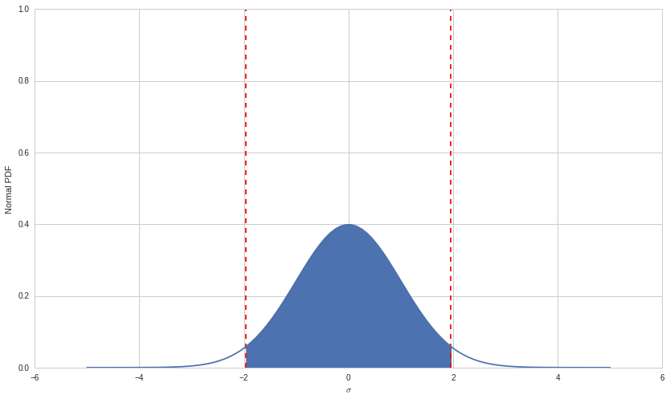

Tutorial: Confidence Intervals
==============================

By Delaney Granizo-Mackenzie, Jeremiah Johnson, and Gideon Wulfsohn

Part of the Quantopian Lecture Series:

http://www.quantopian.com/lectures

http://github.com/quantopian/research_public

Notebook released under the Creative Commons Attribution 4.0 License.

Sample Mean vs. Population Mean
-------------------------------

Sample means and population means are different. Generally, we want to
know about a population mean, but we can only calculate a sample mean.
We then want to use the sample mean to estimate the population mean. We
use confidence intervals in an attempt to determine how accurately our
sample mean estimates the population mean.

Confidence Interval
-------------------

If I asked you to estimate the average height of a woman in the USA, you
might do this by measuring 10 women and estimating that the mean of that
sample was close to the population. Let’s try that.

.. code:: ipython2

    import numpy as np
    import seaborn as sns
    from scipy import stats
    import matplotlib.pyplot as plt

.. code:: ipython2

    # We'll set a seed here so our runs are consistent
    np.random.seed(10)
    
    # Let's define some 'true' population parameters, we'll pretend we don't know these.
    POPULATION_MU = 64
    POPULATION_SIGMA = 5
    
    # Generate our sample by drawing from the population distribution
    sample_size = 10
    heights = np.random.normal(POPULATION_MU, POPULATION_SIGMA, sample_size)
    print heights
    mean_height = np.mean(heights)
    print 'sample mean: ', mean_height

.. parsed-literal::

    [ 70.65793252  67.57639487  56.27299854  63.95808075  67.10667987
      60.3995722   65.32755793  64.54274263  64.02145715  63.12699895]
    sample mean:  64.2990415407

Unfortunately simply reporting the sample mean doesn’t do much for us,
as we don’t know how it relates to the population mean. To get a sense
for how it might relate, we can look for how much variance there is in
our sample. Higher variance indicates instability and uncertainty.

.. code:: ipython2

    print 'sample standard deviation: ', np.std(heights)

.. parsed-literal::

    sample standard deviation:  3.75987801845

This still doesn’t do that much for us, to really get a sense of how our
sample mean relates to the population mean we need to compute a standard
error. The standard error is a measure of the variance of the sample
mean.

IMPORTANT
^^^^^^^^^

Computing a standard error involves assuming that the way you sample is
unbaised, and that the data are normal and independent. If these
conditions are violated, your standard error will be wrong. There are
ways of testing for this and correcting.

The formula for standard error is.

.. math:: SE = \frac{\sigma}{\sqrt{n}}

Where :math:`\sigma` is the sample standard deviation and :math:`n` is
the number of samples.

.. code:: ipython2

    SE = np.std(heights) / np.sqrt(sample_size)
    print 'standard error: ', SE

.. parsed-literal::

    standard error:  1.18897782627

There is a function in scipy’s stats library for calculating the
standard error. Note that this function by default contains a
degrees-of-freedom correction that is often not necessary (for large
enough samples, it is effectively irrelevant). You can omit the
correction by setting the parameter ddof to 0.

.. code:: ipython2

    stats.sem(heights, ddof=0)

.. parsed-literal::

    1.1889778262717268

Assuming our data are normally distributed, we can use the standard
error to compute our confidence interval. To do this we first set our
desired confidence level, say 95%, we then determine how many standard
deviations contain 95% of the mass. Turns out that the 95% of the mass
lies between -1.96 and 1.96 on a standard normal distribution. When the
samples are large enough (generally > 30 is taken as a threshold) the
Central Limit Theorem applies and normality can be safely assumed; if
sample sizes are smaller, a safer approach is to use a
:math:`t`-distribution with appropriately specified degrees of freedom.
The actual way to compute the values is by using a cumulative
distribution function (CDF). If you are not familiar with CDFs, inverse
CDFs, and their companion PDFs, you can read about them
`here <https://en.wikipedia.org/wiki/Probability_density_function>`__
and
`here <https://en.wikipedia.org/wiki/Cumulative_distribution_function>`__.
Look `here <https://en.wikipedia.org/wiki/Student%27s_t-distribution>`__
for information on the :math:`t`-distribution. We can check the 95%
number using one of the Python functions.

NOTE: Be careful when applying the Central Limit Theorem, however, as
many datasets in finance are fundamentally non-normal and it is not safe
to apply the theorem casually or without attention to subtlety.

We can visualize the 95% mass bounds here.

.. code:: ipython2

    # Set up the x axis
    x = np.linspace(-5,5,100)
    # Here's the normal distribution
    y = stats.norm.pdf(x,0,1)
    plt.plot(x,y)
    
    # Plot our bounds
    plt.vlines(-1.96, 0, 1, colors='r', linestyles='dashed')
    plt.vlines(1.96, 0, 1, colors='r', linestyles='dashed')
    
    # Shade the area
    fill_x = np.linspace(-1.96, 1.96, 500)
    fill_y = stats.norm.pdf(fill_x, 0, 1)
    plt.fill_between(fill_x, fill_y)
    
    plt.xlabel('$\sigma$')
    plt.ylabel('Normal PDF');

Here’s the trick
~~~~~~~~~~~~~~~~

Now, rather than reporting our sample mean without any sense of the
probability of it being correct, we can compute an interval and be much
more confident that the population mean lies in that interval. To do
this we take our sample mean :math:`\mu` and report
:math:`\left(\mu-1.96 SE , \mu+1.96SE\right)`.

This works because assuming normality, that interval will contain the
population mean 95% of the time.

SUBTLETY:
~~~~~~~~~

In any given case, the true value of the estimate and the bounds of the
confidence interval are fixed. It is incorrect to say that “The national
mean female height is between 63 and 65 inches with 95% probability,”
but unfortunately this is a very common misinterpretation. Rather, the
95% refers instead to the fact that over many computations of a 95%
confidence interval, the true value will be in the interval in 95% of
the cases (assuming correct calibration of the confidence interval,
which we will discuss later). But in fact for a single sample and the
single confidence interval computed from it, we have no way of assessing
the probability that the interval contains the population mean. The
visualization below demonstrates this.

In the code block below, there are two things to note. First, although
the sample size is sufficiently large to assume normality, we’re using a
:math:`t`-distribution, just to demonstrate how it is used. Second, the
:math:`t`-values needed (analogous to the :math:`\pm1.96` used above)
are being calculated from the inverted cumulative density function, the
ppf in scipy.stats. The :math:`t`-distribution requires the extra
parameter degrees of freedom (d.o.f), which is the size of the sample
minus one.

.. code:: ipython2

    np.random.seed(8309)
    n = 100 # number of samples to take
    samples = [np.random.normal(loc=0, scale=1, size=100) for _ in range(n)]
    
    fig, ax = plt.subplots(figsize=(10, 7))
    for i in np.arange(1, n, 1):
        sample_mean = np.mean(samples[i])  # calculate sample mean
        se = stats.sem(samples[i])  # calculate sample standard error
        h = se*stats.t.ppf((1+0.95)/2, len(samples[i])-1) # calculate t; 2nd param is d.o.f. 
        sample_ci = [sample_mean - h, sample_mean + h]
        if ((sample_ci[0] <= 0) and (0 <= sample_ci[1])):
            plt.plot((sample_ci[0], sample_ci[1]), (i, i), color='blue', linewidth=1);
            plt.plot(np.mean(samples[i]), i, 'bo');
        else:
            plt.plot((sample_ci[0], sample_ci[1]), (i, i), color='red', linewidth=1);
            plt.plot(np.mean(samples[i]), i, 'ro');
    plt.axvline(x=0, ymin=0, ymax=1, linestyle='--', label = 'Population Mean');
    plt.legend(loc='best');
    plt.title('100 95% Confidence Intervals for mean of 0');

.. image:: notebook_files/notebook_13_0.png

Further Reading
~~~~~~~~~~~~~~~

This is only a brief introduction, Wikipedia has excellent articles
detailing these subjects in greater depth. Let’s go back to our heights
example. Since the sample size is small, we’ll use a :math:`t`-test.

.. code:: ipython2

    # standard error SE was already calculated
    t_val = stats.t.ppf((1+0.95)/2, 9)  # d.o.f. = 10 - 1
    print 'sample mean height:', mean_height
    print 't-value:', t_val
    print 'standard error:', SE
    print 'confidence interval:', (mean_height - t_val * SE, mean_height + t_val * SE)

.. parsed-literal::

    sample mean height: 64.2990415407
    t-value: 2.26215716274
    standard error: 1.18897782627
    confidence interval: (61.609386834663141, 66.988696246744738)

There is a built-in function in scipy.stats for computing the interval.
Remember to specify the degrees of freedom.

.. code:: ipython2

    print '99% confidence interval:', stats.t.interval(0.99, df=9,
                                                       loc=mean_height, scale=SE)
    print '95% confidence interval:', stats.t.interval(0.95, df = 9, 
                                                       loc=mean_height, scale=SE)
    print '80% confidence interval:', stats.t.interval(0.8, df = 9, 
                                                       loc=mean_height, scale=SE)

.. parsed-literal::

    99% confidence interval: (60.43505913983995, 68.163023941567928)
    95% confidence interval: (61.609386834663141, 66.988696246744738)
    80% confidence interval: (62.654651037653949, 65.94343204375393)

Note that as your confidence increases, the interval necessarily widens.

Assuming normality, there’s also a built in function that will compute
our interval for us. This time you don’t need to specify the degrees of
freedom. Note that at a corresponding level of confidence, the interval
calculated using the normal distribution is narrower than the interval
calcuated using the :math:`t`-distribution.

.. code:: ipython2

    print stats.norm.interval(0.99, loc=mean_height, scale=SE)
    print stats.norm.interval(0.95, loc=mean_height, scale=SE)
    print stats.norm.interval(0.80, loc=mean_height, scale=SE)

.. parsed-literal::

    (61.236437614523354, 67.361645466884525)
    (61.968687822794635, 66.629395258613243)
    (62.775305146047593, 65.822777935360293)

What does this mean?
--------------------

Confidence intervals allow us to set our desired confidence, and then
report a range that will likely contain the population mean. The higher
our desired confidence, the larger range we report. In general, one can
never report a single point value, because the probability that any
given point is the true population mean is incredibly small. Let’s see
how our intervals tighten as we change sample size.

.. code:: ipython2

    np.random.seed(10)
    
    sample_sizes = [10, 100, 1000]
    for s in sample_sizes:
        heights = np.random.normal(POPULATION_MU, POPULATION_SIGMA, s)
        SE = np.std(heights) / np.sqrt(s)
        print stats.norm.interval(0.95, loc=mean_height, scale=SE)

.. parsed-literal::

    (61.968687822794635, 66.629395258613243)
    (63.343692029946574, 65.254391051461297)
    (64.00593339807287, 64.592149683335009)

Visualizing Confidence Intervals
--------------------------------

Here is some code to visualize a confidence interval on a graph. Feel
free to play around with it.

.. code:: ipython2

    sample_size = 100
    heights = np.random.normal(POPULATION_MU, POPULATION_SIGMA, sample_size)
    SE = np.std(heights) / np.sqrt(sample_size)
    (l, u) = stats.norm.interval(0.95, loc=np.mean(heights), scale=SE)
    
    print (l, u)
    
    plt.hist(heights, bins=20)
    plt.xlabel('Height')
    plt.ylabel('Frequency')
    
    # Just for plotting
    y_height = 5
    plt.plot([l, u], [y_height, y_height], '-', color='r', linewidth=4, label='Confidence Interval')
    plt.plot(np.mean(heights), y_height, 'o', color='r', markersize=10);

.. parsed-literal::

    (63.588854219913536, 65.573463595434731)

.. image:: notebook_files/notebook_24_1.png

Miscalibration and Violation of Assumptions
-------------------------------------------

The computation of a standard deviation, standard error, and confidence
interval all rely on certain assumptions. If these assumptions are
violated then the 95% confidence interval will not necessarily contain
the population parameter 95% of the time. We say that in this case the
confidence interval is miscalibrated. Here is an example.

Example: Autocorrelated Data
~~~~~~~~~~~~~~~~~~~~~~~~~~~~

If your data generating process is autocorrelated, then estimates of
standard deviation will be wrong. This is because autocorrelated
processes tend to produce more extreme values than normally distributed
processes. This is due to new values being dependent on previous values,
series that are already far from the mean are likely to stay far from
the mean. To check this we’ll generate some autocorrelated data
according to the following process.

.. math:: X_t = \theta X_{t-1} + \epsilon

.. math:: \epsilon \sim \mathcal{N}(0,1)

.. code:: ipython2

    def generate_autocorrelated_data(theta, mu, sigma, N):
        # Initialize the array
        X = np.zeros((N, 1))
        
        for t in range(1, N):
            # X_t = theta * X_{t-1} + epsilon
            X[t] = theta * X[t-1] + np.random.normal(mu, sigma)
        return X
    
    X = generate_autocorrelated_data(0.5, 0, 1, 100)
    
    plt.plot(X);
    plt.xlabel('t');
    plt.ylabel('X[t]');

.. image:: notebook_files/notebook_27_0.png

It turns out that for larger sample sizes, you should see the sample
mean asymptotically converge to zero. This is because the process is
still centered around zero, but let’s check if that’s true. We’ll vary
the number of samples drawn, and look for convergence as we increase
sample size.

.. code:: ipython2

    sample_means = np.zeros(200-1)
    for i in range(1, 200):
        X = generate_autocorrelated_data(0.5, 0, 1, i * 10)
        sample_means[i-1] = np.mean(X)
        
    plt.bar(range(1, 200), sample_means);
    plt.xlabel('Sample Size');
    plt.ylabel('Sample Mean');

.. image:: notebook_files/notebook_29_0.png

Definitely looks like there’s some convergence, we can also check what
the mean of the sample means is.

.. code:: ipython2

    np.mean(sample_means)

.. parsed-literal::

    -0.0085719962029766478

Pretty close to zero. We could also derive symbolically that the mean is
zero, but let’s assume that we’ve convinced ourselves with the simple
empiral analysis. Now that we know the population mean, we can check the
calibration of confidence intervals. First we’ll write two helper
functions which compute a naive interval for some input data, and check
whether the interval contains the true mean, 0.

.. code:: ipython2

    def compute_unadjusted_interval(X):
        T = len(X)
        # Compute mu and sigma MLE
        mu = np.mean(X)
        sigma = np.std(X)
        SE = sigma / np.sqrt(T)
        # Compute the bounds
        return stats.norm.interval(0.95, loc=mu, scale=SE)
    
    # We'll make a function that returns true when the computed bounds contain 0
    def check_unadjusted_coverage(X):
        l, u = compute_unadjusted_interval(X)
        # Check to make sure l <= 0 <= u
        if l <= 0 and u >= 0:
            return True
        else:
            return False

Now we’ll run many trials, in each we’ll sample some data, compute a
confidence interval, and then check if the confidence interval contains
the population mean. We’ll keep a running tally, and we should expect to
see 95% of the trials succeed if the intervals are calibrated correctly.

.. code:: ipython2

    T = 100
    trials = 500
    times_correct = 0
    for i in range(trials):
        X = generate_autocorrelated_data(0.5, 0, 1, T)
        if check_unadjusted_coverage(X):
            times_correct += 1
        
    print 'Empirical Coverage: ', times_correct/float(trials)
    print 'Expected Coverage: ', 0.95

.. parsed-literal::

    Empirical Coverage:  0.732
    Expected Coverage:  0.95

Clearly the coverage is wrong. In this case we’d need to do what’s known
as a Newey-West correction on our standard error estimate to account for
the autocorrelation. In practice it’s important to check for the
assumptions you make. It is quick and easy to check if your data are
stationary (which implies not autocorrelated), and it can save you a lot
of pain and suffering to do so. A normality test such as ``Jarque Bera``
will also be a good idea, as it may detect certain distribution
properties which may violate assumptions of many following statistical
analyses.

*This presentation is for informational purposes only and does not
constitute an offer to sell, a solicitation to buy, or a recommendation
for any security; nor does it constitute an offer to provide investment
advisory or other services by Quantopian, Inc. (“Quantopian”). Nothing
contained herein constitutes investment advice or offers any opinion
with respect to the suitability of any security, and any views expressed
herein should not be taken as advice to buy, sell, or hold any security
or as an endorsement of any security or company. In preparing the
information contained herein, Quantopian, Inc. has not taken into
account the investment needs, objectives, and financial circumstances of
any particular investor. Any views expressed and data illustrated herein
were prepared based upon information, believed to be reliable, available
to Quantopian, Inc. at the time of publication. Quantopian makes no
guarantees as to their accuracy or completeness. All information is
subject to change and may quickly become unreliable for various reasons,
including changes in market conditions or economic circumstances.*
