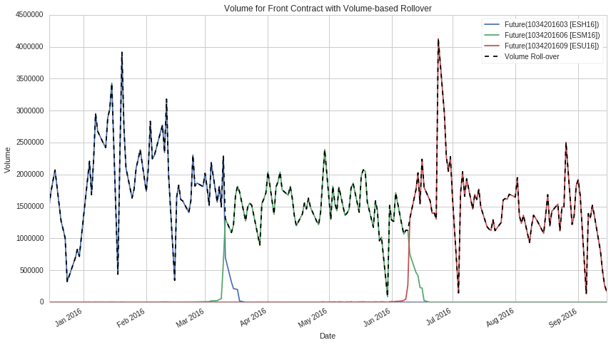

Futures Trading Considerations
==============================

by Maxwell Margenot and Delaney Mackenzie

Part of the Quantopian Lecture Series:

-  `www.quantopian.com/lectures <https://www.quantopian.com/lectures>`__
-  `github.com/quantopian/research_public <https://github.com/quantopian/research_public>`__

In this lecture we will consider some practical implications for trading
futures contracts. We will discuss the futures calendar and how it
impacts trading as well as how to maintain futures positions across
expiries.

.. code:: ipython2

    import numpy as np
    import pandas as pd
    import matplotlib.pyplot as plt
    from quantopian.research.experimental import continuous_future, history

Futures Calendar
----------------

An important feature of futures markets is the calendar used to trade
them. Futures markets are open long after the equity markets close,
though the effective periods within which you can trade with large
amounts of liquidity tend to overlap. The specific high points in volume
for futures contracts vary greatly from underlying to underlying.
Despite this, the majority of the volume for many contracts typically
falls within normal EST market hours.

Let’s have a look at a day in the life of the S&P 500 Index E-Mini
futures contract that was deliverable in March 2017.

.. code:: ipython2

    contract = symbols('ESH17')
    one_day_volume = get_pricing(contract, start_date='2017-02-01', end_date='2017-02-01', frequency='minute', fields='volume')

.. code:: ipython2

    one_day_volume.tz_convert('EST').plot()
    plt.title('Trading Volume for 3/01/2017 by Minute')
    plt.xlabel('Minute')
    plt.ylabel('Volume');

.. image:: notebook_files/notebook_4_0.png

This is one of the most liquid futures contracts and we see this
significant increase in volume traded during normal equity trading
hours. These hours can be even more tight for less liquid commodities.
For example, let’s look at how Feeder Cattle trades during the same time
period on the same day.

.. code:: ipython2

    contract = 'FCH17'
    one_day_volume = get_pricing(contract, start_date='2017-02-01', end_date='2017-02-01', frequency='minute', fields='volume')

.. code:: ipython2

    one_day_volume.tz_convert('EST').plot()
    plt.title('Trading Volume for 3/01/2017 by Minute')
    plt.xlabel('Minute')
    plt.ylabel('Volume');

.. image:: notebook_files/notebook_7_0.png

If we are trying to trade multiple different underlyings with futures
contracts in the same algorithm, we need to be conscious of their volume
relative to each other. All trading algorithms are dependent on orders
being executed as determined by their calculations. Some contracts are
so illiquid that entering into even the smallest position will amount to
becoming a large part of the volume for a given day. This could heavily
impact slippage

Unsurprisingly, volume will also vary for different expiries on the same
underlying. The front month contract, the contract closest to delivery,
has the largest amount of volume. As we draw closer to delivery the
front month’s volume is eclipsed by the next expiry date as participants
in the market close out their positions and roll them forward.

.. code:: ipython2

    contracts = symbols(['ESH16', 'ESM16', 'ESU16'])
    rolling_volume = get_pricing(contracts, start_date='2015-12-15', end_date='2016-09-15', fields='volume')

.. code:: ipython2

    rolling_volume.plot()
    plt.title('Volume for Different Expiries of same Underlying')
    plt.xlabel('Date')
    plt.ylabel('Volume');

.. image:: notebook_files/notebook_10_0.png

Futures Positions Have Inherent Leverage
----------------------------------------

In entering a futures position, you place down a certain amount of
capital in a margin account. This margin account is exposed to the
fluctuating futures price of the underlying that you have chosen. This
creates a levered position off the bat as the value that you are exposed
to (before delivery) in the account is different from the overall value
that is on the hook at delivery.

This internal leverage is determined on a contract to contract basis due
to the different multipliers involved for different underlyings.

Roll-over
---------

If we want to maintain a futures position across expiries, we need to
“roll over” our contracts. This is the practice of switching to the next
month’s contract after closing your previous holding. The majority of
futures positions are either closed or rolled over before ever reaching
delivery.

The futures contract with expiry closest to the current date is known as
the “front month” contract. It usually enjoys the smallest spread
between futures and spot prices as well as the most liquidity. In
contrast, the futures contract that has the furthest expiration date in
a set of contracts is known as the “back month” contract. Contracts that
are further out have significantly less liquidity, though they still may
contain vague information about future prices anticipated by the market.

By rolling forward our positions, we can maintain a hedge on a
particular underlying or simply maintain a position across time. Without
rolling contracts over we would be required to develop trading
strategies that work only on a short timescale.

This graph illustrates the volume that results from rolling over
contracts on the first date where the front month contract’s volume is
eclipsed by the following month on the same underlying.

.. code:: ipython2

    maximum_any_day_volume = rolling_volume.max(axis=1)
    maximum_any_day_volume.name = 'Volume Roll-over'
    rolling_volume.plot()
    maximum_any_day_volume.plot(color='black', linestyle='--')
    plt.title('Volume for Front Contract with Volume-based Rollover')
    plt.xlabel('Date')
    plt.ylabel('Volume')
    plt.legend();

In this particular instance, our goal is to ride the wave of liquidity
provided by the front contract.

Continuous Futures
------------------

With futures, it is difficult to get a continuous series of historical
prices. Each time that you roll forward to a new contract, the price
series incurs a jump. This jump negatively impacts our analysis of
prices as the discontinuity introduces shocks in our return and
volatility measures that may not be representative of the actual changes
in the underlying.

We use the continuous futures objects as part of the platform to get a
continuous chain of historical data for futures contracts, taking these
concerns into account. There are several ways to adjust for the cost of
carry when looking at historical data, though people differ on what they
prefer. The general consensus is that an adjustment should be done.

We can have a continuous future “roll” forward either based on calendar
dates or based on the shift in volume from the front month contract to
the next. The ``ContinuousFuture`` object is not a tradable asset,
however. It is an API construct that abstracts the chain of consecutive
contracts for the same underlying. They maintain ongoing references to
the active contract in the chain and make it easier to to maintain a
dynamic reference to contracts that you want to order as well as to get
historical series of data, all based on your chosen method of adjustment
and your desired roll method.

.. code:: ipython2

    continuous_corn = continuous_future('CN', offset=0, roll='calendar', adjustment='mul')

The above defined continuous future has an ``offset`` of :math:`0`,
indicating that we want it to reference the front month contract at each
roll. Incrementing the offset causes the continuous future to instead
monitor the contract that is displaced from the front month by that
number.

Adjustments
~~~~~~~~~~~

We can define a continuous future to use multiplicative adjustments,
additive adjustments, or no adjustments (``'mul'``, ``'add'``,
``None``). The cost of carry that is realized as we shift from one
contract to the next can be seen as the shock from a dividend payment.
Adjustments are important to frame past prices relative to today’s
prices by including the cost of carry. Additive adjustments close the
gaps betwen contracts by simply taking the differences and aggregating
those back, while multiplicative adjustments scale previous prices using
a ratio to close the gap.

.. code:: ipython2

    continuous_corn_price = history(continuous_corn, start_date='2009-01-01', end_date='2016-01-01', fields='price')

.. code:: ipython2

    continuous_corn_price.plot();

.. image:: notebook_files/notebook_20_0.png

Once we have a continuous time series of prices we can conduct
meaningful statistical analysis to form a foundation for our research.

Fewer Assets
------------

There are around 8000 equities in the US market, but there are far fewer
futures contracts, especially those with enough liquidity to trade. We
can make up for this by trading different expiries on the same
underlying, though we need to ensure that we are conducting rigorous
testing to ensure that our resulting signals are viable in the market
given the potential liquidity constraints that come with not trading the
front month.

*This presentation is for informational purposes only and does not
constitute an offer to sell, a solicitation to buy, or a recommendation
for any security; nor does it constitute an offer to provide investment
advisory or other services by Quantopian, Inc. (“Quantopian”). Nothing
contained herein constitutes investment advice or offers any opinion
with respect to the suitability of any security, and any views expressed
herein should not be taken as advice to buy, sell, or hold any security
or as an endorsement of any security or company. In preparing the
information contained herein, Quantopian, Inc. has not taken into
account the investment needs, objectives, and financial circumstances of
any particular investor. Any views expressed and data illustrated herein
were prepared based upon information, believed to be reliable, available
to Quantopian, Inc. at the time of publication. Quantopian makes no
guarantees as to their accuracy or completeness. All information is
subject to change and may quickly become unreliable for various reasons,
including changes in market conditions or economic circumstances.*
