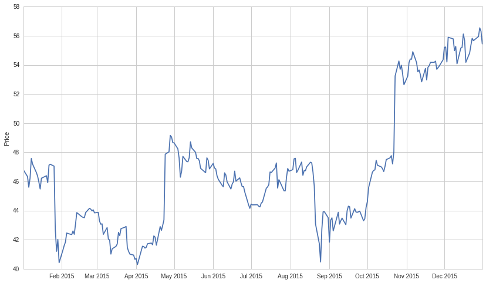
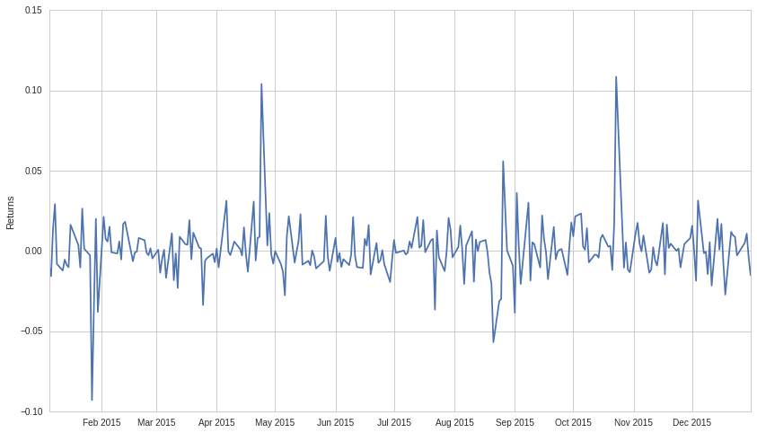
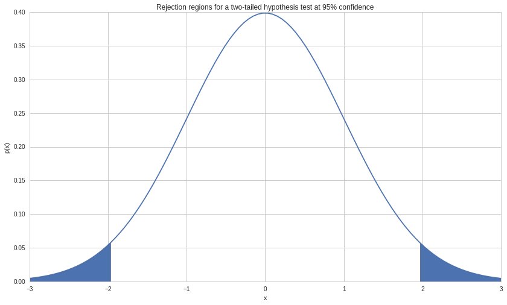
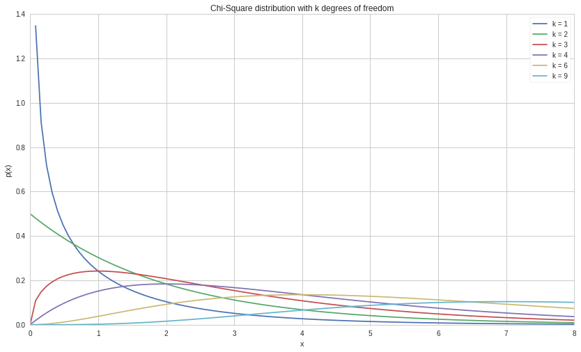

Hypothesis Testing
==================

by Maxwell Margenot and Delaney Granizo-Mackenzie. Review by Gilbert
Wasserman.

Part of the Quantopian Lecture Series:

-  `www.quantopian.com/lectures <https://www.quantopian.com/lectures>`__
-  `github.com/quantopian/research_public <https://github.com/quantopian/research_public>`__

Statistical inference, the practice of making predictions about a large
group based on smaller samples, is traditionally broken into two
segments, **estimation** and **hypothesis testing**. Estimation provides
values for specific things that you may be interested in, such as mean
or variance, with a provided confidence interval. A confidence interval
provides a region within which you can expect to find the true value of
the parameter you estimated, as an estimation will almost never be
exact. Confidence intervals use a set confidence level to choose how
wide the interval should be, to achieve a higher confidence, we must
report a wider interval. For more information please see the `Confidence
Intervals
lecture <https://www.quantopian.com/lectures/confidence-intervals>`__
from the Quantopian Lecture Series.

For example, we might estimate a sample mean as :math:`100`, with a
confidence interval of :math:`90, 110` at a :math:`95\%` confidence
level. This doesn’t mean that the true population mean is between
:math:`90` and :math:`110` with :math:`95\%` probability, as the true
mean is a fixed value and the probability is :math:`100\%` or
:math:`0\%` but we don’t know which one. Instead what this means is that
over many computations of a :math:`95\%` confidence interval assuming
underlying assumptions about distributions hold, the population mean
will be in the interval :math:`95\%` of the time.

This gives us an idea of the specific characteristics that an overall
population may exhibit, given a sample. Hypothesis testing provides a
different focus, detailing a framework for statistical testing of
hypothesized values. By making an assertion of what a value should be,
you create a testable hypothesis.

One thing to keep in mind is that statistical tests are designed such
that if all the pre-requisite conditions are true, you should get the
right answer about the data a certain percentage of the time. When you
accept a hypothesis as true based on a test, that doesn’t mean it’s
definitely true. It just means that you can know the probability you are
wrong.

##The Null and Alternative Hypothesis

The first thing we need to introduce is the null hypothesis, commonly
written as :math:`H_0`. The null hypothesis is the default case,
generally reflecting the current common conception of the world. The
alternative hypothesis is the one you are testing.

###Examples

The alternative hypothesis :math:`H_A` is that you own more than 10
pairs of shoes. The null hypothesis :math:`H_0` is that you do not own
more than 10 pairs of shoes.

The alternative hypothesis :math:`H_A` is that eating pizza is related
with obesity. The null hypothesis :math:`H_0` is that it is not.

The alternative hypothesis :math:`H_A` is that microsoft’s mean returns
> 0. The null hypothesis :math:`H_0` is that they <= 0.

###Difficulty of Testing

Some hypotheses are easier to test than others. For instance the
alternative hypothesis, “I own more than 10 pairs of shoes.” and the
accompanying null hypothesis that you do not, is easily tested by
counting the number of pairs you own. However, you will still not get a
perfect answer all the time in this case, as there may be measurement
error in the counting, albiet quite small.

On the other hand, the hypothesis, “The number of insect species is
greater than the number of stars in the universe.” would be more
difficult to test and require lots of data gathering.

###Hypotheses Must be Testable

A hypothesis cannot be vague, otherwise how will it be tested. For
example, “Momentum trading is a good way to make money.” is not really
testable. What does ‘good’ mean? What type of momentum trading are we
discussing? Hypotheses should be very specific and the type of test
needed should follow quickly from the hypothesis.

How to Perform Hypothesis Testing
---------------------------------

The following are the main steps in hypothesis testing:

1. State the hypothesis and the alternative to the hypothesis
2. Identify the appropriate test statistic and its distribution. Ensure
   that any assumptions about the data are met (stationarity, normality,
   etc.)
3. Specify the significance level, :math:`\alpha`
4. From :math:`\alpha` and the distribution compute the ‘critical
   value’.
5. Collect the data and calculate the test statistic
6. Compare test statistic with critical value and decide whether to
   accept or reject the hypothesis.

First we state the hypothesis that we wish to test. We do this by
identifying a **null hypothesis** and an **alternative hypothesis**. The
null hypothesis, :math:`H_0`, is the one that we want to test, while the
alternative hypothesis, :math:`H_A`, is the hypothesis that is accepted
in the case where :math:`H_0` is rejected.

Let’s say that we want to test whether the mean return of Microsoft
stock is positive. The parameter that we are testing is denoted by
:math:`\theta` and the proposed value of the parameter is denoted by
:math:`\theta_0`, which in this case is equal to :math:`0`. So we say
that our :math:`H_0` is :math:`\theta = \theta_0`, that the returns are
negative, and our :math:`H_A` is :math:`\theta \neq \theta_0`. Including
this formation, there are three possible ways to formulate null and
alternative hypotheses:

1. :math:`H_0: \theta = \theta_0` versus
   :math:`H_A: \theta \neq \theta_0` (A “not equal to” alternative
   hypothesis)
2. :math:`H_0: \theta \leq \theta_0` versus
   :math:`H_A: \theta > \theta_0` (A “greater than” alternative
   hypothesis)
3. :math:`H_0: \theta \geq \theta_0` versus
   :math:`H_A: \theta < \theta_0` (A “less than” alternative hypothesis)

In this case, where we are testing the returns of MSFT,
:math:`\theta = \mu_{MSFT}`, representing the stock’s mean returns.
Since we are testing whether the returns are positive or negative, we
have that :math:`\theta_0 = 0`. Our example follows the first
formulation of a hypothesis test. This is a **two-sided hypothesis
test** (or **two-tailed hypothesis test**). The second and third
formulations are examples of a **one-sided hypothesis test** (or
**one-tailed hypothesis test**). With a one-sided test, we reject the
null in favor of the alternative only if the data indivates that
:math:`\theta` is repectively greater than or less than
:math:`\theta_0`. A two-sided test rejects the null in favor of the
alternative if the data indicates that :math:`\theta` is either greater
or less than :math:`\theta_0`.

So if we were to write out our hypothesis for MSFT in more qualitative
terms, we would have:

:raw-latex:`\begin{eqnarray}
H_0 &:& \text{The mean return on Microsoft stock is $0$}\\
H_A &:& \text{The mean return on Microsoft stock is not $0$}
\end{eqnarray}`

When forming a hypothesis test, the null and alternative hypothesis must
be complementary to each other. Between them they must cover all values
of :math:`\theta`. Regardless of the type of hypothesis test we are
performing, we always test the null hypothesis as if
:math:`\theta = \theta_0`. In the case of either of the one-tailed
tests, this will still provide more than enough evidence for us to make
a decision. For example, if :math:`H_0: \theta \leq 0`,
:math:`H_A: \theta > 0`, and we have enough evidence to reject
:math:`H_0: \theta = 0` in favor of :math:`H_A: \theta > 0`, then this
holds true for all values less than :math:`0` as well.

The most common type of hypothesis test is the two-tailed, “not equal
to”, hypothesis test, because it presents a neutral view. The one-tailed
hypothesis tests are less neutral than the “not equal to” test,
reflecting the thoughts of the tester. One-tailed tests are often used
to test “hoped for” results or results that the testers have a prior
idea about.

.. code:: ipython2

    import pandas as pd
    import numpy as np
    import matplotlib.pyplot as plt

Let’s get some data.

.. code:: ipython2

    start = "2015-01-01"
    end = "2016-01-01"
    pricing_sample = get_pricing("MSFT", start_date = start, end_date = end, fields = 'price')
    
    #transform it into returns
    returns_sample = pricing_sample.pct_change()[1:]
    
    # plot it
    plt.plot(pricing_sample.index, pricing_sample.values)
    plt.ylabel('Price');

Here are the returns.

.. code:: ipython2

    plt.plot(returns_sample.index, returns_sample.values)
    plt.ylabel('Returns');

##Why is this all necessary?

Why can’t we just take the mean returns of microsoft and check if
they’re > 0? Because we can’t look at the actual data generating process
behind the returns, we can only sample returns on some limited time
period. Because we only observe a sample, that sample may or may not
reflect the true state of the underlying process. Because of this
uncertainty we need to use statistical tests.

Next, we identify the appropriate **test statistic** and its probability
distribution. A test statistic usually takes the following form:

.. math::  \text{Test statistic} = \frac{\text{Sample statistic} - \text{Value of the population parameter under $H_0$ ($\theta_0$)}}{\text{Standard error of the sample statistic}} 

A test statistic is calculated based on sample data and is compared to
its probability distribution to determine whether to reject or not
reject the null hypothesis. Since we are testing the mean return on MSFT
stock, we can use the sample mean, :math:`\bar{X}_\mu`, as our sample
statistic. We calculate the standard error of the sample mean as
:math:`\sigma_{\bar{X}} = \frac{\sigma}{\sqrt{n}}` if we know the
standard deviation, :math:`\sigma`, or as
:math:`s_{\bar{X}} = \frac{s}{\sqrt{n}}`, where :math:`s` is the sample
standard deviation. So using these definitions, our test statistic can
be calculated as:

.. math::  \frac{\bar{X}_\mu - \theta_0}{s_{\bar{X}}} = \frac{\bar{X}_\mu - 0}{s/\sqrt{n}} 

The four most common distributions for test statistics are as follows:

-  The :math:`t`-distribution (:math:`t`-test)
-  The standard normal distribution (:math:`z`-test)
-  The chi-square (:math:`\chi^2`) distribution (:math:`\chi^2`-test)
-  The :math:`F`-distribution (:math:`F`-test)

We will cover them in detail later. For now, we will say that we can use
a :math:`z`-test with our assumptions in the MSFT example.

After we identify the appropriate test statistic and probability
distribution, we need to specify the **significance level** of the test,
:math:`\alpha`. The values that we compare our test statistic to in
order to reject or fail to reject the :math:`H_0` are determined based
on our :math:`\alpha` value.

======================================= ================
=================
\                                       True Situation  
======================================= ================
=================
**Decision**                            :math:`H_0` True :math:`H_0` False
Do not reject :math:`H_0`               Correct Decision Type II Error
Reject :math:`H_0` (accept :math:`H_A`) Type I Error     Correct Decision
======================================= ================
=================

Our significance level is equal to the probability of a Type I error (a
“false positive”) occuring. The probability of a Type II error (a “false
negative”) occuring is denoted by :math:`\beta`. If we try to decrease
the probability of a Type I error occuring, we increase the probability
of a Type II error occuring, resulting in a tradeoff. The only way to
reduce the probability of both a Type I and a Type II error occuring is
to increase the sample size.

The conventional significance levels are :math:`0.1`, :math:`0.05`, and
:math:`0.01`. Rejecting the null at :math:`0.1` mean that we have some
evidence null is false, :math:`0.05` means we have strong evidence null
is false, rejecting at :math:`0.01` we have very strong evidence that
null is false.

Critical Value
~~~~~~~~~~~~~~

Now we figure out our critical value, or, rejection point. The critical
value for our test statistic is the value that we compare the test
statistic to when deciding whether to reject the null hypothesis. If we
reject the null, we say that the result is **statistically
significant**, while if we fail to reject the null, we say that the
result is **not statistically significant**.

We compare our test statistic to a **critical value** in order to decide
whether to reject or not reject the null hypothesis. The critical value
of a test is determined based on the :math:`\alpha` of our hypothesis
test as well as the chosen distribution. In our case, say that
:math:`\alpha = 0.05`, so our significance level is :math:`0.05`. With a
one-sided :math:`z`-test, there are two different ways to see the
critical values:

-  If we test :math:`H_0`: :math:`\theta \leq \theta_0`, :math:`H_A`:
   :math:`\theta > \theta_0` at :math:`\alpha = 0.05`, our critical
   value is :math:`z_{0.05} = 1.645`. So we compare our test statistic
   and we reject the null hypothesis if :math:`z > 1.645`.
-  If we test :math:`H_0`: :math:`\theta \geq \theta_0`, :math:`H_A`:
   :math:`\theta < \theta_0` at :math:`\alpha = 0.05`, our critical
   value is :math:`-z_{0.05} = -1.645`. As such, we compare our test
   statistic and we reject the null hypothesis if :math:`z < -1.645`.

A two-sided test is a slightly different situation. Since it is
two-sided, there are two rejection points, negative and positive. Our
:math:`\alpha` is :math:`0.05`, so the total probability of a Type I
error must sum to :math:`0.05`. As such, we split :math:`0.05` in half
so that our two rejection points are :math:`z_{0.025}` and
:math:`-z_{0.025}` for the positive and negative critical values,
respectively. For a :math:`z`-test, these values are :math:`1.96` and
:math:`-1.96`. Thus, we reject the null if :math:`z < -1.96` or if
:math:`z > 1.96`. If we find that :math:`-1.96 \leq z \leq 1.96`, we
fail to reject the null.

When conducting a hypothesis test, you can also use a
**:math:`p`-value** to determine the result. A :math:`p`-value is the
minimum level of significance where you can reject the null hypothesis.
Often people will interpret :math:`p`-values as the “probability that
the null hypothesis is false”, but this is misleading. A :math:`p`-value
only makes sense when compared to the significance value. If a
:math:`p`-value is less than :math:`\alpha`, we reject the null and
otherwise we do not. Lower :math:`p`-values do not make something “more
statistically significant”. A lot of statistical outputs will calculate
a :math:`p`-value for you, but it is also possible to calculate it
manually. The calculation depends both on your type of hypothesis test
and the CDF (covered in the `random variables
lecture <https://www.quantopian.com/lectures/random-variables>`__) of
the distribution you are working with. To manually calculate a
:math:`p`-value, do the following:

-  In a ‘less than or equal to’ hypothesis test, the :math:`p`-value is
   :math:`1 - CDF(\text{Test Statistic})`
-  In a ‘greater than or equal to’ hypothesis test, the :math:`p`-value
   is :math:`CDF(\text{Test Statistic})`
-  In a ‘not equal to’ hypothesis test, the :math:`p`-value is
   :math:`2 * 1 - CDF(|\text{Test Statistic}|)`

Significance values tie very nicely into confidence intervals, which are
covered more in-depth in our `confidence intervals
lecture <https://www.quantopian.com/lectures/confidence-intervals>`__. A
confidence interval provides us with an estimate for a parameter’s
possible range in values given a certain significance level. For
example, if our :math:`99\%` confidence interval for the mean of MSFT
returns was :math:`(-0.0020, 0.0023)`, that would mean that there was a
:math:`99\%` chance that the true value of the mean was within that
interval.

.. code:: ipython2

    # Plot a standard normal distribution and mark the critical regions with shading
    x = np.linspace(-3, 3, 100)
    norm_pdf = lambda x: (1/np.sqrt(2 * np.pi)) * np.exp(-x * x / 2)
    y = norm_pdf(x)
    
    fig, ax = plt.subplots(1, 1, sharex=True)
    ax.plot(x, y)
    ax.fill_between(x, 0, y, where = x > 1.96)
    ax.fill_between(x, 0, y, where = x < -1.96)
    plt.title('Rejection regions for a two-tailed hypothesis test at 95% confidence')
    plt.xlabel('x')
    plt.ylabel('p(x)');

Now we collect the relevant data for our test and calculate the test
statistic for a two sided, :math:`5\%` significance test. Keep in mind
that any negative characteristics of the data will negatively affect our
hypothesis test and possibly render it invalid. In the case of our test
of MSFT returns, we may run into issues of time-period bias, or of
look-ahead bias (if we prepare the test incorrectly). As always with
historical data, the data that we work with may result in a specific
test result that may not hold for the future. We also have to make sure
that the data does not include any values that we would not have known
during the time period we are testing (though this is more of an issue
when comparing multiple things with hypothesis tests).

Here we calculate the test statistic:

.. code:: ipython2

    n = len(returns_sample)
    test_statistic = ((returns_sample.mean() - 0) /
                    (returns_sample.std()/np.sqrt(n)))
    print 't test statistic: ', test_statistic

.. parsed-literal::

    t test statistic:  0.740593955141

In order to make the statistical decision for the test, we compare our
test statistic to our critical value. Our test statistic as stated above
is between the two critical values for a 95% two-tailed :math:`z`-test
so in this example we **fail to reject** our :math:`H_0`, our hypothesis
that MSFT returns are **not** :math:`0`.

If we chose instead to determine the result of this hypothesis test with
a :math:`p`-value, we would calculate the :math:`p`-value in the
following way:

.. code:: ipython2

    from scipy.stats import t

.. code:: ipython2

    p_val = 2 * (1 - t.cdf(test_statistic, n - 1))
    print 'P-value is: ', p_val

.. parsed-literal::

    P-value is:  0.459634667217

Because the :math:`p`-value is greater than our significance level,
:math:`\alpha = 0.05`, we **fail to reject** the null hypothesis.

After we make the statistical decision, we have to translate it into
real life. Oftentimes this may be difficult to act upon directly, but
the results can have other implications. In the case of our example, we
have found that the daily returns of Microsoft in 2015 were not
significantly different from :math:`0`.

Hypothesis Testing on Means
---------------------------

A :math:`z`-distribution, or a standard normal distribution, is an
essential probability distribution in finance. We like it when things
are normally distributed because it entails many useful properties. On
top of this, many fundamental methods require an assumption of normality
in order to proceed. However, in most cases a :math:`z`-distribution
will be inappropriate for our data. We rarely know the true parameter
values (mean and variance) of our data and must rely upon
approximations. In these cases, we should use the
:math:`t`-distribution, and approximation of the normal distribution.
The :math:`t`-distribution is more forgiving when it comes to small
sample sizes and is meant to be used with sample mean and variance. It
has fatter tails and a lower peak, giving more flexibility compared to a
normal distribution.

Both the :math:`t` and :math:`z`-distributions rely upon an underlying
assumption of normality, which is typically the case when we are
analyzing financial data. As such, in addition to testing individual
means, it makes sense to use them to compare between two or more mean
values. We can use a hypothesis test to determine whether the means of
several data-sets are statistically different from one another. Here, we
will use a :math:`t`-distribution to demonstrate. We will compare the
mean returns of the S&P500 and Apple stock with a hypothesis test to see
if the differences are statistically significant or not.

.. code:: ipython2

    symbol_list = ["SPY", "AAPL"]
    start = '2015-01-01'
    end = '2016-01-01'
    pricing_sample = get_pricing(symbol_list, start_date = start, end_date = end, fields='price')
    pricing_sample.columns = map(lambda x: x.symbol, pricing_sample.columns)
    returns_sample = pricing_sample.pct_change()[1:]
    returns_sample.plot()
    plt.ylabel('Returns');

.. image:: notebook_files/notebook_23_0.png

While these returns look to have the same mean, we still don’t have
enough evidence to say for sure. We use a hypothesis test to ground our
suspicions in a statistical basis.

When comparing two means, our hypothesis tests are stated as the
following:

1. :math:`H_0: \mu_1 - \mu_2 = \theta_0, \ H_A: \mu_1 - \mu_2 \neq \theta_0`
2. :math:`H_0: \mu_1 - \mu_2 \leq \theta_0, \ H_A: \mu_1 - \mu_2 > \theta_0`
3. :math:`H_0: \mu_1 - \mu_2 \geq \theta_0, \ H_A: \mu_1 - \mu_2 < \theta_0`

Where :math:`\mu_1, \mu_2` are the respective means of SPY and AAPL and
:math:`\theta_0` is the parameter we are testing. We will use the first
hypothesis test to test the equality of the two returns. If we assume
that the population variances are equal, our test statistic is
calculated as:

.. math::  t = \frac{(\bar{X}_1 - \bar{X}_2) - (\mu_1 - \mu_2)}{(\frac{s_p^2}{n_1} + \frac{s_p^2}{n_2})^{1/2}} = \frac{\bar{X}_1 - \bar{X}_2}{(\frac{s_p^2}{n_1} + \frac{s_p^2}{n_2})^{1/2}}

With
:math:`s_p^2 = \frac{(n_1 - 1)s_1^2 + (n_2 - 1)s_2^2)}{n_1 + n_2 - 2}`
as the estimator of the common variance, known as the pooled variance,
and :math:`n_1 + n_2 - 2` as the number of degrees of freedom
(:math:`n_1 - 1` and :math:`n_2 - 1` for each dataset). A typical
:math:`t`-test on a mean assumes that all variances involved are equal
with underlying normal distributions. If we are assuming that the
variances are not equal, we have to calculate our test statistic
differently. Our test statistic in this case is:

.. math::  t = \frac{(\bar{X}_1 - \bar{X}_2) - (\mu_1 - \mu_2)}{(\frac{s_1^2}{n_1} + \frac{s_2^2}{n_2})^{1/2}} = \frac{\bar{X}_1 - \bar{X}_2}{(\frac{s_1^2}{n_1} + \frac{s_2^2}{n_2})^{1/2}}

Where the number of degrees of freedom used to find the critical
statistic is the modified degrees of freedom, the number of values that
are free to vary,
:math:`df = \frac{(\frac{s_1^2}{n_1} + \frac{s_2^2}{n_2})^2}{\frac{(s_1^2/n_1)^2}{n_1} + \frac{(s_2^2/n_2)^2}{n_2}}`.
This preserves the underlying normality of the data being tested while
accounting for differing variances. Calculating the statistic this way
removes a lot of problems that can occur if we have unequal variances,
especially if the sample sizes of the underlying data differ as well.
This specific case of a :math:`t`-test is referred to as `“Welch’s
unequal variances
:math:`t`-test” <https://en.wikipedia.org/wiki/Welch%27s_t-test>`__.

For this example, we are assuming that the variances of SPY and AAPL
returns are different. We think that AAPL will be riskier than SPY so we
will use the second formulation of the test statistic. Let’s say that
:math:`\alpha = 0.05` so we are computing a :math:`95\%` hypothesis
test.

.. code:: ipython2

    # Sample mean values
    mu_spy, mu_aapl = returns_sample.mean()
    s_spy, s_aapl = returns_sample.std()
    n_spy = len(returns_sample['SPY'])
    n_aapl = len(returns_sample['AAPL'])
    
    test_statistic = ((mu_spy - mu_aapl) - 0)/((s_spy**2/n_spy) + (s_aapl**2/n_aapl))**0.5
    df = ((s_spy**2/n_spy) + (s_aapl**2/n_aapl))**2/(((s_spy**2 / n_spy)**2 /n_spy)+((s_aapl**2 / n_aapl)**2/n_aapl))
    
    print 't test statistic: ', test_statistic
    print 'Degrees of freedom (modified): ', df

.. parsed-literal::

    t test statistic:  0.023740009212
    Degrees of freedom (modified):  405.251211662

Looking at a
`t-table <https://en.wikipedia.org/wiki/Student%27s_t-distribution#Table_of_selected_values>`__,
we determine that the critical values for our two-sided hypothesis test
are :math:`-1.96` and :math:`1.96`. Our test statistic is between these
values so we **fail to reject** the null hypothesis and determine that
the difference between SPY and AAPL returns is **not** significantly
different from :math:`0`.

Hypothesis Testing on Variances
-------------------------------

If we want to test the variances of populations, we need to use a
different distribution from the :math:`t` and :math:`z` distributions.
Variances must by definition be greater than (or equal to) :math:`0` and
fact that the distributions we have worked with up until now allow
negative values makes them unviable as testing distributions. Risk is
quantified in terms of standard deviations and variances so this method
of hypothesis testing is a handy addition to our financial toolbox.

Instead of :math:`t` and :math:`z`-distributions, we will be working
with :math:`\chi^2` distributions for single variance tests and
:math:`F` distributions for comparisons of variance. These distributions
are bounded below by :math:`0`, making them viable for testing in this
manner.

Just like with all of our other hypothesis tests, tests of a single
variance can take on three forms:

1. :math:`H_0: \sigma^2 = \sigma_0^2, \ H_A: \sigma^2 \neq \sigma_0^2`
2. :math:`H_0: \sigma^2 \leq \sigma_0^2, \ H_A: \sigma^2 > \sigma_0^2`
3. :math:`H_0: \sigma^2 \geq \sigma_0^2, \ H_A: \sigma^2 < \sigma_0^2`

The :math:`\chi^2` distribution is a family of functions with each
different formulation determined by the number of degrees of freedom.
The shape of the distribution is different for every different value of
the number of degrees of freedom, :math:`k`.

.. code:: ipython2

    from scipy.stats import chi2

.. code:: ipython2

    # Here we show what a chi-square looks like
    x = np.linspace(0, 8, 100)
    y_1 = chi2.pdf(x, 1)
    y_2 = chi2.pdf(x, 2)
    y_3 = chi2.pdf(x, 3)
    y_4 = chi2.pdf(x, 4)
    y_6 = chi2.pdf(x, 6)
    y_9 = chi2.pdf(x, 9)
    
    fig, ax = plt.subplots()
    ax.plot(x, y_1, label = 'k = 1')
    ax.plot(x, y_2, label = 'k = 2')
    ax.plot(x, y_3, label = 'k = 3')
    ax.plot(x, y_4, label = 'k = 4')
    ax.plot(x, y_6, label = 'k = 6')
    ax.plot(x, y_9, label = 'k = 9')
    ax.legend()
    plt.title('Chi-Square distribution with k degrees of freedom')
    plt.xlabel('x')
    plt.ylabel('p(x)');

We calculate the :math:`\chi^2` test statistic as:

.. math::  \chi^2 = \frac{(n - 1)s^2}{\sigma_0^2} 

Where :math:`s^2` is the sample variance and :math:`n` is the size of
the dataset. The number of degrees of freedom is :math:`n - 1` and this
is used in conjunction with the test statistic to determine the critical
value(s) of our :math:`\chi^2` hypothesis test.

.. code:: ipython2

    start = "2015-01-01"
    end = "2016-01-01"
    pricing_sample = get_pricing("MSFT", start_date = start, end_date = end, fields = 'price')
    returns_sample = pricing_sample.pct_change()[1:]
    plt.plot(returns_sample.index, returns_sample.values)
    plt.ylabel('Returns');

.. image:: notebook_files/notebook_31_0.png

Now we will use a :math:`\chi^2`-test to test the value of the variance
of Microsoft stock. Let’s say that we want to use :math:`\alpha = 0.01`
to test whether the variance of MSFT is less than or equal to
:math:`0.0001` (that the standard deviation, or risk, is less than or
equal to :math:`0.01`).

.. math::  H_0: \sigma^2 \leq 0.0001, \ H_A: \sigma^2 > 0.0001 

So now we calculate our test statistic:

.. code:: ipython2

    test_statistic = (len(returns_sample) - 1) * returns_sample.std()**2 / 0.0001
    print 'Chi-square test statistic: ', test_statistic

.. parsed-literal::

    Chi-square test statistic:  805.372389966

.. code:: ipython2

    # Here we calculate the critical value directly because our df is too high for most chisquare tables
    crit_value = chi2.ppf(0.99, len(returns_sample) - 1)
    print 'Critical value at a = 0.01 with 251 df: ', crit_value

.. parsed-literal::

    Critical value at a = 0.01 with 251 df:  304.939555734

Because we are using the ‘less than or equal to’ formulation of a
one-sided hypothesis test, we reject the null hypothesis if our test
statistic is greater than the critical value. Since
:math:`805.372 > 304.940`, we **reject** the null hypothesis in favor of
the alternative and assert that :math:`\sigma^2 > 0.0001`.

Comparing Two Variances
~~~~~~~~~~~~~~~~~~~~~~~

We can compare the variances of two separate things using the :math:`F`
distribution. When constructing a comparison of variances using an
:math:`F`-test, the hypothesis formulations are (in case you don’t feel
like scrolling up):

1. :math:`H_0: \sigma_1^2 = \sigma_2^2, \ H_A: \sigma_1^2 \neq \sigma_2^2`
2. :math:`H_0: \sigma_1^2 \leq \sigma_2^2, \ H_A: \sigma_1^2 > \sigma_2^2`
3. :math:`H_0: \sigma_1^2 \geq \sigma_2^2, \ H_A: \sigma_1^2 < \sigma_2^2`

The :math:`F` distribution is similar to the :math:`\chi^2` distribution
in that it is asymmetrical and bounded below by :math:`0`. The :math:`F`
distribution is defined with two different values of degrees of freedom.
For the purposes of hypothesis testing, each one correlates to one of
the factors that we are comparing. An :math:`F` distribution can be
constructed from two separate :math:`\chi^2` distributions. :math:`X` is
a :math:`F` random variable if it can be written as
:math:`X = \frac{Y_1/d_1}{Y_2/d_2}`, where :math:`Y_1` and :math:`Y_2`
are :math:`\chi^2` random variables with degrees of freedom :math:`d_1`
and :math:`d_2`, respectively.

The an :math:`F` random variable is essentially a ratio of variances.
Consequently, constructing the :math:`F` test statistic is done by
taking the ratio of the sample variances of the data that we want to
test. We can simply choose :math:`\sigma_1^2` and :math:`\sigma_2^2` to
represent either of the variances that we are comparing in order so that
our F-statistic is greater than :math:`1`.

.. math::  F = \frac{s_1^2}{s_2^2} 

Let’s compare SPY and AAPL to see whether their variances are the same
(a ‘not equal to’ hypothesis test). We will use a :math:`\alpha = 0.05`
test. Recall that for a two-sided test, we calculate the lower and upper
critical values using values of :math:`\alpha/2`. We gather the data and
calculate the test statistic.

.. code:: ipython2

    symbol_list = ["SPY", "AAPL"]
    start = "2015-01-01"
    end = "2016-01-01"
    pricing_sample = get_pricing(symbol_list, start_date = start, end_date = end, fields = 'price')
    pricing_sample.columns = map(lambda x: x.symbol, pricing_sample.columns)
    returns_sample = pricing_sample.pct_change()[1:]

.. code:: ipython2

    # Take returns from above, AAPL and SPY, and compare their variances
    spy_std_dev, aapl_std_dev = returns_sample.std()
    print 'SPY standard deviation is: ', spy_std_dev
    print 'AAPL standard deviation is: ', aapl_std_dev

.. parsed-literal::

    SPY standard deviation is:  0.00989055656074
    AAPL standard deviation is:  0.0168746184335

Note that the standard deviation of AAPL is greater than the standard
deviation of SPY. As a result we choose :math:`\sigma_1^2` to represent
the variance of AAPL and :math:`\sigma_2^2` to represent the variance of
SPY.

.. code:: ipython2

    test_statistic = (aapl_std_dev / spy_std_dev)**2
    print "F Test statistic: ", test_statistic

.. parsed-literal::

    F Test statistic:  2.91089447015

.. code:: ipython2

    # Since these values are taken over the same time period, they will have the same number of degrees of freedom
    df1 = len(returns_sample['AAPL']) - 1
    df2 = len(returns_sample['SPY']) - 1
    
    print 'Degrees of freedom for SPY: ', df2
    print 'Degrees of freedom for AAPL: ', df1

.. parsed-literal::

    Degrees of freedom for SPY:  250
    Degrees of freedom for AAPL:  250

.. code:: ipython2

    from scipy.stats import f

.. code:: ipython2

    upper_crit_value = f.ppf(0.975, df1, df2)
    lower_crit_value = f.ppf(0.025, df1, df2)
    print 'Upper critical value at a = 0.05 with df1 = {0} and df2 = {1}: '.format(df1, df2), upper_crit_value
    print 'Lower critical value at a = 0.05 with df1 = {0} and df2 = {1}: '.format(df1, df2), lower_crit_value

.. parsed-literal::

    Upper critical value at a = 0.05 with df1 = 250 and df2 = 250:  1.28208064948
    Lower critical value at a = 0.05 with df1 = 250 and df2 = 250:  0.779982133263

We see that our F-statistic value is greater than the upper critical
value for our F test. Thus we **reject** the null hypothesis in favor of
the alternative and conclude that the variances of AAPL and SPY indeed
do differ.

Other Resources
---------------

Some of the content featured here is adapted from “Quantitative
Investment Analysis”, by DeFusco, McLeavey, Pinto, and Runkle.

More common test statistics and tests can be found
`here <https://en.wikipedia.org/wiki/Statistical_hypothesis_testing#Common_test_statistics>`__.

*This presentation is for informational purposes only and does not
constitute an offer to sell, a solicitation to buy, or a recommendation
for any security; nor does it constitute an offer to provide investment
advisory or other services by Quantopian, Inc. (“Quantopian”). Nothing
contained herein constitutes investment advice or offers any opinion
with respect to the suitability of any security, and any views expressed
herein should not be taken as advice to buy, sell, or hold any security
or as an endorsement of any security or company. In preparing the
information contained herein, Quantopian, Inc. has not taken into
account the investment needs, objectives, and financial circumstances of
any particular investor. Any views expressed and data illustrated herein
were prepared based upon information, believed to be reliable, available
to Quantopian, Inc. at the time of publication. Quantopian makes no
guarantees as to their accuracy or completeness. All information is
subject to change and may quickly become unreliable for various reasons,
including changes in market conditions or economic circumstances.*
