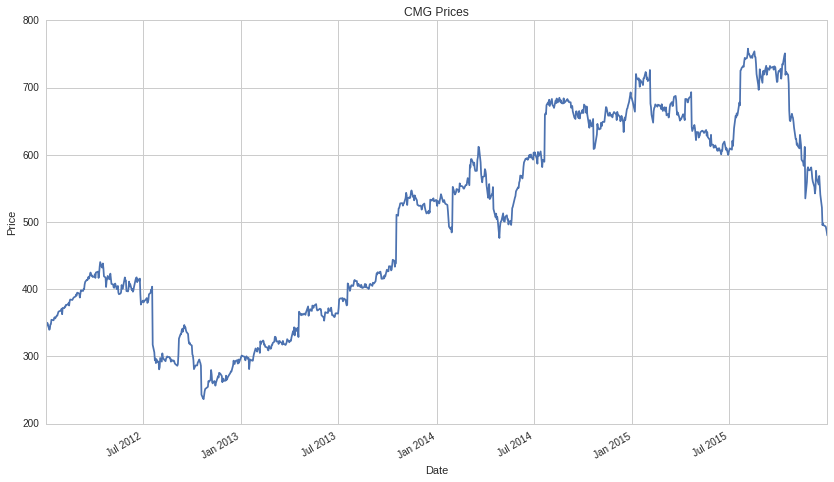
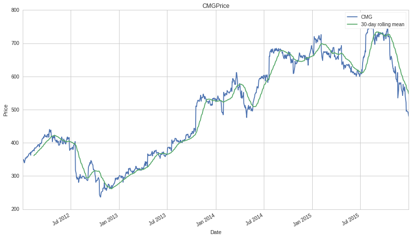

Introduction to pandas
======================

by Maxwell Margenot

Part of the Quantopian Lecture Series:

-  `www.quantopian.com/lectures <https://www.quantopian.com/lectures>`__
-  `github.com/quantopian/research_public <https://github.com/quantopian/research_public>`__

pandas is a Python library that provides a collection of powerful data
structures to better help you manage data. In this lecture, we will
cover how to use the ``Series`` and ``DataFrame`` objects to handle
data. These objects have a strong integration with NumPy, covered
elsewhere in the `lecture
series <http://www.quantopian.com/lectures#Introduction-to-NumPy>`__,
allowing us to easily do the necessary statistical and mathematical
calculations that we need for finance.

.. code:: ipython2

    import numpy as np
    import pandas as pd
    import matplotlib.pyplot as plt

With pandas, it is easy to store, visualize, and perform calculations on
your data. With only a few lines of code we can modify our data and
present it in an easily-understandable way. Here we simulate some
returns in NumPy, put them into a pandas ``DataFrame``, and perform
calculations to turn them into prices and plot them, all only using a
few lines of code.

.. code:: ipython2

    returns = pd.DataFrame(np.random.normal(1.0, 0.03, (100, 10)))
    prices = returns.cumprod()
    prices.plot()
    plt.title('Randomly-generated Prices')
    plt.xlabel('Time')
    plt.ylabel('Price')
    plt.legend(loc=0);

.. image:: notebook_files/notebook_4_0.png

So let’s have a look at how we actually build up to this point!

pandas Data Structures
----------------------

``Series``
~~~~~~~~~~

A pandas ``Series`` is a 1-dimensional array with labels that can
contain any data type. We primarily use them for handling time series
data. Creating a ``Series`` is as easy as calling ``pandas.Series()`` on
a Python list or NumPy array.

.. code:: ipython2

    s = pd.Series([1, 2, np.nan, 4, 5])
    print s

.. parsed-literal::

    0    1.0
    1    2.0
    2    NaN
    3    4.0
    4    5.0
    dtype: float64

Every ``Series`` has a name. We can give the series a name as a
parameter or we can define it afterwards by directly accessing the name
attribute. In this case, we have given our time series no name so the
attribute should be empty.

.. code:: ipython2

    print s.name

.. parsed-literal::

    None

This name can be directly modified with no repercussions.

.. code:: ipython2

    s.name = "Toy Series"
    print s.name

.. parsed-literal::

    Toy Series

We call the collected axis labels of a ``Series`` its index. An index
can either passed to a ``Series`` as a parameter or added later,
similarly to its name. In the absence of an index, a ``Series`` will
simply contain an index composed of integers, starting at :math:`0`, as
in the case of our “Toy Series”.

.. code:: ipython2

    print s.index

.. parsed-literal::

    RangeIndex(start=0, stop=5, step=1)

pandas has a built-in function specifically for creating date indices,
``date_range()``. We use the function here to create a new index for
``s``.

.. code:: ipython2

    new_index = pd.date_range("2016-01-01", periods=len(s), freq="D")
    print new_index

.. parsed-literal::

    DatetimeIndex(['2016-01-01', '2016-01-02', '2016-01-03', '2016-01-04',
                   '2016-01-05'],
                  dtype='datetime64[ns]', freq='D')

An index must be exactly the same length as the ``Series`` itself. Each
index must match one-to-one with each element of the ``Series``. Once
this is satisfied, we can directly modify the ``Series`` index, as with
the name, to use our new and more informative index (relatively
speaking).

.. code:: ipython2

    s.index = new_index
    print s.index

.. parsed-literal::

    DatetimeIndex(['2016-01-01', '2016-01-02', '2016-01-03', '2016-01-04',
                   '2016-01-05'],
                  dtype='datetime64[ns]', freq='D')

The index of the ``Series`` is crucial for handling time series, which
we will get into a little later.

Accessing ``Series`` Elements
^^^^^^^^^^^^^^^^^^^^^^^^^^^^^

``Series`` are typically accessed using the ``iloc[]`` and ``loc[]``
methods. We use ``iloc[]`` to access elements by integer index and we
use ``loc[]`` to access the index of the Series.

.. code:: ipython2

    print "First element of the series: ", s.iloc[0]
    print "Last element of the series: ", s.iloc[len(s)-1]

.. parsed-literal::

    First element of the series:  1.0
    Last element of the series:  5.0

We can slice a ``Series`` similarly to our favorite collections, Python
lists and NumPy arrays. We use the colon operator to indicate the slice.

.. code:: ipython2

    s.iloc[:2]

.. parsed-literal::

    2016-01-01    1.0
    2016-01-02    2.0
    Freq: D, Name: Toy Series, dtype: float64

When creating a slice, we have the options of specifying a beginning, an
end, and a step. The slice will begin at the start index, and take steps
of size ``step`` until it passes the end index, not including the end.

.. code:: ipython2

    start = 0
    end = len(s) - 1
    step = 1
    
    s.iloc[start:end:step]

.. parsed-literal::

    2016-01-01    1.0
    2016-01-02    2.0
    2016-01-03    NaN
    2016-01-04    4.0
    Freq: D, Name: Toy Series, dtype: float64

We can even reverse a ``Series`` by specifying a negative step size.
Similarly, we can index the start and end with a negative integer value.

.. code:: ipython2

    s.iloc[::-1]

.. parsed-literal::

    2016-01-05    5.0
    2016-01-04    4.0
    2016-01-03    NaN
    2016-01-02    2.0
    2016-01-01    1.0
    Freq: -1D, Name: Toy Series, dtype: float64

This returns a slice of the series that starts from the second to last
element and ends at the third to last element (because the fourth to
last is not included, taking steps of size :math:`1`).

.. code:: ipython2

    s.iloc[-2:-4:-1]

.. parsed-literal::

    2016-01-04    4.0
    2016-01-03    NaN
    Freq: -1D, Name: Toy Series, dtype: float64

We can also access a series by using the values of its index. Since we
indexed ``s`` with a collection of dates (``Timestamp`` objects) we can
look at the value contained in ``s`` for a particular date.

.. code:: ipython2

    s.loc['2016-01-01']

.. parsed-literal::

    1.0

Or even for a range of dates!

.. code:: ipython2

    s.loc['2016-01-02':'2016-01-04']

.. parsed-literal::

    2016-01-02    2.0
    2016-01-03    NaN
    2016-01-04    4.0
    Freq: D, Name: Toy Series, dtype: float64

With ``Series``, we *can* just use the brackets (``[]``) to access
elements, but this is not best practice. The brackets are ambiguous
because they can be used to access ``Series`` (and ``DataFrames``) using
both index and integer values and the results will change based on
context (especially with ``DataFrames``).

Boolean Indexing
^^^^^^^^^^^^^^^^

In addition to the above-mentioned access methods, you can filter
``Series`` using boolean arrays. ``Series`` are compatible with your
standard comparators. Once compared with whatever condition you like,
you get back yet another ``Series``, this time filled with boolean
values.

.. code:: ipython2

    print s < 3

.. parsed-literal::

    2016-01-01     True
    2016-01-02     True
    2016-01-03    False
    2016-01-04    False
    2016-01-05    False
    Freq: D, Name: Toy Series, dtype: bool

We can pass *this* ``Series`` back into the original ``Series`` to
filter out only the elements for which our condition is ``True``.

.. code:: ipython2

    print s.loc[s < 3]

.. parsed-literal::

    2016-01-01    1.0
    2016-01-02    2.0
    Freq: D, Name: Toy Series, dtype: float64

If we so desire, we can group multiple conditions together using the
logical operators ``&``, ``|``, and ``~`` (and, or, and not,
respectively).

.. code:: ipython2

    print s.loc[(s < 3) & (s > 1)]

.. parsed-literal::

    2016-01-02    2.0
    Freq: D, Name: Toy Series, dtype: float64

This is very convenient for getting only elements of a ``Series`` that
fulfill specific criteria that we need. It gets even more convenient
when we are handling ``DataFrames``.

Indexing and Time Series
^^^^^^^^^^^^^^^^^^^^^^^^

Since we use ``Series`` for handling time series, it’s worth covering a
little bit of how we handle the time component. For our purposes we use
pandas ``Timestamp`` objects. Let’s pull a full time series, complete
with all the appropriate labels, by using our ``get_pricing()`` method.
All data pulled with ``get_pricing()`` or using our Pipeline API will be
in either ``Series`` or ``DataFrame`` format. We can modify this index
however we like.

.. code:: ipython2

    symbol = "CMG"
    start = "2012-01-01"
    end = "2016-01-01"
    prices = get_pricing(symbol, start_date=start, end_date=end, fields="price")

We can display the first few elements of our series by using the
``head()`` method and specifying the number of elements that we want.
The analogous method for the last few elements is ``tail()``.

.. code:: ipython2

    print "\n", type(prices)
    prices.head(5) 

.. parsed-literal::

    
    <class 'pandas.core.series.Series'>

.. parsed-literal::

    2012-01-03 00:00:00+00:00    340.9800
    2012-01-04 00:00:00+00:00    348.7400
    2012-01-05 00:00:00+00:00    349.9900
    2012-01-06 00:00:00+00:00    348.9500
    2012-01-09 00:00:00+00:00    339.5225
    Name: Equity(28016 [CMG]), dtype: float64

As with our toy example, we can specify a name for our time series, if
only to clarify the name the ``get_pricing()`` provides us.

.. code:: ipython2

    print 'Old name: ', prices.name
    prices.name = symbol
    print 'New name: ', prices.name

.. parsed-literal::

    Old name:  Equity(28016 [CMG])
    New name:  CMG

Let’s take a closer look at the ``DatetimeIndex`` of our ``prices`` time
series.

.. code:: ipython2

    print prices.index

.. parsed-literal::

    DatetimeIndex(['2012-01-03', '2012-01-04', '2012-01-05', '2012-01-06',
                   '2012-01-09', '2012-01-10', '2012-01-11', '2012-01-12',
                   '2012-01-13', '2012-01-17',
                   ...
                   '2015-12-17', '2015-12-18', '2015-12-21', '2015-12-22',
                   '2015-12-23', '2015-12-24', '2015-12-28', '2015-12-29',
                   '2015-12-30', '2015-12-31'],
                  dtype='datetime64[ns, UTC]', length=1006, freq=None)

Notice that this ``DatetimeIndex`` has a collection of associated
information. In particular it has an associated frequency (``freq``) and
an associated timezone (``tz``). The frequency indicates whether the
data is daily vs monthly vs some other period while the timezone
indicates what locale this index is relative to. We can modify all of
this extra information!

If we resample our ``Series``, we can adjust the frequency of our data.
We currently have daily data (excluding weekends) because
``get_pricing()`` pulls only data from market days. Let’s up-sample from
this daily data to monthly data using the ``resample()`` method.

.. code:: ipython2

    monthly_prices = prices.resample('M')
    monthly_prices.head(10)

.. parsed-literal::

    2012-01-31 00:00:00+00:00    354.812125
    2012-02-29 00:00:00+00:00    379.582000
    2012-03-31 00:00:00+00:00    406.996164
    2012-04-30 00:00:00+00:00    422.818505
    2012-05-31 00:00:00+00:00    405.810177
    2012-06-30 00:00:00+00:00    403.061905
    2012-07-31 00:00:00+00:00    353.871424
    2012-08-31 00:00:00+00:00    294.513478
    2012-09-30 00:00:00+00:00    326.566316
    2012-10-31 00:00:00+00:00    276.545329
    Freq: M, Name: CMG, dtype: float64

The ``resample()`` method defaults to using the mean of the lower level
data to create the higher level data. We can specify how else we might
want the up-sampling to be calculated by specifying the ``how``
parameter.

.. code:: ipython2

    monthly_prices_med = prices.resample('M', how='median')
    monthly_prices_med.head(10)

.. parsed-literal::

    2012-01-31 00:00:00+00:00    355.380
    2012-02-29 00:00:00+00:00    378.295
    2012-03-31 00:00:00+00:00    408.850
    2012-04-30 00:00:00+00:00    420.900
    2012-05-31 00:00:00+00:00    405.390
    2012-06-30 00:00:00+00:00    402.790
    2012-07-31 00:00:00+00:00    380.370
    2012-08-31 00:00:00+00:00    295.380
    2012-09-30 00:00:00+00:00    332.990
    2012-10-31 00:00:00+00:00    286.440
    Freq: M, Name: CMG, dtype: float64

We can even specify how we want the calculation of the new period to be
done. Here we create a ``custom_resampler()`` function that will return
the first value of the period. In our specific case, this will return a
``Series`` where the monthly value is the first value of that month.

.. code:: ipython2

    def custom_resampler(array_like):
        """ Returns the first value of the period """
        return array_like[0]
    
    first_of_month_prices = prices.resample('M', how=custom_resampler)
    first_of_month_prices.head(10)

.. parsed-literal::

    2012-01-31 00:00:00+00:00    340.98
    2012-02-29 00:00:00+00:00    370.84
    2012-03-31 00:00:00+00:00    394.58
    2012-04-30 00:00:00+00:00    418.65
    2012-05-31 00:00:00+00:00    419.78
    2012-06-30 00:00:00+00:00    397.14
    2012-07-31 00:00:00+00:00    382.97
    2012-08-31 00:00:00+00:00    280.60
    2012-09-30 00:00:00+00:00    285.91
    2012-10-31 00:00:00+00:00    316.13
    Freq: M, Name: CMG, dtype: float64

We can also adjust the timezone of a ``Series`` to adapt the time of
real-world data. In our case, our time series is already localized to
UTC, but let’s say that we want to adjust the time to be ‘US/Eastern’.
In this case we use the ``tz_convert()`` method, since the time is
already localized.

.. code:: ipython2

    eastern_prices = prices.tz_convert('US/Eastern')
    eastern_prices.head(10)

.. parsed-literal::

    2012-01-02 19:00:00-05:00    340.9800
    2012-01-03 19:00:00-05:00    348.7400
    2012-01-04 19:00:00-05:00    349.9900
    2012-01-05 19:00:00-05:00    348.9500
    2012-01-08 19:00:00-05:00    339.5225
    2012-01-09 19:00:00-05:00    340.7000
    2012-01-10 19:00:00-05:00    347.3300
    2012-01-11 19:00:00-05:00    347.8300
    2012-01-12 19:00:00-05:00    354.3900
    2012-01-16 19:00:00-05:00    353.6100
    Name: CMG, dtype: float64

In addition to the capacity for timezone and frequency management, each
time series has a built-in ``reindex()`` method that we can use to
realign the existing data according to a new set of index labels. If
data does not exist for a particular label, the data will be filled with
a placeholder value. This is typically ``np.nan``, though we can provide
a fill method.

The data that we ``get_pricing()`` only includes market days. But what
if we want prices for every single calendar day? This will include
holidays and weekends, times when you normally cannot trade equities.
First let’s create a new ``DatetimeIndex`` that contains all that we
want.

.. code:: ipython2

    calendar_dates = pd.date_range(start=start, end=end, freq='D', tz='UTC')
    print calendar_dates

.. parsed-literal::

    DatetimeIndex(['2012-01-01', '2012-01-02', '2012-01-03', '2012-01-04',
                   '2012-01-05', '2012-01-06', '2012-01-07', '2012-01-08',
                   '2012-01-09', '2012-01-10',
                   ...
                   '2015-12-23', '2015-12-24', '2015-12-25', '2015-12-26',
                   '2015-12-27', '2015-12-28', '2015-12-29', '2015-12-30',
                   '2015-12-31', '2016-01-01'],
                  dtype='datetime64[ns, UTC]', length=1462, freq='D')

Now let’s use this new set of dates to reindex our time series. We tell
the function that the fill method that we want is ``ffill``. This
denotes “forward fill”. Any ``NaN`` values will be filled by the *last
value* listed. So the price on the weekend or on a holiday will be
listed as the price on the last market day that we know about.

.. code:: ipython2

    calendar_prices = prices.reindex(calendar_dates, method='ffill')
    calendar_prices.head(15)

.. parsed-literal::

    2012-01-01 00:00:00+00:00         NaN
    2012-01-02 00:00:00+00:00         NaN
    2012-01-03 00:00:00+00:00    340.9800
    2012-01-04 00:00:00+00:00    348.7400
    2012-01-05 00:00:00+00:00    349.9900
    2012-01-06 00:00:00+00:00    348.9500
    2012-01-07 00:00:00+00:00    348.9500
    2012-01-08 00:00:00+00:00    348.9500
    2012-01-09 00:00:00+00:00    339.5225
    2012-01-10 00:00:00+00:00    340.7000
    2012-01-11 00:00:00+00:00    347.3300
    2012-01-12 00:00:00+00:00    347.8300
    2012-01-13 00:00:00+00:00    354.3900
    2012-01-14 00:00:00+00:00    354.3900
    2012-01-15 00:00:00+00:00    354.3900
    Freq: D, Name: CMG, dtype: float64

You’ll notice that we still have a couple of ``NaN`` values right at the
beginning of our time series. This is because the first of January in
2012 was a Sunday and the second was a market holiday! Because these are
the earliest data points and we don’t have any information from before
them, they cannot be forward-filled. We will take care of these ``NaN``
values in the next section, when we deal with missing data.

Missing Data
^^^^^^^^^^^^

Whenever we deal with real data, there is a very real possibility of
encountering missing values. Real data is riddled with holes and pandas
provides us with ways to handle them. Sometimes resampling or reindexing
can create ``NaN`` values. Fortunately, pandas provides us with ways to
handle them. We have two primary means of coping with missing data. The
first of these is filling in the missing data with ``fillna()``. For
example, say that we want to fill in the missing days with the mean
price of all days.

.. code:: ipython2

    meanfilled_prices = calendar_prices.fillna(calendar_prices.mean())
    meanfilled_prices.head(10)

.. parsed-literal::

    2012-01-01 00:00:00+00:00    501.062621
    2012-01-02 00:00:00+00:00    501.062621
    2012-01-03 00:00:00+00:00    340.980000
    2012-01-04 00:00:00+00:00    348.740000
    2012-01-05 00:00:00+00:00    349.990000
    2012-01-06 00:00:00+00:00    348.950000
    2012-01-07 00:00:00+00:00    348.950000
    2012-01-08 00:00:00+00:00    348.950000
    2012-01-09 00:00:00+00:00    339.522500
    2012-01-10 00:00:00+00:00    340.700000
    Freq: D, Name: CMG, dtype: float64

Using ``fillna()`` is fairly easy. It is just a matter of indicating the
value that you want to fill the spaces with. Unfortunately, this
particular case doesn’t make a whole lot of sense, for reasons discussed
in the `lecture on
stationarity <https://www.quantopian.com/lectures/integration-cointegration-and-stationarity>`__
in the Lecture series. We could fill them with with :math:`0`, simply,
but that’s similarly uninformative.

Rather than filling in specific values, we can use the ``method``
parameter, similarly to how the ``reindex()`` method works. We could use
“backward fill”, where ``NaN``\ s are filled with the *next* filled
value (instead of forward fill’s *last* filled value) like so:

.. code:: ipython2

    bfilled_prices = calendar_prices.fillna(method='bfill')
    bfilled_prices.head(10)

.. parsed-literal::

    2012-01-01 00:00:00+00:00    340.9800
    2012-01-02 00:00:00+00:00    340.9800
    2012-01-03 00:00:00+00:00    340.9800
    2012-01-04 00:00:00+00:00    348.7400
    2012-01-05 00:00:00+00:00    349.9900
    2012-01-06 00:00:00+00:00    348.9500
    2012-01-07 00:00:00+00:00    348.9500
    2012-01-08 00:00:00+00:00    348.9500
    2012-01-09 00:00:00+00:00    339.5225
    2012-01-10 00:00:00+00:00    340.7000
    Freq: D, Name: CMG, dtype: float64

But again, this is a bad idea for the same reasons as the previous
option. Both of these so-called solutions take into account *future
data* that was not available at the time of the data points that we are
trying to fill. In the case of using the mean or the median, these
summary statistics are calculated by taking into account the entire time
series. Backward filling is equivalent to saying that the price of a
particular security today, right now, tomorrow’s price. This also makes
no sense. These two options are both examples of look-ahead bias, using
data that would be unknown or unavailable at the desired time, and
should be avoided.

Our next option is significantly more appealing. We could simply drop
the missing data using the ``dropna()`` method. This is much better
alternative than filling ``NaN`` values in with arbitrary numbers.

.. code:: ipython2

    dropped_prices = calendar_prices.dropna()
    dropped_prices.head(10)

.. parsed-literal::

    2012-01-03 00:00:00+00:00    340.9800
    2012-01-04 00:00:00+00:00    348.7400
    2012-01-05 00:00:00+00:00    349.9900
    2012-01-06 00:00:00+00:00    348.9500
    2012-01-07 00:00:00+00:00    348.9500
    2012-01-08 00:00:00+00:00    348.9500
    2012-01-09 00:00:00+00:00    339.5225
    2012-01-10 00:00:00+00:00    340.7000
    2012-01-11 00:00:00+00:00    347.3300
    2012-01-12 00:00:00+00:00    347.8300
    Freq: D, Name: CMG, dtype: float64

Now our time series is cleaned for the calendar year, with all of our
``NaN`` values properly handled. It is time to talk about how to
actually do time series analysis with pandas data structures.

Time Series Analysis with pandas
^^^^^^^^^^^^^^^^^^^^^^^^^^^^^^^^

Let’s do some basic time series analysis on our original prices. Each
pandas ``Series`` has a built-in plotting method.

.. code:: ipython2

    prices.plot();
    # We still need to add the axis labels and title ourselves
    plt.title(symbol + " Prices")
    plt.ylabel("Price")
    plt.xlabel("Date");

As well as some built-in descriptive statistics. We can either calculate
these individually or using the ``describe()`` method.

.. code:: ipython2

    print "Mean: ", prices.mean()
    print "Standard deviation: ", prices.std()

.. parsed-literal::

    Mean:  501.64121332
    Standard deviation:  146.700132549

.. code:: ipython2

    print "Summary Statistics"
    print prices.describe()

.. parsed-literal::

    Summary Statistics
    count    1006.000000
    mean      501.641213
    std       146.700133
    min       236.240000
    25%       371.605000
    50%       521.130000
    75%       646.810000
    max       757.770000
    Name: CMG, dtype: float64

We can easily modify ``Series`` with scalars using our basic
mathematical operators.

.. code:: ipython2

    modified_prices = prices * 2 - 10
    modified_prices.head(5)

.. parsed-literal::

    2012-01-03 00:00:00+00:00    671.960
    2012-01-04 00:00:00+00:00    687.480
    2012-01-05 00:00:00+00:00    689.980
    2012-01-06 00:00:00+00:00    687.900
    2012-01-09 00:00:00+00:00    669.045
    Name: CMG, dtype: float64

And we can create linear combinations of ``Series`` themselves using the
basic mathematical operators. pandas will group up matching indices and
perform the calculations elementwise to produce a new ``Series``.

.. code:: ipython2

    noisy_prices = prices + 5 * pd.Series(np.random.normal(0, 5, len(prices)), index=prices.index) + 20
    noisy_prices.head(5)

.. parsed-literal::

    2012-01-03 00:00:00+00:00    371.013281
    2012-01-04 00:00:00+00:00    357.417023
    2012-01-05 00:00:00+00:00    344.953572
    2012-01-06 00:00:00+00:00    407.123572
    2012-01-09 00:00:00+00:00    305.081540
    dtype: float64

If there are no matching indices, however, we may get an empty
``Series`` in return.

.. code:: ipython2

    empty_series = prices + pd.Series(np.random.normal(0, 1, len(prices)))
    empty_series.head(5)

.. parsed-literal::

    2012-01-03 00:00:00+00:00   NaN
    2012-01-04 00:00:00+00:00   NaN
    2012-01-05 00:00:00+00:00   NaN
    2012-01-06 00:00:00+00:00   NaN
    2012-01-09 00:00:00+00:00   NaN
    dtype: float64

Rather than looking at a time series itself, we may want to look at its
first-order differences or percent change (in order to get additive or
multiplicative returns, in our particular case). Both of these are
built-in methods.

.. code:: ipython2

    add_returns = prices.diff()[1:]
    mult_returns = prices.pct_change()[1:]

.. code:: ipython2

    plt.title("Multiplicative returns of " + symbol)
    plt.xlabel("Date")
    plt.ylabel("Percent Returns")
    mult_returns.plot();

.. image:: notebook_files/notebook_82_0.png

pandas has convenient functions for calculating rolling means and
standard deviations, as well!

.. code:: ipython2

    rolling_mean = pd.rolling_mean(prices, 30)
    rolling_mean.name = "30-day rolling mean"

.. code:: ipython2

    prices.plot()
    rolling_mean.plot()
    plt.title(symbol + "Price")
    plt.xlabel("Date")
    plt.ylabel("Price")
    plt.legend();

.. code:: ipython2

    rolling_std = pd.rolling_std(prices, 30)
    rolling_std.name = "30-day rolling volatility"

.. code:: ipython2

    rolling_std.plot()
    plt.title(rolling_std.name);
    plt.xlabel("Date")
    plt.ylabel("Standard Deviation");

.. image:: notebook_files/notebook_87_0.png

Many NumPy functions will work on ``Series`` the same way that they work
on 1-dimensional NumPy arrays.

.. code:: ipython2

    print np.median(mult_returns)

.. parsed-literal::

    0.000194158599839

The majority of these functions, however, are already implemented
directly as ``Series`` and ``DataFrame`` methods.

.. code:: ipython2

    print mult_returns.median()

.. parsed-literal::

    0.000194158599839

In every case, using the built-in pandas method will be better than
using the NumPy function on a pandas data structure due to improvements
in performance. Make sure to check out the ``Series``
`documentation <http://pandas.pydata.org/pandas-docs/stable/generated/pandas.Series.html>`__
before resorting to other calculations of common functions.

``DataFrames``
~~~~~~~~~~~~~~

Many of the aspects of working with ``Series`` carry over into
``DataFrames``. pandas ``DataFrames`` allow us to easily manage our data
with their intuitive structure.

Like ``Series``, ``DataFrames`` can hold multiple types of data, but
``DataFrames`` are 2-dimensional objects, unlike ``Series``. Each
``DataFrame`` has an index and a columns attribute, which we will cover
more in-depth when we start actually playing with an object. The index
attribute is like the index of a ``Series``, though indices in pandas
have some extra features that we will unfortunately not be able to cover
here. If you are interested in this, check out the `pandas
documentation <http://pandas.pydata.org/pandas-docs/version/0.18.1/advanced.html>`__
on advanced indexing. The columns attribute is what provides the second
dimension of our ``DataFrames``, allowing us to combine named columns
(all ``Series``), into a cohesive object with the index lined-up.

We can create a ``DataFrame`` by calling ``pandas.DataFrame()`` on a
dictionary or NumPy ``ndarray``. We can also concatenate a group of
pandas ``Series`` into a ``DataFrame`` using ``pandas.concat()``.

.. code:: ipython2

    dict_data = {
        'a' : [1, 2, 3, 4, 5],
        'b' : ['L', 'K', 'J', 'M', 'Z'],
        'c' : np.random.normal(0, 1, 5)
    }
    print dict_data

.. parsed-literal::

    {'a': [1, 2, 3, 4, 5], 'c': array([ 0.23752859, -0.49607459, -0.81027968, -0.28216034,  0.89001851]), 'b': ['L', 'K', 'J', 'M', 'Z']}

Each ``DataFrame`` has a few key attributes that we need to keep in
mind. The first of these is the index attribute. We can easily include
an index of ``Timestamp`` objects like we did with ``Series``.

.. code:: ipython2

    frame_data = pd.DataFrame(dict_data, index=pd.date_range('2016-01-01', periods=5))
    print frame_data

.. parsed-literal::

                a  b         c
    2016-01-01  1  L  0.237529
    2016-01-02  2  K -0.496075
    2016-01-03  3  J -0.810280
    2016-01-04  4  M -0.282160
    2016-01-05  5  Z  0.890019

As mentioned above, we can combine ``Series`` into ``DataFrames``.
Concatatenating ``Series`` like this will match elements up based on
their corresponding index. As the following ``Series`` do not have an
index assigned, they each default to an integer index.

.. code:: ipython2

    s_1 = pd.Series([2, 4, 6, 8, 10], name='Evens')
    s_2 = pd.Series([1, 3, 5, 7, 9], name="Odds")
    numbers = pd.concat([s_1, s_2], axis=1)
    print numbers

.. parsed-literal::

       Evens  Odds
    0      2     1
    1      4     3
    2      6     5
    3      8     7
    4     10     9

We will use ``pandas.concat()`` again later to combine multiple
``DataFrame``\ s into one.

Each ``DataFrame`` also has a ``columns`` attribute. These can either be
assigned when we call ``pandas.DataFrame`` or they can be modified
directly like the index. Note that when we concatenated the two
``Series`` above, the column names were the names of those ``Series``.

.. code:: ipython2

    print numbers.columns

.. parsed-literal::

    Index([u'Evens', u'Odds'], dtype='object')

To modify the columns after object creation, we need only do the
following:

.. code:: ipython2

    numbers.columns = ['Shmevens', 'Shmodds']
    print numbers

.. parsed-literal::

       Shmevens  Shmodds
    0         2        1
    1         4        3
    2         6        5
    3         8        7
    4        10        9

In the same vein, the index of a ``DataFrame`` can be changed after the
fact.

.. code:: ipython2

    print numbers.index

.. parsed-literal::

    RangeIndex(start=0, stop=5, step=1)

.. code:: ipython2

    numbers.index = pd.date_range("2016-01-01", periods=len(numbers))
    print numbers

.. parsed-literal::

                Shmevens  Shmodds
    2016-01-01         2        1
    2016-01-02         4        3
    2016-01-03         6        5
    2016-01-04         8        7
    2016-01-05        10        9

Separate from the columns and index of a ``DataFrame``, we can also
directly access the values they contain by looking at the values
attribute.

.. code:: ipython2

    numbers.values

.. parsed-literal::

    array([[ 2,  1],
           [ 4,  3],
           [ 6,  5],
           [ 8,  7],
           [10,  9]])

This returns a NumPy array.

.. code:: ipython2

    type(numbers.values)

.. parsed-literal::

    <type 'numpy.ndarray'>

Accessing ``DataFrame`` elements
^^^^^^^^^^^^^^^^^^^^^^^^^^^^^^^^

Again we see a lot of carryover from ``Series`` in how we access the
elements of ``DataFrames``. The key sticking point here is that
everything has to take into account multiple dimensions now. The main
way that this happens is through the access of the columns of a
``DataFrame``, either individually or in groups. We can do this either
by directly accessing the attributes or by using the methods we already
are familiar with.

.. code:: ipython2

    symbol = ["CMG", "MCD", "SHAK", "WFM"]
    start = "2012-01-01"
    end = "2016-01-01"
    prices = get_pricing(symbol, start_date=start, end_date=end, fields="price")
    if isinstance(symbol, list):
        prices.columns = map(lambda x: x.symbol, prices.columns)
    else:
        prices.name = symbol

Here we directly access the ``CMG`` column. Note that this style of
access will only work if your column name has no spaces or unfriendly
characters in it.

.. code:: ipython2

    prices.CMG.head()

.. parsed-literal::

    2012-01-03 00:00:00+00:00    340.9800
    2012-01-04 00:00:00+00:00    348.7400
    2012-01-05 00:00:00+00:00    349.9900
    2012-01-06 00:00:00+00:00    348.9500
    2012-01-09 00:00:00+00:00    339.5225
    Name: CMG, dtype: float64

We can also use ``loc[]`` to access an individual column like so.

.. code:: ipython2

    prices.loc[:, 'CMG'].head()

.. parsed-literal::

    2012-01-03 00:00:00+00:00    340.9800
    2012-01-04 00:00:00+00:00    348.7400
    2012-01-05 00:00:00+00:00    349.9900
    2012-01-06 00:00:00+00:00    348.9500
    2012-01-09 00:00:00+00:00    339.5225
    Name: CMG, dtype: float64

Accessing an individual column will return a ``Series``, regardless of
how we get it.

.. code:: ipython2

    print type(prices.CMG)
    print type(prices.loc[:, 'CMG'])

.. parsed-literal::

    <class 'pandas.core.series.Series'>
    <class 'pandas.core.series.Series'>

Notice how we pass a tuple into the ``loc[]`` method? This is a key
difference between accessing a ``Series`` and accessing a ``DataFrame``,
grounded in the fact that a ``DataFrame`` has multiple dimensions. When
you pass a 2-dimensional tuple into a ``DataFrame``, the first element
of the tuple is applied to the rows and the second is applied to the
columns. So, to break it down, the above line of code tells the
``DataFrame`` to return every single row of the column with label
``'CMG'``. Lists of columns are also supported.

.. code:: ipython2

    prices.loc[:, ['CMG', 'MCD']].head()

.. raw:: html

    

    <table border="1" class="dataframe">
      <thead>
        <tr style="text-align: right;">
          <th></th>
          <th>CMG</th>
          <th>MCD</th>
        </tr>
      </thead>
      <tbody>
        <tr>
          <th>2012-01-03 00:00:00+00:00</th>
          <td>340.9800</td>
          <td>98.81</td>
        </tr>
        <tr>
          <th>2012-01-04 00:00:00+00:00</th>
          <td>348.7400</td>
          <td>99.42</td>
        </tr>
        <tr>
          <th>2012-01-05 00:00:00+00:00</th>
          <td>349.9900</td>
          <td>99.83</td>
        </tr>
        <tr>
          <th>2012-01-06 00:00:00+00:00</th>
          <td>348.9500</td>
          <td>100.59</td>
        </tr>
        <tr>
          <th>2012-01-09 00:00:00+00:00</th>
          <td>339.5225</td>
          <td>99.62</td>
        </tr>
      </tbody>
    </table>
    

We can also simply access the ``DataFrame`` by index value using
``loc[]``, as with ``Series``.

.. code:: ipython2

    prices.loc['2015-12-15':'2015-12-22']

.. raw:: html

    

    <table border="1" class="dataframe">
      <thead>
        <tr style="text-align: right;">
          <th></th>
          <th>CMG</th>
          <th>MCD</th>
          <th>SHAK</th>
          <th>WFM</th>
        </tr>
      </thead>
      <tbody>
        <tr>
          <th>2015-12-15 00:00:00+00:00</th>
          <td>555.6401</td>
          <td>116.96</td>
          <td>41.5101</td>
          <td>32.96</td>
        </tr>
        <tr>
          <th>2015-12-16 00:00:00+00:00</th>
          <td>568.4200</td>
          <td>117.84</td>
          <td>40.1400</td>
          <td>33.66</td>
        </tr>
        <tr>
          <th>2015-12-17 00:00:00+00:00</th>
          <td>554.9399</td>
          <td>117.56</td>
          <td>38.5300</td>
          <td>33.38</td>
        </tr>
        <tr>
          <th>2015-12-18 00:00:00+00:00</th>
          <td>540.7500</td>
          <td>116.58</td>
          <td>39.3800</td>
          <td>32.72</td>
        </tr>
        <tr>
          <th>2015-12-21 00:00:00+00:00</th>
          <td>521.2300</td>
          <td>117.71</td>
          <td>38.2050</td>
          <td>32.98</td>
        </tr>
        <tr>
          <th>2015-12-22 00:00:00+00:00</th>
          <td>495.2001</td>
          <td>117.71</td>
          <td>39.7600</td>
          <td>34.78</td>
        </tr>
      </tbody>
    </table>
    

This plays nicely with lists of columns, too.

.. code:: ipython2

    prices.loc['2015-12-15':'2015-12-22', ['CMG', 'MCD']]

.. raw:: html

    

    <table border="1" class="dataframe">
      <thead>
        <tr style="text-align: right;">
          <th></th>
          <th>CMG</th>
          <th>MCD</th>
        </tr>
      </thead>
      <tbody>
        <tr>
          <th>2015-12-15 00:00:00+00:00</th>
          <td>555.6401</td>
          <td>116.96</td>
        </tr>
        <tr>
          <th>2015-12-16 00:00:00+00:00</th>
          <td>568.4200</td>
          <td>117.84</td>
        </tr>
        <tr>
          <th>2015-12-17 00:00:00+00:00</th>
          <td>554.9399</td>
          <td>117.56</td>
        </tr>
        <tr>
          <th>2015-12-18 00:00:00+00:00</th>
          <td>540.7500</td>
          <td>116.58</td>
        </tr>
        <tr>
          <th>2015-12-21 00:00:00+00:00</th>
          <td>521.2300</td>
          <td>117.71</td>
        </tr>
        <tr>
          <th>2015-12-22 00:00:00+00:00</th>
          <td>495.2001</td>
          <td>117.71</td>
        </tr>
      </tbody>
    </table>
    

Using ``iloc[]`` also works similarly, allowing you to access parts of
the ``DataFrame`` by integer index.

.. code:: ipython2

    prices.iloc[0:2, 1]

.. parsed-literal::

    2012-01-03 00:00:00+00:00    98.81
    2012-01-04 00:00:00+00:00    99.42
    Name: MCD, dtype: float64

.. code:: ipython2

    # Access prices with integer index in
    # [1, 3, 5, 7, 9, 11, 13, ..., 99]
    # and in column 0 or 3
    prices.iloc[[1, 3, 5] + range(7, 100, 2), [0, 3]].head(20)

.. raw:: html

    

    <table border="1" class="dataframe">
      <thead>
        <tr style="text-align: right;">
          <th></th>
          <th>CMG</th>
          <th>WFM</th>
        </tr>
      </thead>
      <tbody>
        <tr>
          <th>2012-01-04 00:00:00+00:00</th>
          <td>348.74</td>
          <td>35.725</td>
        </tr>
        <tr>
          <th>2012-01-06 00:00:00+00:00</th>
          <td>348.95</td>
          <td>36.435</td>
        </tr>
        <tr>
          <th>2012-01-10 00:00:00+00:00</th>
          <td>340.70</td>
          <td>36.335</td>
        </tr>
        <tr>
          <th>2012-01-12 00:00:00+00:00</th>
          <td>347.83</td>
          <td>35.935</td>
        </tr>
        <tr>
          <th>2012-01-17 00:00:00+00:00</th>
          <td>353.61</td>
          <td>38.390</td>
        </tr>
        <tr>
          <th>2012-01-19 00:00:00+00:00</th>
          <td>358.10</td>
          <td>38.665</td>
        </tr>
        <tr>
          <th>2012-01-23 00:00:00+00:00</th>
          <td>360.53</td>
          <td>38.060</td>
        </tr>
        <tr>
          <th>2012-01-25 00:00:00+00:00</th>
          <td>363.28</td>
          <td>38.575</td>
        </tr>
        <tr>
          <th>2012-01-27 00:00:00+00:00</th>
          <td>366.80</td>
          <td>37.445</td>
        </tr>
        <tr>
          <th>2012-01-31 00:00:00+00:00</th>
          <td>367.58</td>
          <td>37.015</td>
        </tr>
        <tr>
          <th>2012-02-02 00:00:00+00:00</th>
          <td>362.64</td>
          <td>37.800</td>
        </tr>
        <tr>
          <th>2012-02-06 00:00:00+00:00</th>
          <td>371.65</td>
          <td>38.205</td>
        </tr>
        <tr>
          <th>2012-02-08 00:00:00+00:00</th>
          <td>373.81</td>
          <td>38.960</td>
        </tr>
        <tr>
          <th>2012-02-10 00:00:00+00:00</th>
          <td>376.39</td>
          <td>40.805</td>
        </tr>
        <tr>
          <th>2012-02-14 00:00:00+00:00</th>
          <td>379.14</td>
          <td>40.495</td>
        </tr>
        <tr>
          <th>2012-02-16 00:00:00+00:00</th>
          <td>381.91</td>
          <td>40.300</td>
        </tr>
        <tr>
          <th>2012-02-21 00:00:00+00:00</th>
          <td>383.86</td>
          <td>40.285</td>
        </tr>
        <tr>
          <th>2012-02-23 00:00:00+00:00</th>
          <td>386.82</td>
          <td>40.520</td>
        </tr>
        <tr>
          <th>2012-02-27 00:00:00+00:00</th>
          <td>389.11</td>
          <td>40.825</td>
        </tr>
        <tr>
          <th>2012-02-29 00:00:00+00:00</th>
          <td>390.47</td>
          <td>40.370</td>
        </tr>
      </tbody>
    </table>
    

Boolean indexing
^^^^^^^^^^^^^^^^

As with ``Series``, sometimes we want to filter a ``DataFrame``
according to a set of criteria. We do this by indexing our ``DataFrame``
with boolean values.

.. code:: ipython2

    prices.loc[prices.MCD > prices.WFM].head()

.. raw:: html

    

    <table border="1" class="dataframe">
      <thead>
        <tr style="text-align: right;">
          <th></th>
          <th>CMG</th>
          <th>MCD</th>
          <th>SHAK</th>
          <th>WFM</th>
        </tr>
      </thead>
      <tbody>
        <tr>
          <th>2012-01-03 00:00:00+00:00</th>
          <td>340.9800</td>
          <td>98.81</td>
          <td>NaN</td>
          <td>34.810</td>
        </tr>
        <tr>
          <th>2012-01-04 00:00:00+00:00</th>
          <td>348.7400</td>
          <td>99.42</td>
          <td>NaN</td>
          <td>35.725</td>
        </tr>
        <tr>
          <th>2012-01-05 00:00:00+00:00</th>
          <td>349.9900</td>
          <td>99.83</td>
          <td>NaN</td>
          <td>36.370</td>
        </tr>
        <tr>
          <th>2012-01-06 00:00:00+00:00</th>
          <td>348.9500</td>
          <td>100.59</td>
          <td>NaN</td>
          <td>36.435</td>
        </tr>
        <tr>
          <th>2012-01-09 00:00:00+00:00</th>
          <td>339.5225</td>
          <td>99.62</td>
          <td>NaN</td>
          <td>36.440</td>
        </tr>
      </tbody>
    </table>
    

We can add multiple boolean conditions by using the logical operators
``&``, ``|``, and ``~`` (and, or, and not, respectively) again!

.. code:: ipython2

    prices.loc[(prices.MCD > prices.WFM) & ~prices.SHAK.isnull()].head()

.. raw:: html

    

    <table border="1" class="dataframe">
      <thead>
        <tr style="text-align: right;">
          <th></th>
          <th>CMG</th>
          <th>MCD</th>
          <th>SHAK</th>
          <th>WFM</th>
        </tr>
      </thead>
      <tbody>
        <tr>
          <th>2015-01-30 00:00:00+00:00</th>
          <td>709.58</td>
          <td>92.42</td>
          <td>45.80</td>
          <td>52.10</td>
        </tr>
        <tr>
          <th>2015-02-02 00:00:00+00:00</th>
          <td>712.55</td>
          <td>92.49</td>
          <td>43.50</td>
          <td>53.15</td>
        </tr>
        <tr>
          <th>2015-02-03 00:00:00+00:00</th>
          <td>726.07</td>
          <td>93.92</td>
          <td>44.87</td>
          <td>53.41</td>
        </tr>
        <tr>
          <th>2015-02-04 00:00:00+00:00</th>
          <td>676.00</td>
          <td>94.02</td>
          <td>41.32</td>
          <td>53.67</td>
        </tr>
        <tr>
          <th>2015-02-05 00:00:00+00:00</th>
          <td>670.62</td>
          <td>94.32</td>
          <td>42.46</td>
          <td>53.38</td>
        </tr>
      </tbody>
    </table>
    

Adding, Removing Columns, Combining ``DataFrames``/``Series``
^^^^^^^^^^^^^^^^^^^^^^^^^^^^^^^^^^^^^^^^^^^^^^^^^^^^^^^^^^^^^

It is all well and good when you already have a ``DataFrame`` filled
with data, but it is also important to be able to add to the data that
you have.

We add a new column simply by assigning data to a column that does not
already exist. Here we use the ``.loc[:, 'COL_NAME']`` notation and
store the output of ``get_pricing()`` (which returns a pandas ``Series``
if we only pass one security) there. This is the method that we would
use to add a ``Series`` to an existing ``DataFrame``.

.. code:: ipython2

    s_1 = get_pricing('TSLA', start_date=start, end_date=end, fields='price')
    prices.loc[:, 'TSLA'] = s_1
    prices.head(5)

.. raw:: html

    

    <table border="1" class="dataframe">
      <thead>
        <tr style="text-align: right;">
          <th></th>
          <th>CMG</th>
          <th>MCD</th>
          <th>SHAK</th>
          <th>WFM</th>
          <th>TSLA</th>
        </tr>
      </thead>
      <tbody>
        <tr>
          <th>2012-01-03 00:00:00+00:00</th>
          <td>340.9800</td>
          <td>98.81</td>
          <td>NaN</td>
          <td>34.810</td>
          <td>28.06</td>
        </tr>
        <tr>
          <th>2012-01-04 00:00:00+00:00</th>
          <td>348.7400</td>
          <td>99.42</td>
          <td>NaN</td>
          <td>35.725</td>
          <td>27.71</td>
        </tr>
        <tr>
          <th>2012-01-05 00:00:00+00:00</th>
          <td>349.9900</td>
          <td>99.83</td>
          <td>NaN</td>
          <td>36.370</td>
          <td>27.12</td>
        </tr>
        <tr>
          <th>2012-01-06 00:00:00+00:00</th>
          <td>348.9500</td>
          <td>100.59</td>
          <td>NaN</td>
          <td>36.435</td>
          <td>26.94</td>
        </tr>
        <tr>
          <th>2012-01-09 00:00:00+00:00</th>
          <td>339.5225</td>
          <td>99.62</td>
          <td>NaN</td>
          <td>36.440</td>
          <td>27.21</td>
        </tr>
      </tbody>
    </table>
    

It is also just as easy to remove a column.

.. code:: ipython2

    prices = prices.drop('TSLA', axis=1)
    prices.head(5)

.. raw:: html

    

    <table border="1" class="dataframe">
      <thead>
        <tr style="text-align: right;">
          <th></th>
          <th>CMG</th>
          <th>MCD</th>
          <th>SHAK</th>
          <th>WFM</th>
        </tr>
      </thead>
      <tbody>
        <tr>
          <th>2012-01-03 00:00:00+00:00</th>
          <td>340.9800</td>
          <td>98.81</td>
          <td>NaN</td>
          <td>34.810</td>
        </tr>
        <tr>
          <th>2012-01-04 00:00:00+00:00</th>
          <td>348.7400</td>
          <td>99.42</td>
          <td>NaN</td>
          <td>35.725</td>
        </tr>
        <tr>
          <th>2012-01-05 00:00:00+00:00</th>
          <td>349.9900</td>
          <td>99.83</td>
          <td>NaN</td>
          <td>36.370</td>
        </tr>
        <tr>
          <th>2012-01-06 00:00:00+00:00</th>
          <td>348.9500</td>
          <td>100.59</td>
          <td>NaN</td>
          <td>36.435</td>
        </tr>
        <tr>
          <th>2012-01-09 00:00:00+00:00</th>
          <td>339.5225</td>
          <td>99.62</td>
          <td>NaN</td>
          <td>36.440</td>
        </tr>
      </tbody>
    </table>
    

If we instead want to combine multiple ``DataFrame``\ s into one, we use
the ``pandas.concat()`` method.

.. code:: ipython2

    df_1 = get_pricing(['SPY', 'VXX'], start_date=start, end_date=end, fields='price')
    df_2 = get_pricing(['MSFT', 'AAPL', 'GOOG'], start_date=start, end_date=end, fields='price')
    df_3 = pd.concat([df_1, df_2], axis=1)
    df_3.head()

.. raw:: html

    

    <table border="1" class="dataframe">
      <thead>
        <tr style="text-align: right;">
          <th></th>
          <th>Equity(8554 [SPY])</th>
          <th>Equity(38054 [VXX])</th>
          <th>Equity(5061 [MSFT])</th>
          <th>Equity(24 [AAPL])</th>
          <th>Equity(46631 [GOOG])</th>
        </tr>
      </thead>
      <tbody>
        <tr>
          <th>2012-01-03 00:00:00+00:00</th>
          <td>127.59</td>
          <td>2154.88</td>
          <td>26.83</td>
          <td>58.730</td>
          <td>NaN</td>
        </tr>
        <tr>
          <th>2012-01-04 00:00:00+00:00</th>
          <td>127.68</td>
          <td>2111.36</td>
          <td>27.39</td>
          <td>59.064</td>
          <td>NaN</td>
        </tr>
        <tr>
          <th>2012-01-05 00:00:00+00:00</th>
          <td>128.06</td>
          <td>2065.28</td>
          <td>27.67</td>
          <td>59.710</td>
          <td>NaN</td>
        </tr>
        <tr>
          <th>2012-01-06 00:00:00+00:00</th>
          <td>127.79</td>
          <td>2032.00</td>
          <td>28.12</td>
          <td>60.351</td>
          <td>NaN</td>
        </tr>
        <tr>
          <th>2012-01-09 00:00:00+00:00</th>
          <td>128.00</td>
          <td>2002.56</td>
          <td>27.74</td>
          <td>60.248</td>
          <td>NaN</td>
        </tr>
      </tbody>
    </table>
    

Missing data (again)
^^^^^^^^^^^^^^^^^^^^

Bringing real-life data into a ``DataFrame`` brings us the same problems
that we had with it in a ``Series``, only this time in more dimensions.
We have access to the same methods as with ``Series``, as demonstrated
below.

.. code:: ipython2

    filled0_prices = prices.fillna(0)
    filled0_prices.head(5)

.. raw:: html

    

    <table border="1" class="dataframe">
      <thead>
        <tr style="text-align: right;">
          <th></th>
          <th>CMG</th>
          <th>MCD</th>
          <th>SHAK</th>
          <th>WFM</th>
        </tr>
      </thead>
      <tbody>
        <tr>
          <th>2012-01-03 00:00:00+00:00</th>
          <td>340.9800</td>
          <td>98.81</td>
          <td>0.0</td>
          <td>34.810</td>
        </tr>
        <tr>
          <th>2012-01-04 00:00:00+00:00</th>
          <td>348.7400</td>
          <td>99.42</td>
          <td>0.0</td>
          <td>35.725</td>
        </tr>
        <tr>
          <th>2012-01-05 00:00:00+00:00</th>
          <td>349.9900</td>
          <td>99.83</td>
          <td>0.0</td>
          <td>36.370</td>
        </tr>
        <tr>
          <th>2012-01-06 00:00:00+00:00</th>
          <td>348.9500</td>
          <td>100.59</td>
          <td>0.0</td>
          <td>36.435</td>
        </tr>
        <tr>
          <th>2012-01-09 00:00:00+00:00</th>
          <td>339.5225</td>
          <td>99.62</td>
          <td>0.0</td>
          <td>36.440</td>
        </tr>
      </tbody>
    </table>
    

.. code:: ipython2

    bfilled_prices = prices.fillna(method='bfill')
    bfilled_prices.head(5)

.. raw:: html

    

    <table border="1" class="dataframe">
      <thead>
        <tr style="text-align: right;">
          <th></th>
          <th>CMG</th>
          <th>MCD</th>
          <th>SHAK</th>
          <th>WFM</th>
        </tr>
      </thead>
      <tbody>
        <tr>
          <th>2012-01-03 00:00:00+00:00</th>
          <td>340.9800</td>
          <td>98.81</td>
          <td>45.8</td>
          <td>34.810</td>
        </tr>
        <tr>
          <th>2012-01-04 00:00:00+00:00</th>
          <td>348.7400</td>
          <td>99.42</td>
          <td>45.8</td>
          <td>35.725</td>
        </tr>
        <tr>
          <th>2012-01-05 00:00:00+00:00</th>
          <td>349.9900</td>
          <td>99.83</td>
          <td>45.8</td>
          <td>36.370</td>
        </tr>
        <tr>
          <th>2012-01-06 00:00:00+00:00</th>
          <td>348.9500</td>
          <td>100.59</td>
          <td>45.8</td>
          <td>36.435</td>
        </tr>
        <tr>
          <th>2012-01-09 00:00:00+00:00</th>
          <td>339.5225</td>
          <td>99.62</td>
          <td>45.8</td>
          <td>36.440</td>
        </tr>
      </tbody>
    </table>
    

But again, the best choice in this case (since we are still using time
series data, handling multiple time series at once) is still to simply
drop the missing values.

.. code:: ipython2

    dropped_prices = prices.dropna()
    dropped_prices.head(5)

.. raw:: html

    

    <table border="1" class="dataframe">
      <thead>
        <tr style="text-align: right;">
          <th></th>
          <th>CMG</th>
          <th>MCD</th>
          <th>SHAK</th>
          <th>WFM</th>
        </tr>
      </thead>
      <tbody>
        <tr>
          <th>2015-01-30 00:00:00+00:00</th>
          <td>709.58</td>
          <td>92.42</td>
          <td>45.80</td>
          <td>52.10</td>
        </tr>
        <tr>
          <th>2015-02-02 00:00:00+00:00</th>
          <td>712.55</td>
          <td>92.49</td>
          <td>43.50</td>
          <td>53.15</td>
        </tr>
        <tr>
          <th>2015-02-03 00:00:00+00:00</th>
          <td>726.07</td>
          <td>93.92</td>
          <td>44.87</td>
          <td>53.41</td>
        </tr>
        <tr>
          <th>2015-02-04 00:00:00+00:00</th>
          <td>676.00</td>
          <td>94.02</td>
          <td>41.32</td>
          <td>53.67</td>
        </tr>
        <tr>
          <th>2015-02-05 00:00:00+00:00</th>
          <td>670.62</td>
          <td>94.32</td>
          <td>42.46</td>
          <td>53.38</td>
        </tr>
      </tbody>
    </table>
    

Time Series Analysis with pandas
^^^^^^^^^^^^^^^^^^^^^^^^^^^^^^^^

Using the built-in statistics methods for ``DataFrames``, we can perform
calculations on multiple time series at once! The code to perform
calculations on ``DataFrames`` here is almost exactly the same as the
methods used for ``Series`` above, so don’t worry about re-learning
everything.

The ``plot()`` method makes another appearance here, this time with a
built-in legend that corresponds to the names of the columns that you
are plotting.

.. code:: ipython2

    prices.plot()
    plt.title("Collected Stock Prices")
    plt.ylabel("Price")
    plt.xlabel("Date");

.. image:: notebook_files/notebook_144_0.png

The same statistical functions from our interactions with ``Series``
resurface here with the addition of the ``axis`` parameter. By
specifying the ``axis``, we tell pandas to calculate the desired
function along either the rows (``axis=0``) or the columns (``axis=1``).
We can easily calculate the mean of each columns like so:

.. code:: ipython2

    prices.mean(axis=0)

.. parsed-literal::

    CMG     501.641213
    MCD      96.621592
    SHAK     53.532675
    WFM      45.592710
    dtype: float64

As well as the standard deviation:

.. code:: ipython2

    prices.std(axis=0)

.. parsed-literal::

    CMG     146.700133
    MCD       5.715712
    SHAK     11.951954
    WFM       7.772486
    dtype: float64

Again, the ``describe()`` function will provide us with summary
statistics of our data if we would rather have all of our typical
statistics in a convenient visual instead of calculating them
individually.

.. code:: ipython2

    prices.describe()

.. parsed-literal::

    /usr/local/lib/python2.7/dist-packages/numpy/lib/function_base.py:3834: RuntimeWarning: Invalid value encountered in percentile
      RuntimeWarning)

.. raw:: html

    

    <table border="1" class="dataframe">
      <thead>
        <tr style="text-align: right;">
          <th></th>
          <th>CMG</th>
          <th>MCD</th>
          <th>SHAK</th>
          <th>WFM</th>
        </tr>
      </thead>
      <tbody>
        <tr>
          <th>count</th>
          <td>1006.000000</td>
          <td>1006.000000</td>
          <td>233.000000</td>
          <td>1006.000000</td>
        </tr>
        <tr>
          <th>mean</th>
          <td>501.641213</td>
          <td>96.621592</td>
          <td>53.532675</td>
          <td>45.592710</td>
        </tr>
        <tr>
          <th>std</th>
          <td>146.700133</td>
          <td>5.715712</td>
          <td>11.951954</td>
          <td>7.772486</td>
        </tr>
        <tr>
          <th>min</th>
          <td>236.240000</td>
          <td>84.060000</td>
          <td>38.205000</td>
          <td>29.150000</td>
        </tr>
        <tr>
          <th>25%</th>
          <td>371.605000</td>
          <td>93.675000</td>
          <td>NaN</td>
          <td>39.792500</td>
        </tr>
        <tr>
          <th>50%</th>
          <td>521.130000</td>
          <td>96.304950</td>
          <td>NaN</td>
          <td>45.800000</td>
        </tr>
        <tr>
          <th>75%</th>
          <td>646.810000</td>
          <td>99.135000</td>
          <td>NaN</td>
          <td>51.727500</td>
        </tr>
        <tr>
          <th>max</th>
          <td>757.770000</td>
          <td>120.010000</td>
          <td>92.470000</td>
          <td>65.235000</td>
        </tr>
      </tbody>
    </table>
    

We can scale and add scalars to our ``DataFrame``, as you might suspect
after dealing with ``Series``. This again works element-wise.

.. code:: ipython2

    (2 * prices - 50).head(5)

.. raw:: html

    

    <table border="1" class="dataframe">
      <thead>
        <tr style="text-align: right;">
          <th></th>
          <th>CMG</th>
          <th>MCD</th>
          <th>SHAK</th>
          <th>WFM</th>
        </tr>
      </thead>
      <tbody>
        <tr>
          <th>2012-01-03 00:00:00+00:00</th>
          <td>631.960</td>
          <td>147.62</td>
          <td>NaN</td>
          <td>19.62</td>
        </tr>
        <tr>
          <th>2012-01-04 00:00:00+00:00</th>
          <td>647.480</td>
          <td>148.84</td>
          <td>NaN</td>
          <td>21.45</td>
        </tr>
        <tr>
          <th>2012-01-05 00:00:00+00:00</th>
          <td>649.980</td>
          <td>149.66</td>
          <td>NaN</td>
          <td>22.74</td>
        </tr>
        <tr>
          <th>2012-01-06 00:00:00+00:00</th>
          <td>647.900</td>
          <td>151.18</td>
          <td>NaN</td>
          <td>22.87</td>
        </tr>
        <tr>
          <th>2012-01-09 00:00:00+00:00</th>
          <td>629.045</td>
          <td>149.24</td>
          <td>NaN</td>
          <td>22.88</td>
        </tr>
      </tbody>
    </table>
    

Here we use the ``pct_change()`` method to get a ``DataFrame`` of the
multiplicative returns of the securities that we are looking at.

.. code:: ipython2

    mult_returns = prices.pct_change()[1:]
    mult_returns.head()

.. raw:: html

    

    <table border="1" class="dataframe">
      <thead>
        <tr style="text-align: right;">
          <th></th>
          <th>CMG</th>
          <th>MCD</th>
          <th>SHAK</th>
          <th>WFM</th>
        </tr>
      </thead>
      <tbody>
        <tr>
          <th>2012-01-04 00:00:00+00:00</th>
          <td>0.022758</td>
          <td>0.006173</td>
          <td>NaN</td>
          <td>0.026286</td>
        </tr>
        <tr>
          <th>2012-01-05 00:00:00+00:00</th>
          <td>0.003584</td>
          <td>0.004124</td>
          <td>NaN</td>
          <td>0.018055</td>
        </tr>
        <tr>
          <th>2012-01-06 00:00:00+00:00</th>
          <td>-0.002972</td>
          <td>0.007613</td>
          <td>NaN</td>
          <td>0.001787</td>
        </tr>
        <tr>
          <th>2012-01-09 00:00:00+00:00</th>
          <td>-0.027017</td>
          <td>-0.009643</td>
          <td>NaN</td>
          <td>0.000137</td>
        </tr>
        <tr>
          <th>2012-01-10 00:00:00+00:00</th>
          <td>0.003468</td>
          <td>0.000402</td>
          <td>NaN</td>
          <td>-0.002881</td>
        </tr>
      </tbody>
    </table>
    

If we use our statistics methods to standardize the returns, a common
procedure when examining data, then we can get a better idea of how they
all move relative to each other on the same scale.

.. code:: ipython2

    norm_returns = (mult_returns - mult_returns.mean(axis=0))/mult_returns.std(axis=0)
    norm_returns.loc['2014-01-01':'2015-01-01'].plot();

.. image:: notebook_files/notebook_156_0.png

This makes it easier to compare the motion of the different time series
contained in our example.

Rolling means and standard deviations also work with ``DataFrames``.

.. code:: ipython2

    rolling_mean = pd.rolling_mean(prices, 30)
    rolling_mean.columns = prices.columns

.. code:: ipython2

    rolling_mean.plot()
    plt.title("Rolling Mean of Prices")
    plt.xlabel("Date")
    plt.ylabel("Price")
    plt.legend();

.. image:: notebook_files/notebook_160_0.png

For a complete list of all the methods that are built into
``DataFrame``\ s, check out the
`documentation <http://pandas.pydata.org/pandas-docs/stable/generated/pandas.DataFrame.html>`__.

Next Steps
==========

Managing data gets a lot easier when you deal with pandas, though this
has been a very general introduction. There are many more tools within
the package which you may discover while trying to get your data to do
precisely what you want. If you would rather read more on the additional
capabilities of pandas, check out the
`documentation <http://pandas.pydata.org/pandas-docs/stable/>`__.

*This presentation is for informational purposes only and does not
constitute an offer to sell, a solicitation to buy, or a recommendation
for any security; nor does it constitute an offer to provide investment
advisory or other services by Quantopian, Inc. (“Quantopian”). Nothing
contained herein constitutes investment advice or offers any opinion
with respect to the suitability of any security, and any views expressed
herein should not be taken as advice to buy, sell, or hold any security
or as an endorsement of any security or company. In preparing the
information contained herein, Quantopian, Inc. has not taken into
account the investment needs, objectives, and financial circumstances of
any particular investor. Any views expressed and data illustrated herein
were prepared based upon information, believed to be reliable, available
to Quantopian, Inc. at the time of publication. Quantopian makes no
guarantees as to their accuracy or completeness. All information is
subject to change and may quickly become unreliable for various reasons,
including changes in market conditions or economic circumstances.*
