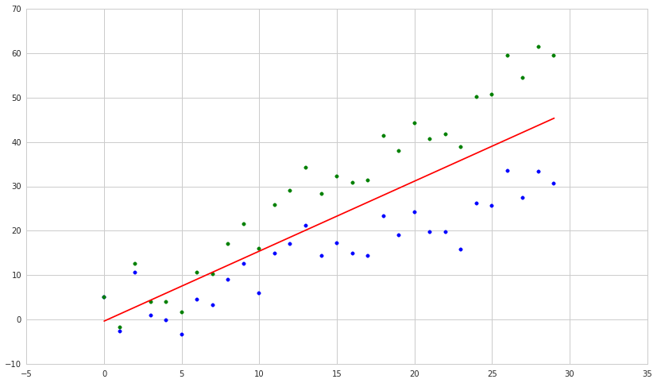
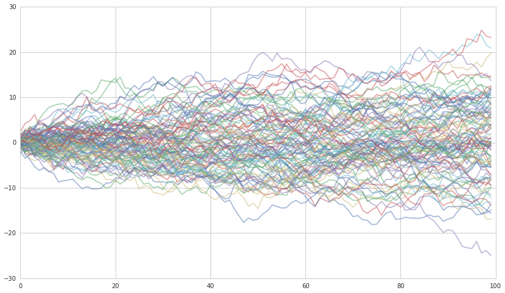

Model Misspecification
======================

By Evgenia “Jenny” Nitishinskaya and Delaney Mackenzie

Part of the Quantopian Lecture Series:

-  `www.quantopian.com/lectures <https://www.quantopian.com/lectures>`__
-  `github.com/quantopian/research_public <https://github.com/quantopian/research_public>`__

--------------

Model specification refers to the selection of the general function that
we are fitting to the data. We need to select: \* the dependent
variable(s) \* the independent variable(s) \* the functional form

For instance, we may assume that the dependent variable is a linear
function of two independent variables. If the model is not correctly
specified, regression assumptions will be violated and the model will
not be accurate. Below we define and explain many of the common model
specification errors.

Exclusion of important variables
================================

If we omit a variable which is uncorrelated with the variables that we
do include, we will simply not explain the dependent variable as well as
we could. However, if the omitted variable (say, :math:`X_2`) is
correlated with the included variable (:math:`X_1`), then the omission
additionally affects the model. The coefficient of :math:`X_1` and the
constant term in the regression will be biased by trying to compensate
for the omission of :math:`X_2`. This can lead us to overestimate the
effect of :math:`X_1` on the dependent variable. Also, estimated values
of the coefficients and the estimated standard errors will be
inconsistent.

In particular, we may be led to believe that two variables have a causal
relationship because of their high correlation, when in fact they are
both caused by a third. For instance, if two stocks both follow the
market, or two quantities both tend to increase with time, they will be
highly correlated.

.. code:: ipython2

    # Import the libraries we'll be using
    import numpy as np
    import statsmodels.api as sm
    from statsmodels import regression
    import matplotlib.pyplot as plt

.. code:: ipython2

    # Pull the pricing data for our two stocks and S&P 500
    start = '2013-01-01'
    end = '2015-01-01'
    bench = get_pricing('SPY', fields='price', start_date=start, end_date=end)
    a1 = get_pricing('LRCX', fields='price', start_date=start, end_date=end)
    a2 = get_pricing('AAPL', fields='price', start_date=start, end_date=end)
    
    # Perform linear regression and print R-squared values
    slr12 = regression.linear_model.OLS(a2, sm.add_constant(a1)).fit()
    slrb1 = regression.linear_model.OLS(a1, sm.add_constant(bench)).fit()
    slrb2 = regression.linear_model.OLS(a2, sm.add_constant(bench)).fit()
    print "R-squared values of linear regression"
    print "LRCX and AAPL: ", slr12.rsquared
    print "LRCX and SPY: ", slrb1.rsquared
    print "AAPL and SPY: ", slrb2.rsquared

.. parsed-literal::

    R-squared values of linear regression
    LRCX and AAPL:  0.911422827778
    LRCX and SPY:  0.874582528812
    AAPL and SPY:  0.795923926958

It’s hard to see consistency, or lack of it, since it is asymptotic and
probabilistic. However, we can extend our sample period to see how the
R-squared value changes. The correlation between the stocks and the
market seems to persist, while the correlation between the two stocks
drops. So we would be better off predicting the stock prices from the
market price than from each other.

.. code:: ipython2

    # Pull pricing data from further back
    start = '2009-01-01'
    end = '2015-01-01'
    bench = get_pricing('SPY', fields='price', start_date=start, end_date=end)
    a1 = get_pricing('LRCX', fields='price', start_date=start, end_date=end)
    a2 = get_pricing('AAPL', fields='price', start_date=start, end_date=end)
    
    # Perform linear regression and print R-squared values
    slr12 = regression.linear_model.OLS(a2, sm.add_constant(a1)).fit()
    slrb1 = regression.linear_model.OLS(a1, sm.add_constant(bench)).fit()
    slrb2 = regression.linear_model.OLS(a2, sm.add_constant(bench)).fit()
    print "R-squared values of linear regression"
    print "LRCX and AAPL: ", slr12.rsquared
    print "LRCX and SPY: ", slrb1.rsquared
    print "AAPL and SPY: ", slrb2.rsquared

.. parsed-literal::

    R-squared values of linear regression
    LRCX and AAPL:  0.499823847226
    LRCX and SPY:  0.747298792884
    AAPL and SPY:  0.756319173866

The best way to avoid this issue is to choose the independent variables
which you have reason to believe will be good predictors of the
dependent variable before starting the regression analysis. “Before” is
key: it’s important not to pick variables just based on how good the
regression analysis looks because that leads to overfitting.

Inclusion of unnecessary variables
==================================

Conversely, we can have a model which includes too many independent
variables. If we include a truly unnecessary variable, we will have a
lower adjusted R-squared and less precise estimates of the other
regression coefficients. That is, our analysis of the model will be
weakened, but the model itself will not change.

If we include variables that are only mostly irrelevant, however, we can
artificially improve the fit and the R-squared of our model by adding
bits of the slightly-correlated variables to conform to the sample data.
This runs the risk of overfitting, since the small adjustments we make
are sample-specific. For example, below we run a regression with PEP
price as the independent variable and PG price as the dependent variable
(which makes some sense as they are in the same sector) and then run
another regression with three random other stocks added in.

.. code:: ipython2

    # Load one year's worth of pricing data for five different assets
    start = '2014-01-01'
    end = '2015-01-01'
    x1 = get_pricing('PEP', fields='price', start_date=start, end_date=end)
    x2 = get_pricing('MCD', fields='price', start_date=start, end_date=end)
    x3 = get_pricing('ATHN', fields='price', start_date=start, end_date=end)
    x4 = get_pricing('DOW', fields='price', start_date=start, end_date=end)
    y = get_pricing('PG', fields='price', start_date=start, end_date=end)
    
    # Build a linear model using only x1 to explain y
    slr = regression.linear_model.OLS(y, sm.add_constant(x1)).fit()
    slr_prediction = slr.params[0] + slr.params[1]*x1
    
    # Run multiple linear regression using x1, x2, x3, x4 to explain y
    mlr = regression.linear_model.OLS(y, sm.add_constant(np.column_stack((x1,x2,x3,x4)))).fit()
    mlr_prediction = mlr.params[0] + mlr.params[1]*x1 + mlr.params[2]*x2 + mlr.params[3]*x3 + mlr.params[4]*x4
    
    # Compute adjusted R-squared for the two different models
    print 'SLR R-squared:', slr.rsquared_adj
    print 'MLR R-squared:', mlr.rsquared_adj
    
    # Plot y along with the two different predictions
    y.plot()
    slr_prediction.plot()
    mlr_prediction.plot()
    plt.legend(['PG', 'SLR', 'MLR']);

.. parsed-literal::

    SLR R-squared: 0.714538080242
    MLR R-squared: 0.888347333447

.. image:: notebook_files/notebook_8_1.png

We are able to tune the model with more variables more precisely to the
data. Note that although adjusted R-squared penalizes us for using more
variables, the number of samples here is so large that the adjustment is
tiny. Let’s see what happens if we use the same linear models to predict
the price of PG for the next six months:

.. code:: ipython2

    # Load a year and a half of pricing data
    start = '2015-01-01'
    end = '2015-06-01'
    x1 = get_pricing('PEP', fields='price', start_date=start, end_date=end)
    x2 = get_pricing('MCD', fields='price', start_date=start, end_date=end)
    x3 = get_pricing('ATHN', fields='price', start_date=start, end_date=end)
    x4 = get_pricing('DOW', fields='price', start_date=start, end_date=end)
    y = get_pricing('PG', fields='price', start_date=start, end_date=end)
    
    # Extend our model from before to the new time period
    slr_prediction2 = slr.params[0] + slr.params[1]*x1
    mlr_prediction2 = mlr.params[0] + mlr.params[1]*x1 + mlr.params[2]*x2 + mlr.params[3]*x3 + mlr.params[4]*x4
    
    # Compute adjusted R-squared over the extended time period
    adj = float(len(y) - 1)/(len(y) - 5) # Compute adjustment factor
    SST = sum((y - np.mean(y))**2)
    SSRs = sum((slr_prediction2 - y)**2)
    print 'SLR R-squared:', 1 - adj*SSRs/SST
    SSRm = sum((mlr_prediction2 - y)**2)
    print 'MLR R-squared:', 1 - adj*SSRm/SST
    
    # Plot y along with the two different predictions
    y.plot()
    slr_prediction2.plot()
    mlr_prediction2.plot()
    plt.legend(['PG', 'SLR', 'MLR']);

.. parsed-literal::

    SLR R-squared: -0.742493773006
    MLR R-squared: -1.74144128938

.. image:: notebook_files/notebook_10_1.png

Now both models are performing rather poorly - that is, they do not hold
up out of sample - but in particular the model from the multiple linear
regression is now doing worse than the model from the single linear
regression. Although this performance could have any number of causes,
we should not be surprised since we have no reason to believe that, say,
Athena Health stock has actual explanatory power in this situation.

Errors in independent variables
===============================

If we use indices or dates as our independent variables, they are
error-free. However, when we wish to use the value of a stock
:math:`X_t` as an independent variable, we can only measure the price,
which is full of small, random fluctuations. So we actually observe
:math:`Z_t = X_t + u_t` for some error :math:`u_t`. Our model is

.. math::  Y_t = b_0 + b_1 X_t + \epsilon_t 

that is, that some variable is linearly related to the value of a stock.
But since we only know the value of :math:`Z_t`, we use the model

.. math::  Y_t = b_0 + b_1 Z_t + (-b_1u_t + \epsilon_t) 

If :math:`u_t` is not correlated with :math:`X_t`, then it will be
correlated with :math:`Z_t`, and so the error term
:math:`-b_1u_t + \epsilon_t` will be correlated with our independent
variable :math:`Z_t`. Consequently, the coefficients will be biased and
inconsistent. In particular, :math:`b_1` will be biased downward.

Incorrect functional form
=========================

After we pick the variables we wish to include, we need to specify a
shape for the function. Although a regression requires that the function
be linear in the coefficients, we can manipulate the variables to
achieve various types of functions. For instance, the model
:math:`Y_i = b_0 + b_1 X_i^2 + \epsilon_i` gives a quadratic
relationship between :math:`X` and :math:`Y`, while the log-linear model
:math:`\ln Y_i = b_0 + b_1 X_i + \epsilon_i` gives an exponential one.
Generally we select the form based on our expectation of the
relationship: for example, a log-linear model is good when we expect the
rate of growth of :math:`Y` to be related to :math:`X`.

If the wrong form is selected, then we may be unable to get a good fit.
In fact, the model may lead to absurd conclusions. For example, if we
use a linear model where a logarithmic one would have been more
appropriate, we may predict that the number of companies in a certain
category becomes negative instead of approaching zero.

We also have to be careful not to pick a functional form that overfits
the data. Arbitrarily using high-degree polynomials leads to overfitting
since they have more degrees of freedom. Another issue is data-mining:
if we try different models until we find the one that looks best, we are
overfitting to the sample at the expense of future predictivity.

Pooling different populations
=============================

If we attempt to use one model for two populations for which separate
models would be more appropriate, we get results that are misleading in
one direction or the other. For instance, if we mix data about men’s and
women’s wages, there may be too much spread to find a model that fits
well, as in the artificial example below.

.. code:: ipython2

    # Generate two artificial samples and pool them
    sample1 = np.arange(30) + 4*np.random.randn(30)
    sample2 = sample1 + np.arange(30)
    pool = np.hstack((sample1, sample2))
    
    # Run a regression on the pooled data, with the independent variable being the original indices
    model = regression.linear_model.OLS(pool, sm.add_constant(np.hstack((np.arange(30),np.arange(30))))).fit()
    
    # Plot the two samples along with the regression line
    plt.scatter(np.arange(30), sample1, color='b')
    plt.scatter(np.arange(30), sample2, color='g')
    plt.plot(model.params[0] + model.params[1]*np.arange(30), color='r');

It’s clear that two separate models for the two datasets would be more
appropriate. Note that, as above, this can lead to assumption violations
like heteroskedasticity and errors that are not normally distributed.

Conversely, we can pool sets of observations which separately
demonstrate no correlation, but do appear to fit a correlation model
when taken together. To see why this might be a problem, consider a
model that compares companies’ free cash flow with cash flow from
operations. Below we see that there is a correlation between the two for
transportation companies with market cap over $100 million. However, if
we scale both datasets by the company revenue, the fit is much less
significant. That is, the correlation between free cash flow and cash
flow from operations is largely due to company size, and thus doesn’t
give us any information.

.. code:: ipython2

    # We'll be using pandas DataFrames
    import pandas as pd
    
    # Get most recent free cash flow, operating cash flow, and total revenue data
    fundamentals = init_fundamentals()
    today = pd.datetime.today()
    data = get_fundamentals(query(fundamentals.cash_flow_statement.free_cash_flow,
                                  fundamentals.cash_flow_statement.operating_cash_flow,
                                  fundamentals.income_statement.total_revenue,)
                            .filter(fundamentals.valuation.market_cap > 1e8, # Filter by market cap & industry
                                   fundamentals.company_reference.industry_template_code == 'T'), today).T
    
    # Drop missing data
    data.dropna(inplace=True)
    
    # Run linear regression and print R-squared value to evaluate the goodness of the fit 
    unscaled_model = regression.linear_model.OLS(data['operating_cash_flow'],
                                        sm.add_constant(data['free_cash_flow'])).fit()
    prediction = unscaled_model.params[0] + unscaled_model.params[1]*data['free_cash_flow']
    print 'R-squared value of model:', unscaled_model.rsquared
    
    # Plot the raw data for visualization
    plt.scatter(data['free_cash_flow'], data['operating_cash_flow'])
    plt.plot(data['free_cash_flow'], prediction)
    plt.legend(['Data', 'Model Prediction'])
    plt.xlabel('Free cash flow')
    plt.ylabel('Operating cash flow')
    plt.title('Transportation companies with market cap > $100 mil');

.. parsed-literal::

    R-squared value of model: 0.220562000294

.. image:: notebook_files/notebook_17_1.png

.. code:: ipython2

    # Run linear regression with inputs scaled by total revenue
    scaled_model = regression.linear_model.OLS(
        data['operating_cash_flow'].values/data['total_revenue'].values,
        sm.add_constant(data['free_cash_flow'].values/data['total_revenue'].values), missing='drop').fit()
    print 'R-squared value of scaled model:', scaled_model.rsquared
    
    prediction = scaled_model.params[0] + scaled_model.params[1]*(data['free_cash_flow'].values/data['total_revenue'].values)
    
    # Plot the scaled data
    plt.scatter(data['free_cash_flow'].values/data['total_revenue'].values,
                data['operating_cash_flow'].values/data['total_revenue'].values)
    plt.plot(data['free_cash_flow'].values/data['total_revenue'].values, prediction)
    plt.legend(['Data', 'Model Prediction'])
    plt.xlabel('Free cash flow/Total revenue')
    plt.ylabel('Operating cash flow/Total revenue')
    plt.title('Transportation companies with market cap > $100 mil');

.. parsed-literal::

    R-squared value of scaled model: 0.00138262658438

.. image:: notebook_files/notebook_18_1.png

In general, if we wish to compare data from different populations, we
can either analyze them separately or try to adjust for the differences
between them. Often we express the variables as ratios, such as scaling
by company revenue or by the average wages of each population.

Nonstationary time series
=========================

A stationary process is one whose joint probability distribution does
not change with time. In particular, its mean and variance are constant
through time. When we apply regression models to time series, we must
make the additional assumption that they are stationary. Otherwise, the
t-statistics for the parameters will not be valid.

A random walk is a process for which the best estimate for the next
value is the previous value; if you were to walk randomly, your location
after the each step would be somewhere near your location before the
step but in an unpredictable direction. Formally, such a one-dimensional
walk is described by the equation

.. math::  x_t = x_{t-1} + \epsilon_t 

where the error :math:`\epsilon_t` is homoskedastic, has mean zero, and
is not autocorrelated. For example, exchange rates are often assumed to
be random walks. Random walks have variance increasing with time, and
are therefore not stationary. They are subject to spurious results, and
two random walks will appear highly correlated very often. Try running
the code below several times:

All the walks
~~~~~~~~~~~~~

.. code:: ipython2

    # Generate normally distributed errors
    randos = [np.random.randn(100) for i in range(100)]
    y = np.random.randn(100)
    # Generate random walks
    randows = [[sum(rando[:i+1]) for i in range(100)] for rando in randos]
    yw = [sum(y[:i+1]) for i in range(100)]
    
    for i in range(100):
        plt.plot(randows[i], alpha=0.5)

Just those correlated with a randomly chosen one
~~~~~~~~~~~~~~~~~~~~~~~~~~~~~~~~~~~~~~~~~~~~~~~~

.. code:: ipython2

    # Compute R-squared of linear regression for each element of randows with yw
    rs = [regression.linear_model.OLS(yw, x).fit().rsquared for x in randows]
                        
    # Plot and count the random walks that have R-squared with yw > .8
    rcount = 0
    for i in range(100):
        if rs[i] > .8:
            rcount += 1
            plt.plot(randows[i], alpha=0.5)
    print 'Linearly related walks out of 100:', rcount
    
    # Plot yw
    plt.plot(yw, color='k');

.. parsed-literal::

    Linearly related walks out of 100: 0

.. image:: notebook_files/notebook_24_1.png

The reason for the two branches above is that a linear fit works well
for both positively and negatively correlated variables.

The result is even more extreme if we look at the random walks with
significant correlation, according to the p-values of their correlation
coefficients:

.. code:: ipython2

    from scipy.stats import pearsonr
    
    # Compute correlation coefficients (Pearson r) and record their p-values
    ps = [pearsonr(yw, x)[1] for x in randows]
                        
    # Plot and count the random walks that have p-value of correlation with yw < 0.05
    pcount = 0
    for i in range(100):
        if ps[i] < .05:
            pcount += 1
            plt.plot(randows[i], alpha=0.5)
    print 'Significantly correlated walks out of 100:', pcount
    
    # Plot yw
    plt.plot(yw, color='k');

.. parsed-literal::

    Significantly correlated walks out of 100: 70

.. image:: notebook_files/notebook_26_1.png

Because of the high probability of spurious results, the fit statistics
that we compute when regressing on random walks are invalid.
Furthermore, the parameter estimates are inconsistent.

We can detect random walks and related time series (such as a random
walk with drift) by checking for the presence of a unit root in the time
series; that is, whether or not it appears to follow the equation
:math:`x_t = x_{t-1} + \epsilon_t`. One method is using the
Dickey-Fuller test:

.. code:: ipython2

    from statsmodels.tsa.stattools import adfuller
    
    # Compute the p-value of the Dickey-Fuller statistic to test the null hypothesis that yw has a unit root
    print adfuller(yw)[1]

.. parsed-literal::

    0.285967465513

Therefore we cannot reject the hypothesis that ``yw`` has a unit root
(as we know it does, by construction). If we know that a time series has
a unit root and we would like to analyze it anyway, we can model instead
the first differenced series :math:`y_t = x_t - x_{t-1}` if that is
stationary, and use it to predict future values of :math:`x`. We can
also use regression if both the dependent and independent variables are
time series with unit roots and the two are cointegrated.

References
----------

-  “Quantitative Investment Analysis”, by DeFusco, McLeavey, Pinto, and
   Runkle

*This presentation is for informational purposes only and does not
constitute an offer to sell, a solicitation to buy, or a recommendation
for any security; nor does it constitute an offer to provide investment
advisory or other services by Quantopian, Inc. (“Quantopian”). Nothing
contained herein constitutes investment advice or offers any opinion
with respect to the suitability of any security, and any views expressed
herein should not be taken as advice to buy, sell, or hold any security
or as an endorsement of any security or company. In preparing the
information contained herein, Quantopian, Inc. has not taken into
account the investment needs, objectives, and financial circumstances of
any particular investor. Any views expressed and data illustrated herein
were prepared based upon information, believed to be reliable, available
to Quantopian, Inc. at the time of publication. Quantopian makes no
guarantees as to their accuracy or completeness. All information is
subject to change and may quickly become unreliable for various reasons,
including changes in market conditions or economic circumstances.*
