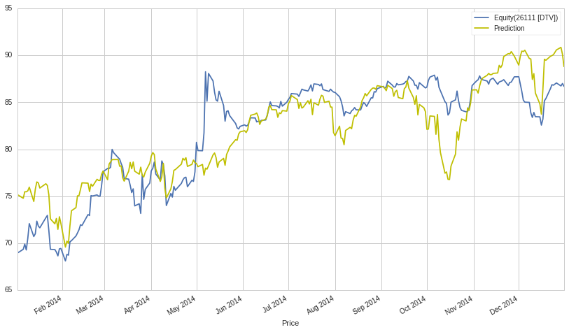
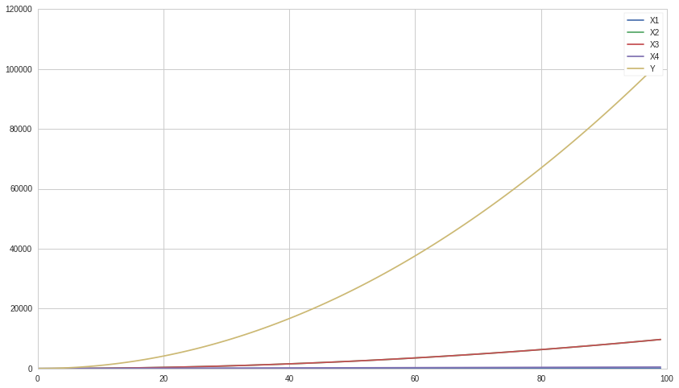

Multiple Linear Regression
==========================

By Evgenia “Jenny” Nitishinskaya, Maxwell Margenot, Delaney
Granizo-Mackenzie, and Gilbert Wasserman.

Part of the Quantopian Lecture Series:

-  `www.quantopian.com/lectures <https://www.quantopian.com/lectures>`__
-  `github.com/quantopian/research_public <https://github.com/quantopian/research_public>`__

.. code:: ipython2

    import numpy as np
    import pandas as pd
    import statsmodels.api as sm
    # If the observations are in a dataframe, you can use statsmodels.formulas.api to do the regression instead
    from statsmodels import regression
    import matplotlib.pyplot as plt

Multiple linear regression generalizes linear regression, allowing the
dependent variable to be a linear function of multiple independent
variables. As before, we assume that the variable :math:`Y` is a linear
function of :math:`X_1,\ldots, X_k`:

.. math::  Y_i = \beta_0 + \beta_1 X_{1i} + \ldots + \beta_k X_{ki} + \epsilon_i 

Often in finance the form will be written as follows, but it is just the
variable name that changes and otherwise the model is identical.

.. math::  Y_i = \alpha + \beta_1 X_{1i} + \ldots + \beta_k X_{ki} + \epsilon_i 

For observations :math:`i = 1,2,\ldots, n`. In order to find the plane
(or hyperplane) of best fit, we will use the method of ordinary
least-squares (OLS), which seeks to minimize the squared error between
predictions and observations, :math:`\sum_{i=1}^n \epsilon_i^2`. The
square makes positive and negative errors equally bad, and magnifies
large errors. It also makes the closed form math behind linear
regression nice, but we won’t go into that now. For an example of
squared error, see the following.

Let’s say Y is our actual data, and Y_hat is the predictions made by
linear regression.

.. code:: ipython2

    Y = np.array([1, 3.5, 4, 8, 12])
    Y_hat = np.array([1, 3, 5, 7, 9])
    
    print 'Error ' + str(Y_hat - Y)
    
    # Compute squared error
    SE = (Y_hat - Y) ** 2
    
    print 'Squared Error ' + str(SE)
    print 'Sum Squared Error ' + str(np.sum(SE))

.. parsed-literal::

    Error [ 0.  -0.5  1.  -1.  -3. ]
    Squared Error [ 0.    0.25  1.    1.    9.  ]
    Sum Squared Error 11.25

Once we have used this method to determine the coefficients of the
regression, we will be able to use new observed values of :math:`X` to
predict values of :math:`Y`.

Each coefficient :math:`\beta_j` tells us how much :math:`Y_i` will
change if we change :math:`X_j` by one while holding all of the other
dependent variables constant. This lets us separate out the
contributions of different effects. This is assuming the linear model is
the correct one.

We start by artificially constructing a :math:`Y`, :math:`X_1`, and
:math:`X_2` in which we know the precise relationship.

.. code:: ipython2

    # Construct a simple linear curve of 1, 2, 3, ...
    X1 = np.arange(100)
    
    # Make a parabola and add X1 to it, this is X2
    X2 = np.array([i ** 2 for i in range(100)]) + X1
    
    # This is our real Y, constructed using a linear combination of X1 and X2
    Y = X1 + X2
    
    plt.plot(X1, label='X1')
    plt.plot(X2, label='X2')
    plt.plot(Y, label='Y')
    plt.legend();

.. image:: notebook_files/notebook_6_0.png

We can use the same function from ``statsmodels`` as we did for a single
linear regression lecture.

.. code:: ipython2

    # Use column_stack to combine independent variables, then add a column of ones so we can fit an intercept
    X = sm.add_constant( np.column_stack( (X1, X2) ) )
    
    # Run the model
    results = regression.linear_model.OLS(Y, X).fit()
    
    print 'Beta_0:', results.params[0]
    print 'Beta_1:', results.params[1]
    print 'Beta_2:', results.params[2]

.. parsed-literal::

    Beta_0: 1.36424205266e-12
    Beta_1: 1.0
    Beta_2: 1.0

The same care must be taken with these results as with partial
derivatives. The formula for :math:`Y` is ostensibly

.. math:: X_1 + X_2 = X_1 + X^2 + X_1 = 2 X_1 + X^2

Or :math:`2X_1` plus a parabola.

However, the coefficient of :math:`X_1` is 1. That is because :math:`Y`
changes by 1 if we change :math:`X_1` by 1 while holding :math:`X_2`
constant. Multiple linear regression separates out contributions from
different variables.

Similarly, running a linear regression on two securities might give a
high :math:`\beta`. However, if we bring in a third security (like SPY,
which tracks the S&P 500) as an independent variable, we may find that
the correlation between the first two securities is almost entirely due
to them both being correlated with the S&P 500. This is useful because
the S&P 500 may then be a more reliable predictor of both securities
than they were of each other. This method allows us to better gauge the
significance between the two securities and prevent confounding the two
variables.

.. code:: ipython2

    # Load pricing data for two arbitrarily-chosen assets and SPY
    start = '2014-01-01'
    end = '2015-01-01'
    asset1 = get_pricing('DTV', fields='price', start_date=start, end_date=end)
    asset2 = get_pricing('FISV', fields='price', start_date=start, end_date=end)
    benchmark = get_pricing('SPY', fields='price', start_date=start, end_date=end)
    
    # First, run a linear regression on the two assets
    slr = regression.linear_model.OLS(asset1, sm.add_constant(asset2)).fit()
    print 'SLR beta of asset2:', slr.params[1]

.. parsed-literal::

    SLR beta of asset2: 0.903453633397

.. code:: ipython2

    # Run multiple linear regression using asset2 and SPY as independent variables
    mlr = regression.linear_model.OLS(asset1, sm.add_constant(np.column_stack((asset2, benchmark)))).fit()
    
    prediction = mlr.params[0] + mlr.params[1]*asset2 + mlr.params[2]*benchmark
    prediction.name = 'Prediction'
    
    print 'MLR beta of asset2:', mlr.params[1], '\nMLR beta of S&P 500:', mlr.params[2]

.. parsed-literal::

    MLR beta of asset2: -0.232309102745 
    MLR beta of S&P 500: 0.735923920897

The next step after running an analysis is determining if we can even
trust the results. A good first step is checking to see if anything
looks weird in graphs of the independent variables, dependent variables,
and predictions.

.. code:: ipython2

    # Plot the three variables along with the prediction given by the MLR
    asset1.plot()
    asset2.plot()
    benchmark.plot()
    prediction.plot(color='y')
    plt.xlabel('Price')
    plt.legend(bbox_to_anchor=(1,1), loc=2);

.. image:: notebook_files/notebook_13_0.png

.. code:: ipython2

    # Plot only the dependent variable and the prediction to get a closer look
    asset1.plot()
    prediction.plot(color='y')
    plt.xlabel('Price')
    plt.legend();

Evaluation
==========

We can get some statistics about the fit from the result returned by the
regression:

.. code:: ipython2

    mlr.summary()

.. raw:: html

    <table class="simpletable">
    <caption>OLS Regression Results</caption>
    <tr>
      <th>Dep. Variable:</th>    <td>Equity(26111 [DTV])</td> <th>  R-squared:         </th> <td>   0.715</td>
    </tr>
    <tr>
      <th>Model:</th>                    <td>OLS</td>         <th>  Adj. R-squared:    </th> <td>   0.713</td>
    </tr>
    <tr>
      <th>Method:</th>              <td>Least Squares</td>    <th>  F-statistic:       </th> <td>   313.1</td>
    </tr>
    <tr>
      <th>Date:</th>              <td>Fri, 22 Apr 2016</td>   <th>  Prob (F-statistic):</th> <td>1.08e-68</td>
    </tr>
    <tr>
      <th>Time:</th>                  <td>20:43:26</td>       <th>  Log-Likelihood:    </th> <td> -641.97</td>
    </tr>
    <tr>
      <th>No. Observations:</th>       <td>   252</td>        <th>  AIC:               </th> <td>   1290.</td>
    </tr>
    <tr>
      <th>Df Residuals:</th>           <td>   249</td>        <th>  BIC:               </th> <td>   1301.</td>
    </tr>
    <tr>
      <th>Df Model:</th>               <td>     2</td>        <th>                     </th>     <td> </td>   
    </tr>
    <tr>
      <th>Covariance Type:</th>       <td>nonrobust</td>      <th>                     </th>     <td> </td>   
    </tr>
    </table>
    <table class="simpletable">
    <tr>
        <td></td>       <th>coef</th>     <th>std err</th>      <th>t</th>      <th>P>|t|</th> <th>[95.0% Conf. Int.]</th> 
    </tr>
    <tr>
      <th>const</th> <td>  -45.9532</td> <td>    6.601</td> <td>   -6.962</td> <td> 0.000</td> <td>  -58.954   -32.953</td>
    </tr>
    <tr>
      <th>x1</th>    <td>   -0.2323</td> <td>    0.105</td> <td>   -2.216</td> <td> 0.028</td> <td>   -0.439    -0.026</td>
    </tr>
    <tr>
      <th>x2</th>    <td>    0.7359</td> <td>    0.063</td> <td>   11.767</td> <td> 0.000</td> <td>    0.613     0.859</td>
    </tr>
    </table>
    <table class="simpletable">
    <tr>
      <th>Omnibus:</th>       <td>16.118</td> <th>  Durbin-Watson:     </th> <td>   0.109</td>
    </tr>
    <tr>
      <th>Prob(Omnibus):</th> <td> 0.000</td> <th>  Jarque-Bera (JB):  </th> <td>  17.367</td>
    </tr>
    <tr>
      <th>Skew:</th>          <td> 0.596</td> <th>  Prob(JB):          </th> <td>0.000169</td>
    </tr>
    <tr>
      <th>Kurtosis:</th>      <td> 3.483</td> <th>  Cond. No.          </th> <td>6.85e+03</td>
    </tr>
    </table>

Model Assumptions
-----------------

The validity of these statistics depends on whether or not the
assumptions of the linear regression model are satisfied. These are: \*
The independent variable is not random. \* The variance of the error
term is constant across observations. This is important for evaluating
the goodness of the fit. \* The errors are not autocorrelated. The
Durbin-Watson statistic reported by the regression detects this. If it
is close to :math:`2`, there is no autocorrelation. \* The errors are
normally distributed. If this does not hold, we cannot use some of the
statistics, such as the F-test.

Multiple linear regression also requires an additional assumption: \*
There is no exact linear relationship between the independent variables.
Otherwise, it is impossible to solve for the coefficients
:math:`\beta_i` uniquely, since the same linear equation can be
expressed in multiple ways.

If there is a linear relationship between any set of independent
variables, also known as covariance, we say that they are linear
combinations of each other. In the case where they are dependent on each
other in this manner, the values of our :math:`\beta_i` coefficients
will be inaccurate for a given :math:`X_i`. The intuition for this can
be found in an exteme example where :math:`X_1` and :math:`X_2` are 100%
covarying. In that case then linear regression can equivalently assign
the total coefficient sum in any combination without affecting the
predictive capability.

.. math::  1X_1 + 0X_2 = 0.5X_1 + 0.5X_2 = 0X_1 + 1X_2 

While our coefficients may be nondescriptive, the ultimate model may
still be accurate provided that there is a good overall fit between the
independent variables and the dependent variables. The best practice for
constructing a model where dependence is a problem is to leave out the
less descriptive variables that are correlated with the better ones.
This improves the model by reducing the chances of overfitting while
bringing the :math:`\beta_i` estimates closer to their true values.

If we confirm that the necessary assumptions of the regression model are
satisfied, we can safely use the statistics reported to analyze the fit.
For example, the :math:`R^2` value tells us the fraction of the total
variation of :math:`Y` that is explained by the model. When doing
multiple linear regression, however, we prefer to use adjusted
:math:`R^2`, which corrects for the small increases in :math:`R^2` that
occur when we add more regression variables to the model, even if they
are not significantly correlated with the dependent variable. Adjusted
:math:`R^2` is defined as

.. math::  1 - (1 - R^2)\frac{n-1}{n-k-1} 

Where :math:`n` is the number of observations and :math:`k` is the
number of independent variables in the model. Other useful statistics
include the F-statistic and the standard error of estimate.

Model Selection Example
=======================

When deciding on the best possible model of your dependent variables,
there are several different methods to turn to. If you use too many
explanatory variables, you run the risk of overfitting your model, but
if you use too few you may end up with a terrible fit. One of the most
prominent methods to decide on a best model is stepwise regression.
Forward stepwise regression starts from an empty model and tests each
individual variable, selecting the one that results in the best model
quality, usually measured with AIC or BIC (lowest is best). It then adds
the remaining variables one at a time, testing each subsequent
combination of explanatory variables in a regression and calculating the
AIC or BIC value at each step. At the end of the regression, the model
with the best quality (according to the given measure) is selected and
presented as a the final, best model. This does have limitations,
however. It does not test every single possible combination of variables
so it may miss the theoretical best model if a particular variable was
written off earlier in performing the algorithm. As such, stepwise
regression should be used in combination with your best judgment
regarding the model.

.. code:: ipython2

    X1 = np.arange(100)
    X2 = [i**2 for i in range(100)] - X1
    X3 = [np.log(i) for i in range(1, 101)] + X2
    X4 = 5 * X1
    Y = 2 * X1 + 0.5 * X2 + 10 * X3 + X4
    
    plt.plot(X1, label='X1')
    plt.plot(X2, label='X2')
    plt.plot(X3, label='X3')
    plt.plot(X4, label='X4')
    plt.plot(Y, label='Y')
    plt.legend();

.. code:: ipython2

    results = regression.linear_model.OLS(Y, sm.add_constant(np.column_stack((X1,X2,X3,X4)))).fit()
    
    print "Beta_0: ", results.params[0]
    print "Beta_1: ", results.params[1]
    print "Beta_2: ", results.params[2]
    print "Beta_3: ", results.params[3]
    print "Beta_4: ", results.params[4]

.. parsed-literal::

    Beta_0:  -6.36646291241e-12
    Beta_1:  0.269230769231
    Beta_2:  0.499999999994
    Beta_3:  10.0
    Beta_4:  1.34615384615

.. code:: ipython2

    data = pd.DataFrame(np.column_stack((X1,X2,X3,X4)), columns = ['X1','X2','X3','X4'])
    response = pd.Series(Y, name='Y')

.. code:: ipython2

    def forward_aic(response, data):
        # This function will work with pandas dataframes and series
        
        # Initialize some variables
        explanatory = list(data.columns)
        selected = pd.Series(np.ones(data.shape[0]), name="Intercept")
        current_score, best_new_score = np.inf, np.inf
        
        # Loop while we haven't found a better model
        while current_score == best_new_score and len(explanatory) != 0:
            
            scores_with_elements = []
            count = 0
            
            # For each explanatory variable
            for element in explanatory:
                # Make a set of explanatory variables including our current best and the new one
                tmp = pd.concat([selected, data[element]], axis=1)
                # Test the set
                result = regression.linear_model.OLS(Y, tmp).fit()
                score = result.aic
                scores_with_elements.append((score, element, count))
                count += 1
            
            # Sort the scoring list
            scores_with_elements.sort(reverse = True)
            # Get the best new variable
            best_new_score, best_element, index = scores_with_elements.pop()
            if current_score > best_new_score:
                # If it's better than the best add it to the set
                explanatory.pop(index)
                selected = pd.concat([selected, data[best_element]],axis=1)
                current_score = best_new_score
        # Return the final model
        model = regression.linear_model.OLS(Y, selected).fit()
        return model

.. code:: ipython2

    result = forward_aic(Y, data)
    result.summary()

.. raw:: html

    <table class="simpletable">
    <caption>OLS Regression Results</caption>
    <tr>
      <th>Dep. Variable:</th>            <td>y</td>        <th>  R-squared:         </th> <td>   1.000</td> 
    </tr>
    <tr>
      <th>Model:</th>                   <td>OLS</td>       <th>  Adj. R-squared:    </th> <td>   1.000</td> 
    </tr>
    <tr>
      <th>Method:</th>             <td>Least Squares</td>  <th>  F-statistic:       </th> <td>3.092e+26</td>
    </tr>
    <tr>
      <th>Date:</th>             <td>Fri, 22 Apr 2016</td> <th>  Prob (F-statistic):</th>  <td>  0.00</td>  
    </tr>
    <tr>
      <th>Time:</th>                 <td>20:43:27</td>     <th>  Log-Likelihood:    </th> <td>  1700.7</td> 
    </tr>
    <tr>
      <th>No. Observations:</th>      <td>   100</td>      <th>  AIC:               </th> <td>  -3393.</td> 
    </tr>
    <tr>
      <th>Df Residuals:</th>          <td>    96</td>      <th>  BIC:               </th> <td>  -3383.</td> 
    </tr>
    <tr>
      <th>Df Model:</th>              <td>     3</td>      <th>                     </th>     <td> </td>    
    </tr>
    <tr>
      <th>Covariance Type:</th>      <td>nonrobust</td>    <th>                     </th>     <td> </td>    
    </tr>
    </table>
    <table class="simpletable">
    <tr>
          <td></td>         <th>coef</th>     <th>std err</th>      <th>t</th>      <th>P>|t|</th> <th>[95.0% Conf. Int.]</th> 
    </tr>
    <tr>
      <th>Intercept</th> <td>-1.455e-11</td> <td> 7.01e-09</td> <td>   -0.002</td> <td> 0.998</td> <td>-1.39e-08  1.39e-08</td>
    </tr>
    <tr>
      <th>X3</th>        <td>   10.0000</td> <td> 4.24e-09</td> <td> 2.36e+09</td> <td> 0.000</td> <td>   10.000    10.000</td>
    </tr>
    <tr>
      <th>X1</th>        <td>    0.2692</td> <td>  1.3e-11</td> <td> 2.08e+10</td> <td> 0.000</td> <td>    0.269     0.269</td>
    </tr>
    <tr>
      <th>X2</th>        <td>    0.5000</td> <td> 4.24e-09</td> <td> 1.18e+08</td> <td> 0.000</td> <td>    0.500     0.500</td>
    </tr>
    <tr>
      <th>X4</th>        <td>    1.3462</td> <td> 6.48e-11</td> <td> 2.08e+10</td> <td> 0.000</td> <td>    1.346     1.346</td>
    </tr>
    </table>
    <table class="simpletable">
    <tr>
      <th>Omnibus:</th>       <td>14.070</td> <th>  Durbin-Watson:     </th> <td>   0.001</td>
    </tr>
    <tr>
      <th>Prob(Omnibus):</th> <td> 0.001</td> <th>  Jarque-Bera (JB):  </th> <td>   9.981</td>
    </tr>
    <tr>
      <th>Skew:</th>          <td>-0.647</td> <th>  Prob(JB):          </th> <td> 0.00680</td>
    </tr>
    <tr>
      <th>Kurtosis:</th>      <td> 2.152</td> <th>  Cond. No.          </th> <td>6.22e+17</td>
    </tr>
    </table>

In the construction of this model, the :math:`X_4` term is highly
closely related to the :math:`X1` term, simply multiplying it by a
scalar. However, stepwise regression did not catch this and remove the
variable and simply adjust the coefficient of the :math:`X_1` term. Our
own judgment would say to leave the :math:`X_4` term out of the model,
showing the limitations of stepwise regression.

There are other ways to diagnose the health of a model and individual
variables with varying degrees of penalty given to more complex models.
This will be covered in-depth in a model selection notebook.

*This presentation is for informational purposes only and does not
constitute an offer to sell, a solicitation to buy, or a recommendation
for any security; nor does it constitute an offer to provide investment
advisory or other services by Quantopian, Inc. (“Quantopian”). Nothing
contained herein constitutes investment advice or offers any opinion
with respect to the suitability of any security, and any views expressed
herein should not be taken as advice to buy, sell, or hold any security
or as an endorsement of any security or company. In preparing the
information contained herein, Quantopian, Inc. has not taken into
account the investment needs, objectives, and financial circumstances of
any particular investor. Any views expressed and data illustrated herein
were prepared based upon information, believed to be reliable, available
to Quantopian, Inc. at the time of publication. Quantopian makes no
guarantees as to their accuracy or completeness. All information is
subject to change and may quickly become unreliable for various reasons,
including changes in market conditions or economic circumstances.*
