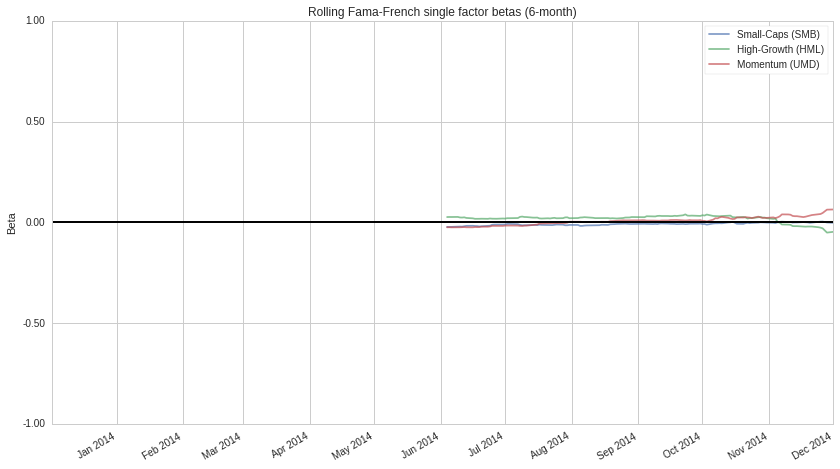
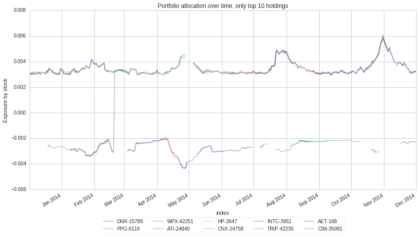
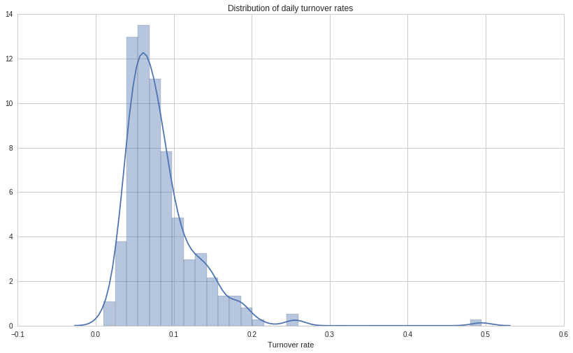
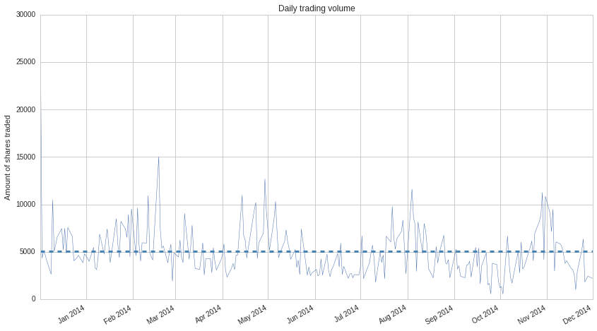

Portfolio Analysis
==================

by Samuel Ching, Maxwell Margenot, Gus Gordon, and Delaney Mackenzie

Part of the Quantopian Lecture Series:

-  `www.quantopian.com/lectures <https://www.quantopian.com/lectures>`__
-  https://github.com/quantopian/research_public

--------------

In professional quant workflows, it is critical to demonstrate the
efficacy of any portfolio through rigorous testing. This is fundamental
to understanding the risk profile as well as the performance of the
portfolio. As such, quants and developers often have to build in-house
tools to measure these metrics. To this end, we have created a package
called pyfolio. pyfolio is a Python library for performance and risk
analysis of financial portfolios, available on github
`here <https://github.com/quantopian/pyfolio>`__. It allows us to easily
generate tear sheets to analyze the risk and performance of trading
algorithms as well as return streams in general.

Issues with Backtesting
-----------------------

It is often tempting to run many backtests while building an algorithm.
A common pitfall is to use the success of backtests as a feedback metric
to fine-tune an algorithm’s parameters or features while still in the
construction phase. This leads to the overfitting of the strategy to
whichever time periods the user ran the backtests on. Ultimately, this
results in poor performance when deployed out of sample in live trading.

As such, running backtests and generating tearsheets should only occur
at the tail end of the algorithm creation lifecycle. We then get a
picture of the algorithm’s performance, aiding the user in deciding
whether to move forward with the deployment of the algorithm or to
switch to another strategy.

There are two main parts to a full pyfolio tearsheet. First, there are
the performance statistics in table format. Useful metrics such as the
annual return, market beta, and Sharpe ratio are all listed in this
table. These metrics not only represent how well the strategy has
performed during the time period of the backtest (annual rate of
return), they also show the risk-adjusted return as measured by the
different ratios. We will go into more detail about the meaning of these
metrics.

Next, there are plots which help to visualize a variety of the
performance metrics. For instance, the user can use the drawdown plots
to quickly pinpoint the time periods in which the strategy performed the
worst. In addition, it will help the user to see if the strategy is
performing as it should - if a strategy is market neutral, but suffers
significant drawdowns during crisis periods, then there are clearly
issues with the strategy’s design or implementation.

Setup - Getting a Backtest into the Research Environment
~~~~~~~~~~~~~~~~~~~~~~~~~~~~~~~~~~~~~~~~~~~~~~~~~~~~~~~~

First, we import a backtest into the research envrionment. In this
lecture, we will use the backtest from `this forum
post <https://www.quantopian.com/posts/how-to-get-an-allocation-writing-an-algorithm-for-the-quantopian-investment-management-team>`__.

.. code:: ipython2

    import pyfolio as pf
    import matplotlib.pyplot as plt
    import empyrical

.. code:: ipython2

    # Get benchmark returns
    benchmark_rets = pf.utils.get_symbol_rets('SPY')

.. code:: ipython2

    # Get the backtest
    bt = get_backtest('58812b2977ca4c474bbf393f')

.. parsed-literal::

    100% Time: 0:00:07|###########################################################|

Now, we want to understand the returns, positions and transactions of
the trading algorithm over our backtest’s time period. We can get these
data points from ``backtest`` object attributes.

.. code:: ipython2

    bt_returns = bt.daily_performance['returns']
    bt_positions = bt.pyfolio_positions
    bt_transactions = bt.pyfolio_transactions

Now, we are ready to use pyfolio to dive into the different performance
metrics and plots of our algorithm. Throughout the course of this
lecture we will detail how to interpret the various individual plots
generated by an pyfolio tear sheet and include the proper call to
generate the whole tear sheet at once at the end. This function is built
into our backtest object, removing the need to write out all the code in
the long form presented here.

Performance Statistics
~~~~~~~~~~~~~~~~~~~~~~

With pyfolio, there is a wealth of performance statistics which most
professional fund managers would use to analyze the performance of the
algorithm. These metrics range from the algorithm’s annual and monthly
returns, return quantiles, rolling beta and sharpe ratios to the
turnover of the portfolio. The most critical metrics are discussed as
follows.

Risk-Adjusted Return
^^^^^^^^^^^^^^^^^^^^

The risk-adjusted return is an essential metric of any strategy.
Risk-adjusted returns allow us to judge returns streams that have
different individual volatilities by providing an avenue for meaningful
comparison. There are different measures of risk-adjusted returns but
one of the most popular is the Sharpe ratio. In this particular
backtest, the annual return of :math:`2\%` for :math:`1\%` volatility is
an example of a relatively low absolute return, but a relatively high
risk-adjusted return. Then, with a low risk strategy, leverage can then
be applied to increase the absolute return.

.. code:: ipython2

    print "The Sharpe Ratio of the backtest is: ", empyrical.sharpe_ratio(bt_returns)

.. parsed-literal::

    The Sharpe Ratio of the backtest is:  1.29850718492

Market Beta
^^^^^^^^^^^

The market beta of an algorithm is the exposure of that stategy to the
broader market. For instance, a market beta of :math:`1` would mean that
you’re buying the the market, while a beta of :math:`-1` means that you
are shorting the market. Any beta within this range signifies reduced
market influence, while any beta outside this range signifies increased
market influence.

.. code:: ipython2

    print "The market beta of the backtest is: ", empyrical.beta(bt_returns,benchmark_rets)

.. parsed-literal::

    The market beta of the backtest is:  -0.00165873783566

In the case of this strategy, the beta is 0. This means that this
strategy has no exposure to the broader market, it is *market neutral*.
To institutional investors, market neutral strategies are very
attractive. After all, if the investors want a strategy which is highly
exposed to the market, they could simply buy an ETF or an index fund.

Drawdowns
^^^^^^^^^

A drawdown is the ‘peak to trough decline’ of an investment strategy.
Intuitively speaking, it refers to the losses the strategy has
experienced from the base amount of capital which it had at the peak.
For instance, in the 2008 Financial Crisis, the market drawdown was over
50% from the peak in 2007 to the trough in 2009.

.. code:: ipython2

    print "The maxmimum drawdown of the backtest is: ", empyrical.max_drawdown(bt_returns)

.. parsed-literal::

    The maxmimum drawdown of the backtest is:  -0.0113644622693

This is another measure of the financial risk of an algorithm. If the
net drawdown of a strategy is very significant, this generally means
that the volatility of the algorithm is more significant. Good
strategies try to limit drawdowns. A good benchmark is to have a maximum
drawdown of less than 20%.

Plotting
~~~~~~~~

In pyfolio, there is a ``plotting`` module which allows users to quickly
plot these metrics. These plots can be individually plotted using the
following functions:

-  ``plot_annual_returns``
-  ``plot_daily_returns_similarity``
-  ``plot_daily_volume``
-  ``plot_drawdown_periods``
-  ``plot_drawdown_underwater``
-  ``plot_exposures``
-  ``plot_gross_leverage``
-  ``plot_holdings``
-  ``plot_long_short_holdings``
-  ``plot_monthly_returns_dist``
-  ``plot_monthly_returns_heatmap``
-  ``plot_multistrike_cones``
-  ``plot_prob_profit_trade``
-  ``plot_return_quantiles``
-  ``plot_rolling_beta``
-  ``plot_rolling_returns``
-  ``plot_rolling_sharpe``
-  ``plot_turnover``
-  ``plot_txn_time_hist``
-  ``show_and_plot_top_positions``

Returns Plots
~~~~~~~~~~~~~

Plots of cumulative returns and daily, non-cumulative returns allow you
to gain a quick overview of the algorithm’s performance and pick out any
anomalies across the time period of the backtest. The cumulative return
plot also allows you to make a comparison against benchmark returns -
this could be against another investment strategy or an index like the
S&P 500.

.. code:: ipython2

    # Cumulative Returns
    plt.subplot(2,1,1)
    pf.plotting.plot_rolling_returns(bt_returns, benchmark_rets)
    
    # Daily, Non-Cumulative Returns
    plt.subplot(2,1,2)
    pf.plotting.plot_returns(bt_returns)
    plt.tight_layout()

.. image:: notebook_files/notebook_20_0.png

With the annual and monthly return plots, you can see which years and
months the algorithm performed the best in. For instance, in the monthly
heatmap plot, this algorithm performed the best in June 2014 (shaded in
dark green). In a backtest with a longer period of time, these plots
will reveal more information. Furthermore, the distribution of the
monthly returns is also instructive in gauging how the algorithm
performs in different periods throughout the year and if it is affected
by seasonal patterns.

.. code:: ipython2

    fig = plt.figure(1)
    plt.subplot(1,3,1)
    pf.plot_annual_returns(bt_returns)
    plt.subplot(1,3,2)
    pf.plot_monthly_returns_dist(bt_returns)
    plt.subplot(1,3,3)
    pf.plot_monthly_returns_heatmap(bt_returns)
    plt.tight_layout()
    fig.set_size_inches(15,5)

.. image:: notebook_files/notebook_22_0.png

Return Quantiles
^^^^^^^^^^^^^^^^

These box and whisker plots provide an overview of the return quantiles
broken down by the return timeframe (daily / weekly / monthly) across
the entire backtest time period.

.. code:: ipython2

    pf.plot_return_quantiles(bt_returns);

.. image:: notebook_files/notebook_24_0.png

The center line in the middle of each box shows the median return, and
the box shows the first quartile (25th percentile) as well as the 3rd
quartile (75th percentile). While a high median return is always
helpful, it is also important to understand the returns distribution. A
tight box means that the bulk of the returns (25th - 75th percentile)
fall within a tight bound - i.e. the returns are consistent and not
volatile. A larger box means that the returns are more spread out. It is
important, however, to take note of the scale to the left to put the
quartiles in perspective. In addition, returns over longer periods of
time will have a wider distribution as increasing the length of time
increases the variability in returns.

The ‘whiskers’ at the end indicate the returns which fall outside the
25th and 75th percentile. A tight box with long whiskers indicate that
there may be outliers in the returns - which may not be ideal if the
outliers are negative. This may indicate that your strategy may be
susceptible to certain market conditions / time periods.

Rolling Plots
~~~~~~~~~~~~~

Below, we have several rolling plots which show how an estimate changes
throughout backtest period. In the case of the rolling beta and the
rolling Sharpe ratio, the rolling estimate gives us more information
than single point estimate for the entire period. A rolling estimate
allows the user to see if the risk-adjusted return of the algorithm
(Sharpe ratio) is consistent over time or if it fluctuates
significantly. A volatile Sharpe ratio may indicate that the strategy
may be riskier at certain time points or that it does not perform as
well at these time points. Likewise, a volatile rolling beta indicates
that it is exposed to the market during certain time points - if the
strategy is meant to be market neutral, this could be a red flag.

Rolling Beta Plot
^^^^^^^^^^^^^^^^^

The plot below shows the rolling beta of the strategy against benchmark
returns over the entire period of the backtest. In this instance, the
benchmark return of the SPY was used. Thus, the lower the rolling
portfolio beta to the SPY, the more market neutral an algorithm is.

.. code:: ipython2

    pf.plot_rolling_beta(bt_returns, benchmark_rets);

.. image:: notebook_files/notebook_28_0.png

Rolling Sharpe Ratio Plot
^^^^^^^^^^^^^^^^^^^^^^^^^

The plot below shows the rolling Sharpe ratio over the period of the
backtest. This allows you to understand the performance of the algorithm
at different time points.

.. code:: ipython2

    pf.plot_rolling_sharpe(bt_returns);

.. image:: notebook_files/notebook_30_0.png

In the case of this strategy, the Sharpe ratio is above 2 for the first
4 months before dropping toward the end of the year. It would be helpful
here to check if this algorithm is exposed to other risk factors. This
may help to explain the end of year slump. In addition, it would be
helpful to understand the market situation at that point in time to see
if the strategy was in some way affected by market events.

Rolling Fama-French Single Factor Betas Plot
^^^^^^^^^^^^^^^^^^^^^^^^^^^^^^^^^^^^^^^^^^^^

In this plot, we see how exposed the strategy is to the 3 classical
Fama-French factors. A factor model can be used to analyze the sources
of risks and returns in a strategy or of any return stream. By looking
at a strategy’s historical returns, we can determine how much of these
returns can be attributed to speculation on different factors and how
much is a result of asset-specific fluctuations. This allows you to find
out the sources of risk the portfolio is exposed to. For more
information about Factor Models, check out the `Factor Risk Exposure
lecture <https://www.quantopian.com/lectures#Factor-Risk-Exposure>`__.

.. code:: ipython2

    pf.plot_rolling_fama_french(bt_returns);

These classical risk factors measure for small market cap, high-growth,
and momentum stocks. The SMB curve represents small-cap stocks minus
big-cap stocks, HML curve represents high-growth minus low-growth
stocks, and the UMD curve checks exposure to any momentum strategy
(i.e. stocks which are trending up perform better than stocks which are
trending down). The idea behind these risk factors is that even though
they may provide higher returns, they are able to do so because they are
riskier. Therefore, low measures of these in your strategy may indicate
that your strategy is less risky.

Similar to the beta exposure to the market, a high exposure to a fama
french factor ( :math:`\geq 1`) means that you are simply buying these
known risk factors. If an algorithm’s return is made up of *known* risk
factors, such as the Fama-French ones, then the strategy is not as
valuable in generating alpha.

Drawdown Plots
^^^^^^^^^^^^^^

In this plot, we visualize the drawdown chart described above. This
chart provides an overview of the worst drawdown periods in the
backtest. These periods show the time windows in the backtest in which
the top 5 drawdowns occurred.

.. code:: ipython2

    pf.plot_drawdown_periods(bt_returns);

.. image:: notebook_files/notebook_36_0.png

This, coupled with the underwater plot, allows for a quick check into
the time periods during which the algorithm struggles. Generally
speaking, the less volatile an algorithm is, the more minimal the
drawdowns.

.. code:: ipython2

    pf.plot_drawdown_underwater(bt_returns);

.. image:: notebook_files/notebook_38_0.png

Gross Leverage
^^^^^^^^^^^^^^

Gross leverage is the sum of long and short leverage exposure per share
divided by net asset value. This plot allows you to see the amount of
leverage being applied to the portfolio over the backtest period.

.. code:: ipython2

    pf.plot_gross_leverage(bt_returns, bt_positions);

.. image:: notebook_files/notebook_40_0.png

Monitoring the leverage of a strategy is important as it affects how you
trade on margin. Unlike discretionary strategies where you could
actively increase or decrease the leverage used in going long or short,
algorithmic strategies automatically apply leverage during trading.
Therefore, it is useful to monitor the gross leverage plot to ensure
that the amount of leverage that your strategy uses is within the limits
that you are comfortable with.

Good strategies generally start with an initial leverage of 1. Upon
finding out the viability of the strategy by examining the Sharpe ratio
and other metrics, leverage can be increased or decreased accordingly. A
lower Sharpe ratio indicates that the strategy has a higher volatility
per unit return, making it more risky to lever up. On the other hand, a
higher Sharpe ratio indicates lower volatility per unit return, allowing
you to increase the leverage and correspondingly, returns.

For more details, take a look at the `lecture on
leverage <https://www.quantopian.com/lectures#Leverage>`__.

Positions Plots
~~~~~~~~~~~~~~~

Top Long and Short Positions
^^^^^^^^^^^^^^^^^^^^^^^^^^^^

The tables below list the top 10 long and short positions of all time.
The goal of each algorithm is to minimize the proportion of the
portfolio invested in each security at any time point. This prevents the
movement of any individual security from having a significant impact on
the portfolio as a whole. The bigger the exposure a strategy has to any
security, the greater the risk.

Generally, the biggest failure point for many strategies is high
portfolio concentration in a few securities. While this may produce
significant positive returns over a given time period, the converse can
easily occur. Huge swings in a small number of equities would result in
significant drawdowns. Good strategies tend to be those in which no
security comprises more than 10% of the portfolio.

.. code:: ipython2

    pos_percent = pf.pos.get_percent_alloc(bt_positions)
    pf.plotting.show_and_plot_top_positions(bt_returns, pos_percent);

.. raw:: html

    

    <table border="1" class="dataframe">
      <thead>
        <tr style="text-align: right;">
          <th>Top 10 long positions of all time</th>
          <th>max</th>
        </tr>
      </thead>
      <tbody>
        <tr>
          <th>DNR-15789</th>
          <td>0.60%</td>
        </tr>
        <tr>
          <th>PPG-6116</th>
          <td>0.60%</td>
        </tr>
        <tr>
          <th>WPX-42251</th>
          <td>0.60%</td>
        </tr>
        <tr>
          <th>ATI-24840</th>
          <td>0.59%</td>
        </tr>
        <tr>
          <th>HP-3647</th>
          <td>0.59%</td>
        </tr>
        <tr>
          <th>CNX-24758</th>
          <td>0.59%</td>
        </tr>
        <tr>
          <th>INTC-3951</th>
          <td>0.59%</td>
        </tr>
        <tr>
          <th>TRIP-42230</th>
          <td>0.59%</td>
        </tr>
        <tr>
          <th>AET-168</th>
          <td>0.59%</td>
        </tr>
        <tr>
          <th>CIM-35081</th>
          <td>0.59%</td>
        </tr>
      </tbody>
    </table>
    

.. raw:: html

    

    <table border="1" class="dataframe">
      <thead>
        <tr style="text-align: right;">
          <th>Top 10 short positions of all time</th>
          <th>max</th>
        </tr>
      </thead>
      <tbody>
        <tr>
          <th>THC-5343</th>
          <td>-0.45%</td>
        </tr>
        <tr>
          <th>SHLD-26169</th>
          <td>-0.45%</td>
        </tr>
        <tr>
          <th>BBY-754</th>
          <td>-0.45%</td>
        </tr>
        <tr>
          <th>SPLS-7061</th>
          <td>-0.44%</td>
        </tr>
        <tr>
          <th>WTW-23269</th>
          <td>-0.44%</td>
        </tr>
        <tr>
          <th>GME-23438</th>
          <td>-0.44%</td>
        </tr>
        <tr>
          <th>CPB-1795</th>
          <td>-0.44%</td>
        </tr>
        <tr>
          <th>PFE-5923</th>
          <td>-0.44%</td>
        </tr>
        <tr>
          <th>T-6653</th>
          <td>-0.44%</td>
        </tr>
        <tr>
          <th>MAT-4668</th>
          <td>-0.44%</td>
        </tr>
      </tbody>
    </table>
    

.. raw:: html

    

    <table border="1" class="dataframe">
      <thead>
        <tr style="text-align: right;">
          <th>Top 10 positions of all time</th>
          <th>max</th>
        </tr>
      </thead>
      <tbody>
        <tr>
          <th>DNR-15789</th>
          <td>0.60%</td>
        </tr>
        <tr>
          <th>PPG-6116</th>
          <td>0.60%</td>
        </tr>
        <tr>
          <th>WPX-42251</th>
          <td>0.60%</td>
        </tr>
        <tr>
          <th>ATI-24840</th>
          <td>0.59%</td>
        </tr>
        <tr>
          <th>HP-3647</th>
          <td>0.59%</td>
        </tr>
        <tr>
          <th>CNX-24758</th>
          <td>0.59%</td>
        </tr>
        <tr>
          <th>INTC-3951</th>
          <td>0.59%</td>
        </tr>
        <tr>
          <th>TRIP-42230</th>
          <td>0.59%</td>
        </tr>
        <tr>
          <th>AET-168</th>
          <td>0.59%</td>
        </tr>
        <tr>
          <th>CIM-35081</th>
          <td>0.59%</td>
        </tr>
      </tbody>
    </table>
    

.. raw:: html

    

    <table border="1" class="dataframe">
      <thead>
        <tr style="text-align: right;">
          <th>All positions ever held</th>
          <th>max</th>
        </tr>
      </thead>
      <tbody>
        <tr>
          <th>DNR-15789</th>
          <td>0.60%</td>
        </tr>
        <tr>
          <th>PPG-6116</th>
          <td>0.60%</td>
        </tr>
        <tr>
          <th>WPX-42251</th>
          <td>0.60%</td>
        </tr>
        <tr>
          <th>ATI-24840</th>
          <td>0.59%</td>
        </tr>
        <tr>
          <th>HP-3647</th>
          <td>0.59%</td>
        </tr>
        <tr>
          <th>CNX-24758</th>
          <td>0.59%</td>
        </tr>
        <tr>
          <th>INTC-3951</th>
          <td>0.59%</td>
        </tr>
        <tr>
          <th>TRIP-42230</th>
          <td>0.59%</td>
        </tr>
        <tr>
          <th>AET-168</th>
          <td>0.59%</td>
        </tr>
        <tr>
          <th>CIM-35081</th>
          <td>0.59%</td>
        </tr>
        <tr>
          <th>IPG-3990</th>
          <td>0.59%</td>
        </tr>
        <tr>
          <th>BIG-22657</th>
          <td>0.59%</td>
        </tr>
        <tr>
          <th>HRL-3668</th>
          <td>0.58%</td>
        </tr>
        <tr>
          <th>MMC-4914</th>
          <td>0.58%</td>
        </tr>
        <tr>
          <th>MWV-23380</th>
          <td>0.58%</td>
        </tr>
        <tr>
          <th>GMCR-9736</th>
          <td>0.58%</td>
        </tr>
        <tr>
          <th>LRCX-4537</th>
          <td>0.58%</td>
        </tr>
        <tr>
          <th>AVB-18834</th>
          <td>0.58%</td>
        </tr>
        <tr>
          <th>ADT-43399</th>
          <td>0.58%</td>
        </tr>
        <tr>
          <th>DUK-2351</th>
          <td>0.58%</td>
        </tr>
        <tr>
          <th>MSFT-5061</th>
          <td>0.58%</td>
        </tr>
        <tr>
          <th>CTSH-18870</th>
          <td>0.58%</td>
        </tr>
        <tr>
          <th>HRB-3660</th>
          <td>0.58%</td>
        </tr>
        <tr>
          <th>NTAP-13905</th>
          <td>0.58%</td>
        </tr>
        <tr>
          <th>NRG-26143</th>
          <td>0.58%</td>
        </tr>
        <tr>
          <th>APOL-24829</th>
          <td>0.58%</td>
        </tr>
        <tr>
          <th>BCR-779</th>
          <td>0.58%</td>
        </tr>
        <tr>
          <th>LH-12909</th>
          <td>0.58%</td>
        </tr>
        <tr>
          <th>WIN-27019</th>
          <td>0.58%</td>
        </tr>
        <tr>
          <th>FLIR-9156</th>
          <td>0.58%</td>
        </tr>
        <tr>
          <th>...</th>
          <td>...</td>
        </tr>
        <tr>
          <th>MPC-41636</th>
          <td>0.39%</td>
        </tr>
        <tr>
          <th>PCAR-5787</th>
          <td>0.39%</td>
        </tr>
        <tr>
          <th>COG-1746</th>
          <td>0.39%</td>
        </tr>
        <tr>
          <th>DHI-2298</th>
          <td>0.38%</td>
        </tr>
        <tr>
          <th>WY-8326</th>
          <td>0.38%</td>
        </tr>
        <tr>
          <th>VRSN-18221</th>
          <td>0.38%</td>
        </tr>
        <tr>
          <th>SNA-6976</th>
          <td>0.38%</td>
        </tr>
        <tr>
          <th>VLO-7990</th>
          <td>0.38%</td>
        </tr>
        <tr>
          <th>CAMP-1244</th>
          <td>0.38%</td>
        </tr>
        <tr>
          <th>RSH-21550</th>
          <td>0.38%</td>
        </tr>
        <tr>
          <th>SIRI-11901</th>
          <td>0.37%</td>
        </tr>
        <tr>
          <th>DO-13635</th>
          <td>0.37%</td>
        </tr>
        <tr>
          <th>D-2071</th>
          <td>0.37%</td>
        </tr>
        <tr>
          <th>ESRX-2618</th>
          <td>0.36%</td>
        </tr>
        <tr>
          <th>LM-4488</th>
          <td>0.36%</td>
        </tr>
        <tr>
          <th>HSY-3695</th>
          <td>0.36%</td>
        </tr>
        <tr>
          <th>MUR-5126</th>
          <td>0.36%</td>
        </tr>
        <tr>
          <th>NOC-5387</th>
          <td>0.36%</td>
        </tr>
        <tr>
          <th>QCOR-20914</th>
          <td>0.36%</td>
        </tr>
        <tr>
          <th>NLY-17702</th>
          <td>0.35%</td>
        </tr>
        <tr>
          <th>PCLN-19917</th>
          <td>0.35%</td>
        </tr>
        <tr>
          <th>ACI-88</th>
          <td>0.35%</td>
        </tr>
        <tr>
          <th>UTX-7883</th>
          <td>0.35%</td>
        </tr>
        <tr>
          <th>BHI-858</th>
          <td>0.35%</td>
        </tr>
        <tr>
          <th>ECYT-40814</th>
          <td>0.34%</td>
        </tr>
        <tr>
          <th>FRX-3014</th>
          <td>0.34%</td>
        </tr>
        <tr>
          <th>TJX-7457</th>
          <td>0.34%</td>
        </tr>
        <tr>
          <th>JOSB-11321</th>
          <td>0.34%</td>
        </tr>
        <tr>
          <th>SWY-7254</th>
          <td>0.32%</td>
        </tr>
        <tr>
          <th>LSI-4553</th>
          <td>0.32%</td>
        </tr>
      </tbody>
    </table>
    
517 rows × 1 columns

    

Holdings Per Day
^^^^^^^^^^^^^^^^

The holdings per day allows us to gain an insight into whether the total
portfolio holdings fluctuate from day to day. This plot provides a good
sanity check as to whether the algorithm is performing as it should, or
if there were any bugs which should be fixed. For instance, we can use
to holdings plot to check if the trading behavior is expected, i.e. if
there are extended periods in which the number of holdings is
exceptionally low or if that the algorithm is not trading.

.. code:: ipython2

    pf.plot_holdings(bt_returns, bt_positions);

.. image:: notebook_files/notebook_45_0.png

Transaction Plots
~~~~~~~~~~~~~~~~~

Daily Turnover
^^^^^^^^^^^^^^

This plot reflects how many shares are traded as a fraction of total
shares. The higher the daily turnover, the higher the transaction costs
associated with the algorithm. However, this also means that the returns
and risk metrics are better able to capture the underlying performance
of the algorithm as the higher quantity of trades provides more samples
(of returns, risk, etc.) to draw from. This would in turn give a better
estimation on *Out of Sample* periods as well.

.. code:: ipython2

    pf.plot_turnover(bt_returns, bt_transactions, bt_positions);

.. image:: notebook_files/notebook_47_0.png

Likewise, the Daily Turnover Histogram gives you an overview of the
distribution of the turnover of your portfolio. This shows you both the
average daily turnover of your portfolio and any outlier trading days.

.. code:: ipython2

    pf.plotting.plot_daily_turnover_hist(bt_transactions, bt_positions);

Similarly, another plot which allows you to gauge the number of
transactions per day is the Daily Trading Volume plot. This shows the
number of shares traded per day and displays the all-time daily trading
average as well.

.. code:: ipython2

    pf.plotting.plot_daily_volume(bt_returns, bt_transactions);

The transaction time histogram shows you **when** the algorithm makes
its trades during each day. You can specify the size of the bin (each
column’s width) as well as the timezone in the function’s parameters.

.. code:: ipython2

    pf.plotting.plot_txn_time_hist(bt_transactions);

.. image:: notebook_files/notebook_53_0.png

Round Trip Plots
~~~~~~~~~~~~~~~~

When evaluating the performance of an investment strategy, it is helpful
to quantify the frequency, duration, and profitability of its
independent bets, or “round trip” trades. A round trip trade is when a
new long or short position is opened and later completely or partially
closed out.

The intent of the round trip tearsheet is to differentiate strategies
that profited off of a few lucky trades from strategies that profited
repeatedly off of genuine alpha. Breaking down round trip profitability
by traded name and sector can also inform universe selection and
identify exposure risks. For example, even if your equity curve looks
robust, if only two securities in your universe of fifteen names
contributed to overall profitability, you may have reason to question
the logic of your strategy.

To identify round trips, pyfolio reconstructs the complete portfolio
based on the transactions that you pass in. When you make a trade,
pyfolio checks if shares are already present in your portfolio purchased
at a certain price. If there are, we compute the Profit and Loss (P&L),
returns and duration of that round trip. In calculating round trips,
pyfolio also appends position-closing transactions at the last timestamp
in the positions data. This closing transaction will cause the P&L from
any open positions to realized as completed round trips.

Before the round trip plots, there is a table of summary statistics
which provide useful information about the strategy. For instance, the
``Percent profitable`` statistic shows the percentage of all trades
which are profitable. This allows us to calculate the probability of the
strategy making a profitable decision. This probability is also
reflected in the round trip plots. A quick check of this plot tells us
if our strategy is performing better than chance. In addition, the
``PnL stats`` also break down our average net profit for each trade and
allow us to see how much of a role our short side trades play versus our
long side trades in contributing to our total profit. These statistics
give you a quick overview of the profitability of the strategy.

**Note**: These plots are not included by default in the
``create_full_tear_sheet()`` function. In order to plot the round trip
plots, you have pass in ``round_trips=True`` as a parameter to the
function.

The easiest way to run the analysis is to call
``pf.create_round_trip_tear_sheet()``. Passing in a sector map is
optional.

.. code:: ipython2

    pf.create_round_trip_tear_sheet(bt_returns, bt_positions, bt_transactions);

.. parsed-literal::

    /usr/local/lib/python2.7/dist-packages/pyfolio/round_trips.py:211: UserWarning: Negative price detected, ignoring forround-trip.
      warnings.warn('Negative price detected, ignoring for'

.. raw:: html

    

    <table border="1" class="dataframe">
      <thead>
        <tr style="text-align: right;">
          <th>Summary stats</th>
          <th>All trades</th>
          <th>Short trades</th>
          <th>Long trades</th>
        </tr>
      </thead>
      <tbody>
        <tr>
          <th>Total number of round_trips</th>
          <td>30776.00</td>
          <td>15939.00</td>
          <td>14837.00</td>
        </tr>
        <tr>
          <th>Percent profitable</th>
          <td>0.50</td>
          <td>0.39</td>
          <td>0.63</td>
        </tr>
        <tr>
          <th>Winning round_trips</th>
          <td>15440.00</td>
          <td>6140.00</td>
          <td>9300.00</td>
        </tr>
        <tr>
          <th>Losing round_trips</th>
          <td>15336.00</td>
          <td>9799.00</td>
          <td>5537.00</td>
        </tr>
        <tr>
          <th>Even round_trips</th>
          <td>0.00</td>
          <td>0.00</td>
          <td>0.00</td>
        </tr>
      </tbody>
    </table>
    

.. raw:: html

    

    <table border="1" class="dataframe">
      <thead>
        <tr style="text-align: right;">
          <th>PnL stats</th>
          <th>All trades</th>
          <th>Short trades</th>
          <th>Long trades</th>
        </tr>
      </thead>
      <tbody>
        <tr>
          <th>Total profit</th>
          <td>$21301.65</td>
          <td>$-40678.32</td>
          <td>$61979.97</td>
        </tr>
        <tr>
          <th>Gross profit</th>
          <td>$360298.83</td>
          <td>$141049.77</td>
          <td>$219249.06</td>
        </tr>
        <tr>
          <th>Gross loss</th>
          <td>$-338997.17</td>
          <td>$-181728.08</td>
          <td>$-157269.09</td>
        </tr>
        <tr>
          <th>Profit factor</th>
          <td>$1.06</td>
          <td>$0.78</td>
          <td>$1.39</td>
        </tr>
        <tr>
          <th>Avg. trade net profit</th>
          <td>$0.69</td>
          <td>$-2.55</td>
          <td>$4.18</td>
        </tr>
        <tr>
          <th>Avg. winning trade</th>
          <td>$23.34</td>
          <td>$22.97</td>
          <td>$23.58</td>
        </tr>
        <tr>
          <th>Avg. losing trade</th>
          <td>$-22.10</td>
          <td>$-18.55</td>
          <td>$-28.40</td>
        </tr>
        <tr>
          <th>Ratio Avg. Win:Avg. Loss</th>
          <td>$1.06</td>
          <td>$1.24</td>
          <td>$0.83</td>
        </tr>
        <tr>
          <th>Largest winning trade</th>
          <td>$1864.24</td>
          <td>$1864.24</td>
          <td>$1227.73</td>
        </tr>
        <tr>
          <th>Largest losing trade</th>
          <td>$-1959.84</td>
          <td>$-1952.77</td>
          <td>$-1959.84</td>
        </tr>
      </tbody>
    </table>
    

.. raw:: html

    

    <table border="1" class="dataframe">
      <thead>
        <tr style="text-align: right;">
          <th>Duration stats</th>
          <th>All trades</th>
          <th>Short trades</th>
          <th>Long trades</th>
        </tr>
      </thead>
      <tbody>
        <tr>
          <th>Avg duration</th>
          <td>19 days 01:26:31.028073</td>
          <td>22 days 03:14:09.988518</td>
          <td>15 days 18:10:00.573768</td>
        </tr>
        <tr>
          <th>Median duration</th>
          <td>13 days 00:00:00</td>
          <td>15 days 00:00:00</td>
          <td>11 days 23:00:00</td>
        </tr>
      </tbody>
    </table>
    

.. raw:: html

    

    <table border="1" class="dataframe">
      <thead>
        <tr style="text-align: right;">
          <th>Return stats</th>
          <th>All trades</th>
          <th>Short trades</th>
          <th>Long trades</th>
        </tr>
      </thead>
      <tbody>
        <tr>
          <th>Avg returns all round_trips</th>
          <td>0.00%</td>
          <td>-0.00%</td>
          <td>0.00%</td>
        </tr>
        <tr>
          <th>Avg returns winning</th>
          <td>0.00%</td>
          <td>0.00%</td>
          <td>0.00%</td>
        </tr>
        <tr>
          <th>Avg returns losing</th>
          <td>-0.00%</td>
          <td>-0.00%</td>
          <td>-0.00%</td>
        </tr>
        <tr>
          <th>Median returns all round_trips</th>
          <td>0.00%</td>
          <td>-0.00%</td>
          <td>0.00%</td>
        </tr>
        <tr>
          <th>Median returns winning</th>
          <td>0.00%</td>
          <td>0.00%</td>
          <td>0.00%</td>
        </tr>
        <tr>
          <th>Median returns losing</th>
          <td>-0.00%</td>
          <td>-0.00%</td>
          <td>-0.00%</td>
        </tr>
        <tr>
          <th>Largest winning trade</th>
          <td>0.18%</td>
          <td>0.18%</td>
          <td>0.12%</td>
        </tr>
        <tr>
          <th>Largest losing trade</th>
          <td>-0.19%</td>
          <td>-0.19%</td>
          <td>-0.19%</td>
        </tr>
      </tbody>
    </table>
    

.. raw:: html

    

    <table border="1" class="dataframe">
      <thead>
        <tr style="text-align: right;">
          <th>Symbol stats</th>
          <th>A-24757</th>
          <th>AAPL-24</th>
          <th>ABBV-43694</th>
          <th>ABC-22954</th>
          <th>ABT-62</th>
          <th>ACI-88</th>
          <th>ACN-25555</th>
          <th>ADBE-114</th>
          <th>ADI-122</th>
          <th>ADM-128</th>
          <th>...</th>
          <th>XLNX-8344</th>
          <th>XOM-8347</th>
          <th>XRAY-8352</th>
          <th>XRX-8354</th>
          <th>XYL-42023</th>
          <th>YHOO-14848</th>
          <th>YUM-17787</th>
          <th>ZION-8399</th>
          <th>ZLC-10069</th>
          <th>ZNGA-42277</th>
        </tr>
      </thead>
      <tbody>
        <tr>
          <th>Avg returns all round_trips</th>
          <td>0.00%</td>
          <td>0.00%</td>
          <td>-0.00%</td>
          <td>0.00%</td>
          <td>0.00%</td>
          <td>0.00%</td>
          <td>-0.00%</td>
          <td>0.00%</td>
          <td>0.00%</td>
          <td>0.00%</td>
          <td>...</td>
          <td>0.00%</td>
          <td>-0.00%</td>
          <td>-0.00%</td>
          <td>-0.00%</td>
          <td>0.00%</td>
          <td>-0.00%</td>
          <td>-0.00%</td>
          <td>0.00%</td>
          <td>0.00%</td>
          <td>-0.00%</td>
        </tr>
        <tr>
          <th>Avg returns winning</th>
          <td>0.00%</td>
          <td>0.00%</td>
          <td>0.00%</td>
          <td>0.00%</td>
          <td>0.00%</td>
          <td>0.00%</td>
          <td>0.00%</td>
          <td>0.00%</td>
          <td>0.00%</td>
          <td>0.00%</td>
          <td>...</td>
          <td>0.00%</td>
          <td>0.00%</td>
          <td>0.00%</td>
          <td>0.00%</td>
          <td>0.00%</td>
          <td>0.00%</td>
          <td>0.00%</td>
          <td>0.00%</td>
          <td>0.01%</td>
          <td>0.00%</td>
        </tr>
        <tr>
          <th>Avg returns losing</th>
          <td>-0.00%</td>
          <td>-0.00%</td>
          <td>-0.00%</td>
          <td>-0.00%</td>
          <td>-0.00%</td>
          <td>-0.00%</td>
          <td>-0.00%</td>
          <td>-0.00%</td>
          <td>-0.00%</td>
          <td>-0.00%</td>
          <td>...</td>
          <td>-0.00%</td>
          <td>-0.00%</td>
          <td>-0.00%</td>
          <td>-0.00%</td>
          <td>-0.00%</td>
          <td>-0.00%</td>
          <td>-0.00%</td>
          <td>-0.00%</td>
          <td>-0.00%</td>
          <td>-0.01%</td>
        </tr>
        <tr>
          <th>Median returns all round_trips</th>
          <td>-0.00%</td>
          <td>0.00%</td>
          <td>0.00%</td>
          <td>0.00%</td>
          <td>0.00%</td>
          <td>0.00%</td>
          <td>-0.00%</td>
          <td>0.00%</td>
          <td>0.00%</td>
          <td>-0.00%</td>
          <td>...</td>
          <td>0.00%</td>
          <td>-0.00%</td>
          <td>-0.00%</td>
          <td>-0.00%</td>
          <td>0.00%</td>
          <td>-0.00%</td>
          <td>-0.00%</td>
          <td>0.00%</td>
          <td>-0.00%</td>
          <td>-0.00%</td>
        </tr>
        <tr>
          <th>Median returns winning</th>
          <td>0.00%</td>
          <td>0.00%</td>
          <td>0.00%</td>
          <td>0.00%</td>
          <td>0.00%</td>
          <td>0.00%</td>
          <td>0.00%</td>
          <td>0.00%</td>
          <td>0.00%</td>
          <td>0.00%</td>
          <td>...</td>
          <td>0.00%</td>
          <td>0.00%</td>
          <td>0.00%</td>
          <td>0.00%</td>
          <td>0.00%</td>
          <td>0.00%</td>
          <td>0.00%</td>
          <td>0.00%</td>
          <td>0.01%</td>
          <td>0.00%</td>
        </tr>
        <tr>
          <th>Median returns losing</th>
          <td>-0.00%</td>
          <td>-0.00%</td>
          <td>-0.00%</td>
          <td>-0.00%</td>
          <td>-0.00%</td>
          <td>-0.00%</td>
          <td>-0.00%</td>
          <td>-0.00%</td>
          <td>-0.00%</td>
          <td>-0.00%</td>
          <td>...</td>
          <td>-0.00%</td>
          <td>-0.00%</td>
          <td>-0.00%</td>
          <td>-0.00%</td>
          <td>-0.00%</td>
          <td>-0.00%</td>
          <td>-0.00%</td>
          <td>-0.00%</td>
          <td>-0.00%</td>
          <td>-0.00%</td>
        </tr>
        <tr>
          <th>Largest winning trade</th>
          <td>0.05%</td>
          <td>0.01%</td>
          <td>0.01%</td>
          <td>0.01%</td>
          <td>0.02%</td>
          <td>0.04%</td>
          <td>0.02%</td>
          <td>0.03%</td>
          <td>0.04%</td>
          <td>0.02%</td>
          <td>...</td>
          <td>0.01%</td>
          <td>0.02%</td>
          <td>0.00%</td>
          <td>0.01%</td>
          <td>0.02%</td>
          <td>0.03%</td>
          <td>0.01%</td>
          <td>0.01%</td>
          <td>0.02%</td>
          <td>0.05%</td>
        </tr>
        <tr>
          <th>Largest losing trade</th>
          <td>-0.02%</td>
          <td>-0.02%</td>
          <td>-0.04%</td>
          <td>-0.01%</td>
          <td>-0.01%</td>
          <td>-0.05%</td>
          <td>-0.01%</td>
          <td>-0.01%</td>
          <td>-0.01%</td>
          <td>-0.01%</td>
          <td>...</td>
          <td>-0.01%</td>
          <td>-0.02%</td>
          <td>-0.02%</td>
          <td>-0.02%</td>
          <td>-0.02%</td>
          <td>-0.02%</td>
          <td>-0.03%</td>
          <td>-0.02%</td>
          <td>-0.00%</td>
          <td>-0.05%</td>
        </tr>
      </tbody>
    </table>
    
8 rows × 517 columns

    

.. raw:: html

    

    <table border="1" class="dataframe">
      <thead>
        <tr style="text-align: right;">
          <th>Profitability (PnL / PnL total) per name</th>
          <th>pnl</th>
        </tr>
      </thead>
      <tbody>
        <tr>
          <th>CLF-1595</th>
          <td>0.12%</td>
        </tr>
        <tr>
          <th>UNXL-31156</th>
          <td>0.10%</td>
        </tr>
        <tr>
          <th>TXT-7674</th>
          <td>0.09%</td>
        </tr>
        <tr>
          <th>VFC-7949</th>
          <td>0.09%</td>
        </tr>
        <tr>
          <th>NFX-10231</th>
          <td>0.09%</td>
        </tr>
        <tr>
          <th>APOL-24829</th>
          <td>0.08%</td>
        </tr>
        <tr>
          <th>ARNC-2</th>
          <td>0.08%</td>
        </tr>
        <tr>
          <th>JCP-4118</th>
          <td>0.08%</td>
        </tr>
        <tr>
          <th>WYNN-24124</th>
          <td>0.08%</td>
        </tr>
        <tr>
          <th>DO-13635</th>
          <td>0.08%</td>
        </tr>
        <tr>
          <th>BRCM-18529</th>
          <td>0.07%</td>
        </tr>
        <tr>
          <th>HAL-3443</th>
          <td>0.07%</td>
        </tr>
        <tr>
          <th>HP-3647</th>
          <td>0.07%</td>
        </tr>
        <tr>
          <th>MNKD-26524</th>
          <td>0.07%</td>
        </tr>
        <tr>
          <th>LNKD-41451</th>
          <td>0.06%</td>
        </tr>
        <tr>
          <th>NUS-16059</th>
          <td>0.06%</td>
        </tr>
        <tr>
          <th>MU-5121</th>
          <td>0.06%</td>
        </tr>
        <tr>
          <th>NE-5249</th>
          <td>0.06%</td>
        </tr>
        <tr>
          <th>UNP-7800</th>
          <td>0.06%</td>
        </tr>
        <tr>
          <th>LSI-4553</th>
          <td>0.05%</td>
        </tr>
        <tr>
          <th>DPS-36118</th>
          <td>0.05%</td>
        </tr>
        <tr>
          <th>AET-168</th>
          <td>0.05%</td>
        </tr>
        <tr>
          <th>FTR-2069</th>
          <td>0.05%</td>
        </tr>
        <tr>
          <th>TDC-34661</th>
          <td>0.05%</td>
        </tr>
        <tr>
          <th>RRC-19249</th>
          <td>0.05%</td>
        </tr>
        <tr>
          <th>IGT-3840</th>
          <td>0.05%</td>
        </tr>
        <tr>
          <th>EXC-22114</th>
          <td>0.05%</td>
        </tr>
        <tr>
          <th>PSX-42788</th>
          <td>0.05%</td>
        </tr>
        <tr>
          <th>ETFC-15474</th>
          <td>0.05%</td>
        </tr>
        <tr>
          <th>TWX-357</th>
          <td>0.05%</td>
        </tr>
        <tr>
          <th>...</th>
          <td>...</td>
        </tr>
        <tr>
          <th>FRX-3014</th>
          <td>-0.03%</td>
        </tr>
        <tr>
          <th>VLO-7990</th>
          <td>-0.03%</td>
        </tr>
        <tr>
          <th>MO-4954</th>
          <td>-0.04%</td>
        </tr>
        <tr>
          <th>MAR-25920</th>
          <td>-0.04%</td>
        </tr>
        <tr>
          <th>CELG-1406</th>
          <td>-0.04%</td>
        </tr>
        <tr>
          <th>AN-410</th>
          <td>-0.04%</td>
        </tr>
        <tr>
          <th>MAT-4668</th>
          <td>-0.04%</td>
        </tr>
        <tr>
          <th>OKE-5634</th>
          <td>-0.04%</td>
        </tr>
        <tr>
          <th>BIIB-3806</th>
          <td>-0.04%</td>
        </tr>
        <tr>
          <th>PCLN-19917</th>
          <td>-0.04%</td>
        </tr>
        <tr>
          <th>CA-1209</th>
          <td>-0.05%</td>
        </tr>
        <tr>
          <th>FFIV-20208</th>
          <td>-0.05%</td>
        </tr>
        <tr>
          <th>MAS-4665</th>
          <td>-0.05%</td>
        </tr>
        <tr>
          <th>EA-2602</th>
          <td>-0.05%</td>
        </tr>
        <tr>
          <th>NFLX-23709</th>
          <td>-0.05%</td>
        </tr>
        <tr>
          <th>SCTY-43721</th>
          <td>-0.05%</td>
        </tr>
        <tr>
          <th>WEB-27762</th>
          <td>-0.05%</td>
        </tr>
        <tr>
          <th>SE-33030</th>
          <td>-0.05%</td>
        </tr>
        <tr>
          <th>ANF-15622</th>
          <td>-0.05%</td>
        </tr>
        <tr>
          <th>DNR-15789</th>
          <td>-0.05%</td>
        </tr>
        <tr>
          <th>AKAM-20680</th>
          <td>-0.06%</td>
        </tr>
        <tr>
          <th>ALXN-14328</th>
          <td>-0.06%</td>
        </tr>
        <tr>
          <th>DISC_A-36930</th>
          <td>-0.06%</td>
        </tr>
        <tr>
          <th>APA-448</th>
          <td>-0.06%</td>
        </tr>
        <tr>
          <th>APC-455</th>
          <td>-0.09%</td>
        </tr>
        <tr>
          <th>P-41579</th>
          <td>-0.09%</td>
        </tr>
        <tr>
          <th>QEP-39778</th>
          <td>-0.10%</td>
        </tr>
        <tr>
          <th>ZNGA-42277</th>
          <td>-0.10%</td>
        </tr>
        <tr>
          <th>SHLD-26169</th>
          <td>-0.10%</td>
        </tr>
        <tr>
          <th>MCP-39960</th>
          <td>-0.13%</td>
        </tr>
      </tbody>
    </table>
    
517 rows × 1 columns

    

.. parsed-literal::

    <matplotlib.figure.Figure at 0x7ff9febbe350>

.. image:: notebook_files/notebook_56_8.png

Help Function
-------------

The aforementioned functions are all available on the Quantopian
research platform (as you have seen). If you’re stuck on any particular
function, you can directly access the help page with the ``help``
function as follows.

.. code:: ipython2

    help(pf.plotting.plot_rolling_sharpe)

.. parsed-literal::

    Help on function plot_rolling_sharpe in module pyfolio.plotting:
    
    plot_rolling_sharpe(returns, rolling_window=126, legend_loc='best', ax=None, **kwargs)
        Plots the rolling Sharpe ratio versus date.
        
        Parameters
        ----------
        returns : pd.Series
            Daily returns of the strategy, noncumulative.
             - See full explanation in tears.create_full_tear_sheet.
        rolling_window : int, optional
            The days window over which to compute the sharpe ratio.
        legend_loc : matplotlib.loc, optional
            The location of the legend on the plot.
        ax : matplotlib.Axes, optional
            Axes upon which to plot.
        **kwargs, optional
            Passed to plotting function.
        
        Returns
        -------
        ax : matplotlib.Axes
            The axes that were plotted on.
    

Creating a Full Tear Sheet
--------------------------

To put these all together, we use a single function call to
``bt.create_full_tear_sheet``.

.. code:: ipython2

    bt.create_full_tear_sheet(live_start_date="2014-08-01", round_trips=True)

*This presentation is for informational purposes only and does not
constitute an offer to sell, a solicitation to buy, or a recommendation
for any security; nor does it constitute an offer to provide investment
advisory or other services by Quantopian, Inc. (“Quantopian”). Nothing
contained herein constitutes investment advice or offers any opinion
with respect to the suitability of any security, and any views expressed
herein should not be taken as advice to buy, sell, or hold any security
or as an endorsement of any security or company. In preparing the
information contained herein, Quantopian, Inc. has not taken into
account the investment needs, objectives, and financial circumstances of
any particular investor. Any views expressed and data illustrated herein
were prepared based upon information, believed to be reliable, available
to Quantopian, Inc. at the time of publication. Quantopian makes no
guarantees as to their accuracy or completeness. All information is
subject to change and may quickly become unreliable for various reasons,
including changes in market conditions or economic circumstances.*
