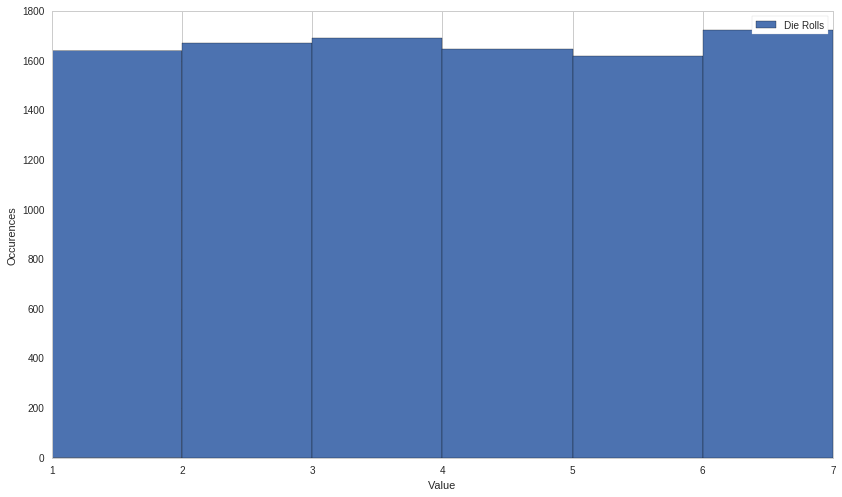
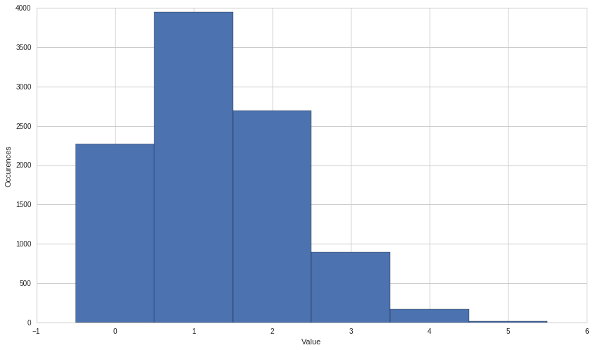
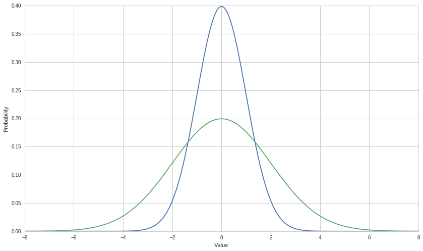
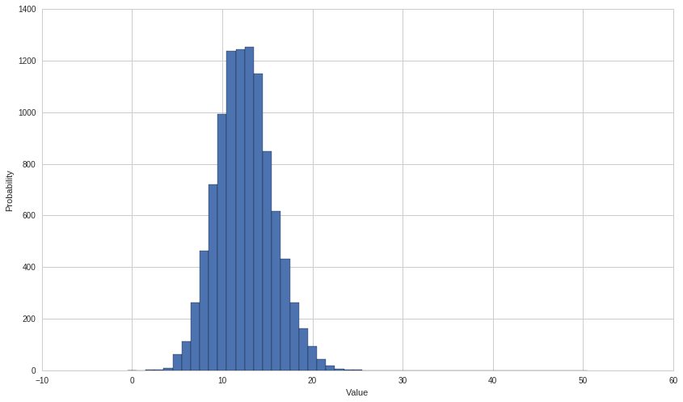
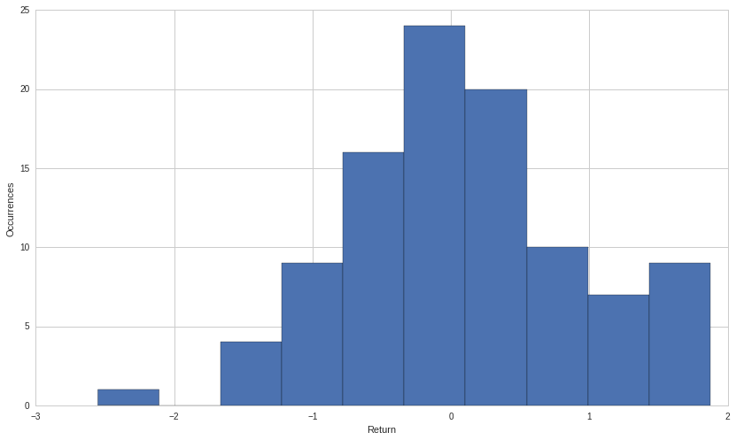
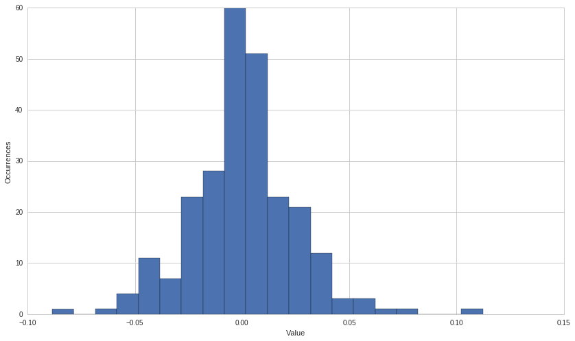

Discrete and Continuous Random Variables
========================================

by Maxwell Margenot

Revisions by Delaney Granizo Mackenzie

Part of the Quantopian Lecture Series: www.quantopian.com/lectures
github.com/quantopian/research_public

A random variable is variable that takes on values according to chance.
When discussing random variables, we typically describe them in terms of
probability distributions. That is, the probability that each value can
come out of the random variable. The classic example of this is a die,
which can produce the values 1-6 with uniform probability.

We typically separate random variables into two different classes:

-  Discrete random variables
-  Continuous random variables

How each of these is handled varies, but the principles underlying them
remain the same. We can easily see how modeling random variables can
come in handy when dealing with finance; financial assets are often
expressed as moving according to deterministic and random patterns, with
the random patterns being expressed with random variables. To do this we
would ‘sample’ from the random variable at each timestep, then move the
financial instrument by that amount. This analysis is used because much
of the motion in assets is unexplained using determinstic models.

Each random variable follows a **probability distribution**, a function
which describes it. The probability distribution assigns probabilities
to all possible values of a random variable. For a given random variable
:math:`X`, we express the probability that :math:`X` is equal to a value
:math:`x` as :math:`P(X = x)`. For discrete random variables, we can
express :math:`p(x) = P(X = x)` in shorthand. This is also known as the
**probability mass function** (PMF). For continuous random variables we
cannot use a PMF, as we will cover later, so we must use a **probability
density function** (PDF). Probability distributions form the basis for
the Black-Scholes and binomial pricing models as well as the CAPM. An
understanding of them is also necessary in order to perform Monte Carlo
simulations.

For each probability distribution function, we also have a **cumulative
distribution function** (CDF). This is defined as :math:`P(X \leq x)`,
the probability that the random variable is less than or equal to a
particular value. The shorthand for the CDF is
:math:`F(x) = P(X \leq x)`. In order to find :math:`F(x)` in the
discrete case, we sum up the values of the PMF for all outcomes less
than or equal to :math:`x`. In the continuous case, we use calculus to
integrate the PDF over all values up to :math:`x`.

.. code:: ipython2

    import pandas as pd
    import numpy as np
    import matplotlib.pyplot as plt
    import statsmodels.stats as stats
    from statsmodels.stats import stattools
    from __future__ import division

Discrete Random Variables
-------------------------

A discrete random variable is one with a countable number of outcomes.
Each of these outcomes has a separate probability associated with it.
Consider a coin flip or a die roll, some of the most basic uniformly
distributed random variables. For the coin flip, there are two possible
outcomes, either heads or tails, each with a :math:`1/2` probability of
occurring. Discrete random variables do not always have equal weights
for all outcomes. The basic unit of a discrete random variable is its
**probability mass function** (PMF), another name for the probability
function :math:`p(x)`. The PMF, or probability function, gives a
probability, a mass, to each point in the domain of the probability
distribution. A probability function has two main properties:

1. :math:`0 \leq p(x) \leq 1` because all probabilities are in the
   interval :math:`[0, 1]`
2. The sum of all probabilities :math:`p(x)` over all values of X is
   equal to :math:`1`. The total weights for all values of the random
   variable must add to :math:`1`.

Here we will consider some examples of the most prevalent discrete
probability distributions.

.. code:: ipython2

    class DiscreteRandomVariable:
        def __init__(self, a=0, b=1):
            self.variableType = ""
            self.low = a
            self.high = b
            return
        def draw(self, numberOfSamples):
            samples = np.random.random_integers(self.low, self.high, numberOfSamples)
            return samples

Uniform Distribution
~~~~~~~~~~~~~~~~~~~~

The most basic type of probability distribution is the uniform
distribution. With a discrete uniform distribution, equal weight is
assigned to all outcomes. Take the example of rolling a die. It has six
faces, numbered :math:`1` through :math:`6`, each equally likely to
occur with a :math:`1/6` chance each. With this, we know the the PMF
must be :math:`p(x) = 1/6` for all values of our uniform random variable
:math:`X`.

.. code:: ipython2

    DieRolls = DiscreteRandomVariable(1, 6)
    plt.hist(DieRolls.draw(10), bins = [1,2,3,4,5,6,7], align = 'mid')
    plt.xlabel('Value')
    plt.ylabel('Occurences')
    plt.legend(['Die Rolls']);

.. parsed-literal::

    /usr/local/lib/python2.7/dist-packages/ipykernel_launcher.py:8: DeprecationWarning: This function is deprecated. Please call randint(1, 6 + 1) instead
      

.. image:: notebook_files/notebook_5_1.png

Each time we roll the die, we have an equal chance of getting each face.
In the short run this looks uneven, but if we take many samples it is
apparent that each face is occurring the same percentage of rolls.

.. code:: ipython2

    plt.hist(DieRolls.draw(10000), bins = [1,2,3,4,5,6,7], align = 'mid')
    plt.xlabel('Value')
    plt.ylabel('Occurences')
    plt.legend(['Die Rolls']);

.. parsed-literal::

    /usr/local/lib/python2.7/dist-packages/ipykernel_launcher.py:8: DeprecationWarning: This function is deprecated. Please call randint(1, 6 + 1) instead
      

So with a die roll, we can easily see illustrated that the
:math:`p(x) = 1/6` for all values of the random variable :math:`X`.
Let’s look at the possibilities for all values of both the probability
function and the cumulative distribution function:

==================== ============================
===============================
Value: :math:`X = x` PMF: :math:`p(x) = P(X = x)` CDF: :math:`F(x) = P(X \leq x)`
==================== ============================
===============================
1                    :math:`1/6`                  :math:`1/6`
2                    :math:`1/6`                  :math:`1/3`
3                    :math:`1/6`                  :math:`1/2`
4                    :math:`1/6`                  :math:`2/3`
5                    :math:`1/6`                  :math:`5/6`
6                    :math:`1/6`                  :math:`1`
==================== ============================
===============================

Using this table we can easily see that the probability function
satisfies the necessary conditions. Each value of the probability
function is in the interval :math:`[0,1]`, satisfying the first
condition. The second condition is satisfied because all values of
:math:`p(x)` sum to :math:`1`, as evidenced in the cumulative
distribution function. The demonstrates two properties of the cumulative
distribution function:

1. The CDF is between :math:`0` and :math:`1` for all :math:`x`. This
   parallels the value of the probability distribution function.
2. The CDF is nondecreasing in :math:`x`. This means that as :math:`x`
   increases, the CDF either increases or remains constant.

When attempting to sample other probability distributions, we can use
compositions of the uniform distribution with certain functions in order
to get the appropriate samples. However, this method can be tremendously
inefficient. As such, we will instead use the built-in NumPy functions
for each distribution to simplify matters.

Binomial Distribution
~~~~~~~~~~~~~~~~~~~~~

A binomial distribution is used to describe successes and failures. This
can be very useful in an investment context as many of our choices tend
to be binary like this. When we take a single success/failure trial, we
call it a Bernoulli trial. With the Bernoulli random variable, we have
two possible outcomes:

.. math::

   p(1) = P(Y = 1) = p \ \ \ \ \ \ \
   p(0) = P(Y = 0) = 1-p

We consider :math:`Y` taking on a value of :math:`1` to be a success, so
the probability of a success occurring in a single trial is :math:`p`.

A binomial distribution takes a set of :math:`n` Bernoulli trials. As
such, we can have somewhere between :math:`0` and :math:`n` successes.
Each trial has the same probability of success, :math:`p`, and all of
the trials are independent of each other. We can describe the entire
binomial random variable using only :math:`n` and :math:`p`, signified
by the notation :math:`X` **~** :math:`B(n, p)`. This states that
:math:`X` is a binomial random variable with parameters :math:`n` and
:math:`p`.

In order to define the probability function of a binomial random
variable, we must be able to choose some number of successes out of the
total number of trials. This idea lends itself easily to the combination
idea in combinatorics. A combination describes all possible ways of
selecting items out of a collection such that order does not matter. For
example, if we have :math:`6` pairs of socks and we want to choose
:math:`2` of them, we would write the total number of combinations
possible as :math:`\binom{6}{2}`. This is expanded as:

.. math::

   \binom{6}{2} = \frac{6!}{4! \ 2!} = 15

Where :math:`!` denotes factorial and
:math:`n! = (n)(n-1)(n-2)\ldots (1)`. In order to write the formula for
a combination more generally, we write:

.. math::

   \binom{n}{x} = \frac{n!}{(n-x)! \ x!}

We use this notation in order to choose successes with our binomial
random variable. The combination serves the purpose of computing how
many different ways we can reach the same result. The resulting
probability function is:

.. math::

   p(x) = P(X = x) = \binom{n}{x}p^x(1-p)^{n-x} = \frac{n!}{(n-x)! \ x!} p^x(1-p)^{n-x}

If :math:`X` is a binomial random variable distributed with
:math:`B(n, p)`.

.. code:: ipython2

    class BinomialRandomVariable(DiscreteRandomVariable):
        def __init__(self, numberOfTrials = 10, probabilityOfSuccess = 0.5):
            self.variableType = "Binomial"
            self.numberOfTrials = numberOfTrials
            self.probabilityOfSuccess = probabilityOfSuccess
            return
        def draw(self, numberOfSamples):
            samples = np.random.binomial(self.numberOfTrials, self.probabilityOfSuccess, numberOfSamples)
            return samples

Take the example of a stock price moving up or down, each with
probability :math:`p = 0.5`. We can consider a move up, or :math:`U`, to
be a success and a move down, or :math:`D` to be a failure. With this,
we can analyze the probability of each event using a binomial random
variable. We will also consider an :math:`n`-value of :math:`5` for
:math:`5` observations of the stock price over time. The following table
shows the probability of each event:

+-------------+-------------+-------------+-------------+-------------+
| Number of   | Ways of     | Independent | :math:`p(x) | CDF:        |
| Up moves,   | reaching    | Trials with | `           | :math:`F(x) |
| :math:`x`   | :math:`x`   | :math:`p =  | Value       |  = P(X \leq |
|             | Up moves    | 0.50`       |             |  x)`        |
|             | :math:`\bin |             |             |             |
|             | om{n}{x}`   |             |             |             |
+=============+=============+=============+=============+=============+
| :math:`0`   | :math:`1`   | :math:`0.50 | :math:`0.03 | :math:`0.03 |
|             |             | ^0 (1 - 0.5 | 125`        | 125`        |
|             |             | 0)^5 = 0.03 |             |             |
|             |             | 125`        |             |             |
+-------------+-------------+-------------+-------------+-------------+
| :math:`1`   | :math:`5`   | :math:`0.50 | :math:`0.15 | :math:`0.18 |
|             |             | ^1 (1 - 0.5 | 635`        | 750`        |
|             |             | 0)^4 = 0.03 |             |             |
|             |             | 125`        |             |             |
+-------------+-------------+-------------+-------------+-------------+
| :math:`2`   | :math:`10`  | :math:`0.50 | :math:`0.31 | :math:`0.50 |
|             |             | ^2 (1 - 0.5 | 250`        | 000`        |
|             |             | 0)^3 = 0.03 |             |             |
|             |             | 125`        |             |             |
+-------------+-------------+-------------+-------------+-------------+
| :math:`3`   | :math:`10`  | :math:`0.50 | :math:`0.31 | :math:`0.81 |
|             |             | ^3 (1 - 0.5 | 250`        | 250`        |
|             |             | 0)^2 = 0.03 |             |             |
|             |             | 125`        |             |             |
+-------------+-------------+-------------+-------------+-------------+
| :math:`4`   | :math:`5`   | :math:`0.50 | :math:`0.15 | :math:`0.96 |
|             |             | ^4 (1 - 0.5 | 635`        | 875`        |
|             |             | 0)^1 = 0.03 |             |             |
|             |             | 125`        |             |             |
+-------------+-------------+-------------+-------------+-------------+
| :math:`5`   | :math:`1`   | :math:`0.50 | :math:`0.03 | :math:`1.00 |
|             |             | ^5 (1 - 0.5 | 125`        | 000`        |
|             |             | 0)^0 = 0.03 |             |             |
|             |             | 125`        |             |             |
+-------------+-------------+-------------+-------------+-------------+

Here we see that in the particular case where :math:`p = 0.50`, the
binomial distribution is symmetric. Because we have an equal probability
for both an upward and a downward move, the only differentiating factor
between probabilities ends up being the combination aspect of the
probability function, which is itself symmetric. If we were to slightly
modify the value of :math:`p` we would end up with an asymmetric
distribution.

Now we will draw some samples for the parameters above, where :math:`X`
**~** :math:`B(5, 0.50)`:

.. code:: ipython2

    StockProbabilities = BinomialRandomVariable(5, 0.50)
    plt.hist(StockProbabilities.draw(50), bins = [0, 1, 2, 3, 4, 5, 6], align = 'left')
    plt.xlabel('Value')
    plt.ylabel('Occurences')
    plt.legend(['Die Rolls']);

.. image:: notebook_files/notebook_12_0.png

Again, as in all cases of sampling, the more samples that you take, the
more consistent your resulting distribution looks:

.. code:: ipython2

    plt.hist(StockProbabilities.draw(10000), bins = [0, 1, 2, 3, 4, 5, 6], align = 'left')
    plt.xlabel('Value')
    plt.ylabel('Occurences');

.. image:: notebook_files/notebook_14_0.png

Say that we changed our parameters so that :math:`p = 0.25`. This makes
it so that :math:`P(X = 0) = 0.23730`, skewing our distribution much
more towards lower values. We can see this easily in the following
graph:

.. code:: ipython2

    StockProbabilities = BinomialRandomVariable(5, 0.25)
    plt.hist(StockProbabilities.draw(10000), bins = [0, 1, 2, 3, 4, 5, 6], align = 'left')
    plt.xlabel('Value')
    plt.ylabel('Occurences');

Changing the value of :math:`p` from :math:`0.50` to :math:`0.25`
clearly makes our distribution asymmetric. We can extend this idea of
stock price moving with a binomial random variable into a framework that
we call the Binomial Model of Stock Price Movement. This is used as one
of the foundations for option pricing. In the Binomial Model, it is
assumed that for any given time period a stock price can move up or down
by a value determined by the up or down probabilities. This turns the
stock price into the function of a binomial random variable, the
magnitude of upward or downward movement, and the initial stock price.
We can vary these parameters in order to approximate different stock
price distributions.

Continuous Random Variables
---------------------------

Continuous random variables differ from discrete random variables in
that continuous ones can take infinitely many outcomes. They cannot be
counted or described as a list. As such, it means very little when we
assign individual probabilities to outcomes. Because there are
infinitely many outcomes, the probability of hitting any individual
outcome has a probability of 0.

We can resolve this issue by instead taking probabilities across ranges
of outcomes. This is managed by using calculus, though in order to use
our sampling techniques here we do not actually have to use any. With a
continuous random variable :math:`P(X = 0)` is meaningless. Instead we
would look for something more like :math:`P(-1 < X < 1)`. For continous
random variables, rather than using a PMF, we define a **probability
density function** (PDF), :math:`f_X(x)`, such that we can say:

.. math:: P(a < X < b) = \int_a^b f_X(x)dx

Similar to our requirement for discrete distributions that all
probabilities add to :math:`1`, here we require that:

1. :math:`f_X(x) \geq 0` for all values of :math:`X`
2. :math:`P(-\infty < X < \infty) = \int_{-\infty}^{\infty} f_X(x) dx = 1`

It is worth noting that because the probability at an individual point
with a continuous distribution is :math:`0`, the probabilities at the
endpoints of a range are :math:`0`. Hence,
:math:`P(a \leq X \leq b) = P(a < X \leq b) = P(a \leq X < B) = P(a < X < b)`.
If we integrate the PDF across all possibilities, over the total
possible range, the value should be :math:`1`.

.. code:: ipython2

    class ContinuousRandomVariable:
        def __init__(self, a = 0, b = 1):
            self.variableType = ""
            self.low = a
            self.high = b
            return
        def draw(self, numberOfSamples):
            samples = np.random.uniform(self.low, self.high, numberOfSamples)
            return samples

Uniform Distribution
~~~~~~~~~~~~~~~~~~~~

The uniform distribution can also be defined within the framework of a
continous random variable. We take :math:`a` and :math:`b` to be
constant, where :math:`b` is the highest possible value and :math:`a` is
the lowest possible value that the outcome can obtain. Then the PDF of a
uniform random variable is:

.. math:: f(x) = \begin{cases}\frac{1}{b - a} & \text{for $a < x < b$} \ 0 & \text{otherwise}\end{cases}

Since this function is defined on a continuous interval, the PDF covers
all values between :math:`a` and :math:`b`. Here we have a plot of the
PDF (feel free to vary the values of :math:`a` and :math:`b`):

.. code:: ipython2

    a = 0.0
    b = 8.0
    x = np.linspace(a, b, 100)
    y = [1/(b-a) for i in x]
    plt.plot(x, y)
    plt.xlabel('Value')
    plt.ylabel('Probability');

.. image:: notebook_files/notebook_21_0.png

As before in the discrete uniform case, the continuous uniform
distribution PDF is constant for all values the variable can take on.
The only difference here is that we cannot take the probability for any
individual point. The CDF, which we get from integrating the PDF is:

.. math::  F(x) = \begin{cases} 0 & \text{for $x \leq a$} \ \frac{x - a}{b - a} & \text{for $a < x < b$} \ 1 & \text{for $x \geq b$}\end{cases}

And is plotted on the same interval as the PDF as:

.. code:: ipython2

    y = [(i - a)/(b - a) for i in x]
    plt.plot(x, y)
    plt.xlabel('Value')
    plt.ylabel('Probability');

.. image:: notebook_files/notebook_23_0.png

Normal Distribution
~~~~~~~~~~~~~~~~~~~

The normal distribution is a very common and important distribution in
statistics. Many important tests and methods in statistics, and by
extension, finance, are based on the assumption of normality. A large
part of this is due to the results of the Central Limit Theorem (CLT),
which states that large enough samples of independent trials are
normally distributed. The convenience of the normal distribution finds
its way into certain algorithmic trading strategies as well. For
example, as covered in the `pairs
trading <https://www.quantopian.com/lectures/introduction-to-pairs-trading>`__
notebook, we can search for stock pairs that are cointegrated, and bet
on the direction the spread between them will change based on a normal
distribution.

.. code:: ipython2

    class NormalRandomVariable(ContinuousRandomVariable):
        def __init__(self, mean = 0, variance = 1):
            ContinuousRandomVariable.__init__(self)
            self.variableType = "Normal"
            self.mean = mean
            self.standardDeviation = np.sqrt(variance)
            return
        def draw(self, numberOfSamples):
            samples = np.random.normal(self.mean, self.standardDeviation, numberOfSamples)
            return samples

When describing a normal random variable we only need to know its mean
(:math:`\mu`) and variance (:math:`\sigma^2`, where :math:`\sigma` is
the standard deviation). We denote a random variable :math:`X` as a
normal random variable by saying :math:`X` **~**
:math:`N(\mu, \sigma^2)`. In modern portfolio theory, stock returns are
generally assumed to follow a normal distribution. One major
characteristic of a normal random variable is that a linear combination
of two or more normal random variables is another normal random
variable. This is useful for considering mean returns and variance of a
portfolio of multiple stocks. Up until this point, we have only
considered single variable, or univariate, probability distributions.
When we want to describe random variables at once, as in the case of
observing multiple stocks, we can instead look at a multivariate
distribution. A multivariate normal distribution is described entirely
by the means of each variable, their variances, and the distinct
correlations between each and every pair of variables. This is important
when determining characteristics of portfolios because the variance of
the overall portfolio depends on both the variances of its securities
and the correlations between them.

The PDF of a normal random variable is:

.. math::

   f(x) = \frac{1}{\sigma\sqrt{2\pi}}e^{-\frac{(x - \mu)^2}{2\sigma^2}}

And is defined for :math:`-\infty < x < \infty`. When we have
:math:`\mu = 0` and :math:`\sigma = 1`, we call this the standard normal
distribution.

.. code:: ipython2

    mu_1 = 0
    mu_2 = 0
    sigma_1 = 1
    sigma_2 = 2
    x = np.linspace(-8, 8, 200)
    y = (1/(sigma_1 * np.sqrt(2 * 3.14159))) * np.exp(-(x - mu_1)*(x - mu_1) / (2 * sigma_1 * sigma_1))
    z = (1/(sigma_2 * np.sqrt(2 * 3.14159))) * np.exp(-(x - mu_2)*(x - mu_2) / (2 * sigma_2 * sigma_2))
    plt.plot(x, y, x, z)
    plt.xlabel('Value')
    plt.ylabel('Probability');

By changing the mean and standard deviation of the normal distribution,
we can change the depth and width of the bell curve. With a larger
standard deviation, the values of the distribution are less concentrated
around the mean.

Rather than using normal distribution to model stock prices, we use it
to model returns. Stock prices cannot go below :math:`0` while the
normal distribution can take on all values on the real line, making it
better suited to returns. Given the mean and variance of a normal
distribution, we can make the following statements:

-  Around :math:`68\%` of all observations fall within one standard
   deviations around the mean (:math:`\mu \pm \sigma`)
-  Around :math:`95\%` of all observations fall within two standard
   deviations around the mean (:math:`\mu \pm 2\sigma`)
-  Around :math:`99\%` of all observations fall within three standard
   deviations aroud the mean (:math:`\mu \pm 3\sigma`)

These values are important for understanding confidence intervals as
they relate to the normal distribution. When considering the mean and
variance of a sample distribution, we like to look at different
confidence intervals around the mean.

Using the central limit theorem, we can standardize different random
variables so that they become normal random variables. A very common
tool in statistics is a standard normal probability table, used for
looking up the values of the standard normal CDF for given values of
:math:`x`. By changing random variables into a standard normal we can
simply check these tables for probability values. We standardize a
random variable :math:`X` by subtracting the mean and dividing by the
variance, resulting in the standard normal random variable :math:`Z`.

.. math::

   Z = \frac{X - \mu}{\sigma}

Let’s look at the case where :math:`X` **~** :math:`B(n, p)` is a
binomial random variable. In the case of a binomial random variable, the
mean is :math:`\mu = np` and the variance is
:math:`\sigma^2 = np(1 - p)`.

.. code:: ipython2

    n = 50
    p = 0.25
    X = BinomialRandomVariable(n, p)
    X_samples = X.draw(10000)
    Z_samples = (X_samples - n * p) / np.sqrt(n * p * (1 - p))
    
    plt.hist(X_samples, bins = range(0, n + 2), align = 'left')
    plt.xlabel('Value')
    plt.ylabel('Probability');

.. code:: ipython2

    plt.hist(Z_samples, bins=20)
    plt.xlabel('Value')
    plt.ylabel('Probability');

.. image:: notebook_files/notebook_30_0.png

The idea that we can standardize random variables is very important. By
changing a random variable to a distribution that we are more familiar
with, the standard normal distribution, we can easily answer any
probability questions that we have about the original variable. This is
dependent, however, on having a large enough sample size.

Let’s assume that stock returns are normally distributed. Say that
:math:`Y` is the price of a stock. We will simulate its returns and plot
it.

.. code:: ipython2

    Y_initial = 100
    X = NormalRandomVariable(0, 1)
    Y_returns = X.draw(100) # generate 100 daily returns
    Y = pd.Series(np.cumsum(Y_returns), name = 'Y') + Y_initial
    Y.plot()
    plt.xlabel('Time')
    plt.ylabel('Value');

.. image:: notebook_files/notebook_32_0.png

Say that we have some other stock, :math:`Z`, and that we have a
portfolio of :math:`Y` and :math:`Z`, called :math:`W`.

.. code:: ipython2

    Z_initial = 50
    Z_returns = X.draw(100)
    Z = pd.Series(np.cumsum(Z_returns), name = 'Z') + Z_initial
    Z.plot()
    plt.xlabel('Time')
    plt.ylabel('Value');

.. image:: notebook_files/notebook_34_0.png

We construct :math:`W` by taking a weighted average of :math:`Y` and
:math:`Z` based on their quantity.

.. code:: ipython2

    Y_quantity = 20
    Z_quantity = 50
    Y_weight = Y_quantity/(Y_quantity + Z_quantity)
    Z_weight = 1 - Y_weight
    
    W_initial = Y_weight * Y_initial + Z_weight * Z_initial
    W_returns = Y_weight * Y_returns + Z_weight * Z_returns
    W = pd.Series(np.cumsum(W_returns), name = 'Portfolio') + W_initial
    W.plot()
    plt.xlabel('Time')
    plt.ylabel('Value');

.. image:: notebook_files/notebook_36_0.png

.. code:: ipython2

    pd.concat([Y, Z, W], axis = 1).plot()
    plt.xlabel('Time')
    plt.ylabel('Value');

.. image:: notebook_files/notebook_37_0.png

Note how the returns of our portfolio, :math:`W`, are also normally
distributed

.. code:: ipython2

    plt.hist(W_returns);
    plt.xlabel('Return')
    plt.ylabel('Occurrences');

The normal distribution is very widely utilized in finance especially in
risk and portfolio theory. Extensive literature can be found utilizing
the normal distribution for purposes ranging from risk analysis to stock
price modeling.

Fitting a Distribution
----------------------

Now we will attempt to fit a probability distribution to the returns of
a stock. We will take the returns of Tesla and try to fit a normal
distribution to them. The first thing to check is whether the returns
actually exhibit properties of a normal distribution. For this purpose,
we will use the Jarque-Bera test, which indicates non-normality if the
p-value is below a cutoff.

.. code:: ipython2

    start = '2015-01-01'
    end = '2016-01-01'
    prices = get_pricing('TSLA', fields=['price'], start_date=start, end_date=end)

.. code:: ipython2

    # Take the daily returns
    returns = prices.pct_change()[1:]
    
    #Set a cutoff
    cutoff = 0.01
    
    # Get the p-value of the JB test
    _, p_value, skewness, kurtosis = stattools.jarque_bera(returns)
    print "The JB test p-value is: ", p_value
    print "We reject the hypothesis that the data are normally distributed ", p_value < cutoff
    print "The skewness of the returns is: ", skewness
    print "The kurtosis of the returns is: ", kurtosis
    plt.hist(returns.price, bins = 20)
    plt.xlabel('Value')
    plt.ylabel('Occurrences');

.. parsed-literal::

    The JB test p-value is:  [  4.42333138e-12]
    We reject the hypothesis that the data are normally distributed  [ True]
    The skewness of the returns is:  [ 0.21123495]
    The kurtosis of the returns is:  [ 5.19572153]

The low p-value of the JB test leads us to *reject* the null hypothesis
that the returns are normally distributed. This is due to the high
kurtosis (normal distributions have a kurtosis of :math:`3`).

We will proceed from here assuming that the returns are normally
distributed so that we can go through the steps of fitting a
distribution. Next we calculate the sample mean and standard deviation
of the series.

.. code:: ipython2

    # Take the sample mean and standard deviation of the returns
    sample_mean = np.mean(returns.price)
    sample_std_dev = np.std(returns.price)

Now let’s see how a theoretical normal curve fits against the actual
values.

.. code:: ipython2

    x = np.linspace(-(sample_mean + 4 * sample_std_dev), (sample_mean + 4 * sample_std_dev), len(returns))
    sample_distribution = ((1/np.sqrt(sample_std_dev * sample_std_dev * 2 * np.pi)) * 
                           np.exp(-(x - sample_mean)*(x - sample_mean) / (2 * sample_std_dev * sample_std_dev)))
    plt.hist(returns.price, bins = 20, normed = True);
    plt.plot(x, sample_distribution)
    plt.xlabel('Value')
    plt.ylabel('Occurrences');

.. image:: notebook_files/notebook_47_0.png

Our theoretical curve for the returns has a substantially lower peak
than the actual values, which makes sense because the returns are not
actually normally distributed. This is again due to the kurtosis of the
normal distribution. The returns have a kurtosis value of around
:math:`5.20`, while the kurtosis of the normal distribution is
:math:`3`. A higher kurtosis leads to a higher peak. A major reason why
it is so difficult to model prices and returns is due to the underlying
probability distributions. A lot of theories and frameworks in finance
require that data be somehow related to the normal distribution. This is
a major reason for why the normal distribution seems to be so prevalent.
For example, the basis of the Black-Scholes pricing model for options
assumes that stock prices are log-normally distributed. However, it is
exceedingly difficult to find real-world data that fits nicely into the
assumptions of normality. When actually implementing a strategy, you
should not assume that data follows a distribution that it demonstrably
does not unless there is a very good reason for it.

Generally, when trying to fit a probability distribution to real-world
values, we should have a particular distribution (or distributions) in
mind. There are a variety of tests for different distributions that we
can apply to see what might be the best fit. In additon, as more
information becomes available, it will become necessary to update the
sample mean and standard deviation or maybe even to find a different
distribution to more accurately reflect the new information. The shape
of the distribution will change accordingly.

*This presentation is for informational purposes only and does not
constitute an offer to sell, a solicitation to buy, or a recommendation
for any security; nor does it constitute an offer to provide investment
advisory or other services by Quantopian, Inc. (“Quantopian”). Nothing
contained herein constitutes investment advice or offers any opinion
with respect to the suitability of any security, and any views expressed
herein should not be taken as advice to buy, sell, or hold any security
or as an endorsement of any security or company. In preparing the
information contained herein, Quantopian, Inc. has not taken into
account the investment needs, objectives, and financial circumstances of
any particular investor. Any views expressed and data illustrated herein
were prepared based upon information, believed to be reliable, available
to Quantopian, Inc. at the time of publication. Quantopian makes no
guarantees as to their accuracy or completeness. All information is
subject to change and may quickly become unreliable for various reasons,
including changes in market conditions or economic circumstances.*
