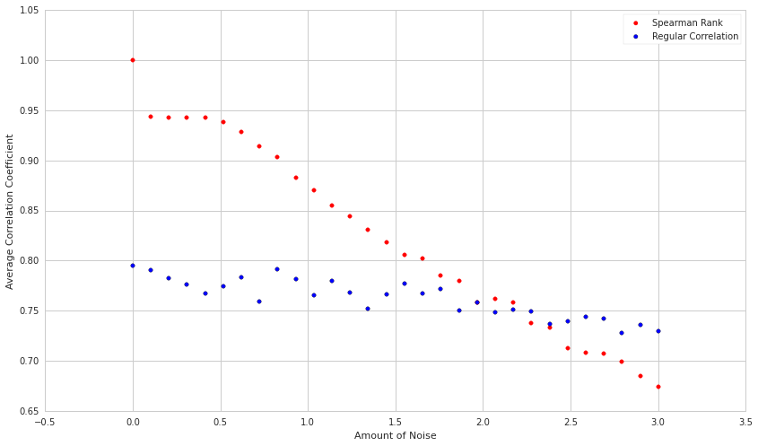
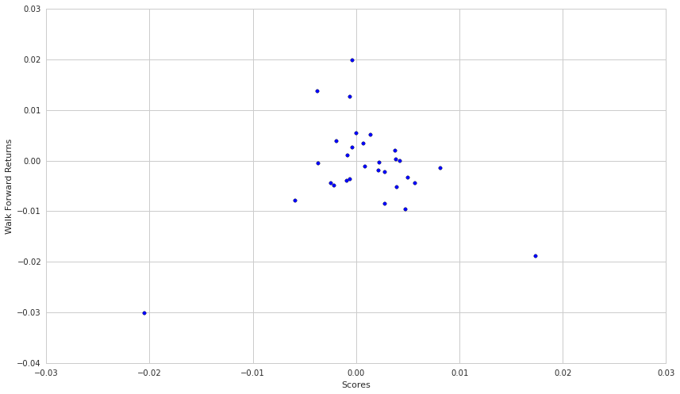

Measuring Monotonic Relationships
=================================

By Evgenia “Jenny” Nitishinskaya and Delaney Granizo-Mackenzie with
example algorithms by David Edwards

Reference: DeFusco, Richard A. “Tests Concerning Correlation: The
Spearman Rank Correlation Coefficient.” Quantitative Investment
Analysis. Hoboken, NJ: Wiley, 2007

Part of the Quantopian Lecture Series:

-  `www.quantopian.com/lectures <https://www.quantopian.com/lectures>`__
-  `github.com/quantopian/research_public <https://github.com/quantopian/research_public>`__

--------------

The Spearman Rank Correlation Coefficient allows us to determine whether
or not two data series move together; that is, when one increases
(decreases) the other also increases (decreases). This is more general
than a linear relationship; for instance, :math:`y = e^x` is a monotonic
function, but not a linear one. Therefore, in computing it we compare
not the raw data but the ranks of the data.

This is useful when your data sets may be in different units, and
therefore not linearly related (for example, the price of a square plot
of land and its side length, since the price is more likely to be linear
in the area). It’s also suitable for data sets which not satisfy the
assumptions that other tests require, such as the observations being
normally distributed as would be necessary for a t-test.

.. code:: ipython2

    import numpy as np
    import scipy.stats as stats
    import matplotlib.pyplot as plt
    import math

.. code:: ipython2

    # Example of ranking data
    l = [10, 9, 5, 7, 5]
    print 'Raw data: ', l
    print 'Ranking: ', list(stats.rankdata(l, method='average'))

.. parsed-literal::

    Raw data:  [10, 9, 5, 7, 5]
    Ranking:  [5.0, 4.0, 1.5, 3.0, 1.5]

Spearman Rank Correlation
-------------------------

Intuition
~~~~~~~~~

The intution is now that instead of looking at the relationship between
the two variables, we look at the relationship between the ranks. This
is robust to outliers and the scale of the data.

Definition
~~~~~~~~~~

The argument ``method='average'`` indicates that when we have a tie, we
average the ranks that the numbers would occupy. For example, the two
5’s above, which would take up ranks 1 and 2, each get assigned a rank
of :math:`1.5`.

To compute the Spearman rank correlation for two data sets :math:`X` and
:math:`Y`, each of size :math:`n`, we use the formula

.. math:: r_S = 1 - \frac{6 \sum_{i=1}^n d_i^2}{n(n^2 - 1)}

where :math:`d_i` is the difference between the ranks of the
:math:`i`\ th pair of observations, :math:`X_i - Y_i`.

The result will always be between :math:`-1` and :math:`1`. A positive
value indicates a positive relationship between the variables, while a
negative value indicates an inverse relationship. A value of 0 implies
the absense of any monotonic relationship. This does not mean that there
is no relationship; for instance, if :math:`Y` is equal to :math:`X`
with a delay of 2, they are related simply and precisely, but their
:math:`r_S` can be close to zero:

##Experiment

Let’s see what happens if we draw :math:`X` from a poisson distribution
(non-normal), and then set :math:`Y = e^X + \epsilon` where
:math:`\epsilon` is drawn from another poisson distribution. We’ll take
the spearman rank and the correlation coefficient on this data and then
run the entire experiment many times. Because :math:`e^X` produces many
values that are far away from the rest, we can this of this as modeling
‘outliers’ in our data. Spearman rank compresses the outliers and does
better at measuring correlation. Normal correlation is confused by the
outliers and on average will measure less of a relationship than is
actually there.

.. code:: ipython2

    ## Let's see an example of this
    n = 100
    
    def compare_correlation_and_spearman_rank(n, noise):
        X = np.random.poisson(size=n)
        Y = np.exp(X) + noise * np.random.normal(size=n)
    
        Xrank = stats.rankdata(X, method='average')
        # n-2 is the second to last element
        Yrank = stats.rankdata(Y, method='average')
    
        diffs = Xrank - Yrank # order doesn't matter since we'll be squaring these values
        r_s = 1 - 6*sum(diffs*diffs)/(n*(n**2 - 1))
        c_c = np.corrcoef(X, Y)[0,1]
        
        return r_s, c_c
    
    experiments = 1000
    spearman_dist = np.ndarray(experiments)
    correlation_dist = np.ndarray(experiments)
    for i in range(experiments):
        r_s, c_c = compare_correlation_and_spearman_rank(n, 1.0)
        spearman_dist[i] = r_s
        correlation_dist[i] = c_c
        
    print 'Spearman Rank Coefficient: ' + str(np.mean(spearman_dist))
    # Compare to the regular correlation coefficient
    print 'Correlation coefficient: ' + str(np.mean(correlation_dist))

.. parsed-literal::

    Spearman Rank Coefficient: 0.877239879988
    Correlation coefficient: 0.773013362941

Let’s take a look at the distribution of measured correlation
coefficients and compare the spearman with the regular metric.

.. code:: ipython2

    plt.hist(spearman_dist, bins=50, alpha=0.5)
    plt.hist(correlation_dist, bins=50, alpha=0.5)
    plt.legend(['Spearman Rank', 'Regular Correlation'])
    plt.xlabel('Correlation Coefficient')
    plt.ylabel('Frequency');

.. image:: notebook_files/notebook_7_0.png

Now let’s see how the Spearman rank and Regular coefficients cope when
we add more noise to the situation.

.. code:: ipython2

    n = 100
    noises = np.linspace(0, 3, 30)
    experiments = 100
    spearman = np.ndarray(len(noises))
    correlation = np.ndarray(len(noises))
    
    for i in range(len(noises)):
        # Run many experiments for each noise setting
        rank_coef = 0.0
        corr_coef = 0.0
        noise = noises[i]
        for j in range(experiments):
            r_s, c_c = compare_correlation_and_spearman_rank(n, noise)
            rank_coef += r_s
            corr_coef += c_c
        spearman[i] = rank_coef/experiments
        correlation[i] = corr_coef/experiments
        
    plt.scatter(noises, spearman, color='r')
    plt.scatter(noises, correlation)
    plt.legend(['Spearman Rank', 'Regular Correlation'])
    plt.xlabel('Amount of Noise')
    plt.ylabel('Average Correlation Coefficient')

.. parsed-literal::

    <matplotlib.text.Text at 0x7fac94f1f690>

We can see that the Spearman rank correlation copes with the non-linear
relationship much better at most levels of noise. Interestingly, at very
high levels, it seems to do worse than regular correlation.

##Delay in correlation

Of you might have the case that one process affects another, but after a
time lag. Now let’s see what happens if we add the delay.

.. code:: ipython2

    n = 100
    
    X = np.random.rand(n)
    Xrank = stats.rankdata(X, method='average')
    # n-2 is the second to last element
    Yrank = stats.rankdata([1,1] + list(X[:(n-2)]), method='average')
    
    diffs = Xrank - Yrank # order doesn't matter since we'll be squaring these values
    r_s = 1 - 6*sum(diffs*diffs)/(n*(n**2 - 1))
    print r_s

.. parsed-literal::

    -0.00584158415842

Sure enough, the relationship is not detected. It is important when
using both regular and spearman correlation to check for lagged
relationships by offsetting your data and testing for different offset
values.

##Built-In Function

We can also use the ``spearmanr`` function in the ``scipy.stats``
library:

.. code:: ipython2

    # Generate two random data sets
    np.random.seed(161)
    X = np.random.rand(10)
    Y = np.random.rand(10)
    
    r_s = stats.spearmanr(X, Y)
    print 'Spearman Rank Coefficient: ', r_s[0]
    print 'p-value: ', r_s[1]

.. parsed-literal::

    Spearman Rank Coefficient:  0.236363636364
    p-value:  0.510885317515

We now have ourselves an :math:`r_S`, but how do we interpret it? It’s
positive, so we know that the variables are not anticorrelated. It’s not
very large, so we know they aren’t perfectly positively correlated, but
it’s hard to say from a glance just how significant the correlation is.
Luckily, ``spearmanr`` also computes the p-value for this coefficient
and sample size for us. We can see that the p-value here is above 0.05;
therefore, we cannot claim that :math:`X` and :math:`Y` are correlated.

##Real World Example: Mutual Fund Expense Ratio

Now that we’ve seen how Spearman rank correlation works, we’ll quickly
go through the process again with some real data. For instance, we may
wonder whether the expense ratio of a mutual fund is indicative of its
three-year Sharpe ratio. That is, does spending more money on
administration, management, etc. lower the risk or increase the returns?
Quantopian does not currently support mutual funds, so we will pull the
data from Yahoo Finance. Our p-value cutoff will be the usual default of
0.05.

Data Source
~~~~~~~~~~~

Thanks to `Matthew Madurski <https://github.com/dursk>`__ for the data.
To obtain the same data:

1. Download the csv from this link.
   https://gist.github.com/dursk/82eee65b7d1056b469ab
2. Upload it to the ‘data’ folder in your research account.

.. code:: ipython2

    mutual_fund_data = local_csv('mutual_fund_data.csv')
    expense = mutual_fund_data['Annual Expense Ratio'].values
    sharpe = mutual_fund_data['Three Year Sharpe Ratio'].values
    
    plt.scatter(expense, sharpe)
    plt.xlabel('Expense Ratio')
    plt.ylabel('Sharpe Ratio')
    
    r_S = stats.spearmanr(expense, sharpe)
    print 'Spearman Rank Coefficient: ', r_S[0]
    print 'p-value: ', r_S[1]

.. parsed-literal::

    Spearman Rank Coefficient:  -0.237573932355
    p-value:  0.0167465097116

.. image:: notebook_files/notebook_17_1.png

Our p-value is below the cutoff, which means we accept the hypothesis
that the two are correlated. The negative coefficient indicates that
there is a negative correlation, and that more expensive mutual funds
have worse sharpe ratios. However, there is some weird clustering in the
data, it seems there are expensive groups with low sharpe ratios, and a
main group whose sharpe ratio is unrelated to the expense. Further
analysis would be required to understand what’s going on here.

Real World Use Case: Evaluating a Ranking Model
-----------------------------------------------

NOTE: `Factor Analysis <https://www.quantopian.com/lectures/factor-analysis>`__ now covers this topic in much greater detail
~~~~~~~~~~~~~~~~~~~~~~~~~~~~~~~~~~~~~~~~~~~~~~~~~~~~~~~~~~~~~~~~~~~~~~~~~~~~~~~~~~~~~~~~~~~~~~~~~~~~~~~~~~~~~~~~~~~~~~~~~~~~

Let’s say that we have some way of ranking securities and that we’d like
to test how well our ranking performs in practice. In this case our
model just takes the mean daily return for the last month and ranks the
stocks by that metric.

We hypothesize that this will be predictive of the mean returns over the
next month. To test this we score the stocks based on a lookback window,
then take the spearman rank correlation of the score and the mean
returns over the walk forward month.

.. code:: ipython2

    symbol_list = ['A', 'AA', 'AAC', 'AAL', 'AAMC', 'AAME', 'AAN', 'AAOI', 'AAON', 'AAP', 'AAPL', 'AAT', 'AAU', 'AAV', 'AAVL', 'AAWW', 'AB', 'ABAC', 'ABAX', 'ABB', 'ABBV', 'ABC', 'ABCB', 'ABCD', 'ABCO', 'ABCW', 'ABDC', 'ABEV', 'ABG', 'ABGB']
    
    # Get the returns over the lookback window
    start = '2014-12-01'
    end = '2015-01-01'
    historical_returns = get_pricing(symbol_list, fields='price', start_date=start, end_date=end).pct_change()[1:]
    
    # Compute our stock score
    scores = np.mean(historical_returns)
    print 'Our Scores\n'
    print scores
    print '\n'
    
    start = '2015-01-01'
    end = '2015-02-01'
    walk_forward_returns = get_pricing(symbol_list, fields='price', start_date=start, end_date=end).pct_change()[1:]
    walk_forward_returns = np.mean(walk_forward_returns)
    print 'The Walk Forward Returns\n'
    print walk_forward_returns
    print '\n'
    
    plt.scatter(scores, walk_forward_returns)
    plt.xlabel('Scores')
    plt.ylabel('Walk Forward Returns')
    
    r_s = stats.spearmanr(scores, walk_forward_returns)
    print 'Correlation Coefficient: ' + str(r_s[0])
    print 'p-value: ' + str(r_s[1])

.. parsed-literal::

    Our Scores
    
    Equity(24757 [A])      -0.000624
    Equity(2 [AA])         -0.003646
    Equity(47842 [AAC])     0.002745
    Equity(45971 [AAL])     0.005677
    Equity(45415 [AAMC])   -0.020459
    Equity(21 [AAME])       0.002207
    Equity(523 [AAN])       0.003765
    Equity(45503 [AAOI])    0.004758
    Equity(9681 [AAON])     0.004228
    Equity(23175 [AAP])     0.003887
    Equity(24 [AAPL])      -0.001870
    Equity(40707 [AAT])     0.001433
    Equity(27922 [AAU])    -0.000576
    Equity(27884 [AAV])     0.003966
    Equity(47422 [AAVL])    0.017364
    Equity(28378 [AAWW])    0.004993
    Equity(66 [AB])        -0.000934
    Equity(39927 [ABAC])   -0.005923
    Equity(31 [ABAX])       0.000679
    Equity(22574 [ABB])    -0.002108
    Equity(43694 [ABBV])   -0.002467
    Equity(22954 [ABC])    -0.000335
    Equity(11232 [ABCB])    0.002142
    Equity(39052 [ABCD])   -0.000333
    Equity(23176 [ABCO])    0.008131
    Equity(47935 [ABCW])    0.002776
    Equity(46877 [ABDC])   -0.000825
    Equity(45840 [ABEV])    0.000035
    Equity(24761 [ABG])     0.000830
    Equity(45676 [ABGB])   -0.003712
    dtype: float64
    
    
    The Walk Forward Returns
    
    Equity(24757 [A])      -0.003616
    Equity(2 [AA])         -0.000464
    Equity(47842 [AAC])    -0.008585
    Equity(45971 [AAL])    -0.004467
    Equity(45415 [AAMC])   -0.030225
    Equity(21 [AAME])      -0.000321
    Equity(523 [AAN])       0.001977
    Equity(45503 [AAOI])   -0.009537
    Equity(9681 [AAON])    -0.000094
    Equity(23175 [AAP])     0.000246
    Equity(24 [AAPL])       0.003940
    Equity(40707 [AAT])     0.005084
    Equity(27922 [AAU])     0.012719
    Equity(27884 [AAV])    -0.005286
    Equity(47422 [AAVL])   -0.018883
    Equity(28378 [AAWW])   -0.003406
    Equity(66 [AB])        -0.003890
    Equity(39927 [ABAC])   -0.007934
    Equity(31 [ABAX])       0.003403
    Equity(22574 [ABB])    -0.004947
    Equity(43694 [ABBV])   -0.004363
    Equity(22954 [ABC])     0.002655
    Equity(11232 [ABCB])   -0.001951
    Equity(39052 [ABCD])    0.019828
    Equity(23176 [ABCO])   -0.001423
    Equity(47935 [ABCW])   -0.002212
    Equity(46877 [ABDC])    0.001030
    Equity(45840 [ABEV])    0.005386
    Equity(24761 [ABG])    -0.001088
    Equity(45676 [ABGB])    0.013701
    dtype: float64
    
    
    Correlation Coefficient: -0.159955506118
    p-value: 0.398478813425

The p-value indicates that our hypothesis is false and we accept the
null hypothesis that our ranking was no better than random. This is a
really good check of any ranking system one devises for constructing a
long-short equity portfolio.

*This presentation is for informational purposes only and does not
constitute an offer to sell, a solicitation to buy, or a recommendation
for any security; nor does it constitute an offer to provide investment
advisory or other services by Quantopian, Inc. (“Quantopian”). Nothing
contained herein constitutes investment advice or offers any opinion
with respect to the suitability of any security, and any views expressed
herein should not be taken as advice to buy, sell, or hold any security
or as an endorsement of any security or company. In preparing the
information contained herein, Quantopian, Inc. has not taken into
account the investment needs, objectives, and financial circumstances of
any particular investor. Any views expressed and data illustrated herein
were prepared based upon information, believed to be reliable, available
to Quantopian, Inc. at the time of publication. Quantopian makes no
guarantees as to their accuracy or completeness. All information is
subject to change and may quickly become unreliable for various reasons,
including changes in market conditions or economic circumstances.*
