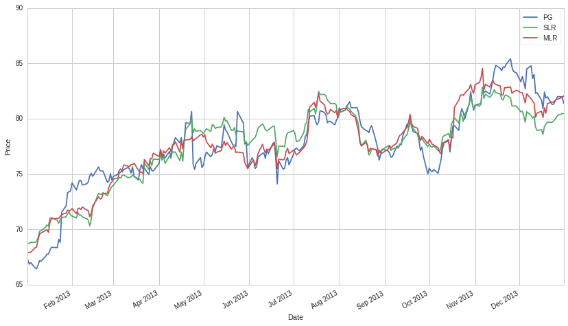

#Overfitting

By Evgenia “Jenny” Nitishinskaya and Delaney Granizo-Mackenzie.
Algorithms by David Edwards.

Part of the Quantopian Lecture Series:

-  `www.quantopian.com/lectures <https://www.quantopian.com/lectures>`__
-  `github.com/quantopian/research_public <https://github.com/quantopian/research_public>`__

--------------

What is overfitting?
====================

When constructing a model, we tune both the parameters and the model by
fitting to sample data. We then use the model and parameters to predict
data we have not yet observed. We say a model is overfit when it is
overly sensitive to noise and idiosyncracies in the sample data, and
therefore does not reflect the underlying data-generating process.

To understand why this happens, one has to consider the amount of noise
present in any dataset. One can consider a set of data as :math:`D_{T}`,
the true underlying data that came from whatever process we are trying
to model, and :math:`\epsilon`, some random noise. Because what we see
is :math:`D = D_{T} + \epsilon`, we might fit our model to very
perfectly predict for the given :math:`\epsilon`, but not for
:math:`D_{T}`.

This is problematic because we only care about fitting to the sample
insofar as that gives an accurate fit to future data. The two broad
causes of overfitting are: \* small sample size, so that noise and trend
are not distinguishable \* choosing an overly complex model, so that it
ends up contorting to fit the noise in the sample

##Verbal Example: Too Many Rules (Complexity)

Let’s say you have the following dataset:

========== ======================= =========
TV Channel Room Lighting Intensity Enjoyment
========== ======================= =========
1          2                       1
2          3                       2
3          1                       3
========== ======================= =========

You are trying to predict enjoyment, so you create the following rules:

1. If TV Channel is 1 and Lighting Intensity is 2, then Enjoyment will
   be 1.
2. If TV Channel is 2 and Lighting Intensity is 3, then Enjoyment will
   be 2.
3. If TV Channel is 3 and Lighting Intensity is 1, then Enjoyment will
   be 3.
4. In all other cases predict an average enjoyment of 2.

This is a well defined model for future data, however, in this case
let’s say your enjoyment is purely dependent on the tv channel and not
on the lighting. Because we have a rule for each row in our dataset, our
model is perfectly predictive in our historical data, but would
performly poorly in real trials because we are overfitting to random
noise in the lighting intensity data.

Generalizing this to stocks, if your model starts developing many
specific rules based on specific past events, it is almost definitely
overfitting. This is why black-box machine learning (neural networks,
etc.) is so dangerous when not done correctly.

Example: Curve fitting
======================

Overfitting is most easily seen when we look at polynomial regression.
Below we construct a dataset which noisily follows a quadratic. The
linear model is underfit: simple linear models aren’t suitable for all
situations, especially when we have reason to believe that the data is
nonlinear. The quadratic curve has some error but fits the data well.

When we fit a ninth-degree polynomial to the data, the error is zero - a
ninth-degree polynomial can be constructed to go through any 10 points -
but, looking at the tails of the curve, we know that we can’t expect it
to accurately predict other samples from the same distribution. It fits
the data perfectly, but that is because it also fits the noise
perfectly, and the noise is not what we want to model. In this case we
have selected a model that is too complex.

.. code:: ipython2

    import numpy as np
    import matplotlib.pyplot as plt
    import pandas as pd
    import statsmodels.api as sm
    from statsmodels import regression
    from scipy import poly1d

.. code:: ipython2

    x = np.arange(10)
    y = 2*np.random.randn(10) + x**2
    xs = np.linspace(-0.25, 9.25, 200)
    
    lin = np.polyfit(x, y, 1)
    quad = np.polyfit(x, y, 2)
    many = np.polyfit(x, y, 9)
    
    plt.scatter(x, y)
    plt.plot(xs, poly1d(lin)(xs))
    plt.plot(xs, poly1d(quad)(xs))
    plt.plot(xs, poly1d(many)(xs))
    plt.ylabel('Y')
    plt.xlabel('X')
    plt.legend(['Underfit', 'Good fit', 'Overfit']);

.. image:: notebook_files/notebook_5_0.png

When working with real data, there is unlikely to ever be a situation
where a ninth-degree polynomial is appropriate: our choice of function
should reflect a belief about the underlying process, and real-world
processes generally do not follow high-degree polynomial curves. This
example is contrived, but it can be tempting to use a quadratic or cubic
model just to decrease sample error.

##Note: Model/Parameter Parsimony

Just as the most elegant physics models describe a tremendous amount of
our world through a few equations, a good trading model should explain
most of the data through a few rules. Any time you start to have a
number of rules even close to the number of points in your data set, you
can be sure you are overfitting. Since parameters can be thought of as
rules as they equivalently constrain a model, the same is true of
parameters. Fewer parameters is better, and it is better to explain 60%
of the data with 2-3 parameters than 90% with 10.

##Beware of the perfect fit

Because there is almost always noise present in real data, a perfect fit
is almost always indicative of overfitting. It is almost impossible to
know the percentage noise/signal in a given data set while you are
developing the model, but use your common sense. Are the predictions
surprisingly good? Then you’re probably overfitting.

Example: Regression parameters
==============================

How do we know which variables to include in a model? If we’re afraid of
omitting something important, we might try different ones and include
all the variables we can find that improve the fit. Below we regress one
asset that is in the same sector as the asset whose price we’re trying
to predict, and three other unrelated ones. In our initial timeframe, we
are able to fit the model more closely to the data when using multiple
variables than when using just one.

.. code:: ipython2

    # Load one year's worth of pricing data for five different assets
    start = '2013-01-01'
    end = '2014-01-01'
    x1 = get_pricing('PEP', fields='price', start_date=start, end_date=end)
    x2 = get_pricing('MCD', fields='price', start_date=start, end_date=end)
    x3 = get_pricing('ATHN', fields='price', start_date=start, end_date=end)
    x4 = get_pricing('DOW', fields='price', start_date=start, end_date=end)
    y = get_pricing('PG', fields='price', start_date=start, end_date=end)
    
    # Build a linear model using only x1 to explain y
    slr = regression.linear_model.OLS(y, sm.add_constant(x1)).fit()
    slr_prediction = slr.params[0] + slr.params[1]*x1
    
    # Run multiple linear regression using x1, x2, x3, x4 to explain y
    mlr = regression.linear_model.OLS(y, sm.add_constant(np.column_stack((x1,x2,x3,x4)))).fit()
    mlr_prediction = mlr.params[0] + mlr.params[1]*x1 + mlr.params[2]*x2 + mlr.params[3]*x3 + mlr.params[4]*x4
    
    # Compute adjusted R-squared for the two different models
    print 'SLR R-squared:', slr.rsquared_adj
    print 'SLR p-value:', slr.f_pvalue
    print 'MLR R-squared:', mlr.rsquared_adj
    print 'MLR p-value:', mlr.f_pvalue
    
    # Plot y along with the two different predictions
    y.plot()
    slr_prediction.plot()
    mlr_prediction.plot()
    plt.ylabel('Price')
    plt.xlabel('Date')
    plt.legend(['PG', 'SLR', 'MLR']);

.. parsed-literal::

    SLR R-squared: 0.776035553687
    SLR p-value: 2.05363375357e-83
    MLR R-squared: 0.858854648079
    MLR p-value: 1.42226038e-104

However, when we use the same estimated parameters to model a different
time period, we find that the single-variable model fits worse, while
the multiple-variable model is entirely useless. It seems that the
relationships we found are not consistent and are particular to the
original sample period.

.. code:: ipython2

    # Load the next of pricing data
    start = '2014-01-01'
    end = '2015-01-01'
    x1 = get_pricing('PEP', fields='price', start_date=start, end_date=end)
    x2 = get_pricing('MCD', fields='price', start_date=start, end_date=end)
    x3 = get_pricing('ATHN', fields='price', start_date=start, end_date=end)
    x4 = get_pricing('DOW', fields='price', start_date=start, end_date=end)
    y = get_pricing('PG', fields='price', start_date=start, end_date=end)
    
    # Extend our model from before to the new time period
    slr_prediction2 = slr.params[0] + slr.params[1]*x1
    mlr_prediction2 = mlr.params[0] + mlr.params[1]*x1 + mlr.params[2]*x2 + mlr.params[3]*x3 + mlr.params[4]*x4
    
    # Manually compute adjusted R-squared over the new time period
    
    # Adjustment 1 is for the SLR model
    p = 1
    N = len(y)
    adj1 = float(N - 1)/(N - p - 1)
    
    # Now for MLR
    p = 4
    N = len(y)
    adj2 = float(N - 1)/(N - p - 1)
    
    SST = sum((y - np.mean(y))**2)
    SSRs = sum((slr_prediction2 - y)**2)
    print 'SLR R-squared:', 1 - adj1*SSRs/SST
    SSRm = sum((mlr_prediction2 - y)**2)
    print 'MLR R-squared:', 1 - adj2*SSRm/SST
    
    # Plot y along with the two different predictions
    y.plot()
    slr_prediction2.plot()
    mlr_prediction2.plot()
    plt.ylabel('Price')
    plt.xlabel('Date')
    plt.legend(['PG', 'SLR', 'MLR']);

.. parsed-literal::

    SLR R-squared: 0.445606562575
    MLR R-squared: 0.144017628069

.. image:: notebook_files/notebook_12_1.png

If we wanted, we could scan our universe for variables that were
correlated with the dependent variable, and construct an extremely
overfitted model. However, in most cases the correlation will be
spurious, and the relationship will not continue into the future.

Example: Rolling windows
========================

One of the challenges in building a model that uses rolling parameter
estimates, such as rolling mean or rolling beta, is choosing a window
length. A longer window will take into account long-term trends and be
less volatile, but it will also lag more when taking into account new
observations. The choice of window length strongly affects the rolling
parameter estimate and can change how we see and treat the data. Below
we calculate the rolling averages of a stock price for different window
lengths:

.. code:: ipython2

    # Load the pricing data for a stock
    start = '2011-01-01'
    end = '2013-01-01'
    pricing = get_pricing('MCD', fields='price', start_date=start, end_date=end)
    
    # Compute rolling averages for various window lengths
    mu_30d = pricing.rolling(window=30).mean()
    mu_60d = pricing.rolling(window=60).mean()
    mu_100d = pricing.rolling(window=100).mean()
    
    # Plot asset pricing data with rolling means from the 100th day, when all the means become available
    plt.plot(pricing[100:], label='Asset')
    plt.plot(mu_30d[100:], label='30d MA')
    plt.plot(mu_60d[100:], label='60d MA')
    plt.plot(mu_100d[100:], label='100d MA')
    plt.xlabel('Day')
    plt.ylabel('Price')
    plt.legend();

.. image:: notebook_files/notebook_15_0.png

If we pick the length based on which seems best - say, on how well our
model or algorithm performs - we are overfitting. Below we have a simple
trading algorithm which bets on the stock price reverting to the rolling
mean (for more details, check out the mean reversion notebook). We use
the performance of this algorithm to score window lengths and find the
best one. However, when we consider a different timeframe, this window
length is far from optimal. This is because our original choice was
overfitted to the sample data.

.. code:: ipython2

    # Trade using a simple mean-reversion strategy
    def trade(stock, length):
        
        # If window length is 0, algorithm doesn't make sense, so exit
        if length == 0:
            return 0
        
        # Compute rolling mean and rolling standard deviation
        rolling_window = stock.rolling(window=length)
        mu = rolling_window.mean()
        std = rolling_window.std()
        
        # Compute the z-scores for each day using the historical data up to that day
        zscores = (stock - mu)/std
        
        # Simulate trading
        # Start with no money and no positions
        money = 0
        count = 0
        for i in range(len(stock)):
            # Sell short if the z-score is > 1
            if zscores[i] > 1:
                money += stock[i]
                count -= 1
            # Buy long if the z-score is < 1
            elif zscores[i] < -1:
                money -= stock[i]
                count += 1
            # Clear positions if the z-score between -.5 and .5
            elif abs(zscores[i]) < 0.5:
                money += count*stock[i]
                count = 0
        return money

.. code:: ipython2

    # Find the window length 0-254 that gives the highest returns using this strategy
    length_scores = [trade(pricing, l) for l in range(255)]
    best_length = np.argmax(length_scores)
    print 'Best window length:', best_length

.. parsed-literal::

    Best window length: 11

.. code:: ipython2

    # Get pricing data for a different timeframe
    start2 = '2013-01-01'
    end2 = '2015-01-01'
    pricing2 = get_pricing('MCD', fields='price', start_date=start2, end_date=end2)
    
    # Find the returns during this period using what we think is the best window length
    length_scores2 = [trade(pricing2, l) for l in range(255)]
    print best_length, 'day window:', length_scores2[best_length]
    
    # Find the best window length based on this dataset, and the returns using this window length
    best_length2 = np.argmax(length_scores2)
    print best_length2, 'day window:', length_scores2[best_length2]

.. parsed-literal::

    11 day window: 31.177
    142 day window: 362.058

Clearly fitting to our sample data doesn’t always give good results in
the future. Just for fun, let’s plot the length scores computed from the
two different timeframes:

.. code:: ipython2

    plt.plot(length_scores)
    plt.plot(length_scores2)
    plt.xlabel('Window length')
    plt.ylabel('Score')
    plt.legend(['2011-2013', '2013-2015']);

.. image:: notebook_files/notebook_21_0.png

To avoid overfitting, we can use economic reasoning or the nature of our
algorithm to pick our window length. We can also use Kalman filters,
which do not require us to specify a length; this method is covered in
another notebook.

#Avoiding overfitting

We can try to avoid overfitting by taking large samples, choosing
reasonable and simple models, and not cherry-picking parameters to fit
the data; but just running two backtests is already overfitting.

##Out of Sample Testing

To make sure we haven’t broken our model with overfitting, we have to
out of sample. That is, we need to gather data that we did not use in
constructing the model, and test whether our model continues to work. If
we cannot gather large amounts of additional data at will, we should
split the sample we have into two parts, of which one is reserved for
testing only.

###Common Mistake: Abusing Out of Sample Data

Sometimes people will construct a model on in-sample data, test on
out-of-sample data, and conclude it doesn’t work. They will then repeat
this process until they find a model that works. This is still
overfitting, as you have no overfit the model to the out-of-sample data
by using it many times, and when you actually test on true out-of-sample
data your model will likely break down.

###Cross Validation

Cross validation is the process of splitting your data into n parts,
then estimating optimal parameters for n-1 parts combined and testing on
the final part. By doing this n times, one for each part held out, we
can establish how stable our parameter estimates are and how predictive
they are on data not from the original set.

##Information Criterion

Information criterion are a rigorous statistical way to test if the
amount of complexity in your model is worth the extra predictive power.
The test favors simpler models and will tell you if you are introducing
a large amount of complexity without much return. One of the most common
methods is `Akaike Information
Criterion. <https://en.wikipedia.org/wiki/Akaike_information_criterion>`__

*This presentation is for informational purposes only and does not
constitute an offer to sell, a solicitation to buy, or a recommendation
for any security; nor does it constitute an offer to provide investment
advisory or other services by Quantopian, Inc. (“Quantopian”). Nothing
contained herein constitutes investment advice or offers any opinion
with respect to the suitability of any security, and any views expressed
herein should not be taken as advice to buy, sell, or hold any security
or as an endorsement of any security or company. In preparing the
information contained herein, Quantopian, Inc. has not taken into
account the investment needs, objectives, and financial circumstances of
any particular investor. Any views expressed and data illustrated herein
were prepared based upon information, believed to be reliable, available
to Quantopian, Inc. at the time of publication. Quantopian makes no
guarantees as to their accuracy or completeness. All information is
subject to change and may quickly become unreliable for various reasons,
including changes in market conditions or economic circumstances.*
