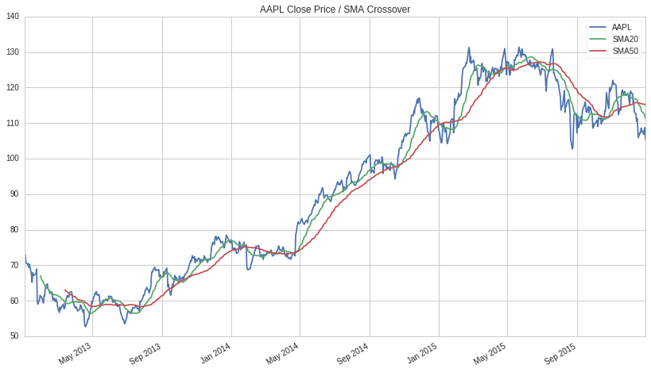

.. important::

    2020/06/07 更新。
    本翻訳は、２０２０年５月以前に公開されていた **旧Tutorial１ Getting Started** です。翻訳作業中に原作が大きく更新され、この翻訳は原作側には存在しません。しかしながら、記載されている内容やスクリプトは現在も使用可能ですので、日本語翻訳サイトには引き続き掲載します。

Quantopianへようこそ。この入門チュートリアルでは、Quantopianでのクオンツトレーディング戦略の研究と開発について説明します。
このチュートリアルでは、Quantopian APIの基本的な機能を多く取り上げており、Quantopianを初めて利用する方を対象にしています。
チュートリアルを始めるために必要なのは、基本的な `Python <https://docs.python.org/2.7/>`__ のプログラミングスキルだけです。

取引アルゴリズムとは？
-------------------------

取引アルゴリズムとは、コンピューターでクオンツトレーディング戦略を実現し、取引対象の資産を売買するためのルールを実装したプログラムのことです。
一般に、取引アルゴリズムは、過去のデータについて数学的、統計的に分析して構築したモデルに基づいて作成され、取引の意思決定を行います。

何から始めればいいですか？
--------------------------

取引アルゴリズムを作成するためには、まず、戦略のベースとなる経済的または統計的な関係を見つけなくてはなりません。QuantopianのResearch環境では、そのために必要な過去のデータセットが提供されており、それを利用して分析を行うことができます。

Research は `Jupyter Notebook <http://jupyter-notebook-beginner-guide.readthedocs.io/en/latest/what_is_jupyter.html>`__ 環境で提供されており、Pythonのコードを 'セル' と呼ばれる場所で実行することができます。

例えば、以下のコードは、Apple Inc. (AAPL)の毎日の終値と20日と50日移動平均線をプロットしています。

.. code:: ipython2

    # Research 環境用関数
    from quantopian.research import prices, symbols
    
    # Pandas library: https://pandas.pydata.org/
    import pandas as pd
    
    # AAPL の過去の価格データを取得する
    aapl_close = prices(
        assets=symbols('AAPL'),
        start='2013-01-01',
        end='2016-01-01',
    )
    
    # AAPL の価格データより20日と50日の移動平均を算出する
    aapl_sma20 = aapl_close.rolling(20).mean()
    aapl_sma50 = aapl_close.rolling(50).mean()
    
    # 結果を結合して pandas の DataFrameに入れ、描画する
    pd.DataFrame({   
        'AAPL': aapl_close,
        'SMA20': aapl_sma20,
        'SMA50': aapl_sma50
    }).plot(
        title='AAPL Close Price / SMA Crossover'
    );

.. 上記のコードは、Research環境で新しいノートブックを開いて、セルにコピーアンドペーストするか、このレッスンの画面の右上にある「Get Notebook」ボタンをクリックすることで利用できます。そして、このコードのあるセルを選択してShift+Enterキーを押せばセルを実行でき、次のような出力がなされます。

上記のコードは、Research環境で新しいノートブックを開いて、セルにコピーアンドペーストすることで利用できます。そして、このコードのあるセルを選択してShift+Enterキーを押せばセルを実行でき、次のような出力がなされます。

.. Get Notebookボタンは、`Quantopianウェブサイト <https://www.quantopian.com/tutorials/getting-started#lesson1>`__ にあります。

では早速、Research環境を使ってQuantopianのデータセットを触ってみましょう。次のレッスンでは、取引戦略を定義し、過去のデータに基づいてリターンを効果的に予測できるかどうかを検証してみます。さらに、その結果をもとに、インタラクティブ開発環境（IDE）で取引アルゴリズムを開発し、テストを行ってみましょう。
