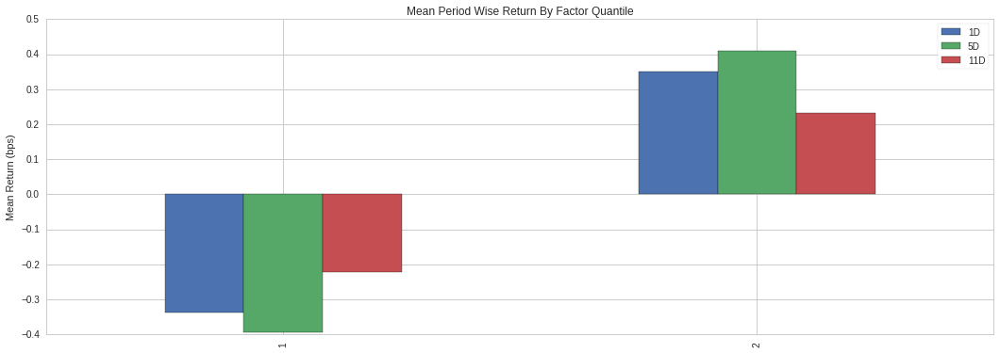

戦略定義
---------

Quantopianのデータへのアクセスと操作の方法を学んだところで、株式のロングショート戦略を行うデータ取得の仕組みをpipelineで構築してみましょう。
株式のロングショート戦略とは、一般に、対象銘柄の価格の動き方を比較し、今後最も上昇すると思われる銘柄（`ロング <https://www.investopedia.com/terms/l/long.asp>`__ ) と、下落すると思われる銘柄（`ショート <https://www.investopedia.com/terms/s/short.asp>`__ ）を組み合わせて利益を狙う戦略のことを言います。

株式のロングショート戦略では、値上がりした銘柄の価格変化と値下がりした銘柄の価格変化の差（スプレッド）が利益になります。つまり、この戦略は、株式の将来的な値動きの大きさについて、うまく順位付けができるということを前提にしています。このチュートリアルでは、簡単な順位付け方法を使ってみます。

**今回の戦略**: センチメントスコアの3日移動平均を取得し、銘柄別のセンチメントの状態の高さ、あるいは低さが、今後の値動きの高低に影響するものとして売買の判断をします。

戦略分析
-----------------

上記の戦略は、 ``SimpleMovingAverage`` 関数と、　``stocktwits``\ の ``bull_minus_bear`` データを使って定義出来ます。
先述したpipelineのレッスンと同じように書くことができます。

.. code:: ipython2

    # Pipeline インポート
    from quantopian.pipeline import Pipeline
    from quantopian.pipeline.data.psychsignal import stocktwits
    from quantopian.pipeline.factors import SimpleMovingAverage
    from quantopian.pipeline.filters import QTradableStocksUS
    
    
    # Pipeline 定義
    def  make_pipeline():
    
        base_universe = QTradableStocksUS()
    
        sentiment_score = SimpleMovingAverage(
            inputs=[stocktwits.bull_minus_bear],
            window_length=3,
        )
    
        return Pipeline(
            columns={
                'sentiment_score': sentiment_score,
            },
            screen=base_universe
        )

まずここでは、説明を簡単にするために、 ``sentiment_score`` を使って順位した各銘柄のなかで、上位および下位のそれぞれ350銘柄だけについて分析します。
具体的には、pipelineフィルターというものを利用し、 ``sentiment_score`` の出力を、 ``top`` と ``bottom`` メソッドを使って上位と下位だけ取得するフィルターを作ります。そして、その結果を ``|`` オペレータ でつないで和集合を作れば、上位と下位の銘柄を集めたものをまとめられます。次に、そのなかから、私達のトレーディングユニバースにない銘柄を除くために、フィルターとユニバースを ``&`` オペレータでつなぎます。

.. code:: ipython2

    # Pipeline インポート
    from quantopian.pipeline import Pipeline
    from quantopian.pipeline.data.psychsignal import stocktwits
    from quantopian.pipeline.factors import SimpleMovingAverage
    from quantopian.pipeline.filters import QTradableStocksUS
    
    # Pipeline 定義
    def  make_pipeline():
    
        base_universe = QTradableStocksUS()
    
        sentiment_score = SimpleMovingAverage(
            inputs=[stocktwits.bull_minus_bear],
            window_length=3,
        )
    
        # センチメントスコアに基づいて上位下位350銘柄のみを取得するフィルターを作成
        top_bottom_scores = (
            sentiment_score.top(350) | sentiment_score.bottom(350)
        )
    
        return Pipeline(
            columns={
                'sentiment_score': sentiment_score,
            },
            # 定義したフィルターとトレーディングユニバースのどちらにも入っている銘柄のみにスクリーニングする
            screen=(
                base_universe
                & top_bottom_scores
            )
        )

それでは、3年間のpipelineを実行して、このあとの分析で使う情報を取り出してみましょう。これには1分ほどかかります。

.. code:: ipython2

    # run_pipeline インポート
    from quantopian.research import run_pipeline
    
    # 評価する期間を指定
    period_start = '2013-01-01'
    period_end = '2016-01-01'
    
    # 指定期間で pipeline 実行
    pipeline_output = run_pipeline(
        make_pipeline(),
        start_date=period_start,
        end_date=period_end
    )

この先の分析には、各銘柄のセンチメントデータに加えて、同じ期間の価格のデータも必要です。pipelineが出力するDataFrameのindexは銘柄のリストになっていますので、そのリストを ``prices`` に渡せば価格データを得ることが出来ます。

.. code:: ipython2

    # prices 関数をインポート
    from quantopian.research import prices
    
    # pipeline が出力した dataframe の index から銘柄リストを取得し、 unique 関数を使って、重複しないリストを取得します。
    asset_list = pipeline_output.index.levels[1].unique()
    
    # 銘柄リストに入っている銘柄全てに対して、指定期間の価格を取得します。
    asset_prices = prices(
        asset_list,
        start=period_start,
        end=period_end
    )

次に、Quantopianが作ったオープンソースの分析ツールである、 `Alphalens <https://www.quantopian.com/lectures/factor-analysis-with-alphalens>`__ を使って、私達の戦略の品質を検証してみましょう。
まず、 ``get_clean_factor_and_forward_returns`` 関数を使って、ファクターデータと価格データを組み合わせます。この関数は、ファクターデータを順位付けて分類し、数日間にわたり銘柄を保有したら、収益がいくらになるかを（複数の評価基準日に対して）計算します。ここでは、ファクターデータを上位と下位の半分ずつにわけ、評価基準日から1日、5日、10日後の収益結果をみます。

.. code:: ipython2

    # Alphalens インポート
    import alphalens as al
    
    # センチメントスコアに基づいて、quantileに指定された分位数にわける
    factor_data = al.utils.get_clean_factor_and_forward_returns(
        factor=pipeline_output['sentiment_score'],
        prices=asset_prices,
        quantiles=2,
        periods=(1,5,10),
    )
    
    # 上から5行を表示
    factor_data.head(5)

.. raw:: html

    

    <table border="1" class="dataframe">
      <thead>
        <tr style="text-align: right;">
          <th></th>
          <th></th>
          <th>1D</th>
          <th>5D</th>
          <th>11D</th>
          <th>factor</th>
          <th>factor_quantile</th>
        </tr>
        <tr>
          <th>date</th>
          <th>asset</th>
          <th></th>
          <th></th>
          <th></th>
          <th></th>
          <th></th>
        </tr>
      </thead>
      <tbody>
        <tr>
          <th rowspan="5" valign="top">2013-01-02 00:00:00+00:00</th>
          <th>Equity(52 [ABM])</th>
          <td>0.004430</td>
          <td>0.004430</td>
          <td>0.004430</td>
          <td>2.560000</td>
          <td>2</td>
        </tr>
        <tr>
          <th>Equity(114 [ADBE])</th>
          <td>-0.015389</td>
          <td>0.008086</td>
          <td>-0.012259</td>
          <td>-1.896667</td>
          <td>1</td>
        </tr>
        <tr>
          <th>Equity(166 [AES])</th>
          <td>-0.006368</td>
          <td>-0.008104</td>
          <td>-0.005403</td>
          <td>-2.630000</td>
          <td>1</td>
        </tr>
        <tr>
          <th>Equity(209 [AM])</th>
          <td>0.001801</td>
          <td>-0.022995</td>
          <td>-0.038365</td>
          <td>2.370000</td>
          <td>2</td>
        </tr>
        <tr>
          <th>Equity(337 [AMAT])</th>
          <td>-0.002525</td>
          <td>-0.014339</td>
          <td>0.007575</td>
          <td>2.370000</td>
          <td>2</td>
        </tr>
      </tbody>
    </table>
    

これらの出力結果を、 Alphalensに渡せば、分析や描画を行なうことができます。
ではまず、指定した全期間における、平均の収益を四分位ごとに見てみましょう。
私達の戦略はロングショート戦略なので、ショートする下位の四分位の収益がネガティブ、ロングする上位の四分位の収益がポジティブであればうまく行くということになります。

.. code:: ipython2

    # ファクターの四分位別に、平均を算出
    mean_return_by_q, std_err_by_q = al.performance.mean_return_by_quantile(factor_data)
    
    # 四分位と保有ごとに、平均を描画
    al.plotting.plot_quantile_returns_bar(
        mean_return_by_q.apply(
            al.utils.rate_of_return,
            axis=0,
            args=('1D',)
        )
    );

次に、5日間保有した場合の累積収益を見てみましょう。ただし今回は、ロングとショートのポートフォリオにファクターでウェイトをかけます。

.. code:: ipython2

    import pandas as pd
    # ファクターでウェイト付けしたロングショートのポートフォリオを収益を算出
    ls_factor_returns = al.performance.factor_returns(factor_data)
    
    # 5日間保有した場合の累積収益を描画
    al.plotting.plot_cumulative_returns(ls_factor_returns['5D'], '5D', freq=pd.tseries.offsets.BDay());

.. image:: notebook_files/notebook_16_0.png

このチャートを見ると、大きなドローダウンの期間がありますね。しかも、この分析では、取引コストやマーケットインパクトをまだ考慮に入れていません。ですので、これはあまり有望な戦略とは言えないようです。より良い戦略にするためには、さらに深い分析をAlphalensで行い、色んなアイデアで試行錯誤していく必要があるでしょう。
ですが、これはチュートリアルですので、この戦略のままで進めて行きたいと思います。

さて、ここまでのところで、取引戦略を実装し、その性能の検証をしてみました。次のチュートリアルレッスンでは、バックテストの機能を使って、この株式ロングショート戦略のパフォーマンスの検証を行います。バックテストではIDEでAlgorithm APIを使っていきます。

