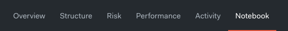
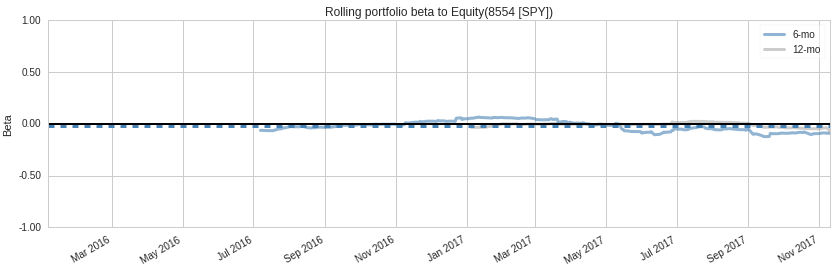
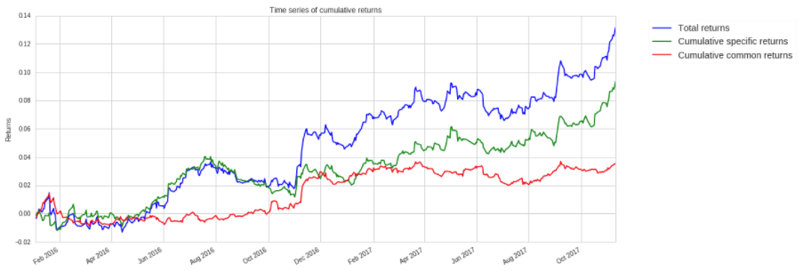

Backtest で分析する
--------------------

バックテストの実行が終了したら、"Notebook"タブをクリックします。

そうすると、以下のコードを含むResearch notebookが開きます。

.. code:: python

    bt = get_backtest('5a4e4faec73c4e44f218170a')
    bt.create_full_tear_sheet()

.. note::

   notebookに表示される英数字の文字列は、上記のものとは異なります。
   この文字列は、Quantopian内でのバックテストの一意の識別子です。
   full backtestを行った時の結果ページのURLにも、この文字列が使われています。

このセルを実行（Shift+Enter）すると、backtestで生成されたデータがresearch notebookに読み込まれ、それを使ってPyfolioのtear sheetが作成されます。
`Pyfolio <https://www.quantopian.com/lectures/portfolio-analysis>`__ は、Quantopianが開発したポートフォリオとリスク分析を行うオープンソースのツールです。　
このツールには、アルゴリズムの動作やリスクエクスポージャーを時間の経過とともによりよく理解するために設計された、多くの可視化ツールが用意されています。
例えば以下のプロットは、私達のポートフォリオがマーケットの影響をどのくらい受けているか、一定期間単位で時系列に表示したものです。
私たちが株式ロング・ショート取引アルゴリズムを構築しようと思った理由の一つは、市場との相関関係を低く維持することでした。
したがってこのプロットが、backtestingの期間ずっと、だいたい0付近になるようになることを望みます。

tear sheetのもう1つの面白い点は、パフォーマンスがどの特性から生み出されたものかを表示するところです。
以下のプロットは、リターンのうちどれだけが私達の戦略に起因するか、そしてそのうちどれだけが一般的なリスク要因に起因するかを説明するために、`Quantopian の Risk Model <https://www.quantopian.com/risk-model>`__ を使っています。

上のプロットから、ポートフォリオのトータルリターンのほとんどが特定のリターンから来ていることがわかります。
これは、アルゴリズムのパフォーマンスが一般的なリスク要因から来ていないことを示唆しています。
それは私達のアルゴリズムにとって良いことです。

これでQuantopianの入門チュートリアルが終了です。おめでとうございます。
プラットフォームのAPIに慣れてきたところで、ご自身の戦略を研究・開発して、 `contest <https://www.quantopian.com/contest>`__ に応募してみましょう。

アイデアが必要な場合は、 `Lecture Series <https://www.quantopian.com/contest>`__ を試して下さい。
金融工学ファイナンス（クオンツ）について多く学ぶことが出来ます。
また、 `community <https://www.quantopian.com/contest>`__ で他のメンバーが共有しているアイデアを見るのもよいでしょう。
