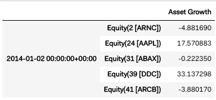

Alphalensで tear sheets を作成
===================================

原作 : https://www.quantopian.com/tutorials/alphalens#lesson2

.. note:: 

    本Tutorialのコードは、`ドキュメント原作ページ <https://www.quantopian.com/tutorials/alphalens#lesson2>`__ にある ``Get Notebook`` ボタンでクローン出来ます。

前回のレッスンでは、Alphalensとは何かを学びました。このレッスンでは、Alphalensの使い方を4つのステップで学びます。

1. アルファファクターを記述し、取引ユニバースを指定して、特定の期間で `パイプラインを実行 <https://www.quantopian.com/docs/api-reference/research-api-reference#quantopian.research.run_pipeline>`__ します。
2. ``get_pricing()`` を使って、取引ユニバースの株価のヒストリカルデータを同期間取得します。
3. ``get_clean_factor_and_forward_returns()`` を使ってアルファファクターと株価データを結合します。
4. ``create_full_tear_sheet()`` をつかって、アルファファクターが価格変化をどのくらい予測しているか可視化します。

Pipelineを構築、実行する
------------------------

以下のコードは、資産の成長率にもとづいたアルファファクターを記述し ``run_pipeline()`` でパイプラインを実行しています。

.. code:: ipython3

    from quantopian.pipeline import Pipeline
    from quantopian.pipeline.data import factset
    from quantopian.research import run_pipeline
    from quantopian.pipeline.filters import QTradableStocksUS
    
    def make_pipeline():
        
        # 資産の成長率を算出
        asset_growth = factset.Fundamentals.assets_gr_qf.latest 
        
        return Pipeline(
            columns = {'Asset Growth': asset_growth},
            screen = QTradableStocksUS() & asset_growth.notnull()
        )
    
    pipeline_output = run_pipeline(pipeline=make_pipeline(), start_date='2014-1-1', end_date='2016-1-1')
    
    # ファクターデータの最初の5行を出力
    pipeline_output.head(5) 

これでアルファファクターのデータが得られました。データの最初の5行は次のようになります

Query Pricing Data
------------------

ファクターデータを取得したので、次に同じ期間の価格データを取得してみましょう。 
``get_pricing()`` は、指定された期間の資産のリストの価格データを返します。これには4つの引数が必要です。

- 価格を知りたい資産のリスト
- データ取得開始日
- データ取得終了日
- 始値、高値、安値、終値のどれを使用するか

Execute the following cell to get pricing data.

.. code:: ipython3

    pricing_data = get_pricing(
    symbols=factor_data.index.levels[1], # ファクターデータを取得したすべての資産
    start_date='2014-1-1',
    end_date='2016-2-1', # end_date は、run_pipeline() で実行した最終日よりも後の日を指定。詳しくはlesson 4
    fields='open_price' # だいたいにおいて始値を使う.詳しくは lesson 4
    )

    # 最初の5行を表示
    pricing_data.head(5)

これで、取引ユニバースに一度でも入ったすべての資産の価格データを取得します。
最初の5行は次のようになります。

Align Data
----------

``get_clean_factor_and_forward_returns()`` は、``run_pipeline()`` で作成したファクターデータと ``get_pricing()`` で取得した価格データを配列しなおして、Alphalensの可視化関数が分析しやすいデータオブジェクトを返します。
必須引数は2つです。

-  ``run_pipeline()`` が作成したファクターデータ
-  ``get_pricing()`` が作成した価格データ

.. code:: ipython3

    from alphalens.utils import get_clean_factor_and_forward_returns
    
    factor_data = get_clean_factor_and_forward_returns(
        factor=pipeline_output, 
        prices=pricing_data
    )
    
    # マージした最初の5行を表示
    factor_data.head(5) 

これで、ファクターデータが数日後の価格に影響を与えているかどうかを分析できるように、価格データとファクターデータを組み合わせたデータが返ります。デフォルトでは、1日、5日、10日後の期間で算出されています。

結果を可視化
-----------------

最後に、``create_full_tear_sheet()`` に ``get_clean_factor_and_forward_returns()`` の出力結果を渡します。

.. code:: ipython3

    from alphalens.tears import create_full_tear_sheet

    create_full_tear_sheet(merged_data)

返されたティアシートにはたくさんの有益な情報が可視化されています。このグラフはそのうちの1つです。クローンしたノートブックを実行してほかの結果も確認してみてください。

できあがり
-------------

次のレッスンでは、``create_full_tear_sheet()`` で生成されたチャートをどのように読み解くかを見ていきましょう。
