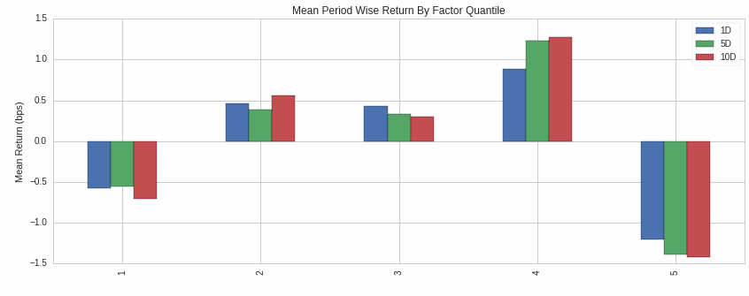

Alphalensティアシートを読み解く
==================================

原作 : https://www.quantopian.com/tutorials/alphalens#lesson3

.. note:: 

    本Tutorialのコードは、`ドキュメント原作ページ <https://www.quantopian.com/tutorials/alphalens#lesson3>`__ にある ``Get Notebook`` ボタンでクローン出来ます。

このレッスンでは、 ティアシート分析をすることで、`quant workflow <https://blog.quantopian.com/a-professional-quant-equity-workflow/>`__ のアルファを探すステップを何回か繰り返して体験していただきます。

このようなステップで行います：

1. ``create_information_tear_sheet()`` を使って、アルファファクターがどのくらい適切に将来価格を予測しているかを分析
2. ほかのアルファファクターを組み合わせて、アルファファクターを改善
3. ``create_returns_tear_sheet()`` を使って、アルファファクターの収益性を測る。

はじめてのアルファファクター
~~~~~~~~~~~~~~~~~~~~~~~~~~~~~
次のコードは、企業の純利益と時価総額からアルファファクターを表現し、そのアルファファクターの情報ティアシート（information tear sheet)を作成します。

まずはアルファファクターの情報係数 (IC) から分析していきます。
ICは、-1から1までの数値で、アルファファクターがどの程度予測できるか定量化するための数値です。
0以上の数値は、予測可能性がやや高いと考えられます。

最初に見るべき数値はICの平均値です。これは与えられた期間におけるアルファファクターの平均ICです。
ファクターのIC平均はできるだけ高いほうがよいです。多くの場合、ファクター平均が0以上であればそのファクターをさらに調査する価値があります。もし大きな取引対象銘柄において、IC平均が0.1に近い（もしくはそれ以上）の場合、そのファクターはおそらくとても良いものと言えるでしょう。

.. code:: ipython3

    from quantopian.pipeline.data import factset

    from quantopian.pipeline import Pipeline
    from quantopian.research import run_pipeline
    from quantopian.pipeline.factors import CustomFactor, SimpleMovingAverage
    from quantopian.pipeline.filters import QTradableStocksUS
    from alphalens.tears import create_information_tear_sheet
    from alphalens.utils import get_clean_factor_and_forward_returns

    def make_pipeline():

        # 年次の企業収益を、過去1年間の移動平均で取得
        net_income_moving_average = SimpleMovingAverage( 
        inputs=[factset.Fundamentals.net_inc_af], 
        window_length=252
        )

        # 時価総額を過去1年間の移動平均で取得
        market_cap_moving_average = SimpleMovingAverage( 
        inputs=[factset.Fundamentals.mkt_val], 
        window_length=252
        )

        average_market_cap_per_net_income = (market_cap_moving_average / net_income_moving_average)

        # 直近四半期の企業収益を取得
        net_income = factset.Fundamentals.net_inc_qf.latest 

        projected_market_cap = average_market_cap_per_net_income * net_income

        return Pipeline(
        columns={'projected_market_cap': projected_market_cap},
        screen=QTradableStocksUS() & projected_market_cap.notnull()
        )

    factor_data = run_pipeline(make_pipeline(), '2010-1-1', '2012-1-1')
    pricing_data = get_pricing(factor_data.index.levels[1], '2010-1-1', '2012-2-1', fields='open_price')
    merged_data = get_clean_factor_and_forward_returns(factor_data, pricing_data)

    create_information_tear_sheet(merged_data)

``create_information_tear_sheet()`` で作成された最初のチャートができました。IC平均値がすべて正の値であることに注目してください。これは良い兆候です。

.. image:: notebook_files/alphalens_l3_screenshot1.png

他のアルファファクターを追加
~~~~~~~~~~~~~~~~~~~~~~~~~~~~~~

**Alphalensを使うとクオンツワークフローの早い段階で、将来価格を予測できそうにないアルファファクターを特定できます。早い段階で不要なファクターを捨てることで、フルバックテストでの時間のムダにを避ける事ができます。**

次のコードで、``price_to_book`` という新しいアルファファクターを追加しました。
そのファクターに、``projected_market_cap`` と名付けたファクターを `z値 <https://ja.wikipedia.org/wiki/%E6%A8%99%E6%BA%96%E5%BE%97%E7%82%B9#Z%E5%BE%97%E7%82%B9>`__ や `外れ値処理 <https://en.wikipedia.org/wiki/Winsorizing>`__ をしながら組み合わせ、（願わくは改良された）アルファファクター( ``factor_to_analyze`` )に更新しました。最終的にそのファクターのティアシートを作成しています。

.. code:: ipython3

    def make_pipeline():

        # 1年次の企業収益を、過去1年間の移動平均で取得
        net_income_moving_average = SimpleMovingAverage( 
            inputs=[factset.Fundamentals.net_inc_af], 
            window_length=252
        )

        # 時価総額を過去1年間の移動平均で取得
        market_cap_moving_average = SimpleMovingAverage( 
            inputs=[factset.Fundamentals.mkt_val], 
            window_length=252
        )

        average_market_cap_per_net_income = (market_cap_moving_average / net_income_moving_average)

        net_income = factset.Fundamentals.net_inc_qf.latest # 直近四半期の企業収益を取得

        projected_market_cap = average_market_cap_per_net_income * net_income

        price_to_book = factset.Fundamentals.pbk_qf.latest # アルファファクターを追加

        factor_to_analyze = projected_market_cap.zscore() + price_to_book.zscore()

        return Pipeline(
            columns={'factor_to_analyze': factor_to_analyze},
            screen=QTradableStocksUS() & factor_to_analyze.notnull()
        )

    factor_data = run_pipeline(make_pipeline(), '2010-1-1', '2012-1-1')
    pricing_data = get_pricing(factor_data.index.levels[1], '2010-1-1', '2012-2-1', fields='open_price')
    new_merged_data = get_clean_factor_and_forward_returns(factor_data, pricing_data)

    create_information_tear_sheet(new_merged_data)

ICの数値が最初のチャートよりも低くなっています。これは追加したファクターが予測を悪化させていることを意味しています。

アルファファクターが利益をもたらすか確認
~~~~~~~~~~~~~~~~~~~~~~~~~~~~~~~~~~~~~~~~~~~

最初のアルファファクターのほうが、2番目よりも予測値が高い事がわかりました。では、最初のアルファファクターを使えば収益が上がるか見てみましょう。

``create_returns_tear_sheet()`` を使うと、取引対象銘柄をクォンタイルに分割しそれぞれのクォンタイルよって生成された収益を異なる期間に渡って表示します。分位点1はアルファファクターの値が最下位20％の資産群であり、分位点 5 は最高位20%の資産群です。

この機能は6種類のチャートを作成しますが、最も重要なのはこの2つです。

- **Mean Period Wise Return by Factor Quantile (分位点ごとの期間ごとの平均リターン）**：このチャートは、あなたの取引対象銘柄内の各分位点の期間ごとの平均リターンを示しています。右側の分位数が左側の分位数よりも平均リターンが高くなるようにします。

- **Cumulative return by quantile (分位点ごとの累積収益）**：このチャートは、各分位の収益が時間の経過とともにどのように推移したかを示しています。分位点1が一貫して最悪のパフォーマンスを示し、分位点5が一貫して最高のパフォーマンスを示し、その他の分位点が中央にあるが望ましいです。

下記のコードがティアシートを作成します。

.. code:: ipython3

    from alphalens.tears import create_returns_tear_sheet

    create_returns_tear_sheet(merged_data)

Cumulative return by quantileをみるとで、分位点5は最も高い収益ではないということがわかります。理想的には、分位点1が最も低い収益を、分位点5が最も高い収益を持つようにしたいです。
また、分位点間に明らかな交差が見られます。理想的には、累積収益同士は交差してほしくはありません。このティアーシートは、私たちにまだやるべきことがあることを教えてくれています。

このレッスンでは、クオンツワークフローに沿ってアルファファクターを見つけるためのサイクルを体験しました。
良いアルファファクターを作るのは簡単なことではありませんが、Alphalensを使えば正しい軌道に乗っているかどうかを見極めるために、すばやく施策を繰り返すことができます。
既存のアルファファクターを改善するのは、移動平均やトレンドの反転を探したりとあらゆる方法で創造的に行うことができます。

`Quantopianのフォーラム <https://www.quantopian.com/posts>`__ を見たり、学術論文を読んだりして、インスピレーションを得てみてください。**ここから創造力が身につきます**。次のレッスンでは、アルファレンズの高度な概念について説明します。
