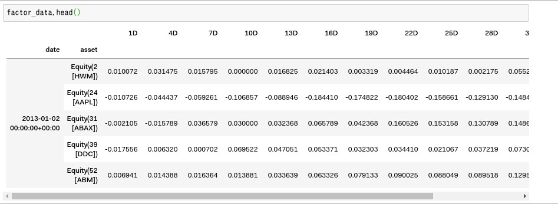

一歩進んだAlphalensの概念と使い方
===================================

原作： https://www.quantopian.com/tutorials/alphalens#lesson4

.. note:: 

    ここでのTutorialのコードは、`ドキュメント原作ページ <https://www.quantopian.com/tutorials/alphalens#lesson4>`__ にある ``Get Notebook`` ボタンでクローン出来ます。

    また  ``Get Notebook`` でクローンできるコードは、このチュートリアルの完成版です。以下のチュートリアルでは説明の為に意図的にエラーを出すコードや説明の為に一部変数を変えたコードが記されていますのご注意下さい。

これまでのレッスンでは、Alphalensの基本的な使い方を学びました。
次のレッスンでは、以下のような、高度なAlphalensの概念や使い方を学びます。

1. アルファファクターがどのくらい先の将来を予測できるか見極める
2. Alphalensのエラーである ``MaxLossExceededError`` とは何か、またそれにどう対処すべきか
3. 資産を業種ごとのグループにまとめ、各業種を分析する
4. 上記の分析をもとに、どのグループにも偏らないストラテジーを書く

次のコードは、パイプラインでアルファファクターを作成するコードです。このパイプラインのデータを使ってAlphalensの高度な概念を学んでいきましょう。

**重要な注意**：
これまでのレッスンでは、``run_pipeline()`` が返すパイプラインの出力結果をそのまま ``get_clean_factor_and_forward_returns()`` に渡していました。というのも、パイプラインが返す結果が１つのカラムだけだったからです。下記のコードは、カラムを２つ返します。（ ``factor_to_analyze`` と ``sector`` ）。したがってファクターデータはどのカラムかをAlphalensに伝える必要があります。詳しくは下記のコードの ``get_clean_factor_and_forward_returns()`` のコメントを確認して下さい。

.. note:: 

    説明を明確にするため、下記のプログラムに ``base_code`` と名付けます。原作ではそのような表現はありません。

.. code:: python
   :caption: base_code

    from quantopian.pipeline import Pipeline
    from quantopian.pipeline.data import factset
    from quantopian.research import run_pipeline
    from quantopian.pipeline.filters import QTradableStocksUS
    from quantopian.pipeline.classifiers.fundamentals import Sector
    from alphalens.utils import get_clean_factor_and_forward_returns

    def make_pipeline():
        
        change_in_working_capital = factset.Fundamentals.wkcap_chg_qf.latest
        ciwc_processed = change_in_working_capital.winsorize(.2, .98).zscore()
        
        sales_per_working_capital = factset.Fundamentals.sales_wkcap_qf.latest
        spwc_processed = sales_per_working_capital.winsorize(.2, .98).zscore()

        factor_to_analyze = (ciwc_processed + spwc_processed).zscore()

        sector = Sector()

        return Pipeline(
            columns = {
                'factor_to_analyze': factor_to_analyze,
                'sector': sector,
            },
            screen = (
                QTradableStocksUS()
                & factor_to_analyze.notnull()
                & sector.notnull()
            )
        )

    pipeline_output = run_pipeline(make_pipeline(), '2013-1-1', '2014-1-1')
    pricing_data = get_pricing(pipeline_output.index.levels[1], '2013-1-1', '2014-3-1', fields='open_price')

    factor_data = get_clean_factor_and_forward_returns(
        pipeline_output['factor_to_analyze'], # パイプラインのどのコラムをAlphalensに分析させるか指定
        pricing_data, 
        periods=range(1,32,3) # 下記 factor_data の出力結果を参照
    )

``get_clean_factor_and_forward_returns`` についての詳しい説明はAPI Doc [#get_clean_factor_and_forward_returns]_ を参照して下さい。

``pipeline_output`` の出力結果

``pricing_data`` の出力結果

``factor_data`` の出力結果

`periods=range(1,32,3)` というオプションを渡したので、各銘柄の今日から31日後までの3日おきに、銘柄の収益率がいくらだったかを算出。同時にその時の ``factor`` 値と ``factor_quantile`` も同列に配置されている。

アルファファクターの減衰率の可視化
------------------------------------------

多くのファンダメンタルデータは、年4回の四半期レポートでしか取得できません。頻度が低いのでなるべくたくさんのファンダメンタルデータを ``get_clean_factor_and_forward_returns()`` に渡したほうが将来を見通すためには有用です。

**メモ**：1ヵ月の取引日は通常21日、四半期は63日、1年は252日です。

たとえば、利益を上げ続けている会社の株式を買うという戦略を立てたとしましょう（データは63日取引日ごとにリリースされます）。
利益を上げ続けているというファクター（＝私達のアルファファクター）をみて、あなたは今後10日間だけを株式保有期間として分析するでしょうか？たぶん違うでしょう。もっと長い期間を想定するはずです。しかし、どのくらい先の期間を考えるべきでしょうか？

上記で得られた ``factor_data`` を使って、私達のアルファファクターの情報係数（information coefficient,IC）の平均値を時系列で見てみましょう。

.. note:: 

    下記のコードは ``Get Notebook`` でクローンしたnotebookの中には記述されていません。試したい場合は任意の場所にセルを追加しコピーペーストして実行して下さい。

.. code:: python

    from alphalens.performance import mean_information_coefficient
    mean_information_coefficient(factor_data).plot(title="IC Decay");

このチャートは、ポイントが0を下回った時アルファファクターの予測が有用ではなくなったことを表現しています。

この例は約一ヵ月のチャートですが、1年先のICを計算するとチャートはどのような線を描くでしょうか。やってみましょう。

.. code:: python
   :caption: base_code

    # 一部省略

    factor_data = get_clean_factor_and_forward_returns(
        pipeline_output['factor_to_analyze'], 
        pricing_data,
        periods=range(1,252,20) # 1日〜252日、20日ごとに収益率を確認。range()関数の3番目の引数は頻度
    )

    mean_information_coefficient(factor_data).plot()

このコードを実行すると下記のようなエラーが出ます。次章ではこのErrorに対応していきます。

MaxLossExceededErrorを対処
----------------------------------

さて ``What does MaxLossExceededError: max_loss (35.0%) exceeded 88.4%, consider increasing it.`` はどういう意味でしょう？

上記 ``factor_data`` の出力結果でも確認しましたが、``get_clean_factor_and_forward_returns()`` の返り値は、将来の収益率とアルファファクターの値を一列に並べたデータです。その収益率は、``get_pricing()`` の返り値を使って計算しています。
つまり、``pricing_data`` は、ファクターデータより将来の値を保持しておかなくてはいけないし、少なくとも、``get_clean_factor_and_forward_returns()`` の ``periods=`` で指定した期間分長めに指定しておく必要があります。ここの例でいうと、``get_pricing()`` の ``end_date`` は、 ``run_pipeline()`` の ``end_date`` よりも少なくとも一年（＝252日）分将来の日付を指定する必要があります。

では、それにしたがってコードを修正してみましょう。

.. code:: python 
   :caption: base_code

    # 一部省略

    pipeline_output = run_pipeline(
        make_pipeline(),
        start_date='2013-1-1', 
        end_date='2014-1-1' #  ファクターデータは2014-1-1まで
    )

    pricing_data = get_pricing(
        pipeline_output.index.levels[1], 
        start_date='2013-1-1',
        end_date='2015-2-1', # pricing data は 2014-1-1の252日先である2015-1-1＋アルファまで。252日＋アルファしておくと間違いない。
        fields='open_price'
    )

    factor_data = get_clean_factor_and_forward_returns(
        pipeline_output['factor_to_analyze'], 
        pricing_data,
        periods=range(1,252,20) # 10日以下の頻度を指定すると時間がかかるので注意。
    )

    mean_information_coefficient(factor_data).plot()

これでエラーなく一年先までICを見ることができました。
チャートから私達のアルファファクターは、評価後すぐに減衰していきますが、そのあと6ヵ月もかからない間に強く伸びていくことがわかりました。これは面白い発見ですね。

*メモ*： ``MaxLossExceededError`` の発生には以下2つの理由が考えられます。1つは将来の収益に関する計算時のエラー、もう1つはビン分割時のエラーです。 ここでは出現しやすい1つめに関してのみ説明しました。2つめのビン分割に関しては、API doc を確認して下さい。

アルファファクターをグループで分析
------------------------------------

Alphalensでは、分類器を使って資産をグループ化できます。頻繁に行われるグループ化のケースは、各資産を業種別にグループ化することです。そうすることで各業種においてアルファファクターが生み出す収益を比べることができます。

もちろんほかの分類器を使ってもかまいませんが、業種は最もよく使われる分類です。base_codeに記述した、パイプラインの ``sector`` [#sector]_ と名付けられたコラムに、Morningstar のセクターコードが返ります。このコラムを ``get_clean_factor_and_forward_returns()`` のオプション引数である ``groupby`` に渡せばグループ化できます。

下記のようにコードを変更します。

.. code:: python 
   :caption: base_code

    # 追加
    from alphalens.tears import create_returns_tear_sheet

    sector_labels, sector_labels[-1] = dict(Sector.SECTOR_NAMES), "Unknown"

    # 一部省略

    factor_data = get_clean_factor_and_forward_returns(
        factor=pipeline_output['factor_to_analyze'],
        prices=pricing_data,
        groupby=pipeline_output['sector'],
        groupby_labels=sector_labels, 
    )

    create_returns_tear_sheet(factor_data=factor_data, by_group=True)

ファクターが業種ごとにグループ化されると、各業種で私達のファクターがどのように機能するかを示すチャートがティアシートの下の方に表示されます。

   
   業種ごとのアルファファクター
   

特定のグループに偏らないストラテジーを書く
-------------------------------------------

アルファレンズでは、私たちのアルファファクターがロングショート取引戦略でどのように機能するかをシミュレートできるだけでなく、各グループでロング/ショートを行った場合どのようにアルファファクターが機能するかを確認することもできます。

業種ごとにグループ化し各業種でロング/ショートを行うことで、業種の全体的な動きへのエクスポージャーを制限できます。
たとえば上図の業種ごとのアルファファクターを見ると、ある業種がすべての分位でプラスの収益を、ほかの業種ではすべての分位でマイナスの収益をもたらしていることに気付いたかもしれません。

この情報はその業種グループが市場をアウトパフォームした（またはアンダーパフォームした）ことを意味するだけで、その業種内で私達のファクターがどのように機能するかについては何の洞察も与えてくれません。

すでに業種でグループ化しているので、以下の変更を加えれば、特定のグループに依存しないように変更できます。

1. ``get_clean_factor_and_forward_returns()`` に ``binning_by_group=True`` オプションを渡す
2. ``create_full_tear_sheet()`` に ``group_neutral=True`` オプションを渡す
3. 実際の変更は次のコードの通りです。実行して前回の結果と比べて見て下さい。

.. code:: python
   :caption: base_code

    # 一部省略

    factor_data = get_clean_factor_and_forward_returns(
        pipeline_output['factor_to_analyze'],
        prices=pricing_data,
        groupby=pipeline_output['sector'],
        groupby_labels=sector_labels, # 追加
        binning_by_group=True, # 追加
    )

    create_returns_tear_sheet(factor_data, by_group=True, group_neutral=True)

見てわかるとおり、グループニュートラル（特定の業種に偏らないこと）にすると結果が異なります。
このようにグループニュートラルで分析を行うことで、私達のアルファファクターの振る舞いがなぜ特定の振る舞いをするのか、といった事に関して具体的な観察を得ることもあります。

.. figure:: notebook_files/alphalens_l4_screenshot5.png
   
   業種ごとのアルファファクター

お疲れさまでした。

このチュートリアルで学んだテクニックは、良いアルファファクターを特定するのに役立つでしょう。Lesson5のテンプレートを使ってアルファファクターをいくつか作成し、IDEに実装してQuantopianコンテストにぜひ応募してみてください。

.. rubric:: 脚注

.. [#get_clean_factor_and_forward_returns] https://www.quantopian.com/docs/api-reference/alphalens-api-reference#alphalens.utils.get_clean_factor_and_forward_returns
.. [#sector] https://www.quantopian.com/docs/api-reference/pipeline-api-reference#quantopian.pipeline.classifiers.morningstar.Sector
