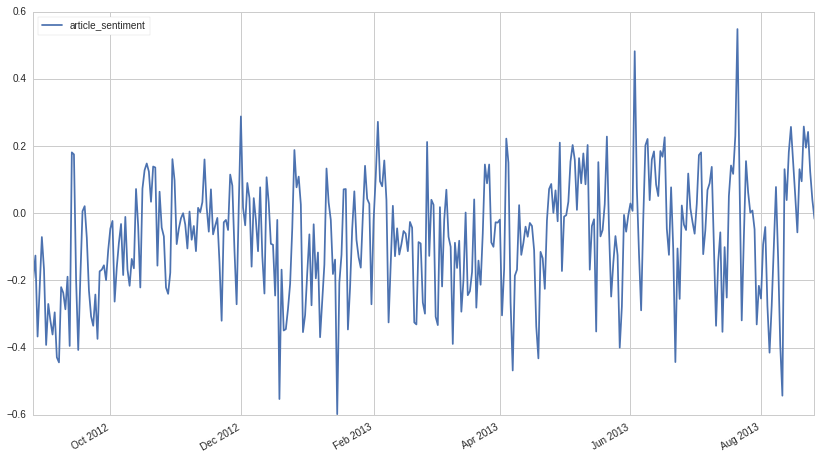
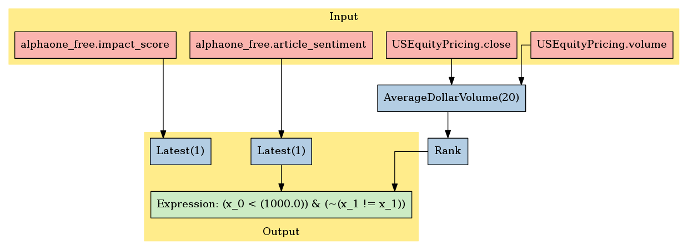

Accern: Alpha One
=================

In this notebook, we’ll take a look at Accern’s *Alpha One* dataset,
available on `Quantopian <https://www.quantopian.com/store>`__. This
dataset spans August 26, 2012 through the current day. It contains
comprehensive sentiment analysis related to equities from 20 million+
sources.

Notebook Contents
-----------------

There are two ways to access the data and you’ll find both of them
listed below. Just click on the section you’d like to read through.

-  Interactive overview: This is only available on Research and uses
   blaze to give you access to large amounts of data. Recommended for
   exploration and plotting.
-  Pipeline overview: Data is made available through pipeline which is
   available on both the Research & Backtesting environment. Recommended
   for custom factor development and moving back & forth between
   research/backtesting.

Free samples and limits
~~~~~~~~~~~~~~~~~~~~~~~

One key caveat: we limit the number of results returned from any given
expression to 10,000 to protect against runaway memory usage. To be
clear, you have access to all the data server side. We are limiting the
size of the responses back from Blaze.

There is a *free* version of this dataset as well as a paid one. The
free sample includes data until 2 months prior to the current date.

To access the most up-to-date values for this data set for trading a
live algorithm (as with other partner sets), you need to purchase acess
to the full set.

With preamble in place, let’s get started:

#Interactive Overview ### Accessing the data with Blaze and Interactive
on Research Partner datasets are available on Quantopian Research
through an API service known as `Blaze <http://blaze.pydata.org>`__.
Blaze provides the Quantopian user with a convenient interface to access
very large datasets, in an interactive, generic manner.

Blaze provides an important function for accessing these datasets. Some
of these sets are many millions of records. Bringing that data directly
into Quantopian Research directly just is not viable. So Blaze allows us
to provide a simple querying interface and shift the burden over to the
server side.

It is common to use Blaze to reduce your dataset in size, convert it
over to Pandas and then to use Pandas for further computation,
manipulation and visualization.

Helpful links: \* `Query building for
Blaze <http://blaze.readthedocs.io/en/latest/queries.html>`__ \*
`Pandas-to-Blaze
dictionary <http://blaze.readthedocs.io/en/latest/rosetta-pandas.html>`__
\* `SQL-to-Blaze
dictionary <http://blaze.readthedocs.io/en/latest/rosetta-sql.html>`__.

| Once you’ve limited the size of your Blaze object, you can convert it
  to a Pandas DataFrames using: > ``from odo import odo``
| > ``odo(expr, pandas.DataFrame)``

###To see how this data can be used in your algorithm, search for the
``Pipeline Overview`` section of this notebook or head straight to
Pipeline Overview

.. code:: ipython2

    # import the dataset
    from quantopian.interactive.data.accern import alphaone_free as dataset
    
    # or if you want to import the paid dataset, use:
    # from quantopian.interactive.data.accern import alphaone
    
    # import data operations
    from odo import odo
    # import other libraries we will use
    import pandas as pd
    import matplotlib.pyplot as plt

.. code:: ipython2

    # Let's use blaze to understand the data a bit using Blaze dshape()
    dataset.dshape

.. parsed-literal::

    dshape("""var * {
      symbol: string,
      name: ?string,
      article_sentiment: float64,
      impact_score: float64,
      sid: int64,
      asof_date: datetime,
      timestamp: datetime
      }""")

.. code:: ipython2

    # And how many rows are there?
    # N.B. we're using a Blaze function to do this, not len()
    dataset.count()

.. raw:: html

    591697

.. code:: ipython2

    # Let's see what the data looks like. We'll grab the first three rows.
    dataset[:3]

.. raw:: html

    <table border="1" class="dataframe">
      <thead>
        <tr style="text-align: right;">
          <th></th>
          <th>symbol</th>
          <th>name</th>
          <th>article_sentiment</th>
          <th>impact_score</th>
          <th>sid</th>
          <th>asof_date</th>
          <th>timestamp</th>
        </tr>
      </thead>
      <tbody>
        <tr>
          <th>0</th>
          <td>AAPL</td>
          <td>Apple Inc.</td>
          <td>-0.194</td>
          <td>70.495</td>
          <td>24</td>
          <td>2012-08-26</td>
          <td>2012-08-26</td>
        </tr>
        <tr>
          <th>1</th>
          <td>GRPN</td>
          <td>Groupon, Inc.</td>
          <td>-0.167</td>
          <td>79.000</td>
          <td>42118</td>
          <td>2012-08-26</td>
          <td>2012-08-26</td>
        </tr>
        <tr>
          <th>2</th>
          <td>TWTR</td>
          <td>Twitter, Inc.</td>
          <td>-0.473</td>
          <td>29.362</td>
          <td>19171</td>
          <td>2012-08-26</td>
          <td>2012-08-26</td>
        </tr>
      </tbody>
    </table>

Let’s go over the columns: - **symbol**: the ticker symbol of the
company. - **name**: the name of the company. - **asof_date**: Alpha
One’s timestamp of delivery of **article_sentiment**. -
**article_sentiment**: a score in [-1,1] reflecting the sentiment of
articles written about the company in the last day. The higher score,
the more positive the outlook. - **timestamp**: this is our timestamp on
when we registered the data. - **impact_score**: on [0,100], this is the
probability that the stock price will change by more than 1% (given by:
close - open / open) on the next trading day. - **sid**: the equity’s
unique identifier. Use this instead of ticker or name.

We’ve done much of the data processing for you. Fields like
``timestamp`` and ``sid`` are standardized across all our Store
Datasets, so the datasets are easy to combine. We have standardized the
``sid`` across all our equity databases.

We can select columns and rows with ease. Below, we’ll fetch all entries
for the sid 24, which identifies AAPL. We’re really only interested in
the timestamp, article sentiment, and the impact score, so we’ll display
only those.

.. code:: ipython2

    aapl = dataset[dataset.sid==24][['asof_date','article_sentiment', 'impact_score']].sort('asof_date')
    # Whenever you print a Blaze Data Object, it will be truncated to ten rows.
    aapl

.. raw:: html

    <table border="1" class="dataframe">
      <thead>
        <tr style="text-align: right;">
          <th></th>
          <th>asof_date</th>
          <th>article_sentiment</th>
          <th>impact_score</th>
        </tr>
      </thead>
      <tbody>
        <tr>
          <th>0</th>
          <td>2012-08-26</td>
          <td>-0.194</td>
          <td>70.495</td>
        </tr>
        <tr>
          <th>1</th>
          <td>2012-08-27</td>
          <td>-0.126</td>
          <td>70.086</td>
        </tr>
        <tr>
          <th>2</th>
          <td>2012-08-28</td>
          <td>-0.367</td>
          <td>70.100</td>
        </tr>
        <tr>
          <th>3</th>
          <td>2012-08-29</td>
          <td>-0.219</td>
          <td>70.436</td>
        </tr>
        <tr>
          <th>4</th>
          <td>2012-08-30</td>
          <td>-0.071</td>
          <td>70.738</td>
        </tr>
        <tr>
          <th>5</th>
          <td>2012-08-31</td>
          <td>-0.167</td>
          <td>70.417</td>
        </tr>
        <tr>
          <th>6</th>
          <td>2012-09-01</td>
          <td>-0.392</td>
          <td>71.379</td>
        </tr>
        <tr>
          <th>7</th>
          <td>2012-09-02</td>
          <td>-0.270</td>
          <td>70.664</td>
        </tr>
        <tr>
          <th>8</th>
          <td>2012-09-03</td>
          <td>-0.320</td>
          <td>70.570</td>
        </tr>
        <tr>
          <th>9</th>
          <td>2012-09-04</td>
          <td>-0.361</td>
          <td>70.746</td>
        </tr>
        <tr>
          <th>10</th>
          <td>2012-09-05</td>
          <td>-0.295</td>
          <td>70.631</td>
        </tr>
      </tbody>
    </table>

You can see that Accern collects data for every day, not just for every
business day.

Let’s convert ``aapl`` to a DataFrame.

.. code:: ipython2

    aapl_sentiment = odo(aapl, pd.DataFrame)
    # let's say we only want one year of data.
    aapl_sentiment = aapl_sentiment[aapl_sentiment['asof_date'] <= '2013-08-26']
    # suppose we want the rows to be indexed by timestamp.
    aapl_sentiment.index = list(aapl_sentiment['asof_date'])
    aapl_sentiment.drop('asof_date',1,inplace=True)
    # display the first three rows. DataFrames, when printed, display 60 rows at a time.
    aapl_sentiment[:3]

.. raw:: html

    

    <table border="1" class="dataframe">
      <thead>
        <tr style="text-align: right;">
          <th></th>
          <th>article_sentiment</th>
          <th>impact_score</th>
        </tr>
      </thead>
      <tbody>
        <tr>
          <th>2012-08-26</th>
          <td>-0.194</td>
          <td>70.495</td>
        </tr>
        <tr>
          <th>2012-08-27</th>
          <td>-0.126</td>
          <td>70.086</td>
        </tr>
        <tr>
          <th>2012-08-28</th>
          <td>-0.367</td>
          <td>70.100</td>
        </tr>
      </tbody>
    </table>
    

Let’s take a look at the sentiment in a chart

.. code:: ipython2

    aapl_sentiment.plot(y='article_sentiment')

.. parsed-literal::

    <matplotlib.axes._subplots.AxesSubplot at 0x7f4a905f0650>

#Pipeline Overview

Accessing the data in your algorithms & research
~~~~~~~~~~~~~~~~~~~~~~~~~~~~~~~~~~~~~~~~~~~~~~~~

The only method for accessing partner data within algorithms running on
Quantopian is via the pipeline API. Different data sets work differently
but in the case of this PsychSignal data, you can add this data to your
pipeline as follows:

Import the data set here >
``from quantopian.pipeline.data.accern import alphaone``

Then in intialize() you could do something simple like adding the raw
value of one of the fields to your pipeline: >
``pipe.add(alphaone.impact_score.latest, 'impact_score')``

.. code:: ipython2

    # Import necessary Pipeline modules
    from quantopian.pipeline import Pipeline
    from quantopian.research import run_pipeline
    from quantopian.pipeline.factors import AverageDollarVolume

.. code:: ipython2

    # For use in your algorithms
    # Using the full paid dataset in your pipeline algo
    # from quantopian.pipeline.data.accern import alphaone
    
    # Using the free sample in your pipeline algo
    from quantopian.pipeline.data.accern import alphaone_free

Now that we’ve imported the data, let’s take a look at which fields are
available for each dataset.

You’ll find the dataset, the available fields, and the datatypes for
each of those fields.

.. code:: ipython2

    print "Here are the list of available fields per dataset:"
    print "---------------------------------------------------\n"
    
    def _print_fields(dataset):
        print "Dataset: %s\n" % dataset.__name__
        print "Fields:"
        for field in list(dataset.columns):
            print "%s - %s" % (field.name, field.dtype)
        print "\n"
    
    for data in (alphaone_free,):
        _print_fields(data)
    
    
    print "---------------------------------------------------\n"

.. parsed-literal::

    Here are the list of available fields per dataset:
    ---------------------------------------------------
    
    Dataset: alphaone_free
    
    Fields:
    article_sentiment - float64
    impact_score - float64
    
    
    ---------------------------------------------------
    

Now that we know what fields we have access to, let’s see what this data
looks like when we run it through Pipeline.

This is constructed the same way as you would in the backtester. For
more information on using Pipeline in Research view this thread:
https://www.quantopian.com/posts/pipeline-in-research-build-test-and-visualize-your-factors-and-filters

.. code:: ipython2

    # Let's see what this data looks like when we run it through Pipeline
    # This is constructed the same way as you would in the backtester. For more information
    # on using Pipeline in Research view this thread:
    # https://www.quantopian.com/posts/pipeline-in-research-build-test-and-visualize-your-factors-and-filters
    pipe = Pipeline()
    
    pipe.add(alphaone_free.impact_score.latest, 'impact_score')
    pipe.add(alphaone_free.article_sentiment.latest, 'article_sentiment')

.. code:: ipython2

    # Setting some basic liquidity strings (just for good habit)
    dollar_volume = AverageDollarVolume(window_length=20)
    top_1000_most_liquid = dollar_volume.rank(ascending=False) < 1000
    
    pipe.set_screen(top_1000_most_liquid & alphaone_free.article_sentiment.latest.notnan())

.. code:: ipython2

    # The show_graph() method of pipeline objects produces a graph to show how it is being calculated.
    pipe.show_graph(format='png')

.. code:: ipython2

    # run_pipeline will show the output of your pipeline
    pipe_output = run_pipeline(pipe, start_date='2013-11-01', end_date='2013-11-25')
    pipe_output

.. raw:: html

    

    <table border="1" class="dataframe">
      <thead>
        <tr style="text-align: right;">
          <th></th>
          <th></th>
          <th>article_sentiment</th>
          <th>impact_score</th>
        </tr>
      </thead>
      <tbody>
        <tr>
          <th rowspan="30" valign="top">2013-11-01 00:00:00+00:00</th>
          <th>Equity(2 [AA])</th>
          <td>0.000</td>
          <td>76.000</td>
        </tr>
        <tr>
          <th>Equity(24 [AAPL])</th>
          <td>0.001</td>
          <td>73.065</td>
        </tr>
        <tr>
          <th>Equity(62 [ABT])</th>
          <td>-0.392</td>
          <td>77.271</td>
        </tr>
        <tr>
          <th>Equity(64 [ABX])</th>
          <td>0.000</td>
          <td>96.000</td>
        </tr>
        <tr>
          <th>Equity(67 [ADSK])</th>
          <td>1.000</td>
          <td>88.333</td>
        </tr>
        <tr>
          <th>Equity(76 [TAP])</th>
          <td>-1.000</td>
          <td>80.000</td>
        </tr>
        <tr>
          <th>Equity(88 [ACI])</th>
          <td>-0.190</td>
          <td>84.143</td>
        </tr>
        <tr>
          <th>Equity(114 [ADBE])</th>
          <td>-0.341</td>
          <td>76.354</td>
        </tr>
        <tr>
          <th>Equity(122 [ADI])</th>
          <td>0.000</td>
          <td>88.000</td>
        </tr>
        <tr>
          <th>Equity(128 [ADM])</th>
          <td>-0.333</td>
          <td>88.667</td>
        </tr>
        <tr>
          <th>Equity(154 [AEM])</th>
          <td>0.000</td>
          <td>100.000</td>
        </tr>
        <tr>
          <th>Equity(161 [AEP])</th>
          <td>0.000</td>
          <td>86.000</td>
        </tr>
        <tr>
          <th>Equity(166 [AES])</th>
          <td>0.000</td>
          <td>70.000</td>
        </tr>
        <tr>
          <th>Equity(168 [AET])</th>
          <td>0.708</td>
          <td>84.500</td>
        </tr>
        <tr>
          <th>Equity(185 [AFL])</th>
          <td>-0.405</td>
          <td>86.000</td>
        </tr>
        <tr>
          <th>Equity(197 [AGCO])</th>
          <td>1.000</td>
          <td>84.000</td>
        </tr>
        <tr>
          <th>Equity(216 [HES])</th>
          <td>0.500</td>
          <td>87.200</td>
        </tr>
        <tr>
          <th>Equity(239 [AIG])</th>
          <td>0.083</td>
          <td>81.667</td>
        </tr>
        <tr>
          <th>Equity(273 [ALU])</th>
          <td>0.000</td>
          <td>92.000</td>
        </tr>
        <tr>
          <th>Equity(300 [ALK])</th>
          <td>0.000</td>
          <td>69.000</td>
        </tr>
        <tr>
          <th>Equity(328 [ALTR])</th>
          <td>0.000</td>
          <td>82.000</td>
        </tr>
        <tr>
          <th>Equity(337 [AMAT])</th>
          <td>1.000</td>
          <td>100.000</td>
        </tr>
        <tr>
          <th>Equity(351 [AMD])</th>
          <td>-0.061</td>
          <td>78.727</td>
        </tr>
        <tr>
          <th>Equity(353 [AME])</th>
          <td>0.000</td>
          <td>89.875</td>
        </tr>
        <tr>
          <th>Equity(357 [TWX])</th>
          <td>0.000</td>
          <td>92.727</td>
        </tr>
        <tr>
          <th>Equity(368 [AMGN])</th>
          <td>0.000</td>
          <td>79.000</td>
        </tr>
        <tr>
          <th>Equity(410 [AN])</th>
          <td>0.000</td>
          <td>77.000</td>
        </tr>
        <tr>
          <th>Equity(438 [AON])</th>
          <td>0.000</td>
          <td>92.333</td>
        </tr>
        <tr>
          <th>Equity(448 [APA])</th>
          <td>0.000</td>
          <td>85.000</td>
        </tr>
        <tr>
          <th>Equity(455 [APC])</th>
          <td>0.714</td>
          <td>88.571</td>
        </tr>
        <tr>
          <th>...</th>
          <th>...</th>
          <td>...</td>
          <td>...</td>
        </tr>
        <tr>
          <th rowspan="30" valign="top">2013-11-25 00:00:00+00:00</th>
          <th>Equity(42950 [FB])</th>
          <td>0.358</td>
          <td>69.945</td>
        </tr>
        <tr>
          <th>Equity(43127 [NOW])</th>
          <td>1.000</td>
          <td>94.000</td>
        </tr>
        <tr>
          <th>Equity(43399 [ADT])</th>
          <td>-1.000</td>
          <td>70.000</td>
        </tr>
        <tr>
          <th>Equity(43405 [KRFT])</th>
          <td>0.000</td>
          <td>63.000</td>
        </tr>
        <tr>
          <th>Equity(43413 [TRLA])</th>
          <td>1.000</td>
          <td>84.000</td>
        </tr>
        <tr>
          <th>Equity(43414 [SRC])</th>
          <td>0.000</td>
          <td>84.667</td>
        </tr>
        <tr>
          <th>Equity(43500 [RLGY])</th>
          <td>0.000</td>
          <td>100.000</td>
        </tr>
        <tr>
          <th>Equity(43510 [WDAY])</th>
          <td>0.000</td>
          <td>90.000</td>
        </tr>
        <tr>
          <th>Equity(43512 [FANG])</th>
          <td>-1.000</td>
          <td>53.000</td>
        </tr>
        <tr>
          <th>Equity(43647 [YY])</th>
          <td>-1.000</td>
          <td>88.000</td>
        </tr>
        <tr>
          <th>Equity(43694 [ABBV])</th>
          <td>0.000</td>
          <td>71.000</td>
        </tr>
        <tr>
          <th>Equity(43721 [SCTY])</th>
          <td>-0.500</td>
          <td>100.000</td>
        </tr>
        <tr>
          <th>Equity(43919 [LMCA])</th>
          <td>-1.000</td>
          <td>66.000</td>
        </tr>
        <tr>
          <th>Equity(44060 [ZTS])</th>
          <td>0.000</td>
          <td>84.000</td>
        </tr>
        <tr>
          <th>Equity(44102 [XONE])</th>
          <td>0.000</td>
          <td>91.000</td>
        </tr>
        <tr>
          <th>Equity(44645 [VOYA])</th>
          <td>1.000</td>
          <td>70.000</td>
        </tr>
        <tr>
          <th>Equity(44747 [DATA])</th>
          <td>0.000</td>
          <td>55.000</td>
        </tr>
        <tr>
          <th>Equity(44931 [NWSA])</th>
          <td>0.000</td>
          <td>37.000</td>
        </tr>
        <tr>
          <th>Equity(44965 [GOGO])</th>
          <td>-1.000</td>
          <td>88.000</td>
        </tr>
        <tr>
          <th>Equity(45656 [GLPI])</th>
          <td>0.000</td>
          <td>63.000</td>
        </tr>
        <tr>
          <th>Equity(45689 [VJET])</th>
          <td>0.000</td>
          <td>100.000</td>
        </tr>
        <tr>
          <th>Equity(45755 [BRX])</th>
          <td>0.000</td>
          <td>100.000</td>
        </tr>
        <tr>
          <th>Equity(45769 [WUBA])</th>
          <td>0.000</td>
          <td>83.000</td>
        </tr>
        <tr>
          <th>Equity(45780 [TCS])</th>
          <td>1.000</td>
          <td>66.000</td>
        </tr>
        <tr>
          <th>Equity(45781 [QUNR])</th>
          <td>-1.000</td>
          <td>83.000</td>
        </tr>
        <tr>
          <th>Equity(45815 [TWTR])</th>
          <td>-0.043</td>
          <td>30.354</td>
        </tr>
        <tr>
          <th>Equity(45848 [STAY])</th>
          <td>0.000</td>
          <td>90.000</td>
        </tr>
        <tr>
          <th>Equity(45866 [ZU])</th>
          <td>-1.000</td>
          <td>28.000</td>
        </tr>
        <tr>
          <th>Equity(45902 [WBAI])</th>
          <td>0.000</td>
          <td>81.000</td>
        </tr>
        <tr>
          <th>Equity(45906 [VNCE])</th>
          <td>0.167</td>
          <td>66.667</td>
        </tr>
      </tbody>
    </table>
    
14482 rows × 2 columns

    

Taking what we’ve seen from above, let’s see how we’d move that into the
backtester.

.. code:: ipython2

    # This section is only importable in the backtester
    from quantopian.algorithm import attach_pipeline, pipeline_output
    
    # General pipeline imports
    from quantopian.pipeline import Pipeline
    from quantopian.pipeline.factors import AverageDollarVolume
    
    # Import the datasets available
    # For use in your algorithms
    # Using the full paid dataset in your pipeline algo
    # from quantopian.pipeline.data.accern import alphaone
    
    # Using the free sample in your pipeline algo
    from quantopian.pipeline.data.accern import alphaone_free
    
    def make_pipeline():
        # Create our pipeline
        pipe = Pipeline()
        
        # Screen out penny stocks and low liquidity securities.
        dollar_volume = AverageDollarVolume(window_length=20)
        is_liquid = dollar_volume.rank(ascending=False) < 1000
        
        # Create the mask that we will use for our percentile methods.
        base_universe = (is_liquid)
    
        # Add pipeline factors
        pipe.add(alphaone_free.impact_score.latest, 'impact_score')
        pipe.add(alphaone_free.article_sentiment.latest, 'article_sentiment')
    
        # Set our pipeline screens
        pipe.set_screen(is_liquid)
        return pipe
    
    def initialize(context):
        attach_pipeline(make_pipeline(), "pipeline")
        
    def before_trading_start(context, data):
        results = pipeline_output('pipeline')

Now you can take that and begin to use it as a building block for your
algorithms, for more examples on how to do that you can visit our data
pipeline factor library
