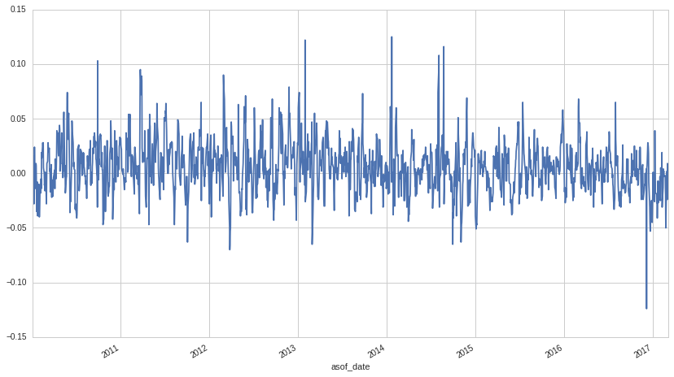

Alpha Vertex: PreCog 100/500 Securities
=======================================

In this notebook, we’ll take a look at the Alpha Vertex *Top 100/500
Securities PreCog* dataset, available on
`Quantopian <https://www.quantopian.com/store>`__. This dataset spans
2010 through the current day. PreCog uses machine learning models to
forecast stock returns at multiple horizons.

The *100* dataset contains 5 day predicted log returns for the top 100
securities by market cap. The *500* dataset contains 5 day predicted log
returns for the top 500 securities by market cap.

Update time: Daily data will be updated close to midnight for the
previous day. So on the 27th, you will have data with an asof_date of
the 26th.

Notebook Contents
-----------------

There are two ways to access the data and you’ll find both of them
listed below. Just click on the section you’d like to read through.

-  Interactive overview: This is only available on Research and uses
   blaze to give you access to large amounts of data. Recommended for
   exploration and plotting.
-  Pipeline overview: Data is made available through pipeline which is
   available in both the Research & Backtesting environments.
   Recommended for factor development and moving back & forth between
   research/backtesting.

Free samples and limits
~~~~~~~~~~~~~~~~~~~~~~~

The result of any expression is limited to 10,000 rows to protect
against runaway memory usage. To be clear, you have access to all the
data server side. We are limiting the size of the responses back from
Blaze.

There is a *free* version of this dataset as well as a paid one. The
free sample includes data until 2 months prior to the current date.

To access the most up-to-date values for this data set for trading a
live algorithm (as with other partner sets), you need to purchase access
to the full set.

Interactive Overview
====================

Accessing the data with Blaze and Interactive on Research
~~~~~~~~~~~~~~~~~~~~~~~~~~~~~~~~~~~~~~~~~~~~~~~~~~~~~~~~~

Partner datasets are available on Quantopian Research through an API
service known as `Blaze <http://blaze.pydata.org>`__. Blaze provides the
Quantopian user with a convenient interface to access very large
datasets, in an interactive, generic manner.

Blaze provides an important function for accessing these datasets. Some
of these sets are many millions of records. Bringing that data directly
into Quantopian Research directly just is not viable. So Blaze allows us
to provide a simple querying interface and shift the burden over to the
server side.

It is common to use Blaze to perform a reduction expression on your
dataset so that you don’t have to pull the whole dataset into memory.
You can convert the result of a blaze expression to a Pandas data
structure (e.g. a
`DataFrame <http://pandas.pydata.org/pandas-docs/stable/generated/pandas.DataFrame.html>`__)
and perform further computation, manipulation, and visualization on that
structure.

Helpful links:

-  `Query building for
   Blaze <http://blaze.readthedocs.io/en/latest/queries.html>`__
-  `Pandas-to-Blaze
   dictionary <http://blaze.readthedocs.io/en/latest/rosetta-pandas.html>`__
-  `SQL-to-Blaze
   dictionary <http://blaze.readthedocs.io/en/latest/rosetta-sql.html>`__.

Once you have a Blaze expression that reduces the dataset to less than
10,000 rows, you can convert it to a Pandas DataFrames using:

   ``from odo import odo`` ``odo(expr, pandas.DataFrame)``

To see how to create a factor using this data, search for the ``Pipeline Overview`` section of this notebook or head straight to Pipeline Overview.
^^^^^^^^^^^^^^^^^^^^^^^^^^^^^^^^^^^^^^^^^^^^^^^^^^^^^^^^^^^^^^^^^^^^^^^^^^^^^^^^^^^^^^^^^^^^^^^^^^^^^^^^^^^^^^^^^^^^^^^^^^^^^^^^^^^^^^^^^^^^^^^^^^^

.. code:: ipython2

    # import the free sample of the dataset
    from quantopian.interactive.data.alpha_vertex import (
        # Top 100 Securities
        precog_top_100 as dataset_100,
        # Top 500 Securities
        precog_top_500 as dataset_500
    )
    
    # import data operations
    from odo import odo
    # import other libraries we will use
    import pandas as pd
    import matplotlib.pyplot as plt

.. code:: ipython2

    # Let's use blaze to understand the data a bit using Blaze dshape()
    dataset_500.asof_date.max()

.. raw:: html

    Timestamp('2017-03-06 00:00:00')

.. code:: ipython2

    # And how many rows are there?
    # N.B. we're using a Blaze function to do this, not len()
    dataset_500.count()

.. raw:: html

    915545

.. code:: ipython2

    # Let's see what the data looks like. We'll grab the first few rows.
    dataset_500.peek()

.. raw:: html

    

    <table border="1" class="dataframe">
      <thead>
        <tr style="text-align: right;">
          <th></th>
          <th>symbol</th>
          <th>name</th>
          <th>sid</th>
          <th>predicted_five_day_log_return</th>
          <th>asof_date</th>
          <th>timestamp</th>
        </tr>
      </thead>
      <tbody>
        <tr>
          <th>0</th>
          <td>AA</td>
          <td>ALCOA INC</td>
          <td>2</td>
          <td>0.064</td>
          <td>2010-01-04</td>
          <td>2010-01-05</td>
        </tr>
        <tr>
          <th>1</th>
          <td>AAPL</td>
          <td>APPLE INC</td>
          <td>24</td>
          <td>0.000</td>
          <td>2010-01-04</td>
          <td>2010-01-05</td>
        </tr>
        <tr>
          <th>2</th>
          <td>ABT</td>
          <td>ABBOTT LABORATORIES</td>
          <td>62</td>
          <td>-0.001</td>
          <td>2010-01-04</td>
          <td>2010-01-05</td>
        </tr>
        <tr>
          <th>3</th>
          <td>ABX</td>
          <td>BARRICK GOLD CORP</td>
          <td>64</td>
          <td>0.013</td>
          <td>2010-01-04</td>
          <td>2010-01-05</td>
        </tr>
        <tr>
          <th>4</th>
          <td>ADSK</td>
          <td>AUTODESK INC</td>
          <td>67</td>
          <td>-0.040</td>
          <td>2010-01-04</td>
          <td>2010-01-05</td>
        </tr>
        <tr>
          <th>5</th>
          <td>TAP</td>
          <td>MOLSON COORS BREWING CO</td>
          <td>76</td>
          <td>0.012</td>
          <td>2010-01-04</td>
          <td>2010-01-05</td>
        </tr>
        <tr>
          <th>6</th>
          <td>ADBE</td>
          <td>ADOBE SYSTEMS INC</td>
          <td>114</td>
          <td>-0.013</td>
          <td>2010-01-04</td>
          <td>2010-01-05</td>
        </tr>
        <tr>
          <th>7</th>
          <td>ADI</td>
          <td>ANALOG DEVICES INC</td>
          <td>122</td>
          <td>-0.023</td>
          <td>2010-01-04</td>
          <td>2010-01-05</td>
        </tr>
        <tr>
          <th>8</th>
          <td>ADM</td>
          <td>ARCHER-DANIELS-MIDLAND CO</td>
          <td>128</td>
          <td>-0.020</td>
          <td>2010-01-04</td>
          <td>2010-01-05</td>
        </tr>
        <tr>
          <th>9</th>
          <td>AEP</td>
          <td>AMERICAN ELECTRIC POWER CO INC</td>
          <td>161</td>
          <td>0.013</td>
          <td>2010-01-04</td>
          <td>2010-01-05</td>
        </tr>
        <tr>
          <th>10</th>
          <td>AES</td>
          <td>AES CORP / VA</td>
          <td>166</td>
          <td>-0.042</td>
          <td>2010-01-04</td>
          <td>2010-01-05</td>
        </tr>
      </tbody>
    </table>
    

Let’s go over the columns:

-  **symbol**: The ticker symbol of the company.
-  **sid**: The security ID (see
   `here <https://www.quantopian.com/tutorials/getting-started#lesson3>`__
   for explanation).
-  **name**: The name of the company.
-  **asof_date**: The date to which this data applies/actual report date
-  **timestamp**: This is our timestamp on when we registered the data.
-  **predicted_five_day_log_return**: The predicted log return for the
   security over the next 5 days

Fields like ``timestamp`` and ``sid`` are standardized across all
Quantopian Store Datasets, so the datasets are easy to combine. The
``sid`` field is also standardized across all Quantopian equity
databases.

Now that we understand the data a bit better, let’s get the
``predicted_five_day_log_return`` data for Apple (sid 24) and visualize
it with a chart.

.. code:: ipython2

    # We start by defining a Blaze expression that gets the rows where symbol == AAPL.
    aapl_data = dataset_500[dataset_500.symbol == 'AAPL']
    
    # We then convert the Blaze expression to a pandas DataFrame, which is populated
    # with the data resulting from our Blaze expression.
    aapl_df = odo(aapl_data, pd.DataFrame)
    
    # Display the first few rows of the DataFrame.
    aapl_df.head()

.. raw:: html

    

    <table border="1" class="dataframe">
      <thead>
        <tr style="text-align: right;">
          <th></th>
          <th>symbol</th>
          <th>name</th>
          <th>sid</th>
          <th>predicted_five_day_log_return</th>
          <th>asof_date</th>
          <th>timestamp</th>
        </tr>
      </thead>
      <tbody>
        <tr>
          <th>0</th>
          <td>AAPL</td>
          <td>APPLE INC</td>
          <td>24</td>
          <td>0.000</td>
          <td>2010-01-04</td>
          <td>2010-01-05</td>
        </tr>
        <tr>
          <th>1</th>
          <td>AAPL</td>
          <td>APPLE INC</td>
          <td>24</td>
          <td>0.003</td>
          <td>2010-01-05</td>
          <td>2010-01-06</td>
        </tr>
        <tr>
          <th>2</th>
          <td>AAPL</td>
          <td>APPLE INC</td>
          <td>24</td>
          <td>0.016</td>
          <td>2010-01-06</td>
          <td>2010-01-07</td>
        </tr>
        <tr>
          <th>3</th>
          <td>AAPL</td>
          <td>APPLE INC</td>
          <td>24</td>
          <td>-0.022</td>
          <td>2010-01-07</td>
          <td>2010-01-08</td>
        </tr>
        <tr>
          <th>4</th>
          <td>AAPL</td>
          <td>APPLE INC</td>
          <td>24</td>
          <td>0.011</td>
          <td>2010-01-08</td>
          <td>2010-01-09</td>
        </tr>
      </tbody>
    </table>
    

.. code:: ipython2

    # For plotting purposes, set the index of the DataFrame to the asof_date.
    aapl_df.set_index('asof_date', inplace=True)

.. code:: ipython2

    # Plot the predicted 5-day log return data.
    aapl_df['predicted_five_day_log_return'].plot()

.. parsed-literal::

    <matplotlib.axes._subplots.AxesSubplot at 0x7f37358e1e10>

Pipeline Overview
=================

`Pipeline <https://www.quantopian.com/tutorials/pipeline>`__ is a tool
that can be used to define computations called factors, filters, or
classifiers. These computations can be used in an algorithm to
dynamically select securities, compute portfolio weights, compute risk
factors, and more.

In research, pipeline is mostly used to explore these computations.

The only method for accessing partner data within an algorithm on
Quantopian is in a pipeline. Before moving to `the
IDE <https://www.quantopian.com/algorithms>`__ to work on an algorithm,
it’s a good idea to define your pipeline in research, so that you can
iterate on an idea and analyze the output.

To start, we need to import the following:

.. code:: ipython2

    from quantopian.pipeline import Pipeline
    from quantopian.research import run_pipeline

To access partner data in pipeline, you must import the dataset. If the
data is in a format that’s difficult to use (e.g. event-based datasets),
the data is sometimes available via built-in factors or filters. There
are no such built-ins for the Alpha Vertex dataset as the prediction
data is in a nice, usable format.

Let’s import the pipeline version of the Alpha Vertex dataset:

.. code:: ipython2

    # These imports can be found in the store panel for each dataset
    # (https://www.quantopian.com/data). Note that not all store datasets
    # can be used in pipeline yet.
    from quantopian.pipeline.data.alpha_vertex import (
        # Top 100 Securities
        precog_top_100 as dataset_100,
        # Top 500 Securities|
        precog_top_500 as dataset_500
    )

Now that we’ve imported the data, let’s take a look at which fields are
available for each dataset, along with their datatypes.

.. code:: ipython2

    print "Here are the list of available fields per dataset:"
    print "---------------------------------------------------\n"
    
    def _print_fields(dataset):
        print "Dataset: %s\n" % dataset.__name__
        print "Fields:"
        for field in list(dataset.columns):
            print "%s - %s" % (field.name, field.dtype)
        print "\n"
    
    _print_fields(dataset_500)
    
    
    print "---------------------------------------------------\n"

.. parsed-literal::

    Here are the list of available fields per dataset:
    ---------------------------------------------------
    
    Dataset: precog_top_500
    
    Fields:
    name - object
    predicted_five_day_log_return - float64
    asof_date - datetime64[ns]
    symbol - object
    
    
    ---------------------------------------------------
    

Now that we know what fields we have access to, let’s define a
`pipeline <https://www.quantopian.com/tutorials/pipeline>`__ that gets
the latest predicted five day log return for the PreCog 500 dataset for
stocks in the
`Q1500US <https://www.quantopian.com/tutorials/pipeline#lesson11>`__.

.. code:: ipython2

    # Import the Q1500US pipeline filter.
    from quantopian.pipeline.filters.morningstar import Q1500US

.. code:: ipython2

    # We only want to get the signal for stocks in the Q1500US that have a non-null
    # latest predicted_five_day_log_return.
    universe = (Q1500US() & dataset_500.predicted_five_day_log_return.latest.notnull())
    
    # Define our pipeline to return the latest prediction for the stocks in `universe`.
    pipe = Pipeline(columns= {
                        'prediction': dataset_500.predicted_five_day_log_return.latest,
                    },
                    screen=universe)
    
    # Run our pipeline (this gets the data).
    pipe_output = run_pipeline(pipe, start_date='2014-01-01', end_date='2017-01-01')

.. code:: ipython2

    # The result is a pandas DataFrame with a MultiIndex.
    pipe_output.head()

.. raw:: html

    

    <table border="1" class="dataframe">
      <thead>
        <tr style="text-align: right;">
          <th></th>
          <th></th>
          <th>prediction</th>
        </tr>
      </thead>
      <tbody>
        <tr>
          <th rowspan="5" valign="top">2014-01-02 00:00:00+00:00</th>
          <th>Equity(2 [ARNC])</th>
          <td>-0.028</td>
        </tr>
        <tr>
          <th>Equity(24 [AAPL])</th>
          <td>-0.014</td>
        </tr>
        <tr>
          <th>Equity(62 [ABT])</th>
          <td>-0.004</td>
        </tr>
        <tr>
          <th>Equity(67 [ADSK])</th>
          <td>0.022</td>
        </tr>
        <tr>
          <th>Equity(76 [TAP])</th>
          <td>0.022</td>
        </tr>
      </tbody>
    </table>
    

.. code:: ipython2

    # Let's see how many securities we have a prediction for each day.
    pipe_output.groupby(pipe_output.index.get_level_values(0)).count().plot()

.. parsed-literal::

    <matplotlib.axes._subplots.AxesSubplot at 0x7f3714fb9f10>

.. image:: notebook_files/notebook_20_1.png

The set of ~500 stocks in the PreCog top 500 is derived from market cap
at the beginning of each year, which we can see above!

Now, you can to try writing an algorithm using this pipeline. The `final
lesson in the Pipeline
Tutorial <https://www.quantopian.com/tutorials/pipeline#lesson12>`__
gives an example of moving from research to the IDE.

There is also an example algorithm using the PreCog 500 that can be
found
`here <https://www.quantopian.com/posts/alpha-vertex-precog-dataset>`__.
