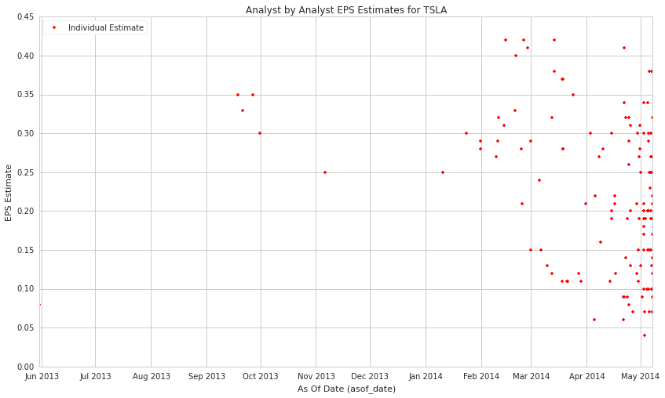

Estimize: Analyst-by-Analyst Estimates
======================================

In this notebook, we’ll take a look at Estimizes’s *Analyst-by-Analyst
Estimates* dataset, available on the
`Quantopian <https://www.quantopian.com/store>`__. This dataset spans
January, 2010 through the current day.

This data contains a record for every estimate made by an individual on
the Estimize product. By comparison, the Estimize Revisions product
provides rolled-up consensus numbers for each possible earnings
announcement.

In this notebook, we’ll examine these detailed estimates and pull in
that consensus data as well.

Blaze
~~~~~

Before we dig into the data, we want to tell you about how you generally
access Quantopian Store data sets. These datasets are available using
the `Blaze <http://blaze.pydata.org>`__ library. Blaze provides the
Quantopian user with a convenient interface to access very large
datasets.

Blaze provides an important function for accessing these datasets. Some
of these sets are many millions of records. Bringing that data directly
into Quantopian Research directly just is not viable. So Blaze allows us
to provide a simple querying interface and shift the burden over to the
server side.

To learn more about using Blaze and generally accessing Quantopian Store
data, clone `this tutorial
notebook <https://www.quantopian.com/clone_notebook?id=561827d21777f45c97000054>`__.

Free samples and limits
~~~~~~~~~~~~~~~~~~~~~~~

A few key caveats:

1) We limit the number of results returned from any given expression to
   10,000 to protect against runaway memory usage. To be clear, you have
   access to all the data server side. We are limiting the size of the
   responses back from Blaze.

2) There is a *free* version of this dataset as well as a paid one. The
   free one includes about three years of historical data, though not up
   to the current day.

With preamble in place, let’s get started:

.. code:: ipython2

    # import the free sample of the dataset
    from quantopian.interactive.data.estimize import estimates_free
    
    # or if you want to import the full dataset, use:
    # from quantopian.interactive.data.estimize import estimates
    
    # import data operations
    from odo import odo
    # import other libraries we will use
    import pandas as pd
    import matplotlib.pyplot as plt

.. code:: ipython2

    # Let's use blaze to understand the data a bit using Blaze dshape()
    estimates_free.dshape

.. parsed-literal::

    dshape("""var * {
      analyst_id: ?string,
      asof_date: datetime,
      eps: ?float64,
      fiscal_quarter: ?float64,
      fiscal_year: ?float64,
      id: ?string,
      revenue: ?float64,
      symbol: ?string,
      username: ?string,
      timestamp: datetime,
      sid: ?int64
      }""")

.. code:: ipython2

    # And how many rows are in this free sample?
    # N.B. we're using a Blaze function to do this, not len()
    estimates_free.count()

.. raw:: html

    120400

.. code:: ipython2

    # Let's see what the data looks like. We'll grab the first three rows.
    estimates_free.head(3)

.. raw:: html

    <table border="1" class="dataframe">
      <thead>
        <tr style="text-align: right;">
          <th></th>
          <th>analyst_id</th>
          <th>asof_date</th>
          <th>eps</th>
          <th>fiscal_quarter</th>
          <th>fiscal_year</th>
          <th>id</th>
          <th>revenue</th>
          <th>symbol</th>
          <th>username</th>
          <th>timestamp</th>
          <th>sid</th>
        </tr>
      </thead>
      <tbody>
        <tr>
          <th>0</th>
          <td>4e679bb77cb02d0b6700000f</td>
          <td>2010-01-02 17:00:00</td>
          <td>0.90</td>
          <td>1</td>
          <td>2011</td>
          <td>4e6dee5a7cb02d2adc000014</td>
          <td>26430</td>
          <td>AAPL</td>
          <td>postsateventide</td>
          <td>2010-01-02 17:20:00</td>
          <td>24</td>
        </tr>
        <tr>
          <th>1</th>
          <td>4e679bb77cb02d0b67000005</td>
          <td>2010-09-28 16:00:00</td>
          <td>0.63</td>
          <td>4</td>
          <td>2010</td>
          <td>4e6df18f7cb02d2adc000024</td>
          <td>19530</td>
          <td>AAPL</td>
          <td>DennisHildebrand</td>
          <td>2010-09-28 16:20:00</td>
          <td>24</td>
        </tr>
        <tr>
          <th>2</th>
          <td>4e679bb87cb02d0b6700001b</td>
          <td>2010-09-28 16:00:00</td>
          <td>0.71</td>
          <td>4</td>
          <td>2010</td>
          <td>4e6df0977cb02d2adc00001f</td>
          <td>20500</td>
          <td>AAPL</td>
          <td>asymco</td>
          <td>2010-09-28 16:20:00</td>
          <td>24</td>
        </tr>
      </tbody>
    </table>

Let’s go over the columns: - **analyst_id**: the unique identifier
assigned by Estimize for the person making the estimate. -
**asof_date**: Estimize’s timestamp of event capture. - **eps**: EPS
estimate made by the analyst on the ``asof_date`` - **fiscal_quarter**:
fiscal quarter for which this estimate is made, related to
``fiscal_year`` - **fiscal_year**: fiscal year for which this estimate
is made, related to ``fiscal_quarter`` - **revenue**: revenue estimate
made by the analyst on the ``asof_date`` - **symbol**: ticker symbol
provided by Estimize for the company for whom these estimates have been
made - **username**: Estimize username of the analyst making this
estimate - **timestamp**: the datetime when Quantopian registered the
data. For data loaded up via initial, historic loads, this timestamp is
an estimate. - **sid**: the equity’s unique identifier. Use this instead
of the symbol. Derived by Quantopian using the symbol and our market
data

We’ve done much of the data processing for you. Fields like
``asof_date`` and ``sid`` are standardized across all our Store
Datasets, so the datasets are easy to combine. We have standardized the
``sid`` across all our equity databases.

We can select columns and rows with ease. Below, let’s just look at the
estimates made for TSLA for a particular quarter. Also, we’re filtering
out some spurious data:

.. code:: ipython2

    stocks = symbols('TSLA')
    one_quarter = estimates_free[(estimates_free.sid == stocks.sid) &
                     (estimates_free.fiscal_year == '2014') &
                     (estimates_free.fiscal_quarter == '1') &
                     (estimates_free.eps < 100)
                    ]
    one_quarter.head(5)

.. raw:: html

    <table border="1" class="dataframe">
      <thead>
        <tr style="text-align: right;">
          <th></th>
          <th>analyst_id</th>
          <th>asof_date</th>
          <th>eps</th>
          <th>fiscal_quarter</th>
          <th>fiscal_year</th>
          <th>id</th>
          <th>revenue</th>
          <th>symbol</th>
          <th>username</th>
          <th>timestamp</th>
          <th>sid</th>
        </tr>
      </thead>
      <tbody>
        <tr>
          <th>0</th>
          <td>500ee59d810f8d1c49000091</td>
          <td>2013-05-30 19:00:13</td>
          <td>0.08</td>
          <td>1</td>
          <td>2014</td>
          <td>51a7a1bd810f8d6e27000362</td>
          <td>500</td>
          <td>TSLA</td>
          <td>hsctiger2009</td>
          <td>2013-05-30 19:20:13</td>
          <td>39840</td>
        </tr>
        <tr>
          <th>1</th>
          <td>4f997632810f8d1aaf0001ec</td>
          <td>2013-09-18 14:11:45</td>
          <td>0.35</td>
          <td>1</td>
          <td>2014</td>
          <td>5239b4a1b7529b033a001ecc</td>
          <td>700</td>
          <td>TSLA</td>
          <td>aarkayne</td>
          <td>2013-09-18 14:31:45</td>
          <td>39840</td>
        </tr>
        <tr>
          <th>2</th>
          <td>500ee59d810f8d1c49000091</td>
          <td>2013-09-20 21:56:58</td>
          <td>0.33</td>
          <td>1</td>
          <td>2014</td>
          <td>523cc4aab7529b009b00b0e1</td>
          <td>620</td>
          <td>TSLA</td>
          <td>hsctiger2009</td>
          <td>2013-09-20 22:16:58</td>
          <td>39840</td>
        </tr>
        <tr>
          <th>3</th>
          <td>500ee59d810f8d1c49000091</td>
          <td>2013-09-26 16:40:26</td>
          <td>0.35</td>
          <td>1</td>
          <td>2014</td>
          <td>5244637ab7529bb85c033499</td>
          <td>620</td>
          <td>TSLA</td>
          <td>hsctiger2009</td>
          <td>2013-09-26 17:00:26</td>
          <td>39840</td>
        </tr>
        <tr>
          <th>4</th>
          <td>524990dfb7529b150a01af9a</td>
          <td>2013-09-30 15:49:41</td>
          <td>0.30</td>
          <td>1</td>
          <td>2014</td>
          <td>52499d95b7529b6c8201d1ef</td>
          <td>590</td>
          <td>TSLA</td>
          <td>wjhughes</td>
          <td>2013-09-30 16:09:41</td>
          <td>39840</td>
        </tr>
      </tbody>
    </table>

How many records do we have now?

.. code:: ipython2

    one_quarter.count()

.. raw:: html

    136

Let’s break it down by user:

.. code:: ipython2

    one_quarter.username.count_values()

.. raw:: html

    <table border="1" class="dataframe">
      <thead>
        <tr style="text-align: right;">
          <th></th>
          <th>username</th>
          <th>count</th>
        </tr>
      </thead>
      <tbody>
        <tr>
          <th>0</th>
          <td>Analyst_7066456</td>
          <td>3</td>
        </tr>
        <tr>
          <th>1</th>
          <td>Cwill</td>
          <td>3</td>
        </tr>
        <tr>
          <th>2</th>
          <td>hsctiger2009</td>
          <td>3</td>
        </tr>
        <tr>
          <th>3</th>
          <td>a76marine</td>
          <td>3</td>
        </tr>
        <tr>
          <th>4</th>
          <td>wjbuckner</td>
          <td>3</td>
        </tr>
        <tr>
          <th>5</th>
          <td>phi16</td>
          <td>3</td>
        </tr>
        <tr>
          <th>6</th>
          <td>Mgspooner</td>
          <td>3</td>
        </tr>
        <tr>
          <th>7</th>
          <td>Essential</td>
          <td>2</td>
        </tr>
        <tr>
          <th>8</th>
          <td>Nils1975</td>
          <td>2</td>
        </tr>
        <tr>
          <th>9</th>
          <td>Cassanova23</td>
          <td>2</td>
        </tr>
        <tr>
          <th>10</th>
          <td>golfinguy224</td>
          <td>2</td>
        </tr>
      </tbody>
    </table>

Let’s convert it over to a Pandas DataFrame so we can chart it and
examine it closer

.. code:: ipython2

    one_q_df = odo(one_quarter.sort('asof_date'), pd.DataFrame)
    plt.plot(one_q_df.asof_date, one_q_df.eps, marker='.', linestyle='None', color='r')
    plt.xlabel("As Of Date (asof_date)")
    plt.ylabel("EPS Estimate")
    plt.title("Analyst by Analyst EPS Estimates for TSLA")
    plt.legend(["Individual Estimate"], loc=2)

.. parsed-literal::

    <matplotlib.legend.Legend at 0x7f6c66b172d0>

That’s neat. But let’s add in some data from another dataset – the
Estimize Revisions data. For the same timeframe, the revisions data
provides each revision to the overall consensus estimates. So where
``estimates_free`` data provides every single estimate made by an
individual on the Estimize site, ``revisions_free`` provides rolled up
summaries of the estimates.

.. code:: ipython2

    from quantopian.interactive.data.estimize import revisions_free
    consensus = revisions_free[(revisions_free.sid == stocks.sid) &
                     (revisions_free.fiscal_year == '2014') &
                     (revisions_free.fiscal_quarter == '1') &
                     (revisions_free.source == 'estimize') &
                     (revisions_free.metric == 'eps')
                    ]

.. code:: ipython2

    consensus.head(3)

.. raw:: html

    <table border="1" class="dataframe">
      <thead>
        <tr style="text-align: right;">
          <th></th>
          <th>count</th>
          <th>high</th>
          <th>low</th>
          <th>mean</th>
          <th>metric</th>
          <th>source</th>
          <th>standard_deviation</th>
          <th>asof_date</th>
          <th>consensus_eps_estimate</th>
          <th>consensus_revenue_estimate</th>
          <th>eps</th>
          <th>fiscal_quarter</th>
          <th>fiscal_year</th>
          <th>id</th>
          <th>name</th>
          <th>release_date</th>
          <th>revenue</th>
          <th>symbol</th>
          <th>wallstreet_eps_estimate</th>
          <th>wallstreet_revenue_estimate</th>
          <th>timestamp</th>
          <th>sid</th>
        </tr>
      </thead>
      <tbody>
        <tr>
          <th>0</th>
          <td>112</td>
          <td>0.42</td>
          <td>0.04</td>
          <td>0.210357</td>
          <td>eps</td>
          <td>estimize</td>
          <td>0.095823</td>
          <td>2014-05-07 19:22:15.904000</td>
          <td>0.210714285714286</td>
          <td>719.256071428571</td>
          <td>0.12</td>
          <td>1</td>
          <td>2014</td>
          <td>510c4310810f8d63ab004f49</td>
          <td>Tesla Motors, Inc.</td>
          <td>2014-05-07 20:00:00</td>
          <td>713.0</td>
          <td>TSLA</td>
          <td>0.08</td>
          <td>693.425</td>
          <td>2014-05-07 19:42:15.904000</td>
          <td>39840</td>
        </tr>
        <tr>
          <th>1</th>
          <td>111</td>
          <td>0.42</td>
          <td>0.04</td>
          <td>0.211622</td>
          <td>eps</td>
          <td>estimize</td>
          <td>0.095319</td>
          <td>2014-05-07 19:08:04.281000</td>
          <td>0.210714285714286</td>
          <td>719.256071428571</td>
          <td>0.12</td>
          <td>1</td>
          <td>2014</td>
          <td>510c4310810f8d63ab004f49</td>
          <td>Tesla Motors, Inc.</td>
          <td>2014-05-07 20:00:00</td>
          <td>713.0</td>
          <td>TSLA</td>
          <td>0.08</td>
          <td>693.425</td>
          <td>2014-05-07 19:28:04.281000</td>
          <td>39840</td>
        </tr>
        <tr>
          <th>2</th>
          <td>110</td>
          <td>0.42</td>
          <td>0.04</td>
          <td>0.212727</td>
          <td>eps</td>
          <td>estimize</td>
          <td>0.095040</td>
          <td>2014-05-07 18:38:08.005000</td>
          <td>0.210714285714286</td>
          <td>719.256071428571</td>
          <td>0.12</td>
          <td>1</td>
          <td>2014</td>
          <td>510c4310810f8d63ab004f49</td>
          <td>Tesla Motors, Inc.</td>
          <td>2014-05-07 20:00:00</td>
          <td>713.0</td>
          <td>TSLA</td>
          <td>0.08</td>
          <td>693.425</td>
          <td>2014-05-07 18:58:08.005000</td>
          <td>39840</td>
        </tr>
      </tbody>
    </table>

For this quick demonstration, let’s just grab the consensus mean from
the ``revisions_free`` data set and convert it over to Pandas. Note, we
need to rename the ``mean`` column name because it causes problems
otherwise:

.. code:: ipython2

    consensus_df = odo(consensus[['asof_date', 'mean']].sort('asof_date'), pd.DataFrame)
    consensus_df.rename(columns={'mean':'eps_mean'}, inplace=True)

Let’s chart that in the same chart again so we get a trend of the mean
over time, overlayed on a chart of each individual analyst estimate:

.. code:: ipython2

    plt.plot(consensus_df.asof_date, consensus_df.eps_mean)
    plt.plot(one_q_df.asof_date, one_q_df.eps, marker='.', linestyle='None', color='r')
    plt.xlabel("As Of Date (asof_date)")
    plt.ylabel("EPS Estimate")
    plt.title("EPS Estimates for TSLA")
    plt.legend(["Mean Estimate", "Individual Estimates"], loc=2)

.. parsed-literal::

    <matplotlib.legend.Legend at 0x7f6c66ba1dd0>

.. image:: notebook_files/notebook_20_1.png

