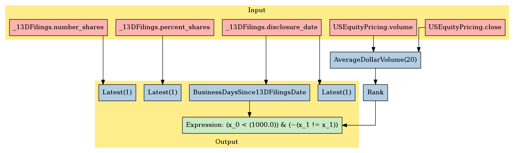

EventVestor: 13D Filings
========================

In this notebook, we’ll take a look at EventVestor’s *13D Filings*
dataset, available on the `Quantopian
Store <https://www.quantopian.com/store>`__. This dataset spans January
01, 2007 through the current day, and documents 13D filings with the SEC
by activist shareholders disclosing a beneficial ownership of 5% or
more.

Notebook Contents
-----------------

There are two ways to access the data and you’ll find both of them
listed below. Just click on the section you’d like to read through.

-  Interactive overview: This is only available on Research and uses
   blaze to give you access to large amounts of data. Recommended for
   exploration and plotting.
-  Pipeline overview: Data is made available through pipeline which is
   available on both the Research & Backtesting environment. Recommended
   for custom factor development and moving back & forth between
   research/backtesting.

Free samples and limits
~~~~~~~~~~~~~~~~~~~~~~~

One key caveat: we limit the number of results returned from any given
expression to 10,000 to protect against runaway memory usage. To be
clear, you have access to all the data server side. We are limiting the
size of the responses back from Blaze.

There is a *free* version of this dataset as well as a paid one. The
free sample includes data until 2 months prior to the current date.

To access the most up-to-date values for this data set for trading a
live algorithm (as with other partner sets), you need to purchase acess
to the full set.

With preamble in place, let’s get started:

#Interactive Overview ### Accessing the data with Blaze and Interactive
on Research Partner datasets are available on Quantopian Research
through an API service known as `Blaze <http://blaze.pydata.org>`__.
Blaze provides the Quantopian user with a convenient interface to access
very large datasets, in an interactive, generic manner.

Blaze provides an important function for accessing these datasets. Some
of these sets are many millions of records. Bringing that data directly
into Quantopian Research directly just is not viable. So Blaze allows us
to provide a simple querying interface and shift the burden over to the
server side.

It is common to use Blaze to reduce your dataset in size, convert it
over to Pandas and then to use Pandas for further computation,
manipulation and visualization.

Helpful links: \* `Query building for
Blaze <http://blaze.readthedocs.io/en/latest/queries.html>`__ \*
`Pandas-to-Blaze
dictionary <http://blaze.readthedocs.io/en/latest/rosetta-pandas.html>`__
\* `SQL-to-Blaze
dictionary <http://blaze.readthedocs.io/en/latest/rosetta-sql.html>`__.

| Once you’ve limited the size of your Blaze object, you can convert it
  to a Pandas DataFrames using: > ``from odo import odo``
| > ``odo(expr, pandas.DataFrame)``

###To see how this data can be used in your algorithm, search for the
``Pipeline Overview`` section of this notebook or head straight to
Pipeline Overview

.. code:: ipython2

    # import the dataset
    # from quantopian.interactive.data.eventvestor import _13d_filings as dataset
    # or if you want to import the free dataset, use:
    from quantopian.interactive.data.eventvestor import _13d_filings_free as dataset
    
    # import data operations
    from odo import odo
    # import other libraries we will use
    import pandas as pd

.. code:: ipython2

    # Let's use blaze to understand the data a bit using Blaze dshape()
    dataset.dshape

.. parsed-literal::

    dshape("""var * {
      event_id: ?float64,
      asof_date: datetime,
      trade_date: ?datetime,
      symbol: ?string,
      event_type: ?string,
      event_headline: ?string,
      percent_shares: ?float64,
      number_shares: ?float64,
      acquiring_entity: ?string,
      event_rating: ?float64,
      timestamp: datetime,
      sid: ?int64
      }""")

.. code:: ipython2

    # And how many rows are there?
    # N.B. we're using a Blaze function to do this, not len()
    dataset.count()

.. raw:: html

    1960

.. code:: ipython2

    # Let's see what the data looks like. We'll grab the first three rows.
    dataset[:3]

.. raw:: html

    <table border="1" class="dataframe">
      <thead>
        <tr style="text-align: right;">
          <th></th>
          <th>event_id</th>
          <th>asof_date</th>
          <th>trade_date</th>
          <th>symbol</th>
          <th>event_type</th>
          <th>event_headline</th>
          <th>percent_shares</th>
          <th>number_shares</th>
          <th>acquiring_entity</th>
          <th>event_rating</th>
          <th>timestamp</th>
          <th>sid</th>
        </tr>
      </thead>
      <tbody>
        <tr>
          <th>0</th>
          <td>60996</td>
          <td>2007-08-21</td>
          <td>2007-08-21</td>
          <td>GGP</td>
          <td>13D Issuer</td>
          <td>General Trust Co. Discloses 23.9% Stake in Gen...</td>
          <td>23.90</td>
          <td>69644773</td>
          <td>General Trust Company</td>
          <td>1</td>
          <td>2007-08-22</td>
          <td>8817</td>
        </tr>
        <tr>
          <th>1</th>
          <td>60998</td>
          <td>2007-08-24</td>
          <td>2007-08-24</td>
          <td>JNC</td>
          <td>13D Issuer</td>
          <td>UBS Discloses 6.3% stake in Nuveen Investments</td>
          <td>6.30</td>
          <td>5031458</td>
          <td>UBS</td>
          <td>1</td>
          <td>2007-08-25</td>
          <td>4150</td>
        </tr>
        <tr>
          <th>2</th>
          <td>61003</td>
          <td>2007-08-30</td>
          <td>2007-08-30</td>
          <td>PDE</td>
          <td>13D Issuer</td>
          <td>SKAGEN Funds discloses 9.03% Stake in Pride In...</td>
          <td>9.03</td>
          <td>15053900</td>
          <td>SKAGEN Funds</td>
          <td>1</td>
          <td>2007-08-31</td>
          <td>6151</td>
        </tr>
      </tbody>
    </table>

Let’s go over the columns: - **event_id**: the unique identifier for
this event. - **asof_date**: EventVestor’s timestamp of event capture. -
**trade_date**: for event announcements made before trading ends,
trade_date is the same as event_date. For announcements issued after
market close, trade_date is next market open day. - **symbol**: stock
ticker symbol of the affected company. - **event_type**: this should
always be *13D Issuer*. - **event_headline**: a brief description of the
event - **percent_shares**: the percent of shares owned by the investor
as per the 13D - **number_shares**: the number of shares owned by the
investor as per the 13D. Note: these shares are not split-adjusted in
the way that the rest of our equity data is. We suggest using
``percent_shares`` with ``market cap`` (from Fundamentals) to get the
total value of shares owned, and dividing by the ``close_price`` (from
price data) to get the number of shares. - **acquiring_entity**: the
investor filing the 13D - **event_rating**: this is always 1. The
meaning of this is uncertain. - **timestamp**: this is our timestamp on
when we registered the data. - **sid**: the equity’s unique identifier.
Use this instead of the symbol. Note: this sid represents the company
the shares of which are being purchased, not the acquiring entity.

We’ve done much of the data processing for you. Fields like
``timestamp`` and ``sid`` are standardized across all our Store
Datasets, so the datasets are easy to combine. We have standardized the
``sid`` across all our equity databases.

We can select columns and rows with ease. Below, we’ll fetch all 13D
filings by Carl Icahn.

.. code:: ipython2

    # first we find how Icahn is represented exactly in the `acquiring_entity` column
    icahns = set(filter(lambda x: "Icahn" in x, dataset.acquiring_entity))
    icahns

.. parsed-literal::

    {u'Carl  C.  Icahn',
     u'Carl C. Icahn',
     u'Carl C. Icahn ',
     u'Carl Icahn',
     u'Icahn Group'}

.. code:: ipython2

    # Since Carl Icahn is represented in several ways, we use `like` to capture all those ways
    names = dataset[dataset.acquiring_entity.like("*Icahn*")]  
    # now let's filter down to the percentage of shares, timestamp, and sid  
    names = names[['timestamp', 'percent_shares', 'sid', 'acquiring_entity']]  
    # # When displaying a Blaze Data Object, the printout is automatically truncated to ten rows.  
    names.sort('timestamp')

.. raw:: html

    <table border="1" class="dataframe">
      <thead>
        <tr style="text-align: right;">
          <th></th>
          <th>timestamp</th>
          <th>percent_shares</th>
          <th>sid</th>
          <th>acquiring_entity</th>
        </tr>
      </thead>
      <tbody>
        <tr>
          <th>0</th>
          <td>2008-05-23</td>
          <td>6.54</td>
          <td>374</td>
          <td>Icahn Group</td>
        </tr>
        <tr>
          <th>1</th>
          <td>2008-08-12</td>
          <td>6.03</td>
          <td>3806</td>
          <td>Carl C. Icahn</td>
        </tr>
        <tr>
          <th>2</th>
          <td>2009-12-18</td>
          <td>11.28</td>
          <td>16820</td>
          <td>Carl C. Icahn</td>
        </tr>
        <tr>
          <th>3</th>
          <td>2010-05-14</td>
          <td>11.92</td>
          <td>10649</td>
          <td>Carl C. Icahn</td>
        </tr>
        <tr>
          <th>4</th>
          <td>2010-05-28</td>
          <td>6.86</td>
          <td>4794</td>
          <td>Carl C. Icahn</td>
        </tr>
        <tr>
          <th>5</th>
          <td>2010-06-09</td>
          <td>9.67</td>
          <td>23311</td>
          <td>Carl C. Icahn</td>
        </tr>
        <tr>
          <th>6</th>
          <td>2010-12-18</td>
          <td>5.80</td>
          <td>8461</td>
          <td>Carl C. Icahn</td>
        </tr>
        <tr>
          <th>7</th>
          <td>2011-02-12</td>
          <td>9.08</td>
          <td>1616</td>
          <td>Carl C. Icahn</td>
        </tr>
        <tr>
          <th>8</th>
          <td>2011-06-18</td>
          <td>6.95</td>
          <td>3014</td>
          <td>Carl C. Icahn</td>
        </tr>
        <tr>
          <th>9</th>
          <td>2011-07-01</td>
          <td>9.51</td>
          <td>5719</td>
          <td>Carl C. Icahn</td>
        </tr>
        <tr>
          <th>10</th>
          <td>2011-07-29</td>
          <td>9.98</td>
          <td>1636</td>
          <td>Carl  C.  Icahn</td>
        </tr>
      </tbody>
    </table>

Finally, suppose we want a DataFrame of all 13D Filings in June 2013:

.. code:: ipython2

    # we can call odo on the entire dataset
    filings_df = odo(dataset, pd.DataFrame)
    june = filings_df[(filings_df.timestamp < '2013-07-01') & ('2013-05-31'< filings_df.timestamp)]
    june

.. raw:: html

    

    <table border="1" class="dataframe">
      <thead>
        <tr style="text-align: right;">
          <th></th>
          <th>event_id</th>
          <th>asof_date</th>
          <th>trade_date</th>
          <th>symbol</th>
          <th>event_type</th>
          <th>event_headline</th>
          <th>percent_shares</th>
          <th>number_shares</th>
          <th>acquiring_entity</th>
          <th>event_rating</th>
          <th>timestamp</th>
          <th>sid</th>
        </tr>
      </thead>
      <tbody>
        <tr>
          <th>1740</th>
          <td>1593869</td>
          <td>2013-06-07</td>
          <td>2013-06-07</td>
          <td>STEI</td>
          <td>13D Issuer</td>
          <td>President and Fellows of Harvard College Discl...</td>
          <td>6.17</td>
          <td>5049950</td>
          <td>President and Fellows of Harvard College</td>
          <td>1</td>
          <td>2013-06-08</td>
          <td>7146</td>
        </tr>
        <tr>
          <th>1741</th>
          <td>1594348</td>
          <td>2013-06-10</td>
          <td>2013-06-10</td>
          <td>BAXS</td>
          <td>13D Issuer</td>
          <td>James M. Shapiro Discloses 6.9% Stake in Baxan...</td>
          <td>6.90</td>
          <td>3111419</td>
          <td>James M. Shapiro</td>
          <td>1</td>
          <td>2013-06-11</td>
          <td>34871</td>
        </tr>
        <tr>
          <th>1742</th>
          <td>1594365</td>
          <td>2013-06-10</td>
          <td>2013-06-11</td>
          <td>BAXS</td>
          <td>13D Issuer</td>
          <td>David Schnell Discloses 11.8% Stake in Baxano ...</td>
          <td>11.80</td>
          <td>5340616</td>
          <td>David Schnell</td>
          <td>1</td>
          <td>2013-06-11</td>
          <td>34871</td>
        </tr>
        <tr>
          <th>1743</th>
          <td>1594789</td>
          <td>2013-06-10</td>
          <td>2013-06-11</td>
          <td>BAXS</td>
          <td>13D Issuer</td>
          <td>Wilfred E. Jaeger Discloses 8.2% Stake in Baxa...</td>
          <td>8.20</td>
          <td>3687896</td>
          <td>Wilfred E. Jaeger</td>
          <td>1</td>
          <td>2013-06-11</td>
          <td>34871</td>
        </tr>
        <tr>
          <th>1744</th>
          <td>1594802</td>
          <td>2013-06-12</td>
          <td>2013-06-12</td>
          <td>ASI</td>
          <td>13D Issuer</td>
          <td>V. Prem Watsa Discloses 12.6% Stake in America...</td>
          <td>12.60</td>
          <td>1236214</td>
          <td>V. Prem Watsa</td>
          <td>1</td>
          <td>2013-06-13</td>
          <td>18233</td>
        </tr>
        <tr>
          <th>1745</th>
          <td>1595162</td>
          <td>2013-06-17</td>
          <td>2013-06-17</td>
          <td>SFD</td>
          <td>13D Issuer</td>
          <td>Jeffrey C. Smith Discloses 5.7% Stake in Smith...</td>
          <td>5.70</td>
          <td>7962300</td>
          <td>Jeffrey C. Smith</td>
          <td>1</td>
          <td>2013-06-18</td>
          <td>6803</td>
        </tr>
        <tr>
          <th>1746</th>
          <td>1595164</td>
          <td>2013-06-17</td>
          <td>2013-06-17</td>
          <td>AYR</td>
          <td>13D Issuer</td>
          <td>Marubeni Corporation Discloses 15.25% Stake in...</td>
          <td>15.25</td>
          <td>12320000</td>
          <td>Marubeni Corporation</td>
          <td>1</td>
          <td>2013-06-18</td>
          <td>32475</td>
        </tr>
        <tr>
          <th>1747</th>
          <td>1595165</td>
          <td>2013-06-17</td>
          <td>2013-06-18</td>
          <td>CCBG</td>
          <td>13D Issuer</td>
          <td>Douglas W. Smith &amp; E. Drew Mitchell Discloses ...</td>
          <td>11.60</td>
          <td>2011989</td>
          <td>Douglas W. Smith &amp; E. Drew Mitchell</td>
          <td>1</td>
          <td>2013-06-18</td>
          <td>16448</td>
        </tr>
        <tr>
          <th>1748</th>
          <td>1595166</td>
          <td>2013-06-17</td>
          <td>2013-06-18</td>
          <td>THI</td>
          <td>13D Issuer</td>
          <td>Adam Weiss Discloses 5.5% Stake in Tim Hortons</td>
          <td>5.50</td>
          <td>8400000</td>
          <td>Adam Weiss</td>
          <td>1</td>
          <td>2013-06-18</td>
          <td>28231</td>
        </tr>
        <tr>
          <th>1749</th>
          <td>1595180</td>
          <td>2013-06-18</td>
          <td>2013-06-19</td>
          <td>BLC</td>
          <td>13D Issuer</td>
          <td>Gannett Co. Discloses 10.2% Series A Stake in ...</td>
          <td>10.20</td>
          <td>10734097</td>
          <td>GCI</td>
          <td>1</td>
          <td>2013-06-19</td>
          <td>931</td>
        </tr>
        <tr>
          <th>1750</th>
          <td>1595201</td>
          <td>2013-06-18</td>
          <td>2013-06-19</td>
          <td>CYTK</td>
          <td>13D Issuer</td>
          <td>Amgen Discloses 7.58% Stake in Cytokinetics</td>
          <td>7.58</td>
          <td>11909406</td>
          <td>AMGN</td>
          <td>1</td>
          <td>2013-06-19</td>
          <td>26232</td>
        </tr>
        <tr>
          <th>1751</th>
          <td>1595216</td>
          <td>2013-06-19</td>
          <td>2013-06-19</td>
          <td>PLUG</td>
          <td>13D Issuer</td>
          <td>Hans P. Black Discloses 9.72% Stake in Plug Power</td>
          <td>9.72</td>
          <td>7839000</td>
          <td>Hans P. Black</td>
          <td>1</td>
          <td>2013-06-20</td>
          <td>20776</td>
        </tr>
        <tr>
          <th>1752</th>
          <td>1596045</td>
          <td>2013-06-21</td>
          <td>2013-06-21</td>
          <td>EVBS</td>
          <td>13D Issuer</td>
          <td>Castle Creek Capital Partners IV Discloses 9.9...</td>
          <td>9.90</td>
          <td>1061225</td>
          <td>Castle Creek Capital Partners IV, LP</td>
          <td>1</td>
          <td>2013-06-22</td>
          <td>18155</td>
        </tr>
        <tr>
          <th>1753</th>
          <td>1596343</td>
          <td>2013-06-24</td>
          <td>2013-06-25</td>
          <td>BLC</td>
          <td>13D Issuer</td>
          <td>Dunia A. Shive Discloses 5.7% Stake in Belo Corp.</td>
          <td>5.70</td>
          <td>550900</td>
          <td>Dunia A. Shive</td>
          <td>1</td>
          <td>2013-06-25</td>
          <td>931</td>
        </tr>
        <tr>
          <th>1754</th>
          <td>1596589</td>
          <td>2013-06-25</td>
          <td>2013-06-25</td>
          <td>PRKR</td>
          <td>13D Issuer</td>
          <td>Daniel M. Lewis Discloses 7.7% Stake in Parker...</td>
          <td>7.70</td>
          <td>6782862</td>
          <td>Daniel M. Lewis</td>
          <td>1</td>
          <td>2013-06-26</td>
          <td>10485</td>
        </tr>
      </tbody>
    </table>
    

#Pipeline Overview

Accessing the data in your algorithms & research
~~~~~~~~~~~~~~~~~~~~~~~~~~~~~~~~~~~~~~~~~~~~~~~~

The only method for accessing partner data within algorithms running on
Quantopian is via the pipeline API. Different data sets work differently
but in the case of this data, you can add this data to your pipeline as
follows:

Import the data set here >
``from quantopian.pipeline.data.eventvestor import _13DFilings``

Then in intialize() you could do something simple like adding the raw
value of one of the fields to your pipeline: >
``pipe.add(_13DFilings.disclosure_date.latest, 'disclosure_date')``

Pipeline usage is very similar between the backtester and Research so
let’s go over how to import this data through pipeline and view its
outputs.

.. code:: ipython2

    # Import necessary Pipeline modules
    from quantopian.pipeline import Pipeline
    from quantopian.research import run_pipeline
    from quantopian.pipeline.factors import AverageDollarVolume

.. code:: ipython2

    # Import the datasets available
    from quantopian.pipeline.data.eventvestor import _13DFilings
    
    # Builtin Factors for easy access
    from quantopian.pipeline.factors.eventvestor import BusinessDaysSince13DFilingsDate

Now that we’ve imported the data, let’s take a look at which fields are
available for each dataset.

You’ll find the dataset, the available fields, and the datatypes for
each of those fields.

.. code:: ipython2

    print "Here are the list of available fields per dataset:"
    print "---------------------------------------------------\n"
    
    def _print_fields(dataset):
        print "Dataset: %s\n" % dataset.__name__
        print "Fields:"
        for field in list(dataset.columns):
            print "%s - %s" % (field.name, field.dtype)
        print "\n"
    
    _print_fields(_13DFilings)
    
    
    print "---------------------------------------------------\n"

.. parsed-literal::

    Here are the list of available fields per dataset:
    ---------------------------------------------------
    
    Dataset: _13DFilings
    
    Fields:
    disclosure_date - datetime64[ns]
    percent_shares - float64
    number_shares - float64
    
    
    ---------------------------------------------------
    

Now that we know what fields we have access to, let’s see what this data
looks like when we run it through Pipeline.

This is constructed the same way as you would in the backtester. For
more information on using Pipeline in Research view this thread:
https://www.quantopian.com/posts/pipeline-in-research-build-test-and-visualize-your-factors-and-filters

.. code:: ipython2

    pipe = Pipeline()
           
    pipe.add(_13DFilings.disclosure_date.latest, "last_disclosure_date")
    pipe.add(_13DFilings.percent_shares.latest, "percent_shares")
    pipe.add(_13DFilings.number_shares.latest, "number_shares")
    pipe.add(BusinessDaysSince13DFilingsDate(), "business_days_since_last_filing")

.. code:: ipython2

    # Setting some basic liquidity strings (just for good habit)
    dollar_volume = AverageDollarVolume(window_length=20)
    top_1000_most_liquid = dollar_volume.rank(ascending=False) < 1000
    
    pipe.set_screen(top_1000_most_liquid & BusinessDaysSince13DFilingsDate().notnan())

.. code:: ipython2

    # The show_graph() method of pipeline objects produces a graph to show how it is being calculated.
    pipe.show_graph(format='png')

.. code:: ipython2

    # run_pipeline will show the output of your pipeline
    pipe_output = run_pipeline(pipe, start_date='2013-11-01', end_date='2013-11-25')
    pipe_output

.. raw:: html

    

    <table border="1" class="dataframe">
      <thead>
        <tr style="text-align: right;">
          <th></th>
          <th></th>
          <th>business_days_since_last_filing</th>
          <th>last_disclosure_date</th>
          <th>number_shares</th>
          <th>percent_shares</th>
        </tr>
      </thead>
      <tbody>
        <tr>
          <th rowspan="30" valign="top">2013-11-01 00:00:00+00:00</th>
          <th>Equity(717 [BAMM])</th>
          <td>425</td>
          <td>2012-03-16</td>
          <td>8490139</td>
          <td>53.200</td>
        </tr>
        <tr>
          <th>Equity(2389 [COBR])</th>
          <td>1036</td>
          <td>2009-11-12</td>
          <td>377947</td>
          <td>5.800</td>
        </tr>
        <tr>
          <th>Equity(2508 [ELSE])</th>
          <td>1020</td>
          <td>2009-12-04</td>
          <td>181805</td>
          <td>5.390</td>
        </tr>
        <tr>
          <th>Equity(2586 [EQS])</th>
          <td>1064</td>
          <td>2009-10-05</td>
          <td>737569</td>
          <td>8.320</td>
        </tr>
        <tr>
          <th>Equity(2902 [STRS])</th>
          <td>472</td>
          <td>2012-01-11</td>
          <td>1405000</td>
          <td>18.900</td>
        </tr>
        <tr>
          <th>Equity(3536 [HFFC])</th>
          <td>1027</td>
          <td>2009-11-25</td>
          <td>645000</td>
          <td>9.860</td>
        </tr>
        <tr>
          <th>Equity(3778 [ICCC])</th>
          <td>1239</td>
          <td>2009-02-02</td>
          <td>189111</td>
          <td>6.300</td>
        </tr>
        <tr>
          <th>Equity(3947 [INS])</th>
          <td>1114</td>
          <td>2009-07-27</td>
          <td>2042800</td>
          <td>22.700</td>
        </tr>
        <tr>
          <th>Equity(4153 [JOB])</th>
          <td>1121</td>
          <td>2009-07-16</td>
          <td>9735287</td>
          <td>65.300</td>
        </tr>
        <tr>
          <th>Equity(4292 [KOSS])</th>
          <td>13</td>
          <td>2013-10-15</td>
          <td>2214476</td>
          <td>30.000</td>
        </tr>
        <tr>
          <th>Equity(4351 [LAKE])</th>
          <td>1443</td>
          <td>2008-04-22</td>
          <td>395661</td>
          <td>7.270</td>
        </tr>
        <tr>
          <th>Equity(5281 [NEN])</th>
          <td>1055</td>
          <td>2009-10-16</td>
          <td>220000</td>
          <td>20.780</td>
        </tr>
        <tr>
          <th>Equity(5928 [PFIN])</th>
          <td>1075</td>
          <td>2009-09-18</td>
          <td>258209</td>
          <td>7.100</td>
        </tr>
        <tr>
          <th>Equity(6270 [PWX])</th>
          <td>1136</td>
          <td>2009-06-25</td>
          <td>253400</td>
          <td>5.270</td>
        </tr>
        <tr>
          <th>Equity(6593 [KID])</th>
          <td>521</td>
          <td>2011-11-03</td>
          <td>1102796</td>
          <td>5.090</td>
        </tr>
        <tr>
          <th>Equity(7317 [TBAC])</th>
          <td>1332</td>
          <td>2008-09-24</td>
          <td>597524</td>
          <td>8.500</td>
        </tr>
        <tr>
          <th>Equity(7510 [PULS])</th>
          <td>366</td>
          <td>2012-06-07</td>
          <td>2124860</td>
          <td>5.000</td>
        </tr>
        <tr>
          <th>Equity(7975 [VIRC])</th>
          <td>1260</td>
          <td>2009-01-02</td>
          <td>780300</td>
          <td>5.410</td>
        </tr>
        <tr>
          <th>Equity(9014 [NTZ])</th>
          <td>1441</td>
          <td>2008-04-24</td>
          <td>29358089</td>
          <td>53.500</td>
        </tr>
        <tr>
          <th>Equity(9400 [KTEC])</th>
          <td>1039</td>
          <td>2009-11-09</td>
          <td>254242</td>
          <td>5.100</td>
        </tr>
        <tr>
          <th>Equity(10314 [WVFC])</th>
          <td>1098</td>
          <td>2009-08-18</td>
          <td>111190</td>
          <td>5.300</td>
        </tr>
        <tr>
          <th>Equity(10833 [RGCO])</th>
          <td>864</td>
          <td>2010-07-12</td>
          <td>117236</td>
          <td>5.200</td>
        </tr>
        <tr>
          <th>Equity(11695 [THRD])</th>
          <td>242</td>
          <td>2012-11-28</td>
          <td>143894</td>
          <td>5.100</td>
        </tr>
        <tr>
          <th>Equity(11823 [PNBK])</th>
          <td>1200</td>
          <td>2009-03-27</td>
          <td>473100</td>
          <td>9.970</td>
        </tr>
        <tr>
          <th>Equity(12667 [ALLB])</th>
          <td>1212</td>
          <td>2009-03-11</td>
          <td>360475</td>
          <td>5.200</td>
        </tr>
        <tr>
          <th>Equity(13156 [ATEA])</th>
          <td>1346</td>
          <td>2008-09-04</td>
          <td>215500</td>
          <td>6.000</td>
        </tr>
        <tr>
          <th>Equity(13207 [GVP])</th>
          <td>427</td>
          <td>2012-03-14</td>
          <td>1716525</td>
          <td>9.400</td>
        </tr>
        <tr>
          <th>Equity(14098 [LTRE])</th>
          <td>264</td>
          <td>2012-10-29</td>
          <td>793771</td>
          <td>6.000</td>
        </tr>
        <tr>
          <th>Equity(14410 [OVBC])</th>
          <td>168</td>
          <td>2013-03-12</td>
          <td>289623</td>
          <td>7.100</td>
        </tr>
        <tr>
          <th>Equity(14996 [PFBI])</th>
          <td>1397</td>
          <td>2008-06-25</td>
          <td>506095</td>
          <td>7.920</td>
        </tr>
        <tr>
          <th>...</th>
          <th>...</th>
          <td>...</td>
          <td>...</td>
          <td>...</td>
          <td>...</td>
        </tr>
        <tr>
          <th rowspan="30" valign="top">2013-11-25 00:00:00+00:00</th>
          <th>Equity(11823 [PNBK])</th>
          <td>1216</td>
          <td>2009-03-27</td>
          <td>473100</td>
          <td>9.970</td>
        </tr>
        <tr>
          <th>Equity(13156 [ATEA])</th>
          <td>1362</td>
          <td>2008-09-04</td>
          <td>215500</td>
          <td>6.000</td>
        </tr>
        <tr>
          <th>Equity(14410 [OVBC])</th>
          <td>184</td>
          <td>2013-03-12</td>
          <td>289623</td>
          <td>7.100</td>
        </tr>
        <tr>
          <th>Equity(15133 [FRBK])</th>
          <td>1416</td>
          <td>2008-06-20</td>
          <td>923077</td>
          <td>7.800</td>
        </tr>
        <tr>
          <th>Equity(15703 [PRLS])</th>
          <td>1189</td>
          <td>2009-05-05</td>
          <td>3599320</td>
          <td>21.300</td>
        </tr>
        <tr>
          <th>Equity(16176 [CASM])</th>
          <td>1385</td>
          <td>2008-08-04</td>
          <td>2212449</td>
          <td>20.220</td>
        </tr>
        <tr>
          <th>Equity(16420 [UNTY])</th>
          <td>1422</td>
          <td>2008-06-12</td>
          <td>357551</td>
          <td>5.000</td>
        </tr>
        <tr>
          <th>Equity(17281 [PRPH])</th>
          <td>311</td>
          <td>2012-09-14</td>
          <td>1453427</td>
          <td>9.800</td>
        </tr>
        <tr>
          <th>Equity(17810 [BASI])</th>
          <td>1210</td>
          <td>2009-04-06</td>
          <td>1275967</td>
          <td>26.000</td>
        </tr>
        <tr>
          <th>Equity(19588 [CFBK])</th>
          <td>1027</td>
          <td>2009-12-17</td>
          <td>366701</td>
          <td>8.900</td>
        </tr>
        <tr>
          <th>Equity(20767 [ORBT])</th>
          <td>1109</td>
          <td>2009-08-25</td>
          <td>515198</td>
          <td>11.080</td>
        </tr>
        <tr>
          <th>Equity(20791 [SBSA])</th>
          <td>286</td>
          <td>2012-10-19</td>
          <td>386879</td>
          <td>9.284</td>
        </tr>
        <tr>
          <th>Equity(20847 [CTIB])</th>
          <td>1244</td>
          <td>2009-02-17</td>
          <td>582140</td>
          <td>20.730</td>
        </tr>
        <tr>
          <th>Equity(20974 [FBSS])</th>
          <td>1209</td>
          <td>2009-04-07</td>
          <td>116237</td>
          <td>3.200</td>
        </tr>
        <tr>
          <th>Equity(20987 [HPOL])</th>
          <td>1145</td>
          <td>2009-07-06</td>
          <td>3428861</td>
          <td>6.400</td>
        </tr>
        <tr>
          <th>Equity(21566 [TORM])</th>
          <td>1140</td>
          <td>2009-07-13</td>
          <td>1549200</td>
          <td>15.200</td>
        </tr>
        <tr>
          <th>Equity(21850 [ARL])</th>
          <td>1223</td>
          <td>2009-03-18</td>
          <td>579958</td>
          <td>5.160</td>
        </tr>
        <tr>
          <th>Equity(21903 [LTRX])</th>
          <td>1309</td>
          <td>2008-11-18</td>
          <td>22252663</td>
          <td>36.800</td>
        </tr>
        <tr>
          <th>Equity(26914 [OSHC])</th>
          <td>149</td>
          <td>2013-04-30</td>
          <td>486508</td>
          <td>7.000</td>
        </tr>
        <tr>
          <th>Equity(26990 [SMMF])</th>
          <td>489</td>
          <td>2012-01-10</td>
          <td>516540</td>
          <td>6.730</td>
        </tr>
        <tr>
          <th>Equity(27605 [XTLB])</th>
          <td>1397</td>
          <td>2008-07-17</td>
          <td>58618420</td>
          <td>20.030</td>
        </tr>
        <tr>
          <th>Equity(27701 [PTEK])</th>
          <td>1026</td>
          <td>2009-12-18</td>
          <td>1289576</td>
          <td>9.200</td>
        </tr>
        <tr>
          <th>Equity(28829 [CXM])</th>
          <td>322</td>
          <td>2012-08-30</td>
          <td>10304401</td>
          <td>8.610</td>
        </tr>
        <tr>
          <th>Equity(29087 [CZFC])</th>
          <td>1072</td>
          <td>2009-10-15</td>
          <td>397661</td>
          <td>19.700</td>
        </tr>
        <tr>
          <th>Equity(31229 [VSBN])</th>
          <td>1217</td>
          <td>2009-03-26</td>
          <td>94683</td>
          <td>5.080</td>
        </tr>
        <tr>
          <th>Equity(32347 [NECB])</th>
          <td>795</td>
          <td>2010-11-08</td>
          <td>715193</td>
          <td>5.410</td>
        </tr>
        <tr>
          <th>Equity(32624 [PBIB])</th>
          <td>880</td>
          <td>2010-07-12</td>
          <td>1069703</td>
          <td>9.900</td>
        </tr>
        <tr>
          <th>Equity(32818 [SONA])</th>
          <td>1057</td>
          <td>2009-11-05</td>
          <td>1000000</td>
          <td>8.600</td>
        </tr>
        <tr>
          <th>Equity(34191 [LABC])</th>
          <td>170</td>
          <td>2013-04-01</td>
          <td>272603</td>
          <td>9.000</td>
        </tr>
        <tr>
          <th>Equity(36240 [VRS])</th>
          <td>726</td>
          <td>2011-02-11</td>
          <td>2623467</td>
          <td>5.000</td>
        </tr>
      </tbody>
    </table>
    
973 rows × 4 columns

    

Taking what we’ve seen from above, let’s see how we’d move that into the
backtester.

.. code:: ipython2

    # This section is only importable in the backtester
    from quantopian.algorithm import attach_pipeline, pipeline_output
    
    # General pipeline imports
    from quantopian.pipeline import Pipeline
    from quantopian.pipeline.factors import AverageDollarVolume
    
    # Import the datasets available
    from quantopian.pipeline.data.eventvestor import _13DFilings
    
    # Builtin Factors for easy access
    from quantopian.pipeline.factors.eventvestor import BusinessDaysSince13DFilingsDate
    
    def make_pipeline():
        # Create our pipeline
        pipe = Pipeline()
        
        # Screen out penny stocks and low liquidity securities.
        dollar_volume = AverageDollarVolume(window_length=20)
        is_liquid = dollar_volume.rank(ascending=False) < 1000
        
        # Create the mask that we will use for our percentile methods.
        base_universe = (is_liquid)
    
        # Add pipeline factors
        pipe.add(_13DFilings.disclosure_date.latest, "last_disclosure_date")
        pipe.add(_13DFilings.percent_shares.latest, "percent_shares")
        pipe.add(_13DFilings.number_shares.latest, "number_shares")
        pipe.add(BusinessDaysSince13DFilingsDate(), "business_days_since_last_filing")
    
        # Set our pipeline screens
        pipe.set_screen(is_liquid)
        return pipe
    
    def initialize(context):
        attach_pipeline(make_pipeline(), "pipeline")
        
    def before_trading_start(context, data):
        results = pipeline_output('pipeline')

Now you can take that and begin to use it as a building block for your
algorithms, for more examples on how to do that you can visit our data
pipeline factor library
