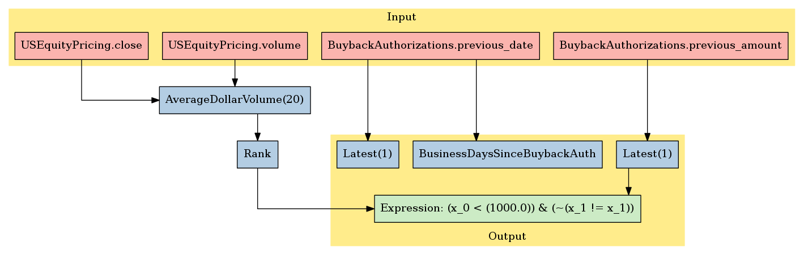

EventVestor: Buyback Authorizations
===================================

In this notebook, we’ll take a look at EventVestor’s *Buyback
Authorizations* dataset, available on the `Quantopian
Store <https://www.quantopian.com/store>`__. This dataset spans January
01, 2007 through the current day.

Notebook Contents
-----------------

There are two ways to access the data and you’ll find both of them
listed below. Just click on the section you’d like to read through.

-  Interactive overview: This is only available on Research and uses
   blaze to give you access to large amounts of data. Recommended for
   exploration and plotting.
-  Pipeline overview: Data is made available through pipeline which is
   available on both the Research & Backtesting environment. Recommended
   for custom factor development and moving back & forth between
   research/backtesting.

Free samples and limits
~~~~~~~~~~~~~~~~~~~~~~~

One key caveat: we limit the number of results returned from any given
expression to 10,000 to protect against runaway memory usage. To be
clear, you have access to all the data server side. We are limiting the
size of the responses back from Blaze.

There is a *free* version of this dataset as well as a paid one. The
free sample includes data until 2 months prior to the current date.

To access the most up-to-date values for this data set for trading a
live algorithm (as with other partner sets), you need to purchase acess
to the full set.

With preamble in place, let’s get started:

#Interactive Overview ### Accessing the data with Blaze and Interactive
on Research Partner datasets are available on Quantopian Research
through an API service known as `Blaze <http://blaze.pydata.org>`__.
Blaze provides the Quantopian user with a convenient interface to access
very large datasets, in an interactive, generic manner.

Blaze provides an important function for accessing these datasets. Some
of these sets are many millions of records. Bringing that data directly
into Quantopian Research directly just is not viable. So Blaze allows us
to provide a simple querying interface and shift the burden over to the
server side.

It is common to use Blaze to reduce your dataset in size, convert it
over to Pandas and then to use Pandas for further computation,
manipulation and visualization.

Helpful links: \* `Query building for
Blaze <http://blaze.readthedocs.io/en/latest/queries.html>`__ \*
`Pandas-to-Blaze
dictionary <http://blaze.readthedocs.io/en/latest/rosetta-pandas.html>`__
\* `SQL-to-Blaze
dictionary <http://blaze.readthedocs.io/en/latest/rosetta-sql.html>`__.

| Once you’ve limited the size of your Blaze object, you can convert it
  to a Pandas DataFrames using: > ``from odo import odo``
| > ``odo(expr, pandas.DataFrame)``

###To see how this data can be used in your algorithm, search for the
``Pipeline Overview`` section of this notebook or head straight to
Pipeline Overview

.. code:: ipython2

    # import the dataset
    from quantopian.interactive.data.eventvestor import buyback_auth as dataset
    
    # or if you want to import the free dataset, use:
    #from quantopian.data.eventvestor import buyback_auth_free
    
    # import data operations
    from odo import odo
    # import other libraries we will use
    import pandas as pd
    import matplotlib.pyplot as plt

.. code:: ipython2

    # Let's use blaze to understand the data a bit using Blaze dshape()
    dataset.dshape

.. parsed-literal::

    dshape("""var * {
      event_id: float64,
      trade_date: ?datetime,
      symbol: string,
      event_type: ?string,
      event_headline: ?string,
      buyback_type: ?string,
      buyback_purpose: ?string,
      offer_type: ?string,
      buyback_amount: float64,
      buyback_units: ?string,
      event_rating: float64,
      sid: int64,
      asof_date: datetime,
      timestamp: datetime
      }""")

.. code:: ipython2

    # And how many rows are there?
    # N.B. we're using a Blaze function to do this, not len()
    dataset.count()

.. raw:: html

    8894

.. code:: ipython2

    # Let's see what the data looks like. We'll grab the first three rows.
    dataset[:3]

.. raw:: html

    <table border="1" class="dataframe">
      <thead>
        <tr style="text-align: right;">
          <th></th>
          <th>event_id</th>
          <th>trade_date</th>
          <th>symbol</th>
          <th>event_type</th>
          <th>event_headline</th>
          <th>buyback_type</th>
          <th>buyback_purpose</th>
          <th>offer_type</th>
          <th>buyback_amount</th>
          <th>buyback_units</th>
          <th>event_rating</th>
          <th>sid</th>
          <th>asof_date</th>
          <th>timestamp</th>
        </tr>
      </thead>
      <tbody>
        <tr>
          <th>0</th>
          <td>199282</td>
          <td>2007-01-05</td>
          <td>IIIN</td>
          <td>Buyback</td>
          <td>Insteel Industries Announces $25M Share Buyback</td>
          <td>New</td>
          <td>General Corporate</td>
          <td>Open Market</td>
          <td>25.0</td>
          <td>$M</td>
          <td>1</td>
          <td>3849</td>
          <td>2007-01-05</td>
          <td>2007-01-06</td>
        </tr>
        <tr>
          <th>1</th>
          <td>131132</td>
          <td>2007-01-12</td>
          <td>COP</td>
          <td>Buyback</td>
          <td>ConocoPhillips Announces $1B Share Repurchase ...</td>
          <td>New</td>
          <td>General Corporate</td>
          <td>Open Market</td>
          <td>1000.0</td>
          <td>$M</td>
          <td>1</td>
          <td>23998</td>
          <td>2007-01-12</td>
          <td>2007-01-13</td>
        </tr>
        <tr>
          <th>2</th>
          <td>150579</td>
          <td>2007-01-17</td>
          <td>VLY</td>
          <td>Buyback</td>
          <td>Valley National Bancorp Announces 3.5M Share R...</td>
          <td>New</td>
          <td>General Corporate</td>
          <td>Open Market</td>
          <td>3.5</td>
          <td>Mshares</td>
          <td>1</td>
          <td>8011</td>
          <td>2007-01-17</td>
          <td>2007-01-18</td>
        </tr>
      </tbody>
    </table>

Let’s go over the columns: - **event_id**: the unique identifier for
this buyback authorization. - **asof_date**: EventVestor’s timestamp of
event capture. - **trade_date**: for event announcements made before
trading ends, trade_date is the same as event_date. For announcements
issued after market close, trade_date is next market open day. -
**symbol**: stock ticker symbol of the affected company. -
**event_type**: this should always be *Buyback*. - **event_headline**: a
short description of the event. - **buyback_type**: types include *new*,
*additional*, *reinstates*, *suspends*, *reduction* -
**buyback_purpose**: types include *general corporate*, *undervalued*,
*stock options*, *acquisition* - **offer_type**: types include *open
market, private placement, mixed offer, dutch auction, tender offers.* -
**buyback_amount**: the amount of buyback_units being bought back -
**buyback_units**: the units of buyback_amount: values include millions
of dollars (or other local currency), shares in millions, or percent of
shares outstanding. - **event_rating**: this is always 1. The meaning of
this is uncertain. - **timestamp**: this is our timestamp on when we
registered the data. - **sid**: the equity’s unique identifier. Use this
instead of the symbol.

We’ve done much of the data processing for you. Fields like
``timestamp`` and ``sid`` are standardized across all our Store
Datasets, so the datasets are easy to combine. We have standardized the
``sid`` across all our equity databases.

We can select columns and rows with ease. Below, we’ll fetch all entries
for Microsoft. We’re really only interested in the buyback amount, the
units, and the date, so we’ll display only those columns.

.. code:: ipython2

    # get the sid for MSFT
    symbols('MSFT')

.. parsed-literal::

    Equity(5061, symbol=u'MSFT', asset_name=u'MICROSOFT CORP', exchange=u'NASDAQ GLOBAL SELECT MARKET', start_date=Timestamp('1993-01-04 00:00:00+0000', tz='UTC'), end_date=Timestamp('2016-05-24 00:00:00+0000', tz='UTC'), first_traded=None, auto_close_date=Timestamp('2016-05-27 00:00:00+0000', tz='UTC'))

.. code:: ipython2

    # knowing that the MSFT sid is 5061:
    msft = dataset[dataset.sid==5061][['timestamp','buyback_amount', 'buyback_units']].sort('timestamp')
    msft

.. raw:: html

    <table border="1" class="dataframe">
      <thead>
        <tr style="text-align: right;">
          <th></th>
          <th>timestamp</th>
          <th>buyback_amount</th>
          <th>buyback_units</th>
        </tr>
      </thead>
      <tbody>
        <tr>
          <th>0</th>
          <td>2008-09-23</td>
          <td>40000</td>
          <td>$M</td>
        </tr>
        <tr>
          <th>1</th>
          <td>2013-09-18</td>
          <td>40000</td>
          <td>$M</td>
        </tr>
      </tbody>
    </table>

Finally, suppose we want a DataFrame of Apple Buybacks, sorted in
descending order by the buyback amount:

.. code:: ipython2

    aapl_sid = symbols('AAPL').sid

.. code:: ipython2

    aapl = dataset[dataset.sid==aapl_sid].sort('buyback_amount',ascending=False)
    aapl_df = odo(aapl, pd.DataFrame)
    aapl_df

.. raw:: html

    

    <table border="1" class="dataframe">
      <thead>
        <tr style="text-align: right;">
          <th></th>
          <th>event_id</th>
          <th>trade_date</th>
          <th>symbol</th>
          <th>event_type</th>
          <th>event_headline</th>
          <th>buyback_type</th>
          <th>buyback_purpose</th>
          <th>offer_type</th>
          <th>buyback_amount</th>
          <th>buyback_units</th>
          <th>event_rating</th>
          <th>sid</th>
          <th>asof_date</th>
          <th>timestamp</th>
        </tr>
      </thead>
      <tbody>
        <tr>
          <th>0</th>
          <td>1570151</td>
          <td>2013-04-24</td>
          <td>AAPL</td>
          <td>Buyback</td>
          <td>Apple Raises Share Repurchase Program to $60B</td>
          <td>Additional</td>
          <td>General Corporate</td>
          <td>Open Market</td>
          <td>50000</td>
          <td>$M</td>
          <td>1</td>
          <td>24</td>
          <td>2013-04-23</td>
          <td>2013-04-24 00:00:00</td>
        </tr>
        <tr>
          <th>1</th>
          <td>1918113</td>
          <td>2015-04-28</td>
          <td>AAPL</td>
          <td>Buyback</td>
          <td>Apple Announces Additional $50B Share Repurcha...</td>
          <td>Additional</td>
          <td>General Corporate</td>
          <td>Open Market</td>
          <td>50000</td>
          <td>$M</td>
          <td>1</td>
          <td>24</td>
          <td>2015-04-27</td>
          <td>2015-04-28 00:00:00</td>
        </tr>
        <tr>
          <th>2</th>
          <td>2162722</td>
          <td>2016-04-27</td>
          <td>AAPL</td>
          <td>Buyback</td>
          <td>Apple Increases Share Repurchase Authorization...</td>
          <td>Additional</td>
          <td>General Corporate</td>
          <td>Open Market</td>
          <td>35000</td>
          <td>$M</td>
          <td>1</td>
          <td>24</td>
          <td>2016-04-26</td>
          <td>2016-04-27 11:02:42.070375</td>
        </tr>
        <tr>
          <th>3</th>
          <td>1708179</td>
          <td>2014-04-24</td>
          <td>AAPL</td>
          <td>Buyback</td>
          <td>Apple Announces Additional $30B Share Repurcha...</td>
          <td>Additional</td>
          <td>General Corporate</td>
          <td>Open Market</td>
          <td>30000</td>
          <td>$M</td>
          <td>1</td>
          <td>24</td>
          <td>2014-04-23</td>
          <td>2014-04-24 00:00:00</td>
        </tr>
        <tr>
          <th>4</th>
          <td>1410570</td>
          <td>2012-03-19</td>
          <td>AAPL</td>
          <td>Buyback</td>
          <td>Apple to Repurchase $10B Shares</td>
          <td>New</td>
          <td>General Corporate</td>
          <td>Open Market</td>
          <td>10000</td>
          <td>$M</td>
          <td>1</td>
          <td>24</td>
          <td>2012-03-19</td>
          <td>2012-03-20 00:00:00</td>
        </tr>
      </tbody>
    </table>
    

#Pipeline Overview

Accessing the data in your algorithms & research
~~~~~~~~~~~~~~~~~~~~~~~~~~~~~~~~~~~~~~~~~~~~~~~~

The only method for accessing partner data within algorithms running on
Quantopian is via the pipeline API. Different data sets work differently
but in the case of this data, you can add this data to your pipeline as
follows:

Import the data set here >
``from quantopian.pipeline.data.eventvestor import BuybackAuthorizations``

Then in intialize() you could do something simple like adding the raw
value of one of the fields to your pipeline: >
``pipe.add(BuybackAuthorizations.total_scanned_messages.latest, 'total_scanned_messages')``

.. code:: ipython2

    # Import necessary Pipeline modules
    from quantopian.pipeline import Pipeline
    from quantopian.research import run_pipeline
    from quantopian.pipeline.factors import AverageDollarVolume

.. code:: ipython2

    # For use in your algorithms
    # Using the full dataset in your pipeline algo
    from quantopian.pipeline.data.eventvestor import BuybackAuthorizations
    
    from quantopian.pipeline.factors.eventvestor import BusinessDaysSinceBuybackAuth

Now that we’ve imported the data, let’s take a look at which fields are
available for each dataset.

You’ll find the dataset, the available fields, and the datatypes for
each of those fields.

.. code:: ipython2

    print "Here are the list of available fields per dataset:"
    print "---------------------------------------------------\n"
    
    def _print_fields(dataset):
        print "Dataset: %s\n" % dataset.__name__
        print "Fields:"
        for field in list(dataset.columns):
            print "%s - %s" % (field.name, field.dtype)
        print "\n"
    
    for data in (BuybackAuthorizations,):
        _print_fields(data)
    
    
    print "---------------------------------------------------\n"

.. parsed-literal::

    Here are the list of available fields per dataset:
    ---------------------------------------------------
    
    Dataset: BuybackAuthorizations
    
    Fields:
    previous_date - datetime64[ns]
    previous_type - object
    previous_amount - float64
    previous_unit - object
    
    
    ---------------------------------------------------
    

Now that we know what fields we have access to, let’s see what this data
looks like when we run it through Pipeline.

This is constructed the same way as you would in the backtester. For
more information on using Pipeline in Research view this thread:
https://www.quantopian.com/posts/pipeline-in-research-build-test-and-visualize-your-factors-and-filters

.. code:: ipython2

    # Let's see what this data looks like when we run it through Pipeline
    # This is constructed the same way as you would in the backtester. For more information
    # on using Pipeline in Research view this thread:
    # https://www.quantopian.com/posts/pipeline-in-research-build-test-and-visualize-your-factors-and-filters
    pipe = Pipeline()
           
    pipe.add(BuybackAuthorizations.previous_date.latest, 'previous_date')
    pipe.add(BuybackAuthorizations.previous_amount.latest, 'previous_amount')
    pipe.add(BusinessDaysSinceBuybackAuth(), "business_days")

.. code:: ipython2

    # Setting some basic liquidity strings (just for good habit)
    dollar_volume = AverageDollarVolume(window_length=20)
    top_1000_most_liquid = dollar_volume.rank(ascending=False) < 1000
    
    pipe.set_screen(top_1000_most_liquid & BuybackAuthorizations.previous_amount.latest.notnan())

.. code:: ipython2

    # The show_graph() method of pipeline objects produces a graph to show how it is being calculated.
    pipe.show_graph(format='png')

.. code:: ipython2

    # run_pipeline will show the output of your pipeline
    pipe_output = run_pipeline(pipe, start_date='2013-11-01', end_date='2013-11-25')
    pipe_output

.. raw:: html

    

    <table border="1" class="dataframe">
      <thead>
        <tr style="text-align: right;">
          <th></th>
          <th></th>
          <th>business_days</th>
          <th>previous_amount</th>
          <th>previous_date</th>
        </tr>
      </thead>
      <tbody>
        <tr>
          <th rowspan="30" valign="top">2013-11-01 00:00:00+00:00</th>
          <th>Equity(2 [AA])</th>
          <td>1323</td>
          <td>0.0</td>
          <td>2008-10-07</td>
        </tr>
        <tr>
          <th>Equity(24 [AAPL])</th>
          <td>138</td>
          <td>50000.0</td>
          <td>2013-04-23</td>
        </tr>
        <tr>
          <th>Equity(62 [ABT])</th>
          <td>100</td>
          <td>3000.0</td>
          <td>2013-06-14</td>
        </tr>
        <tr>
          <th>Equity(67 [ADSK])</th>
          <td>358</td>
          <td>30.0</td>
          <td>2012-06-19</td>
        </tr>
        <tr>
          <th>Equity(76 [TAP])</th>
          <td>588</td>
          <td>1200.0</td>
          <td>2011-08-02</td>
        </tr>
        <tr>
          <th>Equity(114 [ADBE])</th>
          <td>406</td>
          <td>2000.0</td>
          <td>2012-04-12</td>
        </tr>
        <tr>
          <th>Equity(122 [ADI])</th>
          <td>769</td>
          <td>1000.0</td>
          <td>2010-11-22</td>
        </tr>
        <tr>
          <th>Equity(128 [ADM])</th>
          <td>1750</td>
          <td>370.0</td>
          <td>2007-02-16</td>
        </tr>
        <tr>
          <th>Equity(166 [AES])</th>
          <td>177</td>
          <td>300.0</td>
          <td>2013-02-27</td>
        </tr>
        <tr>
          <th>Equity(168 [AET])</th>
          <td>25</td>
          <td>750.0</td>
          <td>2013-09-27</td>
        </tr>
        <tr>
          <th>Equity(185 [AFL])</th>
          <td>843</td>
          <td>3.0</td>
          <td>2010-08-10</td>
        </tr>
        <tr>
          <th>Equity(197 [AGCO])</th>
          <td>331</td>
          <td>50.0</td>
          <td>2012-07-26</td>
        </tr>
        <tr>
          <th>Equity(239 [AIG])</th>
          <td>66</td>
          <td>1000.0</td>
          <td>2013-08-01</td>
        </tr>
        <tr>
          <th>Equity(300 [ALK])</th>
          <td>287</td>
          <td>250.0</td>
          <td>2012-09-26</td>
        </tr>
        <tr>
          <th>Equity(328 [ALTR])</th>
          <td>47</td>
          <td>30.0</td>
          <td>2013-08-28</td>
        </tr>
        <tr>
          <th>Equity(337 [AMAT])</th>
          <td>434</td>
          <td>3000.0</td>
          <td>2012-03-05</td>
        </tr>
        <tr>
          <th>Equity(338 [BEAM])</th>
          <td>61</td>
          <td>3.0</td>
          <td>2013-08-08</td>
        </tr>
        <tr>
          <th>Equity(353 [AME])</th>
          <td>521</td>
          <td>100.0</td>
          <td>2011-11-03</td>
        </tr>
        <tr>
          <th>Equity(357 [TWX])</th>
          <td>192</td>
          <td>4000.0</td>
          <td>2013-02-06</td>
        </tr>
        <tr>
          <th>Equity(368 [AMGN])</th>
          <td>231</td>
          <td>2000.0</td>
          <td>2012-12-13</td>
        </tr>
        <tr>
          <th>Equity(410 [AN])</th>
          <td>336</td>
          <td>250.0</td>
          <td>2012-07-19</td>
        </tr>
        <tr>
          <th>Equity(438 [AON])</th>
          <td>401</td>
          <td>5000.0</td>
          <td>2012-04-19</td>
        </tr>
        <tr>
          <th>Equity(448 [APA])</th>
          <td>126</td>
          <td>30.0</td>
          <td>2013-05-09</td>
        </tr>
        <tr>
          <th>Equity(455 [APC])</th>
          <td>1354</td>
          <td>5000.0</td>
          <td>2008-08-25</td>
        </tr>
        <tr>
          <th>Equity(460 [APD])</th>
          <td>554</td>
          <td>1000.0</td>
          <td>2011-09-19</td>
        </tr>
        <tr>
          <th>Equity(465 [APH])</th>
          <td>206</td>
          <td>10.0</td>
          <td>2013-01-17</td>
        </tr>
        <tr>
          <th>Equity(510 [ARG])</th>
          <td>268</td>
          <td>600.0</td>
          <td>2012-10-23</td>
        </tr>
        <tr>
          <th>Equity(559 [ASH])</th>
          <td>122</td>
          <td>600.0</td>
          <td>2013-05-15</td>
        </tr>
        <tr>
          <th>Equity(607 [ATML])</th>
          <td>392</td>
          <td>200.0</td>
          <td>2012-05-02</td>
        </tr>
        <tr>
          <th>Equity(630 [ADP])</th>
          <td>625</td>
          <td>35.0</td>
          <td>2011-06-10</td>
        </tr>
        <tr>
          <th>...</th>
          <th>...</th>
          <td>...</td>
          <td>...</td>
          <td>...</td>
        </tr>
        <tr>
          <th rowspan="30" valign="top">2013-11-25 00:00:00+00:00</th>
          <th>Equity(38691 [CFN])</th>
          <td>77</td>
          <td>750.0</td>
          <td>2013-08-08</td>
        </tr>
        <tr>
          <th>Equity(38817 [VRSK])</th>
          <td>112</td>
          <td>300.0</td>
          <td>2013-06-20</td>
        </tr>
        <tr>
          <th>Equity(38921 [LEA])</th>
          <td>170</td>
          <td>750.0</td>
          <td>2013-04-01</td>
        </tr>
        <tr>
          <th>Equity(38936 [DG])</th>
          <td>175</td>
          <td>500.0</td>
          <td>2013-03-25</td>
        </tr>
        <tr>
          <th>Equity(38989 [AOL])</th>
          <td>100</td>
          <td>150.0</td>
          <td>2013-07-08</td>
        </tr>
        <tr>
          <th>Equity(39053 [CIT])</th>
          <td>127</td>
          <td>200.0</td>
          <td>2013-05-30</td>
        </tr>
        <tr>
          <th>Equity(39095 [CHTR])</th>
          <td>497</td>
          <td>321.0</td>
          <td>2011-12-29</td>
        </tr>
        <tr>
          <th>Equity(39546 [LYB])</th>
          <td>133</td>
          <td>10.0</td>
          <td>2013-05-22</td>
        </tr>
        <tr>
          <th>Equity(40430 [GM])</th>
          <td>243</td>
          <td>5500.0</td>
          <td>2012-12-19</td>
        </tr>
        <tr>
          <th>Equity(40597 [FLT])</th>
          <td>259</td>
          <td>200.0</td>
          <td>2012-11-27</td>
        </tr>
        <tr>
          <th>Equity(40755 [NLSN])</th>
          <td>84</td>
          <td>500.0</td>
          <td>2013-07-30</td>
        </tr>
        <tr>
          <th>Equity(40852 [KMI])</th>
          <td>28</td>
          <td>250.0</td>
          <td>2013-10-16</td>
        </tr>
        <tr>
          <th>Equity(41047 [HCA])</th>
          <td>572</td>
          <td>80.8</td>
          <td>2011-09-15</td>
        </tr>
        <tr>
          <th>Equity(41149 [QIHU])</th>
          <td>490</td>
          <td>50.0</td>
          <td>2012-01-09</td>
        </tr>
        <tr>
          <th>Equity(41182 [GNC])</th>
          <td>202</td>
          <td>250.0</td>
          <td>2013-02-14</td>
        </tr>
        <tr>
          <th>Equity(41462 [MOS])</th>
          <td>527</td>
          <td>1200.0</td>
          <td>2011-11-17</td>
        </tr>
        <tr>
          <th>Equity(41636 [MPC])</th>
          <td>42</td>
          <td>2000.0</td>
          <td>2013-09-26</td>
        </tr>
        <tr>
          <th>Equity(41759 [DNKN])</th>
          <td>337</td>
          <td>15.0</td>
          <td>2012-08-09</td>
        </tr>
        <tr>
          <th>Equity(42023 [XYL])</th>
          <td>68</td>
          <td>250.0</td>
          <td>2013-08-21</td>
        </tr>
        <tr>
          <th>Equity(42027 [UBNT])</th>
          <td>337</td>
          <td>100.0</td>
          <td>2012-08-09</td>
        </tr>
        <tr>
          <th>Equity(42118 [GRPN])</th>
          <td>78</td>
          <td>300.0</td>
          <td>2013-08-07</td>
        </tr>
        <tr>
          <th>Equity(42173 [DLPH])</th>
          <td>312</td>
          <td>750.0</td>
          <td>2012-09-13</td>
        </tr>
        <tr>
          <th>Equity(42230 [TRIP])</th>
          <td>203</td>
          <td>250.0</td>
          <td>2013-02-13</td>
        </tr>
        <tr>
          <th>Equity(42277 [ZNGA])</th>
          <td>283</td>
          <td>200.0</td>
          <td>2012-10-24</td>
        </tr>
        <tr>
          <th>Equity(42436 [SLCA])</th>
          <td>378</td>
          <td>25.0</td>
          <td>2012-06-13</td>
        </tr>
        <tr>
          <th>Equity(42699 [VNTV])</th>
          <td>0</td>
          <td>137.0</td>
          <td>2013-11-24</td>
        </tr>
        <tr>
          <th>Equity(42788 [PSX])</th>
          <td>83</td>
          <td>1000.0</td>
          <td>2013-07-31</td>
        </tr>
        <tr>
          <th>Equity(43399 [ADT])</th>
          <td>3</td>
          <td>1000.0</td>
          <td>2013-11-20</td>
        </tr>
        <tr>
          <th>Equity(43694 [ABBV])</th>
          <td>201</td>
          <td>1500.0</td>
          <td>2013-02-15</td>
        </tr>
        <tr>
          <th>Equity(44931 [NWSA])</th>
          <td>46</td>
          <td>500.0</td>
          <td>2013-09-20</td>
        </tr>
      </tbody>
    </table>
    
9750 rows × 3 columns

    

Taking what we’ve seen from above, let’s see how we’d move that into the
backtester.

.. code:: ipython2

    # This section is only importable in the backtester
    from quantopian.algorithm import attach_pipeline, pipeline_output
    
    # General pipeline imports
    from quantopian.pipeline import Pipeline
    from quantopian.pipeline.factors import AverageDollarVolume
    
    # Import the datasets available
    # For use in your algorithms
    # Using the full dataset in your pipeline algo
    from quantopian.pipeline.data.eventvestor import BuybackAuthorizations
    from quantopian.pipeline.factors.eventvestor import BusinessDaysSinceBuybackAuth
    
    
    def make_pipeline():
        # Create our pipeline
        pipe = Pipeline()
        
        # Screen out penny stocks and low liquidity securities.
        dollar_volume = AverageDollarVolume(window_length=20)
        is_liquid = dollar_volume.rank(ascending=False) < 1000
        
        # Create the mask that we will use for our percentile methods.
        base_universe = (is_liquid)
    
        # Add pipeline factors
        pipe.add(BuybackAuthorizations.previous_date.latest, 'previous_date')
        pipe.add(BuybackAuthorizations.previous_amount.latest, 'previous_amount')
        pipe.add(BusinessDaysSinceBuybackAuth(), "business_days")
    
        # Set our pipeline screens
        pipe.set_screen(is_liquid)
        return pipe
    
    def initialize(context):
        attach_pipeline(make_pipeline(), "pipeline")
        
    def before_trading_start(context, data):
        results = pipeline_output('pipeline')

Now you can take that and begin to use it as a building block for your
algorithms, for more examples on how to do that you can visit our data
pipeline factor library
