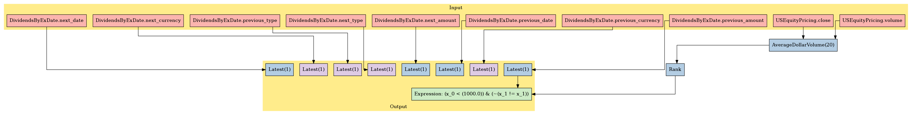

EventVestor: Dividend Announcements
===================================

In this notebook, we’ll take a look at EventVestor’s *Cash Dividend
Announcement* dataset, available on the `Quantopian
Store <https://www.quantopian.com/store>`__. This dataset spans January
01, 2007 through the current day, and documents cash dividend
announcements, including special dividends.

Notebook Contents
-----------------

There are two ways to access the data and you’ll find both of them
listed below. Just click on the section you’d like to read through.

-  Interactive overview: This is only available on Research and uses
   blaze to give you access to large amounts of data. Recommended for
   exploration and plotting.
-  Pipeline overview: Data is made available through pipeline which is
   available on both the Research & Backtesting environment. Recommended
   for custom factor development and moving back & forth between
   research/backtesting.

Free samples and limits
~~~~~~~~~~~~~~~~~~~~~~~

One key caveat: we limit the number of results returned from any given
expression to 10,000 to protect against runaway memory usage. To be
clear, you have access to all the data server side. We are limiting the
size of the responses back from Blaze.

There is a *free* version of this dataset as well as a paid one. The
free sample includes data until 2 months prior to the current date.

To access the most up-to-date values for this data set for trading a
live algorithm (as with other partner sets), you need to purchase acess
to the full set.

With preamble in place, let’s get started:

#Interactive Overview ### Accessing the data with Blaze and Interactive
on Research Partner datasets are available on Quantopian Research
through an API service known as `Blaze <http://blaze.pydata.org>`__.
Blaze provides the Quantopian user with a convenient interface to access
very large datasets, in an interactive, generic manner.

Blaze provides an important function for accessing these datasets. Some
of these sets are many millions of records. Bringing that data directly
into Quantopian Research directly just is not viable. So Blaze allows us
to provide a simple querying interface and shift the burden over to the
server side.

It is common to use Blaze to reduce your dataset in size, convert it
over to Pandas and then to use Pandas for further computation,
manipulation and visualization.

Helpful links: \* `Query building for
Blaze <http://blaze.readthedocs.io/en/latest/queries.html>`__ \*
`Pandas-to-Blaze
dictionary <http://blaze.readthedocs.io/en/latest/rosetta-pandas.html>`__
\* `SQL-to-Blaze
dictionary <http://blaze.readthedocs.io/en/latest/rosetta-sql.html>`__.

| Once you’ve limited the size of your Blaze object, you can convert it
  to a Pandas DataFrames using: > ``from odo import odo``
| > ``odo(expr, pandas.DataFrame)``

###To see how this data can be used in your algorithm, search for the
``Pipeline Overview`` section of this notebook or head straight to
Pipeline Overview

.. code:: ipython2

    # import the dataset
    # from quantopian.interactive.data.eventvestor import dividends as dataset
    # or if you want to import the free dataset, use:
    from quantopian.interactive.data.eventvestor import dividends_free  as dataset
    
    # import data operations
    from odo import odo
    # import other libraries we will use
    import pandas as pd

.. code:: ipython2

    # Let's use blaze to understand the data a bit using Blaze dshape()
    dataset.dshape

.. parsed-literal::

    dshape("""var * {
      event_id: float64,
      trade_date: ?datetime,
      symbol: string,
      event_type: ?string,
      event_headline: ?string,
      event_phase: ?string,
      div_type: ?string,
      div_amount: float64,
      div_currency: ?string,
      div_ex_date: ?datetime,
      div_record_date: ?datetime,
      div_pay_date: ?datetime,
      event_rating: float64,
      sid: int64,
      asof_date: datetime,
      timestamp: datetime
      }""")

.. code:: ipython2

    # And how many rows are there?
    # N.B. we're using a Blaze function to do this, not len()
    dataset.count()

.. raw:: html

    48578

.. code:: ipython2

    # Let's see what the data looks like. We'll grab the first three rows.
    dataset[:3]

.. raw:: html

    <table border="1" class="dataframe">
      <thead>
        <tr style="text-align: right;">
          <th></th>
          <th>event_id</th>
          <th>asof_date</th>
          <th>trade_date</th>
          <th>symbol</th>
          <th>event_type</th>
          <th>event_headline</th>
          <th>event_phase</th>
          <th>div_type</th>
          <th>div_amount</th>
          <th>div_currency</th>
          <th>div_ex_date</th>
          <th>div_record_date</th>
          <th>div_pay_date</th>
          <th>event_rating</th>
          <th>timestamp</th>
          <th>sid</th>
        </tr>
      </thead>
      <tbody>
        <tr>
          <th>0</th>
          <td>151608</td>
          <td>2007-01-02</td>
          <td>2007-01-03</td>
          <td>RPM</td>
          <td>Dividend</td>
          <td>RPM International Hikes Quarterly Dividend 9%</td>
          <td>NaN</td>
          <td>Increase</td>
          <td>0.175</td>
          <td>$</td>
          <td>2007-01-10</td>
          <td>2007-01-12</td>
          <td>2007-01-31</td>
          <td>1</td>
          <td>2007-01-03</td>
          <td>6557</td>
        </tr>
        <tr>
          <th>1</th>
          <td>1071875</td>
          <td>2007-01-02</td>
          <td>2007-01-02</td>
          <td>SUI</td>
          <td>Dividend</td>
          <td>Sun Communities Declares Quarterly Dividend of...</td>
          <td>NaN</td>
          <td>No Change QoQ</td>
          <td>0.630</td>
          <td>$</td>
          <td>2007-01-10</td>
          <td>2007-01-12</td>
          <td>2007-01-22</td>
          <td>1</td>
          <td>2007-01-03</td>
          <td>10535</td>
        </tr>
        <tr>
          <th>2</th>
          <td>149674</td>
          <td>2007-01-02</td>
          <td>2007-01-03</td>
          <td>AFG</td>
          <td>Dividend</td>
          <td>American Financial Increases Quarterly Dividen...</td>
          <td>NaN</td>
          <td>Increase</td>
          <td>0.100</td>
          <td>$</td>
          <td>2007-01-11</td>
          <td>2007-01-15</td>
          <td>2007-01-25</td>
          <td>1</td>
          <td>2007-01-03</td>
          <td>12980</td>
        </tr>
      </tbody>
    </table>

| Let’s go over the columns: - **event_id**: the unique identifier for
  this event. - **asof_date**: EventVestor’s timestamp of event capture.
  - **trade_date**: for event announcements made before trading ends,
  trade_date is the same as event_date. For announcements issued after
  market close, trade_date is next market open day. - **symbol**: stock
  ticker symbol of the affected company. - **event_type**: this should
  always be *Dividend*. - **event_headline**: a brief description of the
  event - **event_phase**: the inclusion of this field is likely an
  error on the part of the data vendor. We’re currently attempting to
  resolve this. - **div_type**: dividend type. Values include *no
  change, increase, decrease, initiation, defer, suspend, omission,
  stock, special*.
| Note *QoQ* = quarter-on-quarter. - **div_amount**: dividend payment
  amount in local currency - **div_currency**: dividend payment currency
  code. Values include *$, BRL, CAD, CHF, EUR, GBP, JPY*. -
  **div_ex_date**: ex-dividend date - **div_record_date**: dividend
  payment record date - **div_pay_date**: dividend payment date -
  **event_rating**: this is always 1. The meaning of this is uncertain.
  - **timestamp**: this is our timestamp on when we registered the data.
  - **sid**: the equity’s unique identifier. Use this instead of the
  symbol.

We’ve done much of the data processing for you. Fields like
``timestamp`` and ``sid`` are standardized across all our Store
Datasets, so the datasets are easy to combine. We have standardized the
``sid`` across all our equity databases.

We can select columns and rows with ease. Below, we’ll fetch all
fifty-cent dividends.

.. code:: ipython2

    fiftyc = dataset[(dataset.div_amount==0.5) & (dataset['div_currency']=='$')]
    # When displaying a Blaze Data Object, the printout is automatically truncated to ten rows.
    fiftyc.sort('timestamp')

.. raw:: html

    <table border="1" class="dataframe">
      <thead>
        <tr style="text-align: right;">
          <th></th>
          <th>event_id</th>
          <th>asof_date</th>
          <th>trade_date</th>
          <th>symbol</th>
          <th>event_type</th>
          <th>event_headline</th>
          <th>event_phase</th>
          <th>div_type</th>
          <th>div_amount</th>
          <th>div_currency</th>
          <th>div_ex_date</th>
          <th>div_record_date</th>
          <th>div_pay_date</th>
          <th>event_rating</th>
          <th>timestamp</th>
          <th>sid</th>
        </tr>
      </thead>
      <tbody>
        <tr>
          <th>0</th>
          <td>132448</td>
          <td>2007-01-18</td>
          <td>2007-01-18</td>
          <td>PPG</td>
          <td>Dividend</td>
          <td>PPG Industries Raises Quarterly Dividend 4.2%</td>
          <td>NaN</td>
          <td>Increase</td>
          <td>0.5</td>
          <td>$</td>
          <td>2007-02-14</td>
          <td>2007-02-16</td>
          <td>2007-03-12</td>
          <td>1</td>
          <td>2007-01-19</td>
          <td>6116</td>
        </tr>
        <tr>
          <th>1</th>
          <td>145007</td>
          <td>2007-01-23</td>
          <td>2007-01-23</td>
          <td>CFFN</td>
          <td>Dividend</td>
          <td>Capitol Federal Declares Quarterly Dividend of...</td>
          <td>NaN</td>
          <td>No Change QoQ</td>
          <td>0.5</td>
          <td>$</td>
          <td>2007-01-31</td>
          <td>2007-02-02</td>
          <td>2007-02-16</td>
          <td>1</td>
          <td>2007-01-24</td>
          <td>19962</td>
        </tr>
        <tr>
          <th>2</th>
          <td>144819</td>
          <td>2007-01-25</td>
          <td>2007-01-25</td>
          <td>IMB</td>
          <td>Dividend</td>
          <td>IndyMac Declares Quarterly Dividend of $0.50 p...</td>
          <td>NaN</td>
          <td>No Change QoQ</td>
          <td>0.5</td>
          <td>$</td>
          <td>2007-02-06</td>
          <td>2007-02-08</td>
          <td>2007-03-08</td>
          <td>1</td>
          <td>2007-01-26</td>
          <td>17256</td>
        </tr>
        <tr>
          <th>3</th>
          <td>132424</td>
          <td>2007-02-21</td>
          <td>2007-02-21</td>
          <td>NUE</td>
          <td>Dividend</td>
          <td>Nucor Declares Supplemental Dividend of $0.50 ...</td>
          <td>NaN</td>
          <td>Special</td>
          <td>0.5</td>
          <td>$</td>
          <td>2007-03-28</td>
          <td>2007-03-30</td>
          <td>2007-05-11</td>
          <td>1</td>
          <td>2007-02-22</td>
          <td>5488</td>
        </tr>
        <tr>
          <th>4</th>
          <td>131771</td>
          <td>2007-02-22</td>
          <td>2007-02-22</td>
          <td>HIG</td>
          <td>Dividend</td>
          <td>Hartford Declares Quarterly Dividend of $0.50 ...</td>
          <td>NaN</td>
          <td>No Change QoQ</td>
          <td>0.5</td>
          <td>$</td>
          <td>2007-02-27</td>
          <td>2007-03-01</td>
          <td>2007-04-02</td>
          <td>1</td>
          <td>2007-02-23</td>
          <td>14064</td>
        </tr>
        <tr>
          <th>5</th>
          <td>132961</td>
          <td>2007-02-27</td>
          <td>2007-02-27</td>
          <td>PSA</td>
          <td>Dividend</td>
          <td>Public Storage Declares Dividend of $0.50 per ...</td>
          <td>NaN</td>
          <td>No Change QoQ</td>
          <td>0.5</td>
          <td>$</td>
          <td>2007-03-13</td>
          <td>2007-03-15</td>
          <td>2007-03-29</td>
          <td>1</td>
          <td>2007-02-28</td>
          <td>24962</td>
        </tr>
        <tr>
          <th>6</th>
          <td>524735</td>
          <td>2007-03-01</td>
          <td>2007-03-01</td>
          <td>GLNG</td>
          <td>Dividend</td>
          <td>Golar LNG Declares Quarterly Dividend of $0.50...</td>
          <td>NaN</td>
          <td>No Change QoQ</td>
          <td>0.5</td>
          <td>$</td>
          <td>2007-03-08</td>
          <td>2007-03-12</td>
          <td>2007-03-26</td>
          <td>1</td>
          <td>2007-03-02</td>
          <td>24489</td>
        </tr>
        <tr>
          <th>7</th>
          <td>130886</td>
          <td>2007-03-02</td>
          <td>2007-03-02</td>
          <td>FRE</td>
          <td>Dividend</td>
          <td>Freddie Mac Declares Quarterly Dividend of $0....</td>
          <td>NaN</td>
          <td>No Change QoQ</td>
          <td>0.5</td>
          <td>$</td>
          <td>2007-03-08</td>
          <td>2007-03-12</td>
          <td>2007-03-30</td>
          <td>1</td>
          <td>2007-03-03</td>
          <td>2988</td>
        </tr>
        <tr>
          <th>8</th>
          <td>1066749</td>
          <td>2007-03-05</td>
          <td>2007-03-05</td>
          <td>EGP</td>
          <td>Dividend</td>
          <td>EastGroup Properties Increases Dividend by 2%</td>
          <td>NaN</td>
          <td>Increase</td>
          <td>0.5</td>
          <td>$</td>
          <td>2007-03-16</td>
          <td>2007-03-20</td>
          <td>2007-03-30</td>
          <td>1</td>
          <td>2007-03-06</td>
          <td>2471</td>
        </tr>
        <tr>
          <th>9</th>
          <td>1070046</td>
          <td>2007-03-09</td>
          <td>2007-03-09</td>
          <td>NHI</td>
          <td>Dividend</td>
          <td>National Health Hikes Quarterly Dividend by 4.2%</td>
          <td>NaN</td>
          <td>Increase</td>
          <td>0.5</td>
          <td>$</td>
          <td>2007-03-28</td>
          <td>2007-03-30</td>
          <td>2007-05-10</td>
          <td>1</td>
          <td>2007-03-10</td>
          <td>5303</td>
        </tr>
        <tr>
          <th>10</th>
          <td>150309</td>
          <td>2007-03-14</td>
          <td>2007-03-14</td>
          <td>AYR</td>
          <td>Dividend</td>
          <td>Aircastle Raises Quarterly Dividend to $0.50 p...</td>
          <td>NaN</td>
          <td>Increase</td>
          <td>0.5</td>
          <td>$</td>
          <td>2007-03-28</td>
          <td>2007-03-30</td>
          <td>2007-04-13</td>
          <td>1</td>
          <td>2007-03-15</td>
          <td>32475</td>
        </tr>
      </tbody>
    </table>

We’ve done much of the data processing for you. Fields like
``timestamp`` and ``sid`` are standardized across all our Store
Datasets, so the datasets are easy to combine. We have standardized the
``sid`` across all our equity databases.

We can select columns and rows with ease. Below, we’ll fetch all
fifty-cent dividends.

.. code:: ipython2

    fifty_df = odo(fiftyc, pd.DataFrame)
    reduced = fifty_df[['sid','div_type','timestamp']]
    # When printed: pandas DataFrames display the head(30) and tail(30) rows, and truncate the middle.
    reduced

.. raw:: html

    

    <table border="1" class="dataframe">
      <thead>
        <tr style="text-align: right;">
          <th></th>
          <th>sid</th>
          <th>div_type</th>
          <th>timestamp</th>
        </tr>
      </thead>
      <tbody>
        <tr>
          <th>0</th>
          <td>6116</td>
          <td>Increase</td>
          <td>2007-01-19 00:00:00</td>
        </tr>
        <tr>
          <th>1</th>
          <td>19962</td>
          <td>No Change QoQ</td>
          <td>2007-01-24 00:00:00</td>
        </tr>
        <tr>
          <th>2</th>
          <td>17256</td>
          <td>No Change QoQ</td>
          <td>2007-01-26 00:00:00</td>
        </tr>
        <tr>
          <th>3</th>
          <td>5488</td>
          <td>Special</td>
          <td>2007-02-22 00:00:00</td>
        </tr>
        <tr>
          <th>4</th>
          <td>14064</td>
          <td>No Change QoQ</td>
          <td>2007-02-23 00:00:00</td>
        </tr>
        <tr>
          <th>5</th>
          <td>24962</td>
          <td>No Change QoQ</td>
          <td>2007-02-28 00:00:00</td>
        </tr>
        <tr>
          <th>6</th>
          <td>24489</td>
          <td>No Change QoQ</td>
          <td>2007-03-02 00:00:00</td>
        </tr>
        <tr>
          <th>7</th>
          <td>2988</td>
          <td>No Change QoQ</td>
          <td>2007-03-03 00:00:00</td>
        </tr>
        <tr>
          <th>8</th>
          <td>2471</td>
          <td>Increase</td>
          <td>2007-03-06 00:00:00</td>
        </tr>
        <tr>
          <th>9</th>
          <td>5303</td>
          <td>Increase</td>
          <td>2007-03-10 00:00:00</td>
        </tr>
        <tr>
          <th>10</th>
          <td>32475</td>
          <td>Increase</td>
          <td>2007-03-15 00:00:00</td>
        </tr>
        <tr>
          <th>11</th>
          <td>17850</td>
          <td>No Change QoQ</td>
          <td>2007-03-23 00:00:00</td>
        </tr>
        <tr>
          <th>12</th>
          <td>27370</td>
          <td>Decrease</td>
          <td>2007-04-19 00:00:00</td>
        </tr>
        <tr>
          <th>13</th>
          <td>6116</td>
          <td>No Change QoQ</td>
          <td>2007-04-20 00:00:00</td>
        </tr>
        <tr>
          <th>14</th>
          <td>19962</td>
          <td>No Change QoQ</td>
          <td>2007-04-26 00:00:00</td>
        </tr>
        <tr>
          <th>15</th>
          <td>17256</td>
          <td>No Change QoQ</td>
          <td>2007-04-27 00:00:00</td>
        </tr>
        <tr>
          <th>16</th>
          <td>27577</td>
          <td>Increase</td>
          <td>2007-04-27 00:00:00</td>
        </tr>
        <tr>
          <th>17</th>
          <td>22792</td>
          <td>Decrease</td>
          <td>2007-05-02 00:00:00</td>
        </tr>
        <tr>
          <th>18</th>
          <td>24962</td>
          <td>No Change QoQ</td>
          <td>2007-05-04 00:00:00</td>
        </tr>
        <tr>
          <th>19</th>
          <td>5219</td>
          <td>Increase</td>
          <td>2007-05-10 00:00:00</td>
        </tr>
        <tr>
          <th>20</th>
          <td>14064</td>
          <td>No Change QoQ</td>
          <td>2007-05-18 00:00:00</td>
        </tr>
        <tr>
          <th>21</th>
          <td>24489</td>
          <td>No Change QoQ</td>
          <td>2007-05-25 00:00:00</td>
        </tr>
        <tr>
          <th>22</th>
          <td>2471</td>
          <td>No Change QoQ</td>
          <td>2007-05-31 00:00:00</td>
        </tr>
        <tr>
          <th>23</th>
          <td>5488</td>
          <td>Special</td>
          <td>2007-06-06 00:00:00</td>
        </tr>
        <tr>
          <th>24</th>
          <td>2988</td>
          <td>No Change QoQ</td>
          <td>2007-06-09 00:00:00</td>
        </tr>
        <tr>
          <th>25</th>
          <td>5303</td>
          <td>No Change QoQ</td>
          <td>2007-06-12 00:00:00</td>
        </tr>
        <tr>
          <th>26</th>
          <td>27830</td>
          <td>Increase</td>
          <td>2007-06-13 00:00:00</td>
        </tr>
        <tr>
          <th>27</th>
          <td>17850</td>
          <td>No Change QoQ</td>
          <td>2007-07-18 00:00:00</td>
        </tr>
        <tr>
          <th>28</th>
          <td>14064</td>
          <td>No Change QoQ</td>
          <td>2007-07-20 00:00:00</td>
        </tr>
        <tr>
          <th>29</th>
          <td>11044</td>
          <td>Increase</td>
          <td>2007-07-24 00:00:00</td>
        </tr>
        <tr>
          <th>...</th>
          <td>...</td>
          <td>...</td>
          <td>...</td>
        </tr>
        <tr>
          <th>499</th>
          <td>7242</td>
          <td>No Change QoQ</td>
          <td>2014-02-19 00:00:00</td>
        </tr>
        <tr>
          <th>500</th>
          <td>3620</td>
          <td>Special</td>
          <td>2014-02-20 00:00:00</td>
        </tr>
        <tr>
          <th>501</th>
          <td>33317</td>
          <td>Special</td>
          <td>2014-02-21 00:00:00</td>
        </tr>
        <tr>
          <th>502</th>
          <td>27819</td>
          <td>Special</td>
          <td>2014-02-27 00:00:00</td>
        </tr>
        <tr>
          <th>503</th>
          <td>1274</td>
          <td>Increase</td>
          <td>2014-02-28 00:00:00</td>
        </tr>
        <tr>
          <th>504</th>
          <td>11472</td>
          <td>No Change QoQ</td>
          <td>2014-03-01 00:00:00</td>
        </tr>
        <tr>
          <th>505</th>
          <td>7657</td>
          <td>Special</td>
          <td>2014-03-07 00:00:00</td>
        </tr>
        <tr>
          <th>506</th>
          <td>32367</td>
          <td>No Change QoQ</td>
          <td>2014-03-07 00:00:00</td>
        </tr>
        <tr>
          <th>507</th>
          <td>9540</td>
          <td>Decrease</td>
          <td>2014-03-14 00:00:00</td>
        </tr>
        <tr>
          <th>508</th>
          <td>17448</td>
          <td>No Change QoQ</td>
          <td>2014-03-14 00:00:00</td>
        </tr>
        <tr>
          <th>509</th>
          <td>36111</td>
          <td>No Change QoQ</td>
          <td>2014-03-19 00:00:00</td>
        </tr>
        <tr>
          <th>510</th>
          <td>38531</td>
          <td>No Change QoQ</td>
          <td>2014-03-19 00:00:00</td>
        </tr>
        <tr>
          <th>511</th>
          <td>45578</td>
          <td>Increase</td>
          <td>2014-03-19 00:00:00</td>
        </tr>
        <tr>
          <th>512</th>
          <td>13508</td>
          <td>No Change QoQ</td>
          <td>2014-04-15 00:00:00</td>
        </tr>
        <tr>
          <th>513</th>
          <td>7242</td>
          <td>No Change QoQ</td>
          <td>2014-04-16 00:00:00</td>
        </tr>
        <tr>
          <th>514</th>
          <td>45397</td>
          <td>No Change QoQ</td>
          <td>2014-04-18 00:00:00</td>
        </tr>
        <tr>
          <th>515</th>
          <td>3714</td>
          <td>No Change QoQ</td>
          <td>2014-04-19 00:00:00</td>
        </tr>
        <tr>
          <th>516</th>
          <td>5621</td>
          <td>Increase</td>
          <td>2014-04-19 00:00:00</td>
        </tr>
        <tr>
          <th>517</th>
          <td>43982</td>
          <td>Increase</td>
          <td>2014-04-22 00:00:00</td>
        </tr>
        <tr>
          <th>518</th>
          <td>161</td>
          <td>No Change QoQ</td>
          <td>2014-04-23 00:00:00</td>
        </tr>
        <tr>
          <th>519</th>
          <td>43450</td>
          <td>Increase</td>
          <td>2014-04-25 00:00:00</td>
        </tr>
        <tr>
          <th>520</th>
          <td>6190</td>
          <td>No Change QoQ</td>
          <td>2014-04-29 00:00:00</td>
        </tr>
        <tr>
          <th>521</th>
          <td>26882</td>
          <td>No Change QoQ</td>
          <td>2014-05-01 00:00:00</td>
        </tr>
        <tr>
          <th>522</th>
          <td>23906</td>
          <td>No Change QoQ</td>
          <td>2014-05-07 00:00:00</td>
        </tr>
        <tr>
          <th>523</th>
          <td>42788</td>
          <td>Increase</td>
          <td>2014-05-08 00:00:00</td>
        </tr>
        <tr>
          <th>524</th>
          <td>3620</td>
          <td>Special</td>
          <td>2014-05-15 00:00:00</td>
        </tr>
        <tr>
          <th>525</th>
          <td>5651</td>
          <td>Increase</td>
          <td>2014-05-22 00:00:00</td>
        </tr>
        <tr>
          <th>526</th>
          <td>553</td>
          <td>No Change QoQ</td>
          <td>2014-05-23 00:00:00</td>
        </tr>
        <tr>
          <th>527</th>
          <td>11472</td>
          <td>No Change QoQ</td>
          <td>2014-05-23 00:00:00</td>
        </tr>
        <tr>
          <th>528</th>
          <td>8580</td>
          <td>Increase</td>
          <td>2016-02-17 23:30:42.139389</td>
        </tr>
      </tbody>
    </table>
    
529 rows × 3 columns

    

Finally, suppose we want a DataFrame of that data, but we only want the
sid, timestamp, and div_type:

.. code:: ipython2

    fifty_df = odo(fiftyc, pd.DataFrame)
    reduced = fifty_df[['sid','div_type','timestamp']]
    # When printed: pandas DataFrames display the head(30) and tail(30) rows, and truncate the middle.
    reduced

.. raw:: html

    

    <table border="1" class="dataframe">
      <thead>
        <tr style="text-align: right;">
          <th></th>
          <th>sid</th>
          <th>div_type</th>
          <th>timestamp</th>
        </tr>
      </thead>
      <tbody>
        <tr>
          <th>0</th>
          <td>6116</td>
          <td>Increase</td>
          <td>2007-01-19 00:00:00</td>
        </tr>
        <tr>
          <th>1</th>
          <td>19962</td>
          <td>No Change QoQ</td>
          <td>2007-01-24 00:00:00</td>
        </tr>
        <tr>
          <th>2</th>
          <td>17256</td>
          <td>No Change QoQ</td>
          <td>2007-01-26 00:00:00</td>
        </tr>
        <tr>
          <th>3</th>
          <td>5488</td>
          <td>Special</td>
          <td>2007-02-22 00:00:00</td>
        </tr>
        <tr>
          <th>4</th>
          <td>14064</td>
          <td>No Change QoQ</td>
          <td>2007-02-23 00:00:00</td>
        </tr>
        <tr>
          <th>5</th>
          <td>24962</td>
          <td>No Change QoQ</td>
          <td>2007-02-28 00:00:00</td>
        </tr>
        <tr>
          <th>6</th>
          <td>24489</td>
          <td>No Change QoQ</td>
          <td>2007-03-02 00:00:00</td>
        </tr>
        <tr>
          <th>7</th>
          <td>2988</td>
          <td>No Change QoQ</td>
          <td>2007-03-03 00:00:00</td>
        </tr>
        <tr>
          <th>8</th>
          <td>2471</td>
          <td>Increase</td>
          <td>2007-03-06 00:00:00</td>
        </tr>
        <tr>
          <th>9</th>
          <td>5303</td>
          <td>Increase</td>
          <td>2007-03-10 00:00:00</td>
        </tr>
        <tr>
          <th>10</th>
          <td>32475</td>
          <td>Increase</td>
          <td>2007-03-15 00:00:00</td>
        </tr>
        <tr>
          <th>11</th>
          <td>17850</td>
          <td>No Change QoQ</td>
          <td>2007-03-23 00:00:00</td>
        </tr>
        <tr>
          <th>12</th>
          <td>27370</td>
          <td>Decrease</td>
          <td>2007-04-19 00:00:00</td>
        </tr>
        <tr>
          <th>13</th>
          <td>6116</td>
          <td>No Change QoQ</td>
          <td>2007-04-20 00:00:00</td>
        </tr>
        <tr>
          <th>14</th>
          <td>19962</td>
          <td>No Change QoQ</td>
          <td>2007-04-26 00:00:00</td>
        </tr>
        <tr>
          <th>15</th>
          <td>17256</td>
          <td>No Change QoQ</td>
          <td>2007-04-27 00:00:00</td>
        </tr>
        <tr>
          <th>16</th>
          <td>27577</td>
          <td>Increase</td>
          <td>2007-04-27 00:00:00</td>
        </tr>
        <tr>
          <th>17</th>
          <td>22792</td>
          <td>Decrease</td>
          <td>2007-05-02 00:00:00</td>
        </tr>
        <tr>
          <th>18</th>
          <td>24962</td>
          <td>No Change QoQ</td>
          <td>2007-05-04 00:00:00</td>
        </tr>
        <tr>
          <th>19</th>
          <td>5219</td>
          <td>Increase</td>
          <td>2007-05-10 00:00:00</td>
        </tr>
        <tr>
          <th>20</th>
          <td>14064</td>
          <td>No Change QoQ</td>
          <td>2007-05-18 00:00:00</td>
        </tr>
        <tr>
          <th>21</th>
          <td>24489</td>
          <td>No Change QoQ</td>
          <td>2007-05-25 00:00:00</td>
        </tr>
        <tr>
          <th>22</th>
          <td>2471</td>
          <td>No Change QoQ</td>
          <td>2007-05-31 00:00:00</td>
        </tr>
        <tr>
          <th>23</th>
          <td>5488</td>
          <td>Special</td>
          <td>2007-06-06 00:00:00</td>
        </tr>
        <tr>
          <th>24</th>
          <td>2988</td>
          <td>No Change QoQ</td>
          <td>2007-06-09 00:00:00</td>
        </tr>
        <tr>
          <th>25</th>
          <td>5303</td>
          <td>No Change QoQ</td>
          <td>2007-06-12 00:00:00</td>
        </tr>
        <tr>
          <th>26</th>
          <td>27830</td>
          <td>Increase</td>
          <td>2007-06-13 00:00:00</td>
        </tr>
        <tr>
          <th>27</th>
          <td>17850</td>
          <td>No Change QoQ</td>
          <td>2007-07-18 00:00:00</td>
        </tr>
        <tr>
          <th>28</th>
          <td>14064</td>
          <td>No Change QoQ</td>
          <td>2007-07-20 00:00:00</td>
        </tr>
        <tr>
          <th>29</th>
          <td>11044</td>
          <td>Increase</td>
          <td>2007-07-24 00:00:00</td>
        </tr>
        <tr>
          <th>...</th>
          <td>...</td>
          <td>...</td>
          <td>...</td>
        </tr>
        <tr>
          <th>499</th>
          <td>7242</td>
          <td>No Change QoQ</td>
          <td>2014-02-19 00:00:00</td>
        </tr>
        <tr>
          <th>500</th>
          <td>3620</td>
          <td>Special</td>
          <td>2014-02-20 00:00:00</td>
        </tr>
        <tr>
          <th>501</th>
          <td>33317</td>
          <td>Special</td>
          <td>2014-02-21 00:00:00</td>
        </tr>
        <tr>
          <th>502</th>
          <td>27819</td>
          <td>Special</td>
          <td>2014-02-27 00:00:00</td>
        </tr>
        <tr>
          <th>503</th>
          <td>1274</td>
          <td>Increase</td>
          <td>2014-02-28 00:00:00</td>
        </tr>
        <tr>
          <th>504</th>
          <td>11472</td>
          <td>No Change QoQ</td>
          <td>2014-03-01 00:00:00</td>
        </tr>
        <tr>
          <th>505</th>
          <td>7657</td>
          <td>Special</td>
          <td>2014-03-07 00:00:00</td>
        </tr>
        <tr>
          <th>506</th>
          <td>32367</td>
          <td>No Change QoQ</td>
          <td>2014-03-07 00:00:00</td>
        </tr>
        <tr>
          <th>507</th>
          <td>9540</td>
          <td>Decrease</td>
          <td>2014-03-14 00:00:00</td>
        </tr>
        <tr>
          <th>508</th>
          <td>17448</td>
          <td>No Change QoQ</td>
          <td>2014-03-14 00:00:00</td>
        </tr>
        <tr>
          <th>509</th>
          <td>36111</td>
          <td>No Change QoQ</td>
          <td>2014-03-19 00:00:00</td>
        </tr>
        <tr>
          <th>510</th>
          <td>38531</td>
          <td>No Change QoQ</td>
          <td>2014-03-19 00:00:00</td>
        </tr>
        <tr>
          <th>511</th>
          <td>45578</td>
          <td>Increase</td>
          <td>2014-03-19 00:00:00</td>
        </tr>
        <tr>
          <th>512</th>
          <td>13508</td>
          <td>No Change QoQ</td>
          <td>2014-04-15 00:00:00</td>
        </tr>
        <tr>
          <th>513</th>
          <td>7242</td>
          <td>No Change QoQ</td>
          <td>2014-04-16 00:00:00</td>
        </tr>
        <tr>
          <th>514</th>
          <td>45397</td>
          <td>No Change QoQ</td>
          <td>2014-04-18 00:00:00</td>
        </tr>
        <tr>
          <th>515</th>
          <td>3714</td>
          <td>No Change QoQ</td>
          <td>2014-04-19 00:00:00</td>
        </tr>
        <tr>
          <th>516</th>
          <td>5621</td>
          <td>Increase</td>
          <td>2014-04-19 00:00:00</td>
        </tr>
        <tr>
          <th>517</th>
          <td>43982</td>
          <td>Increase</td>
          <td>2014-04-22 00:00:00</td>
        </tr>
        <tr>
          <th>518</th>
          <td>161</td>
          <td>No Change QoQ</td>
          <td>2014-04-23 00:00:00</td>
        </tr>
        <tr>
          <th>519</th>
          <td>43450</td>
          <td>Increase</td>
          <td>2014-04-25 00:00:00</td>
        </tr>
        <tr>
          <th>520</th>
          <td>6190</td>
          <td>No Change QoQ</td>
          <td>2014-04-29 00:00:00</td>
        </tr>
        <tr>
          <th>521</th>
          <td>26882</td>
          <td>No Change QoQ</td>
          <td>2014-05-01 00:00:00</td>
        </tr>
        <tr>
          <th>522</th>
          <td>23906</td>
          <td>No Change QoQ</td>
          <td>2014-05-07 00:00:00</td>
        </tr>
        <tr>
          <th>523</th>
          <td>42788</td>
          <td>Increase</td>
          <td>2014-05-08 00:00:00</td>
        </tr>
        <tr>
          <th>524</th>
          <td>3620</td>
          <td>Special</td>
          <td>2014-05-15 00:00:00</td>
        </tr>
        <tr>
          <th>525</th>
          <td>5651</td>
          <td>Increase</td>
          <td>2014-05-22 00:00:00</td>
        </tr>
        <tr>
          <th>526</th>
          <td>553</td>
          <td>No Change QoQ</td>
          <td>2014-05-23 00:00:00</td>
        </tr>
        <tr>
          <th>527</th>
          <td>11472</td>
          <td>No Change QoQ</td>
          <td>2014-05-23 00:00:00</td>
        </tr>
        <tr>
          <th>528</th>
          <td>8580</td>
          <td>Increase</td>
          <td>2016-02-17 23:30:42.139389</td>
        </tr>
      </tbody>
    </table>
    
529 rows × 3 columns

    

#Pipeline Overview

Accessing the data in your algorithms & research
~~~~~~~~~~~~~~~~~~~~~~~~~~~~~~~~~~~~~~~~~~~~~~~~

The only method for accessing partner data within algorithms running on
Quantopian is via the pipeline API. Different data sets work differently
but in the case of this data, you can add this data to your pipeline as
follows:

Import the data set here >
``from quantopian.pipeline.data.eventvestor import (`` >
``DividendsByExDate,`` > ``DividendsByPayDate,`` >
``DividendsByAnnouncement`` > ``)``

Then in intialize() you could do something simple like adding the raw
value of one of the fields to your pipeline: >
``pipe.add(DividendsByExDate.next_date.latest, 'next_dividends')``

.. code:: ipython2

    # Import necessary Pipeline modules
    from quantopian.pipeline import Pipeline
    from quantopian.research import run_pipeline
    from quantopian.pipeline.factors import AverageDollarVolume

.. code:: ipython2

    # Import the datasets available
    from quantopian.pipeline.data.eventvestor import (
        DividendsByExDate,
        DividendsByPayDate,
        DividendsByAnnouncementDate,
    )
    
    from quantopian.pipeline.factors.eventvestor import (
        BusinessDaysSincePreviousExDate,
        BusinessDaysUntilNextExDate,
        BusinessDaysSincePreviousPayDate,
        BusinessDaysUntilNextPayDate,
        BusinessDaysSinceDividendAnnouncement,
    )

Now that we’ve imported the data, let’s take a look at which fields are
available for each dataset.

You’ll find the dataset, the available fields, and the datatypes for
each of those fields.

.. code:: ipython2

    print "Here are the list of available fields per dataset:"
    print "---------------------------------------------------\n"
    
    def _print_fields(dataset):
        print "Dataset: %s\n" % dataset.__name__
        print "Fields:"
        for field in list(dataset.columns):
            print "%s - %s" % (field.name, field.dtype)
        print "\n"
    
    for data in (DividendsByExDate, DividendsByPayDate, DividendsByAnnouncementDate):
        _print_fields(data)
    
    
    print "---------------------------------------------------\n"

.. parsed-literal::

    Here are the list of available fields per dataset:
    ---------------------------------------------------
    
    Dataset: DividendsByExDate
    
    Fields:
    previous_date - datetime64[ns]
    next_currency - object
    previous_type - object
    next_date - datetime64[ns]
    previous_currency - object
    next_amount - float64
    previous_amount - float64
    next_type - object
    
    
    Dataset: DividendsByPayDate
    
    Fields:
    previous_amount - float64
    previous_type - object
    next_currency - object
    previous_date - datetime64[ns]
    next_date - datetime64[ns]
    next_amount - float64
    previous_currency - object
    next_type - object
    
    
    Dataset: DividendsByAnnouncementDate
    
    Fields:
    previous_amount - float64
    previous_currency - object
    previous_type - object
    previous_announcement_date - datetime64[ns]
    
    
    ---------------------------------------------------
    

Now that we know what fields we have access to, let’s see what this data
looks like when we run it through Pipeline.

This is constructed the same way as you would in the backtester. For
more information on using Pipeline in Research view this thread:
https://www.quantopian.com/posts/pipeline-in-research-build-test-and-visualize-your-factors-and-filters

.. code:: ipython2

    # Let's see what this data looks like when we run it through Pipeline
    # This is constructed the same way as you would in the backtester. For more information
    # on using Pipeline in Research view this thread:
    # https://www.quantopian.com/posts/pipeline-in-research-build-test-and-visualize-your-factors-and-filters
    pipe = Pipeline()
           
    pipe.add(DividendsByExDate.next_date.latest, 'next_ex_date')
    pipe.add(DividendsByExDate.previous_date.latest, 'prev_ex_date')
    pipe.add(DividendsByExDate.next_amount.latest, 'next_amount')
    pipe.add(DividendsByExDate.previous_amount.latest, 'prev_amount')
    pipe.add(DividendsByExDate.next_currency.latest, 'next_currency')
    pipe.add(DividendsByExDate.previous_currency.latest, 'prev_currency')
    pipe.add(DividendsByExDate.next_type.latest, 'next_type')
    pipe.add(DividendsByExDate.previous_type.latest, 'prev_type')

.. code:: ipython2

    # Setting some basic liquidity strings (just for good habit)
    dollar_volume = AverageDollarVolume(window_length=20)
    top_1000_most_liquid = dollar_volume.rank(ascending=False) < 1000
    
    pipe.set_screen(top_1000_most_liquid & DividendsByExDate.previous_amount.latest.notnan())

.. code:: ipython2

    # The show_graph() method of pipeline objects produces a graph to show how it is being calculated.
    pipe.show_graph(format='png')

.. code:: ipython2

    # run_pipeline will show the output of your pipeline
    pipe_output = run_pipeline(pipe, start_date='2013-11-01', end_date='2013-11-25')
    pipe_output

.. raw:: html

    

    <table border="1" class="dataframe">
      <thead>
        <tr style="text-align: right;">
          <th></th>
          <th></th>
          <th>next_amount</th>
          <th>next_currency</th>
          <th>next_ex_date</th>
          <th>next_type</th>
          <th>prev_amount</th>
          <th>prev_currency</th>
          <th>prev_ex_date</th>
          <th>prev_type</th>
        </tr>
      </thead>
      <tbody>
        <tr>
          <th rowspan="30" valign="top">2013-11-01 00:00:00+00:00</th>
          <th>Equity(312 [ALOT])</th>
          <td>NaN</td>
          <td>None</td>
          <td>NaT</td>
          <td>None</td>
          <td>0.0700</td>
          <td>$</td>
          <td>2013-09-11</td>
          <td>No Change QoQ</td>
        </tr>
        <tr>
          <th>Equity(548 [ASBI])</th>
          <td>NaN</td>
          <td>None</td>
          <td>NaT</td>
          <td>None</td>
          <td>0.0100</td>
          <td>$</td>
          <td>2013-10-02</td>
          <td>Decrease</td>
        </tr>
        <tr>
          <th>Equity(717 [BAMM])</th>
          <td>NaN</td>
          <td>None</td>
          <td>NaT</td>
          <td>None</td>
          <td>0.0500</td>
          <td>$</td>
          <td>2011-04-01</td>
          <td>No Change QoQ</td>
        </tr>
        <tr>
          <th>Equity(925 [BKSC])</th>
          <td>NaN</td>
          <td>None</td>
          <td>NaT</td>
          <td>None</td>
          <td>0.1300</td>
          <td>$</td>
          <td>2013-10-03</td>
          <td>Increase</td>
        </tr>
        <tr>
          <th>Equity(1088 [BRID])</th>
          <td>NaN</td>
          <td>None</td>
          <td>NaT</td>
          <td>None</td>
          <td>0.0500</td>
          <td>$</td>
          <td>2012-11-23</td>
          <td>Special</td>
        </tr>
        <tr>
          <th>Equity(2526 [EML])</th>
          <td>0.110</td>
          <td>$</td>
          <td>2013-11-18</td>
          <td>No Change QoQ</td>
          <td>0.1100</td>
          <td>$</td>
          <td>2013-08-19</td>
          <td>Increase</td>
        </tr>
        <tr>
          <th>Equity(3068 [FUNC])</th>
          <td>NaN</td>
          <td>None</td>
          <td>NaT</td>
          <td>None</td>
          <td>0.0100</td>
          <td>$</td>
          <td>2010-10-11</td>
          <td>No Change QoQ</td>
        </tr>
        <tr>
          <th>Equity(3353 [GROW])</th>
          <td>0.005</td>
          <td>$</td>
          <td>2013-11-07</td>
          <td>No Change QoQ</td>
          <td>0.0050</td>
          <td>$</td>
          <td>2013-10-03</td>
          <td>No Change QoQ</td>
        </tr>
        <tr>
          <th>Equity(3536 [HFFC])</th>
          <td>NaN</td>
          <td>None</td>
          <td>NaT</td>
          <td>None</td>
          <td>0.1125</td>
          <td>$</td>
          <td>2013-08-07</td>
          <td>No Change QoQ</td>
        </tr>
        <tr>
          <th>Equity(4292 [KOSS])</th>
          <td>0.060</td>
          <td>$</td>
          <td>2013-12-26</td>
          <td>No Change QoQ</td>
          <td>0.0600</td>
          <td>$</td>
          <td>2013-09-26</td>
          <td>No Change QoQ</td>
        </tr>
        <tr>
          <th>Equity(5859 [PEBK])</th>
          <td>NaN</td>
          <td>None</td>
          <td>NaT</td>
          <td>None</td>
          <td>0.0300</td>
          <td>$</td>
          <td>2013-08-29</td>
          <td>No Change QoQ</td>
        </tr>
        <tr>
          <th>Equity(6270 [PWX])</th>
          <td>NaN</td>
          <td>None</td>
          <td>NaT</td>
          <td>None</td>
          <td>0.0400</td>
          <td>$</td>
          <td>2013-05-06</td>
          <td>No Change QoQ</td>
        </tr>
        <tr>
          <th>Equity(6362 [RBPA_A])</th>
          <td>NaN</td>
          <td>None</td>
          <td>NaT</td>
          <td>None</td>
          <td>0.1500</td>
          <td>$</td>
          <td>2008-04-28</td>
          <td>No Change QoQ</td>
        </tr>
        <tr>
          <th>Equity(6483 [ARKR])</th>
          <td>NaN</td>
          <td>None</td>
          <td>NaT</td>
          <td>None</td>
          <td>0.2500</td>
          <td>$</td>
          <td>2013-09-24</td>
          <td>No Change QoQ</td>
        </tr>
        <tr>
          <th>Equity(6924 [SKY])</th>
          <td>NaN</td>
          <td>None</td>
          <td>NaT</td>
          <td>None</td>
          <td>0.0900</td>
          <td>$</td>
          <td>2011-09-14</td>
          <td>No Change QoQ</td>
        </tr>
        <tr>
          <th>Equity(7510 [PULS])</th>
          <td>NaN</td>
          <td>None</td>
          <td>NaT</td>
          <td>None</td>
          <td>0.0250</td>
          <td>$</td>
          <td>2011-10-05</td>
          <td>No Change QoQ</td>
        </tr>
        <tr>
          <th>Equity(7736 [UG])</th>
          <td>NaN</td>
          <td>None</td>
          <td>NaT</td>
          <td>None</td>
          <td>0.4700</td>
          <td>$</td>
          <td>2013-05-28</td>
          <td>Increase</td>
        </tr>
        <tr>
          <th>Equity(7899 [VALU])</th>
          <td>NaN</td>
          <td>None</td>
          <td>NaT</td>
          <td>None</td>
          <td>0.1500</td>
          <td>$</td>
          <td>2013-10-24</td>
          <td>No Change QoQ</td>
        </tr>
        <tr>
          <th>Equity(8759 [UBCP])</th>
          <td>NaN</td>
          <td>None</td>
          <td>NaT</td>
          <td>None</td>
          <td>0.0700</td>
          <td>$</td>
          <td>2013-09-06</td>
          <td>No Change QoQ</td>
        </tr>
        <tr>
          <th>Equity(9849 [TLF])</th>
          <td>NaN</td>
          <td>None</td>
          <td>NaT</td>
          <td>None</td>
          <td>0.2500</td>
          <td>$</td>
          <td>2012-02-28</td>
          <td>Special</td>
        </tr>
        <tr>
          <th>Equity(10034 [SAL])</th>
          <td>0.280</td>
          <td>$</td>
          <td>2013-11-06</td>
          <td>No Change QoQ</td>
          <td>0.2800</td>
          <td>$</td>
          <td>2013-08-07</td>
          <td>No Change QoQ</td>
        </tr>
        <tr>
          <th>Equity(10833 [RGCO])</th>
          <td>NaN</td>
          <td>None</td>
          <td>NaT</td>
          <td>None</td>
          <td>0.1800</td>
          <td>$</td>
          <td>2013-10-11</td>
          <td>No Change QoQ</td>
        </tr>
        <tr>
          <th>Equity(10981 [LARK])</th>
          <td>NaN</td>
          <td>None</td>
          <td>NaT</td>
          <td>None</td>
          <td>0.1900</td>
          <td>$</td>
          <td>2013-08-12</td>
          <td>No Change QoQ</td>
        </tr>
        <tr>
          <th>Equity(11695 [THRD])</th>
          <td>0.100</td>
          <td>$</td>
          <td>2013-11-06</td>
          <td>No Change QoQ</td>
          <td>0.1000</td>
          <td>$</td>
          <td>2013-08-06</td>
          <td>Increase</td>
        </tr>
        <tr>
          <th>Equity(12664 [FWV])</th>
          <td>NaN</td>
          <td>None</td>
          <td>NaT</td>
          <td>None</td>
          <td>0.1900</td>
          <td>$</td>
          <td>2013-08-29</td>
          <td>No Change QoQ</td>
        </tr>
        <tr>
          <th>Equity(12667 [ALLB])</th>
          <td>0.050</td>
          <td>$</td>
          <td>2013-11-06</td>
          <td>No Change QoQ</td>
          <td>0.0500</td>
          <td>$</td>
          <td>2013-08-07</td>
          <td>No Change QoQ</td>
        </tr>
        <tr>
          <th>Equity(13499 [AUBN])</th>
          <td>NaN</td>
          <td>None</td>
          <td>NaT</td>
          <td>None</td>
          <td>0.2100</td>
          <td>$</td>
          <td>2013-09-06</td>
          <td>No Change QoQ</td>
        </tr>
        <tr>
          <th>Equity(14098 [LTRE])</th>
          <td>NaN</td>
          <td>None</td>
          <td>NaT</td>
          <td>None</td>
          <td>2.2000</td>
          <td>$</td>
          <td>2010-08-18</td>
          <td>Special</td>
        </tr>
        <tr>
          <th>Equity(14410 [OVBC])</th>
          <td>NaN</td>
          <td>None</td>
          <td>NaT</td>
          <td>None</td>
          <td>0.2100</td>
          <td>$</td>
          <td>2013-10-23</td>
          <td>No Change QoQ</td>
        </tr>
        <tr>
          <th>Equity(14996 [PFBI])</th>
          <td>NaN</td>
          <td>None</td>
          <td>NaT</td>
          <td>None</td>
          <td>0.1100</td>
          <td>$</td>
          <td>2013-09-12</td>
          <td>No Change QoQ</td>
        </tr>
        <tr>
          <th>...</th>
          <th>...</th>
          <td>...</td>
          <td>...</td>
          <td>...</td>
          <td>...</td>
          <td>...</td>
          <td>...</td>
          <td>...</td>
          <td>...</td>
        </tr>
        <tr>
          <th rowspan="30" valign="top">2013-11-25 00:00:00+00:00</th>
          <th>Equity(25600 [LPHI])</th>
          <td>NaN</td>
          <td>None</td>
          <td>NaT</td>
          <td>None</td>
          <td>0.0500</td>
          <td>$</td>
          <td>2013-09-13</td>
          <td>No Change QoQ</td>
        </tr>
        <tr>
          <th>Equity(25785 [OLBK])</th>
          <td>0.040</td>
          <td>$</td>
          <td>2013-12-11</td>
          <td>No Change QoQ</td>
          <td>0.0400</td>
          <td>$</td>
          <td>2013-08-22</td>
          <td>No Change QoQ</td>
        </tr>
        <tr>
          <th>Equity(25834 [CHEV])</th>
          <td>0.090</td>
          <td>$</td>
          <td>2013-12-11</td>
          <td>No Change QoQ</td>
          <td>0.0900</td>
          <td>$</td>
          <td>2013-09-11</td>
          <td>No Change QoQ</td>
        </tr>
        <tr>
          <th>Equity(26281 [OPHC])</th>
          <td>NaN</td>
          <td>None</td>
          <td>NaT</td>
          <td>None</td>
          <td>0.0000</td>
          <td>NaN</td>
          <td>2009-06-09</td>
          <td>Stock</td>
        </tr>
        <tr>
          <th>Equity(26348 [FFKY])</th>
          <td>NaN</td>
          <td>None</td>
          <td>NaT</td>
          <td>None</td>
          <td>0.0500</td>
          <td>$</td>
          <td>2009-09-11</td>
          <td>Decrease</td>
        </tr>
        <tr>
          <th>Equity(26420 [FCLF])</th>
          <td>NaN</td>
          <td>None</td>
          <td>NaT</td>
          <td>None</td>
          <td>0.0600</td>
          <td>$</td>
          <td>2013-11-13</td>
          <td>No Change QoQ</td>
        </tr>
        <tr>
          <th>Equity(26484 [QCCO])</th>
          <td>NaN</td>
          <td>None</td>
          <td>NaT</td>
          <td>None</td>
          <td>0.0500</td>
          <td>$</td>
          <td>2013-08-20</td>
          <td>No Change QoQ</td>
        </tr>
        <tr>
          <th>Equity(26914 [OSHC])</th>
          <td>NaN</td>
          <td>None</td>
          <td>NaT</td>
          <td>None</td>
          <td>0.0600</td>
          <td>$</td>
          <td>2013-11-06</td>
          <td>No Change QoQ</td>
        </tr>
        <tr>
          <th>Equity(26990 [SMMF])</th>
          <td>NaN</td>
          <td>None</td>
          <td>NaT</td>
          <td>None</td>
          <td>0.0600</td>
          <td>$</td>
          <td>2009-05-28</td>
          <td>Decrease</td>
        </tr>
        <tr>
          <th>Equity(27082 [KFFB])</th>
          <td>NaN</td>
          <td>None</td>
          <td>NaT</td>
          <td>None</td>
          <td>0.1000</td>
          <td>$</td>
          <td>2013-10-29</td>
          <td>No Change QoQ</td>
        </tr>
        <tr>
          <th>Equity(27513 [OFLX])</th>
          <td>NaN</td>
          <td>None</td>
          <td>NaT</td>
          <td>None</td>
          <td>1.0000</td>
          <td>$</td>
          <td>2012-11-28</td>
          <td>Special</td>
        </tr>
        <tr>
          <th>Equity(28256 [UCBA])</th>
          <td>NaN</td>
          <td>None</td>
          <td>NaT</td>
          <td>None</td>
          <td>0.0600</td>
          <td>$</td>
          <td>2013-11-06</td>
          <td>No Change QoQ</td>
        </tr>
        <tr>
          <th>Equity(28305 [TRCB])</th>
          <td>NaN</td>
          <td>None</td>
          <td>NaT</td>
          <td>None</td>
          <td>0.0200</td>
          <td>$</td>
          <td>2013-11-06</td>
          <td>No Change QoQ</td>
        </tr>
        <tr>
          <th>Equity(28613 [DVCR])</th>
          <td>NaN</td>
          <td>None</td>
          <td>NaT</td>
          <td>None</td>
          <td>0.0550</td>
          <td>$</td>
          <td>2013-09-26</td>
          <td>No Change QoQ</td>
        </tr>
        <tr>
          <th>Equity(29090 [CZWI])</th>
          <td>NaN</td>
          <td>None</td>
          <td>NaT</td>
          <td>None</td>
          <td>0.0200</td>
          <td>$</td>
          <td>2013-04-02</td>
          <td>Initiation</td>
        </tr>
        <tr>
          <th>Equity(29152 [DNBF])</th>
          <td>0.070</td>
          <td>$</td>
          <td>2013-12-06</td>
          <td>No Change QoQ</td>
          <td>0.0700</td>
          <td>$</td>
          <td>2013-09-06</td>
          <td>No Change QoQ</td>
        </tr>
        <tr>
          <th>Equity(29353 [FBMS])</th>
          <td>NaN</td>
          <td>None</td>
          <td>NaT</td>
          <td>None</td>
          <td>0.0375</td>
          <td>$</td>
          <td>2013-11-08</td>
          <td>No Change QoQ</td>
        </tr>
        <tr>
          <th>Equity(29723 [HUSA])</th>
          <td>NaN</td>
          <td>None</td>
          <td>NaT</td>
          <td>None</td>
          <td>0.2000</td>
          <td>$</td>
          <td>2010-12-15</td>
          <td>Special</td>
        </tr>
        <tr>
          <th>Equity(30955 [SSFN])</th>
          <td>NaN</td>
          <td>None</td>
          <td>NaT</td>
          <td>None</td>
          <td>0.0100</td>
          <td>$</td>
          <td>2013-10-30</td>
          <td>No Change QoQ</td>
        </tr>
        <tr>
          <th>Equity(32347 [NECB])</th>
          <td>NaN</td>
          <td>None</td>
          <td>NaT</td>
          <td>None</td>
          <td>0.0300</td>
          <td>$</td>
          <td>2013-10-09</td>
          <td>No Change QoQ</td>
        </tr>
        <tr>
          <th>Equity(32391 [SSBI])</th>
          <td>NaN</td>
          <td>None</td>
          <td>NaT</td>
          <td>None</td>
          <td>0.1100</td>
          <td>$</td>
          <td>2013-05-13</td>
          <td>No Change QoQ</td>
        </tr>
        <tr>
          <th>Equity(32624 [PBIB])</th>
          <td>NaN</td>
          <td>None</td>
          <td>NaT</td>
          <td>None</td>
          <td>0.0100</td>
          <td>$</td>
          <td>2011-06-15</td>
          <td>No Change QoQ</td>
        </tr>
        <tr>
          <th>Equity(32818 [SONA])</th>
          <td>NaN</td>
          <td>None</td>
          <td>NaT</td>
          <td>None</td>
          <td>0.0700</td>
          <td>$</td>
          <td>2013-11-08</td>
          <td>No Change QoQ</td>
        </tr>
        <tr>
          <th>Equity(33132 [MSBF])</th>
          <td>NaN</td>
          <td>None</td>
          <td>NaT</td>
          <td>None</td>
          <td>0.0300</td>
          <td>$</td>
          <td>2012-06-28</td>
          <td>No Change QoQ</td>
        </tr>
        <tr>
          <th>Equity(33774 [ATV])</th>
          <td>NaN</td>
          <td>None</td>
          <td>NaT</td>
          <td>None</td>
          <td>0.2300</td>
          <td>$</td>
          <td>2010-11-11</td>
          <td>Special</td>
        </tr>
        <tr>
          <th>Equity(35160 [EDS])</th>
          <td>NaN</td>
          <td>None</td>
          <td>NaT</td>
          <td>None</td>
          <td>0.0500</td>
          <td>$</td>
          <td>2008-08-13</td>
          <td>No Change QoQ</td>
        </tr>
        <tr>
          <th>Equity(35396 [SFBC])</th>
          <td>NaN</td>
          <td>None</td>
          <td>NaT</td>
          <td>None</td>
          <td>0.0500</td>
          <td>$</td>
          <td>2013-11-11</td>
          <td>No Change QoQ</td>
        </tr>
        <tr>
          <th>Equity(36240 [VRS])</th>
          <td>NaN</td>
          <td>None</td>
          <td>NaT</td>
          <td>None</td>
          <td>0.0300</td>
          <td>$</td>
          <td>2008-11-14</td>
          <td>No Change QoQ</td>
        </tr>
        <tr>
          <th>Equity(41415 [ZX])</th>
          <td>NaN</td>
          <td>None</td>
          <td>NaT</td>
          <td>None</td>
          <td>0.0600</td>
          <td>$</td>
          <td>2012-03-28</td>
          <td>Initiation</td>
        </tr>
        <tr>
          <th>Equity(41893 [PBSK])</th>
          <td>NaN</td>
          <td>None</td>
          <td>NaT</td>
          <td>None</td>
          <td>0.0500</td>
          <td>$</td>
          <td>2013-10-29</td>
          <td>Increase</td>
        </tr>
      </tbody>
    </table>
    
1538 rows × 8 columns

    

Taking what we’ve seen from above, let’s see how we’d move that into the
backtester.

.. code:: ipython2

    # This section is only importable in the backtester
    from quantopian.algorithm import attach_pipeline, pipeline_output
    
    # General pipeline imports
    from quantopian.pipeline import Pipeline
    from quantopian.pipeline.factors import AverageDollarVolume
    
    # Import the datasets available
    from quantopian.pipeline.data.eventvestor import (
        DividendsByExDate,
        DividendsByPayDate,
        DividendsByAnnouncementDate,
    )
    from quantopian.pipeline.factors.eventvestor import (
        BusinessDaysSincePreviousExDate,
        BusinessDaysUntilNextExDate,
        BusinessDaysSinceDividendAnnouncement,
    )
    
    def make_pipeline():
        # Create our pipeline
        pipe = Pipeline()
        
        # Screen out penny stocks and low liquidity securities.
        dollar_volume = AverageDollarVolume(window_length=20)
        is_liquid = dollar_volume.rank(ascending=False) < 1000
        
        # Create the mask that we will use for our percentile methods.
        base_universe = (is_liquid)
    
        # Add pipeline factors
        pipe.add(DividendsByExDate.next_date.latest, 'next_ex_date')
        pipe.add(DividendsByExDate.previous_date.latest, 'prev_ex_date')
        pipe.add(DividendsByExDate.next_amount.latest, 'next_amount')
        pipe.add(DividendsByExDate.previous_amount.latest, 'prev_amount')
        pipe.add(DividendsByExDate.next_currency.latest, 'next_currency')
        pipe.add(DividendsByExDate.previous_currency.latest, 'prev_currency')
        pipe.add(DividendsByExDate.next_type.latest, 'next_type')
        pipe.add(DividendsByExDate.previous_type.latest, 'prev_type')
        pipe.add(BusinessDaysUntilNextExDate(), 'business_days')
    
        # Set our pipeline screens
        pipe.set_screen(is_liquid)
        return pipe
    
    def initialize(context):
        attach_pipeline(make_pipeline(), "pipeline")
        
    def before_trading_start(context, data):
        results = pipeline_output('pipeline')

::

    ---------------------------------------------------------------------------

    ImportError                               Traceback (most recent call last)

    <ipython-input-1-3168cdf5a6e5> in <module>()
          7 
          8 # Import the datasets available
    ----> 9 from quantopian.pipeline.data.eventvestor import (
         10     DividendsByExDate,
         11     DividendsByPayDate,

    ImportError: cannot import name DividendsByExDate

Now you can take that and begin to use it as a building block for your
algorithms, for more examples on how to do that you can visit our data
pipeline factor library
