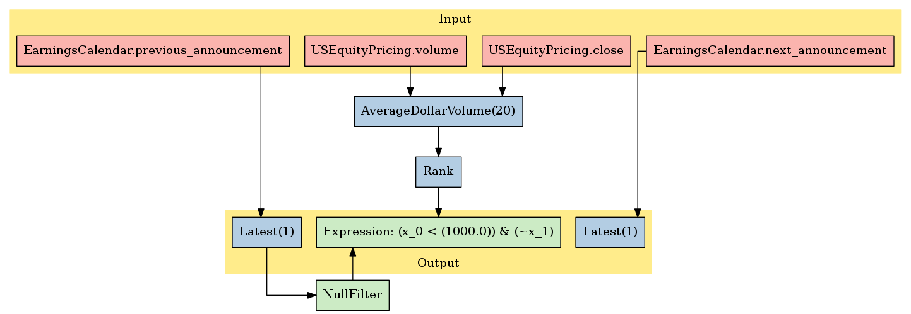

EventVestor: Earnings Calendar
==============================

In this notebook, we’ll take a look at EventVestor’s *Earnings Calendar*
dataset, available on the `Quantopian
Store <https://www.quantopian.com/store>`__. This dataset spans January
01, 2007 through the current day, and documents the quarterly earnings
releases calendar indicating date and time of reporting.

Notebook Contents
-----------------

There are two ways to access the data and you’ll find both of them
listed below. Just click on the section you’d like to read through.

-  Interactive overview: This is only available on Research and uses
   blaze to give you access to large amounts of data. Recommended for
   exploration and plotting.
-  Pipeline overview: Data is made available through pipeline which is
   available on both the Research & Backtesting environment. Recommended
   for custom factor development and moving back & forth between
   research/backtesting.

Free samples and limits
~~~~~~~~~~~~~~~~~~~~~~~

One key caveat: we limit the number of results returned from any given
expression to 10,000 to protect against runaway memory usage. To be
clear, you have access to all the data server side. We are limiting the
size of the responses back from Blaze.

There is a *free* version of this dataset as well as a paid one. The
free sample includes data until 2 months prior to the current date.

To access the most up-to-date values for this data set for trading a
live algorithm (as with other partner sets), you need to purchase acess
to the full set.

With preamble in place, let’s get started:

#Interactive Overview ### Accessing the data with Blaze and Interactive
on Research Partner datasets are available on Quantopian Research
through an API service known as `Blaze <http://blaze.pydata.org>`__.
Blaze provides the Quantopian user with a convenient interface to access
very large datasets, in an interactive, generic manner.

Blaze provides an important function for accessing these datasets. Some
of these sets are many millions of records. Bringing that data directly
into Quantopian Research directly just is not viable. So Blaze allows us
to provide a simple querying interface and shift the burden over to the
server side.

It is common to use Blaze to reduce your dataset in size, convert it
over to Pandas and then to use Pandas for further computation,
manipulation and visualization.

Helpful links: \* `Query building for
Blaze <http://blaze.readthedocs.io/en/latest/queries.html>`__ \*
`Pandas-to-Blaze
dictionary <http://blaze.readthedocs.io/en/latest/rosetta-pandas.html>`__
\* `SQL-to-Blaze
dictionary <http://blaze.readthedocs.io/en/latest/rosetta-sql.html>`__.

| Once you’ve limited the size of your Blaze object, you can convert it
  to a Pandas DataFrames using: > ``from odo import odo``
| > ``odo(expr, pandas.DataFrame)``

###To see how this data can be used in your algorithm, search for the
``Pipeline Overview`` section of this notebook or head straight to
Pipeline Overview

.. code:: ipython2

    # import the dataset
    from quantopian.interactive.data.eventvestor import earnings_calendar as dataset
    
    # or if you want to import the free dataset, use:
    # from quantopian.data.eventvestor import earnings_calendar_free
    
    # import data operations
    from odo import odo
    # import other libraries we will use
    import pandas as pd
    import matplotlib.pyplot as plt

.. code:: ipython2

    # Let's use blaze to understand the data a bit using Blaze dshape()
    dataset.dshape

.. parsed-literal::

    dshape("""var * {
      event_id: float64,
      trade_date: ?datetime,
      symbol: string,
      event_type: ?string,
      event_headline: ?string,
      event_phase: float64,
      calendar_date: ?datetime,
      calendar_time: ?string,
      event_rating: float64,
      sid: int64,
      asof_date: datetime,
      timestamp: datetime
      }""")

.. code:: ipython2

    # And how many rows are there?
    # N.B. we're using a Blaze function to do this, not len()
    dataset.count()

.. raw:: html

    136400

.. code:: ipython2

    # Let's see what the data looks like. We'll grab the first three rows.
    dataset[:3]

.. raw:: html

    <table border="1" class="dataframe">
      <thead>
        <tr style="text-align: right;">
          <th></th>
          <th>event_id</th>
          <th>trade_date</th>
          <th>symbol</th>
          <th>event_type</th>
          <th>event_headline</th>
          <th>event_phase</th>
          <th>calendar_date</th>
          <th>calendar_time</th>
          <th>event_rating</th>
          <th>sid</th>
          <th>asof_date</th>
          <th>timestamp</th>
        </tr>
      </thead>
      <tbody>
        <tr>
          <th>0</th>
          <td>1969337</td>
          <td>2007-01-03</td>
          <td>AA</td>
          <td>Earnings Calendar</td>
          <td>Alcoa to Report Quarterly Financial Results on...</td>
          <td>NaN</td>
          <td>2007-01-10</td>
          <td>Before Market Open</td>
          <td>1</td>
          <td>2</td>
          <td>2007-01-03</td>
          <td>2007-01-04</td>
        </tr>
        <tr>
          <th>1</th>
          <td>1969338</td>
          <td>2007-01-03</td>
          <td>ABT</td>
          <td>Earnings Calendar</td>
          <td>Abbott Laboratories to Report Quarterly Financ...</td>
          <td>NaN</td>
          <td>2007-01-24</td>
          <td>Before Market Open</td>
          <td>1</td>
          <td>62</td>
          <td>2007-01-03</td>
          <td>2007-01-04</td>
        </tr>
        <tr>
          <th>2</th>
          <td>1969341</td>
          <td>2007-01-03</td>
          <td>AEPI</td>
          <td>Earnings Calendar</td>
          <td>AEP Industries to Report Quarterly Financial R...</td>
          <td>NaN</td>
          <td>2007-01-10</td>
          <td>After Market Close</td>
          <td>1</td>
          <td>162</td>
          <td>2007-01-03</td>
          <td>2007-01-04</td>
        </tr>
      </tbody>
    </table>

Let’s go over the columns: - **event_id**: the unique identifier for
this event. - **asof_date**: EventVestor’s timestamp of event capture. -
**trade_date**: for event announcements made before trading ends,
trade_date is the same as event_date. For announcements issued after
market close, trade_date is next market open day. - **symbol**: stock
ticker symbol of the affected company. - **event_type**: this should
always be *Earnings Calendar*. - **event_headline**: a brief description
of the event - **event_phase**: the inclusion of this field is likely an
error on the part of the data vendor. We’re currently attempting to
resolve this. - **calendar_date**: proposed earnings reporting date -
**calendar_time**: earnings release time: *before/after market hours*,
or *other*. - **event_rating**: this is always 1. The meaning of this is
uncertain. - **timestamp**: this is our timestamp on when we registered
the data. - **sid**: the equity’s unique identifier. Use this instead of
the symbol.

We’ve done much of the data processing for you. Fields like
``timestamp`` and ``sid`` are standardized across all our Store
Datasets, so the datasets are easy to combine. We have standardized the
``sid`` across all our equity databases.

We can select columns and rows with ease. Below, we’ll fetch all of
Apple’s entries from 2012.

.. code:: ipython2

    # get apple's sid first
    aapl_sid = symbols('AAPL').sid
    aapl_earnings = earnings_calendar[('2011-12-31' < earnings_calendar['asof_date']) & (earnings_calendar['asof_date'] <'2013-01-01') & (earnings_calendar.sid==aapl_sid)]
    # When displaying a Blaze Data Object, the printout is automatically truncated to ten rows.
    aapl_earnings.sort('asof_date')

.. raw:: html

    <table border="1" class="dataframe">
      <thead>
        <tr style="text-align: right;">
          <th></th>
          <th>event_id</th>
          <th>trade_date</th>
          <th>symbol</th>
          <th>event_type</th>
          <th>event_headline</th>
          <th>event_phase</th>
          <th>calendar_date</th>
          <th>calendar_time</th>
          <th>event_rating</th>
          <th>sid</th>
          <th>asof_date</th>
          <th>timestamp</th>
        </tr>
      </thead>
      <tbody>
        <tr>
          <th>0</th>
          <td>1963040</td>
          <td>2012-01-20</td>
          <td>AAPL</td>
          <td>Earnings Calendar</td>
          <td>Apple Inc. FY 12 First Quarter Results Confere...</td>
          <td>NaN</td>
          <td>2012-01-24</td>
          <td>After Market Close</td>
          <td>1</td>
          <td>24</td>
          <td>2012-01-20</td>
          <td>2012-01-21</td>
        </tr>
        <tr>
          <th>1</th>
          <td>1963035</td>
          <td>2012-04-20</td>
          <td>AAPL</td>
          <td>Earnings Calendar</td>
          <td>Apple Inc. FY 12 Second Quarter Results Confer...</td>
          <td>NaN</td>
          <td>2012-04-24</td>
          <td>After Market Close</td>
          <td>1</td>
          <td>24</td>
          <td>2012-04-20</td>
          <td>2012-04-21</td>
        </tr>
        <tr>
          <th>2</th>
          <td>1963033</td>
          <td>2012-07-20</td>
          <td>AAPL</td>
          <td>Earnings Calendar</td>
          <td>Apple Inc. FY 12 Third Quarter Results Confere...</td>
          <td>NaN</td>
          <td>2012-07-24</td>
          <td>After Market Close</td>
          <td>1</td>
          <td>24</td>
          <td>2012-07-20</td>
          <td>2012-07-21</td>
        </tr>
        <tr>
          <th>3</th>
          <td>1963031</td>
          <td>2012-10-24</td>
          <td>AAPL</td>
          <td>Earnings Calendar</td>
          <td>Apple Inc. FY 12 Fourth Quarter Results Confer...</td>
          <td>NaN</td>
          <td>2012-10-25</td>
          <td>After Market Close</td>
          <td>1</td>
          <td>24</td>
          <td>2012-10-24</td>
          <td>2012-10-25</td>
        </tr>
      </tbody>
    </table>

Finally, suppose we want a DataFrame of all earnings calendar releases
in February 2012, but we only want the event_headline and the
calendar_time.

.. code:: ipython2

    # manipulate with Blaze first:
    feb_2012 = earnings_calendar[(earnings_calendar['asof_date'] < '2012-03-01')&('2012-02-01' <= earnings_calendar['asof_date'])]
    # now that we've got a much smaller object, we can convert it to a pandas DataFrame
    feb_df = odo(feb_2012, pd.DataFrame)
    reduced = feb_df[['event_headline','calendar_time']]
    # When printed: pandas DataFrames display the head(30) and tail(30) rows, and truncate the middle.
    reduced

.. raw:: html

    

    <table border="1" class="dataframe">
      <thead>
        <tr style="text-align: right;">
          <th></th>
          <th>event_headline</th>
          <th>calendar_time</th>
        </tr>
      </thead>
      <tbody>
        <tr>
          <th>0</th>
          <td>BMC Software to Report Quarterly Financial Res...</td>
          <td>After Market Close</td>
        </tr>
        <tr>
          <th>1</th>
          <td>Devon Energy Corp. to Report Quarterly Financi...</td>
          <td>Before Market Open</td>
        </tr>
        <tr>
          <th>2</th>
          <td>Ecolab to Report Quarterly Financial Results o...</td>
          <td>Before Market Open</td>
        </tr>
        <tr>
          <th>3</th>
          <td>Farmer Bros to Report Quarterly Financial Resu...</td>
          <td>After Market Close</td>
        </tr>
        <tr>
          <th>4</th>
          <td>CGI Group, Inc. to Report Quarterly Financial ...</td>
          <td>Before Market Open</td>
        </tr>
        <tr>
          <th>5</th>
          <td>Genuine Parts Co to Report Quarterly Financial...</td>
          <td>Before Market Open</td>
        </tr>
        <tr>
          <th>6</th>
          <td>US Global Inv to Report Quarterly Financial Re...</td>
          <td>After Market Close</td>
        </tr>
        <tr>
          <th>7</th>
          <td>Hawkins to Report Quarterly Financial Results ...</td>
          <td>After Market Close</td>
        </tr>
        <tr>
          <th>8</th>
          <td>Multi-Color to Report Quarterly Financial Resu...</td>
          <td>Before Market Open</td>
        </tr>
        <tr>
          <th>9</th>
          <td>Medical Action Inds to Report Quarterly Financ...</td>
          <td>Before Market Open</td>
        </tr>
        <tr>
          <th>10</th>
          <td>Mission West to Report Quarterly Financial Res...</td>
          <td>After Market Close</td>
        </tr>
        <tr>
          <th>11</th>
          <td>Nordson Cp to Report Quarterly Financial Resul...</td>
          <td>After Market Close</td>
        </tr>
        <tr>
          <th>12</th>
          <td>Network Equipment Tech, Inc. to Report Quarter...</td>
          <td>After Market Close</td>
        </tr>
        <tr>
          <th>13</th>
          <td>PMFG to Report Quarterly Financial Results on ...</td>
          <td>Before Market Open</td>
        </tr>
        <tr>
          <th>14</th>
          <td>PS Business Parks to Report Quarterly Financia...</td>
          <td>After Market Close</td>
        </tr>
        <tr>
          <th>15</th>
          <td>Penn Virginia to Report Quarterly Financial Re...</td>
          <td>After Market Close</td>
        </tr>
        <tr>
          <th>16</th>
          <td>Savannah Bancorp to Report Quarterly Financial...</td>
          <td>After Market Close</td>
        </tr>
        <tr>
          <th>17</th>
          <td>Transatlantic Hldgs to Report Quarterly Financ...</td>
          <td>After Market Close</td>
        </tr>
        <tr>
          <th>18</th>
          <td>UIL Holdings to Report Quarterly Financial Res...</td>
          <td>After Market Close</td>
        </tr>
        <tr>
          <th>19</th>
          <td>VF to Report Quarterly Financial Results on Fe...</td>
          <td>Before Market Open</td>
        </tr>
        <tr>
          <th>20</th>
          <td>Watsco to Report Quarterly Financial Results o...</td>
          <td>Before Market Open</td>
        </tr>
        <tr>
          <th>21</th>
          <td>Microchip Technlgy to Report Quarterly Financi...</td>
          <td>After Market Close</td>
        </tr>
        <tr>
          <th>22</th>
          <td>Vical to Report Quarterly Financial Results on...</td>
          <td>Before Market Open</td>
        </tr>
        <tr>
          <th>23</th>
          <td>Measurement Specialties to Report Quarterly Fi...</td>
          <td>After Market Close</td>
        </tr>
        <tr>
          <th>24</th>
          <td>Innodata Isogen to Report Quarterly Financial ...</td>
          <td>Before Market Open</td>
        </tr>
        <tr>
          <th>25</th>
          <td>Ameristar Casino to Report Quarterly Financial...</td>
          <td>Before Market Open</td>
        </tr>
        <tr>
          <th>26</th>
          <td>U.S. Lime &amp; Minerals, Inc. to Report Quarterly...</td>
          <td>After Market Close</td>
        </tr>
        <tr>
          <th>27</th>
          <td>Biocryst Pharmaceuticals to Report Quarterly F...</td>
          <td>Before Market Open</td>
        </tr>
        <tr>
          <th>28</th>
          <td>ACI Worldwide to Report Quarterly Financial Re...</td>
          <td>Before Market Open</td>
        </tr>
        <tr>
          <th>29</th>
          <td>Henry Schein to Report Quarterly Financial Res...</td>
          <td>Before Market Open</td>
        </tr>
        <tr>
          <th>...</th>
          <td>...</td>
          <td>...</td>
        </tr>
        <tr>
          <th>1373</th>
          <td>Global Sources to Report Quarterly Financial R...</td>
          <td>Before Market Open</td>
        </tr>
        <tr>
          <th>1374</th>
          <td>MIND C T I Ltd to Report Quarterly Financial R...</td>
          <td>Before Market Open</td>
        </tr>
        <tr>
          <th>1375</th>
          <td>SureWest Communications to Report Quarterly Fi...</td>
          <td>Before Market Open</td>
        </tr>
        <tr>
          <th>1376</th>
          <td>Guess to Report Quarterly Financial Results on...</td>
          <td>After Market Close</td>
        </tr>
        <tr>
          <th>1377</th>
          <td>Hilltop Holdings to Report Quarterly Financial...</td>
          <td>Before Market Open</td>
        </tr>
        <tr>
          <th>1378</th>
          <td>First Acceptance to Report Quarterly Financial...</td>
          <td>After Market Close</td>
        </tr>
        <tr>
          <th>1379</th>
          <td>Endeavor International to Report Quarterly Fin...</td>
          <td>Before Market Open</td>
        </tr>
        <tr>
          <th>1380</th>
          <td>Dresser-Rand Group to Report Quarterly Financi...</td>
          <td>After Market Close</td>
        </tr>
        <tr>
          <th>1381</th>
          <td>The Babcock &amp; Wilcox to Report Quarterly Finan...</td>
          <td>After Market Close</td>
        </tr>
        <tr>
          <th>1382</th>
          <td>VirnetX Holding to Report Quarterly Financial ...</td>
          <td>After Market Close</td>
        </tr>
        <tr>
          <th>1383</th>
          <td>ZIOPHARM Oncology to Report Quarterly Financia...</td>
          <td>After Market Close</td>
        </tr>
        <tr>
          <th>1384</th>
          <td>Cal Dive International to Report Quarterly Fin...</td>
          <td>After Market Close</td>
        </tr>
        <tr>
          <th>1385</th>
          <td>Yingli Green Energy Hldg ADS to Report Quarter...</td>
          <td>Before Market Open</td>
        </tr>
        <tr>
          <th>1386</th>
          <td>Resolute Energy to Report Quarterly Financial ...</td>
          <td>Before Market Open</td>
        </tr>
        <tr>
          <th>1387</th>
          <td>Stream Global Services to Report Quarterly Fin...</td>
          <td>After Market Close</td>
        </tr>
        <tr>
          <th>1388</th>
          <td>Memsic, Inc. to Report Quarterly Financial Res...</td>
          <td>After Market Close</td>
        </tr>
        <tr>
          <th>1389</th>
          <td>MYR Group, Inc. to Report Quarterly Financial ...</td>
          <td>After Market Close</td>
        </tr>
        <tr>
          <th>1390</th>
          <td>Global Ship Lease to Report Quarterly Financia...</td>
          <td>Before Market Open</td>
        </tr>
        <tr>
          <th>1391</th>
          <td>Westport Innovations to Report Quarterly Finan...</td>
          <td>Before Market Open</td>
        </tr>
        <tr>
          <th>1392</th>
          <td>Dollar General to Report Quarterly Financial R...</td>
          <td>Before Market Open</td>
        </tr>
        <tr>
          <th>1393</th>
          <td>Douglas Dynamics to Report Quarterly Financial...</td>
          <td>Before Market Open</td>
        </tr>
        <tr>
          <th>1394</th>
          <td>Accretive Health to Report Quarterly Financial...</td>
          <td>Before Market Open</td>
        </tr>
        <tr>
          <th>1395</th>
          <td>Fresh Market to Report Quarterly Financial Res...</td>
          <td>Before Market Open</td>
        </tr>
        <tr>
          <th>1396</th>
          <td>RigNet to Report Quarterly Financial Results o...</td>
          <td>Before Market Open</td>
        </tr>
        <tr>
          <th>1397</th>
          <td>FairPoint Communications Inc to Report Quarter...</td>
          <td>After Market Close</td>
        </tr>
        <tr>
          <th>1398</th>
          <td>InterXion Holding to Report Quarterly Financia...</td>
          <td>Before Market Open</td>
        </tr>
        <tr>
          <th>1399</th>
          <td>Huntington Ingalls Industries  to Report Quart...</td>
          <td>Before Market Open</td>
        </tr>
        <tr>
          <th>1400</th>
          <td>Tudou Holdings Limited  to Report Quarterly Fi...</td>
          <td>Before Market Open</td>
        </tr>
        <tr>
          <th>1401</th>
          <td>Acadia Healthcare Company Inc. to Report Quart...</td>
          <td>After Market Close</td>
        </tr>
        <tr>
          <th>1402</th>
          <td>Guidewire Software Inc. to Report Quarterly Fi...</td>
          <td>Before Market Open</td>
        </tr>
      </tbody>
    </table>
    
1403 rows × 2 columns

    

#Pipeline Overview

Accessing the data in your algorithms & research
~~~~~~~~~~~~~~~~~~~~~~~~~~~~~~~~~~~~~~~~~~~~~~~~

The only method for accessing partner data within algorithms running on
Quantopian is via the pipeline API. Different data sets work differently
but in the case of this data, you can add this data to your pipeline as
follows:

Import the data set here >
``from quantopian.pipeline.data.eventvestor import EarningsCalendar``

Then in intialize() you could do something simple like adding the raw
value of one of the fields to your pipeline: >
``pipe.add(EarningsCalendar.previous_announcement.latest, 'previous_announcement')``

.. code:: ipython2

    # Import necessary Pipeline modules
    from quantopian.pipeline import Pipeline
    from quantopian.research import run_pipeline
    from quantopian.pipeline.factors import AverageDollarVolume

.. code:: ipython2

    # For use in your algorithms
    # Using the full dataset in your pipeline algo
    from quantopian.pipeline.data.eventvestor import EarningsCalendar
    
    # To use built-in Pipeline factors for this dataset
    from quantopian.pipeline.factors.eventvestor import (
    BusinessDaysUntilNextEarnings,
    BusinessDaysSincePreviousEarnings
    )

Now that we’ve imported the data, let’s take a look at which fields are
available for each dataset.

You’ll find the dataset, the available fields, and the datatypes for
each of those fields.

.. code:: ipython2

    print "Here are the list of available fields per dataset:"
    print "---------------------------------------------------\n"
    
    def _print_fields(dataset):
        print "Dataset: %s\n" % dataset.__name__
        print "Fields:"
        for field in list(dataset.columns):
            print "%s - %s" % (field.name, field.dtype)
        print "\n"
    
    for data in (EarningsCalendar,):
        _print_fields(data)
    
    
    print "---------------------------------------------------\n"

.. parsed-literal::

    Here are the list of available fields per dataset:
    ---------------------------------------------------
    
    Dataset: EarningsCalendar
    
    Fields:
    previous_announcement - datetime64[ns]
    next_announcement - datetime64[ns]
    
    
    ---------------------------------------------------
    

Now that we know what fields we have access to, let’s see what this data
looks like when we run it through Pipeline.

This is constructed the same way as you would in the backtester. For
more information on using Pipeline in Research view this thread:
https://www.quantopian.com/posts/pipeline-in-research-build-test-and-visualize-your-factors-and-filters

.. code:: ipython2

    # Let's see what this data looks like when we run it through Pipeline
    # This is constructed the same way as you would in the backtester. For more information
    # on using Pipeline in Research view this thread:
    # https://www.quantopian.com/posts/pipeline-in-research-build-test-and-visualize-your-factors-and-filters
    pipe = Pipeline()
           
    pipe.add(EarningsCalendar.previous_announcement.latest, 'previous_announcement')
    pipe.add(EarningsCalendar.next_announcement.latest, 'next_announcement')
    pipe.add(BusinessDaysSincePreviousEarnings(), "business_days_since")

.. code:: ipython2

    # Setting some basic liquidity strings (just for good habit)
    dollar_volume = AverageDollarVolume(window_length=20)
    top_1000_most_liquid = dollar_volume.rank(ascending=False) < 1000
    
    pipe.set_screen(top_1000_most_liquid & EarningsCalendar.previous_announcement.latest.notnull())

.. code:: ipython2

    # The show_graph() method of pipeline objects produces a graph to show how it is being calculated.
    pipe.show_graph(format='png')

.. code:: ipython2

    # run_pipeline will show the output of your pipeline
    pipe_output = run_pipeline(pipe, start_date='2013-11-01', end_date='2013-11-25')
    pipe_output

.. raw:: html

    

    <table border="1" class="dataframe">
      <thead>
        <tr style="text-align: right;">
          <th></th>
          <th></th>
          <th>next_announcement</th>
          <th>previous_announcement</th>
        </tr>
      </thead>
      <tbody>
        <tr>
          <th rowspan="30" valign="top">2013-11-01 00:00:00+00:00</th>
          <th>Equity(2 [AA])</th>
          <td>NaT</td>
          <td>2013-10-08</td>
        </tr>
        <tr>
          <th>Equity(24 [AAPL])</th>
          <td>NaT</td>
          <td>2013-10-28</td>
        </tr>
        <tr>
          <th>Equity(62 [ABT])</th>
          <td>NaT</td>
          <td>2013-10-16</td>
        </tr>
        <tr>
          <th>Equity(64 [ABX])</th>
          <td>NaT</td>
          <td>2013-10-31</td>
        </tr>
        <tr>
          <th>Equity(67 [ADSK])</th>
          <td>NaT</td>
          <td>2013-08-22</td>
        </tr>
        <tr>
          <th>Equity(76 [TAP])</th>
          <td>2013-11-06</td>
          <td>2013-08-06</td>
        </tr>
        <tr>
          <th>Equity(88 [ACI])</th>
          <td>NaT</td>
          <td>2013-10-29</td>
        </tr>
        <tr>
          <th>Equity(114 [ADBE])</th>
          <td>NaT</td>
          <td>2013-09-17</td>
        </tr>
        <tr>
          <th>Equity(122 [ADI])</th>
          <td>2013-11-26</td>
          <td>2013-08-20</td>
        </tr>
        <tr>
          <th>Equity(128 [ADM])</th>
          <td>NaT</td>
          <td>2013-10-29</td>
        </tr>
        <tr>
          <th>Equity(154 [AEM])</th>
          <td>NaT</td>
          <td>2012-10-24</td>
        </tr>
        <tr>
          <th>Equity(161 [AEP])</th>
          <td>NaT</td>
          <td>2013-10-23</td>
        </tr>
        <tr>
          <th>Equity(166 [AES])</th>
          <td>2013-11-07</td>
          <td>2013-08-08</td>
        </tr>
        <tr>
          <th>Equity(168 [AET])</th>
          <td>NaT</td>
          <td>2013-10-29</td>
        </tr>
        <tr>
          <th>Equity(185 [AFL])</th>
          <td>NaT</td>
          <td>2013-10-29</td>
        </tr>
        <tr>
          <th>Equity(197 [AGCO])</th>
          <td>NaT</td>
          <td>2013-10-29</td>
        </tr>
        <tr>
          <th>Equity(216 [HES])</th>
          <td>NaT</td>
          <td>2013-10-30</td>
        </tr>
        <tr>
          <th>Equity(239 [AIG])</th>
          <td>NaT</td>
          <td>2013-10-31</td>
        </tr>
        <tr>
          <th>Equity(273 [ALU])</th>
          <td>NaT</td>
          <td>2013-10-31</td>
        </tr>
        <tr>
          <th>Equity(300 [ALK])</th>
          <td>NaT</td>
          <td>2013-10-24</td>
        </tr>
        <tr>
          <th>Equity(328 [ALTR])</th>
          <td>NaT</td>
          <td>2013-10-22</td>
        </tr>
        <tr>
          <th>Equity(337 [AMAT])</th>
          <td>NaT</td>
          <td>2013-08-15</td>
        </tr>
        <tr>
          <th>Equity(338 [BEAM])</th>
          <td>NaT</td>
          <td>2013-10-31</td>
        </tr>
        <tr>
          <th>Equity(351 [AMD])</th>
          <td>NaT</td>
          <td>2013-10-17</td>
        </tr>
        <tr>
          <th>Equity(353 [AME])</th>
          <td>NaT</td>
          <td>2013-10-29</td>
        </tr>
        <tr>
          <th>Equity(357 [TWX])</th>
          <td>2013-11-06</td>
          <td>2013-08-07</td>
        </tr>
        <tr>
          <th>Equity(368 [AMGN])</th>
          <td>NaT</td>
          <td>2013-10-22</td>
        </tr>
        <tr>
          <th>Equity(410 [AN])</th>
          <td>NaT</td>
          <td>2013-10-24</td>
        </tr>
        <tr>
          <th>Equity(438 [AON])</th>
          <td>NaT</td>
          <td>2013-10-25</td>
        </tr>
        <tr>
          <th>Equity(448 [APA])</th>
          <td>2013-11-07</td>
          <td>2013-08-01</td>
        </tr>
        <tr>
          <th>...</th>
          <th>...</th>
          <td>...</td>
          <td>...</td>
        </tr>
        <tr>
          <th rowspan="30" valign="top">2013-11-25 00:00:00+00:00</th>
          <th>Equity(42027 [UBNT])</th>
          <td>NaT</td>
          <td>2013-11-07</td>
        </tr>
        <tr>
          <th>Equity(42118 [GRPN])</th>
          <td>NaT</td>
          <td>2013-11-07</td>
        </tr>
        <tr>
          <th>Equity(42165 [INVN])</th>
          <td>NaT</td>
          <td>2013-10-29</td>
        </tr>
        <tr>
          <th>Equity(42173 [DLPH])</th>
          <td>NaT</td>
          <td>2013-11-05</td>
        </tr>
        <tr>
          <th>Equity(42230 [TRIP])</th>
          <td>NaT</td>
          <td>2013-10-23</td>
        </tr>
        <tr>
          <th>Equity(42251 [WPX])</th>
          <td>NaT</td>
          <td>2013-11-07</td>
        </tr>
        <tr>
          <th>Equity(42263 [LPI])</th>
          <td>NaT</td>
          <td>2013-11-07</td>
        </tr>
        <tr>
          <th>Equity(42270 [KORS])</th>
          <td>NaT</td>
          <td>2013-11-05</td>
        </tr>
        <tr>
          <th>Equity(42277 [ZNGA])</th>
          <td>NaT</td>
          <td>2013-10-24</td>
        </tr>
        <tr>
          <th>Equity(42436 [SLCA])</th>
          <td>NaT</td>
          <td>2013-11-06</td>
        </tr>
        <tr>
          <th>Equity(42546 [PRLB])</th>
          <td>NaT</td>
          <td>2013-10-31</td>
        </tr>
        <tr>
          <th>Equity(42596 [YELP])</th>
          <td>NaT</td>
          <td>2013-10-29</td>
        </tr>
        <tr>
          <th>Equity(42611 [NSM])</th>
          <td>NaT</td>
          <td>2013-11-07</td>
        </tr>
        <tr>
          <th>Equity(42699 [VNTV])</th>
          <td>NaT</td>
          <td>2013-11-24</td>
        </tr>
        <tr>
          <th>Equity(42707 [VIPS])</th>
          <td>NaT</td>
          <td>2013-11-11</td>
        </tr>
        <tr>
          <th>Equity(42786 [MRC])</th>
          <td>NaT</td>
          <td>2013-10-31</td>
        </tr>
        <tr>
          <th>Equity(42788 [PSX])</th>
          <td>NaT</td>
          <td>2013-10-30</td>
        </tr>
        <tr>
          <th>Equity(42815 [SPLK])</th>
          <td>NaT</td>
          <td>2013-11-21</td>
        </tr>
        <tr>
          <th>Equity(42950 [FB])</th>
          <td>NaT</td>
          <td>2013-10-30</td>
        </tr>
        <tr>
          <th>Equity(43127 [NOW])</th>
          <td>NaT</td>
          <td>2013-10-23</td>
        </tr>
        <tr>
          <th>Equity(43399 [ADT])</th>
          <td>NaT</td>
          <td>2013-11-20</td>
        </tr>
        <tr>
          <th>Equity(43405 [KRFT])</th>
          <td>NaT</td>
          <td>2013-10-30</td>
        </tr>
        <tr>
          <th>Equity(43413 [TRLA])</th>
          <td>NaT</td>
          <td>2013-10-29</td>
        </tr>
        <tr>
          <th>Equity(43512 [FANG])</th>
          <td>NaT</td>
          <td>2013-05-09</td>
        </tr>
        <tr>
          <th>Equity(43694 [ABBV])</th>
          <td>NaT</td>
          <td>2013-10-25</td>
        </tr>
        <tr>
          <th>Equity(43919 [LMCA])</th>
          <td>NaT</td>
          <td>2013-11-05</td>
        </tr>
        <tr>
          <th>Equity(44060 [ZTS])</th>
          <td>NaT</td>
          <td>2013-11-05</td>
        </tr>
        <tr>
          <th>Equity(44645 [VOYA])</th>
          <td>NaT</td>
          <td>2013-11-08</td>
        </tr>
        <tr>
          <th>Equity(44747 [DATA])</th>
          <td>NaT</td>
          <td>2013-10-28</td>
        </tr>
        <tr>
          <th>Equity(44931 [NWSA])</th>
          <td>NaT</td>
          <td>2013-11-11</td>
        </tr>
      </tbody>
    </table>
    
13823 rows × 2 columns

    

Taking what we’ve seen from above, let’s see how we’d move that into the
backtester.

.. code:: ipython2

    # This section is only importable in the backtester
    from quantopian.algorithm import attach_pipeline, pipeline_output
    
    # General pipeline imports
    from quantopian.pipeline import Pipeline
    from quantopian.pipeline.factors import AverageDollarVolume
    
    # Import the datasets available
    # For use in your algorithms
    # Using the full dataset in your pipeline algo
    from quantopian.pipeline.data.eventvestor import EarningsCalendar
    
    # To use built-in Pipeline factors for this dataset
    from quantopian.pipeline.factors.eventvestor import (
    BusinessDaysUntilNextEarnings,
    BusinessDaysSincePreviousEarnings
    )
    
    def make_pipeline():
        # Create our pipeline
        pipe = Pipeline()
        
        # Screen out penny stocks and low liquidity securities.
        dollar_volume = AverageDollarVolume(window_length=20)
        is_liquid = dollar_volume.rank(ascending=False) < 1000
        
        # Create the mask that we will use for our percentile methods.
        base_universe = (is_liquid)
    
        # Add pipeline factors
        pipe.add(EarningsCalendar.previous_announcement.latest, 'previous_announcement')
        pipe.add(EarningsCalendar.next_announcement.latest, 'next_announcement')
        pipe.add(BusinessDaysSincePreviousEarnings(), "business_days_since")
    
        # Set our pipeline screens
        pipe.set_screen(is_liquid)
        return pipe
    
    def initialize(context):
        attach_pipeline(make_pipeline(), "pipeline")
        
    def before_trading_start(context, data):
        results = pipeline_output('pipeline')

Now you can take that and begin to use it as a building block for your
algorithms, for more examples on how to do that you can visit our data
pipeline factor library
