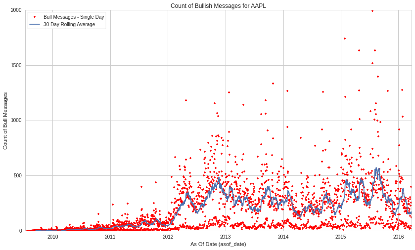
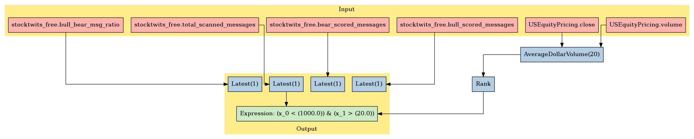

PsychSignal: StockTwits Trader Mood (All Fields)
================================================

In this notebook, we’ll take a look at PsychSignal’s *StockTwits Trader
Mood (All Fields)* dataset, available on the `Quantopian
Store <https://www.quantopian.com/store>`__. This dataset spans 2009
through the current day, and documents the mood of traders based on
their messages.

Notebook Contents
-----------------

There are two ways to access the data and you’ll find both of them
listed below. Just click on the section you’d like to read through.

-  Interactive overview: This is only available on Research and uses
   blaze to give you access to large amounts of data. Recommended for
   exploration and plotting.
-  Pipeline overview: Data is made available through pipeline which is
   available on both the Research & Backtesting environment. Recommended
   for custom factor development and moving back & forth between
   research/backtesting.

Free samples and limits
~~~~~~~~~~~~~~~~~~~~~~~

One key caveat: we limit the number of results returned from any given
expression to 10,000 to protect against runaway memory usage. To be
clear, you have access to all the data server side. We are limiting the
size of the responses back from Blaze.

There is a *free* version of this dataset as well as a paid one. The
free sample includes data until 2 months prior to the current date.

To access the most up-to-date values for this data set for trading a
live algorithm (as with other partner sets), you need to purchase acess
to the full set.

With preamble in place, let’s get started:

#Interactive Overview ### Accessing the data with Blaze and Interactive
on Research Partner datasets are available on Quantopian Research
through an API service known as `Blaze <http://blaze.pydata.org>`__.
Blaze provides the Quantopian user with a convenient interface to access
very large datasets, in an interactive, generic manner.

Blaze provides an important function for accessing these datasets. Some
of these sets are many millions of records. Bringing that data directly
into Quantopian Research directly just is not viable. So Blaze allows us
to provide a simple querying interface and shift the burden over to the
server side.

It is common to use Blaze to reduce your dataset in size, convert it
over to Pandas and then to use Pandas for further computation,
manipulation and visualization.

Helpful links: \* `Query building for
Blaze <http://blaze.readthedocs.io/en/latest/queries.html>`__ \*
`Pandas-to-Blaze
dictionary <http://blaze.readthedocs.io/en/latest/rosetta-pandas.html>`__
\* `SQL-to-Blaze
dictionary <http://blaze.readthedocs.io/en/latest/rosetta-sql.html>`__.

| Once you’ve limited the size of your Blaze object, you can convert it
  to a Pandas DataFrames using: > ``from odo import odo``
| > ``odo(expr, pandas.DataFrame)``

###To see how this data can be used in your algorithm, search for the
``Pipeline Overview`` section of this notebook or head straight to
Pipeline Overview

.. code:: ipython2

    # import the free sample of the dataset
    from quantopian.interactive.data.psychsignal import stocktwits_free  as dataset
    
    # or if you want to import the full dataset, use:
    # from quantopian.interactive.data.psychsignal import stocktwits
    
    # import data operations
    from odo import odo
    # import other libraries we will use
    import pandas as pd
    import matplotlib.pyplot as plt

.. code:: ipython2

    # Let's use blaze to understand the data a bit using Blaze dshape()
    dataset.dshape

.. parsed-literal::

    dshape("""var * {
      source: ?string,
      symbol: string,
      bullish_intensity: float64,
      bearish_intensity: float64,
      bull_minus_bear: float64,
      bull_scored_messages: float64,
      bear_scored_messages: float64,
      bull_bear_msg_ratio: float64,
      total_scanned_messages: float64,
      sid: int64,
      asof_date: datetime,
      timestamp: datetime
      }""")

.. code:: ipython2

    # And how many rows are there?
    # N.B. we're using a Blaze function to do this, not len()
    dataset.count()

.. raw:: html

    2993191

.. code:: ipython2

    # Let's see what the data looks like. We'll grab the first three rows.
    dataset[:3]

.. raw:: html

    <table border="1" class="dataframe">
      <thead>
        <tr style="text-align: right;">
          <th></th>
          <th>source</th>
          <th>symbol</th>
          <th>bullish_intensity</th>
          <th>bearish_intensity</th>
          <th>bull_minus_bear</th>
          <th>bull_scored_messages</th>
          <th>bear_scored_messages</th>
          <th>bull_bear_msg_ratio</th>
          <th>total_scanned_messages</th>
          <th>sid</th>
          <th>asof_date</th>
          <th>timestamp</th>
        </tr>
      </thead>
      <tbody>
        <tr>
          <th>0</th>
          <td>stocktwits</td>
          <td>AA</td>
          <td>1.19</td>
          <td>0.0</td>
          <td>1.19</td>
          <td>1</td>
          <td>0</td>
          <td>0</td>
          <td>2</td>
          <td>2</td>
          <td>2009-08-24 04:00:00</td>
          <td>2009-08-25 04:00:00</td>
        </tr>
        <tr>
          <th>1</th>
          <td>stocktwits</td>
          <td>AA</td>
          <td>1.33</td>
          <td>0.0</td>
          <td>1.33</td>
          <td>1</td>
          <td>0</td>
          <td>0</td>
          <td>2</td>
          <td>2</td>
          <td>2009-09-03 04:00:00</td>
          <td>2009-09-04 04:00:00</td>
        </tr>
        <tr>
          <th>2</th>
          <td>stocktwits</td>
          <td>AA</td>
          <td>2.50</td>
          <td>2.3</td>
          <td>0.20</td>
          <td>1</td>
          <td>1</td>
          <td>1</td>
          <td>2</td>
          <td>2</td>
          <td>2009-09-10 04:00:00</td>
          <td>2009-09-11 04:00:00</td>
        </tr>
      </tbody>
    </table>

There are two versions of each data set from PsychSignal. A simple
version with fewer fields and full version with more fields. This is an
basic data set with fewer fields.

Let’s go over the columns: - **asof_date**: The date to which this data
applies. - **symbol**: stock ticker symbol of the affected company. -
**source**: the same value for all records in this data set -
**bull_scored_messages**: total count of bullish sentiment messages
scored by PsychSignal’s algorithm - **bear_scored_messages**: total
count of bearish sentiment messages scored by PsychSignal’s algorithm -
**bullish_intensity**: score for each message’s language for the stength
of the bullishness present in the messages on a 0-4 scale. 0 indicates
no bullish sentiment measured, 4 indicates strongest bullish sentiment
measured. 4 is rare - **bearish_intensity**: score for each message’s
language for the stength of the bearish present in the messages on a 0-4
scale. 0 indicates no bearish sentiment measured, 4 indicates strongest
bearish sentiment measured. 4 is rare - **total_scanned_messages**:
number of messages coming through PsuchSignal’s feeds and attributable
to a symbol regardless of whether the PsychSignal sentiment engine can
score them for bullish or bearish intensity- **timestamp**: this is our
timestamp on when we registered the data. - **bull_minus_bear**:
subtracts the bearish intesity from the bullish intensity [BULL - BEAR]
to rpovide an immediate net score. - **bull_bear_msg_ratio**: the ratio
between bull scored messages and bear scored messages. - **sid**: the
equity’s unique identifier. Use this instead of the symbol.

We’ve done much of the data processing for you. Fields like
``timestamp`` and ``sid`` are standardized across all our Store
Datasets, so the datasets are easy to combine. We have standardized the
``sid`` across all our equity databases.

We can select columns and rows with ease. Below, we’ll fetch all rows
for Apple (sid 24) and explore the scores a bit with a chart.

.. code:: ipython2

    # Filtering for AAPL
    aapl = dataset[dataset.sid == 24]
    aapl_df = odo(aapl.sort('asof_date'), pd.DataFrame)
    plt.plot(aapl_df.asof_date, aapl_df.bull_scored_messages, marker='.', linestyle='None', color='r')
    plt.plot(aapl_df.asof_date, pd.rolling_mean(aapl_df.bull_scored_messages, 30))
    plt.xlabel("As Of Date (asof_date)")
    plt.ylabel("Count of Bull Messages")
    plt.title("Count of Bullish Messages for AAPL")
    plt.legend(["Bull Messages - Single Day", "30 Day Rolling Average"], loc=2)

.. parsed-literal::

    <matplotlib.legend.Legend at 0x7fb5059cee90>

#Pipeline Overview

Accessing the data in your algorithms & research
~~~~~~~~~~~~~~~~~~~~~~~~~~~~~~~~~~~~~~~~~~~~~~~~

The only method for accessing partner data within algorithms running on
Quantopian is via the pipeline API. Different data sets work differently
but in the case of this data, you can add this data to your pipeline as
follows:

Import the data set here >
``from quantopian.pipeline.data.psychsignal import (`` >
``stocktwits_free`` > ``)``

Then in intialize() you could do something simple like adding the raw
value of one of the fields to your pipeline: >
``pipe.add(stocktwits_free.total_scanned_messages.latest, 'total_scanned_messages')``

.. code:: ipython2

    # Import necessary Pipeline modules
    from quantopian.pipeline import Pipeline
    from quantopian.research import run_pipeline
    from quantopian.pipeline.factors import AverageDollarVolume

.. code:: ipython2

    # For use in your algorithms
    # Using the full paid dataset in your pipeline algo
    # from quantopian.pipeline.data.psychsignal import stocktwits
    
    # Using the free sample in your pipeline algo
    from quantopian.pipeline.data.psychsignal import stocktwits_free 

Now that we’ve imported the data, let’s take a look at which fields are
available for each dataset.

You’ll find the dataset, the available fields, and the datatypes for
each of those fields.

.. code:: ipython2

    print "Here are the list of available fields per dataset:"
    print "---------------------------------------------------\n"
    
    def _print_fields(dataset):
        print "Dataset: %s\n" % dataset.__name__
        print "Fields:"
        for field in list(dataset.columns):
            print "%s - %s" % (field.name, field.dtype)
        print "\n"
    
    for data in (stocktwits_free ,):
        _print_fields(data)
    
    
    print "---------------------------------------------------\n"

.. parsed-literal::

    Here are the list of available fields per dataset:
    ---------------------------------------------------
    
    Dataset: stocktwits_free
    
    Fields:
    bull_minus_bear - float64
    bullish_intensity - float64
    bull_bear_msg_ratio - float64
    bearish_intensity - float64
    total_scanned_messages - float64
    bull_scored_messages - float64
    bear_scored_messages - float64
    
    
    ---------------------------------------------------
    

Now that we know what fields we have access to, let’s see what this data
looks like when we run it through Pipeline.

This is constructed the same way as you would in the backtester. For
more information on using Pipeline in Research view this thread:
https://www.quantopian.com/posts/pipeline-in-research-build-test-and-visualize-your-factors-and-filters

.. code:: ipython2

    # Let's see what this data looks like when we run it through Pipeline
    # This is constructed the same way as you would in the backtester. For more information
    # on using Pipeline in Research view this thread:
    # https://www.quantopian.com/posts/pipeline-in-research-build-test-and-visualize-your-factors-and-filters
    pipe = Pipeline()
           
    pipe.add(stocktwits_free.total_scanned_messages.latest,
             'total_scanned_messages')
    pipe.add(stocktwits_free.bear_scored_messages .latest,
             'bear_scored_messages ')
    pipe.add(stocktwits_free.bull_scored_messages .latest,
             'bull_scored_messages ')
    pipe.add(stocktwits_free.bull_bear_msg_ratio .latest,
             'bull_bear_msg_ratio ')

.. code:: ipython2

    # Setting some basic liquidity strings (just for good habit)
    dollar_volume = AverageDollarVolume(window_length=20)
    top_1000_most_liquid = dollar_volume.rank(ascending=False) < 1000
    
    pipe.set_screen(top_1000_most_liquid &
                    (stocktwits_free.total_scanned_messages.latest>20))

.. code:: ipython2

    # The show_graph() method of pipeline objects produces a graph to show how it is being calculated.
    pipe.show_graph(format='png')

.. code:: ipython2

    # run_pipeline will show the output of your pipeline
    pipe_output = run_pipeline(pipe, start_date='2013-11-01', end_date='2013-11-25')
    pipe_output

.. raw:: html

    

    <table border="1" class="dataframe">
      <thead>
        <tr style="text-align: right;">
          <th></th>
          <th></th>
          <th>bear_scored_messages</th>
          <th>bull_bear_msg_ratio</th>
          <th>bull_scored_messages</th>
          <th>total_scanned_messages</th>
        </tr>
      </thead>
      <tbody>
        <tr>
          <th>2013-11-01 00:00:00+00:00</th>
          <th>Equity(21 [AAME])</th>
          <td>0</td>
          <td>0</td>
          <td>6</td>
          <td>30</td>
        </tr>
        <tr>
          <th>2013-11-04 00:00:00+00:00</th>
          <th>Equity(21 [AAME])</th>
          <td>0</td>
          <td>0</td>
          <td>6</td>
          <td>30</td>
        </tr>
        <tr>
          <th>2013-11-05 00:00:00+00:00</th>
          <th>Equity(21 [AAME])</th>
          <td>0</td>
          <td>0</td>
          <td>6</td>
          <td>30</td>
        </tr>
        <tr>
          <th>2013-11-06 00:00:00+00:00</th>
          <th>Equity(21 [AAME])</th>
          <td>0</td>
          <td>0</td>
          <td>6</td>
          <td>30</td>
        </tr>
        <tr>
          <th>2013-11-07 00:00:00+00:00</th>
          <th>Equity(21 [AAME])</th>
          <td>0</td>
          <td>0</td>
          <td>6</td>
          <td>30</td>
        </tr>
        <tr>
          <th>2013-11-08 00:00:00+00:00</th>
          <th>Equity(21 [AAME])</th>
          <td>0</td>
          <td>0</td>
          <td>6</td>
          <td>30</td>
        </tr>
        <tr>
          <th>2013-11-11 00:00:00+00:00</th>
          <th>Equity(21 [AAME])</th>
          <td>0</td>
          <td>0</td>
          <td>6</td>
          <td>30</td>
        </tr>
        <tr>
          <th>2013-11-12 00:00:00+00:00</th>
          <th>Equity(21 [AAME])</th>
          <td>0</td>
          <td>0</td>
          <td>6</td>
          <td>30</td>
        </tr>
      </tbody>
    </table>
    

Taking what we’ve seen from above, let’s see how we’d move that into the
backtester.

.. code:: ipython2

    # This section is only importable in the backtester
    from quantopian.algorithm import attach_pipeline, pipeline_output
    
    # General pipeline imports
    from quantopian.pipeline import Pipeline
    from quantopian.pipeline.factors import AverageDollarVolume
    
    # Import the datasets available
    # For use in your algorithms
    # Using the full paid dataset in your pipeline algo
    # from quantopian.pipeline.data.psychsignal import stocktwits
    
    # Using the free sample in your pipeline algo
    from quantopian.pipeline.data.psychsignal import stocktwits_free
    
    def make_pipeline():
        # Create our pipeline
        pipe = Pipeline()
        
        # Screen out penny stocks and low liquidity securities.
        dollar_volume = AverageDollarVolume(window_length=20)
        is_liquid = dollar_volume.rank(ascending=False) < 1000
        
        # Create the mask that we will use for our percentile methods.
        base_universe = (is_liquid)
    
        # Add pipeline factors
        pipe.add(stocktwits_free.total_scanned_messages.latest,
                 'total_scanned_messages')
        pipe.add(stocktwits_free.bear_scored_messages .latest,
                 'bear_scored_messages ')
        pipe.add(stocktwits_free.bull_scored_messages .latest,
                 'bull_scored_messages ')
        pipe.add(stocktwits_free.bull_bear_msg_ratio .latest,
                 'bull_bear_msg_ratio ')
    
        # Set our pipeline screens
        pipe.set_screen(is_liquid)
        return pipe
    
    def initialize(context):
        attach_pipeline(make_pipeline(), "pipeline")
        
    def before_trading_start(context, data):
        results = pipeline_output('pipeline')

Now you can take that and begin to use it as a building block for your
algorithms, for more examples on how to do that you can visit our data
pipeline factor library
