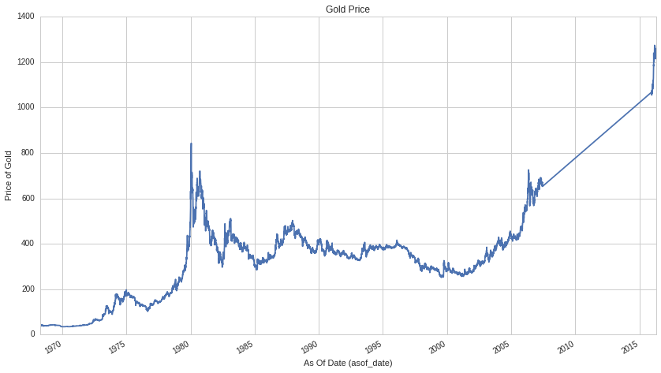
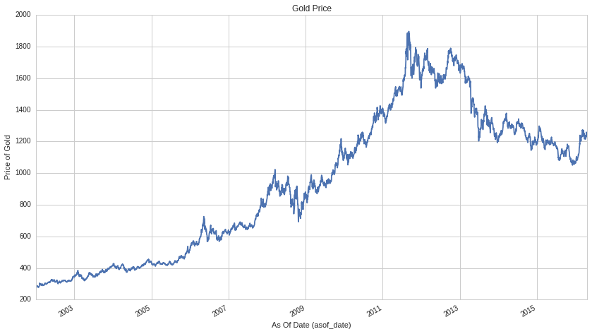
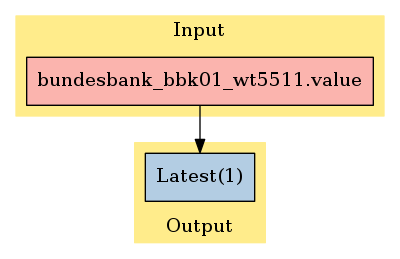

Quandl: Price of Gold
=====================

In this notebook, we’ll take a look at data set , available on
`Quantopian <https://www.quantopian.com/data>`__. This dataset spans
from 1968 through the current day. It contains the value for the price
of gold, as sourced by the Deutsche Bundesbank Data Repository. We
access this data via the API provided by Quandl. See `Quandl’s detail
page <https://www.quandl.com/data/BUNDESBANK/BBK01_WT5511-Gold-Price-USD>`__
for this set for more information.

Notebook Contents
-----------------

There are two ways to access the data and you’ll find both of them
listed below. Just click on the section you’d like to read through.

-  Interactive overview: This is only available on Research and uses
   blaze to give you access to large amounts of data. Recommended for
   exploration and plotting.
-  Pipeline overview: Data is made available through pipeline which is
   available on both the Research & Backtesting environment. Recommended
   for custom factor development and moving back & forth between
   research/backtesting.

Limits
~~~~~~

One key caveat: we limit the number of results returned from any given
expression to 10,000 to protect against runaway memory usage. To be
clear, you have access to all the data server side. We are limiting the
size of the responses back from Blaze.

With preamble in place, let’s get started:

#Interactive Overview ### Accessing the data with Blaze and Interactive
on Research Partner datasets are available on Quantopian Research
through an API service known as `Blaze <http://blaze.pydata.org>`__.
Blaze provides the Quantopian user with a convenient interface to access
very large datasets, in an interactive, generic manner.

Blaze provides an important function for accessing these datasets. Some
of these sets are many millions of records. Bringing that data directly
into Quantopian Research directly just is not viable. So Blaze allows us
to provide a simple querying interface and shift the burden over to the
server side.

It is common to use Blaze to reduce your dataset in size, convert it
over to Pandas and then to use Pandas for further computation,
manipulation and visualization.

Helpful links: \* `Query building for
Blaze <http://blaze.readthedocs.io/en/latest/queries.html>`__ \*
`Pandas-to-Blaze
dictionary <http://blaze.readthedocs.io/en/latest/rosetta-pandas.html>`__
\* `SQL-to-Blaze
dictionary <http://blaze.readthedocs.io/en/latest/rosetta-sql.html>`__.

| Once you’ve limited the size of your Blaze object, you can convert it
  to a Pandas DataFrames using: > ``from odo import odo``
| > ``odo(expr, pandas.DataFrame)``

###To see how this data can be used in your algorithm, search for the
``Pipeline Overview`` section of this notebook or head straight to
Pipeline Overview

.. code:: ipython2

    # import the dataset
    from quantopian.interactive.data.quandl import bundesbank_bbk01_wt5511 as dataset
    # Since this data is public domain and provided by Quandl for free, there is no _free version of this
    # data set, as found in the premium sets. This import gets you the entirety of this data set.
    
    # import data operations
    from odo import odo
    # import other libraries we will use
    import pandas as pd
    import matplotlib.pyplot as plt

.. code:: ipython2

    # Let's use blaze to understand the data a bit using Blaze dshape()
    dataset.dshape

.. parsed-literal::

    dshape("var * {value: float64, asof_date: datetime, timestamp: datetime}")

.. code:: ipython2

    # And how many rows are there?
    # N.B. we're using a Blaze function to do this, not len()
    dataset.count()

.. raw:: html

    12152

.. code:: ipython2

    # Let's see what the data looks like. We'll grab the first three rows.
    dataset[:3]

.. raw:: html

    <table border="1" class="dataframe">
      <thead>
        <tr style="text-align: right;">
          <th></th>
          <th>value</th>
          <th>asof_date</th>
          <th>timestamp</th>
        </tr>
      </thead>
      <tbody>
        <tr>
          <th>0</th>
          <td>1218.75</td>
          <td>2016-02-23</td>
          <td>2016-02-24 05:01:08.129270</td>
        </tr>
        <tr>
          <th>1</th>
          <td>1232.25</td>
          <td>2016-02-24</td>
          <td>2016-02-25 05:03:59.157245</td>
        </tr>
        <tr>
          <th>2</th>
          <td>1235.40</td>
          <td>2016-02-25</td>
          <td>2016-02-26 05:01:02.768591</td>
        </tr>
      </tbody>
    </table>

Let’s go plot it for fun.

.. code:: ipython2

    gold_df = odo(dataset, pd.DataFrame)
    
    gold_df.plot(x='asof_date', y='value')
    plt.xlabel("As Of Date (asof_date)")
    plt.ylabel("Price of Gold")
    plt.title("Gold Price")
    plt.legend().set_visible(False)

The data points between 2007 and 2015 are missing because the number of
results is limited to 10,000. Let’s narrow the timeframe to get a
complete picture of recent prices.

.. code:: ipython2

    small_df = odo(dataset[dataset.asof_date >= '2002-01-01'], pd.DataFrame)
    
    small_df.plot(x='asof_date', y='value')
    plt.xlabel("As Of Date (asof_date)")
    plt.ylabel("Price of Gold")
    plt.title("Gold Price")
    plt.legend().set_visible(False)

#Pipeline Overview

Accessing the data in your algorithms & research
~~~~~~~~~~~~~~~~~~~~~~~~~~~~~~~~~~~~~~~~~~~~~~~~

The only method for accessing partner data within algorithms running on
Quantopian is via the pipeline API. Different data sets work differently
but in the case of this data, you can add this data to your pipeline as
follows:

Import the data set here >
``from quantopian.pipeline.data.quandl import bundesbank_bbk01_wt5511 as gold``

Then in intialize() you could do something simple like adding the raw
value of one of the fields to your pipeline: >
``pipe.add(gold.value.latest, 'value')``

.. code:: ipython2

    # Import necessary Pipeline modules
    from quantopian.pipeline import Pipeline
    from quantopian.research import run_pipeline

.. code:: ipython2

    # For use in your algorithms
    # Using the full dataset in your pipeline algo
    from quantopian.pipeline.data.quandl import bundesbank_bbk01_wt5511 as gold

Now that we’ve imported the data, let’s take a look at which fields are
available for each dataset.

You’ll find the dataset, the available fields, and the datatypes for
each of those fields.

.. code:: ipython2

    print "Here are the list of available fields per dataset:"
    print "---------------------------------------------------\n"
    
    def _print_fields(dataset):
        print "Dataset: %s\n" % dataset.__name__
        print "Fields:"
        for field in list(dataset.columns):
            print "%s - %s" % (field.name, field.dtype)
        print "\n"
    
    for data in (gold,):
        _print_fields(data)
    
    
    print "---------------------------------------------------\n"

.. parsed-literal::

    Here are the list of available fields per dataset:
    ---------------------------------------------------
    
    Dataset: bundesbank_bbk01_wt5511
    
    Fields:
    value - float64
    
    
    ---------------------------------------------------
    

Now that we know what fields we have access to, let’s see what this data
looks like when we run it through Pipeline.

This is constructed the same way as you would in the backtester. For
more information on using Pipeline in Research view this thread:
https://www.quantopian.com/posts/pipeline-in-research-build-test-and-visualize-your-factors-and-filters

.. code:: ipython2

    # Let's see what this data looks like when we run it through Pipeline
    # This is constructed the same way as you would in the backtester. For more information
    # on using Pipeline in Research view this thread:
    # https://www.quantopian.com/posts/pipeline-in-research-build-test-and-visualize-your-factors-and-filters
    pipe = Pipeline()
           
    pipe.add(gold.value.latest, 'value')

.. code:: ipython2

    # The show_graph() method of pipeline objects produces a graph to show how it is being calculated.
    pipe.show_graph(format='png')

.. code:: ipython2

    # run_pipeline will show the output of your pipeline
    pipe_output = run_pipeline(pipe, start_date='2013-11-01', end_date='2013-11-25')
    pipe_output

.. raw:: html

    

    <table border="1" class="dataframe">
      <thead>
        <tr style="text-align: right;">
          <th></th>
          <th></th>
          <th>value</th>
        </tr>
      </thead>
      <tbody>
        <tr>
          <th rowspan="30" valign="top">2013-11-01 00:00:00+00:00</th>
          <th>Equity(2 [AA])</th>
          <td>1351.0</td>
        </tr>
        <tr>
          <th>Equity(21 [AAME])</th>
          <td>1351.0</td>
        </tr>
        <tr>
          <th>Equity(24 [AAPL])</th>
          <td>1351.0</td>
        </tr>
        <tr>
          <th>Equity(25 [AA_PR])</th>
          <td>1351.0</td>
        </tr>
        <tr>
          <th>Equity(31 [ABAX])</th>
          <td>1351.0</td>
        </tr>
        <tr>
          <th>Equity(39 [DDC])</th>
          <td>1351.0</td>
        </tr>
        <tr>
          <th>Equity(41 [ARCB])</th>
          <td>1351.0</td>
        </tr>
        <tr>
          <th>Equity(52 [ABM])</th>
          <td>1351.0</td>
        </tr>
        <tr>
          <th>Equity(53 [ABMD])</th>
          <td>1351.0</td>
        </tr>
        <tr>
          <th>Equity(62 [ABT])</th>
          <td>1351.0</td>
        </tr>
        <tr>
          <th>Equity(64 [ABX])</th>
          <td>1351.0</td>
        </tr>
        <tr>
          <th>Equity(66 [AB])</th>
          <td>1351.0</td>
        </tr>
        <tr>
          <th>Equity(67 [ADSK])</th>
          <td>1351.0</td>
        </tr>
        <tr>
          <th>Equity(69 [ACAT])</th>
          <td>1351.0</td>
        </tr>
        <tr>
          <th>Equity(70 [VBF])</th>
          <td>1351.0</td>
        </tr>
        <tr>
          <th>Equity(76 [TAP])</th>
          <td>1351.0</td>
        </tr>
        <tr>
          <th>Equity(84 [ACET])</th>
          <td>1351.0</td>
        </tr>
        <tr>
          <th>Equity(86 [ACG])</th>
          <td>1351.0</td>
        </tr>
        <tr>
          <th>Equity(88 [ACI])</th>
          <td>1351.0</td>
        </tr>
        <tr>
          <th>Equity(99 [ACO])</th>
          <td>1351.0</td>
        </tr>
        <tr>
          <th>Equity(100 [IEP])</th>
          <td>1351.0</td>
        </tr>
        <tr>
          <th>Equity(106 [ACU])</th>
          <td>1351.0</td>
        </tr>
        <tr>
          <th>Equity(110 [ACXM])</th>
          <td>1351.0</td>
        </tr>
        <tr>
          <th>Equity(112 [ACY])</th>
          <td>1351.0</td>
        </tr>
        <tr>
          <th>Equity(114 [ADBE])</th>
          <td>1351.0</td>
        </tr>
        <tr>
          <th>Equity(117 [AEY])</th>
          <td>1351.0</td>
        </tr>
        <tr>
          <th>Equity(122 [ADI])</th>
          <td>1351.0</td>
        </tr>
        <tr>
          <th>Equity(128 [ADM])</th>
          <td>1351.0</td>
        </tr>
        <tr>
          <th>Equity(134 [SXCL])</th>
          <td>1351.0</td>
        </tr>
        <tr>
          <th>Equity(149 [ADX])</th>
          <td>1351.0</td>
        </tr>
        <tr>
          <th>...</th>
          <th>...</th>
          <td>...</td>
        </tr>
        <tr>
          <th rowspan="30" valign="top">2013-11-25 00:00:00+00:00</th>
          <th>Equity(45864 [CDX])</th>
          <td>1248.5</td>
        </tr>
        <tr>
          <th>Equity(45865 [XNCR])</th>
          <td>1248.5</td>
        </tr>
        <tr>
          <th>Equity(45866 [ZU])</th>
          <td>1248.5</td>
        </tr>
        <tr>
          <th>Equity(45867 [EROS])</th>
          <td>1248.5</td>
        </tr>
        <tr>
          <th>Equity(45873 [IR_WI])</th>
          <td>1248.5</td>
        </tr>
        <tr>
          <th>Equity(45874 [ALLE])</th>
          <td>1248.5</td>
        </tr>
        <tr>
          <th>Equity(45875 [HFIN])</th>
          <td>1248.5</td>
        </tr>
        <tr>
          <th>Equity(45880 [CACQ])</th>
          <td>1248.5</td>
        </tr>
        <tr>
          <th>Equity(45882 [TKF_WD])</th>
          <td>1248.5</td>
        </tr>
        <tr>
          <th>Equity(45883 [IIF_WD])</th>
          <td>1248.5</td>
        </tr>
        <tr>
          <th>Equity(45885 [EGF_WD])</th>
          <td>1248.5</td>
        </tr>
        <tr>
          <th>Equity(45891 [OXFD])</th>
          <td>1248.5</td>
        </tr>
        <tr>
          <th>Equity(45892 [TLOG])</th>
          <td>1248.5</td>
        </tr>
        <tr>
          <th>Equity(45893 [VTL])</th>
          <td>1248.5</td>
        </tr>
        <tr>
          <th>Equity(45894 [RTGN])</th>
          <td>1248.5</td>
        </tr>
        <tr>
          <th>Equity(45895 [EMSH])</th>
          <td>1248.5</td>
        </tr>
        <tr>
          <th>Equity(45896 [AMZG])</th>
          <td>1248.5</td>
        </tr>
        <tr>
          <th>Equity(45902 [WBAI])</th>
          <td>1248.5</td>
        </tr>
        <tr>
          <th>Equity(45903 [GOMO])</th>
          <td>1248.5</td>
        </tr>
        <tr>
          <th>Equity(45904 [IPWR])</th>
          <td>1248.5</td>
        </tr>
        <tr>
          <th>Equity(45905 [GFIS])</th>
          <td>1248.5</td>
        </tr>
        <tr>
          <th>Equity(45906 [VNCE])</th>
          <td>1248.5</td>
        </tr>
        <tr>
          <th>Equity(45907 [RITT_W])</th>
          <td>1248.5</td>
        </tr>
        <tr>
          <th>Equity(45914 [EVGN])</th>
          <td>1248.5</td>
        </tr>
        <tr>
          <th>Equity(45915 [NVGS])</th>
          <td>1248.5</td>
        </tr>
        <tr>
          <th>Equity(48504 [ERUS])</th>
          <td>1248.5</td>
        </tr>
        <tr>
          <th>Equity(49010 [TBRA])</th>
          <td>1248.5</td>
        </tr>
        <tr>
          <th>Equity(49131 [OESX])</th>
          <td>1248.5</td>
        </tr>
        <tr>
          <th>Equity(49259 [ITUS])</th>
          <td>1248.5</td>
        </tr>
        <tr>
          <th>Equity(49523 [TLGT])</th>
          <td>1248.5</td>
        </tr>
      </tbody>
    </table>
    
134806 rows × 1 columns

    

Taking what we’ve seen from above, let’s see how we’d move that into the
backtester.

.. code:: ipython2

    # This section is only importable in the backtester
    from quantopian.algorithm import attach_pipeline, pipeline_output
    
    # General pipeline imports
    from quantopian.pipeline import Pipeline
    
    # Import the datasets available
    # For use in your algorithms
    # Using the full dataset in your pipeline algo
    from quantopian.pipeline.data.quandl import bundesbank_bbk01_wt5511 as gold
    
    def make_pipeline():
        # Create our pipeline
        pipe = Pipeline()
    
        # Add pipeline factors
        pipe.add(gold.value.latest, 'value')
        
        return pipe
    
    def initialize(context):
        attach_pipeline(make_pipeline(), "pipeline")
        
    def before_trading_start(context, data):
        results = pipeline_output('pipeline')

Now you can take that and begin to use it as a building block for your
algorithms, for more examples on how to do that you can visit our data
pipeline factor library
