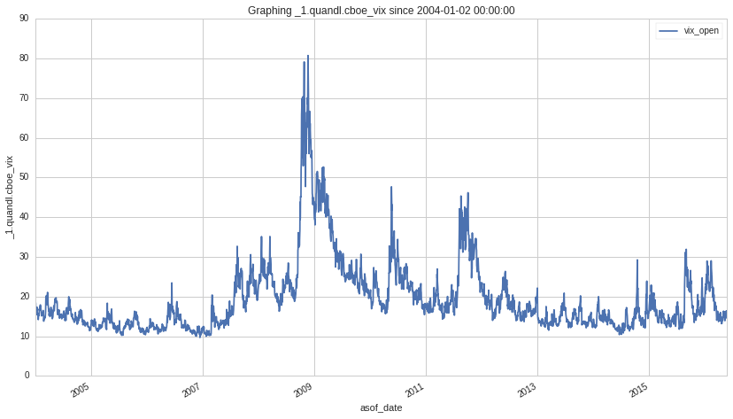
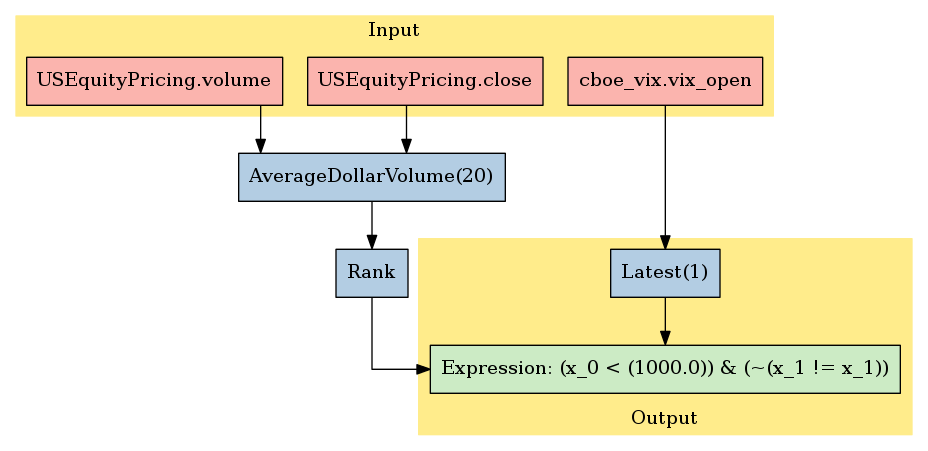

VIX S&P500 Volatility
=====================

In this notebook, we’ll take a look at the VIX S&P500 Volatility
dataset, available on the `Quantopian
Store <https://www.quantopian.com/store>`__. This dataset spans 02 Jan
2004 through the current day. This data has a daily frequency.
Calculated by the CBOE, Quantopian sources this data from Quandl. Quandl
has multiple data sets for VIX. Quantopian hosts two of them: this one,
sourced by Quandl directly from the CBOE. A second is delivered to
Quandl through Yahoo. ## Notebook Contents

There are two ways to access the data and you’ll find both of them
listed below. Just click on the section you’d like to read through.

-  Interactive overview: This is only available on Research and uses
   blaze to give you access to large amounts of data. Recommended for
   exploration and plotting.
-  Pipeline overview: Data is made available through pipeline which is
   available on both the Research & Backtesting environment. Recommended
   for custom factor development and moving back & forth between
   research/backtesting.

Free samples and limits
~~~~~~~~~~~~~~~~~~~~~~~

One key caveat: we limit the number of results returned from any given
expression to 10,000 to protect against runaway memory usage. To be
clear, you have access to all the data server side. We are limiting the
size of the responses back from Blaze.

There is a *free* version of this dataset as well as a paid one. The
free sample includes data until 2 months prior to the current date.

To access the most up-to-date values for this data set for trading a
live algorithm (as with other partner sets), you need to purchase acess
to the full set.

With preamble in place, let’s get started:

#Interactive Overview ### Accessing the data with Blaze and Interactive
on Research Partner datasets are available on Quantopian Research
through an API service known as `Blaze <http://blaze.pydata.org>`__.
Blaze provides the Quantopian user with a convenient interface to access
very large datasets, in an interactive, generic manner.

Blaze provides an important function for accessing these datasets. Some
of these sets are many millions of records. Bringing that data directly
into Quantopian Research directly just is not viable. So Blaze allows us
to provide a simple querying interface and shift the burden over to the
server side.

It is common to use Blaze to reduce your dataset in size, convert it
over to Pandas and then to use Pandas for further computation,
manipulation and visualization.

Helpful links: \* `Query building for
Blaze <http://blaze.readthedocs.io/en/latest/queries.html>`__ \*
`Pandas-to-Blaze
dictionary <http://blaze.readthedocs.io/en/latest/rosetta-pandas.html>`__
\* `SQL-to-Blaze
dictionary <http://blaze.readthedocs.io/en/latest/rosetta-sql.html>`__.

| Once you’ve limited the size of your Blaze object, you can convert it
  to a Pandas DataFrames using: > ``from odo import odo``
| > ``odo(expr, pandas.DataFrame)``

###To see how this data can be used in your algorithm, search for the
``Pipeline Overview`` section of this notebook or head straight to
Pipeline Overview

.. code:: ipython2

    # For use in Quantopian Research, exploring interactively
    from quantopian.interactive.data.quandl import cboe_vix as dataset
    
    # import data operations
    from odo import odo
    # import other libraries we will use
    import pandas as pd

.. code:: ipython2

    # Let's use blaze to understand the data a bit using Blaze dshape()
    dataset.dshape

.. parsed-literal::

    dshape("""var * {
      vix_open: float64,
      vix_high: float64,
      vix_low: float64,
      vix_close: float64,
      asof_date: datetime,
      timestamp: datetime
      }""")

.. code:: ipython2

    # And how many rows are there?
    # N.B. we're using a Blaze function to do this, not len()
    dataset.count()

.. raw:: html

    3119

.. code:: ipython2

    # Let's see what the data looks like. We'll grab the first three rows.
    dataset[:3]

.. raw:: html

    <table border="1" class="dataframe">
      <thead>
        <tr style="text-align: right;">
          <th></th>
          <th>vix_open</th>
          <th>vix_high</th>
          <th>vix_low</th>
          <th>vix_close</th>
          <th>asof_date</th>
          <th>timestamp</th>
        </tr>
      </thead>
      <tbody>
        <tr>
          <th>0</th>
          <td>19.75</td>
          <td>21.16</td>
          <td>19.54</td>
          <td>20.98</td>
          <td>2016-02-23</td>
          <td>2016-02-24 12:00:31.122419</td>
        </tr>
        <tr>
          <th>1</th>
          <td>22.28</td>
          <td>22.87</td>
          <td>20.26</td>
          <td>20.72</td>
          <td>2016-02-24</td>
          <td>2016-02-25 12:00:42.496514</td>
        </tr>
        <tr>
          <th>2</th>
          <td>20.54</td>
          <td>21.26</td>
          <td>19.10</td>
          <td>19.11</td>
          <td>2016-02-25</td>
          <td>2016-02-26 12:00:38.135758</td>
        </tr>
      </tbody>
    </table>

Let’s go over the columns: - **vix_open**: opening price for the day
indicated on asof_date - **vix_high**: high price for the day indicated
on asof_date - **vix_low**: lowest price for the day indicated by
asof_date - **vix_close**: closing price for asof_date - **asof_date**:
the timeframe to which this data applies - **timestamp**: this is our
timestamp on when we registered the data.

We’ve done much of the data processing for you. Fields like
``timestamp`` are standardized across all our Store Datasets, so the
datasets are easy to combine.

We can select columns and rows with ease. Below, we’ll do a simple plot.

.. code:: ipython2

    # Plotting this DataFrame since 2007
    df = odo(dataset, pd.DataFrame)
    df.head(5)

.. raw:: html

    

    <table border="1" class="dataframe">
      <thead>
        <tr style="text-align: right;">
          <th></th>
          <th>vix_open</th>
          <th>vix_high</th>
          <th>vix_low</th>
          <th>vix_close</th>
          <th>asof_date</th>
          <th>timestamp</th>
        </tr>
      </thead>
      <tbody>
        <tr>
          <th>0</th>
          <td>19.75</td>
          <td>21.16</td>
          <td>19.54</td>
          <td>20.98</td>
          <td>2016-02-23</td>
          <td>2016-02-24 12:00:31.122419</td>
        </tr>
        <tr>
          <th>1</th>
          <td>22.28</td>
          <td>22.87</td>
          <td>20.26</td>
          <td>20.72</td>
          <td>2016-02-24</td>
          <td>2016-02-25 12:00:42.496514</td>
        </tr>
        <tr>
          <th>2</th>
          <td>20.54</td>
          <td>21.26</td>
          <td>19.10</td>
          <td>19.11</td>
          <td>2016-02-25</td>
          <td>2016-02-26 12:00:38.135758</td>
        </tr>
        <tr>
          <th>3</th>
          <td>18.89</td>
          <td>20.13</td>
          <td>18.46</td>
          <td>19.81</td>
          <td>2016-02-26</td>
          <td>2016-02-29 12:02:29.380139</td>
        </tr>
        <tr>
          <th>4</th>
          <td>20.49</td>
          <td>20.81</td>
          <td>18.38</td>
          <td>20.55</td>
          <td>2016-02-29</td>
          <td>2016-03-01 12:01:48.633563</td>
        </tr>
      </tbody>
    </table>
    

.. code:: ipython2

    # So we can plot it, we'll set the index as the `asof_date`
    df['asof_date'] = pd.to_datetime(df['asof_date'])
    df = df.set_index(['asof_date'])
    df.head(5)

.. raw:: html

    

    <table border="1" class="dataframe">
      <thead>
        <tr style="text-align: right;">
          <th></th>
          <th>vix_open</th>
          <th>vix_high</th>
          <th>vix_low</th>
          <th>vix_close</th>
          <th>timestamp</th>
        </tr>
        <tr>
          <th>asof_date</th>
          <th></th>
          <th></th>
          <th></th>
          <th></th>
          <th></th>
        </tr>
      </thead>
      <tbody>
        <tr>
          <th>2016-02-23</th>
          <td>19.75</td>
          <td>21.16</td>
          <td>19.54</td>
          <td>20.98</td>
          <td>2016-02-24 12:00:31.122419</td>
        </tr>
        <tr>
          <th>2016-02-24</th>
          <td>22.28</td>
          <td>22.87</td>
          <td>20.26</td>
          <td>20.72</td>
          <td>2016-02-25 12:00:42.496514</td>
        </tr>
        <tr>
          <th>2016-02-25</th>
          <td>20.54</td>
          <td>21.26</td>
          <td>19.10</td>
          <td>19.11</td>
          <td>2016-02-26 12:00:38.135758</td>
        </tr>
        <tr>
          <th>2016-02-26</th>
          <td>18.89</td>
          <td>20.13</td>
          <td>18.46</td>
          <td>19.81</td>
          <td>2016-02-29 12:02:29.380139</td>
        </tr>
        <tr>
          <th>2016-02-29</th>
          <td>20.49</td>
          <td>20.81</td>
          <td>18.38</td>
          <td>20.55</td>
          <td>2016-03-01 12:01:48.633563</td>
        </tr>
      </tbody>
    </table>
    

.. code:: ipython2

    import matplotlib.pyplot as plt
    df.vix_open.plot(label=str(dataset))
    plt.ylabel(str(dataset))
    plt.legend()
    plt.title("Graphing %s since %s" % (str(dataset), min(df.index)))

.. parsed-literal::

    <matplotlib.text.Text at 0x7fc0c8b6b950>

#Pipeline Overview

Accessing the data in your algorithms & research
~~~~~~~~~~~~~~~~~~~~~~~~~~~~~~~~~~~~~~~~~~~~~~~~

The only method for accessing partner data within algorithms running on
Quantopian is via the pipeline API. Different data sets work differently
but in the case of this data, you can add this data to your pipeline as
follows:

Import the data set here >
``from quantopian.pipeline.data.quandl import cboe_vix``

Then in intialize() you could do something simple like adding the raw
value of one of the fields to your pipeline: >
``pipe.add(cboe_vix.vix_open.latest, 'open_vix')``

Pipeline usage is very similar between the backtester and Research so
let’s go over how to import this data through pipeline and view its
outputs.

.. code:: ipython2

    # Import necessary Pipeline modules
    from quantopian.pipeline import Pipeline
    from quantopian.research import run_pipeline
    from quantopian.pipeline.factors import AverageDollarVolume

.. code:: ipython2

    # Import the datasets available
    from quantopian.pipeline.data.quandl import cboe_vix

Now that we’ve imported the data, let’s take a look at which fields are
available for each dataset.

You’ll find the dataset, the available fields, and the datatypes for
each of those fields.

.. code:: ipython2

    print "Here are the list of available fields per dataset:"
    print "---------------------------------------------------\n"
    
    def _print_fields(dataset):
        print "Dataset: %s\n" % dataset.__name__
        print "Fields:"
        for field in list(dataset.columns):
            print "%s - %s" % (field.name, field.dtype)
        print "\n"
    
    _print_fields(cboe_vix)
    
    
    print "---------------------------------------------------\n"

.. parsed-literal::

    Here are the list of available fields per dataset:
    ---------------------------------------------------
    
    Dataset: cboe_vix
    
    Fields:
    vix_open - float64
    vix_low - float64
    vix_high - float64
    vix_close - float64
    
    
    ---------------------------------------------------
    

Now that we know what fields we have access to, let’s see what this data
looks like when we run it through Pipeline.

This is constructed the same way as you would in the backtester. For
more information on using Pipeline in Research view this thread:
https://www.quantopian.com/posts/pipeline-in-research-build-test-and-visualize-your-factors-and-filters

.. code:: ipython2

    pipe = Pipeline()
           
    pipe.add(cboe_vix.vix_open.latest, 'open_vix')

.. code:: ipython2

    # Setting some basic liquidity strings (just for good habit)
    dollar_volume = AverageDollarVolume(window_length=20)
    top_1000_most_liquid = dollar_volume.rank(ascending=False) < 1000
    
    pipe.set_screen(top_1000_most_liquid & cboe_vix.vix_open.latest.notnan())

.. code:: ipython2

    # The show_graph() method of pipeline objects produces a graph to show how it is being calculated.
    pipe.show_graph(format='png')

.. code:: ipython2

    # run_pipeline will show the output of your pipeline
    pipe_output = run_pipeline(pipe, start_date='2013-11-01', end_date='2013-11-25')
    pipe_output

Here, you’ll notice that each security is mapped to the corresponding
value, so you could grab any security to get what you need.

Taking what we’ve seen from above, let’s see how we’d move that into the
backtester.

.. code:: ipython2

    # This section is only importable in the backtester
    from quantopian.algorithm import attach_pipeline, pipeline_output
    
    # General pipeline imports
    from quantopian.pipeline import Pipeline
    from quantopian.pipeline.factors import AverageDollarVolume
    
    # For use in your algorithms via the pipeline API
    from quantopian.pipeline.data.quandl import cboe_vix
    
    def make_pipeline():
        # Create our pipeline
        pipe = Pipeline()
        
        # Screen out penny stocks and low liquidity securities.
        dollar_volume = AverageDollarVolume(window_length=20)
        is_liquid = dollar_volume.rank(ascending=False) < 1000
        
        # Create the mask that we will use for our percentile methods.
        base_universe = (is_liquid)
    
        # Add the datasets available
        pipe.add(cboe_vix.vix_open.latest, 'vix_open')
    
        # Set our pipeline screens
        pipe.set_screen(is_liquid)
        return pipe
    
    def initialize(context):
        attach_pipeline(make_pipeline(), "pipeline")
        
    def before_trading_start(context, data):
        results = pipeline_output('pipeline')

Now you can take that and begin to use it as a building block for your
algorithms, for more examples on how to do that you can visit our data
pipeline factor library

