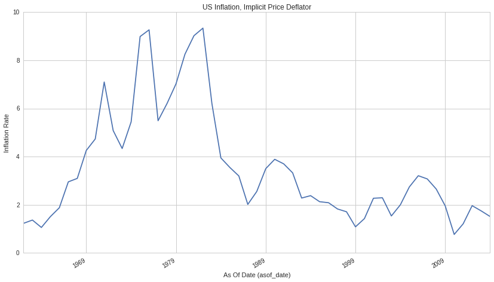

Quandl: US GDP, Implicit Price Deflator
=======================================

In this notebook, we’ll take a look at data set , available on
`Quantopian <https://www.quantopian.com/data>`__. This dataset spans
from 1961 through the current day. It contains the value for the United
States’ inflation rate, using the price deflator. We access this data
via the API provided by `Quandl <https://www.quandl.com>`__. `More
details <https://www.quandl.com/data/UGID/INFL_USA-Inflation-GDP-deflator-United-States-of-America>`__
on this dataset can be found on Quandl’s website.

Blaze
~~~~~

Before we dig into the data, we want to tell you about how you generally
access Quantopian partner data sets. These datasets are available using
the `Blaze <http://blaze.pydata.org>`__ library. Blaze provides the
Quantopian user with a convenient interface to access very large
datasets.

Some of these sets (though not this one) are many millions of records.
Bringing that data directly into Quantopian Research directly just is
not viable. So Blaze allows us to provide a simple querying interface
and shift the burden over to the server side.

To learn more about using Blaze and generally accessing Quantopian
partner data, clone `this tutorial
notebook <https://www.quantopian.com/clone_notebook?id=561827d21777f45c97000054>`__.

With preamble in place, let’s get started:

.. code:: ipython2

    # import the dataset
    from quantopian.interactive.data.quandl import ugid_infl_usa
    # Since this data is public domain and provided by Quandl for free, there is no _free version of this
    # data set, as found in the premium sets. This import gets you the entirety of this data set.
    
    # import data operations
    from odo import odo
    # import other libraries we will use
    import pandas as pd
    import matplotlib.pyplot as plt

.. code:: ipython2

    ugid_infl_usa.sort('asof_date')

.. raw:: html

    <table border="1" class="dataframe">
      <thead>
        <tr style="text-align: right;">
          <th></th>
          <th>asof_date</th>
          <th>value</th>
          <th>timestamp</th>
        </tr>
      </thead>
      <tbody>
        <tr>
          <th>0</th>
          <td>1961-12-31</td>
          <td>1.22958</td>
          <td>1961-12-31</td>
        </tr>
        <tr>
          <th>1</th>
          <td>1962-12-31</td>
          <td>1.36649</td>
          <td>1962-12-31</td>
        </tr>
        <tr>
          <th>2</th>
          <td>1963-12-31</td>
          <td>1.05941</td>
          <td>1963-12-31</td>
        </tr>
        <tr>
          <th>3</th>
          <td>1964-12-31</td>
          <td>1.50905</td>
          <td>1964-12-31</td>
        </tr>
        <tr>
          <th>4</th>
          <td>1965-12-31</td>
          <td>1.87817</td>
          <td>1965-12-31</td>
        </tr>
        <tr>
          <th>5</th>
          <td>1966-12-31</td>
          <td>2.95282</td>
          <td>1966-12-31</td>
        </tr>
        <tr>
          <th>6</th>
          <td>1967-12-31</td>
          <td>3.09600</td>
          <td>1967-12-31</td>
        </tr>
        <tr>
          <th>7</th>
          <td>1968-12-31</td>
          <td>4.25566</td>
          <td>1968-12-31</td>
        </tr>
        <tr>
          <th>8</th>
          <td>1969-12-31</td>
          <td>4.73254</td>
          <td>1969-12-31</td>
        </tr>
        <tr>
          <th>9</th>
          <td>1970-12-31</td>
          <td>7.09738</td>
          <td>1970-12-31</td>
        </tr>
        <tr>
          <th>10</th>
          <td>1971-12-31</td>
          <td>5.08252</td>
          <td>1971-12-31</td>
        </tr>
      </tbody>
    </table>

The data goes all the way back to 1961 and is updated annually.

Blaze provides us with the first 10 rows of the data for display. Just
to confirm, let’s just count the number of rows in the Blaze expression:

.. code:: ipython2

    ugid_infl_usa.count()

.. raw:: html

    53

Let’s go plot it for fun. This data set is definitely small enough to
just put right into a Pandas DataFrame

.. code:: ipython2

    inf_df = odo(ugid_infl_usa, pd.DataFrame)
    
    inf_df.plot(x='asof_date', y='value')
    plt.xlabel("As Of Date (asof_date)")
    plt.ylabel("Inflation Rate")
    plt.title("US Inflation, Implicit Price Deflator")
    plt.legend().set_visible(False)

