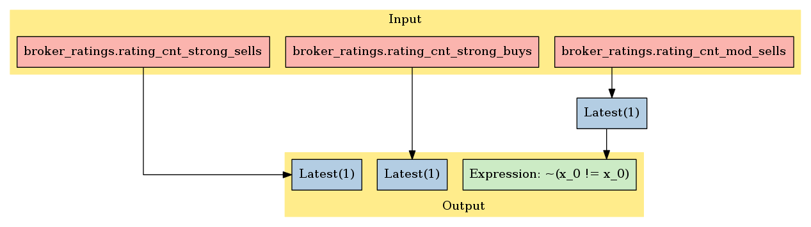

Zack’s Broker Ratings Revision History
======================================

In this notebook, we’ll take a look at Zack’s *Broker Ratings Revision
History* dataset, available on
`Quantopian <https://www.quantopian.com/store>`__. This dataset spans
2002 through the current day and provides Analyst Ratings History for
Securities.

Update time: Zacks updates this dataset sometime during the first week
of each month. In pipeline, your data will be updated close to midnight.
So on the 27th, you will have data with a maximum asof_date of the 26th.

Notebook Contents
-----------------

There are two ways to access the data and you’ll find both of them
listed below. Just click on the section you’d like to read through.

-  Interactive overview: This is only available on Research and uses
   blaze to give you access to large amounts of data. Recommended for
   exploration and plotting.
-  Pipeline overview: Data is made available through pipeline which is
   available on both the Research & Backtesting environment. Recommended
   for custom factor development and moving back & forth between
   research/backtesting.

Free samples and limits
~~~~~~~~~~~~~~~~~~~~~~~

One key caveat: we limit the number of results returned from any given
expression to 10,000 to protect against runaway memory usage. To be
clear, you have access to all the data server side. We are limiting the
size of the responses back from Blaze.

There is a *free* version of this dataset as well as a paid one. The
free sample includes data until 2 months prior to the current date.

To access the most up-to-date values for this data set for trading a
live algorithm (as with other partner sets), you need to purchase acess
to the full set.

With preamble in place, let’s get started:

#Interactive Overview ### Accessing the data with Blaze and Interactive
on Research Partner datasets are available on Quantopian Research
through an API service known as `Blaze <http://blaze.pydata.org>`__.
Blaze provides the Quantopian user with a convenient interface to access
very large datasets, in an interactive, generic manner.

Blaze provides an important function for accessing these datasets. Some
of these sets are many millions of records. Bringing that data directly
into Quantopian Research directly just is not viable. So Blaze allows us
to provide a simple querying interface and shift the burden over to the
server side.

It is common to use Blaze to reduce your dataset in size, convert it
over to Pandas and then to use Pandas for further computation,
manipulation and visualization.

Helpful links: \* `Query building for
Blaze <http://blaze.readthedocs.io/en/latest/queries.html>`__ \*
`Pandas-to-Blaze
dictionary <http://blaze.readthedocs.io/en/latest/rosetta-pandas.html>`__
\* `SQL-to-Blaze
dictionary <http://blaze.readthedocs.io/en/latest/rosetta-sql.html>`__.

| Once you’ve limited the size of your Blaze object, you can convert it
  to a Pandas DataFrames using: > ``from odo import odo``
| > ``odo(expr, pandas.DataFrame)``

###To see how this data can be used in your algorithm, search for the
``Pipeline Overview`` section of this notebook or head straight to
Pipeline Overview

.. code:: ipython2

    # import the free sample of the dataset
    from quantopian.interactive.data.zacks import broker_ratings as dataset
    
    # import data operations
    from odo import odo
    # import other libraries we will use
    import pandas as pd
    import matplotlib.pyplot as plt

.. code:: ipython2

    # Let's use blaze to understand the data a bit using Blaze dshape()
    dataset.timestamp.min()

.. raw:: html

    Timestamp('2002-01-02 00:00:00')

.. code:: ipython2

    # And how many rows are there?
    # N.B. we're using a Blaze function to do this, not len()
    dataset.count()

.. raw:: html

    464669

.. code:: ipython2

    # Let's see what the data looks like. We'll grab three rows
    dataset.tail(3)

.. raw:: html

    <table border="1" class="dataframe">
      <thead>
        <tr style="text-align: right;">
          <th></th>
          <th>file_prod_date</th>
          <th>m_ticker</th>
          <th>symbol</th>
          <th>comp_name</th>
          <th>comp_name_2</th>
          <th>exchange</th>
          <th>currency_code</th>
          <th>rating_cnt_strong_buys</th>
          <th>rating_cnt_mod_buys</th>
          <th>rating_cnt_holds</th>
          <th>rating_cnt_mod_sells</th>
          <th>rating_cnt_strong_sells</th>
          <th>rating_mean_recom</th>
          <th>rating_cnt_with</th>
          <th>rating_cnt_without</th>
          <th>sid</th>
          <th>asof_date</th>
          <th>timestamp</th>
        </tr>
      </thead>
      <tbody>
        <tr>
          <th>0</th>
          <td>2016-10-04</td>
          <td>AA</td>
          <td>AA</td>
          <td>ALCOA INC</td>
          <td>Alcoa Inc.</td>
          <td>NYSE</td>
          <td>USD</td>
          <td>6.0</td>
          <td>3.0</td>
          <td>3.0</td>
          <td>0.0</td>
          <td>1.0</td>
          <td>2.2</td>
          <td>16.0</td>
          <td>3.0</td>
          <td>2</td>
          <td>2002-01-01</td>
          <td>2002-01-02</td>
        </tr>
        <tr>
          <th>1</th>
          <td>2016-10-04</td>
          <td>AAPL</td>
          <td>AAPL</td>
          <td>APPLE INC</td>
          <td>Apple Inc.</td>
          <td>NSDQ</td>
          <td>USD</td>
          <td>1.0</td>
          <td>4.0</td>
          <td>12.0</td>
          <td>0.0</td>
          <td>0.0</td>
          <td>2.6</td>
          <td>19.0</td>
          <td>2.0</td>
          <td>24</td>
          <td>2002-01-01</td>
          <td>2002-01-02</td>
        </tr>
        <tr>
          <th>2</th>
          <td>2016-10-04</td>
          <td>ABT</td>
          <td>ABT</td>
          <td>ABBOTT LABS</td>
          <td>Abbott Laboratories</td>
          <td>NYSE</td>
          <td>USD</td>
          <td>9.0</td>
          <td>7.0</td>
          <td>4.0</td>
          <td>0.0</td>
          <td>0.0</td>
          <td>1.8</td>
          <td>21.0</td>
          <td>1.0</td>
          <td>62</td>
          <td>2002-01-01</td>
          <td>2002-01-02</td>
        </tr>
      </tbody>
    </table>

Let’s go over the columns: - **file_prod_date**: File production date -
**m_ticker**: Master ticker or trading symbol - **symbol**: Ticker -
**comp_name**: Company name - **comp_name_2**: Company name 2 -
**exchange**: Exchange traded - **currency_code**: Currency code -
**rating_cnt_strong_buys**: Number of analysts with a strong buy rating
- **rating_cnt_mod_buys**: Number of analysts with a moderate buy rating
- **rating_cnt_holds**: Number of analysts with a hold rating -
**rating_cnt_mod_sells**: Number of analysts with a moderate sell rating
- **rating_cnt_strong_sells**: Number of analysts with a strong sell
rating - **rating_mean_recom**: Average rating recommendation -
**rating_cnt_with**: Number of analysts with a rating -
**rating_cnt_without**: Number of analysts with no rating -
**asof_date**: Observation date - **timestamp**: This is our timestamp
on when we registered the data.

We’ve done much of the data processing for you. Fields like
``timestamp`` and ``sid`` are standardized across all our Store
Datasets, so the datasets are easy to combine. We have standardized the
``sid`` across all our equity databases.

We can select columns and rows with ease. Below, we’ll fetch all rows
for Apple (sid 24) and explore the scores a bit with a chart.

.. code:: ipython2

    aapl_data = dataset_100[dataset_100.symbol == 'AAPL']
    aapl = odo(aapl_data, pd.DataFrame)
    # suppose we want the rows to be indexed by timestamp.
    aapl.index = list(aapl['asof_date'])
    aapl.drop('asof_date',1,inplace=True)
    aapl[-3:]

.. raw:: html

    

    <table border="1" class="dataframe">
      <thead>
        <tr style="text-align: right;">
          <th></th>
          <th>symbol</th>
          <th>name</th>
          <th>sid</th>
          <th>predicted_five_day_log_return</th>
          <th>timestamp</th>
        </tr>
      </thead>
      <tbody>
        <tr>
          <th>2016-10-03</th>
          <td>AAPL</td>
          <td>APPLE INC</td>
          <td>24</td>
          <td>0.003</td>
          <td>2016-10-04 00:00:00.000000</td>
        </tr>
        <tr>
          <th>2016-10-04</th>
          <td>AAPL</td>
          <td>APPLE INC</td>
          <td>24</td>
          <td>0.011</td>
          <td>2016-10-06 04:01:28.909580</td>
        </tr>
        <tr>
          <th>2016-10-05</th>
          <td>AAPL</td>
          <td>APPLE INC</td>
          <td>24</td>
          <td>0.021</td>
          <td>2016-10-06 04:01:28.909580</td>
        </tr>
      </tbody>
    </table>
    

#Pipeline Overview

Accessing the data in your algorithms & research
~~~~~~~~~~~~~~~~~~~~~~~~~~~~~~~~~~~~~~~~~~~~~~~~

The only method for accessing partner data within algorithms running on
Quantopian is via the pipeline API. Different data sets work differently
but in the case of this data, you can add this data to your pipeline as
follows:

.. code:: ipython2

    # Import necessary Pipeline modules
    from quantopian.pipeline import Pipeline
    from quantopian.research import run_pipeline
    from quantopian.pipeline.factors import AverageDollarVolume

.. code:: ipython2

    # For use in your algorithms
    # Using the full/sample paid dataset in your pipeline algo
    from quantopian.pipeline.data.zacks import broker_ratings

Now that we’ve imported the data, let’s take a look at which fields are
available for each dataset.

You’ll find the dataset, the available fields, and the datatypes for
each of those fields.

.. code:: ipython2

    print "Here are the list of available fields per dataset:"
    print "---------------------------------------------------\n"
    
    def _print_fields(dataset):
        print "Dataset: %s\n" % dataset.__name__
        print "Fields:"
        for field in list(dataset.columns):
            print "%s - %s" % (field.name, field.dtype)
        print "\n"
    
    for data in (broker_ratings,):
        _print_fields(data)
    
    
    print "---------------------------------------------------\n"

.. parsed-literal::

    Here are the list of available fields per dataset:
    ---------------------------------------------------
    
    Dataset: broker_ratings
    
    Fields:
    comp_name - object
    exchange - object
    currency_code - object
    symbol - object
    m_ticker - object
    rating_mean_recom - float64
    rating_cnt_without - float64
    rating_cnt_strong_buys - float64
    asof_date - datetime64[ns]
    rating_cnt_mod_buys - float64
    rating_cnt_holds - float64
    file_prod_date - datetime64[ns]
    rating_cnt_mod_sells - float64
    comp_name_2 - object
    rating_cnt_strong_sells - float64
    rating_cnt_with - float64
    
    
    ---------------------------------------------------
    

Now that we know what fields we have access to, let’s see what this data
looks like when we run it through Pipeline.

This is constructed the same way as you would in the backtester. For
more information on using Pipeline in Research view this thread:
https://www.quantopian.com/posts/pipeline-in-research-build-test-and-visualize-your-factors-and-filters

.. code:: ipython2

    # Let's see what this data looks like when we run it through Pipeline
    # This is constructed the same way as you would in the backtester. For more information
    # on using Pipeline in Research view this thread:
    # https://www.quantopian.com/posts/pipeline-in-research-build-test-and-visualize-your-factors-and-filters
    
    columns = {'Strong Sells': broker_ratings.rating_cnt_strong_sells.latest,
               'Strong Buys': broker_ratings.rating_cnt_strong_buys.latest}
    pipe = Pipeline(columns=columns, screen=broker_ratings.rating_cnt_mod_sells.latest.notnan())

.. code:: ipython2

    # The show_graph() method of pipeline objects produces a graph to show how it is being calculated.
    pipe.show_graph(format='png')

.. code:: ipython2

    # run_pipeline will show the output of your pipeline
    pipe_output = run_pipeline(pipe, start_date='2013-11-01', end_date='2013-11-25')
    pipe_output

.. raw:: html

    

    <table border="1" class="dataframe">
      <thead>
        <tr style="text-align: right;">
          <th></th>
          <th></th>
          <th>Strong Buys</th>
          <th>Strong Sells</th>
        </tr>
      </thead>
      <tbody>
        <tr>
          <th rowspan="30" valign="top">2013-11-01 00:00:00+00:00</th>
          <th>Equity(2 [AA])</th>
          <td>2.0</td>
          <td>4.0</td>
        </tr>
        <tr>
          <th>Equity(24 [AAPL])</th>
          <td>27.0</td>
          <td>0.0</td>
        </tr>
        <tr>
          <th>Equity(31 [ABAX])</th>
          <td>1.0</td>
          <td>0.0</td>
        </tr>
        <tr>
          <th>Equity(39 [DDC])</th>
          <td>2.0</td>
          <td>0.0</td>
        </tr>
        <tr>
          <th>Equity(52 [ABM])</th>
          <td>1.0</td>
          <td>0.0</td>
        </tr>
        <tr>
          <th>Equity(53 [ABMD])</th>
          <td>4.0</td>
          <td>1.0</td>
        </tr>
        <tr>
          <th>Equity(62 [ABT])</th>
          <td>9.0</td>
          <td>0.0</td>
        </tr>
        <tr>
          <th>Equity(64 [ABX])</th>
          <td>2.0</td>
          <td>0.0</td>
        </tr>
        <tr>
          <th>Equity(66 [AB])</th>
          <td>1.0</td>
          <td>0.0</td>
        </tr>
        <tr>
          <th>Equity(67 [ADSK])</th>
          <td>5.0</td>
          <td>0.0</td>
        </tr>
        <tr>
          <th>Equity(69 [ACAT])</th>
          <td>2.0</td>
          <td>0.0</td>
        </tr>
        <tr>
          <th>Equity(70 [VBF])</th>
          <td>0.0</td>
          <td>0.0</td>
        </tr>
        <tr>
          <th>Equity(76 [TAP])</th>
          <td>4.0</td>
          <td>0.0</td>
        </tr>
        <tr>
          <th>Equity(84 [ACET])</th>
          <td>0.0</td>
          <td>0.0</td>
        </tr>
        <tr>
          <th>Equity(86 [ACG])</th>
          <td>0.0</td>
          <td>0.0</td>
        </tr>
        <tr>
          <th>Equity(99 [ACO])</th>
          <td>0.0</td>
          <td>0.0</td>
        </tr>
        <tr>
          <th>Equity(100 [IEP])</th>
          <td>1.0</td>
          <td>0.0</td>
        </tr>
        <tr>
          <th>Equity(106 [ACU])</th>
          <td>0.0</td>
          <td>0.0</td>
        </tr>
        <tr>
          <th>Equity(110 [ACXM])</th>
          <td>2.0</td>
          <td>1.0</td>
        </tr>
        <tr>
          <th>Equity(112 [ACY])</th>
          <td>0.0</td>
          <td>0.0</td>
        </tr>
        <tr>
          <th>Equity(114 [ADBE])</th>
          <td>9.0</td>
          <td>0.0</td>
        </tr>
        <tr>
          <th>Equity(117 [AEY])</th>
          <td>0.0</td>
          <td>0.0</td>
        </tr>
        <tr>
          <th>Equity(122 [ADI])</th>
          <td>11.0</td>
          <td>0.0</td>
        </tr>
        <tr>
          <th>Equity(128 [ADM])</th>
          <td>3.0</td>
          <td>0.0</td>
        </tr>
        <tr>
          <th>Equity(149 [ADX])</th>
          <td>0.0</td>
          <td>0.0</td>
        </tr>
        <tr>
          <th>Equity(153 [AE])</th>
          <td>0.0</td>
          <td>0.0</td>
        </tr>
        <tr>
          <th>Equity(154 [AEM])</th>
          <td>4.0</td>
          <td>0.0</td>
        </tr>
        <tr>
          <th>Equity(157 [AEG])</th>
          <td>0.0</td>
          <td>0.0</td>
        </tr>
        <tr>
          <th>Equity(161 [AEP])</th>
          <td>7.0</td>
          <td>0.0</td>
        </tr>
        <tr>
          <th>Equity(162 [AEPI])</th>
          <td>0.0</td>
          <td>0.0</td>
        </tr>
        <tr>
          <th>...</th>
          <th>...</th>
          <td>...</td>
          <td>...</td>
        </tr>
        <tr>
          <th rowspan="30" valign="top">2013-11-25 00:00:00+00:00</th>
          <th>Equity(45505 [MONT])</th>
          <td>3.0</td>
          <td>0.0</td>
        </tr>
        <tr>
          <th>Equity(45506 [PINC])</th>
          <td>4.0</td>
          <td>0.0</td>
        </tr>
        <tr>
          <th>Equity(45520 [VMEM])</th>
          <td>1.0</td>
          <td>0.0</td>
        </tr>
        <tr>
          <th>Equity(45521 [RNG])</th>
          <td>3.0</td>
          <td>0.0</td>
        </tr>
        <tr>
          <th>Equity(45522 [ENZY])</th>
          <td>3.0</td>
          <td>0.0</td>
        </tr>
        <tr>
          <th>Equity(45526 [PEGI])</th>
          <td>2.0</td>
          <td>0.0</td>
        </tr>
        <tr>
          <th>Equity(45538 [CNHI])</th>
          <td>0.0</td>
          <td>0.0</td>
        </tr>
        <tr>
          <th>Equity(45557 [RMAX])</th>
          <td>2.0</td>
          <td>0.0</td>
        </tr>
        <tr>
          <th>Equity(45558 [BURL])</th>
          <td>5.0</td>
          <td>0.0</td>
        </tr>
        <tr>
          <th>Equity(45559 [ESRT])</th>
          <td>1.0</td>
          <td>0.0</td>
        </tr>
        <tr>
          <th>Equity(45577 [OCIP])</th>
          <td>2.0</td>
          <td>0.0</td>
        </tr>
        <tr>
          <th>Equity(45578 [CHMI])</th>
          <td>3.0</td>
          <td>0.0</td>
        </tr>
        <tr>
          <th>Equity(45579 [PBPB])</th>
          <td>1.0</td>
          <td>0.0</td>
        </tr>
        <tr>
          <th>Equity(45617 [QTS])</th>
          <td>3.0</td>
          <td>0.0</td>
        </tr>
        <tr>
          <th>Equity(45618 [AR])</th>
          <td>8.0</td>
          <td>0.0</td>
        </tr>
        <tr>
          <th>Equity(45619 [LDRH])</th>
          <td>4.0</td>
          <td>0.0</td>
        </tr>
        <tr>
          <th>Equity(45640 [WNRL])</th>
          <td>1.0</td>
          <td>0.0</td>
        </tr>
        <tr>
          <th>Equity(45641 [CXP])</th>
          <td>1.0</td>
          <td>0.0</td>
        </tr>
        <tr>
          <th>Equity(45642 [SGM])</th>
          <td>2.0</td>
          <td>0.0</td>
        </tr>
        <tr>
          <th>Equity(45643 [MGNX])</th>
          <td>3.0</td>
          <td>0.0</td>
        </tr>
        <tr>
          <th>Equity(45656 [GLPI])</th>
          <td>1.0</td>
          <td>0.0</td>
        </tr>
        <tr>
          <th>Equity(45667 [VEEV])</th>
          <td>3.0</td>
          <td>0.0</td>
        </tr>
        <tr>
          <th>Equity(45668 [PAGP])</th>
          <td>1.0</td>
          <td>0.0</td>
        </tr>
        <tr>
          <th>Equity(45689 [VJET])</th>
          <td>1.0</td>
          <td>0.0</td>
        </tr>
        <tr>
          <th>Equity(45733 [AERI])</th>
          <td>2.0</td>
          <td>0.0</td>
        </tr>
        <tr>
          <th>Equity(45734 [COMM])</th>
          <td>1.0</td>
          <td>0.0</td>
        </tr>
        <tr>
          <th>Equity(45735 [EIGI])</th>
          <td>2.0</td>
          <td>0.0</td>
        </tr>
        <tr>
          <th>Equity(45755 [BRX])</th>
          <td>0.0</td>
          <td>0.0</td>
        </tr>
        <tr>
          <th>Equity(45780 [TCS])</th>
          <td>7.0</td>
          <td>0.0</td>
        </tr>
        <tr>
          <th>Equity(45815 [TWTR])</th>
          <td>2.0</td>
          <td>1.0</td>
        </tr>
      </tbody>
    </table>
    
72163 rows × 2 columns

    

Now you can take that and begin to use it as a building block for your
algorithms, for more examples on how to do that you can visit our data
pipeline factor library
