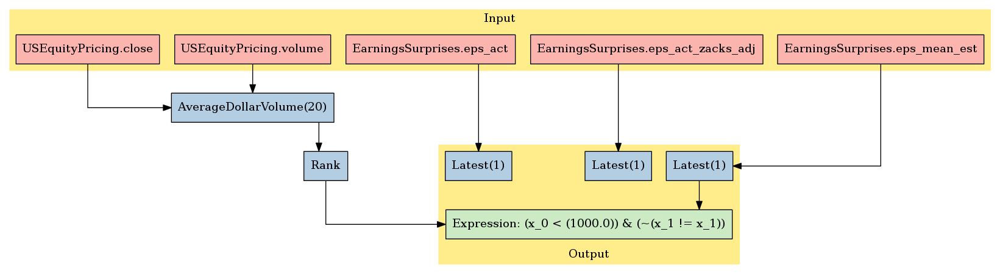

Zacks: Earnings Surprise
========================

In this notebook, we’ll take a look at Zacks’s *Earnings Surprise*
dataset, available on `Quantopian <https://www.quantopian.com/store>`__.
This dataset spans 2006 through the current day. It contains earnings
surprises, analyst estimats, and actual EPS numbers for X securities.

Notebook Contents
-----------------

There are two ways to access the data and you’ll find both of them
listed below. Just click on the section you’d like to read through.

-  Interactive overview: This is only available on Research and uses
   blaze to give you access to large amounts of data. Recommended for
   exploration and plotting.
-  Pipeline overview (Not Available Yet): Data is made available through
   pipeline which is available on both the Research & Backtesting
   environment. Recommended for custom factor development and moving
   back & forth between research/backtesting.

Free samples and limits
~~~~~~~~~~~~~~~~~~~~~~~

One key caveat: we limit the number of results returned from any given
expression to 10,000 to protect against runaway memory usage. To be
clear, you have access to all the data server side. We are limiting the
size of the responses back from Blaze.

There is a *free* version of this dataset as well as a paid one. The
free sample includes data until 2 months prior to the current date.

To access the most up-to-date values for this data set for trading a
live algorithm (as with other partner sets), you need to purchase acess
to the full set.

With preamble in place, let’s get started:

#Interactive Overview ### Accessing the data with Blaze and Interactive
on Research Partner datasets are available on Quantopian Research
through an API service known as `Blaze <http://blaze.pydata.org>`__.
Blaze provides the Quantopian user with a convenient interface to access
very large datasets, in an interactive, generic manner.

Blaze provides an important function for accessing these datasets. Some
of these sets are many millions of records. Bringing that data directly
into Quantopian Research directly just is not viable. So Blaze allows us
to provide a simple querying interface and shift the burden over to the
server side.

It is common to use Blaze to reduce your dataset in size, convert it
over to Pandas and then to use Pandas for further computation,
manipulation and visualization.

Helpful links: \* `Query building for
Blaze <http://blaze.readthedocs.io/en/latest/queries.html>`__ \*
`Pandas-to-Blaze
dictionary <http://blaze.readthedocs.io/en/latest/rosetta-pandas.html>`__
\* `SQL-to-Blaze
dictionary <http://blaze.readthedocs.io/en/latest/rosetta-sql.html>`__.

| Once you’ve limited the size of your Blaze object, you can convert it
  to a Pandas DataFrames using: > ``from odo import odo``
| > ``odo(expr, pandas.DataFrame)``

###To see how this data can be used in your algorithm, search for the
``Pipeline Overview`` section of this notebook or head straight to
Pipeline Overview

.. code:: ipython2

    # import the dataset
    from quantopian.interactive.data.zacks import earnings_surprises as dataset
    
    # or if you want to import the paid dataset, use:
    # from quantopian.interactive.data.zacks import earnings_surprises_free
    
    # import data operations
    from odo import odo
    # import other libraries we will use
    import pandas as pd
    import matplotlib.pyplot as plt

.. code:: ipython2

    # Let's use blaze to understand the data a bit using Blaze dshape()
    dataset.timestamp.min()

.. raw:: html

    Timestamp('2006-05-27 00:00:00')

.. code:: ipython2

    # And how many rows are there?
    # N.B. we're using a Blaze function to do this, not len()
    dataset.count()

.. raw:: html

    146923

.. code:: ipython2

    # Let's see what the data looks like. We'll grab the first three rows.
    dataset[:3]

.. raw:: html

    <table border="1" class="dataframe">
      <thead>
        <tr style="text-align: right;">
          <th></th>
          <th>file_prod_date</th>
          <th>symbol</th>
          <th>comp_name</th>
          <th>comp_name_2</th>
          <th>exchange</th>
          <th>currency_code</th>
          <th>per_type</th>
          <th>eps_mean_est</th>
          <th>eps_act</th>
          <th>eps_amt_diff_surp</th>
          <th>eps_pct_diff_surp</th>
          <th>eps_std_dev_est</th>
          <th>eps_cnt_est</th>
          <th>eps_act_zacks_adj</th>
          <th>per_fisc_year</th>
          <th>per_fisc_qtr</th>
          <th>per_end_date</th>
          <th>per_cal_year</th>
          <th>per_cal_qtr</th>
          <th>act_rpt_code</th>
          <th>act_rpt_desc</th>
          <th>act_rpt_date_time</th>
          <th>m_ticker</th>
          <th>per_code</th>
          <th>sid</th>
          <th>asof_date</th>
          <th>timestamp</th>
        </tr>
      </thead>
      <tbody>
        <tr>
          <th>0</th>
          <td>2016-05-31</td>
          <td>ADBE</td>
          <td>ADOBE SYSTEMS</td>
          <td>Adobe Systems Inc.</td>
          <td>NSDQ</td>
          <td>USD</td>
          <td>Q</td>
          <td>0.27</td>
          <td>0.28</td>
          <td>0.01</td>
          <td>3.70</td>
          <td>0</td>
          <td>5</td>
          <td>-0.08</td>
          <td>2006</td>
          <td>2</td>
          <td>2006-05-31</td>
          <td>2006</td>
          <td>2</td>
          <td>None</td>
          <td>None</td>
          <td>2006-06-16 03:59:59</td>
          <td>ADBE</td>
          <td>QR-39</td>
          <td>114</td>
          <td>2006-06-16</td>
          <td>2006-06-17</td>
        </tr>
        <tr>
          <th>1</th>
          <td>2016-05-31</td>
          <td>AIR</td>
          <td>AAR CORP</td>
          <td>AAR Corp.</td>
          <td>NYSE</td>
          <td>USD</td>
          <td>Q</td>
          <td>0.29</td>
          <td>0.31</td>
          <td>0.02</td>
          <td>6.90</td>
          <td>NaN</td>
          <td>1</td>
          <td>0.00</td>
          <td>2006</td>
          <td>4</td>
          <td>2006-05-31</td>
          <td>2006</td>
          <td>2</td>
          <td>None</td>
          <td>None</td>
          <td>2006-07-13 03:59:59</td>
          <td>AAR7</td>
          <td>QR-39</td>
          <td>253</td>
          <td>2006-07-13</td>
          <td>2006-07-14</td>
        </tr>
        <tr>
          <th>2</th>
          <td>2016-05-31</td>
          <td>APOG</td>
          <td>APOGEE ENTRPRS</td>
          <td>Apogee Enterprises Inc.</td>
          <td>NSDQ</td>
          <td>USD</td>
          <td>Q</td>
          <td>0.16</td>
          <td>0.17</td>
          <td>0.01</td>
          <td>6.25</td>
          <td>NaN</td>
          <td>1</td>
          <td>0.00</td>
          <td>2007</td>
          <td>1</td>
          <td>2006-05-31</td>
          <td>2006</td>
          <td>2</td>
          <td>None</td>
          <td>None</td>
          <td>2006-06-28 03:59:59</td>
          <td>APOG</td>
          <td>QR-39</td>
          <td>474</td>
          <td>2006-06-28</td>
          <td>2006-06-29</td>
        </tr>
      </tbody>
    </table>

Let’s go over the columns: - **symbol**: the ticker symbol of the
company. - **comp_name**: the name of the company. - **comp_name_2**:
the name of the company. - **exchange**: what the exchange stock is
currently trading - **currency_code**: currency code - **per_type**:
period type (e.g. Q for quarter) - **sid**: the equity’s unique
identifier. Use this instead of ticker or name. - **eps_mean_est**:
Earnings per share (EPS) mean estimate for the period - **eps_act**:
Earnings per share (EPS) actual for the period - **eps_amt_diff_surp**:
Earnings per share (EPS) surprise amount for the period -
**eps_pct_diff_surp**: Earnings per share (EPS) surprise percent for the
period - **eps_std_dev_est**: Earnings per share (EPS) standard
deviation in estimate for the period - **eps_cnt_est**: Number of
estimates for the period - **eps_act_zacks_adj**: Estimated earnings per
share (EPS) (Zacks adjustment) - **per_fisc_year**: Period fiscal year -
**per_fisc_qtr**: Period fiscal quarter - **per_end_date**: Period end
date - **per_cal_year**: Period calendar year - **per_cal_qtr**: Period
calender quarter - **act_rpt_code**: Actual report time of day code (BTO
- before the open, DTM - during the market, AMC - after market close) -
**act_rpt_desc**: Actual report time of day description -
**act_rpt_date_time**: Actual report timestamp (eastern time) -
**m_ticker**: Master ticker or trading symbol - **asof_date**: The date
to which this data applies/Actual report date - **timestamp**: This is
our timestamp on when we registered the data.

We’ve done much of the data processing for you. Fields like
``timestamp`` and ``sid`` are standardized across all our Store
Datasets, so the datasets are easy to combine. We have standardized the
``sid`` across all our equity databases.

We can select columns and rows with ease. Below, we’ll fetch all entries
for the sid 24 (AAPL) and plot the earnings surprises for that.

.. code:: ipython2

    aapl = dataset[dataset.sid==24][['eps_pct_diff_surp','eps_mean_est', 'eps_act', 'eps_std_dev_est', 'asof_date']].sort('asof_date')
    aapl

.. raw:: html

    <table border="1" class="dataframe">
      <thead>
        <tr style="text-align: right;">
          <th></th>
          <th>eps_pct_diff_surp</th>
          <th>eps_mean_est</th>
          <th>eps_act</th>
          <th>eps_std_dev_est</th>
          <th>asof_date</th>
        </tr>
      </thead>
      <tbody>
        <tr>
          <th>0</th>
          <td>22.73</td>
          <td>0.0629</td>
          <td>0.0771</td>
          <td>0.0029</td>
          <td>2006-07-20</td>
        </tr>
        <tr>
          <th>1</th>
          <td>24.00</td>
          <td>0.0714</td>
          <td>0.0886</td>
          <td>0.0029</td>
          <td>2006-10-19</td>
        </tr>
        <tr>
          <th>2</th>
          <td>46.15</td>
          <td>0.1114</td>
          <td>0.1629</td>
          <td>0.0043</td>
          <td>2007-01-18</td>
        </tr>
        <tr>
          <th>3</th>
          <td>38.10</td>
          <td>0.0900</td>
          <td>0.1243</td>
          <td>0.0071</td>
          <td>2007-04-26</td>
        </tr>
        <tr>
          <th>4</th>
          <td>29.58</td>
          <td>0.1014</td>
          <td>0.1314</td>
          <td>0.0043</td>
          <td>2007-07-26</td>
        </tr>
        <tr>
          <th>5</th>
          <td>20.24</td>
          <td>0.1200</td>
          <td>0.1443</td>
          <td>0.0100</td>
          <td>2007-10-23</td>
        </tr>
        <tr>
          <th>6</th>
          <td>9.32</td>
          <td>0.2300</td>
          <td>0.2514</td>
          <td>0.0143</td>
          <td>2008-01-23</td>
        </tr>
        <tr>
          <th>7</th>
          <td>9.43</td>
          <td>0.1514</td>
          <td>0.1657</td>
          <td>0.0086</td>
          <td>2008-04-24</td>
        </tr>
        <tr>
          <th>8</th>
          <td>12.26</td>
          <td>0.1514</td>
          <td>0.1700</td>
          <td>0.0057</td>
          <td>2008-07-22</td>
        </tr>
        <tr>
          <th>9</th>
          <td>13.51</td>
          <td>0.1586</td>
          <td>0.1800</td>
          <td>0.0071</td>
          <td>2008-10-22</td>
        </tr>
        <tr>
          <th>10</th>
          <td>27.14</td>
          <td>0.2000</td>
          <td>0.2543</td>
          <td>0.0114</td>
          <td>2009-01-22</td>
        </tr>
      </tbody>
    </table>

Let’s convert ``aapl`` to a DataFrame.

.. code:: ipython2

    aapl_surprise = odo(aapl, pd.DataFrame)
    # suppose we want the rows to be indexed by timestamp.
    aapl_surprise.index = list(aapl_surprise['asof_date'])
    aapl_surprise.drop('asof_date',1,inplace=True)
    # display the first three rows. DataFrames, when printed, display 60 rows at a time.
    aapl_surprise[:3]

.. raw:: html

    

    <table border="1" class="dataframe">
      <thead>
        <tr style="text-align: right;">
          <th></th>
          <th>eps_pct_diff_surp</th>
          <th>eps_mean_est</th>
          <th>eps_act</th>
          <th>eps_std_dev_est</th>
        </tr>
      </thead>
      <tbody>
        <tr>
          <th>2006-07-20</th>
          <td>22.73</td>
          <td>0.0629</td>
          <td>0.0771</td>
          <td>0.0029</td>
        </tr>
        <tr>
          <th>2006-10-19</th>
          <td>24.00</td>
          <td>0.0714</td>
          <td>0.0886</td>
          <td>0.0029</td>
        </tr>
        <tr>
          <th>2007-01-18</th>
          <td>46.15</td>
          <td>0.1114</td>
          <td>0.1629</td>
          <td>0.0043</td>
        </tr>
      </tbody>
    </table>
    

#Pipeline Overview

Accessing the data in your algorithms & research
~~~~~~~~~~~~~~~~~~~~~~~~~~~~~~~~~~~~~~~~~~~~~~~~

The only method for accessing partner data within algorithms running on
Quantopian is via the pipeline API. Different data sets work differently
but in the case of this data, you can add this data to your pipeline as
follows:

Import the data set here >
``from quantopian.pipeline.data.zacks import (`` > ``EarningsSurprises``
> ``)``

Then in intialize() you could do something simple like adding the raw
value of one of the fields to your pipeline: >
``pipe.add(zacks.eps_mean_est.latest, 'EPS mean estimate')``

.. code:: ipython2

    # Import necessary Pipeline modules
    from quantopian.pipeline import Pipeline
    from quantopian.research import run_pipeline
    from quantopian.pipeline.factors import AverageDollarVolume

.. code:: ipython2

    # For use in your algorithms
    # Using the full/sample paid dataset in your pipeline algo
    from quantopian.pipeline.data.zacks import EarningsSurprises

Now that we’ve imported the data, let’s take a look at which fields are
available for each dataset.

You’ll find the dataset, the available fields, and the datatypes for
each of those fields.

.. code:: ipython2

    print "Here are the list of available fields per dataset:"
    print "---------------------------------------------------\n"
    
    def _print_fields(dataset):
        print "Dataset: %s\n" % dataset.__name__
        print "Fields:"
        for field in list(dataset.columns):
            print "%s - %s" % (field.name, field.dtype)
        print "\n"
    
    for data in (EarningsSurprises,):
        _print_fields(data)
    
    
    print "---------------------------------------------------\n"

.. parsed-literal::

    Here are the list of available fields per dataset:
    ---------------------------------------------------
    
    Dataset: EarningsSurprises
    
    Fields:
    per_cal_qtr - float64
    eps_cnt_est - float64
    per_cal_year - float64
    per_fisc_qtr - float64
    eps_amt_diff_surp - float64
    eps_act_zacks_adj - float64
    per_fisc_year - float64
    eps_mean_est - float64
    eps_act - float64
    asof_date - datetime64[ns]
    per_type - object
    per_end_date - datetime64[ns]
    act_rpt_desc - object
    eps_std_dev_est - float64
    act_rpt_code - object
    eps_pct_diff_surp - float64
    
    
    ---------------------------------------------------
    

Now that we know what fields we have access to, let’s see what this data
looks like when we run it through Pipeline.

This is constructed the same way as you would in the backtester. For
more information on using Pipeline in Research view this thread:
https://www.quantopian.com/posts/pipeline-in-research-build-test-and-visualize-your-factors-and-filters

.. code:: ipython2

    # Let's see what this data looks like when we run it through Pipeline
    # This is constructed the same way as you would in the backtester. For more information
    # on using Pipeline in Research view this thread:
    # https://www.quantopian.com/posts/pipeline-in-research-build-test-and-visualize-your-factors-and-filters
    
    # Setting some basic liquidity strings (just for good habit)
    dollar_volume = AverageDollarVolume(window_length=20)
    top_1000_most_liquid = dollar_volume.rank(ascending=False) < 1000
    
    pipe = Pipeline(
        columns={
            'EPS mean estimate': EarningsSurprises.eps_mean_est.latest,
            'Zacks adj': EarningsSurprises.eps_act_zacks_adj.latest,
            'eps_act': EarningsSurprises.eps_act.latest
        },
        screen=(top_1000_most_liquid & EarningsSurprises.eps_mean_est.latest.notnan())
    )

.. code:: ipython2

    # The show_graph() method of pipeline objects produces a graph to show how it is being calculated.
    pipe.show_graph(format='png')

.. code:: ipython2

    # run_pipeline will show the output of your pipeline
    pipe_output = run_pipeline(pipe, start_date='2016-03-01', end_date='2016-03-02')
    pipe_output

.. raw:: html

    

    <table border="1" class="dataframe">
      <thead>
        <tr style="text-align: right;">
          <th></th>
          <th></th>
          <th>EPS mean estimate</th>
          <th>Zacks adj</th>
          <th>eps_act</th>
        </tr>
      </thead>
      <tbody>
        <tr>
          <th rowspan="30" valign="top">2016-03-01 00:00:00+00:00</th>
          <th>Equity(2 [AA])</th>
          <td>0.03</td>
          <td>-0.43</td>
          <td>0.04</td>
        </tr>
        <tr>
          <th>Equity(24 [AAPL])</th>
          <td>3.24</td>
          <td>0.00</td>
          <td>3.28</td>
        </tr>
        <tr>
          <th>Equity(53 [ABMD])</th>
          <td>0.16</td>
          <td>0.00</td>
          <td>0.23</td>
        </tr>
        <tr>
          <th>Equity(62 [ABT])</th>
          <td>0.61</td>
          <td>-0.11</td>
          <td>0.62</td>
        </tr>
        <tr>
          <th>Equity(64 [ABX])</th>
          <td>0.07</td>
          <td>-2.33</td>
          <td>0.08</td>
        </tr>
        <tr>
          <th>Equity(67 [ADSK])</th>
          <td>-0.07</td>
          <td>-0.11</td>
          <td>-0.04</td>
        </tr>
        <tr>
          <th>Equity(76 [TAP])</th>
          <td>0.57</td>
          <td>0.00</td>
          <td>0.55</td>
        </tr>
        <tr>
          <th>Equity(114 [ADBE])</th>
          <td>0.45</td>
          <td>-0.03</td>
          <td>0.47</td>
        </tr>
        <tr>
          <th>Equity(122 [ADI])</th>
          <td>0.53</td>
          <td>-0.04</td>
          <td>0.56</td>
        </tr>
        <tr>
          <th>Equity(128 [ADM])</th>
          <td>0.65</td>
          <td>0.58</td>
          <td>0.61</td>
        </tr>
        <tr>
          <th>Equity(154 [AEM])</th>
          <td>-0.01</td>
          <td>-0.07</td>
          <td>0.00</td>
        </tr>
        <tr>
          <th>Equity(161 [AEP])</th>
          <td>0.50</td>
          <td>0.48</td>
          <td>0.48</td>
        </tr>
        <tr>
          <th>Equity(166 [AES])</th>
          <td>0.33</td>
          <td>-0.47</td>
          <td>0.34</td>
        </tr>
        <tr>
          <th>Equity(168 [AET])</th>
          <td>1.20</td>
          <td>-0.46</td>
          <td>1.37</td>
        </tr>
        <tr>
          <th>Equity(185 [AFL])</th>
          <td>1.48</td>
          <td>0.15</td>
          <td>1.56</td>
        </tr>
        <tr>
          <th>Equity(197 [AGCO])</th>
          <td>0.79</td>
          <td>-0.07</td>
          <td>0.80</td>
        </tr>
        <tr>
          <th>Equity(216 [HES])</th>
          <td>-1.36</td>
          <td>-5.03</td>
          <td>-1.40</td>
        </tr>
        <tr>
          <th>Equity(239 [AIG])</th>
          <td>-0.90</td>
          <td>-0.40</td>
          <td>-1.10</td>
        </tr>
        <tr>
          <th>Equity(300 [ALK])</th>
          <td>1.43</td>
          <td>0.05</td>
          <td>1.46</td>
        </tr>
        <tr>
          <th>Equity(301 [ALKS])</th>
          <td>-0.39</td>
          <td>-0.16</td>
          <td>-0.30</td>
        </tr>
        <tr>
          <th>Equity(337 [AMAT])</th>
          <td>0.25</td>
          <td>-0.01</td>
          <td>0.26</td>
        </tr>
        <tr>
          <th>Equity(353 [AME])</th>
          <td>0.63</td>
          <td>-0.06</td>
          <td>0.63</td>
        </tr>
        <tr>
          <th>Equity(357 [TWX])</th>
          <td>1.01</td>
          <td>0.00</td>
          <td>1.06</td>
        </tr>
        <tr>
          <th>Equity(368 [AMGN])</th>
          <td>2.27</td>
          <td>-0.24</td>
          <td>2.61</td>
        </tr>
        <tr>
          <th>Equity(410 [AN])</th>
          <td>1.05</td>
          <td>-0.09</td>
          <td>0.96</td>
        </tr>
        <tr>
          <th>Equity(438 [AON])</th>
          <td>2.09</td>
          <td>-0.18</td>
          <td>2.27</td>
        </tr>
        <tr>
          <th>Equity(448 [APA])</th>
          <td>-0.52</td>
          <td>-19.01</td>
          <td>-0.06</td>
        </tr>
        <tr>
          <th>Equity(455 [APC])</th>
          <td>-1.05</td>
          <td>-1.88</td>
          <td>-0.57</td>
        </tr>
        <tr>
          <th>Equity(460 [APD])</th>
          <td>1.70</td>
          <td>-0.11</td>
          <td>1.78</td>
        </tr>
        <tr>
          <th>Equity(465 [APH])</th>
          <td>0.59</td>
          <td>0.00</td>
          <td>0.63</td>
        </tr>
        <tr>
          <th>...</th>
          <th>...</th>
          <td>...</td>
          <td>...</td>
          <td>...</td>
        </tr>
        <tr>
          <th rowspan="30" valign="top">2016-03-02 00:00:00+00:00</th>
          <th>Equity(45971 [AAL])</th>
          <td>1.96</td>
          <td>3.09</td>
          <td>2.00</td>
        </tr>
        <tr>
          <th>Equity(45992 [ARMK])</th>
          <td>0.45</td>
          <td>-0.08</td>
          <td>0.46</td>
        </tr>
        <tr>
          <th>Equity(45993 [HLT])</th>
          <td>0.22</td>
          <td>0.60</td>
          <td>0.22</td>
        </tr>
        <tr>
          <th>Equity(46015 [ALLY])</th>
          <td>0.51</td>
          <td>-2.49</td>
          <td>0.52</td>
        </tr>
        <tr>
          <th>Equity(46693 [GRUB])</th>
          <td>0.12</td>
          <td>-0.04</td>
          <td>0.17</td>
        </tr>
        <tr>
          <th>Equity(46776 [SABR])</th>
          <td>0.26</td>
          <td>0.22</td>
          <td>0.24</td>
        </tr>
        <tr>
          <th>Equity(46979 [JD])</th>
          <td>-0.09</td>
          <td>0.00</td>
          <td>-0.86</td>
        </tr>
        <tr>
          <th>Equity(46989 [PE])</th>
          <td>-0.07</td>
          <td>-0.12</td>
          <td>-0.02</td>
        </tr>
        <tr>
          <th>Equity(47063 [ANET])</th>
          <td>0.51</td>
          <td>-0.07</td>
          <td>0.68</td>
        </tr>
        <tr>
          <th>Equity(47126 [MRD])</th>
          <td>0.10</td>
          <td>0.05</td>
          <td>0.05</td>
        </tr>
        <tr>
          <th>Equity(47169 [KITE])</th>
          <td>-0.82</td>
          <td>0.00</td>
          <td>-0.85</td>
        </tr>
        <tr>
          <th>Equity(47207 [SERV])</th>
          <td>0.31</td>
          <td>-0.21</td>
          <td>0.33</td>
        </tr>
        <tr>
          <th>Equity(47208 [GPRO])</th>
          <td>-0.12</td>
          <td>-0.04</td>
          <td>-0.21</td>
        </tr>
        <tr>
          <th>Equity(47415 [SYF])</th>
          <td>0.63</td>
          <td>0.00</td>
          <td>0.65</td>
        </tr>
        <tr>
          <th>Equity(47430 [MBLY])</th>
          <td>0.09</td>
          <td>0.00</td>
          <td>0.08</td>
        </tr>
        <tr>
          <th>Equity(47740 [BABA])</th>
          <td>0.70</td>
          <td>0.03</td>
          <td>0.73</td>
        </tr>
        <tr>
          <th>Equity(47777 [CFG])</th>
          <td>0.42</td>
          <td>0.00</td>
          <td>0.42</td>
        </tr>
        <tr>
          <th>Equity(47833 [W])</th>
          <td>-0.28</td>
          <td>0.00</td>
          <td>-0.18</td>
        </tr>
        <tr>
          <th>Equity(48065 [AXTA])</th>
          <td>0.26</td>
          <td>-0.08</td>
          <td>0.24</td>
        </tr>
        <tr>
          <th>Equity(48215 [QSR])</th>
          <td>0.31</td>
          <td>-0.08</td>
          <td>0.33</td>
        </tr>
        <tr>
          <th>Equity(48220 [LC])</th>
          <td>0.00</td>
          <td>-0.01</td>
          <td>0.02</td>
        </tr>
        <tr>
          <th>Equity(48317 [JUNO])</th>
          <td>-0.54</td>
          <td>-0.35</td>
          <td>-0.54</td>
        </tr>
        <tr>
          <th>Equity(48384 [QRVO])</th>
          <td>0.74</td>
          <td>-0.90</td>
          <td>0.82</td>
        </tr>
        <tr>
          <th>Equity(49139 [FIT])</th>
          <td>0.20</td>
          <td>-0.03</td>
          <td>0.29</td>
        </tr>
        <tr>
          <th>Equity(49183 [WRK])</th>
          <td>0.58</td>
          <td>-2.35</td>
          <td>0.59</td>
        </tr>
        <tr>
          <th>Equity(49209 [BXLT])</th>
          <td>0.56</td>
          <td>-0.43</td>
          <td>0.57</td>
        </tr>
        <tr>
          <th>Equity(49229 [KHC])</th>
          <td>0.58</td>
          <td>-0.39</td>
          <td>0.62</td>
        </tr>
        <tr>
          <th>Equity(49242 [PYPL])</th>
          <td>0.28</td>
          <td>-0.02</td>
          <td>0.32</td>
        </tr>
        <tr>
          <th>Equity(49496 [FDC])</th>
          <td>0.17</td>
          <td>-1.53</td>
          <td>-0.07</td>
        </tr>
        <tr>
          <th>Equity(49515 [RACE])</th>
          <td>0.35</td>
          <td>0.00</td>
          <td>0.31</td>
        </tr>
      </tbody>
    </table>
    
1587 rows × 3 columns

    

