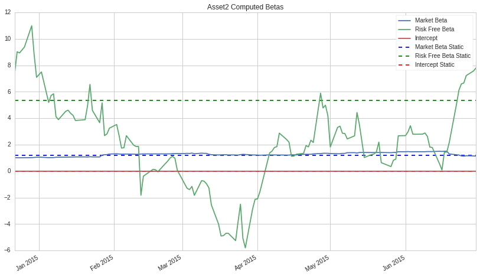
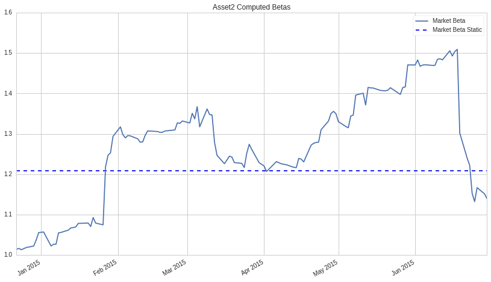
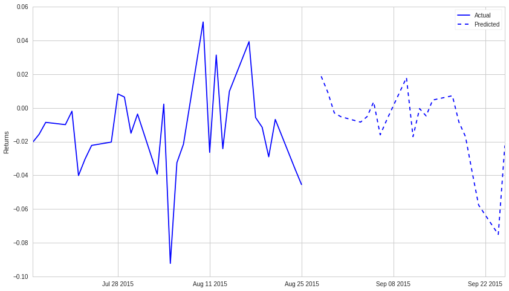

Arbitrage Pricing Theory
========================

By Evgenia “Jenny” Nitishinskaya, Delaney Granizo-Mackenzie, and Maxwell
Margenot.

Part of the Quantopian Lecture Series:

-  `www.quantopian.com/lectures <https://www.quantopian.com/lectures>`__
-  `github.com/quantopian/research_public <https://github.com/quantopian/research_public>`__

--------------

Arbitrage pricing theory is a major asset pricing theory that relies on
expressing the returns using a linear factor model:

.. math:: R_i = a_i + b_{i1} F_1 + b_{i2} F_2 + \ldots + b_{iK} F_K + \epsilon_i

This theory states that if we have modelled our rate of return as above,
then the expected returns obey

.. math::  E(R_i) = R_F + b_{i1} \lambda_1 + b_{i2} \lambda_2 + \ldots + b_{iK} \lambda_K 

where :math:`R_F` is the risk-free rate, and :math:`\lambda_j` is the
risk premium - the return in excess of the risk-free rate - for factor
:math:`j`. This premium arises because investors require higher returns
to compensate them for incurring risk. This generalizes the capital
asset pricing model (CAPM), which uses the return on the market as its
only factor.

We can compute :math:`\lambda_j` by constructing a portfolio that has a
sensitivity of 1 to factor :math:`j` and 0 to all others (called a pure
factor portfolio for factor :math:`j`), and measure its return in excess
of the risk-free rate. Alternatively, we could compute the factor
sensitivities for :math:`K` well-diversified (no asset-specific risk,
i.e. \ :math:`\epsilon_p = 0`) portfolios, and then solve the resulting
system of linear equations.

Arbitrage
---------

There are generally many, many securities in our universe. If we use
different ones to compute the :math:`\lambda`\ s, will our results be
consistent? If our results are inconsistent, there is an arbitrage
opportunity (in expectation). Arbitrage is an operation that earns a
profit without incurring risk and with no net investment of money, and
an arbitrage opportunity is an opportunity to conduct such an operation.
In this case, we mean that there is a risk-free operation with expected
positive return that requires no net investment. It occurs when
expectations of returns are inconsistent, i.e. risk is not priced
consistently across securities.

For instance, there is an arbitrage opportunity in the following case:
say there is an asset with expected rate of return 0.2 for the next year
and a :math:`\beta` of 1.2 with the market, while the market is expected
to have a rate of return of 0.1, and the risk-free rate on 1-year bonds
is 0.05. Then the APT model tells us that the expected rate of return on
the asset should be

.. math::  R_F + \beta \lambda = 0.05 + 1.2 (0.1 - 0.05) = 0.11

This does not agree with the prediction that the asset will have a rate
of return of 0.2. So, if we buy $100 of our asset, short $120 of the
market, and buy $20 of bonds, we will have invested no net money and are
not exposed to any systematic risk (we are market-neutral), but we
expect to earn :math:`0.2 \cdot 100 - 0.1 \cdot 120 + 20 \cdot 0.05 = 9`
dollars at the end of the year.

The APT assumes that these opportunities will be taken advantage of
until prices shift and the arbitrage opportunities disappear. That is,
it assumes that there are arbitrageurs who have sufficient amounts of
patience and capital. This provides a justification for the use of
empirical factor models in pricing securities: if the model were
inconsistent, there would be an arbitrage opportunity, and so the prices
would adjust.

##Goes Both Ways

Often knowing :math:`E(R_i)` is incredibly difficult, but notice that
this model tells us what the expected returns should be if the market is
fully arbitraged. This lays the groundwork for long-short equity
strategies based on factor model ranking systems. If you know what the
expected return of an asset is given that the market is arbitraged, and
you hypothesize that the market will be mostly arbitraged over the
timeframe on which you are trading, then you can construct a ranking.

##Long-Short Equity

To do this, estimate the expected return for each asset on the market,
then rank them. Long the top percentile and short the bottom percentile,
and you will make money on the difference in returns. Said another way,
if the assets at the top of the ranking on average tend to make
:math:`5\%` more per year than the market, and assets at the bottom tend
to make :math:`5\%` less, then you will make
:math:`(M + 0.05) - (M - 0.05) = 0.10` or :math:`10\%` percent per year,
where :math:`M` is the market return that gets canceled out.

Long-short equity accepts that any individual asset is very difficult to
model, relies on broad trends holding true. We can’t accurately predict
expected returns for an asset, but we can predict the expected returns
for a group of 1000 assets as the errors average out.

We will have a full lecture on long-short models later.

##How many factors do you want?

As discussed in other lectures, noteably Overfitting, having more
factors will explain more and more of your returns, but at the cost of
being more and more fit to noise in your data. Do discover true signals
and make good predictions going forward, you want to select as few
parameters as possible that still explain a large amount of the variance
in returns.

##Example: Computing Expected Returns for Two Assets

.. code:: ipython2

    import numpy as np
    import pandas as pd
    from statsmodels import regression
    import matplotlib.pyplot as plt

Let’s get some data.

.. code:: ipython2

    start_date = '2014-06-30'
    end_date = '2015-06-30'
    
    # We will look at the returns of an asset one-month into the future to model future returns.
    offset_start_date = '2014-07-31'
    offset_end_date = '2015-07-31'
    
    # Get returns data for our assets
    asset1 = get_pricing('HSC', fields='price', start_date=offset_start_date, end_date=offset_end_date).pct_change()[1:]
    asset2 = get_pricing('MSFT', fields='price', start_date=offset_start_date, end_date=offset_end_date).pct_change()[1:]
    # Get returns for the market
    bench = get_pricing('SPY', fields='price', start_date=start_date, end_date=end_date).pct_change()[1:]
    # Use an ETF that tracks 3-month T-bills as our risk-free rate of return
    treasury_ret = get_pricing('BIL', fields='price', start_date=start_date, end_date=end_date).pct_change()[1:]

.. code:: ipython2

    # Define a constant to compute intercept
    constant = pd.TimeSeries(np.ones(len(asset1.index)), index=asset1.index)
    
    df = pd.DataFrame({'R1': asset1,
                  'R2': asset2,
                  'SPY': bench,
                  'RF': treasury_ret,
                  'Constant': constant})
    df = df.dropna()

We’ll start by computing static regressions over the whole time period.

.. code:: ipython2

    OLS_model = regression.linear_model.OLS(df['R1'], df[['SPY', 'RF', 'Constant']])
    fitted_model = OLS_model.fit()
    print 'p-value', fitted_model.f_pvalue
    print fitted_model.params
    R1_params = fitted_model.params
    
    OLS_model = regression.linear_model.OLS(df['R2'], df[['SPY', 'RF', 'Constant']])
    fitted_model = OLS_model.fit()
    print 'p-value', fitted_model.f_pvalue
    print fitted_model.params
    R2_params = fitted_model.params

.. parsed-literal::

    p-value 6.68669273225e-26
    SPY         1.768275
    RF         -8.594705
    Constant   -0.002203
    dtype: float64
    p-value 6.48439859144e-23
    SPY         1.208441
    RF          5.352250
    Constant   -0.000133
    dtype: float64

As we’ve said before in other lectures, these numbers don’t tell us too
much by themselves. We need to look at the distribution of estimated
coefficients and whether it’s stable. Let’s look at the rolling 100-day
regression to see how it looks.

.. code:: ipython2

    model = pd.stats.ols.MovingOLS(y = df['R1'], x=df[['SPY', 'RF']], 
                                 window_type='rolling', 
                                 window=100)
    rolling_parameter_estimates = model.beta
    rolling_parameter_estimates.plot();
    
    plt.hlines(R1_params['SPY'], df.index[0], df.index[-1], linestyles='dashed', colors='blue')
    plt.hlines(R1_params['RF'], df.index[0], df.index[-1], linestyles='dashed', colors='green')
    plt.hlines(R1_params['Constant'], df.index[0], df.index[-1], linestyles='dashed', colors='red')
    
    plt.title('Asset1 Computed Betas');
    plt.legend(['Market Beta', 'Risk Free Beta', 'Intercept', 'Market Beta Static', 'Risk Free Beta Static', 'Intercept Static']);

.. image:: notebook_files/notebook_12_0.png

.. code:: ipython2

    model = pd.stats.ols.MovingOLS(y = df['R2'], x=df[['SPY', 'RF']], 
                                 window_type='rolling', 
                                 window=100)
    rolling_parameter_estimates = model.beta
    rolling_parameter_estimates.plot();
    
    plt.hlines(R2_params['SPY'], df.index[0], df.index[-1], linestyles='dashed', colors='blue')
    plt.hlines(R2_params['RF'], df.index[0], df.index[-1], linestyles='dashed', colors='green')
    plt.hlines(R2_params['Constant'], df.index[0], df.index[-1], linestyles='dashed', colors='red')
    
    plt.title('Asset2 Computed Betas');
    plt.legend(['Market Beta', 'Risk Free Beta', 'Intercept', 'Market Beta Static', 'Risk Free Beta Static', 'Intercept Static']);

It might seem like the market betas are stable here, but let’s zoom in
to check.

.. code:: ipython2

    model = pd.stats.ols.MovingOLS(y = df['R2'], x=df[['SPY', 'RF']], 
                                 window_type='rolling', 
                                 window=100)
    rolling_parameter_estimates = model.beta
    rolling_parameter_estimates['SPY'].plot();
    
    plt.hlines(R2_params['SPY'], df.index[0], df.index[-1], linestyles='dashed', colors='blue')
    
    plt.title('Asset2 Computed Betas');
    plt.legend(['Market Beta', 'Market Beta Static']);

As you can see, the plot scale massively affects how we perceive
estimate quality.

##Predicting the Future

Let’s use this model to predict future prices for these assets.

.. code:: ipython2

    start_date = '2014-07-25'
    end_date = '2015-07-25'
    
    # We will look at the returns of an asset one-month into the future to model future returns.
    offset_start_date = '2014-08-25'
    offset_end_date = '2015-08-25'
    
    # Get returns data for our assets
    asset1 = get_pricing('HSC', fields='price', start_date=offset_start_date, end_date=offset_end_date).pct_change()[1:]
    # Get returns for the market
    bench = get_pricing('SPY', fields='price', start_date=start_date, end_date=end_date).pct_change()[1:]
    # Use an ETF that tracks 3-month T-bills as our risk-free rate of return
    treasury_ret = get_pricing('BIL', fields='price', start_date=start_date, end_date=end_date).pct_change()[1:]
    
    
    # Define a constant to compute intercept
    constant = pd.TimeSeries(np.ones(len(asset1.index)), index=asset1.index)
    
    df = pd.DataFrame({'R1': asset1,
                  'SPY': bench,
                  'RF': treasury_ret,
                  'Constant': constant})
    df = df.dropna()

We’ll perform a historical regression to get our model parameter
estimates.

.. code:: ipython2

    OLS_model = regression.linear_model.OLS(df['R1'], df[['SPY', 'RF', 'Constant']])
    fitted_model = OLS_model.fit()
    print 'p-value', fitted_model.f_pvalue
    print fitted_model.params
    
    b_SPY = fitted_model.params['SPY']
    b_RF = fitted_model.params['RF']
    a = fitted_model.params['Constant']

.. parsed-literal::

    p-value 3.74649506793e-24
    SPY         1.738003
    RF         -7.382430
    Constant   -0.002555
    dtype: float64

Get the factor data for the last month so we can predict the next month.

.. code:: ipython2

    start_date = '2015-07-25'
    end_date = '2015-08-25'
    
    # Get returns for the market
    last_month_bench = get_pricing('SPY', fields='price', start_date=start_date, end_date=end_date).pct_change()[1:]
    # Use an ETF that tracks 3-month T-bills as our risk-free rate of return
    last_month_treasury_ret = get_pricing('BIL', fields='price', start_date=start_date, end_date=end_date).pct_change()[1:]

Make our predictions.

.. code:: ipython2

    predictions = b_SPY * last_month_bench + b_RF * last_month_treasury_ret + a
    predictions.index = predictions.index + pd.DateOffset(months=1)

.. code:: ipython2

    plt.plot(asset1.index[-30:], asset1.values[-30:], 'b-')
    plt.plot(predictions.index, predictions, 'b--')
    plt.ylabel('Returns')
    plt.legend(['Actual', 'Predicted']);

Of course, this analysis hasn’t yet told us anything about the quality
of our predictions. To check the quality of our predictions we need to
use techniques such as out of sample testing or cross-validation. For
the purposes of long-short equity ranking systems, the Spearman
Correlation lecture details a way to check the quality of a ranking
system.

##Important Note!

Again, any of these individual predictions will probably be inaccurate.
Industry-quality modeling makes predictions for thousands of assets and
relies on broad tends holding. If I told you that I have a predictive
model with a 51% success rate, you would not make one prediction and bet
all your money on it. You would make thousands of predictions and divide
your money between them.

*This presentation is for informational purposes only and does not
constitute an offer to sell, a solicitation to buy, or a recommendation
for any security; nor does it constitute an offer to provide investment
advisory or other services by Quantopian, Inc. (“Quantopian”). Nothing
contained herein constitutes investment advice or offers any opinion
with respect to the suitability of any security, and any views expressed
herein should not be taken as advice to buy, sell, or hold any security
or as an endorsement of any security or company. In preparing the
information contained herein, Quantopian, Inc. has not taken into
account the investment needs, objectives, and financial circumstances of
any particular investor. Any views expressed and data illustrated herein
were prepared based upon information, believed to be reliable, available
to Quantopian, Inc. at the time of publication. Quantopian makes no
guarantees as to their accuracy or completeness. All information is
subject to change and may quickly become unreliable for various reasons,
including changes in market conditions or economic circumstances.*
