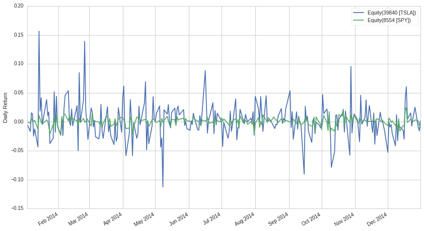
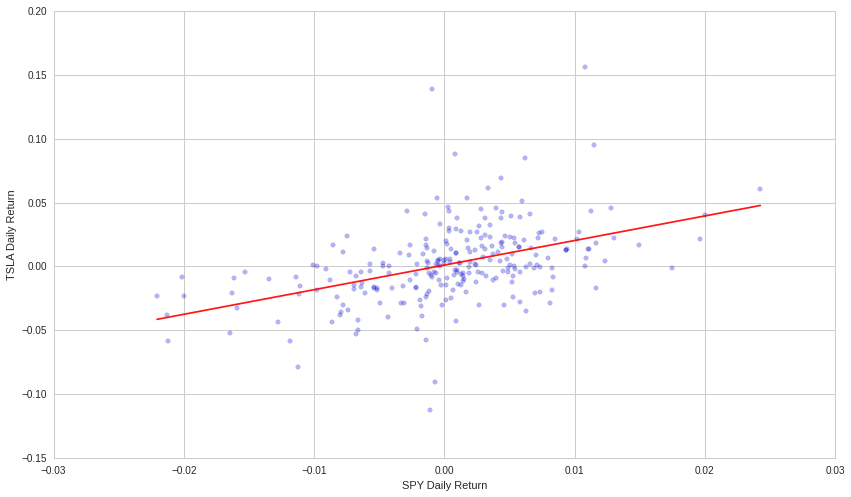
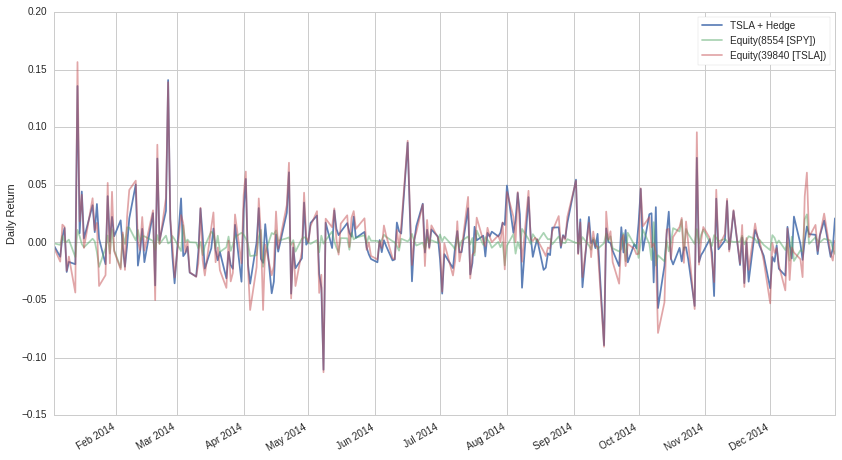
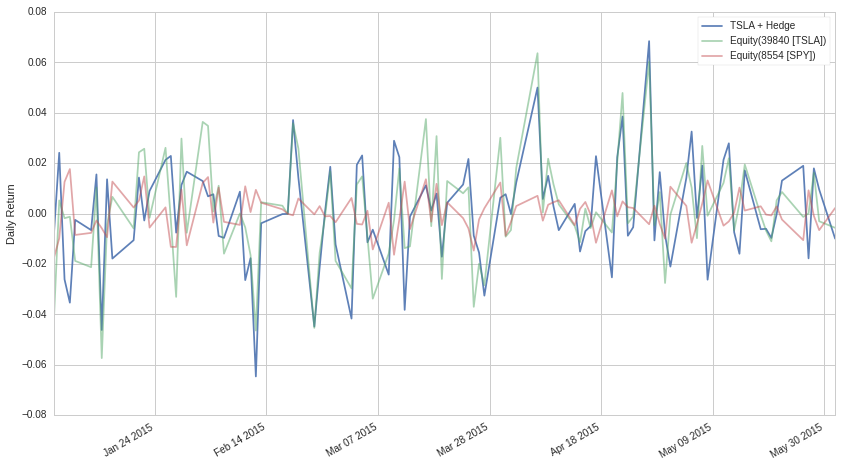

#Beta Hedging By Evgenia “Jenny” Nitishinskaya and Delaney
Granizo-Mackenzie with example algorithms by David Edwards

Part of the Quantopian Lecture Series:

-  `www.quantopian.com/lectures <https://www.quantopian.com/lectures>`__
-  `github.com/quantopian/research_public <https://github.com/quantopian/research_public>`__

--------------

##Factor Models

Factor models are a way of explaining the returns of one asset via a
linear combination of the returns of other assets. The general form of a
factor model is

.. math:: Y = \alpha + \beta_1 X_1 + \beta_2 X_2 + \dots + \beta_n X_n

This looks familiar, as it is exactly the model type that a linear
regression fits. The :math:`X`\ ’s can also be indicators rather than
assets. An example might be a analyst estimation.

##What is Beta?

An asset’s beta to another asset is just the :math:`\beta` from the
above model. For instance, if we regressed TSLA against the S&P 500
using the model :math:`Y_{TSLA} = \alpha + \beta X`, then TSLA’s beta
exposure to the S&P 500 would be that beta. If we used the model
:math:`Y_{TSLA} = \alpha + \beta X_{SPY} + \beta X_{AAPL}`, then we now
have two betas, one is TSLA’s exposure to the S&P 500 and one is TSLA’s
exposure to AAPL.

Often “beta” will refer to a stock’s beta exposure to the S&P 500. We
will use it to mean that unless otherwise specified.

.. code:: ipython2

    # Import libraries
    import numpy as np
    from statsmodels import regression
    import statsmodels.api as sm
    import matplotlib.pyplot as plt
    import math

.. code:: ipython2

    # Get data for the specified period and stocks
    start = '2014-01-01'
    end = '2015-01-01'
    asset = get_pricing('TSLA', fields='price', start_date=start, end_date=end)
    benchmark = get_pricing('SPY', fields='price', start_date=start, end_date=end)
    
    # We have to take the percent changes to get to returns
    # Get rid of the first (0th) element because it is NAN
    r_a = asset.pct_change()[1:]
    r_b = benchmark.pct_change()[1:]
    
    # Let's plot them just for fun
    r_a.plot()
    r_b.plot()
    plt.ylabel("Daily Return")
    plt.legend();

Now we can perform the regression to find :math:`\alpha` and
:math:`\beta`:

.. code:: ipython2

    # Let's define everything in familiar regression terms
    X = r_b.values # Get just the values, ignore the timestamps
    Y = r_a.values
    
    def linreg(x,y):
        # We add a constant so that we can also fit an intercept (alpha) to the model
        # This just adds a column of 1s to our data
        x = sm.add_constant(x)
        model = regression.linear_model.OLS(y,x).fit()
        # Remove the constant now that we're done
        x = x[:, 1]
        return model.params[0], model.params[1]
    
    alpha, beta = linreg(X,Y)
    print 'alpha: ' + str(alpha)
    print 'beta: ' + str(beta)

.. parsed-literal::

    alpha: 0.00108062811902
    beta: 1.92705010047

If we plot the line :math:`\alpha + \beta X`, we can see that it does
indeed look like the line of best fit:

.. code:: ipython2

    X2 = np.linspace(X.min(), X.max(), 100)
    Y_hat = X2 * beta + alpha
    
    plt.scatter(X, Y, alpha=0.3) # Plot the raw data
    plt.xlabel("SPY Daily Return")
    plt.ylabel("TSLA Daily Return")
    
     # Add the regression line, colored in red
    plt.plot(X2, Y_hat, 'r', alpha=0.9);

##Risk Exposure

More generally, this beta gets at the concept of how much risk exposure
you take on by holding an asset. If an asset has a high beta exposure to
the S&P 500, then while it will do very well while the market is rising,
it will do very poorly when the market falls. A high beta corresponds to
high speculative risk. You are taking out a more volatile bet.

At Quantopian, we value stratgies that have negligible beta exposure to
as many factors as possible. What this means is that all of the returns
in a strategy lie in the :math:`\alpha` portion of the model, and are
independent of other factors. This is highly desirable, as it means that
the strategy is agnostic to market conditions. It will make money
equally well in a crash as it will during a bull market. These
strategies are the most attractive to individuals with huge cash pools
such as endowments and soverign wealth funds.

##Risk Management

The process of reducing exposure to other factors is known as risk
management. Hedging is one of the best ways to perform risk management
in practice.

###Hedging

If we determine that our portfolio’s returns are dependent on the market
via this relation

.. math:: Y_{portfolio} = \alpha + \beta X_{SPY}

then we can take out a short position in SPY to try to cancel out this
risk. The amount we take out is :math:`-\beta V` where :math:`V` is the
total value of our portfolio. This works because if our returns are
approximated by :math:`\alpha + \beta X_{SPY}`, then adding a short in
SPY will make our new returns be
:math:`\alpha + \beta X_{SPY} - \beta X_{SPY} = \alpha`. Our returns are
now purely alpha, which is independent of SPY and will suffer no risk
exposure to the market.

###Market Neutral

When a stragy exhibits a consistent beta of 0, we say that this strategy
is market neutral.

###Problems with Estimation

The problem here is that the beta we estimated is not necessarily going
to stay the same as we walk forward in time. As such the amount of short
we took out in the SPY may not perfectly hedge our portfolio, and in
practice it is quite difficult to reduce beta by a significant amount.

We will talk more about problems with estimating parameters in future
lectures. In short, each estimate has a stardard error that corresponds
with how stable the estimate is within the observed data.

Implementing hedging
====================

Now that we know how much to hedge, let’s see how it affects our
returns. We will build our portfolio using the asset and the benchmark,
weighing the benchmark by :math:`-\beta` (negative since we are short in
it).

.. code:: ipython2

    # Construct a portfolio with beta hedging
    portfolio = -1*beta*r_b + r_a
    portfolio.name = "TSLA + Hedge"
    
    # Plot the returns of the portfolio as well as the asset by itself
    portfolio.plot(alpha=0.9)
    r_b.plot(alpha=0.5);
    r_a.plot(alpha=0.5);
    plt.ylabel("Daily Return")
    plt.legend();

It looks like the portfolio return follows the asset alone fairly
closely. We can quantify the difference in their performances by
computing the mean returns and the volatilities (standard deviations of
returns) for both:

.. code:: ipython2

    print "means: ", portfolio.mean(), r_a.mean()
    print "volatilities: ", portfolio.std(), r_a.std()

.. parsed-literal::

    means:  0.00108062811902 0.00202262496904
    volatilities:  0.0272298767724 0.0304875405804

We’ve decreased volatility at the expense of some returns. Let’s check
that the alpha is the same as before, while the beta has been
eliminated:

.. code:: ipython2

    P = portfolio.values
    alpha, beta = linreg(X,P)
    print 'alpha: ' + str(alpha)
    print 'beta: ' + str(beta)

.. parsed-literal::

    alpha: 0.00108062811902
    beta: 5.6898930012e-16

Note that we developed our hedging strategy using historical data. We
can check that it is still valid out of sample by checking the alpha and
beta values of the asset and the hedged portfolio in a different time
frame:

.. code:: ipython2

    # Get the alpha and beta estimates over the last year
    start = '2014-01-01'
    end = '2015-01-01'
    asset = get_pricing('TSLA', fields='price', start_date=start, end_date=end)
    benchmark = get_pricing('SPY', fields='price', start_date=start, end_date=end)
    r_a = asset.pct_change()[1:]
    r_b = benchmark.pct_change()[1:]
    X = r_b.values
    Y = r_a.values
    historical_alpha, historical_beta = linreg(X,Y)
    print 'Asset Historical Estimate:'
    print 'alpha: ' + str(historical_alpha)
    print 'beta: ' + str(historical_beta)
    
    # Get data for a different time frame:
    start = '2015-01-01'
    end = '2015-06-01'
    asset = get_pricing('TSLA', fields='price', start_date=start, end_date=end)
    benchmark = get_pricing('SPY', fields='price', start_date=start, end_date=end)
    
    # Repeat the process from before to compute alpha and beta for the asset
    r_a = asset.pct_change()[1:]
    r_b = benchmark.pct_change()[1:]
    X = r_b.values
    Y = r_a.values
    alpha, beta = linreg(X,Y)
    print 'Asset Out of Sample Estimate:'
    print 'alpha: ' + str(alpha)
    print 'beta: ' + str(beta)
    
    # Create hedged portfolio and compute alpha and beta
    portfolio = -1*historical_beta*r_b + r_a
    P = portfolio.values
    alpha, beta = linreg(X,P)
    print 'Portfolio Out of Sample:'
    print 'alpha: ' + str(alpha)
    print 'beta: ' + str(beta)
    
    
    # Plot the returns of the portfolio as well as the asset by itself
    portfolio.name = "TSLA + Hedge"
    portfolio.plot(alpha=0.9)
    r_a.plot(alpha=0.5);
    r_b.plot(alpha=0.5)
    plt.ylabel("Daily Return")
    plt.legend();

.. parsed-literal::

    Asset Historical Estimate:
    alpha: 0.00108062811902
    beta: 1.92705010047
    Asset Out of Sample Estimate:
    alpha: 0.00114816439781
    beta: 1.04339843544
    Portfolio Out of Sample:
    alpha: 0.00114816439781
    beta: -0.883651665033

As we can see, the beta estimate changes a good deal when we look at the
out of sample estimate. The beta that we computed over our historical
data doesn’t do a great job at reducing the beta of our portfolio, but
does manage to reduce the magnitude by about 1/2.

##The alpha/beta Tradeoff

Hedging against a benchmark such as the market will indeed reduce your
returns while the market is not doing poorly. This is, however,
completely fine. If your algorithm is less volatile, you will be able to
take out leverage on your strategy and multiply your returns back up to
their original amount. Even better, your returns will be far more stable
than the original volatile beta exposed strategy.

By and large, even though high-beta strategies tend to be deceptively
attractive due to their extremely good returns during periods of market
growth, they fail in the long term as they will suffer extreme losses
during a downturn.

#Other types of hedging

Although we will not execute them here, there are strategies for hedging
that may be better suited for other investment approaches.

##Pairs Trading

One is pairs trading, in which a second asset is used in place of the
benchmark here. This would allow you, for instance, to cancel out the
volatility in an industry by being long in the stock of one company and
short in the stock of another company in the same industry.

`www.quantopian.com/lectures <https://www.quantopian.com/lectures>`__

##Long Short Equity

In this case we define a ranking over a group of :math:`n` equities,
then long the top :math:`p\%` and short the bottom :math:`p\%` in equal
dollar volume. This has the advantage of being implicitly, versus
explicitly, hedged when :math:`n` is large. To see why this is the case,
imagine buying a set of 100 securities randomly. The chance that the
market exposure beta of these 100 is far from 1.0 is very low, as we
have taken a large sample of the market. Similarly, when we rank by some
independent metric and buy the top 100, the chance that we select
securities whose overall beta is far from 1.0 is low. So in selecting
100 long and 100 short, the strategy beta should be very close to 1 - 1
= 0. Obviously some ranking systems will introduce a sample bias and
break this assumption, for example ranking by the estimated beta of the
equity.

Another advantage of long short equity strategies is that you are making
a bet on the ranking, or in other words the differential in performance
between the top and bottom ranked equities. This means that you don’t
have to even worry about the alpha/beta tradeoff encountered in hedging.

*This presentation is for informational purposes only and does not
constitute an offer to sell, a solicitation to buy, or a recommendation
for any security; nor does it constitute an offer to provide investment
advisory or other services by Quantopian, Inc. (“Quantopian”). Nothing
contained herein constitutes investment advice or offers any opinion
with respect to the suitability of any security, and any views expressed
herein should not be taken as advice to buy, sell, or hold any security
or as an endorsement of any security or company. In preparing the
information contained herein, Quantopian, Inc. has not taken into
account the investment needs, objectives, and financial circumstances of
any particular investor. Any views expressed and data illustrated herein
were prepared based upon information, believed to be reliable, available
to Quantopian, Inc. at the time of publication. Quantopian makes no
guarantees as to their accuracy or completeness. All information is
subject to change and may quickly become unreliable for various reasons,
including changes in market conditions or economic circumstances.*
