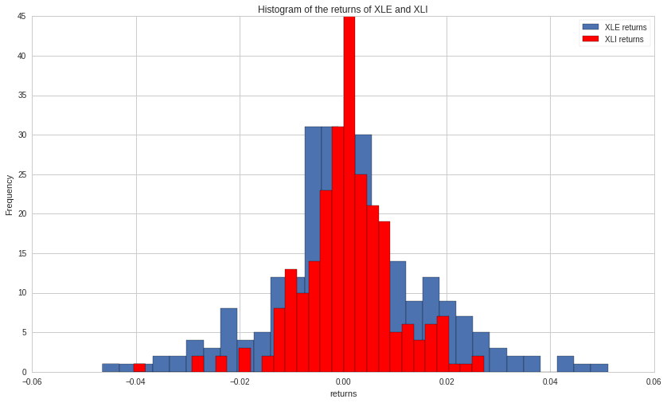
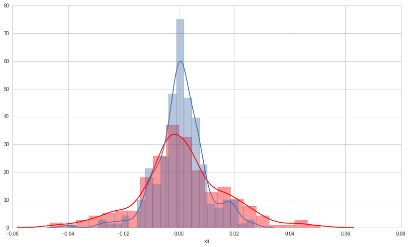

Exercises: Comparing ETFs - Answer Key
======================================

By Christopher van Hoecke, Maxwell Margenot, and Delaney Mackenzie

Lecture Link :
--------------

https://www.quantopian.com/lectures/statistical-moments

https://www.quantopian.com/lectures/hypothesis-testing

###IMPORTANT NOTE: This lecture corresponds to the statistical moments
and hypothesis testing lecture, which is part of the Quantopian lecture
series. This homework expects you to rely heavily on the code presented
in the corresponding lecture. Please copy and paste regularly from that
lecture when starting to work on the problems, as trying to do them from
scratch will likely be too difficult.

When you feel comfortable with the topics presented here, see if you can
create an algorithm that qualifies for the Quantopian Contest.
Participants are evaluated on their ability to produce risk-constrained
alpha and the top 10 contest participants are awarded cash prizes on a
daily basis.

https://www.quantopian.com/contest

Part of the Quantopian Lecture Series:

-  `www.quantopian.com/lectures <https://www.quantopian.com/lectures>`__
-  `github.com/quantopian/research_public <https://github.com/quantopian/research_public>`__

--------------

Key Concepts
------------

t-statistic formula for unequal variances : $ t =
:raw-latex:`\frac{\bar{X}_1 - \bar{X}_2}{(\frac{s_1^2}{n_1} + \frac{s_2^2}{n_2})^{1/2}}`$

Where :math:`s_1` and :math:`s_2` are the standard deviation of set 1
and set 2; and :math:`n_1` and :math:`n_2` are the number of
observations we have.

.. code:: ipython2

    # Useful functions
    def normal_test(X):
        z, pval = stats.normaltest(X)
        if pval < 0.05:
            print 'Values are not normally distributed.'
        else: 
            print 'Values are normally distributed.'
        return

.. code:: ipython2

    # Useful Libraries
    import numpy as np
    import matplotlib.pyplot as plt
    from scipy import stats
    import seaborn as sns

Data:
^^^^^

.. code:: ipython2

    # Get pricing data for an energy (XLE) and industrial (XLI) ETF
    xle = get_pricing('XLE', fields = 'price', start_date = '2016-01-01', end_date = '2017-01-01')
    xli = get_pricing('XLI', fields = 'price', start_date = '2016-01-01', end_date = '2017-01-01')
    
    # Compute returns
    xle_returns = xle.pct_change()[1:]
    xli_returns = xli.pct_change()[1:]

Exercise 1 : Hypothesis Testing on Variances.
---------------------------------------------

-  Plot the histogram of the returns of XLE and XLI
-  Check to see if each return stream is normally distributed
-  If the assets are normally distributed, use the F-test to perform a
   hypothesis test and decide whether they have the two assets have the
   same variance.
-  If the assets are **not** normally distributed, use the Levene test
   (in the scipy library) to perform a hypothesis test on variance.

.. code:: ipython2

    xle = plt.hist(xle_returns, bins=30)
    xli = plt.hist(xli_returns, bins=30, color='r')
    
    plt.xlabel('returns')
    plt.ylabel('Frequency')
    plt.title('Histogram of the returns of XLE and XLI')
    plt.legend(['XLE returns', 'XLI returns']);

.. code:: ipython2

    # Checking for normality using function above. 
    
    print 'XLE'
    normal_test(xle_returns)
    print 'XLI'
    normal_test(xli_returns)

.. parsed-literal::

    XLE
    Values are normally distributed.
    XLI
    Values are not normally distributed.

.. code:: ipython2

    # Because the data is not normally distributed, we must use the levene and not the F-test of variance. 
    
    stats.levene(xle_returns, xli_returns)

.. parsed-literal::

    LeveneResult(statistic=42.17712538196367, pvalue=2.0149310189859354e-10)

Since we find a pvalue for the Levene test of less than our
:math:`\alpha` level (0.05), we can reject the null hypothesis that the
variability of the two groups are equal thus implying that **the
variances are unequal.**

--------------

Exercise 2 : Hypothesis Testing on Means.
-----------------------------------------

Since we know that the variances are not equal, we must use Welch’s
t-test. - Calculate the mean returns of XLE and XLI. - Find the
difference between the two means. - Calculate the standard deviation of
the returns of XLE and XLI - Using the formula given above, calculate
the t-test statistic (Using :math:`\alpha = 0.05`) for Welch’s t-test to
test whether the mean returns of XLE and XLI are different. - Consult
the `Hypothesis Testing
Lecture <https://www.quantopian.com/lectures#Hypothesis-Testing>`__ to
calculate the p-value for this test. Are the mean returns of XLE and XLI
the same?

-  Now use the t-test function for two independent samples from the
   scipy library. Compare the results.

.. code:: ipython2

    # Manually calculating the t-statistic
    
    N1 = len(xle_returns)
    N2 = len(xli_returns)
    
    m1 = xle_returns.mean()
    m2 = xli_returns.mean()
    
    s1 = xle_returns.std()
    s2 = xli_returns.std()
    
    test_statistic = (m1 - m2) / (s1**2 / N1 + s2**2 / N2)**0.5
    print 't-test statistic:', test_statistic

.. parsed-literal::

    t-test statistic: 0.246212554505

.. code:: ipython2

    # Alternative form, using the scipy library on python. 
    
    stats.ttest_ind(xle_returns, xli_returns, equal_var=False)

.. parsed-literal::

    Ttest_indResult(statistic=0.24621255450523835, pvalue=0.80564256071472806)

--------------

Exercise 3 : Skewness
---------------------

-  Calculate the mean and median of the two assets
-  Calculate the skewness using the scipy library

.. code:: ipython2

    # Calculate the mean and median of xle and xli using the numpy library
    
    xle_mean = np.mean(xle_returns)
    xle_median = np.median(xle_returns)
    print 'Mean of XLE returns = ', xle_mean, '; median = ', xle_median
    
    xli_mean = np.mean(xli_returns)
    xli_median = np.median(xli_returns)
    print 'Mean of XLI returns = ', xli_mean, '; median = ', xli_median

.. parsed-literal::

    Mean of XLE returns =  0.0011018423017 ; median =  0.000303393455803
    Mean of XLI returns =  0.000822235474081 ; median =  0.000546099936288

.. code:: ipython2

    # Print values of Skewness for xle and xli returns 
    
    print 'Skew of XLE returns:', stats.skew(xle_returns)
    print 'Skew of XLI returns:',  stats.skew(xli_returns)

.. parsed-literal::

    Skew of XLE returns: 0.090984051661
    Skew of XLI returns: -0.332324357079

And the skewness of XLE returns of values > 0 means that there is more
weight in the right tail of the distribution. The skewness of XLI
returns of value > 0 means that there is more weight in the left tail of
the distribution.

--------------

Exercise 4 : Kurtosis
---------------------

-  Check the kurtosis of the two assets, using the scipy library.
-  Using the seaborn library, plot the distribution of XLE and XLI
   returns.

Recall: - Kurtosis > 3 is leptokurtic, a highly peaked, narrow deviation
from the mean - Kurtosis = 3 is mesokurtic. The most significant
mesokurtic distribution is the normal distribution family. - Kurtosis <
3 is platykurtic, a lower-peaked, broad deviation from the mean

.. code:: ipython2

    # Print value of Kurtosis for xle and xli returns 
    
    print 'kurtosis:', stats.kurtosis(xle_returns)
    print 'kurtosis:', stats.kurtosis(xli_returns)

.. parsed-literal::

    kurtosis: 0.854981014172
    kurtosis: 2.17804780091

.. code:: ipython2

    # Distribution plot of XLE returns in red (for Kurtosis of 1.6). 
    # Distribution plot of XLI returns in blue (for Kurtosis of 2.0).
    
    xle = sns.distplot(xle_returns, color = 'r', axlabel  = 'xle')
    xli = sns.distplot(xli_returns, axlabel = 'xli');

We can clearly see from the two graphs that as our kurtosis gets lower,
the distribution gets more flat.

*This presentation is for informational purposes only and does not
constitute an offer to sell, a solicitation to buy, or a recommendation
for any security; nor does it constitute an offer to provide investment
advisory or other services by Quantopian, Inc. (“Quantopian”). Nothing
contained herein constitutes investment advice or offers any opinion
with respect to the suitability of any security, and any views expressed
herein should not be taken as advice to buy, sell, or hold any security
or as an endorsement of any security or company. In preparing the
information contained herein, Quantopian, Inc. has not taken into
account the investment needs, objectives, and financial circumstances of
any particular investor. Any views expressed and data illustrated herein
were prepared based upon information, believed to be reliable, available
to Quantopian, Inc. at the time of publication. Quantopian makes no
guarantees as to their accuracy or completeness. All information is
subject to change and may quickly become unreliable for various reasons,
including changes in market conditions or economic circumstances.*
