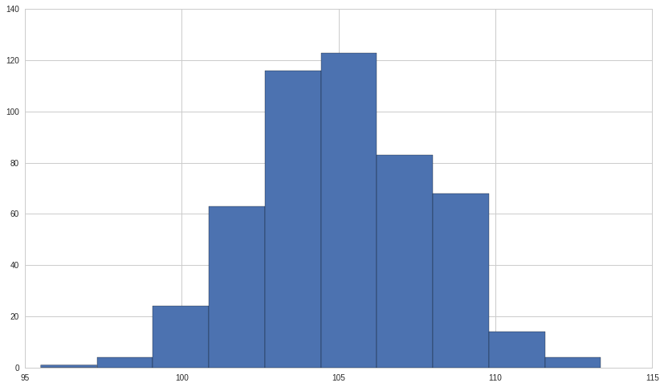
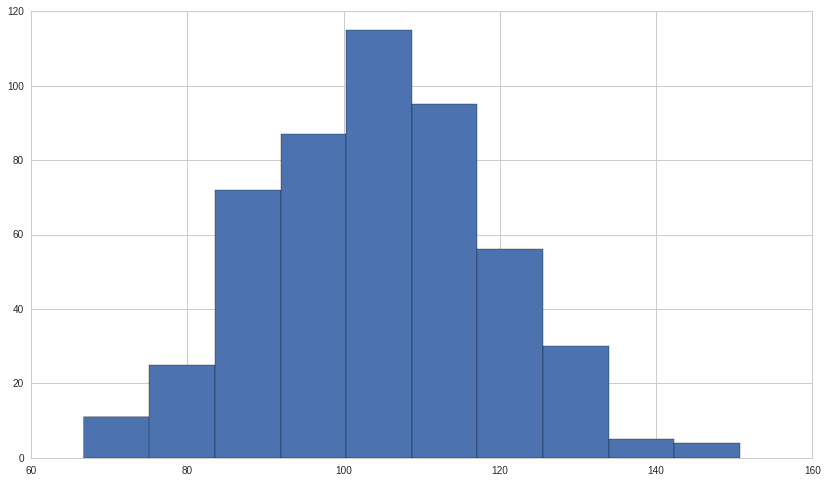
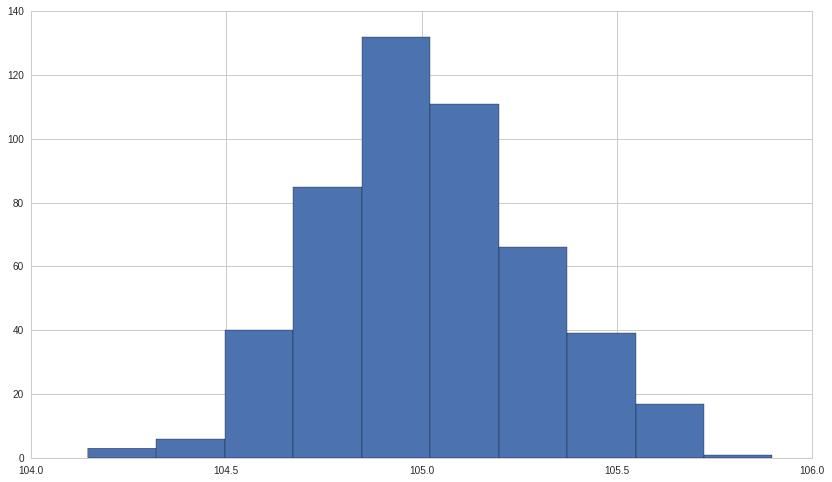
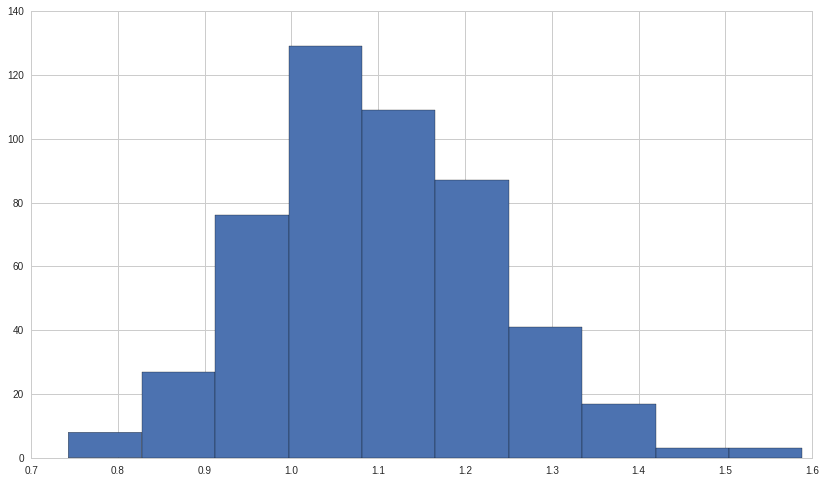

Exercises: Confidence Intervals - Answer Key
============================================

By Christopher Fenaroli and Delaney Mackenzie

Lecture Link:
-------------

https://www.quantopian.com/lectures/confidence-intervals

IMPORTANT NOTE:
~~~~~~~~~~~~~~~

This lecture corresponds to the Confidence Intervals lecture, which is
part of the Quantopian lecture series. This homework expects you to rely
heavily on the code presented in the corresponding lecture. Please copy
and paste regularly from that lecture when starting to work on the
problems, as trying to do them from scratch will likely be too
difficult.

When you feel comfortable with the topics presented here, see if you can
create an algorithm that qualifies for the Quantopian Contest.
Participants are evaluated on their ability to produce risk-constrained
alpha and the top 10 contest participants are awarded cash prizes on a
daily basis.

https://www.quantopian.com/contest

Part of the Quantopian Lecture Series:

-  `www.quantopian.com/lectures <https://www.quantopian.com/lectures>`__
-  `github.com/quantopian/research_public <https://github.com/quantopian/research_public>`__

--------------

Key Concepts
------------

.. code:: ipython2

    def generate_autocorrelated_data(theta, mu, sigma, N):
        X = np.zeros((N, 1))
        for t in range(1, N):
            X[t] = theta * X[t-1] + np.random.normal(mu, sigma)
        return X
    
    def newey_west_SE(data):
        ind = range(0, len(data))
        ind = sm.add_constant(ind)
        model = regression.linear_model.OLS(data, ind).fit(cov_type='HAC',cov_kwds={'maxlags':1})
        return model.bse[0]
    
    def newey_west_matrix(data):
        ind = range(0, len(data))
        ind = sm.add_constant(ind)
        model = regression.linear_model.OLS(data, ind).fit()
        return sw.cov_hac(model)

.. code:: ipython2

    # Useful Libraries
    import numpy as np
    import seaborn as sns
    from scipy import stats
    import matplotlib.pyplot as plt
    from statsmodels.stats.stattools import jarque_bera
    import statsmodels.stats.sandwich_covariance as sw
    from statsmodels import regression
    import statsmodels.api as sm

Data
^^^^

.. code:: ipython2

    np.random.seed(11)
    POPULATION_MU = 105
    POPULATION_SIGMA = 20
    sample_size = 50

Exercise 1: Determining Confidence Intervals
============================================

a. Mean
-------

Determine the mean of the following artificial data in ``sample``.

.. code:: ipython2

    sample = np.random.normal(POPULATION_MU, POPULATION_SIGMA, sample_size)
    
    #Your code goes here
    
    Mean = np.mean(sample)
    
    print "Mean:", Mean

.. parsed-literal::

    Mean: 103.223647005

b. Standard Deviation
---------------------

Determine standard deviation of the sample.

.. code:: ipython2

    #Your code goes here
    
    SD = np.std(sample)
    
    print "Standard Deviation:", SD

.. parsed-literal::

    Standard Deviation: 18.0645730239

c. Standard Error
-----------------

Using the standard deviation and ``sample_size``, determine the standard
error for the sample.

.. code:: ipython2

    #Your code goes here
    
    SE = SD / np.sqrt(sample_size)
    
    print "Standard Error:", SE

.. parsed-literal::

    Standard Error: 2.55471641688

d. Confidence Intervals
-----------------------

Using the standard error and mean, determine 95% ``(Z = 1.96)``, 90%
``(Z = 1.64)``, and 80% ``(Z = 1.28)`` confidence intervals for the
sample.

.. code:: ipython2

    #Your code goes here
    
    print "95% Confidence Interval:", (-1.96 * SE + Mean, 1.96 * SE + Mean)
    print "90% Confidence Interval:", (-1.64 * SE + Mean, 1.64 * SE + Mean)
    print "80% Confidence Interval:", (-1.28 * SE + Mean, 1.28 * SE + Mean)

.. parsed-literal::

    95% Confidence Interval: (98.216402827473189, 108.23089118165043)
    90% Confidence Interval: (99.03391208087541, 107.41338192824821)
    80% Confidence Interval: (99.953609990952913, 106.49368401817071)

--------------

Exercise 2: Interpreting Confidence Intervals
=============================================

Assuming our interval was correctly calculated and that the underlying
data was independent, if we take many samples and make many 95%
confidence intervals, the intervals will contain the true mean 95% of
the time. Run 1000 samples and measure how many of their confidence
intervals actually contain the true mean.

.. code:: ipython2

    n = 1000
    correct = 0
    samples = [np.random.normal(loc=POPULATION_MU, scale=POPULATION_SIGMA, size=sample_size) for i in range(n)]
    
    #Your code goes here
    
    for i in range(n):
        sample_mean = np.mean(samples[i])
        sample_SE = stats.sem(samples[i])
        if ((POPULATION_MU >= -1.96 * sample_SE + sample_mean) and (POPULATION_MU <= 1.96 * sample_SE + sample_mean)):
            correct += 1;
    
    print "Expected Result:", .95 * 1000
    print "Actual Result", correct

.. parsed-literal::

    Expected Result: 950.0
    Actual Result 932

--------------

Exercise 3: Central Limit Theorem
=================================

a. Plotting Sample Means - Normal
---------------------------------

Assuming our samples are independent, the distribution of the sample
means should be normally distributed, regardless of the underlying
distribution.

Draw 500 samples of size ``sample_size`` from the same normal
distribution from question 1, plot the means of each of the samples, and
check to see if the distribution of the sample means is normal using the
``jarque_bera`` function (see
`here <https://www.quantopian.com/lectures/statistical-moments>`__ more
information on the Jarque-Bera test)

.. code:: ipython2

    n = 500
    normal_samples = [np.mean(np.random.normal(loc=POPULATION_MU, scale=POPULATION_SIGMA, size=sample_size)) for i in range(n)]
    
    #Your code goes here
    
    plt.hist(normal_samples, 10)
    
    _, pvalue, _, _ = jarque_bera(normal_samples)
    
    print pvalue
    if pvalue > 0.05:
        print 'The distribution of sample means is likely normal.'
    else:
        print 'The distribution of sample means is likely not normal.'

.. parsed-literal::

    0.639560006167
    The distribution of sample means is likely normal.

b. Plotting Sample Means - Exponential
--------------------------------------

Draw 500 samples of size ``sample_size`` from a new exponential
distribution, plot the means of each of the samples, and check to see if
the distribution of the sample means is normal.

.. code:: ipython2

    n = 500
    expo_samples = [np.mean(np.random.exponential(POPULATION_MU, sample_size)) for i in range(n)]
    
    #Your code goes here
    
    plt.hist(expo_samples, 10)
    
    _, pvalue, _, _ = jarque_bera(expo_samples)
    
    print pvalue
    if pvalue > 0.05:
        print 'The distribution of sample means is likely normal, despite the underlying distribution being non-normal (exponential).'
    else:
        print 'The distribution of sample means is likely not normal.'

.. parsed-literal::

    0.306129798551
    The distribution of sample means is likely normal, despite the underlying distribution being non-normal (exponential).

c.i Plotting Sample Means - Autocorrelated
------------------------------------------

Draw 500 samples of size ``sample_size`` from a new autocorrelated
(dependent) distribution, plot the means of each of the samples, and
check to see if the distribution of the sample means is normal.

.. code:: ipython2

    n = 500
    autocorrelated_samples = [(generate_autocorrelated_data(0.5, 0, 1, sample_size) + POPULATION_MU) for i in range(n)]
    autocorrelated_means = [np.mean(autocorrelated_samples[i]) for i in range(n)]
    
    #Your code goes here
    
    plt.hist(autocorrelated_means, 10)
    
    _, pvalue, _, _ = jarque_bera(autocorrelated_means)
    
    print pvalue
    if pvalue > 0.05:
        print 'The distribution of sample means is likely normal, despite an autocorrelated underlying distribution.'
    else:
        print 'The distribution of sample means is likely not normal.'

.. parsed-literal::

    0.440090741806
    The distribution of sample means is likely normal, despite an autocorrelated underlying distribution.

c.ii Plotting Sample Standard Deviations - Autocorrelated
---------------------------------------------------------

Draw 500 samples of size ``sample_size`` from the same autocorrelated
distribution, plot the standard deviations of each of the samples, and
check to see if the distribution of the sample standard deviations is
normal.

.. code:: ipython2

    n = 500
    autocorrelated_samples = [(generate_autocorrelated_data(0.5, 0, 1, sample_size) + POPULATION_MU) for i in range(n)]
    autocorrelated_stds = [np.std(autocorrelated_samples[i]) for i in range(n)]
    
    #Your code goes here
    
    plt.hist(autocorrelated_stds, 10)
    
    _, pvalue, _, _ = jarque_bera(autocorrelated_stds)
    
    print pvalue
    if pvalue > 0.05:
        print 'The distribution of sample standard deviations is likely normal.'
    else:
        print 'The distribution of sample standard deviations is likely not normal, due to the autocorrelated underlying distribution and the different assumptions for the CLT for means and for standard deviations.'
        

.. parsed-literal::

    0.00411075021602
    The distribution of sample standard deviations is likely not normal, due to the autocorrelated underlying distribution and the different assumptions for the CLT for means and for standard deviations.

--------------

Exercise 4: Small Sample Sizes
==============================

a. Error Due to Small Sample Size
---------------------------------

Run 100 samples of size ``small_size`` and measure how many of their 95%
confidence intervals actually contain the true mean.

.. code:: ipython2

    n = 100
    small_size = 3
    correct = 0
    samples = [np.random.normal(loc=POPULATION_MU, scale=POPULATION_SIGMA, size=small_size) for i in range(n)]
        
    #Your code goes here
        
    for i in range(n):
        sample_mean = np.mean(samples[i])
        sample_SE = stats.sem(samples[i])
        if ((POPULATION_MU >= -1.96 * sample_SE + sample_mean) and (POPULATION_MU <= 1.96 * sample_SE + sample_mean)):
            correct += 1
    
    print "Expected Result:", .95 * n
    print "Actual Result:", correct
    print "Due to the small sample size, the actual number of confidence intervals containing the population mean is much lower than what we would expect given a correctly calibrated interval."

.. parsed-literal::

    Expected Result: 95.0
    Actual Result 74
    Due to the small sample size, the actual number of confidence intervals containing the population mean is much lower than what we would expect given a correctly calibrated interval.

b. T-distribution Correction
----------------------------

Run 100 samples of size ``small_size``, this time accouting for the
small sample size using a t-distribution, and measure how many of their
95% confidence intervals actually contain the true mean.

.. code:: ipython2

    n = 100
    small_size = 5
    correct = 0
    samples = [np.random.normal(loc=POPULATION_MU, scale=POPULATION_SIGMA, size=small_size) for i in range(n)]
    
    #Your code goes here
        
    for i in range(n):
        sample_mean = np.mean(samples[i])
        sample_SE = stats.sem(samples[i])
        h = sample_SE * stats.t.ppf((1+0.95) / 2, len(samples[i])-1)
        if ((POPULATION_MU >= sample_mean - h) and (POPULATION_MU <= sample_mean + h)):
            correct += 1
    
    print "Expected Result:", .95 * n
    print "Actual Result:", correct
    print "After using the t-distribution to correct for the smaller sample size, the actual number of confidence intervals containing the population mean is about what we expected."

.. parsed-literal::

    Expected Result: 95.0
    Actual Result 95
    After using the t-distribution to correct for the smaller sample size, the actual number of confidence intervals containing the population mean is about what we expected.

--------------

Exercise 5: Dependence
======================

a. Error due to Dependence
--------------------------

Run 100 samples of the following autocorrelated distribution and measure
how many of their 95% confidence intervals actually contain the true
mean. (Use the helper function
``generate_autocorrelated_data(theta, noise_mu, noise_sigma, sample_size)``
to generate the samples)

.. code:: ipython2

    n = 100
    correct = 0
    theta = 0.5
    noise_mu = 0
    noise_sigma = 1
    
    #Your code goes here
    
    for i in range(n):
        X = generate_autocorrelated_data(theta, noise_mu, noise_sigma, sample_size) + POPULATION_MU
        sample_mean = np.mean(X)
        sample_SE = np.std(X) / np.sqrt(sample_size)
        if ((POPULATION_MU >= -1.96 * sample_SE + sample_mean) and (POPULATION_MU <= 1.96 * sample_SE + sample_mean)):
            correct += 1
        
    
    print "Expected Result:", .95 * n
    print "Actual Result:", correct
    print "Because the underlying data was autocorrelated, the actual number of confidence intervals containing the population mean is much lower than what we expected."

.. parsed-literal::

    Expected Result: 95.0
    Actual Result 71
    Because the underlying data was autocorrelated, the actual number of confidence intervals containing the population mean is much lower than what we expected.

b. T-distribution Correction
----------------------------

Run 100 samples from the autocorrelated distribution, this time
attempting to account for the autocorrelation using a t-distribution,
and measure how many of their 95% confidence intervals actually contain
the true mean to see if the correction works.

.. code:: ipython2

    n = 100
    correct = 0
    
    #Your code goes here
    
    for i in range(n):
        X = generate_autocorrelated_data(theta, noise_mu, noise_sigma, sample_size) + POPULATION_MU
        sample_mean = np.mean(X)
        sample_SE = np.std(X) / np.sqrt(sample_size)
        h = sample_SE * stats.t.ppf((1+0.95) / 2, len(X)-1)
        if ((POPULATION_MU >= sample_mean - h) and (POPULATION_MU <= sample_mean + h)):
            correct += 1
        
    
    print "Expected Result:", .95 * n
    print "Actual Result:", correct
    print "We did not see a significant improvement in the actual number of confidence intervals containing the population mean. This is because a t-distribution only corrects for small sample sizes, not autocorrelation."

.. parsed-literal::

    Expected Result: 95.0
    Actual Result 73
    We did not see a significant improvement in the actual number of confidence intervals containing the population mean. This is because a t-distribution only corrects for small sample sizes, not autocorrelation.

c. Newey-West Matrix
--------------------

Use the ``newey_west_matrix`` helper function to compute an adjusted
(robust) covariance matrix for a single sample of the autocorrelated
data.

.. code:: ipython2

    X = generate_autocorrelated_data(theta, noise_mu, noise_sigma, sample_size) + POPULATION_MU
    
    #Your code goes here
    
    print newey_west_matrix(X)

.. parsed-literal::

    [[ 0.33326676 -0.00994368]
     [-0.00994368  0.00036869]]

d. Newey-West Correction
------------------------

Run 100 samples of the following autocorrelated distribution, this time
accounting for the autocorrelation by using a Newey-West correction on
the standard error, and measure how many of their 95% confidence
intervals actually contain the true mean to see if the correction works.
(Use the helper function ``newey_west_SE`` to find the corrected
standard error)

.. code:: ipython2

    n = 100
    correct = 0
    
    #Your code goes here
    
    for i in range(n):
        X = generate_autocorrelated_data(theta, noise_mu, noise_sigma, sample_size) + POPULATION_MU
        sample_mean = np.mean(X)
        sample_SE = newey_west_SE(X)
        if ((POPULATION_MU >= -1.96 * sample_SE + sample_mean) and (POPULATION_MU <= 1.96 * sample_SE + sample_mean)):
            correct += 1
    
    print "New Standard Error:", sample_SE
    print "Expected Result:", .95 * n
    print "Actual Result:", correct
    print "After accounting for autocorrelation by finding a Newey-West standard error, the actual number of confidence intervals containing the population mean is about what we expected."

.. parsed-literal::

    New Standard Error: 0.426986022024
    Expected Result: 95.0
    Actual Result 97
    After accounting for autocorrelation by finding a Newey-West standard error, the actual number of confidence intervals containing the population mean is about what we expected.

--------------

Congratulations on completing the Confidence Intervals exercises!

As you learn more about writing trading models and the Quantopian
platform, enter the daily `Quantopian
Contest <https://www.quantopian.com/contest>`__. Your strategy will be
evaluated for a cash prize every day.

Start by going through the `Writing a Contest
Algorithm <https://www.quantopian.com/tutorials/contest>`__ tutorial.

*This presentation is for informational purposes only and does not
constitute an offer to sell, a solic itation to buy, or a recommendation
for any security; nor does it constitute an offer to provide investment
advisory or other services by Quantopian, Inc. (“Quantopian”). Nothing
contained herein constitutes investment advice or offers any opinion
with respect to the suitability of any security, and any views expressed
herein should not be taken as advice to buy, sell, or hold any security
or as an endorsement of any security or company. In preparing the
information contained herein, Quantopian, Inc. has not taken into
account the investment needs, objectives, and financial circumstances of
any particular investor. Any views expressed and data illustrated herein
were prepared based upon information, believed to be reliable, available
to Quantopian, Inc. at the time of publication. Quantopian makes no
guarantees as to their accuracy or completeness. All information is
subject to change and may quickly become unreliable for various reasons,
including changes in market conditions or economic circumstances.*
