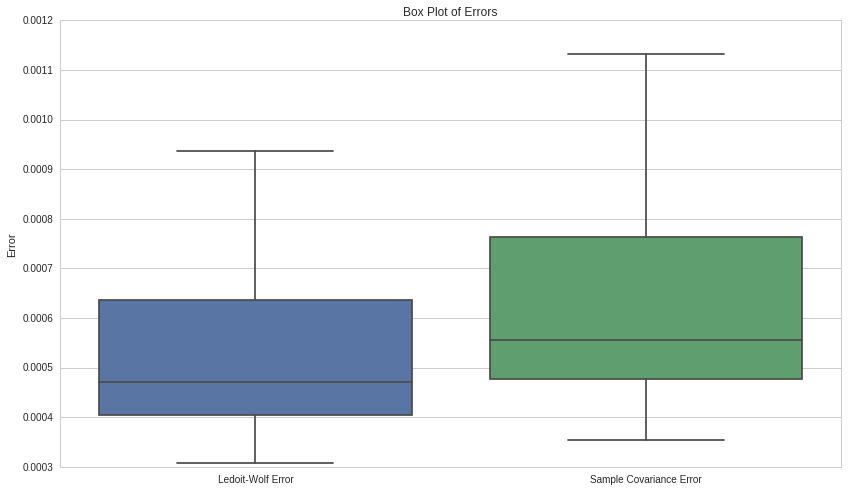
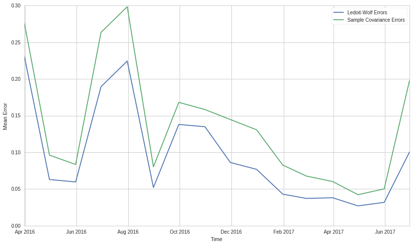

Estimation of Covariance Matrices
=================================

By Christopher van Hoecke and Max Margenot

Part of the Quantopian Lecture Series:

-  `www.quantopian.com/lectures <https://www.quantopian.com/lectures>`__
-  `github.com/quantopian/research_public <https://github.com/quantopian/research_public>`__

--------------

Volatility has long been a thorn in the side of investors in the market.
Successfully measuring volatility would allow for more accurate modeling
of the returns and more stable investments leading to greater returns,
but forecasting volatility accurately is a difficult problem.

Measuring Volatility
--------------------

Volatility needs to be forward-looking and predictive in order to make
smart decisions. Unfortunately, simply taking the historical standard
deviation of an individual asset’s returns falls short when we take into
account need for robustness to the future. When we scale the problem up
to the point where we need to forecast the volatility for many assets,
it gets even harder.

To model how a portfolio overall changes, it is important to look not
only at the volatility of each asset in the portfolio, but also at the
pairwise covariances of every asset involved. The relationship between
two or more assets provides valuable insights and a path towards
reduction of overall portfolio volatility. A large number of assets with
low covariance would assure they decrease or increase independently of
each other. Indepedent assets have less of an impact on our portfolio’s
volatility as they give us true diversity and help us avoid `position
concentration
risk <https://www.quantopian.com/lectures/position-concentration-risk>`__.

Covariance
----------

In statistics and probability, the covariance is a measure of the joint
variability of two random variables. When random variables exhibit
similar behavior, there tends to be a high covariance between them.
Mathematically, we express the covariance of X with respect to Y as:

.. math::  COV(X, Y) = E[(X - E[X])(Y - E[Y])]

Notice that if we take the covariance of :math:`X` with itself, we get:

.. math::  COV(X, X) = E[(X - E[X])(X - E[X])] = E[(X - E[X])^2] = VAR(X) 

We can use covariance to quantify the similarities between different
assets in much the same way. If two assets have a high covariance, they
will generally behave the same way. Assets with particularly high
covariance can essentially replace each other.

Covariance matrices form the backbone of Modern Portfolio theory (MPT).
MPT focuses on maximizing return for a given level of risk, making
essential the methods with which we estimate that risk. We use
covariances to quantify the joint risk of assets, forming how we view
the risk of an entire portfolio. What is key is that investing in assets
that have high pairwise covariances provides little diversification
because of how closely their fluctuations are related.

.. code:: ipython2

    import numpy as np 
    import pandas as pd
    import matplotlib.pyplot as plt
    import seaborn as sns
    import scipy.stats as stats
    from sklearn import covariance

Let’s take the covariance of two closely related variables, :math:`X`
and :math:`Y`. Say that :math:`X` is some randomly drawn set and that
:math:`Y = 5X + \epsilon`, where :math:`\epsilon` is some extra noise.
We can compute the covariance using the formula above to get a clearer
picture of how :math:`X` evolves with respect to asset :math:`Y`.

.. code:: ipython2

    # Generate random values of x
    X = np.random.normal(size = 1000)
    epsilon = np.random.normal(0, 3, size = len(X))
    Y = 5*X + epsilon
    
    product = (X - np.mean(X))*(Y - np.mean(Y))
    expected_value = np.mean(product)
    
    print 'Value of the covariance between X and Y:', expected_value

.. parsed-literal::

    Value of the covariance between X and Y: 5.50710185158

We can also compute the covariance between :math:`X` and :math:`Y` with
a single function.

.. code:: ipython2

    np.cov([X, Y])

.. parsed-literal::

    array([[  1.08671434,   5.51261447],
           [  5.51261447,  36.24846599]])

This gives us the covariance matrix between :math:`X` and :math:`Y`. The
diagonals are their respective variances and the indices :math:`(i, j)`
refer to the covariance between assets indexed :math:`i` and :math:`j`.

.. code:: ipython2

    print np.var(X), np.var(Y)

.. parsed-literal::

    1.08562762864 36.2122175246

In this case, we only have two assets so we only have indices
:math:`(0, 1)` and :math:`(1, 0)`. Covariance matrices are symmetric,
since :math:`COV(X, Y) = COV(Y, X)`, which is why the off-diagonals
mirror each other.

We can intuitively think of this as how much :math:`Y` changes when
:math:`X` changes and vice-versa. As such, our covariance value of about
5 could have been anticipated from the definition of the relationship
between :math:`X` and :math:`Y`.

Here is a scatterplot between :math:`X` and :math:`Y` with a line of
best fit down the middle.

.. code:: ipython2

    # scatter plot of X and y
    from statsmodels import regression
    import statsmodels.api as sm
    def linreg(X,Y):
        # Running the linear regression
        X = sm.add_constant(X)
        model = regression.linear_model.OLS(Y, X).fit()
        a = model.params[0]
        b = model.params[1]
        X = X[:, 1]
    
        # Return summary of the regression and plot results
        X2 = np.linspace(X.min(), X.max(), 100)
        Y_hat = X2 * b + a
        plt.scatter(X, Y, alpha=0.3) # Plot the raw data
        plt.plot(X2, Y_hat, 'r', alpha=0.9);  # Add the regression line, colored in red
        plt.xlabel('X Value')
        plt.ylabel('Y Value')
        return model.summary()
    
    linreg(X, Y)
    plt.scatter(X, Y)
    plt.title('Scatter plot and linear equation of x as a function of y')
    plt.xlabel('X')
    plt.ylabel('Y')
    plt.legend(['Linear equation', 'Scatter Plot']);

.. image:: notebook_files/notebook_10_0.png

Between the covariance, the linear regression, and our knowledge of how
:math:`X` and :math:`Y` are related, we can easily assess the
relationship between our toy variables. With real data, there are two
main complicating factors. The first is that we are exmaining
significantly more relationships. The second is that we do not know any
of their underlying relationships. These hindrances speak to the benefit
of having accurate estimates of covariance matrices.

The Covariance Matrix
---------------------

As the number of assets we are curious about increases, so too do the
dimensions of the covariance matrix that describes their relationships.
If we take the covariance between :math:`N` assets, we will get out a
:math:`N \times N` covariance matrix. This allows us to efficiently
express the relationships between many arrays at once. As with the
simple :math:`2\times 2` case, the :math:`i`-th diagonal is the variance
of the :math:`i`-th asset and the values at :math:`(i, j)` and
:math:`(j, i)` refer to the covariance between asset :math:`i` and asset
:math:`j`. We display this with the following notation:

.. math::

    \Sigma = \left[\begin{matrix}
   VAR(X_1) & COV(X_1, X_2) & \cdots & COV(X_1, X_N) \\
   COV(X_2, X_0) & VAR(X_2) & \cdots & COV(X_2, X_N) \\
   \vdots & \vdots & \ddots & \vdots \\
   COV(X_N, X_1) & COV(X_N, X_2) & \cdots & VAR(X_N)
   \end{matrix}\right] 

When trying to find the covariance of many assets, it quickly becomes
apparent why the matrix notation is more favorable.

.. code:: ipython2

    # Four asset example of the covariance matrix.
    start_date = '2016-01-01'
    end_date = '2016-02-01'
    
    returns = get_pricing(
        ['SBUX', 'AAPL', 'GS', 'GILD'],
        start_date=start_date,
        end_date=end_date,
        fields='price'
    ).pct_change()[1:]
    returns.columns = map(lambda x: x.symbol, returns.columns)
    
    print 'Covariance matrix:'
    print returns.cov()

.. parsed-literal::

    Covariance matrix:
              SBUX      AAPL        GS      GILD
    SBUX  0.000453  0.000330  0.000331  0.000075
    AAPL  0.000330  0.000739  0.000463  0.000237
    GS    0.000331  0.000463  0.000533  0.000130
    GILD  0.000075  0.000237  0.000130  0.000569

Why does all this matter?
-------------------------

We measure the covariance of the assets in our portfolio to make sure we
have an accurate picture of the risks involved in holding those assets
togther. We want to apportion our capital amongst these assets in such a
way as to minimize our exposure to the risks associated with each
individual asset and to neutralize exposure to systematic risk. This is
done through the process of portfolio optimization. Portfolio
optimization routines go through exactly this process, finding the
appropriate weights for each asset given its risks. Mean-variance
optimization, a staple of MPT, does exactly this.

Estimating the covariance matrix becomes critical when using methods
that rely on it, as we cannot know the true statistical relationships
underlying our chosen assets. The stability and accuracy of these
estimates are essential to getting stable weights that encapsulate our
risks and intentions.

Unfortunately, the most obvious way to calculate a covariance matrix
estimate, the sample covariance, is notoriously unstable. If we have
fewer time observations of our assets than the number of assets
(:math:`T < N`), the estimate becomes especially unreliable. The extreme
values react more strongly to changes, and as the extreme values of the
covariance jump around, our optimizers are perturbed, giving us
inconsistent weights. This is a problem when we are trying to make many
independent bets on many assets to improve our risk exposures through
diversification. Even if we have more time elements than assets that we
are trading, we can run into issues, as the time component may span
multiple regimes, giving us covariance matrices that are still
inaccurate.

The solution in many cases is to use a robust formulation of the
covariance matrix. If we can estimate a covariance matrix that still
captures the relationships between assets and is simultaneously more
stable, then we can have more faith in the output of our optimizers. A
main way that we handle this is by using some form of a shrinkage
estimator.

Shrinkage Estimators
====================

The concept of shrinkage stems from the need for stable covariance
matrices. The basic way we “shrink” a matrix is to reduce the extreme
values of the sample covariance matrix by pulling them closer to the
center. Practically, we take a linear combination of the sample
covariance covariance matrix a constant array representing the center.

Given a sample covariance matrix, :math:`\textbf{S}`, the mean variance,
:math:`\mu`, and the shrinkage constant :math:`\delta`, the shrunk
estimated covariance is mathematically defined as:

.. math:: (1 - \delta)\textbf{S} + \delta\mu\textbf{1}

We restrict :math:`\delta` such that :math:`0 \leq \delta \leq 1` making
this a weighted average between the sample covariance and the mean
variance matrix. The optimal value of :math:`\delta` has been tackled
several times. For our purposes, we will use the formulation by Ledoit
and Wolf.

Ledoit-Wolf Estimator.
----------------------

In `their paper <http://ledoit.net/honey.pdf>`__, Ledoit and Wolf
proposed an optimal :math:`\delta`:

.. math:: \hat\delta^* \max\{0, \min\{\frac{\hat\kappa}{T},1\}\}

:math:`\hat\kappa` has a mathematical formulation that is beyond the
scope of this lecture, but you can find its definition in the paper.

The Ledoit-Wolf Estimator is the robust covariance estimate that uses
this optimal :math:`\hat\delta^*` to shrink the sample covariance
matrix. We can draw an implementation of it directly from
``scikit-learn`` for easy use.

.. code:: ipython2

    # Getting the return data of assets. 
    start = '2016-01-01'
    end = '2016-02-01'
    
    symbols = ['AAPL', 'MSFT', 'BRK-A', 'GE', 'FDX', 'SBUX']
    
    prices = get_pricing(symbols, start_date = start, end_date = end, fields = 'price')
    prices.columns = map(lambda x: x.symbol, prices.columns)
    returns = prices.pct_change()[1:]

.. code:: ipython2

    returns.head()

.. raw:: html

    

    <table border="1" class="dataframe">
      <thead>
        <tr style="text-align: right;">
          <th></th>
          <th>AAPL</th>
          <th>MSFT</th>
          <th>BRK_A</th>
          <th>GE</th>
          <th>FDX</th>
          <th>SBUX</th>
        </tr>
      </thead>
      <tbody>
        <tr>
          <th>2016-01-05 00:00:00+00:00</th>
          <td>-0.024969</td>
          <td>0.004745</td>
          <td>0.001934</td>
          <td>0.000651</td>
          <td>0.008526</td>
          <td>0.006522</td>
        </tr>
        <tr>
          <th>2016-01-06 00:00:00+00:00</th>
          <td>-0.019474</td>
          <td>-0.017711</td>
          <td>0.003365</td>
          <td>-0.015935</td>
          <td>-0.026958</td>
          <td>-0.008697</td>
        </tr>
        <tr>
          <th>2016-01-07 00:00:00+00:00</th>
          <td>-0.041311</td>
          <td>-0.034674</td>
          <td>-0.011251</td>
          <td>-0.041970</td>
          <td>-0.044043</td>
          <td>-0.024772</td>
        </tr>
        <tr>
          <th>2016-01-08 00:00:00+00:00</th>
          <td>0.004558</td>
          <td>0.002682</td>
          <td>-0.008396</td>
          <td>-0.018972</td>
          <td>0.000817</td>
          <td>-0.000882</td>
        </tr>
        <tr>
          <th>2016-01-11 00:00:00+00:00</th>
          <td>0.015983</td>
          <td>-0.000764</td>
          <td>-0.003227</td>
          <td>0.004923</td>
          <td>-0.012697</td>
          <td>0.020833</td>
        </tr>
      </tbody>
    </table>
    

Here we calculate the in-sample Ledoit-Wolf estimator.

.. code:: ipython2

    in_sample_lw = covariance.ledoit_wolf(returns)[0]
    print in_sample_lw

.. parsed-literal::

    [[ 0.00065499  0.00041175  0.00014706  0.0001944   0.00028022  0.00026144]
     [ 0.00041175  0.00050599  0.00016123  0.00022653  0.00033813  0.00022635]
     [ 0.00014706  0.00016123  0.00019215  0.00012305  0.00016825  0.0001618 ]
     [ 0.0001944   0.00022653  0.00012305  0.00032382  0.00021071  0.00023099]
     [ 0.00028022  0.00033813  0.00016825  0.00021071  0.00045808  0.00024686]
     [ 0.00026144  0.00022635  0.0001618   0.00023099  0.00024686  0.00042922]]

Calculating Errors
~~~~~~~~~~~~~~~~~~

We can quantify the difference between the in and out-of-sample
estimates by taking the absolute difference element-by-element for the
two matrices. We represent this mathematically as:

.. math::  \frac{1}{n} \sum_{i=1}^{n} |a_i - b_i| 

First, we calculate the out-of-sample estimate and then we compare.

.. code:: ipython2

    oos_start = '2016-02-01'
    oos_end = '2016-03-01'
    oos_prices = get_pricing(symbols, start_date = oos_start, end_date = oos_end, fields = 'price')
    oos_prices.columns = map(lambda x: x.symbol, oos_prices.columns)
    oos_returns = oos_prices.pct_change()[1:]
    out_sample_lw = covariance.ledoit_wolf(oos_returns)[0]

.. code:: ipython2

    lw_errors = sum(abs(np.subtract(in_sample_lw, out_sample_lw)))
    print "Average Ledoit-Wolf error: ", np.mean(lw_errors)

.. parsed-literal::

    Average Ledoit-Wolf error:  0.000543690949796

Comparing to Sample Matrix
~~~~~~~~~~~~~~~~~~~~~~~~~~

We can check how much of an improvement this is by comparing the errors
with the erros of the sample covariance.

.. code:: ipython2

    sample_errors = sum(abs(np.subtract(returns.cov().values, oos_returns.cov().values)))
    print 'Average sample covariance error: ', np.mean(sample_errors)

.. parsed-literal::

    Average sample covariance error:  0.000646608903348

.. code:: ipython2

    print 'Error improvement of LW over sample: {0:.2f}%'.format((np.mean(sample_errors/lw_errors)-1)*100)

.. parsed-literal::

    Error improvement of LW over sample: 18.21%

We can see that the improvement of Ledoit-Wolf over the sample
covariance is pretty solid. This translates into decreased volatility
and turnover rate in our portfolio, and thus increased returns when
using the shrunk covariance matrix.

.. code:: ipython2

    sns.boxplot(
        data = pd.DataFrame({
            'Sample Covariance Error': sample_errors,
            'Ledoit-Wolf Error': lw_errors
        })
    )
    plt.title('Box Plot of Errors')
    plt.ylabel('Error');

Adding More Assets
~~~~~~~~~~~~~~~~~~

Now we bring this to more assets over a longer time period. Let’s see
how the errors change over a series of months.

.. code:: ipython2

    start_date = '2016-01-01'
    end_date = '2017-06-01'
    
    symbols = [
        'SPY', 'XLF', 'XLE', 'XLU','XLK', 'XLI', 'XLB', 'GE', 'GS', 'BRK-A', 'JPM', 'AAPL', 'MMM', 'BA',
        'CSCO','KO', 'DIS','DD', 'XOM', 'INTC', 'IBM', 'NKE', 'MSFT', 'PG', 'UTX', 'HD', 'MCD', 'CVX', 
        'AXP','JNJ', 'MRK', 'CAT', 'PFE', 'TRV', 'UNH', 'WMT', 'VZ', 'QQQ', 'BAC', 'F', 'C', 'CMCSA',
        'MS', 'ORCL', 'PEP', 'HON', 'GILD', 'LMT', 'UPS', 'HP', 'FDX', 'GD', 'SBUX'
    ]
    
    prices = get_pricing(symbols, start_date=start_date, end_date=end_date, fields='price')
    prices.columns = map(lambda x: x.symbol, prices.columns)
    returns = prices.pct_change()[1:]

.. code:: ipython2

    dates = returns.resample('M').first().index

Here we calculate our different covariance estimates.

.. code:: ipython2

    sample_covs = []
    lw_covs = []
    
    for i in range(1, len(dates)):
        sample_cov = returns[dates[i-1]:dates[i]].cov().values
        sample_covs.append(sample_cov)
        
        lw_cov = covariance.ledoit_wolf(returns[dates[i-1]:dates[i]])[0]
        lw_covs.append(lw_cov)      

Here we calculate the error for each time period.

.. code:: ipython2

    lw_diffs = []
    for pair in zip(lw_covs[:-1], lw_covs[1:]):
        diff = np.mean(np.sum(np.abs(pair[0] - pair[1])))
        lw_diffs.append(diff)
        
    sample_diffs = []
    for pair in zip(sample_covs[:-1], sample_covs[1:]):
        diff = np.mean(np.sum(np.abs(pair[0] - pair[1])))
        sample_diffs.append(diff)

And here we plot the errors over time!

.. code:: ipython2

    plt.plot(dates[2:], lw_diffs)
    plt.plot(dates[2:], sample_diffs)
    plt.xlabel('Time')
    plt.ylabel('Mean Error')
    plt.legend(['Ledoit-Wolf Errors', 'Sample Covariance Errors']);

We can see that the mean errors of Ledoit-Wolf are lower than those of
the sample covariance matrix. This shows us that the sample sample
covariance matrix is less robust. This example only used 50 assets, but
as we add more, the Ledoit-Wolf estimator would likely perform even
better as the number of assets outpaces the number of observations.

*This presentation is for informational purposes only and does not
constitute an offer to sell, a solicitation to buy, or a recommendation
for any security; nor does it constitute an offer to provide investment
advisory or other services by Quantopian, Inc. (“Quantopian”). Nothing
contained herein constitutes investment advice or offers any opinion
with respect to the suitability of any security, and any views expressed
herein should not be taken as advice to buy, sell, or hold any security
or as an endorsement of any security or company. In preparing the
information contained herein, Quantopian, Inc. has not taken into
account the investment needs, objectives, and financial circumstances of
any particular investor. Any views expressed and data illustrated herein
were prepared based upon information, believed to be reliable, available
to Quantopian, Inc. at the time of publication. Quantopian makes no
guarantees as to their accuracy or completeness. All information is
subject to change and may quickly become unreliable for various reasons,
including changes in market conditions or economic circumstances.*
