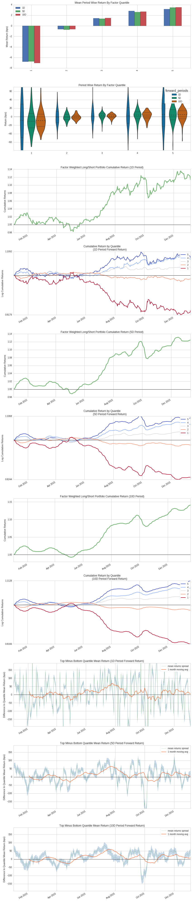
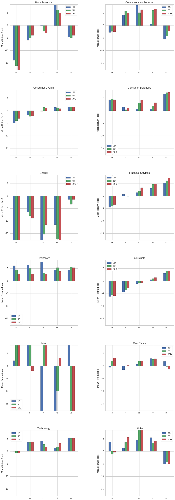
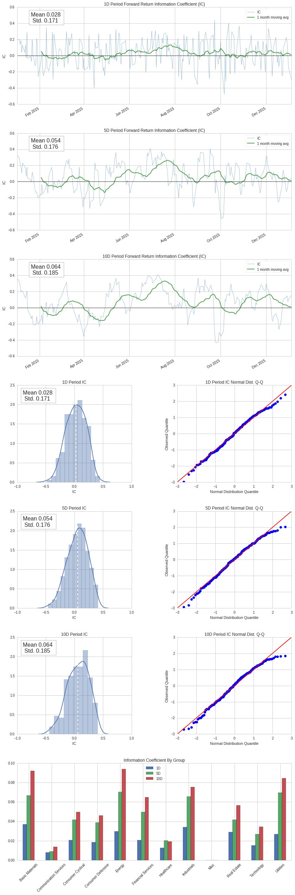
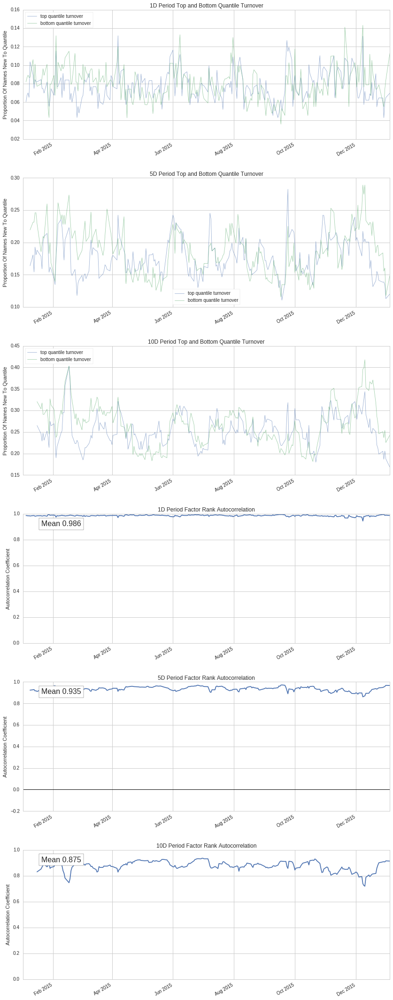

Factor Analysis
===============

by Maxwell Margenot, Gil Wassermann, James Christopher Hall, and Delaney
Granizo-Mackenzie.

Part of the Quantopian Lecture Series:

-  `www.quantopian.com/lectures <https://www.quantopian.com/lectures>`__
-  https://github.com/quantopian/research_public

--------------

How can we tell whether an alpha factor is good or not? Unfortunately,
there is no cut-off that tells you whether a factor is objectively
useful. Instead, we need to compare a particular factor to other options
before deciding whether to use it. Our end goal in defining and
selecting the best factors is to use them to rank stocks in a long-short
equity strategy, covered elsewhere in the `lecture
series <https://www.quantopian.com/lectures#Long-Short-Equity>`__. The
more independent predictive the factors we use, the better our ranking
scheme and our overall strategy will be.

What we want when comparing factors is to make sure the chosen signal is
actually predictive of **relative price movements**. We do not want to
predict the absolute amount the assets in our universe will move up or
down. We only care that we can choose assets to long that will do better
than the assets we short. In a long-short equity strategy, we hold a
long basket and a short basket of assets, determined by the factor
values associated with each asset in our universe. If our ranking scheme
is predictive, this means that assets in the top basket will tend to
outperform assets in the bottom basket. As long this spread is
consistent over time our strategy will have a positive return.

An individual factor can have a lot of moving parts to assess, but
ideally it should be independent of other factors that you are already
trading on in order to keep your portfolio diverse. We discuss the
reasoning for this in `this
lecture <https://www.quantopian.com/lectures#Position-Concentration-Risk>`__.

In this lecture, we detail and explain relevant statistics to evaluate
your alpha factor before attempting to implement it in an algorithm.
What’s important to keep in mind is that all the metrics provided here
are relative to other factors you may be trading or evaluating.

Let’s have a look at a factor and try to assess its viability. We will
calculate the factor values using Pipeline, so make sure you check out
the `tutorial <https://www.quantopian.com/tutorials/pipeline>`__ if you
are unfamiliar with how Pipeline works.

.. code:: ipython2

    import numpy as np
    import pandas as pd
    from quantopian.research import run_pipeline
    from quantopian.pipeline import Pipeline
    from quantopian.pipeline.data.builtin import USEquityPricing
    from quantopian.pipeline.factors import CustomFactor, Returns
    from quantopian.pipeline.classifiers.fundamentals import Sector  
    from quantopian.pipeline.filters import QTradableStocksUS
    from time import time

Momentum
~~~~~~~~

Here we will be using a **momentum** factor as our example. Momentum
factors are a very common form of alpha factor and they come in many
shapes and sizes. They all try to get at the same idea, however, that
securities in motion will stay in motion. Momentum factors try to
quantify trends in financial markets and to “ride the wave”, so to
speak.

Let’s say that we suspect that a momentum factor could potentially be
predictive of stock returns. We define it as a ``CustomFactor`` so that
we can easily pull its values when we run our Pipeline. We should get a
factor value for every security in our universe.

.. code:: ipython2

    class MyFactor(CustomFactor):
            """ Momentum factor """
            inputs = [USEquityPricing.close,
                      Returns(window_length=126)]
            window_length = 252
    
            def compute(self, today, assets, out, prices, returns):
                out[:] = ((prices[-21] - prices[-252])/prices[-252] -
                          (prices[-1] - prices[-21])/prices[-21]) / np.nanstd(returns, axis=0)

This momentum factor takes the change in price over the past year, up
until a month ago, and standardizes it over the the change in price over
the last month. This allows it to account for any changes over the past
month and use them to temper its expectations of future movement.

Judging a Factor with Alphalens
-------------------------------

In order to judge whether a factor is viable, we have created a package
called Alphalens. Its source code is available on
`github <http://github.com/quantopian/alphalens>`__ if you want to get
into the nitty-gritty of how it works. We use Alphalens to create a
“tear sheet” of a factor, similar to how we use
`pyfolio <http://github.com/quantopian/pyfolio>`__ to create a tear
sheet for analyzing backtests.

.. code:: ipython2

    import alphalens as al

Alphalens takes your factor and examines how useful it is for predicting
relative value through a collection of different metrics. It breaks all
the stocks in your chosen universe into different quantiles based on
their ranking according to your factor and analyzes the returns,
information coefficient (IC), the turnover of each quantile, and
provides a breakdown of returns and IC by sector.

Throughout the course of this lecture we will detail how to interpret
the various individual plots generated by an ``Alphalens`` tear sheet
and include the proper call to generate the whole tear sheet at once at
the end.

Sector Codes
------------

These are the possible sector codes for each security, as given by
Morningstar. We will use this dictionary to help categorize our results
as we walk through a factor analysis so that we can break out our
information by sector.

.. code:: ipython2

    MORNINGSTAR_SECTOR_CODES = {
         -1: 'Misc',
        101: 'Basic Materials',
        102: 'Consumer Cyclical',
        103: 'Financial Services',
        104: 'Real Estate',
        205: 'Consumer Defensive',
        206: 'Healthcare',
        207: 'Utilities',
        308: 'Communication Services',
        309: 'Energy',
        310: 'Industrials',
        311: 'Technology' ,    
    }

Defining a universe
-------------------

As always, we need to define our universe. In this case we use the
QTradableStocksUS, as seen in the forums
`here <https://www.quantopian.com/posts/working-on-our-best-universe-yet-qtradablestocksus>`__.

.. code:: ipython2

    universe = QTradableStocksUS()

Getting Data
------------

Now we will pull values for our factor for all stocks in our universe by
using Pipeline. We also want to make sure that we have the sector code
for each individual equity, so we add ``Sector`` as another factor for
our Pipeline. Note that running the Pipeline may take a while.

.. code:: ipython2

    pipe = Pipeline(
        columns = {
                'MyFactor' : MyFactor(mask=universe),
                'Sector' : Sector()
        },
        screen=universe
    )
    
    start_timer = time()
    results = run_pipeline(pipe, '2015-01-01', '2016-01-01')
    end_timer = time()
    results.fillna(value=0);

.. code:: ipython2

    print "Time to run pipeline %.2f secs" % (end_timer - start_timer)

.. parsed-literal::

    Time to run pipeline 10.03 secs

Let’s take a look at the data to get a quick sense of what we have.

.. code:: ipython2

    my_factor = results['MyFactor']
    print my_factor.head()

.. parsed-literal::

    2015-01-02 00:00:00+00:00  Equity(2 [ARNC])     5.239913
                               Equity(24 [AAPL])    5.451305
                               Equity(31 [ABAX])    2.833452
                               Equity(39 [DDC])     0.870227
                               Equity(41 [ARCB])    1.155913
    Name: MyFactor, dtype: float64

Our ``my_factor`` variable contains a pandas ``Series`` with a factor
value for each equity in our universe for each point in time.

Here we create another ``Series`` that contains sector codes for each
equity instead of factor values. This is categorical data that we will
use as a parameter for ``Alphalens`` later.

.. code:: ipython2

    sectors = results['Sector']

While our universe is defined to consist of 1500 stocks, the actual
number of unique stocks that we end up ranking will likely be greater
than this due to stocks passing in and out of our filters. For this
reason, we grab pricing data for any stock that may have been in our
Pipeline at some point to make sure that we have all of the data that we
might need.

.. code:: ipython2

    asset_list = results.index.levels[1]

.. code:: ipython2

    prices = get_pricing(asset_list, start_date='2015-01-01', end_date='2016-02-01', fields='open_price')

.. code:: ipython2

    prices.head()

.. raw:: html

    

    <table border="1" class="dataframe">
      <thead>
        <tr style="text-align: right;">
          <th></th>
          <th>Equity(2 [ARNC])</th>
          <th>Equity(24 [AAPL])</th>
          <th>Equity(31 [ABAX])</th>
          <th>Equity(39 [DDC])</th>
          <th>Equity(41 [ARCB])</th>
          <th>Equity(52 [ABM])</th>
          <th>Equity(53 [ABMD])</th>
          <th>Equity(62 [ABT])</th>
          <th>Equity(64 [ABX])</th>
          <th>Equity(67 [ADSK])</th>
          <th>...</th>
          <th>Equity(48629 [INOV])</th>
          <th>Equity(48746 [SUM])</th>
          <th>Equity(48821 [CJES])</th>
          <th>Equity(48823 [SEDG])</th>
          <th>Equity(48863 [GDDY])</th>
          <th>Equity(48892 [IGT])</th>
          <th>Equity(48925 [ADRO])</th>
          <th>Equity(48933 [PRTY])</th>
          <th>Equity(48934 [ETSY])</th>
          <th>Equity(48943 [VIRT])</th>
        </tr>
      </thead>
      <tbody>
        <tr>
          <th>2015-01-02 00:00:00+00:00</th>
          <td>15.708</td>
          <td>109.524</td>
          <td>56.846</td>
          <td>17.186</td>
          <td>46.317</td>
          <td>28.078</td>
          <td>38.27</td>
          <td>44.032</td>
          <td>10.393</td>
          <td>60.06</td>
          <td>...</td>
          <td>NaN</td>
          <td>NaN</td>
          <td>NaN</td>
          <td>NaN</td>
          <td>NaN</td>
          <td>NaN</td>
          <td>NaN</td>
          <td>NaN</td>
          <td>NaN</td>
          <td>NaN</td>
        </tr>
        <tr>
          <th>2015-01-05 00:00:00+00:00</th>
          <td>15.480</td>
          <td>106.476</td>
          <td>57.055</td>
          <td>17.051</td>
          <td>45.245</td>
          <td>27.677</td>
          <td>37.17</td>
          <td>43.594</td>
          <td>10.827</td>
          <td>59.15</td>
          <td>...</td>
          <td>NaN</td>
          <td>NaN</td>
          <td>NaN</td>
          <td>NaN</td>
          <td>NaN</td>
          <td>NaN</td>
          <td>NaN</td>
          <td>NaN</td>
          <td>NaN</td>
          <td>NaN</td>
        </tr>
        <tr>
          <th>2015-01-06 00:00:00+00:00</th>
          <td>14.866</td>
          <td>104.755</td>
          <td>57.154</td>
          <td>17.109</td>
          <td>44.839</td>
          <td>28.097</td>
          <td>37.09</td>
          <td>43.779</td>
          <td>10.866</td>
          <td>58.89</td>
          <td>...</td>
          <td>NaN</td>
          <td>NaN</td>
          <td>NaN</td>
          <td>NaN</td>
          <td>NaN</td>
          <td>NaN</td>
          <td>NaN</td>
          <td>NaN</td>
          <td>NaN</td>
          <td>NaN</td>
        </tr>
        <tr>
          <th>2015-01-07 00:00:00+00:00</th>
          <td>15.124</td>
          <td>105.404</td>
          <td>56.827</td>
          <td>17.176</td>
          <td>43.202</td>
          <td>28.156</td>
          <td>36.42</td>
          <td>43.526</td>
          <td>10.926</td>
          <td>57.78</td>
          <td>...</td>
          <td>NaN</td>
          <td>NaN</td>
          <td>NaN</td>
          <td>NaN</td>
          <td>NaN</td>
          <td>NaN</td>
          <td>NaN</td>
          <td>NaN</td>
          <td>NaN</td>
          <td>NaN</td>
        </tr>
        <tr>
          <th>2015-01-08 00:00:00+00:00</th>
          <td>15.500</td>
          <td>107.400</td>
          <td>57.223</td>
          <td>17.243</td>
          <td>42.101</td>
          <td>28.704</td>
          <td>37.69</td>
          <td>43.974</td>
          <td>10.857</td>
          <td>57.87</td>
          <td>...</td>
          <td>NaN</td>
          <td>NaN</td>
          <td>NaN</td>
          <td>NaN</td>
          <td>NaN</td>
          <td>NaN</td>
          <td>NaN</td>
          <td>NaN</td>
          <td>NaN</td>
          <td>NaN</td>
        </tr>
      </tbody>
    </table>
    
5 rows × 2412 columns

    

Alphalens Components
====================

Now that we have the basic components of what we need to analyze our
factor, we can start to deal with ``Alphalens``. Note that we will be
breaking out individual components of the package, so this is not the
typical workflow for using an ``Alphalens`` tear sheet.

First we get our factor categorized by sector code and calculate our
forward returns. The forward returns are the returns that we would have
received for holding each security over the day periods ending on the
given date, passed in through the ``periods`` parameter. In our case,
and by default, we look :math:`1`, :math:`5`, and :math:`10` days in
advance. We can consider this a budget backtest. The tear sheet does not
factor in any commission or slippage cost, rather, it only considers
values as if we had magically already held the specified equities for
the specified number of days up to the current day.

.. code:: ipython2

    periods = (1, 5, 10)

.. code:: ipython2

    factor_data = al.utils.get_clean_factor_and_forward_returns(factor=my_factor,
                                                                prices=prices,
                                                                groupby=sectors,
                                                                groupby_labels=MORNINGSTAR_SECTOR_CODES,
                                                                periods=periods)

.. parsed-literal::

    Dropped 1.6% entries from factor data: 1.6% in forward returns computation and 0.0% in binning phase (set max_loss=0 to see potentially suppressed Exceptions).
    max_loss is 35.0%, not exceeded: OK!

The ``factor`` variable here is similar to the ``my_factor`` variable
above. It has a factor value for every equity in our universe at each
point in time. Our ``Alphalens`` function here has also provided a
sector grouping to go along with the factor value.

.. code:: ipython2

    factor_data.head()

.. raw:: html

    

    <table border="1" class="dataframe">
      <thead>
        <tr style="text-align: right;">
          <th></th>
          <th></th>
          <th>1D</th>
          <th>5D</th>
          <th>10D</th>
          <th>factor</th>
          <th>group</th>
          <th>factor_quantile</th>
        </tr>
        <tr>
          <th>date</th>
          <th>asset</th>
          <th></th>
          <th></th>
          <th></th>
          <th></th>
          <th></th>
          <th></th>
        </tr>
      </thead>
      <tbody>
        <tr>
          <th rowspan="5" valign="top">2015-01-02 00:00:00+00:00</th>
          <th>Equity(2 [ARNC])</th>
          <td>-0.014515</td>
          <td>0.010059</td>
          <td>-0.057359</td>
          <td>5.239913</td>
          <td>Basic Materials</td>
          <td>5</td>
        </tr>
        <tr>
          <th>Equity(24 [AAPL])</th>
          <td>-0.027830</td>
          <td>0.011495</td>
          <td>-0.039142</td>
          <td>5.451305</td>
          <td>Technology</td>
          <td>5</td>
        </tr>
        <tr>
          <th>Equity(31 [ABAX])</th>
          <td>0.003677</td>
          <td>0.019368</td>
          <td>-0.015164</td>
          <td>2.833452</td>
          <td>Healthcare</td>
          <td>5</td>
        </tr>
        <tr>
          <th>Equity(39 [DDC])</th>
          <td>-0.007855</td>
          <td>-0.008961</td>
          <td>-0.124811</td>
          <td>0.870227</td>
          <td>Basic Materials</td>
          <td>3</td>
        </tr>
        <tr>
          <th>Equity(41 [ARCB])</th>
          <td>-0.023145</td>
          <td>-0.076689</td>
          <td>-0.131507</td>
          <td>1.155913</td>
          <td>Industrials</td>
          <td>3</td>
        </tr>
      </tbody>
    </table>
    

As explained above, the forward returns are the returns that we would
have received for holding each security for the specified number of
days, ending on the given date. These, too, are broken out by sector.

This function also separates our factor into quantiles for each date,
replacing the factor value with its appropriate quantile on a given day.
Since we will be holding baskets of the top and bottom quantiles, we
only care about the factor insofar as it relates to movement into and
out of these baskets.

Alphalens provides three categories of analysis on alpha factors:

-  Returns
-  Information
-  Turnover

Each of these topics is covered in its own separate tear sheet as well
as an all-encompassing full tear sheet.

Returns Tear Sheet
~~~~~~~~~~~~~~~~~~

If we are solely interested in returns, we can create a tear sheet that
only contains the returns analysis. The following code block generates
all of our returns plots once we have stored the forward returns data:

.. code:: ipython2

    al.tears.create_returns_tear_sheet(factor_data, by_group=True);

.. parsed-literal::

    Returns Analysis

.. raw:: html

    

    <table border="1" class="dataframe">
      <thead>
        <tr style="text-align: right;">
          <th></th>
          <th>1D</th>
          <th>5D</th>
          <th>10D</th>
        </tr>
      </thead>
      <tbody>
        <tr>
          <th>Ann. alpha</th>
          <td>0.111</td>
          <td>0.100</td>
          <td>0.097</td>
        </tr>
        <tr>
          <th>beta</th>
          <td>-0.068</td>
          <td>-0.191</td>
          <td>-0.211</td>
        </tr>
        <tr>
          <th>Mean Period Wise Return Top Quantile (bps)</th>
          <td>3.155</td>
          <td>3.452</td>
          <td>3.521</td>
        </tr>
        <tr>
          <th>Mean Period Wise Return Bottom Quantile (bps)</th>
          <td>-6.796</td>
          <td>-6.726</td>
          <td>-7.064</td>
        </tr>
        <tr>
          <th>Mean Period Wise Spread (bps)</th>
          <td>9.881</td>
          <td>10.220</td>
          <td>10.643</td>
        </tr>
      </tbody>
    </table>
    

.. parsed-literal::

    <matplotlib.figure.Figure at 0x7f07d6039110>

.. image:: notebook_files/notebook_32_3.png

.. image:: notebook_files/notebook_32_4.png

Returns Tear Sheet Breakdown
~~~~~~~~~~~~~~~~~~~~~~~~~~~~

:math:`\alpha` and :math:`\beta` Point Estimates Chart
^^^^^^^^^^^^^^^^^^^^^^^^^^^^^^^^^^^^^^^^^^^^^^^^^^^^^^

Now we calculate the :math:`\alpha` and :math:`\beta` of our factor with
respect to the market. These are calculated by creating a regression of
the market returns for each period against a long-short factor portfolio
and extracting the parameters. These signify the excess return
associated with our factor and the market beta, respectively.

Returns Point Estimates Chart
^^^^^^^^^^^^^^^^^^^^^^^^^^^^^

These point estimates were also calculated agnostic of the sector
groupings so they give us an overall view of what our spread would look
like if we traded this factor with a long-short equity algorithm and
didn’t examine which sectors those returns were coming from.

Mean Period-Wise Return by Quantile
^^^^^^^^^^^^^^^^^^^^^^^^^^^^^^^^^^^

The quantized factor is used to create separate baskets, with returns
for each basket calculated over each given day period. We get this
information both as bar charts and as violin plots.

The bar charts provide us the mean return for each factor quantile, for
each time horizon. This gives us a set of point estimates to get a
preliminary understanding of how the factor value tracks with returns.

The primary difference between a bar chart and a violin plot is that a
violin plot shows the density of our data. The fatter the violin, the
higher the density of returns in that region. Here we plot the violins
for the :math:`1`, :math:`5`, and :math:`10` day forward returns for
each quantile.

Factor-Weighted Long/Short Portfolio Cumulative Return
^^^^^^^^^^^^^^^^^^^^^^^^^^^^^^^^^^^^^^^^^^^^^^^^^^^^^^

These plots show the cumulative returns of a factor-weighted
cross-sectional equity strategy based on the input factor. This holds
the top quantile long and the bottom quantile short and simulates how
that portfolio would perform without slippage or commissions. This shows
the performance of the factor as a whole, which is always important to
consider.

Cumulative Return by Quantile
^^^^^^^^^^^^^^^^^^^^^^^^^^^^^

This next plot aggregates the returns of each individual quantile into a
plot of cumulative returns separated by basket for the 1-period forward
returns. What we want here is to see five discrete “fingers” with few to
no crossovers. This will give us an idea of which quantiles tend to
drive the returns (ideally the first and fifth).

Quantile Mean Return in BPS
^^^^^^^^^^^^^^^^^^^^^^^^^^^

Next we calculate the basis points of the spread, based on subtracting
the mean return of the lowest quantile from the mean return of the
highest quantile (simulating going short on the lowest and long on the
highest). We also get the error and plot it all together, giving us a
time series of the basis points with confidence intervals for each time
period.

Sector Breakdown of Returns
^^^^^^^^^^^^^^^^^^^^^^^^^^^

``Alphalens`` provides a breakdown of returns by group, provided that
you feed it a set of categorical values (such as industry labels), using
the ``by_group`` flag. While it is good to consider breakdowns by
quantile, it is also important to see how your factor is exposed to the
different facets of the market. This is a good way to assess if your
factor is behaving as it should in your universe. For example, if you
intend your universe to only touch a certain sector, it is worthwhile to
confirm that your factor and universe indeed only touch that sector.

Information Coefficient
-----------------------

We use the information coefficient (IC) to assess the predictive power
of a factor. The IC of a factor is its Spearman Rank Correlation. For
more background on the mathematics associated with the IC, check out the
`Spearman Rank Correlation
Lecture <https://www.quantopian.com/lectures#Spearman-Rank-Correlation>`__.
To break it down, we calculate the IC between the factor values and the
forward returns for each period. The IC assesses the monotonic
relationship between factors and returns. What this means, intuitively,
is that it provides a measure for whether higher factor values can be
associated with higher returns.

A higher IC indicates that higher factor values are more closely
associated with higher return values (and lower factor values with lower
return values). A very negative IC indicates that higher factor values
are closely associated with lower return values. An IC of :math:`0`
indicates no relationship.

Information Tear Sheet
~~~~~~~~~~~~~~~~~~~~~~

Similarly to the returns tear sheet, we can also create a tear sheet
that just gives us data on the information coefficient.

.. code:: ipython2

    al.tears.create_information_tear_sheet(factor_data, by_group=True)

.. parsed-literal::

    Information Analysis

.. raw:: html

    

    <table border="1" class="dataframe">
      <thead>
        <tr style="text-align: right;">
          <th></th>
          <th>1D</th>
          <th>5D</th>
          <th>10D</th>
        </tr>
      </thead>
      <tbody>
        <tr>
          <th>IC Mean</th>
          <td>0.028</td>
          <td>0.054</td>
          <td>0.064</td>
        </tr>
        <tr>
          <th>IC Std.</th>
          <td>0.171</td>
          <td>0.176</td>
          <td>0.185</td>
        </tr>
        <tr>
          <th>Risk-Adjusted IC</th>
          <td>0.165</td>
          <td>0.307</td>
          <td>0.345</td>
        </tr>
        <tr>
          <th>t-stat(IC)</th>
          <td>2.619</td>
          <td>4.877</td>
          <td>5.488</td>
        </tr>
        <tr>
          <th>p-value(IC)</th>
          <td>0.009</td>
          <td>0.000</td>
          <td>0.000</td>
        </tr>
        <tr>
          <th>IC Skew</th>
          <td>-0.183</td>
          <td>-0.316</td>
          <td>-0.325</td>
        </tr>
        <tr>
          <th>IC Kurtosis</th>
          <td>-0.470</td>
          <td>-0.356</td>
          <td>-0.471</td>
        </tr>
      </tbody>
    </table>
    

.. parsed-literal::

    <matplotlib.figure.Figure at 0x7f07d49478d0>

.. image:: notebook_files/notebook_44_3.png

IC Point Estimates
^^^^^^^^^^^^^^^^^^

This first table provides us with statistics around the distribution of
the information coefficient for each time horizon. This includes mean,
standard deviation, skewness, and kurtosis, to give us a clear view of
how the distribution is shaped.

IC Time Series
^^^^^^^^^^^^^^

Here we plot the IC as a time series for each period along with a
1-month moving average to smooth it out. What we want here is
consistency over time and a consistently informative signal.

IC Histograms
^^^^^^^^^^^^^

Histograms are good to show us the distribution of the IC. These will
clearly show any strange outliers and how they affect the overall curve.

IC QQ-Plots
^^^^^^^^^^^

A QQ-plot compares the distribution of the IC to the normal
distribution. It plots the quantiles of one distribution against the
quantiles of the other, typically with a reference line at
:math:`y = x`. If the points in the QQ-plot fall entirely along this
line, this indicates that the two distributions are the same. In
practice, a QQ-plot serves as a measure of similarity between
distributions. Generally, what we want to see here is an S-shaped curve.
This indicates that the tails of the IC distribution are fatter and
contain more information.

IC Heat Plots
^^^^^^^^^^^^^

The following heat plots show the monthly mean IC, providing us with
another visual of consistency.

IC by Group
^^^^^^^^^^^

Looking at the returns by quantile for each individual sector in the
returns tear sheet helps to show which sectors are driving the bulk of
our returns as well as whether quantiles in each sector are broken out
how they should be (with the lowest quantiles giving the lowest returns
up to the highest quantiles giving the highest returns). If an
individual sector has little to no signal (IC), it makes sense for the
quantile returns to be all over the place. Looking at IC by group helps
to make sure that everything is behaving nicely.

Turnover
--------

When considering the impact of actually implementing a signal in a
strategy, turnover is a critical thing to consider. This plot shows the
turnover of the top and bottom quantiles of your factor, the baskets
that you would actually be trading on with a long-short approach.
Excessive turnover will eat away at the profits of your strategy through
commission costs. Sometimes a signal just isn’t good enough to fight
against the tide on the scale that you have to deal with through your
broker.

Turnover Tear Sheet
~~~~~~~~~~~~~~~~~~~

We can examine two separate metrics of turnover using Alphalens, percent
turnover and factor autocorrelation.

.. code:: ipython2

    al.tears.create_turnover_tear_sheet(factor_data);

.. parsed-literal::

    Turnover Analysis

.. raw:: html

    

    <table border="1" class="dataframe">
      <thead>
        <tr style="text-align: right;">
          <th></th>
          <th>10D</th>
          <th>1D</th>
          <th>5D</th>
        </tr>
      </thead>
      <tbody>
        <tr>
          <th>Quantile 1 Mean Turnover</th>
          <td>0.267</td>
          <td>0.080</td>
          <td>0.188</td>
        </tr>
        <tr>
          <th>Quantile 2 Mean Turnover</th>
          <td>0.499</td>
          <td>0.180</td>
          <td>0.386</td>
        </tr>
        <tr>
          <th>Quantile 3 Mean Turnover</th>
          <td>0.543</td>
          <td>0.204</td>
          <td>0.427</td>
        </tr>
        <tr>
          <th>Quantile 4 Mean Turnover</th>
          <td>0.502</td>
          <td>0.178</td>
          <td>0.383</td>
        </tr>
        <tr>
          <th>Quantile 5 Mean Turnover</th>
          <td>0.254</td>
          <td>0.077</td>
          <td>0.178</td>
        </tr>
      </tbody>
    </table>
    

.. raw:: html

    

    <table border="1" class="dataframe">
      <thead>
        <tr style="text-align: right;">
          <th></th>
          <th>1D</th>
          <th>5D</th>
          <th>10D</th>
        </tr>
      </thead>
      <tbody>
        <tr>
          <th>Mean Factor Rank Autocorrelation</th>
          <td>0.986</td>
          <td>0.935</td>
          <td>0.875</td>
        </tr>
      </tbody>
    </table>
    

.. parsed-literal::

    <matplotlib.figure.Figure at 0x7f07d41327d0>

.. image:: notebook_files/notebook_53_4.png

Quantile Turnover
^^^^^^^^^^^^^^^^^

The first table is a plot of turnover for each quantile by period. This
indicates the percentage of names that move in and out of each basket.

Factor Autocorrelation
^^^^^^^^^^^^^^^^^^^^^^

Factor autocorrelation is the measure of correlation between the current
value of the factor and its previous value. The idea behind its
calculation is to provide another measure of the turnover of the factor
quantiles. If the autocorrelation is low, it implies that the current
value of the factor has little to do with the previous value and that
portfolio positions are changing frequently from time period to time
period. If the next value of the factor is significantly influenced by
its last value, this means that your ranking scheme is more consistent
(though this has no influence on its ability to forecast relative price
movements).

Top and Bottom Quantile Turnover
^^^^^^^^^^^^^^^^^^^^^^^^^^^^^^^^

These plot shows a fairly ordinary turnover for the factor, implying
that we will not be hit too hard by the constant changing of portfolio
positions, though this varies from time period to time period. We cannot
see the costs directly, however, because ``Alphalens`` does not model
commission costs. It simply provides metrics that we can use to judge a
factor by itself. To properly model undermining influences such as
slippage and commissions you will need to implement a strategy that uses
your factor in the backtester.

Autocorrelation
^^^^^^^^^^^^^^^

The second set of plots in the turnover tear sheet is the factor
autocorrelation over time. In this case, we have fairly high
autocorrelation, corroborating the turnover plots from above that
suggest more consistent portfolio positions.

Full Factor Tear Sheet
======================

We can also generate all of the above plots and statistics in one
complete tear sheet. The syntax for generating the full tear sheet all
at once is as follows:

.. code:: ipython2

    al.tears.create_full_tear_sheet(factor_data, by_group=True);

.. parsed-literal::

    Quantiles Statistics

.. raw:: html

    

    <table border="1" class="dataframe">
      <thead>
        <tr style="text-align: right;">
          <th></th>
          <th>min</th>
          <th>max</th>
          <th>mean</th>
          <th>std</th>
          <th>count</th>
          <th>count %</th>
        </tr>
        <tr>
          <th>factor_quantile</th>
          <th></th>
          <th></th>
          <th></th>
          <th></th>
          <th></th>
          <th></th>
        </tr>
      </thead>
      <tbody>
        <tr>
          <th>1</th>
          <td>-13.239016</td>
          <td>-0.259062</td>
          <td>-2.366438</td>
          <td>1.261613</td>
          <td>106000</td>
          <td>20.019453</td>
        </tr>
        <tr>
          <th>2</th>
          <td>-2.676098</td>
          <td>0.931339</td>
          <td>-0.512504</td>
          <td>0.553329</td>
          <td>105842</td>
          <td>19.989613</td>
        </tr>
        <tr>
          <th>3</th>
          <td>-1.341726</td>
          <td>2.187907</td>
          <td>0.612427</td>
          <td>0.582272</td>
          <td>105852</td>
          <td>19.991501</td>
        </tr>
        <tr>
          <th>4</th>
          <td>-0.275512</td>
          <td>3.786914</td>
          <td>1.809913</td>
          <td>0.670109</td>
          <td>105842</td>
          <td>19.989613</td>
        </tr>
        <tr>
          <th>5</th>
          <td>0.930782</td>
          <td>18.827919</td>
          <td>4.075695</td>
          <td>1.561562</td>
          <td>105949</td>
          <td>20.009821</td>
        </tr>
      </tbody>
    </table>
    

.. parsed-literal::

    Returns Analysis

.. raw:: html

    

    <table border="1" class="dataframe">
      <thead>
        <tr style="text-align: right;">
          <th></th>
          <th>1D</th>
          <th>5D</th>
          <th>10D</th>
        </tr>
      </thead>
      <tbody>
        <tr>
          <th>Ann. alpha</th>
          <td>0.111</td>
          <td>0.100</td>
          <td>0.097</td>
        </tr>
        <tr>
          <th>beta</th>
          <td>-0.068</td>
          <td>-0.191</td>
          <td>-0.211</td>
        </tr>
        <tr>
          <th>Mean Period Wise Return Top Quantile (bps)</th>
          <td>3.155</td>
          <td>3.452</td>
          <td>3.521</td>
        </tr>
        <tr>
          <th>Mean Period Wise Return Bottom Quantile (bps)</th>
          <td>-6.796</td>
          <td>-6.726</td>
          <td>-7.064</td>
        </tr>
        <tr>
          <th>Mean Period Wise Spread (bps)</th>
          <td>9.881</td>
          <td>10.220</td>
          <td>10.643</td>
        </tr>
      </tbody>
    </table>
    

.. parsed-literal::

    <matplotlib.figure.Figure at 0x7f07d479d150>

.. parsed-literal::

    Information Analysis

.. raw:: html

    

    <table border="1" class="dataframe">
      <thead>
        <tr style="text-align: right;">
          <th></th>
          <th>1D</th>
          <th>5D</th>
          <th>10D</th>
        </tr>
      </thead>
      <tbody>
        <tr>
          <th>IC Mean</th>
          <td>0.028</td>
          <td>0.054</td>
          <td>0.064</td>
        </tr>
        <tr>
          <th>IC Std.</th>
          <td>0.171</td>
          <td>0.176</td>
          <td>0.185</td>
        </tr>
        <tr>
          <th>Risk-Adjusted IC</th>
          <td>0.165</td>
          <td>0.307</td>
          <td>0.345</td>
        </tr>
        <tr>
          <th>t-stat(IC)</th>
          <td>2.619</td>
          <td>4.877</td>
          <td>5.488</td>
        </tr>
        <tr>
          <th>p-value(IC)</th>
          <td>0.009</td>
          <td>0.000</td>
          <td>0.000</td>
        </tr>
        <tr>
          <th>IC Skew</th>
          <td>-0.183</td>
          <td>-0.316</td>
          <td>-0.325</td>
        </tr>
        <tr>
          <th>IC Kurtosis</th>
          <td>-0.470</td>
          <td>-0.356</td>
          <td>-0.471</td>
        </tr>
      </tbody>
    </table>
    

.. parsed-literal::

    Turnover Analysis

.. raw:: html

    

    <table border="1" class="dataframe">
      <thead>
        <tr style="text-align: right;">
          <th></th>
          <th>10D</th>
          <th>1D</th>
          <th>5D</th>
        </tr>
      </thead>
      <tbody>
        <tr>
          <th>Quantile 1 Mean Turnover</th>
          <td>0.267</td>
          <td>0.080</td>
          <td>0.188</td>
        </tr>
        <tr>
          <th>Quantile 2 Mean Turnover</th>
          <td>0.499</td>
          <td>0.180</td>
          <td>0.386</td>
        </tr>
        <tr>
          <th>Quantile 3 Mean Turnover</th>
          <td>0.543</td>
          <td>0.204</td>
          <td>0.427</td>
        </tr>
        <tr>
          <th>Quantile 4 Mean Turnover</th>
          <td>0.502</td>
          <td>0.178</td>
          <td>0.383</td>
        </tr>
        <tr>
          <th>Quantile 5 Mean Turnover</th>
          <td>0.254</td>
          <td>0.077</td>
          <td>0.178</td>
        </tr>
      </tbody>
    </table>
    

.. raw:: html

    

    <table border="1" class="dataframe">
      <thead>
        <tr style="text-align: right;">
          <th></th>
          <th>1D</th>
          <th>5D</th>
          <th>10D</th>
        </tr>
      </thead>
      <tbody>
        <tr>
          <th>Mean Factor Rank Autocorrelation</th>
          <td>0.986</td>
          <td>0.935</td>
          <td>0.875</td>
        </tr>
      </tbody>
    </table>
    

More on Factors
===============

Coming up with new factors is all well and good, but often you will need
many independently predictive factors to produce a signal that is stable
enough to trade. Methods of aggregating factors together will be
discussed in future lectures, but the most simple initial approach would
just be to normalize the values of each factor you would like to include
in the aggregate, add the new normalized factor together, and rank by
this new combined factor value.

Next Steps
==========

Once you have a factor that looks good, the next step is to implement it
in an algorithm. Unfortunately, it isn’t enough to simply have a good
signal. Trading algorithms have to take into account many other
considerations that are not included in ``Alphalens``. We need to
include how the market at large will react to the trades we’re making
(market impact/slippage) as well as the transaction costs associated
with making those trades. These influences can erode our profits if we
do not properly assess their impact through extensive testing.

To this end, we have the full backtesting environment. It allows for
slippage and transaction cost modeling and lets you set limitations for
the amount of leverage (debt) that your algorithm can take on to make
its trades. Learn more about leverage in `this
lecture <https://www.quantopian.com/lectures#Leverage>`__.

We have an `example long-short
algorithm <https://www.quantopian.com/lectures#Example:-Long-Short-Equity-Algorithm>`__
that you can clone and use to test your own factors. Try adding in the
momentum factor that we played within this lecture to see how the
addition of slippage and transaction costs affect the trades made and
the resultant profits.

*This presentation is for informational purposes only and does not
constitute an offer to sell, a solicitation to buy, or a recommendation
for any security; nor does it constitute an offer to provide investment
advisory or other services by Quantopian, Inc. (“Quantopian”). Nothing
contained herein constitutes investment advice or offers any opinion
with respect to the suitability of any security, and any views expressed
herein should not be taken as advice to buy, sell, or hold any security
or as an endorsement of any security or company. In preparing the
information contained herein, Quantopian, Inc. has not taken into
account the investment needs, objectives, and financial circumstances of
any particular investor. Any views expressed and data illustrated herein
were prepared based upon information, believed to be reliable, available
to Quantopian, Inc. at the time of publication. Quantopian makes no
guarantees as to their accuracy or completeness. All information is
subject to change and may quickly become unreliable for various reasons,
including changes in market conditions or economic circumstances.*
