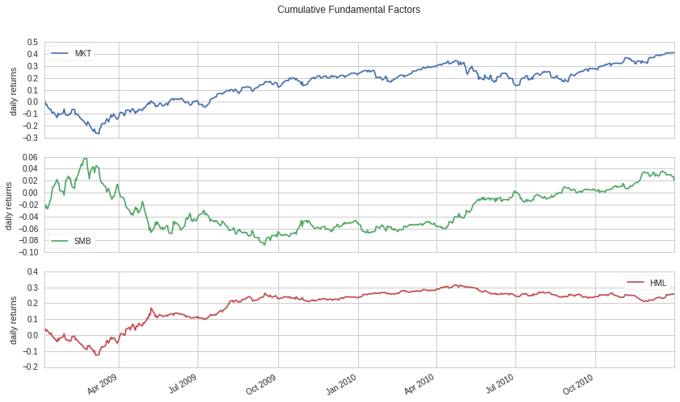
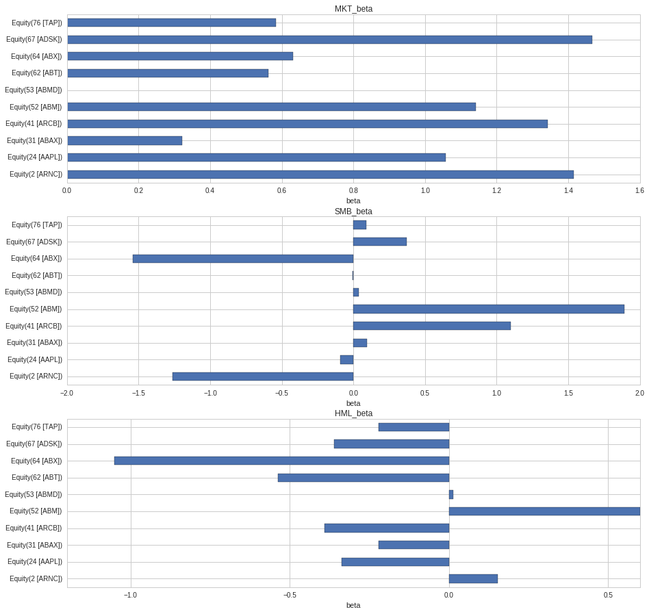

Risk-Constrained Portfolio Optimization
=======================================

by Rene Zhang and Max Margenot

Part of the Quantopian Lecture Series: \*
`www.quantopian.com/lectures <https://www.quantopian.com/lectures>`__ \*
https://github.com/quantopian/research_public

--------------

Risk management is critical for constructing portfolios and building
algorithms. Its main function is to improve the quality and consistency
of returns by adequately accounting for risk. Any returns obtained by
*unexpected* risks, which are always lurking within our portfolio, can
usually not be relied upon to produce profits over a long time. By
limiting the impact of or eliminating these unexpected risks, the
portfolio should ideally only have exposure to the alpha we are
pursuing. In this lecture, we will focus on how to use factor model in
risk management.

Factor Models
-------------

We have written many lectures on `Factor
Models <https://www.quantopian.com/lectures/the-capital-asset-pricing-model-and-arbitrage-pricing-theory>`__
and the calculation of `Factor Risk
Exposure <https://www.quantopian.com/lectures/factor-risk-exposure>`__,
as well as `how to analyze alpha
factors <https://www.quantopian.com/lectures/factor-analysis>`__. The
notation we generally use when introducing a factor model is as follows:

.. math:: R_i = a_i + b_{i1} F_1 + b_{i2} F_2 + \ldots + b_{iK} F_k + \epsilon_i

where:

.. math::

   \begin{eqnarray}
   k &=& \text{the number of factors}\\
   R_i &=& \text{the return for company $i$}, \\
   a_i &=& \text{the intercept},\\
   F_j &=& \text{the return for factor $j$, $j \in [1,k]$}, \\
   b_{ij} &=& \text{the corresponding exposure to factor $j$, $j \in [1,k]$,} \\
   \epsilon_i &=& \text{specific fluctuation of company $i$.}\\
   \end{eqnarray}

To quantify unexpected risks and have acceptable risk levels in a given
portfolio, we need to answer 3 questions:

1. What proportion of the variance of my portfolio comes from common
   risk factors?

2. How do I limit this risk?

3. Where does the return/PNL of my portfolio come from, i.e., to what do
   I attribute the performance?

These risk factors can be: - Classical fundamental factors, such as
those in the
`CAPM <https://www.quantopian.com/lectures/the-capital-asset-pricing-model-and-arbitrage-pricing-theory>`__
(market risk) or the `Fama-French 3-Factor
Model <https://www.quantopian.com/lectures/fundamental-factor-models>`__
(price-to-book (P/B) ratio, volatility) - Sector or industry exposure -
Macroeconomic factors, such as inflation or interest rates - Statistical
factors that are based on historical returns and derived from principal
component analysis

Universe
~~~~~~~~

The base universe of assets we use here is the QTradableStocksUS.

.. code:: ipython2

    import numpy as np
    import pandas as pd
    import matplotlib.pyplot as plt
    import statsmodels.api as sm
    from quantopian.pipeline import Pipeline
    from quantopian.pipeline.data import Fundamentals
    from quantopian.pipeline.data.builtin import USEquityPricing
    from quantopian.pipeline.factors import CustomFactor, Returns
    from quantopian.pipeline.filters import QTradableStocksUS
    from quantopian.research import run_pipeline

.. code:: ipython2

    # date range for building risk model
    start = "2009-01-01"
    end = "2011-01-01"

First we pull the returns of every asset in this universe across our
desired time period.

.. code:: ipython2

    def qtus_returns(start_date, end_date):
        pipe = Pipeline(
            columns={'Close': USEquityPricing.close.latest},
            screen = QTradableStocksUS()
        )
        stocks = run_pipeline(pipe, start_date, end_date)  
        unstacked_results = stocks.unstack()
        
        prices = (unstacked_results['Close'].fillna(method='ffill').fillna(method='bfill')
                      .dropna(axis=1,how='any').shift(periods=-1).dropna())  
        qus_returns = prices.pct_change()[1:]
        return qus_returns
    
    
    R = qtus_returns(start, end)
    print "The universe we define includes {} assets.".format(R.shape[1])
    print 'The number of timestamps is {} from {} to {}.'.format(R.shape[0], start, end)

.. parsed-literal::

    The universe we define includes 2041 assets.
    The number of timestamps is 503 from 2009-01-01 to 2011-01-01.

.. code:: ipython2

    assets = R.columns

Factor Returns and Exposures
~~~~~~~~~~~~~~~~~~~~~~~~~~~~

We will start with the classic Fama-French factors. The Fama-French
factors are the market, company size, and company price-to-book (PB)
ratio. We compute each asset’s exposures to these factors, computing the
factors themselves using pipeline code borrowed from the `Fundamental
Factor Models
lecture <https://www.quantopian.com/lectures/fundamental-factor-models>`__.

.. code:: ipython2

    def make_pipeline():
        """
        Create and return our pipeline.
        
        We break this piece of logic out into its own function to make it easier to
        test and modify in isolation.
        
        In particular, this function can be copy/pasted into the backtester and run by itself.
        """
        # Market Cap
        market_cap = Fundamentals.shares_outstanding.latest/USEquityPricing.close.latest
        # Book to Price ratio
        book_to_price = 1/Fundamentals.pb_ratio.latest
        
        # Build Filters representing the top and bottom 500 stocks by our combined ranking system.
        biggest = market_cap.top(500, mask=QTradableStocksUS())
        smallest = market_cap.bottom(500, mask=QTradableStocksUS())
        
        highpb = book_to_price.top(500, mask=QTradableStocksUS())
        lowpb = book_to_price.bottom(500, mask=QTradableStocksUS())
        
        universe = biggest | smallest | highpb | lowpb
        
        pipe = Pipeline(
            columns = {
                'returns' : Returns(window_length=2),
                'market_cap' : market_cap,
                'book_to_price' : book_to_price,
                'biggest' : biggest,
                'smallest' : smallest,
                'highpb' : highpb,
                'lowpb' : lowpb
            },
            screen=universe
        )
        return pipe

Here we run our pipeline and create the return streams for
high-minus-low and small-minus-big.

.. code:: ipython2

    pipe = make_pipeline()
    # This takes a few minutes.
    results = run_pipeline(pipe, start, end)
    R_biggest = results[results.biggest]['returns'].groupby(level=0).mean()
    R_smallest = results[results.smallest]['returns'].groupby(level=0).mean()
    
    R_highpb = results[results.highpb]['returns'].groupby(level=0).mean()
    R_lowpb = results[results.lowpb]['returns'].groupby(level=0).mean()
    
    SMB = R_smallest - R_biggest
    HML = R_highpb - R_lowpb
    
    df = pd.DataFrame({
             'SMB': SMB, # company size
             'HML': HML  # company PB ratio
        },columns =["SMB","HML"]).shift(periods =-1).dropna()
    
    MKT = get_pricing('SPY', start_date=start, end_date=end, fields='price').pct_change()[1:]
    MKT = pd.DataFrame({'MKT':MKT})
    
    F = pd.concat([MKT,df],axis = 1).dropna()

.. code:: ipython2

    ax = ((F + 1).cumprod() - 1).plot(subplots=True, title='Cumulative Fundamental Factors')
    ax[0].set(ylabel = "daily returns")
    ax[1].set(ylabel = "daily returns")
    ax[2].set(ylabel = "daily returns")
    plt.show()

Calculating the Exposures
~~~~~~~~~~~~~~~~~~~~~~~~~

Running a multiple linear regression on the fundamental factors for each
asset in our universe, we can obtain the corresponding factor exposure
for each asset. Here we express:

.. math::  R_i = \alpha_i + \beta_{i, MKT} R_{i, MKT} + \beta_{i, HML} R_{i, HML} + \beta_{i, SMB} R_{i, SMB} + \epsilon_i

for each asset :math:`S_i`. This shows us how much of each individual
security’s return is made up of these risk factors.

We calculate the risk exposures on an asset-by-asset basis in order to
get a more granular view of the risk of our portfolio. This approach
requires that we know the holdings of the portfolio itself, on any given
day, and is computationally expensive.

.. code:: ipython2

    # factor exposure
    B = pd.DataFrame(index=assets, dtype=np.float32)
    epsilon = pd.DataFrame(index=R.index, dtype=np.float32)

.. code:: ipython2

    x = sm.add_constant(F)
    
    for i in assets:
        y = R.loc[:,i]
        y_inlier = y[np.abs(y - y.mean())<=(3*y.std())]
        x_inlier = x[np.abs(y - y.mean())<=(3*y.std())]
        result = sm.OLS(y_inlier, x_inlier).fit()
    
        B.loc[i,"MKT_beta"] = result.params[1]
        B.loc[i,"SMB_beta"] = result.params[2]
        B.loc[i,"HML_beta"] = result.params[3]
        epsilon.loc[:,i] = y - (x.iloc[:,0] * result.params[0] +
                                x.iloc[:,1] * result.params[1] + 
                                x.iloc[:,2] * result.params[2] +
                                x.iloc[:,3] * result.params[3])
     

The factor exposures are shown as follows. Each individual asset in our
universe will have a different exposure to the three included risk
factors.

.. code:: ipython2

    fig,axes = plt.subplots(3, 1)
    ax1,ax2,ax3 =axes
    
    B.iloc[0:10,0].plot.barh(ax=ax1, figsize=[15,15], title=B.columns[0])
    B.iloc[0:10,1].plot.barh(ax=ax2, figsize=[15,15], title=B.columns[1])
    B.iloc[0:10,2].plot.barh(ax=ax3, figsize=[15,15], title=B.columns[2])
    
    ax1.set(xlabel='beta')
    ax2.set(xlabel='beta')
    ax3.set(xlabel='beta')
    plt.show()

.. code:: ipython2

    B.loc[symbols('AAPL'),:]

.. parsed-literal::

    MKT_beta    1.058299
    SMB_beta   -0.090008
    HML_beta   -0.337822
    Name: Equity(24 [AAPL]), dtype: float64

Summary of the Setup:
~~~~~~~~~~~~~~~~~~~~~

1. returns of assets in universe: ``R``
2. fundamental factors: ``F``
3. Exposures of these fundamental factors: ``B``

Currently, the ``F`` DataFrame contains the return streams for MKT, SMB,
and HML, by date.

.. code:: ipython2

    F.head(3)

.. raw:: html

    

    <table border="1" class="dataframe">
      <thead>
        <tr style="text-align: right;">
          <th></th>
          <th>MKT</th>
          <th>SMB</th>
          <th>HML</th>
        </tr>
      </thead>
      <tbody>
        <tr>
          <th>2009-01-05 00:00:00+00:00</th>
          <td>-0.001829</td>
          <td>-0.009132</td>
          <td>0.014025</td>
        </tr>
        <tr>
          <th>2009-01-06 00:00:00+00:00</th>
          <td>0.006891</td>
          <td>-0.016682</td>
          <td>0.026461</td>
        </tr>
        <tr>
          <th>2009-01-07 00:00:00+00:00</th>
          <td>-0.029319</td>
          <td>0.004960</td>
          <td>-0.013101</td>
        </tr>
      </tbody>
    </table>
    

While the ``B`` DataFrame contains point estimates of the beta exposures
**to** MKT, SMB, and HML for every asset in our universe.

.. code:: ipython2

    B.head(3)

.. raw:: html

    

    <table border="1" class="dataframe">
      <thead>
        <tr style="text-align: right;">
          <th></th>
          <th>MKT_beta</th>
          <th>SMB_beta</th>
          <th>HML_beta</th>
        </tr>
      </thead>
      <tbody>
        <tr>
          <th>Equity(2 [ARNC])</th>
          <td>1.414528</td>
          <td>-1.260533</td>
          <td>0.153812</td>
        </tr>
        <tr>
          <th>Equity(24 [AAPL])</th>
          <td>1.058299</td>
          <td>-0.090008</td>
          <td>-0.337822</td>
        </tr>
        <tr>
          <th>Equity(31 [ABAX])</th>
          <td>0.322672</td>
          <td>0.094498</td>
          <td>-0.221841</td>
        </tr>
      </tbody>
    </table>
    

Now that we have these values, we can start to crack open the variance
of any portfolio that contains these assets.

Splitting Variance into Common Factor Risks
~~~~~~~~~~~~~~~~~~~~~~~~~~~~~~~~~~~~~~~~~~~

The portfolio variance can be represented as:

.. math:: \sigma^2 = \omega BVB^{\top}\omega^{\top} + \omega D\omega^{\top}

where:

.. math::

   \begin{eqnarray}
   B &=& \text{the matrix of factor exposures of $n$ assets to the factors} \\
       V &=& \text{the covariance matrix of factors} \\
       D &=& \text{the specific variance} \\
       \omega &=& \text{the vector of portfolio weights for $n$ assets}\\
       \omega BVB^{\top}\omega^{\top} &=& \text{common factor variance} \\
       \omega D\omega^{\top} &=& \text{specific variance} \\
   \end{eqnarray}

Computing Common Factor and Specific Variance:
^^^^^^^^^^^^^^^^^^^^^^^^^^^^^^^^^^^^^^^^^^^^^^

Here we build functions to break out the risk in our portfolio. Suppose
that our portfolio consists of all stocks in the Q3000US,
equally-weighted. Let’s have a look at how much of the variance of the
returns in this universe are due to common factor risk.

.. code:: ipython2

    w = np.ones([1,R.shape[1]])/R.shape[1]

.. code:: ipython2

    def compute_common_factor_variance(factors, factor_exposures, w):   
        B = np.asarray(factor_exposures)
        F = np.asarray(factors)
        V = np.asarray(factors.cov())
        
        return w.dot(B.dot(V).dot(B.T)).dot(w.T)
    
    common_factor_variance = compute_common_factor_variance(F, B, w)[0][0]
    print("Common Factor Variance: {0}".format(common_factor_variance))

.. parsed-literal::

    Common Factor Variance: 0.000139911491552

.. code:: ipython2

    def compute_specific_variance(epsilon, w):       
        
        D = np.diag(np.asarray(epsilon.var())) * epsilon.shape[0] / (epsilon.shape[0]-1)
    
        return w.dot(D).dot(w.T)
    
    specific_variance = compute_specific_variance(epsilon, w)[0][0]
    print("Specific Variance: {0}".format(specific_variance))

.. parsed-literal::

    Specific Variance: 2.33727878586e-07

In order to actually calculate the percentage of our portfolio variance
that is made up of common factor risk, we do the following:

.. math:: \frac{\text{common factor variance}}{\text{common factor variance + specific variance}}

.. code:: ipython2

    common_factor_pct = common_factor_variance/(common_factor_variance + specific_variance)*100.0
    print("Percentage of Portfolio Variance Due to Common Factor Risk: {0:.2f}%".format(common_factor_pct))

.. parsed-literal::

    Percentage of Portfolio Variance Due to Common Factor Risk: 99.83%

So we see that if we just take every single security in the Q3000US and
equally-weight them, we will end up possessing a portfolio that
effectively only contains common risk.

Risk-Constrained Optimization
~~~~~~~~~~~~~~~~~~~~~~~~~~~~~

Currently we are operating with an equal-weighted portfolio. However, we
can reapportion those weights in such a way that we minimize the common
factor risk illustrated by our common factor exposures. This is a
portfolio optimization problem to find the optimal weights.

We define this problem as:

\\begin{array}{ll} :raw-latex:`\mbox{$\text{minimize/maximum}$}`\_{w} &
:raw-latex:`\text{objective function}`\\ :raw-latex:`\mbox{subject to}`
& {:raw-latex:`\bf 1`}^T :raw-latex:`\omega `= 1,
:raw-latex:`\quad `f=B^T:raw-latex:`\omega`\\ &
:raw-latex:`\omega `:raw-latex:`\in {\cal W}`, :raw-latex:`\quad `f
:raw-latex:`\in {\cal F}`, \\end{array}

where the variable :math:`w` is the vector of allocations, the variable
:math:`f` is weighted factor exposures, and the variable
:math:`{\cal F}` provides our constraints for :math:`f`. We set
:math:`{\cal F}` as a vector to bound the weighted factor exposures of
the porfolio. These constraints allow us to reject weightings that do
not fit our criteria. For example, we can set the maximum factor
exposures that our portfolios can have by changing the value of
:math:`{\cal F}`. A value of :math:`[1,1,1]` would indicate that we want
the maximum factor exposure of the portfolio to each factor to be less
than :math:`1`, rejecting any portfolios that do not meet that
condition.

We define the objective function as whichever business goal we value
highest. This can be something such as maximizing the Sharpe ratio or
minimizing the volatility. Ultimately, what we want to solve for in this
optimization problem is the weights, :math:`\omega`.

Let’s quickly generate some random weights to see how the weighted
factor exposures of the portfolio change.

.. code:: ipython2

    w_0 = np.random.rand(R.shape[1])
    w_0 = w_0/np.sum(w_0)

The variable :math:`f` contains the weighted factor exposures of our
portfolio, with size equal to the number of factors we have. As we
change :math:`\omega`, our weights, our weighted exposures, :math:`f`,
also change.

.. code:: ipython2

    f = B.T.dot(w_0)
    f

.. parsed-literal::

    MKT_beta    0.888824
    SMB_beta    0.274632
    HML_beta    0.001556
    dtype: float64

A concrete example of this can be found
`here <http://nbviewer.jupyter.org/github/cvxgrp/cvx_short_course/blob/master/applications/portfolio_optimization.ipynb>`__,
in the docs for CVXPY.

Performance Attribution
~~~~~~~~~~~~~~~~~~~~~~~

Let’s take a sample algo from the Quantopian forums and attribute its
performance using pyfolio. This should give us an understanding of the
specific and common risk associated with the algorithm’s return stream.

.. code:: ipython2

    bt_wsj = get_backtest('59232d19c931f1619e6423c9')

.. parsed-literal::

    100% Time: 0:00:03|###########################################################|

Now we’ll run the algorithm using `Quantopian’s built-in risk
model <https://www.quantopian.com/posts/new-tool-for-quants-the-quantopian-risk-model>`__
and performance attribution tearsheet. We extend beyond the Fama-French
Factors, looking into common factor risk due to sectors and due to
particular styles of investment that are common in the market.

.. code:: ipython2

    bt_wsj.create_perf_attrib_tear_sheet();

.. parsed-literal::

    /usr/local/lib/python2.7/dist-packages/pyfolio/perf_attrib.py:172: UserWarning: Could not determine risk exposures for some of this algorithm's positions. Returns from the missing assets will not be properly accounted for in performance attribution.
    
    The following assets were missing factor loadings: [u'AGII-6276'].. Ignoring for exposure calculation and performance attribution. Ratio of assets missing: 0.001. Average allocation of missing assets:
    
    AGII-6276    1782.992195
    dtype: float64.
    
      warnings.warn(missing_stocks_warning_msg)

.. raw:: html

    <table border="1" class="dataframe">
      <thead>
        <tr style="text-align: right;">
          <th>Summary Statistics</th>
          <th></th>
        </tr>
      </thead>
      <tbody>
        <tr>
          <th>Annualized Specific Return</th>
          <td>0.082838</td>
        </tr>
        <tr>
          <th>Annualized Common Return</th>
          <td>0.118462</td>
        </tr>
        <tr>
          <th>Annualized Total Return</th>
          <td>0.209244</td>
        </tr>
        <tr>
          <th>Specific Sharpe Ratio</th>
          <td>1.840379</td>
        </tr>
      </tbody>
    </table>

.. raw:: html

    <table border="1" class="dataframe">
      <thead>
        <tr style="text-align: right;">
          <th>Exposures Summary</th>
          <th>Average Risk Factor Exposure</th>
          <th>Annualized Return</th>
          <th>Cumulative Return</th>
        </tr>
      </thead>
      <tbody>
        <tr>
          <th>basic_materials</th>
          <td>-0.001038</td>
          <td>0.004141</td>
          <td>0.008299</td>
        </tr>
        <tr>
          <th>consumer_cyclical</th>
          <td>-0.027212</td>
          <td>-0.012042</td>
          <td>-0.023940</td>
        </tr>
        <tr>
          <th>financial_services</th>
          <td>0.019781</td>
          <td>0.017751</td>
          <td>0.035817</td>
        </tr>
        <tr>
          <th>real_estate</th>
          <td>-0.005963</td>
          <td>0.014573</td>
          <td>0.029359</td>
        </tr>
        <tr>
          <th>consumer_defensive</th>
          <td>0.004187</td>
          <td>-0.000505</td>
          <td>-0.001009</td>
        </tr>
        <tr>
          <th>health_care</th>
          <td>0.010517</td>
          <td>0.007931</td>
          <td>0.015926</td>
        </tr>
        <tr>
          <th>utilities</th>
          <td>0.010076</td>
          <td>0.002534</td>
          <td>0.005074</td>
        </tr>
        <tr>
          <th>communication_services</th>
          <td>-0.003996</td>
          <td>-0.000436</td>
          <td>-0.000872</td>
        </tr>
        <tr>
          <th>energy</th>
          <td>0.012374</td>
          <td>0.001215</td>
          <td>0.002432</td>
        </tr>
        <tr>
          <th>industrials</th>
          <td>0.002830</td>
          <td>0.028271</td>
          <td>0.057341</td>
        </tr>
        <tr>
          <th>technology</th>
          <td>-0.021280</td>
          <td>-0.015422</td>
          <td>-0.030606</td>
        </tr>
        <tr>
          <th>momentum</th>
          <td>-0.295085</td>
          <td>0.018895</td>
          <td>0.038147</td>
        </tr>
        <tr>
          <th>size</th>
          <td>-0.142980</td>
          <td>0.006483</td>
          <td>0.013007</td>
        </tr>
        <tr>
          <th>value</th>
          <td>0.189475</td>
          <td>0.011080</td>
          <td>0.022283</td>
        </tr>
        <tr>
          <th>short_term_reversal</th>
          <td>0.327549</td>
          <td>0.028308</td>
          <td>0.057418</td>
        </tr>
        <tr>
          <th>volatility</th>
          <td>-0.034728</td>
          <td>0.001487</td>
          <td>0.002976</td>
        </tr>
      </tbody>
    </table>

.. image:: notebook_files/notebook_43_3.png

References
----------

-  Qian, E.E., Hua, R.H. and Sorensen, E.H., 2007. *Quantitative equity
   portfolio management: modern techniques and applications*. CRC Press.
-  Narang, R.K., 2013. *Inside the Black Box: A Simple Guide to
   Quantitative and High Frequency Trading*. John Wiley & Sons.

*This presentation is for informational purposes only and does not
constitute an offer to sell, a solicitation to buy, or a recommendation
for any security; nor does it constitute an offer to provide investment
advisory or other services by Quantopian, Inc. (“Quantopian”). Nothing
contained herein constitutes investment advice or offers any opinion
with respect to the suitability of any security, and any views expressed
herein should not be taken as advice to buy, sell, or hold any security
or as an endorsement of any security or company. In preparing the
information contained herein, Quantopian, Inc. has not taken into
account the investment needs, objectives, and financial circumstances of
any particular investor. Any views expressed and data illustrated herein
were prepared based upon information, believed to be reliable, available
to Quantopian, Inc. at the time of publication. Quantopian makes no
guarantees as to their accuracy or completeness. All information is
subject to change and may quickly become unreliable for various reasons,
including changes in market conditions or economic circumstances.*
