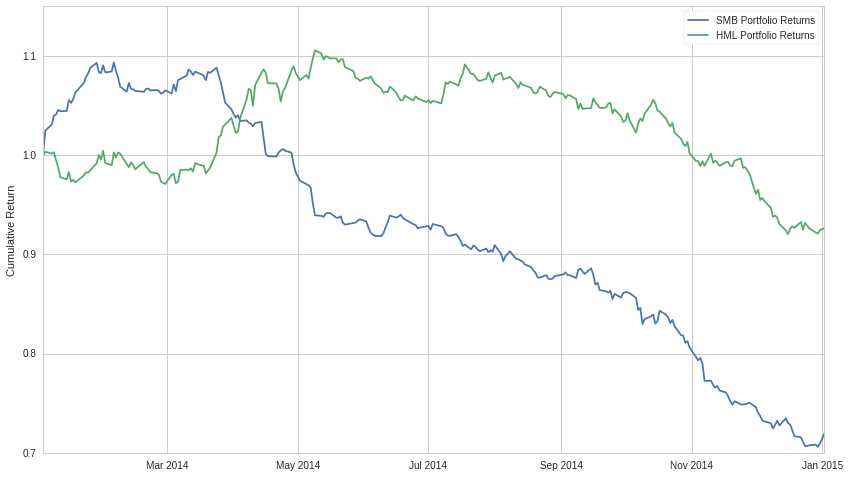
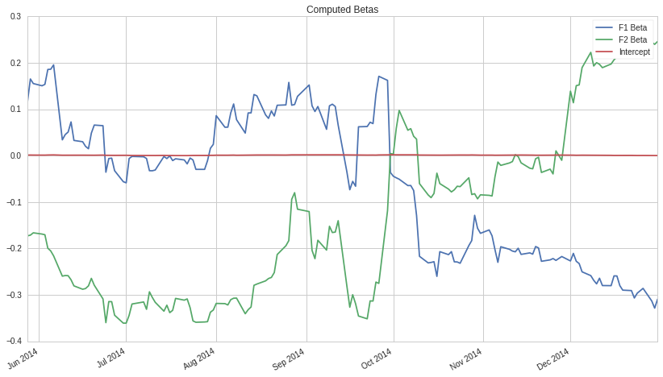
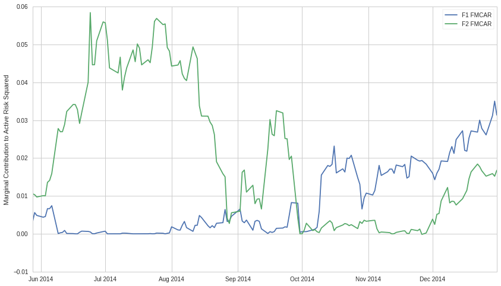

Factor Risk Exposure
====================

By Evgenia “Jenny” Nitishinskaya, Delaney Granizo-Mackenzie, and Maxwell
Margenot.

Part of the Quantopian Lecture Series:

-  `www.quantopian.com/lectures <https://www.quantopian.com/lectures>`__
-  `github.com/quantopian/research_public <https://github.com/quantopian/research_public>`__

--------------

##DISCLAIMER:

As always, this analysis is based on historical data, and risk exposures
estimated on historical data may or may not affect the exposures going
forward. As such, computing the risk exposure of to a factor is not
enough. You must put confidence bounds on that risk exposure, and
determine whether the risk exposure can even be modeled reasonably. For
more information on this, please see our other lectures, especially
Instability of Parameter Estimates.

##Using Factor Models to Determine Risk Exposure

We can use factor models to analyze the sources of risks and returns in
portfolios. Recall that a factor model expresses the returns as

.. math:: R_i = a_i + b_{i1} F_1 + b_{i2} F_2 + \ldots + b_{iK} F_K + \epsilon_i

By modelling the historical returns, we can see how much of them is due
to speculation on different factors and how much to asset-specific
fluctuations (:math:`\epsilon_p`). We can also examine what sources of
risk the portfolio is exposed to.

In risk analysis, we often model active returns (returns relative to a
benchmark) and active risk (standard deviation of active returns, also
known as tracking error or tracking risk).

For instance, we can find a factor’s marginal contribution to active
risk squared (FMCAR). For factor :math:`j`, this is

.. math::  \text{FMCAR}_j = \frac{b_j^a \sum_{i=1}^K b_i^a Cov(F_j, F_i)}{(\text{Active risk})^2} 

where :math:`b_i^a` is the portfolio’s active exposure to factor
:math:`i`. This tells us how much risk we incur by being exposed to
factor :math:`j`, given all the other factors we’re already exposed to.

Fundamental factor models are often used to evaluate portfolios because
they correspond directly to investment choices (e.g. whether we invest
in small-cap or large-cap stocks, etc.). Below, we construct a model to
evaluate a single asset; for more information on the model construction,
check out the fundamental factor models notebook.

We’ll use the canonical Fama-French factors for this example, which are
the returns of portfolios constructred based on fundamental factors.

##How many factors do you want?

In the Arbitrage Pricing Theory lecture we mention that for predictive
models you want fewer parameters. However, this doesn’t quite hold for
risk exposure. Instead of trying to not overfit a predictive model, you
are looking for any possible risk factor that could be influencing your
returns. Therefore it’s actually safer to estimate exposure to many many
risk factors to see if any stick. Anything left over in our
:math:`\alpha` is risk exposure that is currently unexplained by the
selected factors. You want your strategy’s return stream to be all
alpha, and to be unexplained by as many parameters as possible. If you
can show that your historical returns have little to no dependence on
many factors, this is very positive. Certainly some unrelated risk
factors might have spurious relationships over time in a large dataset,
but those are not likely to be consistent.

Setup
-----

The first thing we do is compute a year’s worth of factor returns.

NOTE
~~~~

The process for doing this is described in the Fundamental Factor Models
lecture and uses pipeline. For more information please see that lecture.

.. code:: ipython2

    import numpy as np
    import statsmodels.api as sm
    import scipy.stats as stats
    from statsmodels import regression
    import matplotlib.pyplot as plt
    import pandas as pd

.. code:: ipython2

    import numpy as np
    from quantopian.pipeline import Pipeline
    from quantopian.pipeline.data import Fundamentals
    from quantopian.pipeline.data.builtin import USEquityPricing
    from quantopian.pipeline.factors import CustomFactor, Returns
    
    # Here's the raw data we need, everything else is derivative.
    
    class MarketCap(CustomFactor):
        # Here's the data we need for this factor
        inputs = [Fundamentals.shares_outstanding, USEquityPricing.close]
        # Only need the most recent values for both series
        window_length = 1
        
        def compute(self, today, assets, out, shares, close_price):
            # Shares * price/share = total price = market cap
            out[:] = shares * close_price
            
            
    class BookToPrice(CustomFactor):
        # pb = price to book, we'll need to take the reciprocal later
        inputs = [Fundamentals.pb_ratio]
        window_length = 1
        
        def compute(self, today, assets, out, pb):
            out[:] = 1 / pb
            
    def make_pipeline():
        """
        Create and return our pipeline.
        
        We break this piece of logic out into its own function to make it easier to
        test and modify in isolation.
        
        In particular, this function can be copy/pasted into research and run by itself.
        """
        pipe = Pipeline()
    
        # Add our factors to the pipeline
        market_cap = MarketCap()
        # Raw market cap and book to price data gets fed in here
        pipe.add(market_cap, "market_cap")
        book_to_price = BookToPrice()
        pipe.add(book_to_price, "book_to_price")
        
        # We also get daily returns
        returns = Returns(inputs=[USEquityPricing.close], window_length=2)
        pipe.add(returns, "returns")
        
        # We compute a daily rank of both factors, this is used in the next step,
        # which is computing portfolio membership.
        market_cap_rank = market_cap.rank()
        pipe.add(market_cap_rank, 'market_cap_rank')
        
        book_to_price_rank = book_to_price.rank()
        pipe.add(book_to_price_rank, 'book_to_price_rank')
    
        # Build Filters representing the top and bottom 1000 stocks by our combined ranking system.
        biggest = market_cap_rank.top(1000)
        smallest = market_cap_rank.bottom(1000)
        
        highpb = book_to_price_rank.top(1000)
        lowpb = book_to_price_rank.bottom(1000)
        
        # Don't return anything not in this set, as we don't need it.
        pipe.set_screen(biggest | smallest | highpb | lowpb)
        
        # Add the boolean flags we computed to the output data
        pipe.add(biggest, 'biggest')
        pipe.add(smallest, 'smallest')
        
        pipe.add(highpb, 'highpb')
        pipe.add(lowpb, 'lowpb')
        
        return pipe
    
    pipe = make_pipeline()

.. code:: ipython2

    start_date = '2014-1-1'
    end_date = '2015-1-1'

.. code:: ipython2

    from quantopian.research import run_pipeline
    results = run_pipeline(pipe, start_date, end_date)
    
    R_biggest = results[results.biggest]['returns'].groupby(level=0).mean()
    R_smallest = results[results.smallest]['returns'].groupby(level=0).mean()
    
    R_highpb = results[results.highpb]['returns'].groupby(level=0).mean()
    R_lowpb = results[results.lowpb]['returns'].groupby(level=0).mean()
    
    SMB = R_smallest - R_biggest
    HML = R_highpb - R_lowpb

How did each factor do over 2014?

.. code:: ipython2

    SMB_CUM = np.cumprod(SMB+1)
    HML_CUM = np.cumprod(HML+1)
    
    plt.plot(SMB_CUM.index, SMB_CUM.values)
    plt.plot(HML_CUM.index, HML_CUM.values)
    plt.ylabel('Cumulative Return')
    plt.legend(['SMB Portfolio Returns', 'HML Portfolio Returns']);

Computing Risk Exposure
-----------------------

Now we can determine how exposed another return stream is to each of
these factors. We can do this by running static or rolling linear
regressions between our return stream and the factor portfolio returns.
First we’ll compute the active returns (returns - benchmark) of some
random asset and then model that asset as a linear combination of our
two factors. The more a factor contributes to the active returns, the
more exposed the active returns are to that factor.

.. code:: ipython2

    # Get returns data for our portfolio
    portfolio = get_pricing(['MSFT', 'AAPL', 'YHOO', 'FB', 'TSLA'], 
                            fields='price', start_date=start_date, end_date=end_date).pct_change()[1:]
    R = np.mean(portfolio, axis=1)
    
    
    bench = get_pricing('SPY', fields='price', start_date=start_date, end_date=end_date).pct_change()[1:]
    
    # The excess returns of our active management, in this case just holding a portfolio of our one asset
    active = R - bench
    
    # Define a constant to compute intercept
    constant = pd.TimeSeries(np.ones(len(active.index)), index=active.index)
    
    df = pd.DataFrame({'R': active,
                  'F1': SMB,
                  'F2': HML,
                  'Constant': constant})
    df = df.dropna()

.. parsed-literal::

    /usr/local/lib/python2.7/dist-packages/ipykernel_launcher.py:13: FutureWarning: TimeSeries is deprecated. Please use Series
      del sys.path[0]

.. code:: ipython2

    # Perform linear regression to get the coefficients in the model
    b1, b2 = regression.linear_model.OLS(df['R'], df[['F1', 'F2']]).fit().params
    
    # Print the coefficients from the linear regression
    print 'Sensitivities of active returns to factors:\nSMB: %f\nHML: %f' %  (b1, b2)

.. parsed-literal::

    Sensitivities of active returns to factors:
    SMB: -0.066887
    HML: -0.046026

Using the formula from the start of the notebook, we can compute the
factors’ marginal contributions to active risk squared:

.. code:: ipython2

    F1 = df['F1']
    F2 = df['F2']
    cov = np.cov(F1, F2)
    ar_squared = (active.std())**2
    fmcar1 = (b1*(b2*cov[0,1] + b1*cov[0,0]))/ar_squared
    fmcar2 = (b2*(b1*cov[0,1] + b2*cov[1,1]))/ar_squared
    print 'SMB Risk Contribution:', fmcar1
    print 'HML Risk Contribution:', fmcar2

.. parsed-literal::

    SMB Risk Contribution: 0.00159645465913
    HML Risk Contribution: 0.000973034746847

The rest of the risk can be attributed to active specific risk,
i.e. factors that we did not take into account or the asset’s
idiosyncratic risk.

However, as usual we will look at how the exposure to these factors
changes over time. As we lose a tremendous amount of information by just
looking at one data point. Let’s look at what happens if we run a
rolling regression over time.

.. code:: ipython2

    # Compute the rolling betas
    model = pd.stats.ols.MovingOLS(y = df['R'], x=df[['F1', 'F2']], 
                                 window_type='rolling', 
                                 window=100)
    rolling_parameter_estimates = model.beta
    rolling_parameter_estimates.plot();
    plt.title('Computed Betas');
    plt.legend(['F1 Beta', 'F2 Beta', 'Intercept']);

.. parsed-literal::

    /usr/local/lib/python2.7/dist-packages/IPython/core/interactiveshell.py:2882: FutureWarning: The pandas.stats.ols module is deprecated and will be removed in a future version. We refer to external packages like statsmodels, see some examples here: http://statsmodels.sourceforge.net/stable/regression.html
      exec(code_obj, self.user_global_ns, self.user_ns)

Now we’ll look at FMCAR as it changes over time.

.. code:: ipython2

    # Remove the first 99, which are all NaN for each case
    
    # Compute covariances
    covariances = pd.rolling_cov(df[['F1', 'F2']], window=100)[99:]
    # Compute active risk squared
    active_risk_squared = pd.rolling_std(active, window = 100)[99:]**2
    # Compute betas
    betas = rolling_parameter_estimates[['F1', 'F2']]
    
    # Set up empty dataframe
    FMCAR = pd.DataFrame(index=betas.index, columns=betas.columns)
    
    # For each factor
    for factor in betas.columns:
        # For each bar in our data
        for t in betas.index:
            # Compute the sum of the betas and covariances
            s = np.sum(betas.loc[t] * covariances[t][factor])
            # Get the beta
            b = betas.loc[t][factor]
            # Get active risk squared
            AR = active_risk_squared.loc[t]
            # Put them all together to estimate FMCAR on that date
            FMCAR[factor][t] = b * s / AR

.. parsed-literal::

    /usr/local/lib/python2.7/dist-packages/ipykernel_launcher.py:4: FutureWarning: pd.rolling_cov is deprecated for DataFrame and will be removed in a future version, replace with 
    	DataFrame.rolling(window=100).cov(other=<DataFrame>,pairwise=True)
      after removing the cwd from sys.path.
    /usr/local/lib/python2.7/dist-packages/ipykernel_launcher.py:6: FutureWarning: pd.rolling_std is deprecated for Series and will be removed in a future version, replace with 
    	Series.rolling(window=100,center=False).std()
      

Let’s plot this.

.. code:: ipython2

    plt.plot(FMCAR['F1'].index, FMCAR['F1'].values)
    plt.plot(FMCAR['F2'].index, FMCAR['F2'].values)
    
    plt.ylabel('Marginal Contribution to Active Risk Squared')
    plt.legend(['F1 FMCAR', 'F2 FMCAR']);

###Problems with using this data

Whereas it may be interesting to know how a portfolio was exposed to
certain factors historically, it is really only useful if we can make
predictions about how it will be exposed to risk factors in the future.
It’s not always a safe assumption to say that future exposure will be
the current exposure. As you saw the exposure varies quite a bit, so
taking the average is dangerous. We could put confidence intervals
around that average, but that would only work if the distribution of
exposures were normal or well behaved. Let’s check using our old buddy,
the Jarque-Bera test.

.. code:: ipython2

    from statsmodels.stats.stattools import jarque_bera
    _, pvalue1, _, _ = jarque_bera(FMCAR['F1'].dropna().values)
    _, pvalue2, _, _ = jarque_bera(FMCAR['F2'].dropna().values)
    
    print 'p-value F1_FMCAR is normally distributed', pvalue1
    print 'p-value F2_FMCAR is normally distributed', pvalue2

.. parsed-literal::

    p-value F1_FMCAR is normally distributed 3.45995832983e-05
    p-value F2_FMCAR is normally distributed 0.000393310890239

The p-values are below our default cutoff of 0.05. We can’t even put
good confidence intervals on the risk exposure of the asset without
extra effort, so making any statement about exposure in the future is
very difficult right now. Any hedge we took out to cancel the exposure
to one of the factors might be way over or under hedged.

We are trying to predict future exposure, and predicting the future is
incredibly difficult. One must be very careful with statistical methods
to ensure that false predictions are not made.

Factor and tracking portfolios
==============================

We can use factor and tracking portfolios to tweak a portfolio’s
sensitivities to different sources of risk.

A factor portfolio has a sensitivity of 1 to a particular factor and 0
to all other factors. In other words, it represents the risk of that one
factor. We can add a factor portfolio to a larger portfolio to adjust
its exposure to that factor.

A similar concept is a tracking portfolio, which is constructed to have
the same factor sensitivities as a benchmark or other portfolio. Like a
factor portfolio, this allows us to either speculate on or hedge out the
risks associated with that benchmark or portfolio. For instance, we
regularly hedge out the market, because we care about how our portfolio
performs relative to the market, and we don’t want to be subject to the
market’s fluctuations.

To construct a factor or tracking portfolio, we need the factor
sensitivities of what we want to track. We already know what these are
in the former case, but we need to compute them in the latter using
usual factor model methods. Then, we pick some :math:`K+1` assets (where
:math:`K` is the number of factors we’re considering) and solve for the
weights of the assets in the portfolio.

##Portfolio Exposure

The portfolio exposure can be computed directly from the return stream,
or as the weighted average of all the assets held.

Example
-------

Say we have two factors :math:`F_1` and :math:`F_2`, and a benchmark
with sensitivities of 1 and 1.1 to the factors, respectively. We
identify 3 securities :math:`x_1, x_2, x_3` that we would like to use in
composing a portfolio that tracks the benchmark, whose sensitivities are
:math:`b_{11} = 0.7`, :math:`b_{12} = 1.1`, :math:`b_{21} = 0.1`,
:math:`b_{22} = 0.5`, :math:`b_{31} = 1.5`, :math:`b_{32} = 1.3`. We
would like to compute weights :math:`w_1`, :math:`w_2`, :math:`w_3` so
that our tracking portfolio is

.. math::  P = w_1 x_1 + w_2 x_2 + w_3 x_3 

We want our portfolio sensitivities to match the benchmark:

.. math::  w_1 b_{11} + w_2 b_{21} + w_3 b_{31} = 1 

.. math::  w_1 b_{12} + w_2 b_{22} + w_3 b_{32} = 1.1 

Also, the weights need to sum to 1:

.. math::  w_1 + w_2 + w_3 = 1 

Solving this system of 3 linear equations, we find that
:math:`w_1 = 1/3`, :math:`w_2 = 1/6`, and :math:`w_3 = 1/2`. Putting the
securities together into a portfolio using these weights, we obtain a
portfolio with the same risk profile as the benchmark.

##How to Use Risk Exposure Models

Once we know our risk exposures, we can do a few things. We can not
enter into positions that have high exposures to certain factors, or we
can hedge our positions to try to neutralize the exposure.

###Risk Management

Often times funds will have a layer of protection over their
traders/algorithms. This layer of protection takes in the trades that
the fund wants to make, then computes the exposure of the new portfolio,
and checks to make sure they’re within pre-defined ranges. If they are
not, it does not place the trade and files a warning.

###Hedging

Another method of dealing with exposure is to take out hedges. You can
determine, for example, your exposure to each sector of the market. You
can then take out a hedge if a particular sector seems to affect your
returns too much. For more information on hedging, please see our Beta
Hedging lecture. Good algorithms will have built-in hedging logic that
ensures they are never over-exposed.

*This presentation is for informational purposes only and does not
constitute an offer to sell, a solicitation to buy, or a recommendation
for any security; nor does it constitute an offer to provide investment
advisory or other services by Quantopian, Inc. (“Quantopian”). Nothing
contained herein constitutes investment advice or offers any opinion
with respect to the suitability of any security, and any views expressed
herein should not be taken as advice to buy, sell, or hold any security
or as an endorsement of any security or company. In preparing the
information contained herein, Quantopian, Inc. has not taken into
account the investment needs, objectives, and financial circumstances of
any particular investor. Any views expressed and data illustrated herein
were prepared based upon information, believed to be reliable, available
to Quantopian, Inc. at the time of publication. Quantopian makes no
guarantees as to their accuracy or completeness. All information is
subject to change and may quickly become unreliable for various reasons,
including changes in market conditions or economic circumstances.*
