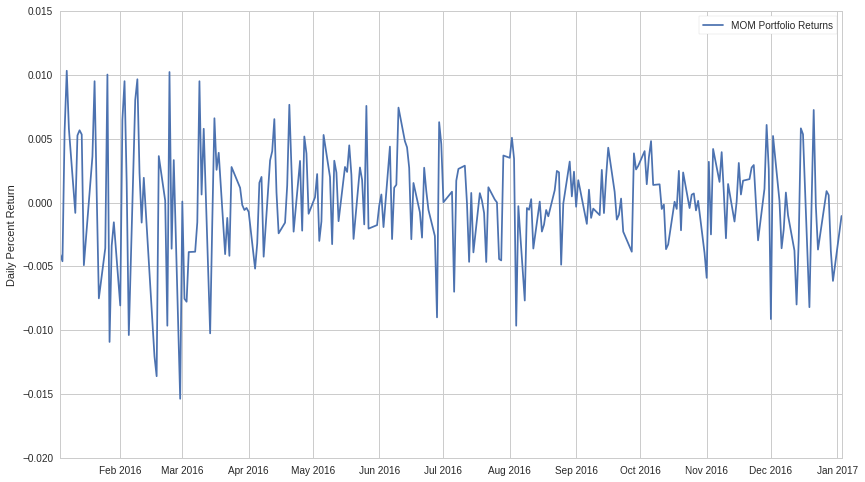
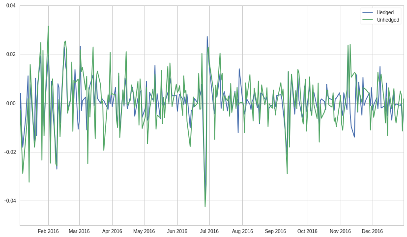

Fundamental Factor Models
=========================

By Beha Abasi, Maxwell Margenot, and Delaney Mackenzie

Part of the Quantopian Lecture Series:

-  `www.quantopian.com/lectures <https://www.quantopian.com/lectures>`__
-  `github.com/quantopian/research_public <https://github.com/quantopian/research_public>`__

--------------

What are Fundamental Factor Models?
-----------------------------------

Fundamental data refers to the metrics and ratios measuring the
financial characteristics of companies derived from the public filings
made by these companies, such as their income statements and balance
sheets. Examples of factors drawn from these documents include market
cap, net income growth, and cash flow.

This fundamental data can be used in many ways, one of which is to build
a linear factor model. Given a set of :math:`k` fundamental factors, we
can represent the returns of an asset, :math:`R_t`, as follows:

.. math:: R_t = \alpha_t + \beta_{t, F_1}F_1 + \beta_{t, F_2}F_2 + ... + \beta_{t, F_k}F_k + \epsilon_t

where each :math:`F_j` represents a fundamental factor return stream.
These return streams are from portfolios whose value is derived from
it’s respective factor.

Fundamental factor models try to determine characteristics that affect
an asset’s risk and return. The most difficult part of this is
determining which factors to use. Much research has been done on
determining significant factors, and what makes things even more
difficult is that the discovery of a significant factor often leads to
its advantage being arbitraged away! This is one of the reasons why
fundamental factor models, and linear factor models in general, are so
prevalent in modern finance. Once you have found significant factors,
you need to calculate the exposure an asset’s return stream has to each
factor. This is similar to the calculation of risk premia discussed in
the `CAPM
lecture <https://www.quantopian.com/lectures/the-capital-asset-pricing-model-and-arbitrage-pricing-theory>`__.

In using fundamental data, we run into the problem of having factors
that may not be easily compared due to their varying units and
magnitudes. To resolve this, we take two different approaches to bring
the data onto the same level - portfolio construction to compare return
streams and normalization of factor values.

Approach One: Portfolio Construction
------------------------------------

The first approach consists of using the fundamental data as a ranking
scheme and creating a `long-short equity
portfolio <https://www.quantopian.com/lectures/long-short-equity>`__
based on each factor. We then use the return streams associated with
each portfolio as our model factors.

One of the most well-known examples of this approach is the Fama-French
model. The Fama-French model, and later the Carhart four factor model,
adds market cap, book-to-price ratios, and momentum to the original
CAPM, which only included market risk.

Historically, certain groups of stocks were seen as outperforming the
market, namely those with small market caps, high book-to-price ratios,
and those that had previously done well (i.e., they had momentum).
Empirically, Fama & French found that the returns of these particular
types of stocks tended to be better than what was predicted by the
security market line of the CAPM.

In order to capture these phenomena, we will use those factors to create
a ranking scheme that will be used in the creation of long short equity
portfolios. The factors will be :math:`SMB`, measuring the excess return
of small market cap companies minus big, :math:`HML`, measuring the
excess return of companies with high book-to-price ratios versus low,
:math:`MOM`, measuring the excess returns of last month’s winners versus
last month’s losers, and :math:`EXMRKT` which is a measure of the market
risk.

In general, this approach can be used as an asset pricing model or to
hedge our portfolios. The latter uses Fama-Macbeth regressions to
calculate risk premia, as demonstrated in the CAPM lecture. Hedging can
be achieved through a linear regression of portfolio returns on the
returns from the long-short factor portfolios. Below are examples of
both.

Portfolio Construction as an Asset Pricing Model
~~~~~~~~~~~~~~~~~~~~~~~~~~~~~~~~~~~~~~~~~~~~~~~~

First we import the relevant libraries.

.. code:: ipython2

    import pandas as pd
    import numpy as np
    from quantopian.pipeline import Pipeline
    from quantopian.pipeline.data import Fundamentals
    from quantopian.pipeline.factors import CustomFactor, Returns, Latest
    from quantopian.pipeline.classifiers import Classifier
    from quantopian.pipeline.filters import QTradableStocksUS
    from quantopian.research import run_pipeline
    import matplotlib.pyplot as plt

Use pipeline to get all of our factor data that we will use in the rest
of the lecture.

.. code:: ipython2

    class Momentum(CustomFactor):
        # will give us the returns from last month
        inputs = [Returns(window_length=20)]
        window_length = 20
        
        def compute(self, today, assets, out, lag_returns):
            out[:] = lag_returns[0]
    
    
    def make_pipeline():
        # define our fundamental factor pipeline
        pipe = Pipeline()
        
        # market cap and book-to-price data gets fed in here
        market_cap = Latest([Fundamentals.market_cap])
        book_to_price = 1/Latest([Fundamentals.pb_ratio])
        # and momentum as lagged returns (1 month lag)
        momentum = Momentum()
        # we also get daily returns
        returns = Returns(window_length=2)
        
        # we compute a daily rank of both factors, this is used in the next step,
        # which is computing portfolio membership
        market_cap_rank = market_cap.rank(mask=QTradableStocksUS())
        book_to_price_rank = book_to_price.rank(mask=QTradableStocksUS())
        momentum_rank = momentum.rank(mask=QTradableStocksUS())
        
        # Grab the top and bottom 1000 for each factor
        biggest = market_cap_rank.top(1000)
        smallest = market_cap_rank.bottom(1000)
        
        highpb = book_to_price_rank.top(1000)
        lowpb = book_to_price_rank.bottom(1000)
        
        top = momentum_rank.top(1000)
        bottom = momentum_rank.bottom(1000)
        
        # Define our universe, screening out anything that isn't in the top or bottom
        universe = QTradableStocksUS() & (biggest | smallest | highpb | lowpb | top | bottom)
        
        pipe = Pipeline(
            columns = {
                'market_cap':market_cap,
                'book_to_price':book_to_price,
                'momentum':momentum,
                'Returns':returns,
                'market_cap_rank':market_cap_rank,
                'book_to_price_rank':book_to_price_rank,
                'momentum_rank':momentum_rank,
                'biggest':biggest,
                'smallest':smallest,
                'highpb':highpb,
                'lowpb':lowpb,
                'top':top,
                'bottom':bottom
            },
            screen=universe
        )
        
        return pipe
    
    # Initializing the pipe
    pipe = make_pipeline()
    
    # Now let's start the pipeline
    start_date, end_date = '2016-01-01', '2016-12-31' 
    
    results = run_pipeline(pipe, start_date, end_date)
    
    results.head()

.. raw:: html

    

    <table border="1" class="dataframe">
      <thead>
        <tr style="text-align: right;">
          <th></th>
          <th></th>
          <th>Returns</th>
          <th>biggest</th>
          <th>book_to_price</th>
          <th>book_to_price_rank</th>
          <th>bottom</th>
          <th>highpb</th>
          <th>lowpb</th>
          <th>market_cap</th>
          <th>market_cap_rank</th>
          <th>momentum</th>
          <th>momentum_rank</th>
          <th>smallest</th>
          <th>top</th>
        </tr>
      </thead>
      <tbody>
        <tr>
          <th rowspan="5" valign="top">2016-01-04 00:00:00+00:00</th>
          <th>Equity(2 [ARNC])</th>
          <td>-0.010040</td>
          <td>True</td>
          <td>0.969455</td>
          <td>1813.0</td>
          <td>True</td>
          <td>True</td>
          <td>False</td>
          <td>1.293097e+10</td>
          <td>1665.0</td>
          <td>-0.022826</td>
          <td>872.0</td>
          <td>False</td>
          <td>False</td>
        </tr>
        <tr>
          <th>Equity(24 [AAPL])</th>
          <td>-0.019474</td>
          <td>True</td>
          <td>0.203379</td>
          <td>498.0</td>
          <td>True</td>
          <td>False</td>
          <td>True</td>
          <td>5.868593e+11</td>
          <td>2020.0</td>
          <td>-0.047304</td>
          <td>588.0</td>
          <td>False</td>
          <td>False</td>
        </tr>
        <tr>
          <th>Equity(31 [ABAX])</th>
          <td>-0.038003</td>
          <td>False</td>
          <td>0.183830</td>
          <td>420.0</td>
          <td>False</td>
          <td>False</td>
          <td>True</td>
          <td>1.264883e+09</td>
          <td>435.0</td>
          <td>0.021679</td>
          <td>1527.0</td>
          <td>True</td>
          <td>True</td>
        </tr>
        <tr>
          <th>Equity(39 [DDC])</th>
          <td>0.012871</td>
          <td>False</td>
          <td>1.500267</td>
          <td>1959.0</td>
          <td>True</td>
          <td>True</td>
          <td>False</td>
          <td>8.725267e+08</td>
          <td>215.0</td>
          <td>-0.226717</td>
          <td>38.0</td>
          <td>True</td>
          <td>False</td>
        </tr>
        <tr>
          <th>Equity(41 [ARCB])</th>
          <td>0.014713</td>
          <td>False</td>
          <td>1.056666</td>
          <td>1855.0</td>
          <td>True</td>
          <td>True</td>
          <td>False</td>
          <td>5.553270e+08</td>
          <td>34.0</td>
          <td>-0.152632</td>
          <td>101.0</td>
          <td>True</td>
          <td>False</td>
        </tr>
      </tbody>
    </table>
    

Now we can go through the data and build the factor portfolios we want

.. code:: ipython2

    # group_by(level=0).mean() gives you the average return of each day for a particular group of stocks
    R_biggest = results[results.biggest]['Returns'].groupby(level=0).mean()
    R_smallest = results[results.smallest]['Returns'].groupby(level=0).mean()
    
    R_highpb = results[results.highpb]['Returns'].groupby(level=0).mean()
    R_lowpb = results[results.lowpb]['Returns'].groupby(level=0).mean()
    
    R_top = results[results.top]['Returns'].groupby(level=0).mean()
    R_bottom = results[results.bottom]['Returns'].groupby(level=0).mean()
    
    # risk-free proxy
    R_F = get_pricing('BIL', fields='price', start_date=start_date, end_date=end_date).pct_change()[1:]
    
    # find it's beta against market
    M = get_pricing('SPY', start_date=start_date, end_date=end_date, fields='price').pct_change()[1:]
    
    # Defining our final factors
    EXMRKT = M - R_F
    SMB = R_smallest - R_biggest # small minus big
    HML = R_highpb - R_lowpb # high minus low
    MOM = R_top - R_bottom # momentum

Now that we’ve constructed our portfolios, let’s look at our performance
if we were to hold each one.

.. code:: ipython2

    plt.plot(SMB.index, SMB.values)
    plt.ylabel('Daily Percent Return')
    plt.legend(['SMB Portfolio Returns']);

.. image:: notebook_files/notebook_10_0.png

.. code:: ipython2

    plt.plot(HML.index, HML.values)
    plt.ylabel('Daily Percent Return')
    plt.legend(['HML Portfolio Returns']);

.. image:: notebook_files/notebook_11_0.png

.. code:: ipython2

    plt.plot(MOM.index, MOM.values)
    plt.ylabel('Daily Percent Return')
    plt.legend(['MOM Portfolio Returns']);

Now, as we did in the CAPM lecture, we’ll calculate the risk premia on
each of these factors using the Fama-Macbeth regressions.

.. code:: ipython2

    import itertools
    import statsmodels.api as sm
    from statsmodels import regression,stats
    import scipy

Our asset returns data is asset and date specific, whereas our factor
portfolio returns are only date specific. Therefore, we’ll need to
spread each day’s portfolio return across all the assets for which we
have data for on that day.

.. code:: ipython2

    data = results[['Returns']].set_index(results.index)
    asset_list_sizes = [group[1].size for group in data.groupby(level=0)]
    
    # Spreading the factor portfolio data across all assets for each day
    SMB_column = [[SMB.loc[group[0]]] * size for group, size \
                  in zip(data.groupby(level=0), asset_list_sizes)]
    data['SMB'] = list(itertools.chain(*SMB_column))
    
    HML_column = [[HML.loc[group[0]]] * size for group, size \
                  in zip(data.groupby(level=0), asset_list_sizes)]
    data['HML'] = list(itertools.chain(*HML_column))
    
    MOM_column = [[MOM.loc[group[0]]] * size for group, size \
                  in zip(data.groupby(level=0), asset_list_sizes)]
    data['MOM'] = list(itertools.chain(*MOM_column))
    
    EXMRKT_column = [[EXMRKT.loc[group[0]]]*size if group[0] in EXMRKT.index else [None]*size \
                     for group, size in zip(data.groupby(level=0), asset_list_sizes)]
    
    data['EXMRKT'] = list(itertools.chain(*EXMRKT_column))
    
    data = sm.add_constant(data.dropna())
    
    # Our list of assets from pipeline
    assets = data.index.levels[1].unique()
    
    # gathering our data to be asset-specific
    Y = [data.xs(asset, level=1)['Returns'] for asset in assets] 
    X = [data.xs(asset, level=1)[['EXMRKT','SMB', 'HML', 'MOM', 'const']] for asset in assets]
    
    # First regression step: estimating the betas
    reg_results = [regression.linear_model.OLS(y, x).fit().params \
                   for y, x in zip(Y, X) if not(x.empty or y.empty)]
    indices = [asset for y, x, asset in zip(Y, X, assets) if not(x.empty or y.empty)]
    
    betas = pd.DataFrame(reg_results, index=indices)
    betas = sm.add_constant(betas.drop('const', axis=1))
    
    R = data['Returns'].mean(axis=0, level=1)
    
    # Second regression step: estimating the risk premia
    risk_free_rate = np.mean(R_F)
    
    final_results = regression.linear_model.OLS(R - risk_free_rate, betas).fit()
    
    final_results.summary()

.. raw:: html

    <table class="simpletable">
    <caption>OLS Regression Results</caption>
    <tr>
      <th>Dep. Variable:</th>         <td>Returns</td>     <th>  R-squared:         </th>  <td>   0.674</td> 
    </tr>
    <tr>
      <th>Model:</th>                   <td>OLS</td>       <th>  Adj. R-squared:    </th>  <td>   0.673</td> 
    </tr>
    <tr>
      <th>Method:</th>             <td>Least Squares</td>  <th>  F-statistic:       </th>  <td>   1188.</td> 
    </tr>
    <tr>
      <th>Date:</th>             <td>Thu, 09 Nov 2017</td> <th>  Prob (F-statistic):</th>   <td>  0.00</td>  
    </tr>
    <tr>
      <th>Time:</th>                 <td>15:59:17</td>     <th>  Log-Likelihood:    </th>  <td>  7909.4</td> 
    </tr>
    <tr>
      <th>No. Observations:</th>      <td>  2305</td>      <th>  AIC:               </th> <td>-1.581e+04</td>
    </tr>
    <tr>
      <th>Df Residuals:</th>          <td>  2300</td>      <th>  BIC:               </th> <td>-1.578e+04</td>
    </tr>
    <tr>
      <th>Df Model:</th>              <td>     4</td>      <th>                     </th>      <td> </td>    
    </tr>
    <tr>
      <th>Covariance Type:</th>      <td>nonrobust</td>    <th>                     </th>      <td> </td>    
    </tr>
    </table>
    <table class="simpletable">
    <tr>
         <td></td>       <th>coef</th>     <th>std err</th>      <th>t</th>      <th>P>|t|</th> <th>[95.0% Conf. Int.]</th> 
    </tr>
    <tr>
      <th>const</th>  <td>    0.0038</td> <td>    0.000</td> <td>   17.339</td> <td> 0.000</td> <td>    0.003     0.004</td>
    </tr>
    <tr>
      <th>EXMRKT</th> <td>    0.0089</td> <td>    0.000</td> <td>   54.189</td> <td> 0.000</td> <td>    0.009     0.009</td>
    </tr>
    <tr>
      <th>SMB</th>    <td>   -0.0009</td> <td> 9.68e-05</td> <td>   -9.417</td> <td> 0.000</td> <td>   -0.001    -0.001</td>
    </tr>
    <tr>
      <th>HML</th>    <td>    0.0003</td> <td>    0.000</td> <td>    3.303</td> <td> 0.001</td> <td>    0.000     0.001</td>
    </tr>
    <tr>
      <th>MOM</th>    <td>    0.0019</td> <td> 8.35e-05</td> <td>   23.341</td> <td> 0.000</td> <td>    0.002     0.002</td>
    </tr>
    </table>
    <table class="simpletable">
    <tr>
      <th>Omnibus:</th>       <td>3131.361</td> <th>  Durbin-Watson:     </th>  <td>   2.038</td>  
    </tr>
    <tr>
      <th>Prob(Omnibus):</th>  <td> 0.000</td>  <th>  Jarque-Bera (JB):  </th> <td>2148727.714</td>
    </tr>
    <tr>
      <th>Skew:</th>           <td> 7.156</td>  <th>  Prob(JB):          </th>  <td>    0.00</td>  
    </tr>
    <tr>
      <th>Kurtosis:</th>       <td>151.889</td> <th>  Cond. No.          </th>  <td>    3.84</td>  
    </tr>
    </table>

Returns Prediction
^^^^^^^^^^^^^^^^^^

As discussed in the CAPM lecture, factor modeling can be used to predict
future returns based on current fundamental factors. As well, it could
be used to determine when an asset may be mispriced in order to
arbitrage the difference, as shown in the CAPM lecture.

Modeling future returns is accomplished by offsetting the returns in the
regression, so that rather than predict for current returns, you are
predicting for future returns. Once you have a predictive model, the
most canonical way to create a strategy is to attempt a long-short
equity approach.

Portfolio Construction for Hedging
~~~~~~~~~~~~~~~~~~~~~~~~~~~~~~~~~~

Once we’ve determined that we are exposed to a factor, we may want to
avoid depending on the performance of that factor by taking out a hedge.
This is discussed in more detail in the Beta Hedging and Risk Factor
Exposure lectures. The essential idea is to take the exposure your
return stream has to a factor, and short the proportional value. So, if
your total portfolio value was :math:`V`, and the exposure you
calculated to a certain factor return stream was :math:`\beta`, you
would short :math:`\beta V` amount of that return stream.

The following is an example using the Fama-French factors we used
before.

.. code:: ipython2

    # we'll take a random sample of 500 assets from QTradableStocksUS in order to build a random portfolio
    random_assets = list(np.random.choice(assets, size=500, replace=False))
    
    portfolio_data = data[data.index.isin(random_assets, level=1)]
    
    # this is the return of our portfolio with no hedging
    R_portfolio_time_series = portfolio_data['Returns'].mean(level=0)

.. code:: ipython2

    # next, we calculate the exposure of our portfolio to each of the Fama-French factors
    portfolio_exposure = regression.linear_model.OLS(portfolio_data['Returns'], \
                                    portfolio_data[['EXMRKT', 'SMB', 'HML', 'MOM', 'const']]).fit()
    
    print portfolio_exposure.summary()
    
    # our hedged return stream
    hedged_portfolio = R_portfolio_time_series - \
                    portfolio_exposure.params[0]*EXMRKT - \
                    portfolio_exposure.params[1]*SMB - \
                    portfolio_exposure.params[2]*HML - \
                    portfolio_exposure.params[3]*MOM 
    
    print 'Mean, Std of Hedged Portfolio:', np.mean(hedged_portfolio), np.std(hedged_portfolio)
    print 'Mean, Std of Unhedged Portfolio:', np.mean(R_portfolio_time_series), np.std(R_portfolio_time_series)

.. parsed-literal::

                                OLS Regression Results                            
    ==============================================================================
    Dep. Variable:                Returns   R-squared:                       0.100
    Model:                            OLS   Adj. R-squared:                  0.100
    Method:                 Least Squares   F-statistic:                     3043.
    Date:                Thu, 09 Nov 2017   Prob (F-statistic):               0.00
    Time:                        15:59:17   Log-Likelihood:             2.5577e+05
    No. Observations:              109274   AIC:                        -5.115e+05
    Df Residuals:                  109269   BIC:                        -5.115e+05
    Df Model:                           4                                         
    Covariance Type:            nonrobust                                         
    ==============================================================================
                     coef    std err          t      P>|t|      [95.0% Conf. Int.]
    ------------------------------------------------------------------------------
    EXMRKT        -0.0844      0.009     -9.697      0.000        -0.102    -0.067
    SMB            1.5407      0.016     93.877      0.000         1.509     1.573
    HML            0.3619      0.018     19.942      0.000         0.326     0.398
    MOM           -0.3274      0.017    -19.237      0.000        -0.361    -0.294
    const          0.0009   7.07e-05     13.123      0.000         0.001     0.001
    ==============================================================================
    Omnibus:                    55068.532   Durbin-Watson:                   1.743
    Prob(Omnibus):                  0.000   Jarque-Bera (JB):         17378528.352
    Skew:                           1.203   Prob(JB):                         0.00
    Kurtosis:                      64.734   Cond. No.                         265.
    ==============================================================================
    
    Warnings:
    [1] Standard Errors assume that the covariance matrix of the errors is correctly specified.
    Mean, Std of Hedged Portfolio: 0.000924080281308 0.00807648965578
    Mean, Std of Unhedged Portfolio: 0.000952411722592 0.011239525098

Let’s look at a graph of our two portfolio return streams

.. code:: ipython2

    plt.plot(hedged_portfolio)
    
    plt.plot(R_portfolio_time_series)
    
    plt.legend(['Hedged', 'Unhedged']);

We’ll check for normality, homoskedasticity, and autocorrelation in this
model. For more information on the tests below, check out the
`Violations of Regression
Models <https://www.quantopian.com/lectures/violations-of-regression-models#notebook>`__
lecture.

For normality, we’ll run a Jarque-Bera test, which tests whether our
data’s skew/kurtosis matches that of a normal distribution. As the
standard, we’ll reject the null hypothesis that our data is normally
distributed if our p-value falls under our confidence level of 5%.

To test for heteroskedasticity, we’ll run a Breush-Pagan test, which
tests whether the variance of the errors in a linear regression is
related to the values of the independent variables. In this case, our
null hypothesis is that the data is homoskedastic.

Autocorrelation is tested for using the Durbin-Watson statistic, which
looks at the lagged relationship between the errors in a regression.
This will give you a number between 0 and 4, with 2 meaning no
autocorrelation.

.. code:: ipython2

    # testing for normality: jarque-bera
    _, pvalue_JB, _, _ = stats.stattools.jarque_bera(portfolio_exposure.resid)
    print "Jarque-Bera p-value: ", pvalue_JB
    
    # testing for homoskedasticity: breush pagan
    _, pvalue_BP, _, _ = stats.diagnostic.het_breushpagan(portfolio_exposure.resid, \
                                                portfolio_data[['EXMRKT', 'SMB', 'HML', 'MOM', 'const']])
    print "Breush Pagan p-value: ", pvalue_BP
    
    # testing for autocorrelation
    dw = stats.stattools.durbin_watson(portfolio_exposure.resid)
    print "Durbin Watson statistic: ", dw

.. parsed-literal::

    Jarque-Bera p-value:  0.0
    Breush Pagan p-value:  0.122901932995
    Durbin Watson statistic:  1.7425657195

Based on the Jarque-Bera p-value, we would reject the null hypothesis
that the data is normally distributed. This means there is strong
evidence that our data follows some other distribution.

The test for homoskedasticity suggests that the data is heteroskedastic.
However, we need to be careful about this test as we saw that our data
may not be normally distributed.

Finally, the Durbin-Watson statistic can be evaluated by looking at the
critical values of the statistic. At a confidence level of 95% and 4
explanatory variables, we cannot reject the null hypothesis of no
autocorrelation.

Approach Two: Factor Value Normalization
----------------------------------------

Another approach is to normalize factor values for each day and see how
predictive of that day’s returns they were. This is also known as
cross-sectional factor analysis. We do this by computing a normalized
factor value :math:`b_{a,j}` for each asset :math:`a` in the following
way.

.. math:: b_{a,j} = \frac{F_{a,j} - \mu_{F_j}}{\sigma_{F_j}}

:math:`F_{a,j}` is the value of factor :math:`j` for asset :math:`a`
during this time, :math:`\mu_{F_j}` is the mean factor value across all
assets, and :math:`\sigma_{F_j}` is the standard deviation of factor
values over all assets. Notice that we are just computing a z-score to
make asset specific factor values comparable across different factors.

The exceptions to this formula are indicator variables, which are set to
1 for true and 0 for false. One example is industry membership: the
coefficient tells us whether the asset belongs to the industry or not.

After we calculate all of the normalized scores during time :math:`t`,
we can estimate factor :math:`j`\ ’s returns :math:`F_{j,t}`, using a
cross-sectional regression (i.e. at each time step, we perform a
regression using the equations for all of the assets). Specifically,
once we have returns for each asset :math:`R_{a,t}`, and normalized
factor coefficients :math:`b_{a,j}`, we construct the following model
and estimate the :math:`F_j`\ s and :math:`a_t`

.. math:: R_{a,t} = a_t + b_{a,F_1}F_1 + b_{a, F_2}F_2 + \dots + b_{a, F_K}F_K

You can think of this as slicing through the other direction from the
first analysis, as now the factor returns are unknowns to be solved for,
whereas originally the coefficients were the unknowns. Another way to
think about it is that you’re determining how predictive of returns the
factor was on that day, and therefore how much return you could have
squeezed out of that factor.

Following this procedure, we’ll get the cross-sectional returns on
2016-11-22, and compute the coefficients for all assets:

We can take the fundamental data we got from the pipeline call above.

.. code:: ipython2

    date = '2016-11-22'
    
    BTP = results['book_to_price'][date]
    z_score = (BTP - BTP.mean()) / BTP.std()
    z_score.dropna(inplace=True)
    
    plt.hist(z_score)
    plt.xlabel('Z-Score')
    plt.ylabel('Frequency');

.. image:: notebook_files/notebook_29_0.png

Problem: The Data is Weirdly Distributed
^^^^^^^^^^^^^^^^^^^^^^^^^^^^^^^^^^^^^^^^

Notice how there are big outliers in the dataset that cause the z-scores
to lose a lot of information. Basically the presence of some very large
outliers causes the rest of the data to occupy a relatively small area.
We can get around this issue using some data cleaning techniques, such
as winsorization.

Winsorization
^^^^^^^^^^^^^

Winzorization takes the top :math:`n\%` of a dataset and sets it all
equal to the least extreme value in the top :math:`n\%`. For example, if
your dataset ranged from 0-10, plus a few crazy outliers, those outliers
would be set to 0 or 10 depending on their direction. The following is
an example.

.. code:: ipython2

    # Get some random data
    random_data = np.random.normal(0, 1, 100)
    
    # Put in some outliers
    random_data[0] = 1000
    random_data[1] = -1000
    
    # Perform winsorization
    print 'Before winsorization', np.min(random_data), np.max(random_data)
    scipy.stats.mstats.winsorize(random_data, inplace=True, limits=0.01)
    print 'After winsorization', np.min(random_data), np.max(random_data)

.. parsed-literal::

    Before winsorization -1000.0 1000.0
    After winsorization -2.31496787533 2.82658619697

We’ll apply the same technique to our data and grab the returns to all
the assets in our universe. Then we’ll run a linear regression to
estimate :math:`F_j`.

.. code:: ipython2

    BTP = scipy.stats.mstats.winsorize(results['book_to_price'][date], limits=0.01)
    BTP_z = (BTP - np.mean(BTP)) / np.std(BTP)
    
    MC = scipy.stats.mstats.winsorize(results['market_cap'][date], limits=0.01)
    MC_z = (MC - np.mean(MC)) / np.std(MC)
    
    Lag_Ret = scipy.stats.mstats.winsorize(results['momentum'][date], limits=0.01)
    Lag_Ret_z = (Lag_Ret - np.mean(Lag_Ret)) / np.std(Lag_Ret)
    
    returns = results['Returns'][date]
    
    df_day = pd.DataFrame({'R': returns,
                  'BTP_z': BTP_z,
                  'MC_z': MC_z,
                  'Lag_Ret_z': Lag_Ret_z,
                  'Constant': 1}).dropna()
    
    cross_sectional_results = \
        regression.linear_model.OLS(df_day['R'], df_day[['BTP_z', 'MC_z', 'Lag_Ret_z', 'Constant']]).fit()
    
    cross_sectional_results.summary()

.. raw:: html

    <table class="simpletable">
    <caption>OLS Regression Results</caption>
    <tr>
      <th>Dep. Variable:</th>            <td>R</td>        <th>  R-squared:         </th>  <td>   0.006</td> 
    </tr>
    <tr>
      <th>Model:</th>                   <td>OLS</td>       <th>  Adj. R-squared:    </th>  <td>   0.005</td> 
    </tr>
    <tr>
      <th>Method:</th>             <td>Least Squares</td>  <th>  F-statistic:       </th>  <td>   4.286</td> 
    </tr>
    <tr>
      <th>Date:</th>             <td>Thu, 09 Nov 2017</td> <th>  Prob (F-statistic):</th>   <td>0.00504</td> 
    </tr>
    <tr>
      <th>Time:</th>                 <td>15:59:19</td>     <th>  Log-Likelihood:    </th>  <td>  5304.2</td> 
    </tr>
    <tr>
      <th>No. Observations:</th>      <td>  2007</td>      <th>  AIC:               </th> <td>-1.060e+04</td>
    </tr>
    <tr>
      <th>Df Residuals:</th>          <td>  2003</td>      <th>  BIC:               </th> <td>-1.058e+04</td>
    </tr>
    <tr>
      <th>Df Model:</th>              <td>     3</td>      <th>                     </th>      <td> </td>    
    </tr>
    <tr>
      <th>Covariance Type:</th>      <td>nonrobust</td>    <th>                     </th>      <td> </td>    
    </tr>
    </table>
    <table class="simpletable">
    <tr>
          <td></td>         <th>coef</th>     <th>std err</th>      <th>t</th>      <th>P>|t|</th> <th>[95.0% Conf. Int.]</th> 
    </tr>
    <tr>
      <th>BTP_z</th>     <td>    0.0004</td> <td>    0.000</td> <td>    1.109</td> <td> 0.267</td> <td>   -0.000     0.001</td>
    </tr>
    <tr>
      <th>MC_z</th>      <td>    0.0002</td> <td>    0.000</td> <td>    0.474</td> <td> 0.636</td> <td>   -0.001     0.001</td>
    </tr>
    <tr>
      <th>Lag_Ret_z</th> <td>    0.0012</td> <td>    0.000</td> <td>    3.207</td> <td> 0.001</td> <td>    0.000     0.002</td>
    </tr>
    <tr>
      <th>Constant</th>  <td>    0.0070</td> <td>    0.000</td> <td>   18.118</td> <td> 0.000</td> <td>    0.006     0.008</td>
    </tr>
    </table>
    <table class="simpletable">
    <tr>
      <th>Omnibus:</th>       <td>618.099</td> <th>  Durbin-Watson:     </th> <td>   1.918</td> 
    </tr>
    <tr>
      <th>Prob(Omnibus):</th> <td> 0.000</td>  <th>  Jarque-Bera (JB):  </th> <td>15303.211</td>
    </tr>
    <tr>
      <th>Skew:</th>          <td> 0.878</td>  <th>  Prob(JB):          </th> <td>    0.00</td> 
    </tr>
    <tr>
      <th>Kurtosis:</th>      <td>16.413</td>  <th>  Cond. No.          </th> <td>    1.16</td> 
    </tr>
    </table>

To expand this analysis, you would simply loop through days, running
this every day and getting an estimated factor return.

*This presentation is for informational purposes only and does not
constitute an offer to sell, a solicitation to buy, or a recommendation
for any security; nor does it constitute an offer to provide investment
advisory or other services by Quantopian, Inc. (“Quantopian”). Nothing
contained herein constitutes investment advice or offers any opinion
with respect to the suitability of any security, and any views expressed
herein should not be taken as advice to buy, sell, or hold any security
or as an endorsement of any security or company. In preparing the
information contained herein, Quantopian, Inc. has not taken into
account the investment needs, objectives, and financial circumstances of
any particular investor. Any views expressed and data illustrated herein
were prepared based upon information, believed to be reliable, available
to Quantopian, Inc. at the time of publication. Quantopian makes no
guarantees as to their accuracy or completeness. All information is
subject to change and may quickly become unreliable for various reasons,
including changes in market conditions or economic circumstances.*
