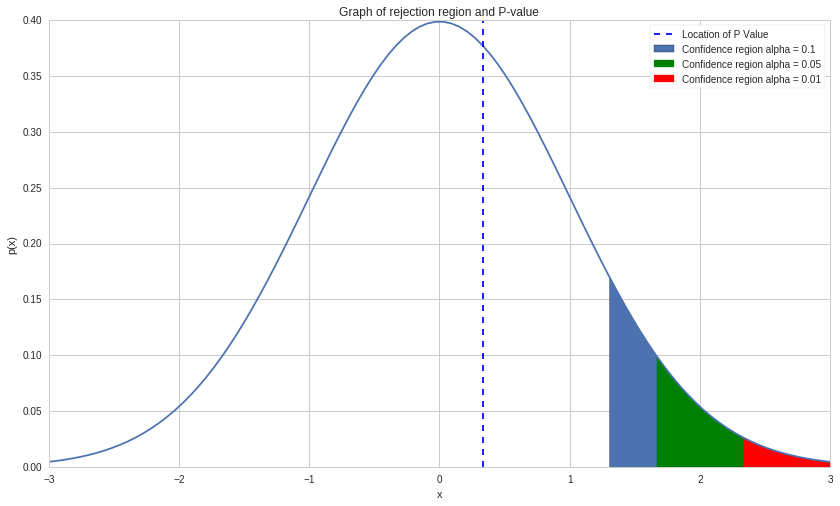
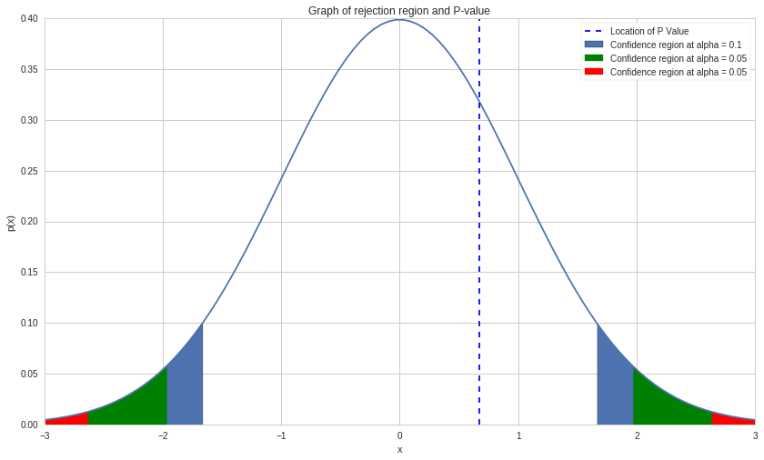
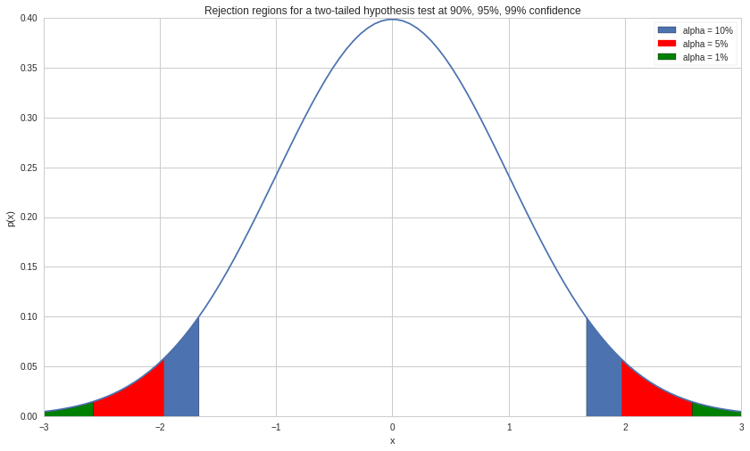

#Exercises: Hypothesis Testing - Answer Key By Christopher van Hoecke
and Maxwell Margenot

Lecture Link
------------

https://www.quantopian.com/lectures/hypothesis-testing

###IMPORTANT NOTE: This lecture corresponds to the Hypothesis Testing
lecture, which is part of the Quantopian lecture series. This homework
expects you to rely heavily on the code presented in the corresponding
lecture. Please copy and paste regularly from that lecture when starting
to work on the problems, as trying to do them from scratch will likely
be too difficult.

When you feel comfortable with the topics presented here, see if you can
create an algorithm that qualifies for the Quantopian Contest.
Participants are evaluated on their ability to produce risk-constrained
alpha and the top 10 contest participants are awarded cash prizes on a
daily basis.

https://www.quantopian.com/contest

Part of the Quantopian Lecture Series:

-  `www.quantopian.com/lectures <https://www.quantopian.com/lectures>`__
-  `github.com/quantopian/research_public <https://github.com/quantopian/research_public>`__

--------------

.. code:: ipython2

    # Useful Libraries
    import pandas as pd
    import numpy as np
    import matplotlib.pyplot as plt
    from scipy.stats import t
    import scipy.stats

Exercise 1: Hypothesis Testing.
===============================

a. One tail test.
-----------------

Using the techniques laid out in lecture, verify if we can state that
the returns of TSLA **are greater** than 0. - Start by stating the null
and alternative hypothesis - Are we dealing with a one or two tailed
test? Why? - Calculate the mean differences, and the Z-test using the
formula provided in class. - *Recall: This is a one parameter test, use
the appropriate Z-test* - Use the stat library to calculate the
associated p value with your t statistic. - Compare your found p-value
to the set :math:`\alpha` value, and conclude.

Useful Formulas:
                

.. math::  \text{Test statistic} =  \frac{\bar{X}*\mu - \theta_0}{s*{\bar{X}}} = \frac{\bar{X}_\mu - 0}{s\sqrt{n}} 

.. code:: ipython2

    prices1 = get_pricing('TSLA', start_date = '2015-01-01', end_date = '2016-01-01', fields = 'price')
    returns_sample_tsla = prices1.pct_change()[1:]
    
    print 'Tesla return sample mean', returns_sample_tsla.mean()
    print 'Tesla return sample standard deviation', returns_sample_tsla.std()
    print 'Tesla return sample size', len(returns_sample_tsla)

.. parsed-literal::

    Tesla return sample mean 0.0006611637458
    Tesla return sample standard deviation 0.024566905352
    Tesla return sample size 251

One tail hypotheses.
                    

-  *Null hypothesis: No difference in average returns in both
   population, the mean*\ **is less**\ *than 0*
-  *Althernative hypothesis: There is a difference in average returns of
   both populations, the mean is*\ **not less**\ *than 0*

.. code:: ipython2

    # Testing
    
    ## Z- Statistic: 
    test_stat = (returns_sample_tsla.mean() - 0) / \
        ( returns_sample_tsla.std() / np.sqrt( len(returns_sample_tsla) ) )
    print 't-statistic is:', test_stat
    
    ## Finding the p-value for one tail test
    p_val = (1 - t.cdf(test_stat, len(returns_sample_tsla) - 1))
    print 'p-value is: ', p_val

.. parsed-literal::

    t-statistic is: 0.426378639576
    p-value is:  0.335099432105

Comparing p-value with different :math:`\alpha` values
                                                      

| With :math:`\alpha = 0.01`, our p-value is greater than our
  :math:`\alpha` value, we thus **fail to reject** the null hypothesis.
| With :math:`\alpha = 0.5`, our p-value is greater than our
  :math:`\alpha` value, we thus **fail to reject** the null hypothesis.
| With :math:`\alpha = 0.1`, our p-value is greater than our
  :math:`\alpha` value, we thus **fail to reject** the null hypothesis.

.. code:: ipython2

    ## Graph for visualization.
    
    x = np.linspace(-3, 3, 100)
    norm_pdf = lambda x: (1/np.sqrt(2 * np.pi)) * np.exp(-x * x / 2)
    y = norm_pdf(x)
    
    fig, ax = plt.subplots(1, 1, sharex=True)
    ax.plot(x, y)
    
    ax.fill_between(x, 0, y, where = x > 1.282, label = 'Confidence region alpha = 0.1')
    ax.fill_between(x, 0, y, where = x > 1.645, label = 'Confidence region alpha = 0.05', color = 'green')
    ax.fill_between(x, 0, y, where = x > 2.326, label = 'Confidence region alpha = 0.01', color = 'red')
    plt.axvline(p_val, linestyle = 'dashed', label = 'Location of P Value')
    
    plt.title('Graph of rejection region and P-value')
    plt.xlabel('x')
    plt.ylabel('p(x)')
    plt.legend();

In the graph above, we can clearly see the rejection region for all
three values of :math:`\alpha` are bellow the found p-value.

b. Two tailed test.
-------------------

Using the techniques laid out in lecture, verify if we can state that
the returns of TSLA are equal to 0.

Two tail hypotheses.
                    

-  *Null hypothesis: No difference in average returns in both
   population, the mean*\ **is**\ *0*
-  *Althernative hypothesis: There is a difference in average returns of
   both populations, the mean*\ **is not**\ *0*

.. code:: ipython2

    ## Finding the p-value for two tailed test. 
    p_val = 2*(1 - t.cdf(test_stat, len(returns_sample_tsla) - 1))
    print 'p-value is: ', p_val

.. parsed-literal::

    p-value is:  0.670198864209

| With :math:`\alpha = 0.01`, our p-value is greater than our
  :math:`\alpha` value, we thus **fail to reject** the null hypothesis.
| With :math:`\alpha = 0.5`, our p-value is greater than our
  :math:`\alpha` value, we thus **fail to reject** the null hypothesis.
| With :math:`\alpha = 0.1`, our p-value is greater than our
  :math:`\alpha` value, we thus **fail to reject** the null hypothesis.

.. code:: ipython2

    x = np.linspace(-3, 3, 100)
    norm_pdf = lambda x: (1/np.sqrt(2 * np.pi)) * np.exp(-x * x / 2)
    y = norm_pdf(x)
    
    fig, ax = plt.subplots(1, 1, sharex=True)
    ax.plot(x, y)
    
    ax.fill_between(x, 0, y, where = x > 1.645, label = 'Confidence region at alpha = 0.1')
    ax.fill_between(x, 0, y, where = x < -1.645)
    
    ax.fill_between(x, 0, y, where = x > 1.96, label = 'Confidence region at alpha = 0.05', color = 'green')
    ax.fill_between(x, 0, y, where = x < -1.96, color = 'green')
    
    ax.fill_between(x, 0, y, where = x > 2.576, label = 'Confidence region at alpha = 0.05', color='red')
    ax.fill_between(x, 0, y, where = x < -2.576, color = 'red')
    plt.axvline(p_val, linestyle = 'dashed', label = 'Location of P Value')
    
    plt.title('Graph of rejection region and P-value')
    plt.xlabel('x')
    plt.ylabel('p(x)')
    plt.legend();

--------------

Exercise 2:
===========

a. Critical Values.
-------------------

Find the critical values associated with :math:`\alpha = 1\%, 5\%, 10\%`
and graph the rejection regions on a plot for a two tailed test.

Useful formula:

.. math::  f = 1 - \frac{\alpha}{2} 

| In order to find the z-value associated with each f value use the
  `z-table <http://www.stat.ufl.edu/~athienit/Tables/Ztable.pdf>`__
  here.
| *You can read more about how to read
  z-tables*\ `here <http://www.dummies.com/education/math/statistics/how-to-find-probabilities-for-z-with-the-z-table/>`__

.. code:: ipython2

    # For alpha = 10%
    alpha = 0.1
    f = 1 - (alpha/2)
    print 'alpha = 10%: f = ', f
    
    # For alpha = 5%
    alpha = 0.05
    f = 1 - (alpha/2)
    print 'alpha = 5%: f = ', f
    
    # For alpha = 1%
    alpha = 0.01
    f = 1 - (alpha/2)
    print 'alpha = 1%: f = ', f

.. parsed-literal::

    alpha = 10%: f =  0.95
    alpha = 5%: f =  0.975
    alpha = 1%: f =  0.995

| Using the z-table above, we find that for
| :math:`\alpha = 10\%`, x = :math:`\pm 1.645`
| :math:`\alpha = 5\%`, x = :math:`\pm 1.96`
| :math:`\alpha = 1\%`, x = :math:`\pm 2.575`

.. code:: ipython2

    # Plot a standard normal distribution and mark the critical regions with shading
    x = np.linspace(-3, 3, 100)
    norm_pdf = lambda x: (1/np.sqrt(2 * np.pi)) * np.exp(-x * x / 2)
    y = norm_pdf(x)
    
    fig, ax = plt.subplots(1, 1, sharex=True)
    ax.plot(x, y)
    
    # Value for alpha = 1%
    ax.fill_between(x, 0, y, where =  x > 1.645, label = 'alpha = 10%')
    ax.fill_between(x, 0, y, where = x < -1.645)
    
    # Value for alpha = 5%
    ax.fill_between(x, 0, y, where = x > 1.96, color = 'red', label = 'alpha = 5%')
    ax.fill_between(x, 0, y, where = x < -1.96, color = 'red')
    
    #Value for alpha = 10%
    ax.fill_between(x, 0, y, where = x > 2.575, facecolor='green', label = 'alpha = 1%')
    ax.fill_between(x, 0, y, where = x < -2.575, facecolor='green')
    
    plt.title('Rejection regions for a two-tailed hypothesis test at 90%, 95%, 99% confidence')
    plt.xlabel('x')
    plt.ylabel('p(x)')
    plt.legend();

b. Mean T-Test
--------------

| Run a T-test on the SPY returns, to determine if the mean returns is
  0.01.
| - Find the two critical values for a 90% two tailed :math:`z`-test -
  Use the formula above to run a t-test on the sample data. - Conclude
  about the test results.

.. code:: ipython2

    # Calculating Critical Values probability
    
    alpha = 0.1
    v = 1 - (alpha/2)
    print v

.. parsed-literal::

    0.95

From the previous question, we find a critical value of 1.645.

.. code:: ipython2

    data = get_pricing('SPY', start_date = '2016-01-01', end_date = '2017-01-01', fields = 'price')
    returns_sample = data.pct_change()[1:]
    
    # Running the T-test.
    n = len(returns_sample)
    test_statistic = ((returns_sample.mean() - 0) /
                    (returns_sample.std()/np.sqrt(n)))
    print 't test statistic: ', test_statistic

.. parsed-literal::

    t test statistic:  1.05168962394

We find that :math:`-1.645 < 1.05 < 1.645`. We thus conclude that we
**fail to reject** our :math:`H_0`

c. Mean p-value test
====================

Given the returns data above, use the p-value to determine the results
of the previous hypothesis test.

.. code:: ipython2

    # Running p-value test. 
    
    alpha = 0.1
    p_val = 2 * (1 - t.cdf(test_statistic, n - 1))
    print 'p-value is: ', p_val
    
    if p_val > alpha: 
        print 'p-value is greater than our significant level, we thus fail to reject the null hypothesis.'
    else: 
        print 'p-value is less than or equal to our significal level, we thus reject the null hypothesis.'

.. parsed-literal::

    p-value is:  0.293957454918
    p-value is greater than our significant level, we thus fail to reject the null hypothesis.

As we can see above, our p-value is greater than our significant level,
:math:`\alpha = 0.1`, we thus **fail to reject** the null hypothesis.

--------------

Exercise 3: Multiple Variables Tests.
=====================================

a. Hypothesis testing on Means.
-------------------------------

-  State the hypothesis tests for comparing two means
-  Find the test statistic along with the degrees of freedom for the
   following two assets. Assume variance is different (We assume XLF to
   be a safer buy than GS.
-  Use the
   `t-table <https://en.wikipedia.org/wiki/Student%27s_t-distribution#Table_of_selected_values>`__
   to conclude about your hypothesis test. *Pick :math:`\alpha = 10\%`*

######Useful Formulas:

.. math::  t = \frac{\bar{X}_1 - \bar{X}_2}{(\frac{s_p^2}{n_1} + \frac{s_p^2}{n_2})^{1/2}}

.. math::  t = \frac{\bar{X}_1 - \bar{X}_2}{(\frac{s_1^2}{n_1} + \frac{s_2^2}{n_2})^{1/2}}

.. math:: df = \frac{(\frac{s_1^2}{n_1} + \frac{s_2^2}{n_2})^2}{(s_1^2/n_1)^2/(n_1-1) + (s_2^2/n_2)^2/(n_2-1)}

*note: one formula for t involves equal variance, the other does not.
Use the right one given the information above*

--------------

Answer:

.. raw:: html

   

Hypothesis Tests when comparing two means:

.. math:: 1. H_0: \mu_1 - \mu_2 = \theta_0, \ H_A: \mu_1 - \mu_2 \neq \theta_0

.. math:: 2. H_0: \mu_1 - \mu_2 \leq \theta_0, \ H_A: \mu_1 - \mu_2 > \theta_0

.. math:: 3. H_0: \mu_1 - \mu_2 \geq \theta_0, \ H_A: \mu_1 - \mu_2 < \theta_0

.. raw:: html

   

.. code:: ipython2

    # Data Collection
    alpha = 0.1
    symbol_list = ['XLF', 'MCD']
    start = '2015-01-01'
    end = '2016-01-01'
    pricing_sample = get_pricing(symbol_list, start_date = start, end_date = end, fields='price')
    pricing_sample.columns = map(lambda x: x.symbol, pricing_sample.columns)
    returns_sample = pricing_sample.pct_change()[1:]
    
    
    # Sample mean values
    mu_xlf, mu_gs = returns_sample.mean()
    s_xlf, s_gs = returns_sample.std()
    n_xlf = len(returns_sample['XLF'])
    n_gs = len(returns_sample['MCD'])
    
    test_statistic = ((mu_xlf - mu_gs) - 0)/((s_xlf**2/n_xlf) + (s_gs**2/n_gs))**0.5
    df = ((s_xlf**2/n_xlf) + (s_gs**2/n_gs))**2/ \
         (((s_xlf**2 / n_xlf)**2 /(n_xlf-1))+((s_gs**2 / n_gs)**2/(n_gs-1)))
    
    print 't test statistic: ', test_statistic
    print 'Degrees of freedom (modified): ', df
    print 'p-value: ', 2 * (1 - t.cdf(test_statistic, df))

.. parsed-literal::

    t test statistic:  -1.12060529448
    Degrees of freedom (modified):  496.271031856
    p-value:  1.73700210188

With a confidence level of 90%, our test statistic belongs to the range
-1.645, 1.645. Since our test statistic is above these values we
**accept** the null hypothesis and determine that the difference between
XLF and MCD returns **is** significantly different from :math:`0`.

b. Hypothesis Testing on Variances.
-----------------------------------

-  State the hypothesis tests for comparing two means.
-  Calculate the returns and compare their variances.
-  Calculate the F-test using the variances
-  Check that both values have the same degrees of freedom.

Answer:

.. math:: 1. H_0: \sigma_1^2 = \sigma_2^2, \ H_A: \sigma_1^2 \neq \sigma_2^2

.. math:: 2. H_0: \sigma_1^2 \leq \sigma_2^2, \ H_A: \sigma_1^2 > \sigma_2^2

.. math:: 3. H_0: \sigma_1^2 \geq \sigma_2^2, \ H_A: \sigma_1^2 < \sigma_2^2

.. code:: ipython2

    # Data
    symbol_list = ['XLF', 'MCD']
    start = "2015-01-01"
    end = "2016-01-01"
    pricing_sample = get_pricing(symbol_list, start_date = start, end_date = end, fields = 'price')
    pricing_sample.columns = map(lambda x: x.symbol, pricing_sample.columns)
    returns_sample = pricing_sample.pct_change()[1:]
    
    # Take returns from above, MCD and XLF, and compare their variances
    xlf_std_dev, mcd_std_dev = returns_sample.std()
    print 'XLF standard deviation is: ', xlf_std_dev
    print 'MCD standard deviation is: ', mcd_std_dev
    
    # Calculate F-test with MCD.std > XLF.std
    test_statistic = (mcd_std_dev / xlf_std_dev)**2
    print "F Test statistic: ", test_statistic
    
    #degree of freedom 
    df1 = len(returns_sample['XLF']) - 1
    df2 = len(returns_sample['MCD']) - 1
    print df1
    print df2
    
    # Calculate critical values. 
    from scipy.stats import f
    upper_crit_value = f.ppf(0.975, df1, df2)
    lower_crit_value = f.ppf(0.025, df1, df2)
    print 'Upper critical value at a = 0.05 with df1 = {0} and df2 = {1}: '.format(df1, df2), upper_crit_value
    print 'Lower critical value at a = 0.05 with df1 = {0} and df2 = {1}: '.format(df1, df2), lower_crit_value

.. parsed-literal::

    XLF standard deviation is:  0.0110764148949
    MCD standard deviation is:  0.0120820314786
    F Test statistic:  1.18982063302
    250
    250
    Upper critical value at a = 0.05 with df1 = 250 and df2 = 250:  1.28208064948
    Lower critical value at a = 0.05 with df1 = 250 and df2 = 250:  0.779982133263

We can see that our F-test statistic is bellow the Upper Critical Value,
thus we **accept** the null hypothesis and **reject** the alternative
and conclude that the variances of XLF and MCD indeed do **not** differ.

--------------

Congratulations on completing the Hypothesis Testing answer key!

As you learn more about writing trading models and the Quantopian
platform, enter the daily `Quantopian
Contest <https://www.quantopian.com/contest>`__. Your strategy will be
evaluated for a cash prize every day.

Start by going through the `Writing a Contest
Algorithm <https://www.quantopian.com/tutorials/contest>`__ tutorial.

*This presentation is for informational purposes only and does not
constitute an offer to sell, a solicitation to buy, or a recommendation
for any security; nor does it constitute an offer to provide investment
advisory or other services by Quantopian, Inc. (“Quantopian”). Nothing
contained herein constitutes investment advice or offers any opinion
with respect to the suitability of any security, and any views expressed
herein should not be taken as advice to buy, sell, or hold any security
or as an endorsement of any security or company. In preparing the
information contained herein, Quantopian, Inc. has not taken into
account the investment needs, objectives, and financial circumstances of
any particular investor. Any views expressed and data illustrated herein
were prepared based upon information, believed to be reliable, available
to Quantopian, Inc. at the time of publication. Quantopian makes no
guarantees as to their accuracy or completeness. All information is
subject to change and may quickly become unreliable for various reasons,
including changes in market conditions or economic circumstances.*
