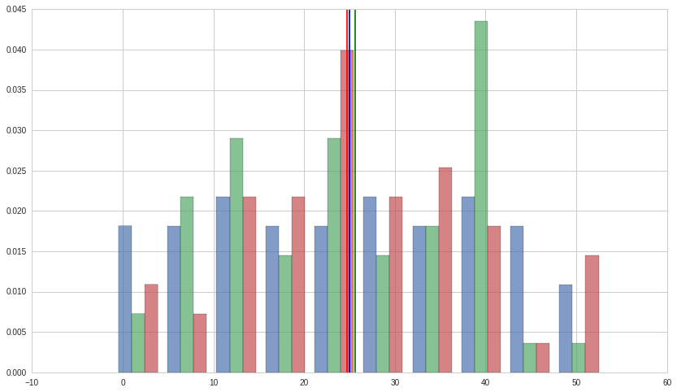
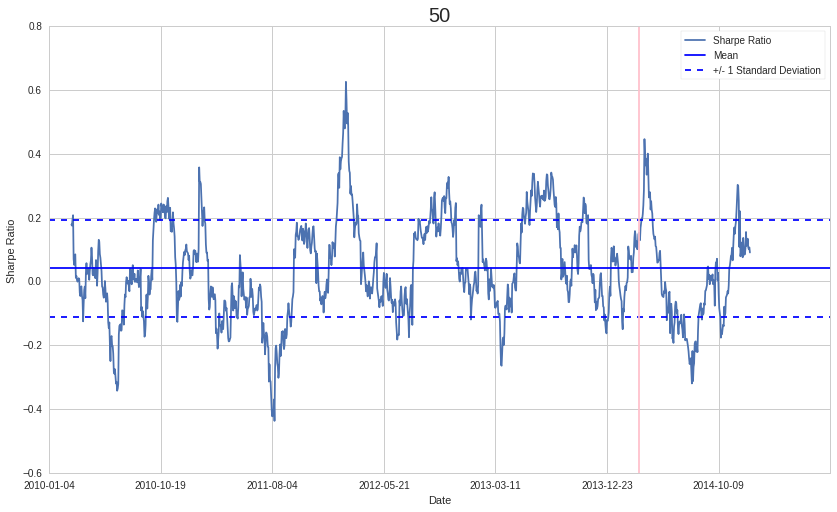
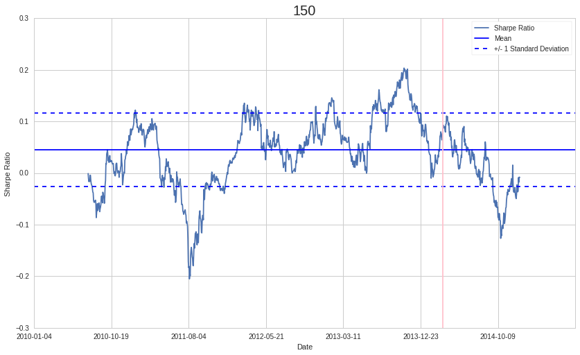
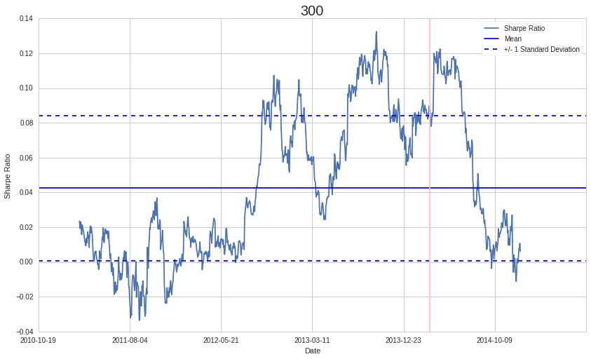
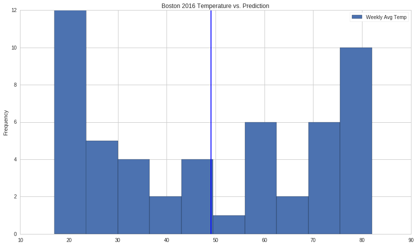
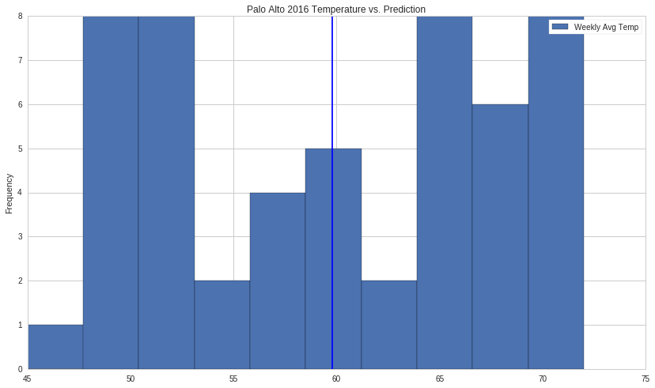

Exercises: Instability of Parameter Estimates - Answer Key
==========================================================

Lecture Link
------------

This exercise notebook refers to this lecture. Please use the lecture
for explanations and sample code.

https://www.quantopian.com/lectures#Instability-of-Estimates

Part of the Quantopian Lecture Series:

-  `www.quantopian.com/lectures <https://www.quantopian.com/lectures>`__
-  `github.com/quantopian/research_public <https://github.com/quantopian/research_public>`__

.. code:: ipython2

    import numpy as np
    import matplotlib.pyplot as plt
    import pandas as pd
    from statsmodels.stats.stattools import jarque_bera
    
    # Set a seed so we can play with the data without generating new random numbers every time
    np.random.seed(321)

Exercise 1: Sample Size vs. Standard Deviation
==============================================

Using the below normal distribution with mean 100 and standard deviation
50, find the means and standard deviations of samples of size 5, 25,
100, and 500.

.. code:: ipython2

    POPULATION_MU = 100
    POPULATION_SIGMA = 25
    sample_sizes = [5, 25, 100, 500]
    
    #Your code goes here
    
    for i in range(len(sample_sizes)):
        sample = np.random.normal(POPULATION_MU, POPULATION_SIGMA, sample_sizes[i])
        row = 'Mean',(i+1),':', np.mean(sample),'Std',(i+1),':',np.std(sample)
        print ("{} {}{} {:<10f}    {} {}{} {}").format(*row)
        
    print "\nAs sample size increases, the mean and standard deviation approach those of the population. However, even at the 500 sample level the sample mean is not the same as the population mean."

.. parsed-literal::

    Mean 1: 99.089982     Std 1: 24.4641171659
    Mean 2: 94.706474     Std 2: 20.1246310051
    Mean 3: 100.107503    Std 3: 24.6748889015
    Mean 4: 100.661661    Std 4: 24.6649605309
    
    As sample size increases, the mean and standard deviation approach those of the population. However, even at the 500 sample level the sample mean is not the same as the population mean.

Exercise 2: Instability of Predictions on Mean Alone
====================================================

a. Finding Means
----------------

Find the means of the following three data sets :math:`X`, :math:`Y`,
and :math:`Z`.

.. code:: ipython2

    X = [ 31.,   6.,  21.,  32.,  41.,   4.,  48.,  38.,  43.,  36.,  50., 20.,  46.,  33.,   8.,  27.,  17.,  44.,  16.,  39.,   3.,  37.,
            35.,  13.,  49.,   2.,  18.,  42.,  22.,  25.,  15.,  24.,  11., 19.,   5.,  40.,  12.,  10.,   1.,  45.,  26.,  29.,   7.,  30.,
            14.,  23.,  28.,   0.,  34.,   9.,  47.]
    Y = [ 15.,  41.,  33.,  29.,   3.,  28.,  28.,   8.,  15.,  22.,  39., 38.,  22.,  10.,  39.,  40.,  24.,  15.,  21.,  25.,  17.,  33.,
            40.,  32.,  42.,   5.,  39.,   8.,  15.,  25.,  37.,  33.,  14., 25.,   1.,  31.,  45.,   5.,   6.,  19.,  13.,  39.,  18.,  49.,
            13.,  38.,   8.,  25.,  32.,  40.,  17.]
    Z = [ 38.,  23.,  16.,  35.,  48.,  18.,  48.,  38.,  24.,  27.,  24., 35.,  37.,  28.,  11.,  12.,  31.,  -1.,   9.,  19.,  20.,   0.,
            23.,  33.,  34.,  24.,  14.,  28.,  12.,  25.,  53.,  19.,  42., 21.,  15.,  36.,  47.,  20.,  26.,  41.,  33.,  50.,  26.,  22.,
            -1.,  35.,  10.,  25.,  23.,  24.,   6.]
    
    #Your code goes here
    
    print "Mean X: %.2f"% np.mean(X)
    print "Mean Y: %.2f"% np.mean(Y)
    print "Mean Z: %.2f"% np.mean(Z)

.. parsed-literal::

    Mean X: 25.00
    Mean Y: 24.69
    Mean Z: 25.61

b. Checking for Normality
-------------------------

Use the ``jarque_bera`` function to conduct a Jarque-Bera test on
:math:`X`, :math:`Y`, and :math:`Z` to determine whether their
distributions are normal.

.. code:: ipython2

    #Your code goes here
    
    Xp = jarque_bera(X)[1]
    Yp = jarque_bera(Y)[1]
    Zp = jarque_bera(Z)[1]
    
    print Xp, Yp, Zp
    
    if Xp < 0.05:
        print 'The distribution of X is likely normal.'
    else:
        print 'The distribution of X is likely not normal.'
        
    if Yp < 0.05:
        print 'The distribution of Y is likely normal.'
    else:
        print 'The distribution of Y is likely not normal.'
        
    if Zp < 0.05:
        print 'The distribution of Z is likely normal.'
    else:
        print 'The distribution of Z is likely not normal.'

.. parsed-literal::

    0.216026379492 0.25028131217 0.866907001763
    The distribution of X is likely not normal.
    The distribution of Y is likely not normal.
    The distribution of Z is likely not normal.

c. Instability of Estimates
---------------------------

Create a histogram of the sample distributions of :math:`X`, :math:`Y`,
and :math:`Z` along with the best estimate/mean based on the sample.

.. code:: ipython2

    #Your code goes here
    
    plt.hist([X, Y, Z], normed=1, histtype='bar', stacked=False, alpha = 0.7);
    plt.axvline(np.mean(X));
    plt.axvline(np.mean(Y), c='r');
    plt.axvline(np.mean(Z), c='g');
    
    print "All three datasets have a similar mean, but have very different distributions. Mean alone is very non-informative about what is going on in data, and should not be used alone as an estimator." 

.. parsed-literal::

    All three datasets have a similar mean, but have very different distributions. Mean alone is very non-informative about what is going on in data, and should not be used alone as an estimator.

Exercise 3: Sharpe Ratio Window Adjustment
==========================================

a. Effect on Variability
------------------------

Just as in the lecture, find the mean and standard deviation of the
running sharpe ratio for THO, this time testing for multiple window
lengths: 300, 150, and 50. Restrict your mean and standard deviation
calculation to pricing data up to 200 days away from the end.

.. code:: ipython2

    def sharpe_ratio(asset, riskfree):
        return np.mean(asset - riskfree)/np.std(asset - riskfree)
    
    start = '2010-01-01'
    end = '2015-01-01'
    
    treasury_ret = get_pricing('BIL', fields='price', start_date=start, end_date=end).pct_change()[1:]
    pricing = get_pricing('THO', fields='price', start_date=start, end_date=end)
    returns = pricing.pct_change()[1:]
    
    #Your code goes here
    
    for window in [50, 150, 300]:
        running_sharpe = [sharpe_ratio(returns[i-window+10:i], treasury_ret[i-window+10:i]) for i in range(window-10, len(returns))]
        mean_rs = np.mean(running_sharpe[:-200])
        std_rs = np.std(running_sharpe[:-200])
        
        row = 'Sharpe Mean',(window),':', mean_rs,'Std', window,':',std_rs
        print ("{} {:>3}{} {:<11f}    {:>5} {:>3}{} {}").format(*row)
        
    print "As we increase the length of the window, the variability of the running sharpe ratio decreases." 

.. parsed-literal::

    Sharpe Mean  50: 0.041578         Std  50: 0.152672986316
    Sharpe Mean 150: 0.045063         Std 150: 0.0708117281461
    Sharpe Mean 300: 0.042417         Std 300: 0.041788831424
    As we increase the length of the window, the variability of the running sharpe ratio decreases.

b. Out-of-Sample Instability
----------------------------

Plot the running sharpe ratio of all three window lengths, as well as
their in-sample mean and standard deviation bars.

.. code:: ipython2

    #Your code goes here
    
    for window in [50, 150, 300]:
        running_sharpe = [sharpe_ratio(returns[i-window+10:i], treasury_ret[i-window+10:i]) for i in range(window-10, len(returns))]
        mean_rs = np.mean(running_sharpe[:-200])
        std_rs = np.std(running_sharpe[:-200])
        
        _, ax2 = plt.subplots()
        
        ax2.plot(range(window-10, len(returns)), running_sharpe)
        ticks = ax2.get_xticks()
    
        ax2.set_xticklabels([pricing.index[i].date() for i in ticks[:-1]])
        
        ax2.axhline(mean_rs)
        ax2.axhline(mean_rs + std_rs, linestyle='--')
        ax2.axhline(mean_rs - std_rs, linestyle='--')
        
        ax2.axvline(len(returns) - 200, color='pink');
        plt.title(window, fontsize = 20)
        plt.xlabel('Date')
        plt.ylabel('Sharpe Ratio')
        plt.legend(['Sharpe Ratio', 'Mean', '+/- 1 Standard Deviation'])
    
        
    print "Despite the longer window Sharpe ratios having less variability, they are still unpredictable with repect to just the mean. But within the context of the standard deviation the mean has more predictive value, as we see that even in the out-of-sample periods the ratios of all window lengths stay mainly within 1 standard deviation of the mean."

.. parsed-literal::

    /usr/local/lib/python2.7/dist-packages/pandas/tseries/base.py:192: VisibleDeprecationWarning: using a non-integer number instead of an integer will result in an error in the future
      val = getitem(key)

.. parsed-literal::

    Despite the longer window Sharpe ratios having less variability, they are still unpredictable with repect to just the mean. But within the context of the standard deviation the mean has more predictive value, as we see that even in the out-of-sample periods the ratios of all window lengths stay mainly within 1 standard deviation of the mean.

Exercise 4: Weather
===================

a. Temperature in Boston
------------------------

Find the mean and standard deviation of Boston weekly average
temperature data for the year of 2015 stored in ``b15_df``.

.. code:: ipython2

    b15_df = pd.DataFrame([ 29.,  22.,  19.,  17.,  19.,  19.,  15.,  16.,  18.,  25.,  21.,
            25.,  29.,  27.,  36.,  38.,  40.,  44.,  49.,  50.,  58.,  61.,
            67.,  69.,  74.,  72.,  76.,  81.,  81.,  80.,  83.,  82.,  80.,
            79.,  79.,  80.,  74.,  72.,  68.,  68.,  65.,  61.,  57.,  50.,
            46.,  42.,  41.,  35.,  30.,  27.,  28.,  28.],
            columns = ['Weekly Avg Temp'],
            index = pd.date_range('1/1/2012', periods=52, freq='W')          )
    
    #Your code goes here
    
    b15_mean = np.mean(b15_df['Weekly Avg Temp'])
    b15_std = np.std(b15_df['Weekly Avg Temp'])
    
    print "Boston Weekly Temp Mean: ", b15_mean
    print "Boston Weekly Temp Std:  ", b15_std

.. parsed-literal::

    Boston Weekly Temp Mean:  49.0769230769
    Boston Weekly Temp Std:   22.983979499

b. Temperature in Palo Alto
---------------------------

Find the mean and standard deviation of Palo Alto weekly average
temperature data for the year of 2015 stored in ``p15_df``.

.. code:: ipython2

    p15_df = pd.DataFrame([ 49.,  53.,  51.,  47.,  50.,  46.,  49.,  51.,  49.,  45.,  52.,
            54.,  54.,  55.,  55.,  57.,  56.,  56.,  57.,  63.,  63.,  65.,
            65.,  69.,  67.,  70.,  67.,  67.,  68.,  68.,  70.,  72.,  72.,
            70.,  72.,  70.,  66.,  66.,  68.,  68.,  65.,  66.,  62.,  61.,
            63.,  57.,  55.,  55.,  55.,  55.,  55.,  48.],
            columns = ['Weekly Avg Temp'],
            index = pd.date_range('1/1/2012', periods=52, freq='W'))
    
    #Your code goes here
    
    p15_mean = np.mean(p15_df['Weekly Avg Temp'])
    p15_std = np.std(p15_df['Weekly Avg Temp'])
    
    print "Palo Alto Weekly Temp Mean: ", p15_mean
    print "Palo Alto Weekly Temp Std:  ", p15_std

.. parsed-literal::

    Palo Alto Weekly Temp Mean:  59.7884615385
    Palo Alto Weekly Temp Std:   7.97432548018

c. Predicting 2016 Temperatures
-------------------------------

Use the means you found in parts a and b to attempt to predict 2016
temperature data for both cities. Do this by creating two histograms for
the 2016 temperature data in ``b16_df`` and ``p16_df`` with a vertical
line where the 2015 means were to represent your prediction.

.. code:: ipython2

    b16_df = pd.DataFrame([ 26.,  22.,  20.,  19.,  18.,  19.,  17.,  17.,  19.,  20.,  23., 22.,  28.,  28.,  35.,  38.,  42.,  47.,  49.,  56.,  59.,  61.,
            61.,  70.,  73.,  73.,  73.,  77.,  78.,  82.,  80.,  80.,  81., 78.,  82.,  78.,  76.,  71.,  69.,  66.,  60.,  63.,  56.,  50.,
            44.,  43.,  34.,  33.,  31.,  28.,  27.,  20.],
            columns = ['Weekly Avg Temp'],
            index = pd.date_range('1/1/2012', periods=52, freq='W'))
    
    p16_df = pd.DataFrame([ 50.,  50.,  51.,  48.,  48.,  49.,  50.,  45.,  52.,  50.,  51., 52.,  50.,  56.,  58.,  55.,  61.,  56.,  61.,  62.,  62.,  64.,
            64.,  69.,  71.,  66.,  69.,  70.,  68.,  71.,  70.,  69.,  72., 71.,  66.,  69.,  70.,  70.,  66.,  67.,  64.,  64.,  65.,  61.,
            61.,  59.,  56.,  53.,  55.,  52.,  52.,  51.],
            columns = ['Weekly Avg Temp'],
            index = pd.date_range('1/1/2012', periods=52, freq='W'))
    
    #Your code goes here
    
    b16_df.plot.hist(title = "Boston 2016 Temperature vs. Prediction");
    plt.axvline(b15_mean);
    
    p16_df.plot.hist(title = "Palo Alto 2016 Temperature vs. Prediction");
    plt.axvline(p15_mean);
    
    b_avg_error = np.mean(abs(b16_df['Weekly Avg Temp'] - b15_mean))
    p_avg_error = np.mean(abs(p16_df['Weekly Avg Temp'] - p15_mean))
    
    print "Avg of Absolute Value of Prediction Error in Boston:", b_avg_error
    print "Avg of Absolute Value of Prediction Error in Palo Alto:", p_avg_error
    
    print "\nWe know from parts a and b that the weather in Boston is much more variable than that of Palo Alto. As a result, we can predict that an estimate based on a sample mean in Boston will be less accurate than an estimate based on a sample from Palo Alto, which is confirmed by this test. The Palo Alto predictions had a much lower error than those of Boston. With mean alone we would not have been able to make any conclusions about the accuracy of our predictions."

.. parsed-literal::

    Avg of Absolute Value of Prediction Error in Boston: 20.8106508876
    Avg of Absolute Value of Prediction Error in Palo Alto: 7.20857988166
    
    We know from parts a and b that the weather in Boston is much more variable than that of Palo Alto. As a result, we can predict that an estimate based on a sample mean in Boston will be less accurate than an estimate based on a sample from Palo Alto, which is confirmed by this test. The Palo Alto predictions had a much lower error than those of Boston. With mean alone we would not have been able to make any conclusions about the accuracy of our predictions.

--------------

Congratulations on completing the instability of parameter estimates
exercises!

As you learn more about writing trading models and the Quantopian
platform, enter a daily `Quantopian
Contest <https://www.quantopian.com/contest>`__. Your strategy will be
evaluated for a cash prize every day.

Start by going through the `Writing a Contest
Algorithm <https://www.quantopian.com/tutorials/contest>`__ tutorial.

*This presentation is for informational purposes only and does not
constitute an offer to sell, a solic itation to buy, or a recommendation
for any security; nor does it constitute an offer to provide investment
advisory or other services by Quantopian, Inc. (“Quantopian”). Nothing
contained herein constitutes investment advice or offers any opinion
with respect to the suitability of any security, and any views expressed
herein should not be taken as advice to buy, sell, or hold any security
or as an endorsement of any security or company. In preparing the
information contained herein, Quantopian, Inc. has not taken into
account the investment needs, objectives, and financial circumstances of
any particular investor. Any views expressed and data illustrated herein
were prepared based upon information, believed to be reliable, available
to Quantopian, Inc. at the time of publication. Quantopian makes no
guarantees as to their accuracy or completeness. All information is
subject to change and may quickly become unreliable for various reasons,
including changes in market conditions or economic circumstances.*
