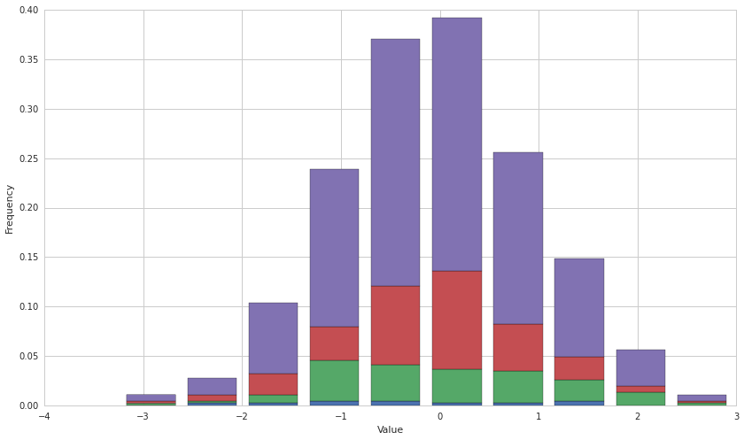
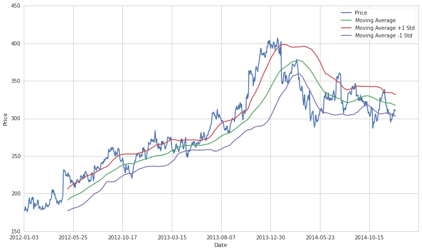

#Instability of Parameter Estimates

By Evgenia “Jenny” Nitishinskaya and Delaney Granizo-Mackenzie.
Algorithms by David Edwards.

Part of the Quantopian Lecture Series:

-  `www.quantopian.com/lectures <https://www.quantopian.com/lectures>`__
-  `github.com/quantopian/research_public <https://github.com/quantopian/research_public>`__

--------------

Parameters
==========

A parameter is anything that a model uses to constrain its predictions.
Commonly, a parameter is a quantity that helps to describe a data set or
a distribution. For example, the mean of a normal distribution is a
parameter; in fact, we say that a normal distribution is parametrized by
its mean and variance. If we take the mean of a set of samples drawn
from the normal distribution, we get an estimate of the mean of the
distribution. Similarly, the mean of a set of observations is an
estimate of the parameter of the underlying distribution (which is often
assumed to be normal). Other parameters include the median, the
correlation coefficient to another series, the standard deviation, and
every other measurement of a data set.

##You Never Know, You Only Estimate

When you take the mean of a data set, you do not know the mean. You have
estimated the mean as best you can from the data you have. The estimate
can be off. This is true of any parameter you estimate. To actually
understand what is going on you need to determine how good your estimate
is by looking at its stability/standard error/confidence intervals.

Instability of estimates
========================

Whenever we consider a set of observations, our calculation of a
parameter can only be an estimate. It will change as we take more
measurements or as time passes and we get new observations. We can
quantify the uncertainty in our estimate by looking at how the parameter
changes as we look at different subsets of the data. For instance,
standard deviation describes how different the mean of a set is from the
mean of each observation, that is, from each observation itself. In
financial applications, data often comes in time series. In this case,
we can estimate a parameter at different points in time; say, for the
previous 30 days. By looking at how much this moving estimate fluctuates
as we change our time window, we can compute the instability of the
estimated parameter.

.. code:: ipython2

    # We'll be doing some examples, so let's import the libraries we'll need
    import numpy as np
    import matplotlib.pyplot as plt
    import pandas as pd

Example: mean and standard deviation
====================================

First, let’s take a look at some samples from a normal distribution. We
know that the mean of the distribution is 0 and the standard deviation
is 1; but if we measure the parameters from our observations, we will
get only approximately 0 and approximately 1. We can see how these
estimates change as we take more and more samples:

.. code:: ipython2

    # Set a seed so we can play with the data without generating new random numbers every time
    np.random.seed(123)
    
    normal = np.random.randn(500)
    print np.mean(normal[:10])
    print np.mean(normal[:100])
    print np.mean(normal[:250])
    print np.mean(normal)
    
    # Plot a stacked histogram of the data
    plt.hist([normal[:10], normal[10:100], normal[100:250], normal], normed=1, histtype='bar', stacked=True);
    plt.ylabel('Frequency')
    plt.xlabel('Value');

.. parsed-literal::

    -0.269516110326
    0.0271090734904
    -0.0206160591117
    -0.0386439735132

.. code:: ipython2

    print np.std(normal[:10])
    print np.std(normal[:100])
    print np.std(normal[:250])
    print np.std(normal)

.. parsed-literal::

    1.2363048015
    1.12824047048
    1.01746043683
    1.00320285616

Notice that, although the probability of getting closer to 0 and 1 for
the mean and standard deviation, respectively, increases with the number
of samples, we do not always get better estimates by taking more data
points. Whatever our expectation is, we can always get a different
result, and our goal is often to compute the probability that the result
is significantly different than expected.

With time series data, we usually care only about contiguous subsets of
the data. The moving average (also called running or rolling) assigns
the mean of the previous :math:`n` data points to each point in time.
Below, we compute the 90-day moving average of a stock price and plot it
to see how it changes. There is no result in the beginning because we
first have to accumulate at least 90 days of data.

##Example: Non-Normal Underlying Distribution

What happens if the underlying data isn’t normal? A mean will be very
deceptive. Because of this it’s important to test for normality of your
data. We’ll use a Jarque-Bera test as an example.

.. code:: ipython2

    #Generate some data from a bi-modal distribution
    def bimodal(n):
        X = np.zeros((n))
        for i in range(n):
            if np.random.binomial(1, 0.5) == 0:
                X[i] = np.random.normal(-5, 1)
            else:
                X[i] =  np.random.normal(5, 1)
        return X
                
    X = bimodal(1000)
    
    #Let's see how it looks
    plt.hist(X, bins=50)
    plt.ylabel('Frequency')
    plt.xlabel('Value')
    print 'mean:', np.mean(X)
    print 'standard deviation:', np.std(X)

.. parsed-literal::

    mean: 0.00984758128215
    standard deviation: 5.06070874011

.. image:: notebook_files/notebook_9_1.png

Sure enough, the mean is incredibly non-informative about what is going
on in the data. We have collapsed all of our data into a single
estimate, and lost of a lot of information doing so. This is what the
distribution should look like if our hypothesis that it is normally
distributed is correct.

.. code:: ipython2

    mu = np.mean(X)
    sigma = np.std(X)
    
    N = np.random.normal(mu, sigma, 1000)
    
    plt.hist(N, bins=50)
    plt.ylabel('Frequency')
    plt.xlabel('Value');

.. image:: notebook_files/notebook_11_0.png

We’ll test our data using the Jarque-Bera test to see if it’s normal. A
significant p-value indicates non-normality.

.. code:: ipython2

    from statsmodels.stats.stattools import jarque_bera
    
    jarque_bera(X)

.. parsed-literal::

    (142.12550136207705,
     1.3735343038981241e-31,
     -0.007644415681800421,
     1.1531707484649847)

Sure enough the value is < 0.05 and we say that X is not normal. This
saves us from accidentally making horrible predictions.

Example: Sharpe ratio
=====================

One statistic often used to describe the performance of assets and
portfolios is the Sharpe ratio, which measures the additional return per
unit additional risk achieved by a portfolio, relative to a risk-free
source of return such as Treasury bills:

.. math:: R = \frac{E[r_a - r_b]}{\sqrt{Var(r_a - r_b)}}

where :math:`r_a` is the returns on our asset and :math:`r_b` is the
risk-free rate of return. As with mean and standard deviation, we can
compute a rolling Sharpe ratio to see how our estimate changes through
time.

.. code:: ipython2

    def sharpe_ratio(asset, riskfree):
        return np.mean(asset - riskfree)/np.std(asset - riskfree)
    
    start = '2012-01-01'
    end = '2015-01-01'
    # Use an ETF that tracks 3-month T-bills as our risk-free rate of return
    treasury_ret = get_pricing('BIL', fields='price', start_date=start, end_date=end).pct_change()[1:]
    pricing = get_pricing('AMZN', fields='price', start_date=start, end_date=end)
    returns = pricing.pct_change()[1:] # Get the returns on the asset
    
    # Compute the running Sharpe ratio
    running_sharpe = [sharpe_ratio(returns[i-90:i], treasury_ret[i-90:i]) for i in range(90, len(returns))]
    
    # Plot running Sharpe ratio up to 100 days before the end of the data set
    _, ax1 = plt.subplots()
    ax1.plot(range(90, len(returns)-100), running_sharpe[:-100]);
    ticks = ax1.get_xticks()
    ax1.set_xticklabels([pricing.index[i].date() for i in ticks[:-1]]) # Label x-axis with dates
    plt.xlabel('Date')
    plt.ylabel('Sharpe Ratio');

.. image:: notebook_files/notebook_16_0.png

The Sharpe ratio looks rather volatile, and it’s clear that just
reporting it as a single value will not be very helpful for predicting
future values. Instead, we can compute the mean and standard deviation
of the data above, and then see if it helps us predict the Sharpe ratio
for the next 100 days.

.. code:: ipython2

    # Compute the mean and std of the running Sharpe ratios up to 100 days before the end
    mean_rs = np.mean(running_sharpe[:-100])
    std_rs = np.std(running_sharpe[:-100])
    
    # Plot running Sharpe ratio
    _, ax2 = plt.subplots()
    ax2.set_xticklabels([pricing.index[i].date() for i in ticks[:-1]]) # Label x-axis with dates
    ax2.plot(range(90, len(returns)), running_sharpe)
    
    # Plot its mean and the +/- 1 standard deviation lines
    ax2.axhline(mean_rs)
    ax2.axhline(mean_rs + std_rs, linestyle='--')
    ax2.axhline(mean_rs - std_rs, linestyle='--')
    
    # Indicate where we computed the mean and standard deviations
    # Everything after this is 'out of sample' which we are comparing with the estimated mean and std
    ax2.axvline(len(returns) - 100, color='pink');
    plt.xlabel('Date')
    plt.ylabel('Sharpe Ratio')
    plt.legend(['Sharpe Ratio', 'Mean', '+/- 1 Standard Deviation'])
    
    print 'Mean of running Sharpe ratio:', mean_rs
    print 'std of running Sharpe ratio:', std_rs

.. parsed-literal::

    Mean of running Sharpe ratio: 0.0646215053325
    std of running Sharpe ratio: 0.0778015776531

.. image:: notebook_files/notebook_18_1.png

The standard deviation in this case is about a quarter of the range, so
this data is extremely volatile. Taking this into account when looking
ahead gave a better prediction than just using the mean, although we
still observed data more than one standard deviation away. We could also
compute the rolling mean of the Sharpe ratio to try and follow trends;
but in that case, too, we should keep in mind the standard deviation.

##Example: Moving Average

Let’s say you take the average with a lookback window; how would you
determine the standard error on that estimate? Let’s start with an
example showing a 90-day moving average.

.. code:: ipython2

    # Load time series of prices
    start = '2012-01-01'
    end = '2015-01-01'
    pricing = get_pricing('AMZN', fields='price', start_date=start, end_date=end)
    
    # Compute the rolling mean for each day
    mu = pd.rolling_mean(pricing, window=90)
    
    # Plot pricing data
    _, ax1 = plt.subplots()
    ax1.plot(pricing) 
    ticks = ax1.get_xticks()
    ax1.set_xticklabels([pricing.index[i].date() for i in ticks[:-1]]) # Label x-axis with dates
    plt.ylabel('Price')
    plt.xlabel('Date')
    
    # Plot rolling mean
    ax1.plot(mu);
    plt.legend(['Price','Rolling Average']);

.. image:: notebook_files/notebook_21_0.png

This lets us see the instability/standard error of the mean, and helps
anticipate future variability in the data. We can quantify this
variability by computing the mean and standard deviation of the rolling
mean.

.. code:: ipython2

    print 'Mean of rolling mean:', np.mean(mu)
    print 'std of rolling mean:', np.std(mu)

.. parsed-literal::

    Mean of rolling mean: 288.399003348
    std of rolling mean: 51.1188097398

In fact, the standard deviation, which we use to quantify variability,
is itself variable. Below we plot the rolling standard deviation (for a
90-day window), and compute its mean and standard deviation.

.. code:: ipython2

    # Compute rolling standard deviation
    std = pd.rolling_std(pricing, window=90)
    
    # Plot rolling std
    _, ax2 = plt.subplots()
    ax2.plot(std)
    ax2.set_xticklabels([pricing.index[i].date() for i in ticks[:-1]]) # Label x-axis with dates
    plt.ylabel('Standard Deviation of Moving Average')
    plt.xlabel('Date')
    
    print 'Mean of rolling std:', np.mean(std)
    print 'std of rolling std:', np.std(std)

.. parsed-literal::

    Mean of rolling std: 17.3969897999
    std of rolling std: 7.54619079684

.. image:: notebook_files/notebook_25_1.png

To see what this changing standard deviation means for our data set,
let’s plot the data again along with the Bollinger bands: the rolling
mean, one rolling standard deviation (of the data) above the mean, and
one standard deviation below.

Note that although standard deviations give us more information about
the spread of the data, we cannot assign precise probabilities to our
expectations for future observations without assuming a particular
distribution for the underlying process.

.. code:: ipython2

    # Plot original data
    _, ax3 = plt.subplots()
    ax3.plot(pricing)
    ax3.set_xticklabels([pricing.index[i].date() for i in ticks[:-1]]) # Label x-axis with dates
    
    # Plot Bollinger bands
    ax3.plot(mu)
    ax3.plot(mu + std)
    ax3.plot(mu - std);
    plt.ylabel('Price')
    plt.xlabel('Date')
    plt.legend(['Price', 'Moving Average', 'Moving Average +1 Std', 'Moving Average -1 Std'])

.. parsed-literal::

    <matplotlib.legend.Legend at 0x7fb6c290cd50>

Conclusion
==========

Whenever we compute a parameter for a data set, we should also compute
its volatility. Otherwise, we do not know whether or not we should
expect new data points to be aligned with this parameter. A good way of
computing volatility is dividing the data into subsets and estimating
the parameter from each one, then finding the variability among the
results. There may still be outside factors which are introduced after
our sample period and which we cannot predict. However, the instability
analysis and testing for standard error is still very useful for telling
us how much we should distrust our estimates.

*This presentation is for informational purposes only and does not
constitute an offer to sell, a solicitation to buy, or a recommendation
for any security; nor does it constitute an offer to provide investment
advisory or other services by Quantopian, Inc. (“Quantopian”). Nothing
contained herein constitutes investment advice or offers any opinion
with respect to the suitability of any security, and any views expressed
herein should not be taken as advice to buy, sell, or hold any security
or as an endorsement of any security or company. In preparing the
information contained herein, Quantopian, Inc. has not taken into
account the investment needs, objectives, and financial circumstances of
any particular investor. Any views expressed and data illustrated herein
were prepared based upon information, believed to be reliable, available
to Quantopian, Inc. at the time of publication. Quantopian makes no
guarantees as to their accuracy or completeness. All information is
subject to change and may quickly become unreliable for various reasons,
including changes in market conditions or economic circumstances.*
