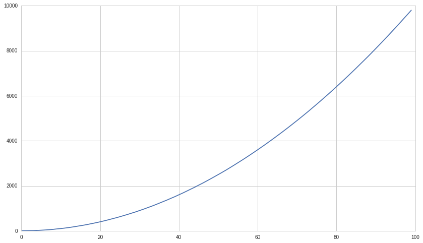
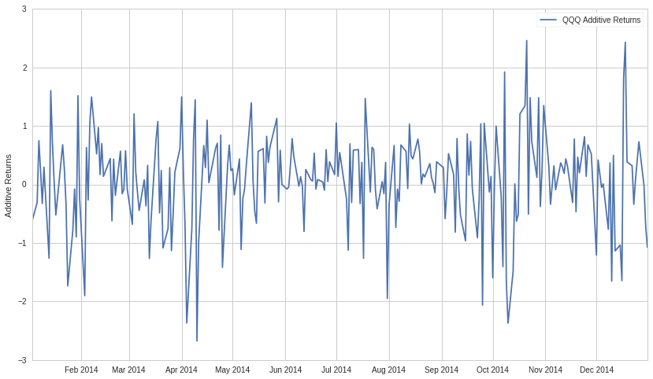
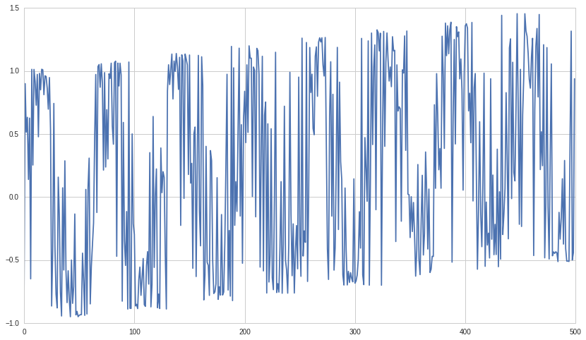

#Exercises: Integration, Cointegration, and Stationarity - Answer Key by
Delaney Granizo-Mackenzie and Maxwell Margenot

Lecture Link :
--------------

https://www.quantopian.com/lectures/integration-cointegration-and-stationarity

###IMPORTANT NOTE: This lecture corresponds to the Integration,
Cointegration, and Stationarity lecture, which is part of the Quantopian
lecture series. This homework expects you to rely heavily on the code
presented in the corresponding lecture. Please copy and paste regularly
from that lecture when starting to work on the problems, as trying to do
them from scratch will likely be too difficult.

Part of the Quantopian Lecture Series:

-  `www.quantopian.com/lectures <https://www.quantopian.com/lectures>`__
-  .. rubric:: `github.com/quantopian/research_public <https://github.com/quantopian/research_public>`__
      :name: github.comquantopianresearch_public

Helper Functions
----------------

.. code:: ipython2

    # Useful Functions
    def check_for_stationarity(X, cutoff=0.01):
        # H_0 in adfuller is unit root exists (non-stationary)
        # We must observe significant p-value to convince ourselves that the series is stationary
        pvalue = adfuller(X)[1]
        if pvalue < cutoff:
            print 'p-value = ' + str(pvalue) + ' The series is likely stationary.'
            return True
        else:
            print 'p-value = ' + str(pvalue) + ' The series is likely non-stationary.'
            return False
        
    def generate_datapoint(params):
        mu = params[0]
        sigma = params[1]
        return np.random.normal(mu, sigma)

.. code:: ipython2

    # Useful Libraries
    import numpy as np
    import pandas as pd
    
    import statsmodels
    import statsmodels.api as sm
    from statsmodels.tsa.stattools import coint, adfuller
    
    import matplotlib.pyplot as plt

--------------

#Exercise 1: Stationarity Testing

##a. Checking For Stationarity

Check whether the following series is stationary using the tests from
the lecture.

.. code:: ipython2

    QQQ = get_pricing("QQQ", start_date='2014-1-1', end_date='2015-1-1', fields='price')
    QQQ.name = QQQ.name.symbol
    
    check_for_stationarity(QQQ)

.. parsed-literal::

    p-value = 0.83074729803 The series is likely non-stationary.

.. parsed-literal::

    False

b. Checking for Normality
-------------------------

As an extra all-purpose check, and one that is often done on series,
check whether the above series is normally distributed using the
Jarque-Bera test.

.. code:: ipython2

    from statsmodels.stats.stattools import jarque_bera
    
    jarque_bera(QQQ)

.. parsed-literal::

    (16.77608340090589,
     0.00022757249739878912,
     0.2415274043817217,
     1.8319331010647477)

##c. Constructing Examples I

Create/provide a series that is stationary and different from any
covered so far in the exercise or the lecture.

.. code:: ipython2

    X = np.random.normal(0, 1, 100)
    
    check_for_stationarity(X)

.. parsed-literal::

    p-value = 8.15924515037e-16 The series is likely stationary.

.. parsed-literal::

    True

##d. Constructing Examples II

Create/provide a series that is non-stationary and different from any
covered so far in the exercise or the lecture.

.. code:: ipython2

    # Set the number of datapoints
    T = 100
    
    B = pd.Series(index=range(T))
    B.name = 'B'
    
    for t in range(T):
        # Now the parameters are dependent on time
        # Specifically, the mean of the series changes over time
        params = (np.power(t, 2), 1)
        B[t] = generate_datapoint(params)

.. code:: ipython2

    plt.plot(B);

.. code:: ipython2

    check_for_stationarity(B)

.. parsed-literal::

    p-value = 0.964313099004 The series is likely non-stationary.

.. parsed-literal::

    False

--------------

Exercise 2: Estimate Order of Integration
=========================================

Use the techniques laid out in the lecture notebook to estimate the
order of integration for the following timeseries.

.. code:: ipython2

    QQQ = get_pricing("QQQ", start_date='2014-1-1', end_date='2015-1-1', fields='price')
    QQQ.name = QQQ.name.symbol
    
    # Write code to estimate the order of integration of QQQ.
    # Feel free to sample from the code provided in the lecture.

.. code:: ipython2

    QQQ = QQQ.diff()[1:]
    QQQ.name = QQQ.name + ' Additive Returns'
    check_for_stationarity(QQQ)
    plt.plot(QQQ.index, QQQ.values)
    plt.ylabel('Additive Returns')
    plt.legend([QQQ.name]);

.. parsed-literal::

    p-value = 2.93736515664e-28 The series is likely stationary.

--------------

#Exercise 3: Find a Stationary Linear (Cointegrated) Combination

Use the techniques laid out in the lecture notebook to find a linear
combination of the following timeseries that is stationary.

.. code:: ipython2

    T = 500
    
    X1 = pd.Series(index=range(T))
    X1.name = 'X1'
    
    for t in range(T):
        # Now the parameters are dependent on time
        # Specifically, the mean of the series changes over time
        params = (t * 0.1, 1)
        X1[t] = generate_datapoint(params)
    
    X2 = np.power(X1, 2) + X1
    X3 = np.power(X1, 3) + X1
    X4 = np.sin(X1) + X1
    
    # We now have 4 time series, X1, X2, X3, X4
    # Determine a linear combination of the 4 that is stationary over the 
    # time period shown using the techniques in the lecture.

.. code:: ipython2

    X1 = sm.add_constant(X1)
    results = sm.OLS(X4, X1).fit()
    
    # Get rid of the constant column
    X1 = X1['X1']
    
    results.params

.. parsed-literal::

    const    0.017736
    X1       0.997973
    dtype: float64

.. code:: ipython2

    plt.plot(X4-0.99 * X1);

.. code:: ipython2

    check_for_stationarity(X4 - 0.99*X1)

.. parsed-literal::

    p-value = 7.40184822771e-07 The series is likely stationary.

.. parsed-literal::

    True

--------------

Congratulations on completing the Integration, Cointegration, and
Stationarity answer key!

As you learn more about writing trading models and the Quantopian
platform, enter the daily `Quantopian
Contest <https://www.quantopian.com/contest>`__. Your strategy will be
evaluated for a cash prize every day.

Start by going through the `Writing a Contest
Algorithm <https://www.quantopian.com/tutorials/contest>`__ tutorial.

*This presentation is for informational purposes only and does not
constitute an offer to sell, a solicitation to buy, or a recommendation
for any security; nor does it constitute an offer to provide investment
advisory or other services by Quantopian, Inc. (“Quantopian”). Nothing
contained herein constitutes investment advice or offers any opinion
with respect to the suitability of any security, and any views expressed
herein should not be taken as advice to buy, sell, or hold any security
or as an endorsement of any security or company. In preparing the
information contained herein, Quantopian, Inc. has not taken into
account the investment needs, objectives, and financial circumstances of
any particular investor. Any views expressed and data illustrated herein
were prepared based upon information, believed to be reliable, available
to Quantopian, Inc. at the time of publication. Quantopian makes no
guarantees as to their accuracy or completeness. All information is
subject to change and may quickly become unreliable for various reasons,
including changes in market conditions or economic circumstances.*
