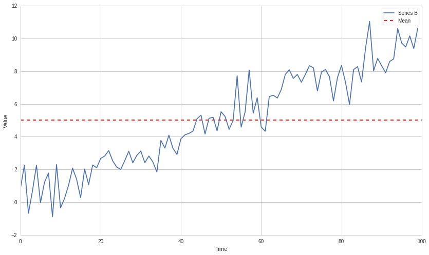
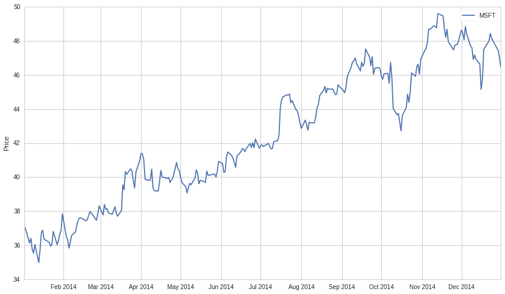
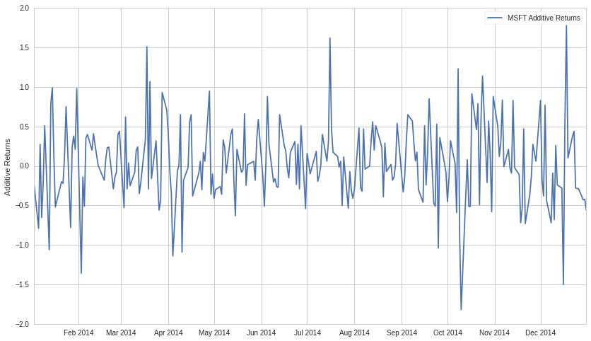
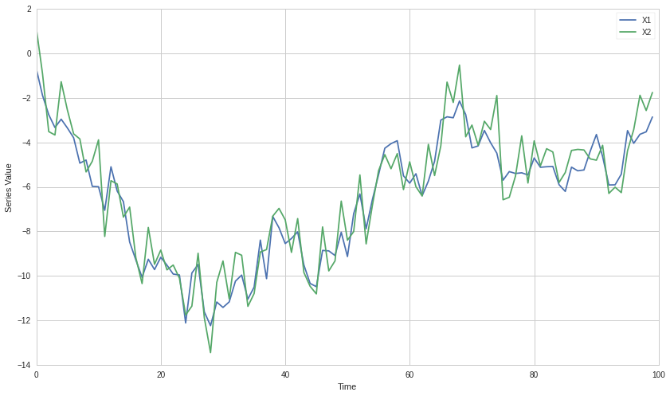
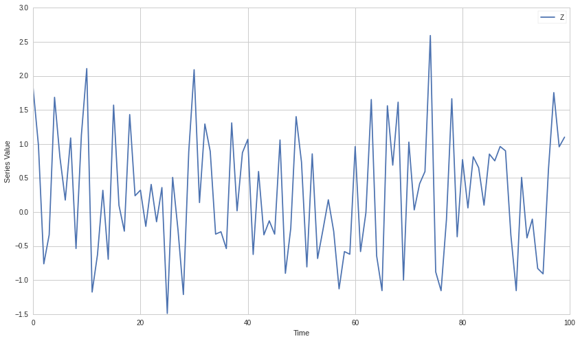
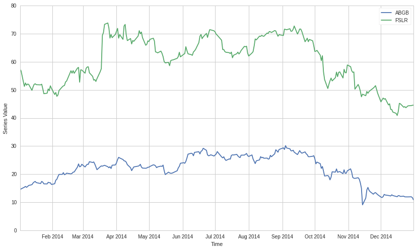

#Integration, Cointegration, and Stationarity by Delaney
Granizo-Mackenzie and Maxwell Margenot

Part of the Quantopian Lecture Series:

-  `www.quantopian.com/lectures <https://www.quantopian.com/lectures>`__
-  `github.com/quantopian/research_public <https://github.com/quantopian/research_public>`__

.. code:: ipython2

    import numpy as np
    import pandas as pd
    
    import statsmodels
    import statsmodels.api as sm
    from statsmodels.tsa.stattools import coint, adfuller
    
    import matplotlib.pyplot as plt

#Stationarity/Non-Stationarity

A commonly untested assumption in time series analysis is the
stationarity of the data. Data are stationary when the parameters of the
data generating process do not change over time. As an example, let’s
consider two series, A and B. Series A is generated from a stationary
process with fixed parameters, series B is generated with parameters
that change over time.

.. code:: ipython2

    def generate_datapoint(params):
        mu = params[0]
        sigma = params[1]
        return np.random.normal(mu, sigma)

###Series A

.. code:: ipython2

    # Set the parameters and the number of datapoints
    params = (0, 1)
    T = 100
    
    A = pd.Series(index=range(T))
    A.name = 'A'
    
    for t in range(T):
        A[t] = generate_datapoint(params)
    
    plt.plot(A)
    plt.xlabel('Time')
    plt.ylabel('Value')
    plt.legend(['Series A']);

.. image:: notebook_files/notebook_5_0.png

###Series B

.. code:: ipython2

    # Set the number of datapoints
    T = 100
    
    B = pd.Series(index=range(T))
    B.name = 'B'
    
    for t in range(T):
        # Now the parameters are dependent on time
        # Specifically, the mean of the series changes over time
        params = (t * 0.1, 1)
        B[t] = generate_datapoint(params)
    
    plt.plot(B)
    plt.xlabel('Time')
    plt.ylabel('Value')
    plt.legend(['Series B']);

.. image:: notebook_files/notebook_7_0.png

###Why Non-Stationarity is Dangerous

Many statistical tests, deep down in the fine print of their
assumptions, require that the data being tested are stationary. Also, if
you naively use certain statistics on a non-stationary data set, you
will get garbage results. As an example, let’s take an average through
our non-stationary :math:`B`.

.. code:: ipython2

    m = np.mean(B)
    
    plt.plot(B)
    plt.hlines(m, 0, len(B), linestyles='dashed', colors='r')
    plt.xlabel('Time')
    plt.ylabel('Value')
    plt.legend(['Series B', 'Mean']);

The computed mean will show the mean of all data points, but won’t be
useful for any forecasting of future state. It’s meaningless when
compared with any specfic time, as it’s a collection of different states
at different times mashed together. This is just a simple and clear
example of why non-stationarity can screw with analysis, much more
subtle problems can arise in practice.

###Testing for Stationarity

Now we want to check for stationarity using a statistical test.

.. code:: ipython2

    def check_for_stationarity(X, cutoff=0.01):
        # H_0 in adfuller is unit root exists (non-stationary)
        # We must observe significant p-value to convince ourselves that the series is stationary
        pvalue = adfuller(X)[1]
        if pvalue < cutoff:
            print 'p-value = ' + str(pvalue) + ' The series ' + X.name +' is likely stationary.'
            return True
        else:
            print 'p-value = ' + str(pvalue) + ' The series ' + X.name +' is likely non-stationary.'
            return False

.. code:: ipython2

    check_for_stationarity(A);
    check_for_stationarity(B);

.. parsed-literal::

    p-value = 0.000498500723545 The series A is likely stationary.
    p-value = 0.948244716942 The series B is likely non-stationary.

Sure enough, the changing mean of the series makes it non-stationary.
Let’s try an example that might be a little more subtle.

.. code:: ipython2

    # Set the number of datapoints
    T = 100
    
    C = pd.Series(index=range(T))
    C.name = 'C'
    
    for t in range(T):
        # Now the parameters are dependent on time
        # Specifically, the mean of the series changes over time
        params = (np.sin(t), 1)
        C[t] = generate_datapoint(params)
    
    plt.plot(C)
    plt.xlabel('Time')
    plt.ylabel('Value')
    plt.legend(['Series C']);

.. image:: notebook_files/notebook_15_0.png

A cyclic movement of the mean will be very difficult to tell apart from
random noise. In practice on noisy data and limited sample size it can
be hard to determine if a series is stationary and whether any drift is
random noise or part of a trend. In each individual case the test may or
may not pick up subtle effects like this.

.. code:: ipython2

    check_for_stationarity(C);

.. parsed-literal::

    p-value = 0.219590266677 The series C is likely non-stationary.

##Order of Integration

###Moving Average Representation/Wold’s Theorem

An important concept in time series analysis is moving average
representation. We will discuss this briefly here, but a more complete
explanation is available in the AR, MA, and ARMA Models lectures of the
`Quantopian Lecture Series <https://www.quantopian.com/lectures>`__.
Also check Wikipedia as listed below.

This representation expresses any time series :math:`Y_t` as

.. math:: Y_t = \sum_{j=0}^\infty b_j \epsilon_{t-j} + \eta_t

-  :math:`\epsilon` is the ‘innovation’ series
-  :math:`b_j` are the moving average weights of the innovation series
-  :math:`\eta` is a deterministic series

The key here is as follows. :math:`\eta` is deterministic, such as a
sine wave. Therefore we could perfectly model it. The innovation process
is stochastic and there to simulate new information occuring over time.
Specifically, :math:`\epsilon_t = \hat Y_t - Y_t` where :math:`\hat Y_t`
is the in the optimal forecast of :math:`Y_t` using only information
from time before :math:`t`. In other words, the best prediction you can
make at time :math:`t-1` cannot account for the randomness in
:math:`\epsilon`.

Each :math:`b_j` just says how much previous values of :math:`\epsilon`
influence :math:`Y_t`.

###Back to Order of Integration

We will note integration order-i as :math:`I(i)`.

A time series is said to be :math:`I(0)` if the following condition
holds in a moving average representation. In hand-wavy english, the
autocorrelation of the series decays sufficiently quickly.

.. math:: \sum_{k=0}^\infty |b_k|^2 < \infty

This property turns out to be true of all stationary series, but by
itself is not enough for stationarity to hold. This means that
stationarity implies :math:`I(0)`, but :math:`I(0)` does not imply
stationarity. For more on orders of integration, please see the
following links.

https://en.wikipedia.org/wiki/Order_of_integration
https://en.wikipedia.org/wiki/Wold%27s_theorem

###Testing for :math:`I(0)`

In practice testing whether the sum of the autocorrelations is finite
may not be possible. It is possible in a mathematical derivation, but
when we have a finite set of data and a finite number of estimated
autocorrelations, the sum will always be finite. Given this difficulty,
tests for :math:`I(0)` rely on stationarity implying the property. If we
find that a series is stationary, then it must also be :math:`I(0)`.

Let’s take our original stationary series A. Because A is stationary, we
know it’s also :math:`I(0)`.

.. code:: ipython2

    plt.plot(A)
    plt.xlabel('Time')
    plt.ylabel('Value')
    plt.legend(['Series A']);

.. image:: notebook_files/notebook_20_0.png

###Inductively Building Up Orders of Integration

If one takes an :math:`I(0)` series and cumulatively sums it (discrete
integration), the new series will be :math:`I(1)`. Notice how this is
related to the calculus concept of integration. The same relation
applies in general, to get :math:`I(n)` take an :math:`I(0)` series and
iteratively take the cumulative sum :math:`n` times.

Now let’s make an :math:`I(1)` series by taking the cumulative sum of A.

.. code:: ipython2

    A1 = np.cumsum(A)
    
    plt.plot(A1)
    plt.xlabel('Time')
    plt.ylabel('Value')
    plt.legend(['Series A1']);

.. image:: notebook_files/notebook_23_0.png

Now let’s make one :math:`I(2)` by taking the cumlulative sum again.

.. code:: ipython2

    A2 = np.cumsum(A1)
    
    plt.plot(A2)
    plt.xlabel('Time')
    plt.ylabel('Value')
    plt.legend(['Series A2']);

.. image:: notebook_files/notebook_25_0.png

###Breaking Down Orders of Integration

Conversely, to find the order of integration of a given series, we
perform the inverse of a cumulative sum, which is the :math:`\Delta` or
itemwise difference function. Specifically

.. math:: (1-L) X_t = X_t - X_{t-1} = \Delta X

.. math:: (1-L)^d X_t

In this case :math:`L` is the lag operator. Sometimes also written as
:math:`B` for ‘backshift’. :math:`L` fetches the second to last elements
in a time series, and :math:`L^k` fetches the k-th to last elements. So

.. math:: L X_t = X_{t-1}

and

.. math:: (1-L) X_t = X_t - X_{t-1}

A series :math:`Y_t` is :math:`I(1)` if the :math:`Y_t - Y_t-1` is
:math:`I(0)`. In other words, if you take an :math:`I(0)` series and
cumulatively sum it, you should get an :math:`I(1)` series.

###Important Take-Away

Once all the math has settled, remember that any stationary series is
:math:`I(0)`

##Real Data

Let’s try this out on some real pricing data.

.. code:: ipython2

    symbol_list = ['MSFT']
    prices = get_pricing(symbol_list, fields=['price']
                                   , start_date='2014-01-01', end_date='2015-01-01')['price']
    prices.columns = map(lambda x: x.symbol, prices.columns)
    X = prices['MSFT']

.. code:: ipython2

    check_for_stationarity(X);

.. parsed-literal::

    p-value = 0.666326790934 The series MSFT is likely non-stationary.

Let’s take a look, certainly has the warning signs of a non-stationary
series.

.. code:: ipython2

    plt.plot(X.index, X.values)
    plt.ylabel('Price')
    plt.legend([X.name]);

Now let’s take the delta of the series, giving us the additive returns.
We’ll check if this is stationary.

.. code:: ipython2

    X1 = X.diff()[1:]
    X1.name = X.name + ' Additive Returns'
    check_for_stationarity(X1)
    plt.plot(X1.index, X1.values)
    plt.ylabel('Additive Returns')
    plt.legend([X1.name]);

.. parsed-literal::

    p-value = 1.48184901469e-28 The series MSFT Additive Returns is likely stationary.

Seems like the additive returns are stationary over 2014. That means we
will probably be able to model the returns much better than the price.
It also means that the price was :math:`I(1)`.

Let’s also check the multiplicative returns.

.. code:: ipython2

    X1 = X.pct_change()[1:]
    X1.name = X.name + ' Multiplicative Returns'
    check_for_stationarity(X1)
    plt.plot(X1.index, X1.values)
    plt.ylabel('Multiplicative Returns')
    plt.legend([X1.name]);

.. parsed-literal::

    p-value = 8.05657888734e-29 The series MSFT Multiplicative Returns is likely stationary.

.. image:: notebook_files/notebook_35_1.png

Seems like the multiplicative returns are also stationary. Both the
multiplicative and additive deltas on a series get at similar pieces of
information, so it’s not surprising both are stationary. In practice
this might not always be the case.

##IMPORTANT NOTE

As always, you should not naively assume that because a time series is
stationary in the past it will continue to be stationary in the future.
Tests for consistency of stationarity such as cross validation and out
of sample testing are necessary. This is true of any statistical
property, we just reiterate it here. Returns may also go in and out of
stationarity, and may be stationary or non-stationary depending on the
timeframe and sampling frequency.

##Note: Returns Analysis

The reason returns are usually used for modeling in quantitive finance
is that they are far more stationary than prices. This makes them easier
to model and returns forecasting more feasible. Forecasting prices is
more difficult, as there are many trends induced by their :math:`I(1)`
integration. Even using a returns forecasting model to forecast price
can be tricky, as any error in the returns forecast will be magnified
over time.

##Cointegration

Finally, now that we’ve discussed stationarity and order of integration,
we can discuss cointegration.

###Def: Linear Combination

A linear combination of the time series (:math:`X_1`, :math:`X_2`,
:math:`\dots`, :math:`X_k`) is a new time series :math:`Y` constructed
as follows for any set of real numbers :math:`b_1 \dots b_k`

.. math:: Y = b_1X_1 + b_2X_2 + \dots + b_kX_k

###Formal Definition

The formal definition of cointegration is as follows.

For some set of time series (:math:`X_1`, :math:`X_2`, :math:`\dots`,
:math:`X_k`), if all series are :math:`I(1)`, and some linear
combination of them is :math:`I(0)`, we say the set of time series is
cointegrated.

####Example

:math:`X_1`, :math:`X_2`, and :math:`X_3` are all :math:`I(1)`, and
:math:`2X_1 + X_2 + 0X_3 = 2X_1 + X_2` is :math:`I(0)`. In this case the
time series are cointegrated.

###Intuition

The intuition here is that for some linear combination of the series,
the result lacks much auto-covariance and is mostly noise. This is
useful for cases such as pairs trading, in which we find two assets
whose prices are cointegrated. Since the linear combination of their
prices :math:`b_1A_1 + b_2A_2` is noise, we can bet on the relationship
:math:`b_1A_1 + b_2A_2` mean reverting and place trades accordingly. See
the Pairs Trading Lecture in the `Quantopian Lecture
Series <https://www.quantopian.com/lectures>`__ for more information.

###Simulated Data Example

Let’s make some data to demonstrate this.

.. code:: ipython2

    # Length of series
    N = 100
    
    # Generate a stationary random X1
    X1 = np.random.normal(0, 1, N)
    # Integrate it to make it I(1)
    X1 = np.cumsum(X1)
    X1 = pd.Series(X1)
    X1.name = 'X1'
    
    # Make an X2 that is X1 plus some noise
    X2 = X1 + np.random.normal(0, 1, N)
    X2.name = 'X2'

.. code:: ipython2

    plt.plot(X1)
    plt.plot(X2)
    plt.xlabel('Time')
    plt.ylabel('Series Value')
    plt.legend([X1.name, X2.name]);

Because :math:`X_2` is just an :math:`I(1)` series plus some stationary
noise, it should still be :math:`I(1)`. Let’s check this.

.. code:: ipython2

    Z = X2.diff()[1:]
    Z.name = 'Z'
    
    check_for_stationarity(Z);

.. parsed-literal::

    p-value = 3.06566830522e-19 The series Z is likely stationary.

Looks good. Now to show cointegration we’ll need to find some linear
combination of :math:`X_1` and :math:`X_2` that is stationary. We can
take :math:`X_2-X_1`. All that’s left over should be stationary noise by
design. Let’s check this.

.. code:: ipython2

    Z = X2 - X1
    Z.name = 'Z'
    
    plt.plot(Z)
    plt.xlabel('Time')
    plt.ylabel('Series Value')
    plt.legend(['Z']);
    
    check_for_stationarity(Z);

.. parsed-literal::

    p-value = 1.03822288113e-18 The series Z is likely stationary.

###Testing for Cointegration

There are a bunch of ways to test for cointegration. This `wikipedia
article <https://en.wikipedia.org/wiki/Cointegration>`__ describes some.
In general we’re just trying to solve for the coefficients
:math:`b_1, \dots b_k` that will produce an :math:`I(0)` linear
combination. If our best guess for these coefficients does not pass a
stationarity check, then we reject the hypothesis that the set is
cointegrated. This will lead to risk of Type II errors (false
negatives), as we will not exhaustively test for stationarity on all
coefficent combinations. However Type II errors are generally okay here,
as they are safe and do not lead to us making any wrong forecasts.

In practice a common way to do this for pairs of time series is to use
linear regression to estimate :math:`\beta` in the following model.

.. math:: X_2 = \alpha + \beta X_1 + \epsilon

The idea is that if the two are cointegrated we can remove
:math:`X_2`\ ’s depedency on :math:`X_1`, leaving behind stationary
noise. The combination :math:`X_2 - \beta X_1 = \alpha + \epsilon`
should be stationary.

####Real Data Example

Let’s try on some real data. We’ll get prices and plot them first.

.. code:: ipython2

    symbol_list = ['ABGB', 'FSLR']
    prices = get_pricing(symbol_list, fields=['price']
                                   , start_date='2014-01-01', end_date='2015-01-01')['price']
    prices.columns = map(lambda x: x.symbol, prices.columns)
    X1 = prices[symbol_list[0]]
    X2 = prices[symbol_list[1]]

.. code:: ipython2

    plt.plot(X1.index, X1.values)
    plt.plot(X1.index, X2.values)
    plt.xlabel('Time')
    plt.ylabel('Series Value')
    plt.legend([X1.name, X2.name]);

Now use linear regression to compute :math:`\beta`.

.. code:: ipython2

    X1 = sm.add_constant(X1)
    results = sm.OLS(X2, X1).fit()
    
    # Get rid of the constant column
    X1 = X1[symbol_list[0]]
    
    results.params

.. parsed-literal::

    const    26.609769
    ABGB      1.536686
    dtype: float64

.. code:: ipython2

    b = results.params[symbol_list[0]]
    Z = X2 - b * X1
    Z.name = 'Z'
    
    plt.plot(Z.index, Z.values)
    plt.xlabel('Time')
    plt.ylabel('Series Value')
    plt.legend([Z.name]);
    
    check_for_stationarity(Z);

.. parsed-literal::

    p-value = 0.000972948552814 The series Z is likely stationary.

.. image:: notebook_files/notebook_52_1.png

We can see here that the resulting :math:`Z` was likely stationary over
the time frame we looked at. This causes us to accept the hypothesis
that our two assets were cointegrated over the same timeframe.

#This is only a forecast!

Remember as with anything else, you should not assume that because some
set of assets have passed a cointegration test historically, they will
continue to remain cointegrated. You need to verify that consistent
behavior occurs, and use various model validation techniques as you
would with any model.

One of the most important things done in finance is to make many
independent bets. Here a quant would find many pairs of assets they
hypothesize are cointegrated, and evenly distribute their dollars
between them in bets. This only requires more than half of the asset
pairs to remain cointegrated for the strategy to work. For more
information on pairs trading, see the pairs trading lecutres in the
Quantopian Lecture Series.

`www.quantopian.com/lectures <https://www.quantopian.com/lectures>`__

###Existing Tests

Luckily there are some pre-built tests for cointegration. Here’s one.
Read up on the
`documentation <http://statsmodels.sourceforge.net/devel/_modules/statsmodels/tsa/stattools.html>`__
on your own time.

.. code:: ipython2

    from statsmodels.tsa.stattools import coint
    
    coint(X1, X2)

.. parsed-literal::

    (-4.0503429043747827,
     0.0060792512281641932,
     array([-3.4565689 , -2.87307862, -2.572919  ]))

*This presentation is for informational purposes only and does not
constitute an offer to sell, a solicitation to buy, or a recommendation
for any security; nor does it constitute an offer to provide investment
advisory or other services by Quantopian, Inc. (“Quantopian”). Nothing
contained herein constitutes investment advice or offers any opinion
with respect to the suitability of any security, and any views expressed
herein should not be taken as advice to buy, sell, or hold any security
or as an endorsement of any security or company. In preparing the
information contained herein, Quantopian, Inc. has not taken into
account the investment needs, objectives, and financial circumstances of
any particular investor. Any views expressed and data illustrated herein
were prepared based upon information, believed to be reliable, available
to Quantopian, Inc. at the time of publication. Quantopian makes no
guarantees as to their accuracy or completeness. All information is
subject to change and may quickly become unreliable for various reasons,
including changes in market conditions or economic circumstances.*
