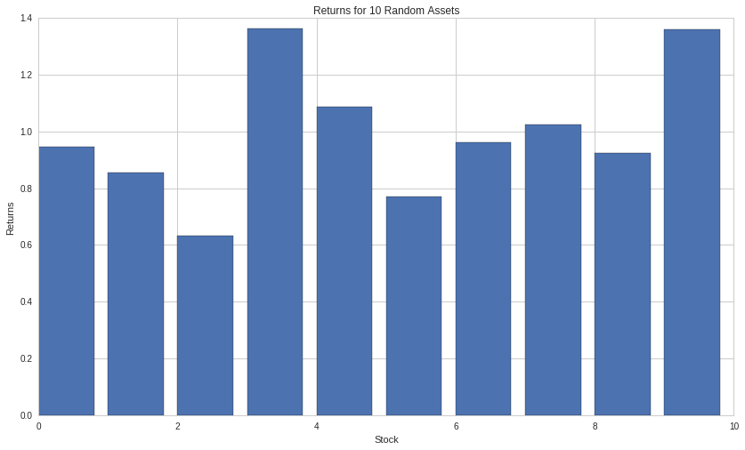

Introduction to NumPy
=====================

by Maxwell Margenot

Part of the Quantopian Lecture Series:

-  `www.quantopian.com/lectures <https://www.quantopian.com/lectures>`__
-  `github.com/quantopian/research_public <https://github.com/quantopian/research_public>`__

Notebook released under the Creative Commons Attribution 4.0 License.

NumPy is an incredibly powerful package in Python that is ubiquitous
throughout the Quantopian platform. It has strong integration with
Pandas, another tool we will be covering in the lecture series. NumPy
adds support for multi-dimensional arrays and mathematical functions
that allow you to easily perform linear algebra calculations. This
lecture will be a collection of linear algebra examples computed using
NumPy.

.. code:: ipython2

    import numpy as np
    import matplotlib.pyplot as plt

Basic NumPy arrays
~~~~~~~~~~~~~~~~~~

The most basic way that we could make use of NumPy in finance is
calculating the mean return of a portfolio. Say that we have a list
containing the historical return of several stocks.

.. code:: ipython2

    stock_list = [3.5, 5, 2, 8, 4.2]

We can make an array by calling a function on the list:

.. code:: ipython2

    returns = np.array(stock_list)
    print returns, type(returns)

.. parsed-literal::

    [ 3.5  5.   2.   8.   4.2] <type 'numpy.ndarray'>

You’ll notice that the type of our array is ‘ndarray’, not just ‘array’.
This is because NumPy arrays can be created with multiple dimensions. If
we pass np.array() a list of lists, it will create a 2-dimensional
array. If we pass a list of lists of lists, it will create a
3-dimensional array, and so on and so forth.

.. code:: ipython2

    A = np.array([[1, 2], [3, 4]])
    print A, type(A)

.. parsed-literal::

    [[1 2]
     [3 4]] <type 'numpy.ndarray'>

We can access the dimensions of an array by looking at its ``shape``
member variable.

.. code:: ipython2

    print A.shape

.. parsed-literal::

    (2, 2)

Arrays are indexed in much the same way as lists in Python. Elements of
a list begin indexing from :math:`0` and end at :math:`n - 1`, where
:math:`n` is the length of the array.

.. code:: ipython2

    print returns[0], returns[len(returns) - 1]

.. parsed-literal::

    3.5 4.2

We can take a slice of an array using a colon, just like in a list.

.. code:: ipython2

    print returns[1:3]

.. parsed-literal::

    [ 5.  2.]

A slice of an array, like in a list, will select a group of elements in
the array starting from the first element indicated and going up to (but
not including) the last element indicated.

In the case of multidimensional arrays, many of the same conventions
with slicing and indexing hold. We can access the first column of a
2-dimensional array like so:

.. code:: ipython2

    print A[:, 0]

.. parsed-literal::

    [1 3]

And the first row of a 2-dimensional array like so:

.. code:: ipython2

    print A[0, :]

.. parsed-literal::

    [1 2]

Notice that each slice of the array returns yet another array!

.. code:: ipython2

    print type(A[0,:])

.. parsed-literal::

    <type 'numpy.ndarray'>

Passing only one index to a 2-dimensional array will result in returning
the row with the given index as well, providing us with another way to
access individual rows.

.. code:: ipython2

    print A[0]

.. parsed-literal::

    [1 2]

Accessing the index of an individual element will return only the
element.

.. code:: ipython2

    print A[1, 1]

.. parsed-literal::

    4

Array functions
^^^^^^^^^^^^^^^

Functions built into NumPy can be easily called on arrays. Most
functions are applied to an array element-wise (as scalar multiplication
is). For example, if we call ``log()`` on an array, the logarithm will
be taken of each element.

.. code:: ipython2

    print np.log(returns)

.. parsed-literal::

    [ 1.25276297  1.60943791  0.69314718  2.07944154  1.43508453]

Some functions return a single value. This is because they treat the
array as a collection (similar to a list), performing the designated
function. For example, the ``mean()`` function will do exactly what you
expect, calculating the mean of an array.

.. code:: ipython2

    print np.mean(returns)

.. parsed-literal::

    4.54

Or the ``max()`` function will return the maximum element of an array.

.. code:: ipython2

    print np.max(returns)

.. parsed-literal::

    8.0

For further reading on the universal functions in NumPy, check out the
`documentation <https://docs.scipy.org/doc/numpy/user/quickstart.html#universal-functions>`__.

Return to the returns
~~~~~~~~~~~~~~~~~~~~~

Now let’s modify our returns array with scalar values. If we add a
scalar value to an array it will be added to every element of the array.
If we multiply an array by a scalar value it will be multiplied against
every element of the array. If we do both, both will happen!

.. code:: ipython2

    returns*2 + 5

.. parsed-literal::

    array([ 12. ,  15. ,   9. ,  21. ,  13.4])

NumPy also has functions specifically built to operate on arrays. Let’s
take the mean and standard deviation of this group of returns.

.. code:: ipython2

    print "Mean: ", np.mean(returns), "Std Dev: ", np.std(returns)

.. parsed-literal::

    Mean:  4.54 Std Dev:  1.99158228552

Let’s simulate a universe of stocks using NumPy’s functions. First we
need to create the arrays to hold the assets and returns that we will
use to build a portfolio. This is because arrays are created with a
fixed size. Their dimensions can’t be changed without creating a new
array.

.. code:: ipython2

    N = 10
    assets = np.zeros((N, 100))
    returns = np.zeros((N, 100))

This function, ``zeroes()``, creates a NumPy array with the given
dimensions that is entirely filled in with :math:`0`. We can pass a
single value or a tuple of as many dimensions as we like. Passing in the
tuple ``(N, 100)``, will return a two-dimensional array with :math:`N`
rows and :math:`100` columns. Our result is a :math:`N \times 100`
array.

Now we will simulate a base asset. We want the universe of stocks to be
correlated with each other so we will use this initial value to generate
the others.

.. code:: ipython2

    R_1 = np.random.normal(1.01, 0.03, 100)
    returns[0] = R_1
    assets[0] = np.cumprod(R_1)

The ``random`` module in NumPy is exceedingly useful. It contains
methods for sampling from many different probability distributions, some
of which are covered in the `random variables
lecture <https://www.quantopian.com/lectures/random-variables>`__ in the
Quantopian lecture series. In this case we draw :math:`N = 100` random
samples from a normal distribution with mean :math:`1.01` and standard
deviation :math:`0.03`. We treat these as the daily percentage returns
of our asset and take the cumulative product of these samples to get the
current price.

The way we have generated our universe, the the individual :math:`R_i`
vectors are each 1-dimensional arrays and the ``returns`` and ``assets``
variables contain 2-dimensional arrays. Above, we set the initial row of
both ``returns`` and ``assets`` to be the first :math:`R_i` vector and
the cumulative asset price based on those returns, respectively.

We will now use this base asset to create a few other random assets that
are correlated with it.

.. code:: ipython2

    # Generate assets that are correlated with R_1
    for i in range(1, N):
        R_i = R_1 + np.random.normal(0.001, 0.02, 100)
        returns[i] = R_i # Set each row of returns equal to the new R_i array
        assets[i] = np.cumprod(R_i)
        
    mean_returns = [(np.mean(R) - 1)*100 for R in returns]
    return_volatilities = [np.std(R) for R in returns]

Here we generate the remaining :math:`N - 1` securities that we want in
our universe by adding random noise to :math:`R_1`. This ensures that
our :math:`N - 1` other assets will be correlated with the base asset
because they have some underlying information that is shared.

Let’s plot what the mean return of each asset looks like:

.. code:: ipython2

    plt.bar(np.arange(len(mean_returns)), mean_returns)
    plt.xlabel('Stock')
    plt.ylabel('Returns')
    plt.title('Returns for {0} Random Assets'.format(N));

Calculating Expected Return
~~~~~~~~~~~~~~~~~~~~~~~~~~~

So we have a universe of stocks. Great! Now let’s put them together in a
portfolio and calculate its expected return and risk.

We will start off by generating :math:`N` random weights for each asset
in our portfolio.

.. code:: ipython2

    weights = np.random.uniform(0, 1, N)
    weights = weights/np.sum(weights)

We have to rescale the weights so that they all add up to :math:`1`. We
do this by scaling the weights vector by the sum total of all the
weights. This step ensures that we will be using :math:`100\%` of the
portfolio’s cash.

To calculate the mean return of the portfolio, we have to scale each
asset’s return by its designated weight. We can pull each element of
each array and multiply them individually, but it’s quicker to use
NumPy’s linear algebra methods. The function that we want is ``dot()``.
This will calculate the dot product between two arrays for us. So if
:math:`v = \left[ 1, 2, 3 \right]` and
:math:`w = \left[4, 5, 6 \right]`, then:

.. math::  v \cdot w = 1 \times 4 + 2 \times 5 + 3 \times 6 

For a one-dimensional vector, the dot product will multiply each element
pointwise and add all the products together! In our case, we have a
vector of weights,
:math:`\omega = \left[ \omega_1, \omega_2, \dots \omega_N\right]` and a
vector of returns,
:math:`\mu = \left[ \mu_1, \mu_2, \dots, \mu_N\right]`. If we take the
dot product of these two we will get:

.. math::  \omega \cdot \mu = \omega_1\mu_1 + \omega_2\mu_2 + \dots + \omega_N\mu_N = \mu_P 

This yields the sum of all the asset returns scaled by their respective
weights. This the the portfolio’s overall expected return!

.. code:: ipython2

    p_returns = np.dot(weights, mean_returns)
    print "Expected return of the portfolio: ", p_returns

.. parsed-literal::

    Expected return of the portfolio:  0.938249456527

Calculating the mean return is fairly intuitive and does not require too
much explanation of linear algebra. However, calculating the variance of
our portfolio requires a bit more background.

Beware of NaN values
^^^^^^^^^^^^^^^^^^^^

Most of the time, all of these calculations will work without an issue.
However, when working with real data we run the risk of having ``nan``
values in our arrays. This is NumPy’s way of saying that the data there
is missing or doesn’t exist. These ``nan`` values can lead to errors in
mathematical calculations so it is important to be aware of whether your
array contains ``nan`` values and to know how to drop them.

.. code:: ipython2

    v = np.array([1, 2, np.nan, 4, 5])
    print v

.. parsed-literal::

    [  1.   2.  nan   4.   5.]

Let’s see what happens when we try to take the mean of this array.

.. code:: ipython2

    print np.mean(v)

.. parsed-literal::

    nan

Clearly, ``nan`` values can have a large impact on our calculations.
Fortunately, we can check for ``nan`` values with the ``isnan()``
function.

.. code:: ipython2

    np.isnan(v)

.. parsed-literal::

    array([False, False,  True, False, False], dtype=bool)

Calling ``isnan()`` on an array will call the function on each value of
the array, returning a value of ``True`` if the element is ``nan`` and
``False`` if the element is valid. Now, knowing whether your array
contains ``nan`` values is all well and good, but how do we remove
``nan``\ s? Handily enough, NumPy arrays can be indexed by boolean
values (``True`` or ``False``). If we use a boolean array to index an
array, we will remove all values of the array that register as ``False``
under the condition. We use the ``isnan()`` function in create a boolean
array, assigning a ``True`` value to everything that is *not* ``nan``
and a ``False`` to the ``nan``\ s and we use that to index the same
array.

.. code:: ipython2

    ix = ~np.isnan(v) # the ~ indicates a logical not, inverting the bools
    print v[ix] # We can also just write v = v[~np.isnan(v)]

.. parsed-literal::

    [ 1.  2.  4.  5.]

.. code:: ipython2

    print np.mean(v[ix])

.. parsed-literal::

    3.0

There are a few shortcuts to this process in the form of NumPy functions
specifically built to handle them, such as ``nanmean()``.

.. code:: ipython2

    print np.nanmean(v)

.. parsed-literal::

    3.0

The ``nanmean()`` function simply calculates the mean of the array as if
there were no ``nan`` values at all! There are a few more of these
functions, so feel free to read more about them in the
`documentation <https://docs.scipy.org/doc/numpy/user/index.html>`__.
These indeterminate values are more an issue with data than linear
algebra itself so it is helpful that there are ways to handle them.

Conclusion
~~~~~~~~~~

Linear algebra is pervasive in finance and in general. For example, the
calculation of *optimal* weights according to modern portfolio theory is
done using linear algebra techniques. The arrays and functions in NumPy
allow us to handle these calculations in an intuitive way. For a quick
intro to linear algebra and how to use NumPy to do more significant
matrix calculations, proceed to the next section.

A brief foray into linear algebra
---------------------------------

Let’s start with a basic overview of some linear algebra. Linear algebra
comes down to the multiplication and composition of scalar and matrix
values. A scalar value is just a real number that we multiply against an
array. When we scale a matrix or array using a scalar, we multiply each
individual element of that matrix or array by the scalar.

A matrix is a collection of values, typically represented by an
:math:`m \times n` grid, where :math:`m` is the number of rows and
:math:`n` is the number of columns. The edge lengths :math:`m` and
:math:`n` do not necessarily have to be different. If we have
:math:`m = n`, we call this a square matrix. A particularly interesting
case of a matrix is when :math:`m = 1` or :math:`n = 1`. In this case we
have a special case of a matrix that we call a vector. While there is a
matrix object in NumPy we will be doing everything using NumPy arrays
because they can have dimensions greater than :math:`2`. For the purpose
of this section, we will be using matrix and array interchangeably.

We can express the matrix equation as:

.. math::  y = A\cdot x 

Where :math:`A` is an :math:`m \times n` matrix, :math:`y` is a
:math:`m \times 1` vector, and :math:`x` is a :math:`n \times 1` vector.
On the right-hand side of the equation we are multiplying a matrix by a
vector. This requires a little bit more clarification, lest we think
that we can go about multiplying any matrices by any other matrices.

Matrix multiplication
^^^^^^^^^^^^^^^^^^^^^

With matrix multiplication, the order in which the matrices are
multiplied matters. Multiplying a matrix on the left side by another
matrix may be just fine, but multiplying on the right may be undefined.

.. code:: ipython2

    A = np.array([
            [1, 2, 3, 12, 6],
            [4, 5, 6, 15, 20],
            [7, 8, 9, 10, 10]        
        ])
    B = np.array([
            [4, 4, 2],
            [2, 3, 1],
            [6, 5, 8],
            [9, 9, 9]
        ])

Notice that the above-defined matrices, :math:`A` and :math:`B`, have
different dimensions. :math:`A` is :math:`3 \times 5` and :math:`B` is
:math:`4 \times 3`. The general rule of what can and cannot be
multiplied in which order is based on the dimensions of the matrices.
Specifically, the number of columns in the matrix on the left must be
equal to the number of rows in the matrix on the right. In super
informal terms, let’s say that we have an :math:`m \times n` matrix and
a :math:`p \times q` matrix. If we multiply the first by the second on
the right, we get the following:

.. math::  (m \times n) \cdot (p \times q) = (m \times q) 

So the resultant product has the same number of rows as the left matrix
and the same number of columns as the right matrix. This limitation of
matrix multiplication with regards to dimensions is important to keep
track of when writing code. To demonstrate this, we use the ``dot()``
function to multiply our matrices below:

.. code:: ipython2

    print np.dot(A, B)

::

    ---------------------------------------------------------------------------

    ValueError                                Traceback (most recent call last)

    <ipython-input-31-fe00270d1447> in <module>()
    ----> 1 print np.dot(A, B)
    

    ValueError: shapes (3,5) and (4,3) not aligned: 5 (dim 1) != 4 (dim 0)

These results make sense in accordance with our rule. Multiplying a
:math:`3 \times 5` matrix on the right by a :math:`4 \times 3` matrix
results in an error while multiplying a :math:`4 \times 3` matrix on the
right by a :math:`3 \times 5` matrix results in a :math:`4 \times 5`
matrix.

.. code:: ipython2

    print np.dot(B, A)

.. parsed-literal::

    [[ 34  44  54 128 124]
     [ 21  27  33  79  82]
     [ 82 101 120 227 216]
     [108 135 162 333 324]]

Portfolio Variance
~~~~~~~~~~~~~~~~~~

Let’s return to our portfolio example from before. We calculated the
expected return of the portfolio, but how do we calculate the variance?
We start by trying to evaluate the portfolio as a sum of each individual
asset, scaled by it’s weight.

.. math::  VAR[P] = VAR[\omega_1 S_1 + \omega_2 S_2 + \cdots + \omega_N S_N] 

Where :math:`S_0, \cdots, S_N` are the assets contained within our
universe. If all of our assets were independent of each other, we could
simply evaluate this as

.. math::  VAR[P] = VAR[\omega_1 S_1] + VAR[\omega_2 S_2] + \cdots + VAR[\omega_N S_N] = \omega_1^2\sigma_1^2 + \omega_2^2\sigma_2^2 + \cdots + \omega_N^2\sigma_N^2 

However, all of our assets depend on each other by their construction.
They are all in some way related to our base asset and therefore each
other. We thus have to calculate the variance of the portfolio by
including the individual pairwise covariances of each asset. Our formula
for the variance of the portfolio:

.. math::  VAR[P] = \sigma_P^2 = \sum_i \omega_i^2\sigma_i^2 + \sum_i\sum_{i\neq j} \omega_i\omega_j\sigma_i\sigma_j\rho_{i, j}, \ i, j \in \lbrace 1, 2, \cdots, N \rbrace 

Where :math:`\rho_{i,j}` is the correlation between :math:`S_i` and
:math:`S_j`,
:math:`\rho_{i, j} = \frac{COV[S_i, S_j]}{\sigma_i\sigma_j}`. This seems
exceedingly complicated, but we can easily handle all of this using
NumPy arrays. First, we calculate the covariance matrix that relates all
the individual stocks in our universe.

.. code:: ipython2

    cov_mat = np.cov(returns)
    print cov_mat

.. parsed-literal::

    [[ 0.00086058  0.00089203  0.00090705  0.00097867  0.00079707  0.00085327
       0.00076728  0.00093279  0.00085655  0.00076459]
     [ 0.00089203  0.00133583  0.00097512  0.00099617  0.00082914  0.00089555
       0.00087399  0.00092142  0.00080857  0.00083485]
     [ 0.00090705  0.00097512  0.00134549  0.00106267  0.00082659  0.00087943
       0.00081558  0.00101182  0.0008822   0.00079261]
     [ 0.00097867  0.00099617  0.00106267  0.00151787  0.00094079  0.0010231
       0.00086453  0.00106496  0.00100924  0.00090792]
     [ 0.00079707  0.00082914  0.00082659  0.00094079  0.00109599  0.00077462
       0.00071631  0.00089835  0.00081464  0.00073657]
     [ 0.00085327  0.00089555  0.00087943  0.0010231   0.00077462  0.00124298
       0.00072712  0.00096373  0.00078529  0.00079774]
     [ 0.00076728  0.00087399  0.00081558  0.00086453  0.00071631  0.00072712
       0.00107769  0.0007624   0.00076273  0.00066191]
     [ 0.00093279  0.00092142  0.00101182  0.00106496  0.00089835  0.00096373
       0.0007624   0.00141976  0.00086849  0.00085365]
     [ 0.00085655  0.00080857  0.0008822   0.00100924  0.00081464  0.00078529
       0.00076273  0.00086849  0.00135418  0.00070977]
     [ 0.00076459  0.00083485  0.00079261  0.00090792  0.00073657  0.00079774
       0.00066191  0.00085365  0.00070977  0.00106124]]

This array is not formatted particularly nicely, but a covariance matrix
is a very important concept. The covariance matrix is of the form:

.. math::

    \left[\begin{matrix}
   VAR[S_1] & COV[S_1, S_2] & \cdots & COV[S_1, S_N] \\
   COV[S_2, S_1] & VAR[S_2] & \cdots & COV[S_2, S_N] \\
   \vdots & \vdots & \ddots & \vdots \\
   COV[S_N, S_1] & COV[S_N, S_2] & \cdots & VAR[S_N]
   \end{matrix}\right] 

So each diagonal entry is the variance of that asset at that index and
each off-diagonal holds the covariance of two assets indexed by the
column and row number. What is important is that once we have the
covariance matrix we are able to do some very quick linear algebra to
calculate the variance of the overall portfolio. We can represent the
variance of the portfolio in array form as:

.. math::  \sigma_p^2 = \omega \ C \ \omega^\intercal

Where :math:`C` is the covariance matrix of all the assets and
:math:`\omega` is the array containing the weights of each individual
asset. The superscript :math:`\intercal` on the second :math:`\omega`
listed above denotes the **transpose** of :math:`\omega`. For a
reference on the evaluation of the variance of a portfolio as a matrix
equation, please see the Wikipedia article on `modern portfolio
theory <https://en.wikipedia.org/wiki/Modern_portfolio_theory>`__.

The transpose of an array is what you get when you switch the rows and
columns of an array. This has the effect of reflecting an array across
what you might imagine as a diagonal. For example, take our array
:math:`A` from before:

.. code:: ipython2

    print A

.. parsed-literal::

    [[ 1  2  3 12  6]
     [ 4  5  6 15 20]
     [ 7  8  9 10 10]]

The transpose looks like a mirror image of the same array.

.. code:: ipython2

    print np.transpose(A)

.. parsed-literal::

    [[ 1  4  7]
     [ 2  5  8]
     [ 3  6  9]
     [12 15 10]
     [ 6 20 10]]

But :math:`\omega` here is a 1-dimensional array, a vector! It makes
perfect to take the transpose of :math:`A`, a :math:`3 \times 5` array,
as the output will be a :math:`5 \times 3` array, but a 1-dimensional
array is not quite as intuitive. A typical 1-dimensional array can be
thought of as a :math:`1 \times n` horizontal vector. Thus, taking the
tranpose of this array essentially means changing it into a
:math:`n \times 1` vertical vector. This makes sense because
1-dimensional arrays are still arrays and any multiplication done
between 1-dimensional and higher dimensional arrays must keep in line
with our dimensionality issue of matrix multiplication.

To make a long story short, we think of :math:`\omega` as
:math:`1 \times N` since we have :math:`N` securities. This makes it so
that :math:`\omega^\intercal` is :math:`N \times 1`. Again, our
covariance matrix is :math:`N \times N`. So the overall multiplication
works out like so, in informal terms:

.. math::  \text{Dimensions}(\sigma_p^2) = \text{Dimensions}(\omega C \omega^\intercal) = (1 \times N)\cdot (N \times N)\cdot (N \times 1) = (1 \times 1)

Multiplying the covariance matrix on the left by the plain horizontal
vector and on the right by that vector’s transpose results in the
calculation of a single scalar (:math:`1 \times 1`) value, our
portfolio’s variance.

So knowing this, let’s proceed and calculate the portfolio variance! We
can easily calculate the product of these arrays by using ``dot()`` for
matrix multiplication, though this time we have to do it twice.

.. code:: ipython2

    # Calculating the portfolio volatility
    var_p = np.dot(np.dot(weights, cov_mat), weights.T)
    vol_p = np.sqrt(var_p)
    print "Portfolio volatility: ", vol_p

.. parsed-literal::

    Portfolio volatility:  0.0297400694577

To confirm this calculation, let’s simply evaluate the volatility of the
portfolio using only NumPy functions.

.. code:: ipython2

    # Confirming calculation
    vol_p_alt = np.sqrt(np.var(np.dot(weights, returns), ddof=1))
    print "Portfolio volatility: ", vol_p_alt

.. parsed-literal::

    Portfolio volatility:  0.0297400694577

The ``ddof`` parameter is a simple integer input that tells the function
the number of degrees of freedom to take into account. This is a more
statistical concept, but what this tells us that our matrix calculation
is correct!

A lot of this might not make sense at first glance. It helps to go back
and forth between the theory and the code representations until you have
a better grasp of the mathematics involved. It is definitely not
necessary to be an expert on linear algebra and on matrix operations,
but linear algebra can help to streamline the process of working with
large amounts of data. For further reading on NumPy, check out the
`documentation <https://docs.scipy.org/doc/numpy/user/index.html>`__.

*This presentation is for informational purposes only and does not
constitute an offer to sell, a solicitation to buy, or a recommendation
for any security; nor does it constitute an offer to provide investment
advisory or other services by Quantopian, Inc. (“Quantopian”). Nothing
contained herein constitutes investment advice or offers any opinion
with respect to the suitability of any security, and any views expressed
herein should not be taken as advice to buy, sell, or hold any security
or as an endorsement of any security or company. In preparing the
information contained herein, Quantopian, Inc. has not taken into
account the investment needs, objectives, and financial circumstances of
any particular investor. Any views expressed and data illustrated herein
were prepared based upon information, believed to be reliable, available
to Quantopian, Inc. at the time of publication. Quantopian makes no
guarantees as to their accuracy or completeness. All information is
subject to change and may quickly become unreliable for various reasons,
including changes in market conditions or economic circumstances.*
