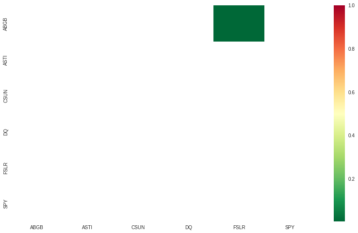
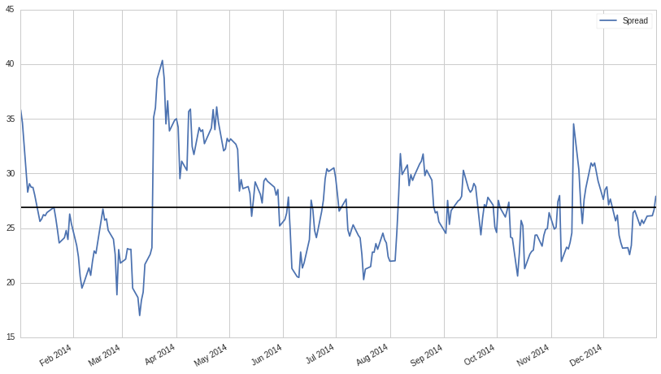
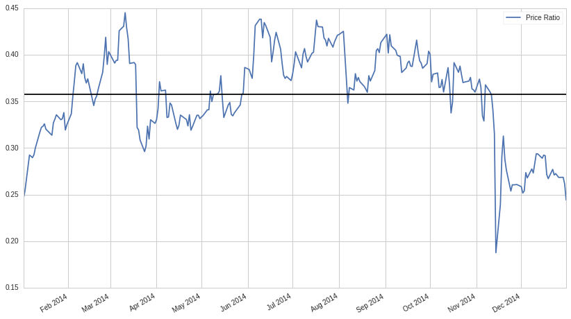
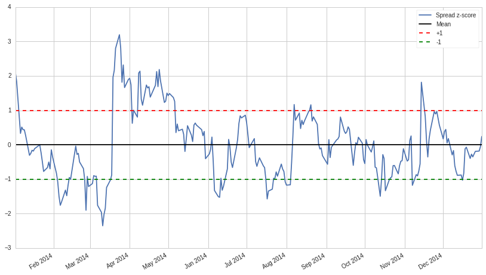
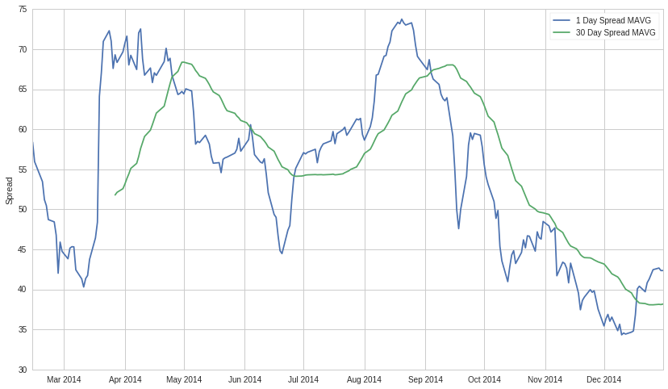
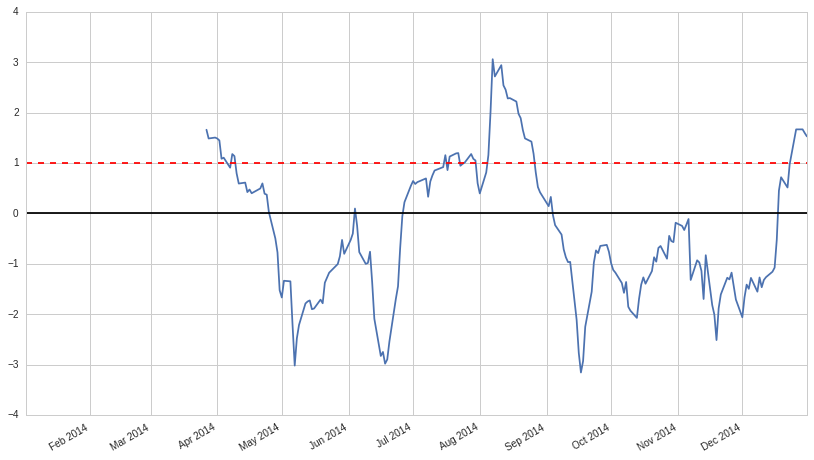
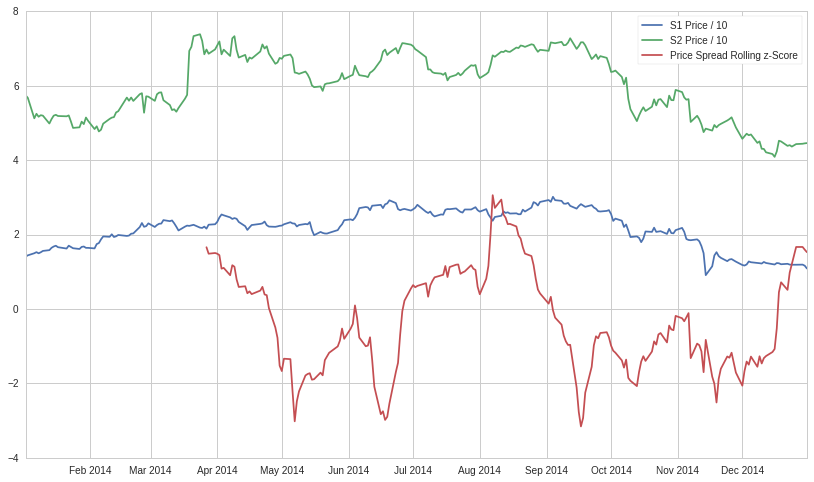

Introduction to Pairs Trading
=============================

By Delaney Mackenzie and Maxwell Margenot

Part of the Quantopian Lecture Series:

-  `www.quantopian.com/lectures <https://www.quantopian.com/lectures>`__
-  `github.com/quantopian/research_public <https://github.com/quantopian/research_public>`__

Pairs trading is a classic example of a strategy based on mathematical
analysis. The principle is as follows. Let’s say you have a pair of
securities X and Y that have some underlying economic link. An example
might be two companies that manufacture the same product, or two
companies in one supply chain. If we can model this economic link with a
mathematical model, we can make trades on it. We’ll start by
constructing a toy example.

Before we proceed, note that the content in this lecture depends heavily
on the `Stationarity, Integration, and Cointegration
lecture <https://www.quantopian.com/lectures/integration-cointegration-and-stationarity>`__
in order to properly understand the mathematical basis for the
methodology that we employ here. It is recommended that you go through
that lecture before this continuing.

.. code:: ipython2

    import numpy as np
    import pandas as pd
    
    import statsmodels
    import statsmodels.api as sm
    from statsmodels.tsa.stattools import coint
    # just set the seed for the random number generator
    np.random.seed(107)
    
    import matplotlib.pyplot as plt

Generating Two Fake Securities
------------------------------

We model X’s daily returns by drawing from a normal distribution. Then
we perform a cumulative sum to get the value of X on each day.

.. code:: ipython2

    X_returns = np.random.normal(0, 1, 100) # Generate the daily returns
    # sum them and shift all the prices up into a reasonable range
    X = pd.Series(np.cumsum(X_returns), name='X') + 50
    X.plot();

.. image:: notebook_files/notebook_3_0.png

Now we generate Y. Remember that Y is supposed to have a deep economic
link to X, so the price of Y should vary pretty similarly. We model this
by taking X, shifting it up and adding some random noise drawn from a
normal distribution.

.. code:: ipython2

    some_noise = np.random.normal(0, 1, 100)
    Y = X + 5 + some_noise
    Y.name = 'Y'
    pd.concat([X, Y], axis=1).plot();

.. image:: notebook_files/notebook_5_0.png

Cointegration
-------------

We’ve constructed an example of two cointegrated series. Cointegration
is a more subtle relationship than correlation. If two time series are
cointegrated, there is some linear combination between them that will
vary around a mean. At all points in time, the combination between them
is related to the same probability distribution.

For more details on how we formally define cointegration and how to
understand it, please see the Integration, Cointegration, and
Stationarity lecture from the `Quantopian Lecture
Series <https://www.quantopian.com/lectures#Integration,-Cointegration,-and-Stationarity>`__.

We’ll plot the difference between the two now so we can see how this
looks.

.. code:: ipython2

    (Y - X).plot() # Plot the spread
    plt.axhline((Y - X).mean(), color='red', linestyle='--') # Add the mean
    plt.xlabel('Time')
    plt.legend(['Price Spread', 'Mean']);

.. image:: notebook_files/notebook_7_0.png

Testing for Cointegration
-------------------------

That’s an intuitive definition, but how do we test for this
statistically? There is a convenient cointegration test that lives in
``statsmodels.tsa.stattools``. Let’s say that our confidence level is
:math:`0.05`. We should see a p-value below our cutoff, as we’ve
artifically created two series that are the textbook definition of
cointegration.

.. code:: ipython2

    # compute the p-value of the cointegration test
    # will inform us as to whether the spread between the 2 timeseries is stationary
    # around its mean
    score, pvalue, _ = coint(X,Y)
    print pvalue

.. parsed-literal::

    2.75767345363e-16

Correlation vs. Cointegration
~~~~~~~~~~~~~~~~~~~~~~~~~~~~~

Correlation and cointegration, while theoretically similar, are not the
same. To demonstrate this, we’ll show examples of series that are
correlated, but not cointegrated, and vice versa. To start let’s check
the correlation of the series we just generated.

.. code:: ipython2

    X.corr(Y)

.. parsed-literal::

    0.94970906463859317

That’s very high, as we would expect. But how would two series that are
correlated but not cointegrated look?

Correlation Without Cointegration
~~~~~~~~~~~~~~~~~~~~~~~~~~~~~~~~~

A simple example is two series that just diverge.

.. code:: ipython2

    X_returns = np.random.normal(1, 1, 100)
    Y_returns = np.random.normal(2, 1, 100)
    
    X_diverging = pd.Series(np.cumsum(X_returns), name='X')
    Y_diverging = pd.Series(np.cumsum(Y_returns), name='Y')
    
    pd.concat([X_diverging, Y_diverging], axis=1).plot();

.. image:: notebook_files/notebook_13_0.png

.. code:: ipython2

    print 'Correlation: ' + str(X_diverging.corr(Y_diverging))
    score, pvalue, _ = coint(X_diverging,Y_diverging)
    print 'Cointegration test p-value: ' + str(pvalue)

.. parsed-literal::

    Correlation: 0.993134380128
    Cointegration test p-value: 0.884633444839

Cointegration Without Correlation
~~~~~~~~~~~~~~~~~~~~~~~~~~~~~~~~~

A simple example of this case is a normally distributed series and a
square wave.

.. code:: ipython2

    Y2 = pd.Series(np.random.normal(0, 1, 1000), name='Y2') + 20
    Y3 = Y2.copy()

.. code:: ipython2

    # Y2 = Y2 + 10
    Y3[0:100] = 30
    Y3[100:200] = 10
    Y3[200:300] = 30
    Y3[300:400] = 10
    Y3[400:500] = 30
    Y3[500:600] = 10
    Y3[600:700] = 30
    Y3[700:800] = 10
    Y3[800:900] = 30
    Y3[900:1000] = 10

.. code:: ipython2

    Y2.plot()
    Y3.plot()
    plt.ylim([0, 40]);

.. image:: notebook_files/notebook_18_0.png

.. code:: ipython2

    # correlation is nearly zero
    print 'Correlation: ' + str(Y2.corr(Y3))
    score, pvalue, _ = coint(Y2,Y3)
    print 'Cointegration test p-value: ' + str(pvalue)

.. parsed-literal::

    Correlation: -0.0413040695809
    Cointegration test p-value: 0.0

Sure enough, the correlation is incredibly low, but the p-value shows
that these are cointegrated.

Hedging
-------

Because you’d like to protect yourself from bad markets, often times
short sales will be used to hedge long investments. Because a short sale
makes money if the security sold loses value, and a long purchase will
make money if a security gains value, one can long parts of the market
and short others. That way if the entire market falls off a cliff, we’ll
still make money on the shorted securities and hopefully break even. In
the case of two securities we’ll call it a hedged position when we are
long on one security and short on the other.

The Trick: Where it all comes together
--------------------------------------

Because the securities drift towards and apart from each other, there
will be times when the distance is high and times when the distance is
low. The trick of pairs trading comes from maintaining a hedged position
across X and Y. If both securities go down, we neither make nor lose
money, and likewise if both go up. We make money on the spread of the
two reverting to the mean. In order to do this we’ll watch for when X
and Y are far apart, then short Y and long X. Similarly we’ll watch for
when they’re close together, and long Y and short X.

Going Long the Spread
~~~~~~~~~~~~~~~~~~~~~

This is when the spread is small and we expect it to become larger. We
place a bet on this by longing Y and shorting X.

Going Short the Spread
~~~~~~~~~~~~~~~~~~~~~~

This is when the spread is large and we expect it to become smaller. We
place a bet on this by shorting Y and longing X.

Specific Bets
~~~~~~~~~~~~~

One important concept here is that we are placing a bet on one specific
thing, and trying to reduce our bet’s dependency on other factors such
as the market.

Finding real securities that behave like this
---------------------------------------------

The best way to do this is to start with securities you suspect may be
cointegrated and perform a statistical test. If you just run statistical
tests over all pairs, you’ll fall prey to multiple comparison bias.

Here’s a method to look through a list of securities and test for
cointegration between all pairs. It returns a cointegration test score
matrix, a p-value matrix, and any pairs for which the p-value was less
than :math:`0.05`.

WARNING: This will incur a large amount of multiple comparisons bias.
~~~~~~~~~~~~~~~~~~~~~~~~~~~~~~~~~~~~~~~~~~~~~~~~~~~~~~~~~~~~~~~~~~~~~

The methods for finding viable pairs all live on a spectrum. At one end
there is the formation of an economic hypothesis for an individual pair.
You have some extra knowledge about an economic link that leads you to
believe that the pair is cointegrated, so you go out and test for the
presence of cointegration. In this case you will incur no multiple
comparisons bias. At the other end of the spectrum, you perform a search
through hundreds of different securities for any viable pairs according
to your test. In this case you will incur a very large amount of
multiple comparisons bias.

Multiple comparisons bias is the increased chance to incorrectly
generate a significant p-value when many tests are run. If 100 tests are
run on random data, we should expect to see 5 p-values below
:math:`0.05` on expectation. Because we will perform :math:`n(n-1)/2`
comparisons, we should expect to see many incorrectly significant
p-values. For the sake of this example we will ignore this and continue.
In practice a second verification step would be needed if looking for
pairs this way. Another approach is to pick a small number of pairs you
have reason to suspect might be cointegrated and test each individually.
This will result in less exposure to multiple comparisons bias. You can
read more about multiple comparisons bias
`here <https://en.wikipedia.org/wiki/Multiple_comparisons_problem>`__.

.. code:: ipython2

    def find_cointegrated_pairs(data):
        n = data.shape[1]
        score_matrix = np.zeros((n, n))
        pvalue_matrix = np.ones((n, n))
        keys = data.keys()
        pairs = []
        for i in range(n):
            for j in range(i+1, n):
                S1 = data[keys[i]]
                S2 = data[keys[j]]
                result = coint(S1, S2)
                score = result[0]
                pvalue = result[1]
                score_matrix[i, j] = score
                pvalue_matrix[i, j] = pvalue
                if pvalue < 0.05:
                    pairs.append((keys[i], keys[j]))
        return score_matrix, pvalue_matrix, pairs

Looking for Cointegrated Pairs of Alternative Energy Securities
---------------------------------------------------------------

We are looking through a set of solar company stocks to see if any of
them are cointegrated. We’ll start by defining the list of securities we
want to look through. Then we’ll get the pricing data for each security
for the year of 2014.

Our approach here is somewhere in the middle of the spectrum that we
mentioned before. We have formulated an economic hypothesis that there
is some sort of link between a subset of securities within the energy
sector and we want to test whether there are any cointegrated pairs.
This incurs significantly less multiple comparisons bias than searching
through hundreds of securities and slightly more than forming a
hypothesis for an individual test.

NOTE: We include the market in our data. This is because the market
drives the movement of so many securities that you often times might
find two seemingingly cointegrated securities, but in reality they are
not cointegrated and just both conintegrated with the market. This is
known as a confounding variable and it is important to check for market
involvement in any relationship you find.

get_pricing() is a Quantopian method that pulls in stock data, and loads
it into a Python Pandas DataPanel object. Available fields are ‘price’,
‘open_price’, ‘high’, ‘low’, ‘volume’. But for this example we will just
use ‘price’ which is the daily closing price of the stock.

.. code:: ipython2

    symbol_list = ['ABGB', 'ASTI', 'CSUN', 'DQ', 'FSLR','SPY']
    prices_df = get_pricing(symbol_list, fields=['price']
                                   , start_date='2014-01-01', end_date='2015-01-01')['price']
    prices_df.columns = map(lambda x: x.symbol, prices_df.columns)

Example of how to get all the prices of all the stocks loaded using
get_pricing() above in one pandas dataframe object

.. code:: ipython2

    prices_df.head()

.. raw:: html

    

    <table border="1" class="dataframe">
      <thead>
        <tr style="text-align: right;">
          <th></th>
          <th>ABGB</th>
          <th>ASTI</th>
          <th>CSUN</th>
          <th>DQ</th>
          <th>FSLR</th>
          <th>SPY</th>
        </tr>
      </thead>
      <tbody>
        <tr>
          <th>2014-01-02 00:00:00+00:00</th>
          <td>14.099</td>
          <td>7.41</td>
          <td>7.040</td>
          <td>38.00</td>
          <td>57.43</td>
          <td>179.444</td>
        </tr>
        <tr>
          <th>2014-01-03 00:00:00+00:00</th>
          <td>14.427</td>
          <td>7.25</td>
          <td>7.078</td>
          <td>39.50</td>
          <td>56.74</td>
          <td>179.287</td>
        </tr>
        <tr>
          <th>2014-01-06 00:00:00+00:00</th>
          <td>14.989</td>
          <td>7.12</td>
          <td>7.010</td>
          <td>40.05</td>
          <td>51.26</td>
          <td>178.905</td>
        </tr>
        <tr>
          <th>2014-01-07 00:00:00+00:00</th>
          <td>15.282</td>
          <td>7.20</td>
          <td>6.960</td>
          <td>41.93</td>
          <td>52.48</td>
          <td>179.934</td>
        </tr>
        <tr>
          <th>2014-01-08 00:00:00+00:00</th>
          <td>14.969</td>
          <td>7.10</td>
          <td>7.160</td>
          <td>42.49</td>
          <td>51.68</td>
          <td>180.023</td>
        </tr>
      </tbody>
    </table>
    

Example of how to get just the prices of a single stock that was loaded
using get_pricing() above

.. code:: ipython2

    prices_df['SPY'].head()

.. parsed-literal::

    2014-01-02 00:00:00+00:00    179.444
    2014-01-03 00:00:00+00:00    179.287
    2014-01-06 00:00:00+00:00    178.905
    2014-01-07 00:00:00+00:00    179.934
    2014-01-08 00:00:00+00:00    180.023
    Freq: C, Name: SPY, dtype: float64

Now we’ll run our method on the list and see if any pairs are
cointegrated.

.. code:: ipython2

    # Heatmap to show the p-values of the cointegration test between each pair of
    # stocks. Only show the value in the upper-diagonal of the heatmap
    scores, pvalues, pairs = find_cointegrated_pairs(prices_df)
    import seaborn
    seaborn.heatmap(pvalues, xticklabels=symbol_list, yticklabels=symbol_list, cmap='RdYlGn_r' 
                    , mask = (pvalues >= 0.05)
                    )
    print pairs

.. parsed-literal::

    [(u'ABGB', u'FSLR')]

Looks like ‘ABGB’ and ‘FSLR’ are cointegrated. Let’s take a look at the
prices to make sure there’s nothing weird going on.

.. code:: ipython2

    S1 = prices_df['ABGB']
    S2 = prices_df['FSLR']

.. code:: ipython2

    score, pvalue, _ = coint(S1, S2)
    pvalue

.. parsed-literal::

    0.0049511108325587683

Calculating the Spread
----------------------

Now we will plot the spread of the two series. In order to actually
calculate the spread, we use a linear regression to get the coefficient
for the linear combination to construct between our two securities, as
shown in the `stationarity
lecture <https://www.quantopian.com/lectures/integration-cointegration-and-stationarity>`__.
Using a linear regression to estimate the coefficient is known as the
Engle-Granger method.

.. code:: ipython2

    S1 = sm.add_constant(S1)
    results = sm.OLS(S2, S1).fit()
    S1 = S1['ABGB']
    b = results.params['ABGB']
    
    spread = S2 - b * S1
    spread.plot()
    plt.axhline(spread.mean(), color='black')
    plt.legend(['Spread']);

Alternatively, we could examine the ratio betwen the two series.

.. code:: ipython2

    ratio = S1/S2
    ratio.plot()
    plt.axhline(ratio.mean(), color='black')
    plt.legend(['Price Ratio']);

Examining the price ratio of a trading pair is a traditional way to
handle pairs trading. Part of why this works as a signal is based in our
assumptions of how stock prices move, specifically because stock prices
are typically assumed to be log-normally distributed. What this implies
is that by taking a ratio of the prices, we are taking a linear
combination of the returns associated with them (since prices are just
the exponentiated returns).

This can be a little irritating to deal with for our purposes as
purchasing the precisely correct ratio of a trading pair may not be
practical. We choose instead to move forward with simply calculating the
spread between the cointegrated stocks using linear regression. This is
a very simple way to handle the relationship, however, and is likely not
feasible for non-toy examples. There are other potential methods for
estimating the spread listed at the bottom of this lecture. If you want
to get more into the theory of why having cointegrated stocks matters
for pairs trading, again, please see the Integration, Cointegration, and
Stationarity Lecture from the `Quantopian Lecture
Series <https://www.quantopian.com/lectures#Integration,-Cointegration,-and-Stationarity>`__.

So, back to our example. The absolute spread isn’t very useful in
statistical terms. It is more helpful to normalize our signal by
treating it as a z-score.

WARNING
~~~~~~~

In practice this is usually done to try to give some scale to the data,
but this assumes some underlying distribution, usually a normal
distribution. Under a normal distribution, we would know that
approximately 84% of all spread values will be smaller. However, much
financial data is not normally distributed, and one must be very careful
not to assume normality, nor any specific distribution when generating
statistics. It could be the case that the true distribution of spreads
was very fat-tailed and prone to extreme values. This could mess up our
model and result in large losses.

.. code:: ipython2

    def zscore(series):
        return (series - series.mean()) / np.std(series)

.. code:: ipython2

    zscore(spread).plot()
    plt.axhline(zscore(spread).mean(), color='black')
    plt.axhline(1.0, color='red', linestyle='--')
    plt.axhline(-1.0, color='green', linestyle='--')
    plt.legend(['Spread z-score', 'Mean', '+1', '-1']);

Simple Strategy:
~~~~~~~~~~~~~~~~

-  Go “Long” the spread whenever the z-score is below -1.0
-  Go “Short” the spread when the z-score is above 1.0
-  Exit positions when the z-score approaches zero

This is just the tip of the iceberg, and only a very simplistic example
to illustrate the concepts. In practice you would want to compute a more
optimal weighting for how many shares to hold for S1 and S2. Some
additional resources on pair trading are listed at the end of this
notebook

Trading using constantly updating statistics
--------------------------------------------

In general taking a statistic over your whole sample size can be bad.
For example, if the market is moving up, and both securities with it,
then your average price over the last 3 years may not be representative
of today. For this reason traders often use statistics that rely on
rolling windows of the most recent data.

Moving Averages
---------------

A moving average is just an average over the last :math:`n` datapoints
for each given time. It will be undefined for the first :math:`n`
datapoints in our series. Shorter moving averages will be more jumpy and
less reliable, but respond to new information quickly. Longer moving
averages will be smoother, but take more time to incorporate new
information.

We also need to use a rolling beta, a rolling estimate of how our spread
should be calculated, in order to keep all of our parameters up to date.

.. code:: ipython2

    # Get the spread between the 2 stocks
    # Calculate rolling beta coefficient
    rolling_beta = pd.ols(y=S1, x=S2, window_type='rolling', window=30)
    spread = S2 - rolling_beta.beta['x'] * S1
    spread.name = 'spread'
    
    # Get the 1 day moving average of the price spread
    spread_mavg1 = pd.rolling_mean(spread, window=1)
    spread_mavg1.name = 'spread 1d mavg'
    
    # Get the 30 day moving average
    spread_mavg30 = pd.rolling_mean(spread, window=30)
    spread_mavg30.name = 'spread 30d mavg'
    
    plt.plot(spread_mavg1.index, spread_mavg1.values)
    plt.plot(spread_mavg30.index, spread_mavg30.values)
    
    plt.legend(['1 Day Spread MAVG', '30 Day Spread MAVG'])
    
    plt.ylabel('Spread');

We can use the moving averages to compute the z-score of the spread at
each given time. This will tell us how extreme the spread is and whether
it’s a good idea to enter a position at this time. Let’s take a look at
the z-score now.

.. code:: ipython2

    # Take a rolling 30 day standard deviation
    std_30 = pd.rolling_std(spread, window=30)
    std_30.name = 'std 30d'
    
    # Compute the z score for each day
    zscore_30_1 = (spread_mavg1 - spread_mavg30)/std_30
    zscore_30_1.name = 'z-score'
    zscore_30_1.plot()
    plt.axhline(0, color='black')
    plt.axhline(1.0, color='red', linestyle='--');

The z-score doesn’t mean much out of context, let’s plot it next to the
prices to get an idea of what it looks like. We’ll take the negative of
the z-score because the spreads were all negative and that is a little
counterintuitive to trade on.

.. code:: ipython2

    # Plot the prices scaled down along with the negative z-score
    # just divide the stock prices by 10 to make viewing it on the plot easier
    plt.plot(S1.index, S1.values/10)
    plt.plot(S2.index, S2.values/10)
    plt.plot(zscore_30_1.index, zscore_30_1.values)
    plt.legend(['S1 Price / 10', 'S2 Price / 10', 'Price Spread Rolling z-Score']);

Out of Sample Test
------------------

Now that we have constructed our spread appropriately and have an idea
of how we will go about making trades, it is time to conduct some out of
sample testing. Our whole model is based on the premise that these
securities are cointegrated, but we built it on information from a
certain time period. If we actually want to implement this model, we
need to conduct an out of sample test to confirm that the principles of
our model are still valid going forward.

Since we initially built the model on the 2014 - 2015 year, let’s see if
this cointegrated relationship holds for 2015 - 2016. Historical results
do not guarantee future results so this is a sanity check to see if the
work we have done holds strong.

.. code:: ipython2

    symbol_list = ['ABGB', 'FSLR']
    prices_df = get_pricing(symbol_list, fields=['price']
                                   , start_date='2015-01-01', end_date='2016-01-01')['price']
    prices_df.columns = map(lambda x: x.symbol, prices_df.columns)

.. code:: ipython2

    S1 = prices_df['ABGB']
    S2 = prices_df['FSLR']

.. code:: ipython2

    score, pvalue, _ = coint(S1, S2)
    print 'p-value: ', pvalue

.. parsed-literal::

    p-value:  0.991161185763

Unfortunately, since our p-value is above the cutoff of :math:`0.05`, we
conclude that our model will no longer be valid due to the lack of
cointegration between our chosen securities. If we tried to deploy this
model without the underlying assumptions holding, we would have no
reason to believe that it would actually work. Out of sample testing is
a vital step to make sure that our work will actually be viable in the
market.

Implementation
--------------

When actually implementing a pairs trading strategy you would normally
want to be trading many different pairs at once. If you find a good pair
relationship by analyzing data, there is no guarantee that that
relationship will continue into the future. Trading many different pairs
creates a diversified portfolio to mitigate the risk of individual pairs
“falling out of” cointegration.

There is a template
`algorithm <https://www.quantopian.com/lectures/example-basic-pairs-trading-algorithm>`__
attached to this lecture that shows an example of how you would
implement pairs trading on our platform. Feel free to check it out and
modify it with your own pairs to see if you can improve it.

Further Research
----------------

This notebook contained some simple introductory approaches. In practice
one should use more sophisticated statistics, some of which are listed
here.

-  Augmented-Dickey Fuller test
-  Hurst exponent
-  Half-life of mean reversion inferred from an Ornstein–Uhlenbeck
   process
-  Kalman filters

(this is *not* an endorsement) But, a very good practical resource for
learning more about pair trading is Dr. Ernie Chan’s book: Algorithmic
Trading: Winning Strategies and Their Rationale

*This presentation is for informational purposes only and does not
constitute an offer to sell, a solicitation to buy, or a recommendation
for any security; nor does it constitute an offer to provide investment
advisory or other services by Quantopian, Inc. (“Quantopian”). Nothing
contained herein constitutes investment advice or offers any opinion
with respect to the suitability of any security, and any views expressed
herein should not be taken as advice to buy, sell, or hold any security
or as an endorsement of any security or company. In preparing the
information contained herein, Quantopian, Inc. has not taken into
account the investment needs, objectives, and financial circumstances of
any particular investor. Any views expressed and data illustrated herein
were prepared based upon information, believed to be reliable, available
to Quantopian, Inc. at the time of publication. Quantopian makes no
guarantees as to their accuracy or completeness. All information is
subject to change and may quickly become unreliable for various reasons,
including changes in market conditions or economic circumstances.*
