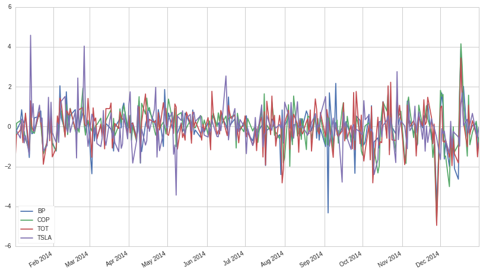
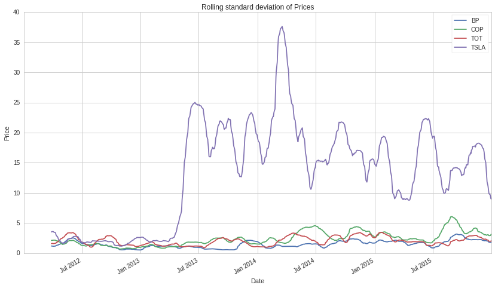

Exercises: Introduction to pandas - Answer Key
==============================================

By Christopher van Hoecke, Maxwell Margenot

Lecture Link :
--------------

https://www.quantopian.com/lectures/introduction-to-pandas

IMPORTANT NOTE:
~~~~~~~~~~~~~~~

This lecture corresponds to the Introduction to Pandas lecture, which is
part of the Quantopian lecture series. This homework expects you to rely
heavily on the code presented in the corresponding lecture. Please copy
and paste regularly from that lecture when starting to work on the
problems, as trying to do them from scratch will likely be too
difficult.

Part of the Quantopian Lecture Series:

-  `www.quantopian.com/lectures <https://www.quantopian.com/lectures>`__
-  `github.com/quantopian/research_public <https://github.com/quantopian/research_public>`__

--------------

.. code:: ipython2

    # Useful Functions
    import numpy as np
    import pandas as pd
    import matplotlib.pyplot as plt

--------------

Exercise 1
==========

a. Series
---------

Given an array of data, please create a pandas Series ``s`` with a
datetime index starting ``2016-01-01``. The index should be daily
frequency and should be the same length as the data.

.. code:: ipython2

    l = np.random.randint(1,100, size=1000)
    s = pd.Series(l)
    
    new_index = pd.date_range("2016-01-01", periods=len(s), freq="D")
    s.index = new_index
    print s

.. parsed-literal::

    2016-01-01    80
    2016-01-02    96
    2016-01-03    32
    2016-01-04    88
    2016-01-05     9
    2016-01-06     8
    2016-01-07    84
    2016-01-08    46
    2016-01-09    94
    2016-01-10    43
    2016-01-11     7
    2016-01-12    82
    2016-01-13    95
    2016-01-14    33
    2016-01-15    73
    2016-01-16    43
    2016-01-17    39
    2016-01-18    52
    2016-01-19    72
    2016-01-20    27
    2016-01-21    48
    2016-01-22    32
    2016-01-23    86
    2016-01-24    13
    2016-01-25    30
    2016-01-26    60
    2016-01-27    65
    2016-01-28    58
    2016-01-29    76
    2016-01-30    14
                  ..
    2018-08-28    60
    2018-08-29    77
    2018-08-30    91
    2018-08-31    75
    2018-09-01    68
    2018-09-02    95
    2018-09-03    30
    2018-09-04    59
    2018-09-05    31
    2018-09-06    76
    2018-09-07     4
    2018-09-08    71
    2018-09-09    73
    2018-09-10    89
    2018-09-11    11
    2018-09-12    36
    2018-09-13     7
    2018-09-14    59
    2018-09-15    77
    2018-09-16    64
    2018-09-17    82
    2018-09-18    19
    2018-09-19    81
    2018-09-20    91
    2018-09-21     9
    2018-09-22    16
    2018-09-23    19
    2018-09-24    65
    2018-09-25    83
    2018-09-26    69
    Freq: D, dtype: int64

b. Accessing Series Elements.
-----------------------------

-  Print every other element of the first 50 elements of series ``s``.
-  Find the value associated with the index ``2017-02-20``.

.. code:: ipython2

    # Print every other element of the first 50 elements
    s.iloc[:50:2];
    # Values associated with the index 2017-02-20
    s.loc['2017-02-20']

.. parsed-literal::

    81

c. Boolean Indexing.
--------------------

In the series ``s``, print all the values between 1 and 3.

.. code:: ipython2

    # Print s between 1 and 3
    s.loc[(s>1) & (s<3)]

.. parsed-literal::

    2016-06-13    2
    2016-08-15    2
    2017-02-05    2
    2017-03-20    2
    2017-03-22    2
    2017-04-11    2
    2017-07-14    2
    2017-07-30    2
    2017-09-22    2
    2017-12-22    2
    2018-03-14    2
    2018-05-30    2
    2018-07-02    2
    2018-07-12    2
    dtype: int64

--------------

#Exercise 2 : Indexing and time series. ###a. Display Print the first
and last 5 elements of the series ``s``.

.. code:: ipython2

    # First 5 elements
    s.head(5)
    # Last 5 elements
    s.tail(5)

.. parsed-literal::

    2018-09-22    16
    2018-09-23    19
    2018-09-24    65
    2018-09-25    83
    2018-09-26    69
    Freq: D, dtype: int64

b. Resampling
~~~~~~~~~~~~~

-  Using the resample method, upsample the daily data to monthly
   frequency. Use the median method so that each monthly value is the
   median price of all the days in that month.
-  Take the daily data and fill in every day, including weekends and
   holidays, using forward-fills.

.. code:: ipython2

    symbol = "CMG"
    start = "2012-01-01"
    end = "2016-01-01"
    prices = get_pricing(symbol, start_date=start, end_date=end, fields="price")
    
    # Resample daily prices to get monthly prices using median. 
    monthly_prices = prices.resample('M').median()
    monthly_prices.head(24)

.. parsed-literal::

    2012-01-31 00:00:00+00:00    355.380
    2012-02-29 00:00:00+00:00    378.295
    2012-03-31 00:00:00+00:00    408.850
    2012-04-30 00:00:00+00:00    420.900
    2012-05-31 00:00:00+00:00    405.390
    2012-06-30 00:00:00+00:00    402.790
    2012-07-31 00:00:00+00:00    380.370
    2012-08-31 00:00:00+00:00    295.380
    2012-09-30 00:00:00+00:00    332.990
    2012-10-31 00:00:00+00:00    286.440
    2012-11-30 00:00:00+00:00    263.559
    2012-12-31 00:00:00+00:00    282.040
    2013-01-31 00:00:00+00:00    299.570
    2013-02-28 00:00:00+00:00    315.520
    2013-03-31 00:00:00+00:00    321.510
    2013-04-30 00:00:00+00:00    340.875
    2013-05-31 00:00:00+00:00    369.900
    2013-06-30 00:00:00+00:00    364.080
    2013-07-31 00:00:00+00:00    386.145
    2013-08-31 00:00:00+00:00    405.190
    2013-09-30 00:00:00+00:00    418.919
    2013-10-31 00:00:00+00:00    442.150
    2013-11-30 00:00:00+00:00    535.985
    2013-12-31 00:00:00+00:00    522.864
    Freq: M, Name: Equity(28016 [CMG]), dtype: float64

.. code:: ipython2

    # Data for every day, (including weekends and holidays)
    calendar_dates = pd.date_range(start=start, end=end, freq='D', tz='UTC')
    calendar_prices = prices.reindex(calendar_dates, method='ffill')
    calendar_prices.head(15)

.. parsed-literal::

    2012-01-01 00:00:00+00:00        NaN
    2012-01-02 00:00:00+00:00        NaN
    2012-01-03 00:00:00+00:00    340.980
    2012-01-04 00:00:00+00:00    348.740
    2012-01-05 00:00:00+00:00    349.990
    2012-01-06 00:00:00+00:00    348.950
    2012-01-07 00:00:00+00:00    348.950
    2012-01-08 00:00:00+00:00    348.950
    2012-01-09 00:00:00+00:00    339.522
    2012-01-10 00:00:00+00:00    340.700
    2012-01-11 00:00:00+00:00    347.330
    2012-01-12 00:00:00+00:00    347.830
    2012-01-13 00:00:00+00:00    354.390
    2012-01-14 00:00:00+00:00    354.390
    2012-01-15 00:00:00+00:00    354.390
    Freq: D, Name: Equity(28016 [CMG]), dtype: float64

--------------

Exercise 3 : Missing Data
=========================

-  Replace all instances of ``NaN`` using the forward fill method.
-  Instead of filling, remove all instances of ``NaN`` from the data.

.. code:: ipython2

    # Fill missing data using Backwards fill method
    bfilled_prices = calendar_prices.fillna(method='bfill')
    bfilled_prices.head(10)

.. parsed-literal::

    2012-01-01 00:00:00+00:00    340.980
    2012-01-02 00:00:00+00:00    340.980
    2012-01-03 00:00:00+00:00    340.980
    2012-01-04 00:00:00+00:00    348.740
    2012-01-05 00:00:00+00:00    349.990
    2012-01-06 00:00:00+00:00    348.950
    2012-01-07 00:00:00+00:00    348.950
    2012-01-08 00:00:00+00:00    348.950
    2012-01-09 00:00:00+00:00    339.522
    2012-01-10 00:00:00+00:00    340.700
    Freq: D, Name: Equity(28016 [CMG]), dtype: float64

.. code:: ipython2

    # Drop instances of nan in the data
    dropped_prices = calendar_prices.dropna()
    dropped_prices.head(10)

.. parsed-literal::

    2012-01-03 00:00:00+00:00    340.980
    2012-01-04 00:00:00+00:00    348.740
    2012-01-05 00:00:00+00:00    349.990
    2012-01-06 00:00:00+00:00    348.950
    2012-01-07 00:00:00+00:00    348.950
    2012-01-08 00:00:00+00:00    348.950
    2012-01-09 00:00:00+00:00    339.522
    2012-01-10 00:00:00+00:00    340.700
    2012-01-11 00:00:00+00:00    347.330
    2012-01-12 00:00:00+00:00    347.830
    Freq: D, Name: Equity(28016 [CMG]), dtype: float64

--------------

#Exercise 4 : Time Series Analysis with pandas ## a. General Information
Print the count, mean, standard deviation, minimum, 25th, 50th, and 75th
percentiles, and the max of our series s.

.. code:: ipython2

    print "Summary Statistics"
    print prices.describe()

.. parsed-literal::

    Summary Statistics
    count    1006.000000
    mean      501.637439
    std       146.697204
    min       236.240000
    25%       371.605000
    50%       521.280000
    75%       646.753750
    max       757.770000
    Name: Equity(28016 [CMG]), dtype: float64

b. Series Operations
--------------------

-  Get the additive and multiplicative returns of this series.
-  Calculate the rolling mean with a 60 day window.
-  Calculate the standard deviation with a 60 day window.

.. code:: ipython2

    data = get_pricing('GE', fields='open_price', start_date='2016-01-01', end_date='2017-01-01')
    
    mult_returns = data.pct_change()[1:] #Multiplicative returns 
    add_returns = data.diff()[1:] #Additive returns 

.. code:: ipython2

    # Rolling mean
    rolling_mean = data.rolling(window=60).mean()
    rolling_mean.name = "60-day rolling mean"

.. code:: ipython2

    # Rolling Standard Deviation
    rolling_std = data.rolling(window=60).std()
    rolling_std.name = "60-day rolling volatility"

--------------

Exercise 5 : DataFrames
=======================

a. Indexing
-----------

Form a DataFrame out of ``dict_data`` with ``l`` as its index.

.. code:: ipython2

    l = ['First','Second', 'Third', 'Fourth', 'Fifth']
    dict_data = {'a' : [1, 2, 3, 4, 5], 
                 'b' : ['L', 'K', 'J', 'M', 'Z'],
                 'c' : np.random.normal(0, 1, 5)
                }
    
    # Adding l as an index to dict_data
    frame_data = pd.DataFrame(dict_data, index=l)
    print frame_data

.. parsed-literal::

            a  b         c
    First   1  L -0.382419
    Second  2  K -0.007889
    Third   3  J  1.121356
    Fourth  4  M -1.099923
    Fifth   5  Z  0.052579

b. DataFrames Manipulation
--------------------------

-  Concatenate the following two series to form a dataframe.
-  Rename the columns to ``Good Numbers`` and ``Bad Numbers``.
-  Change the index to be a datetime index starting on ``2016-01-01``.

.. code:: ipython2

    s1 = pd.Series([2, 3, 5, 7, 11, 13], name='prime')
    s2 = pd.Series([1, 4, 6, 8, 9, 10], name='other')
    
    numbers = pd.concat([s1, s2], axis=1) # Concatenate the two series
    numbers.columns = ['Useful Numbers', 'Not Useful Numbers'] # Rename the two columns
    numbers.index = pd.date_range("2016-01-01", periods=len(numbers)) # Index change
    print numbers

.. parsed-literal::

                Useful Numbers  Not Useful Numbers
    2016-01-01               2                   1
    2016-01-02               3                   4
    2016-01-03               5                   6
    2016-01-04               7                   8
    2016-01-05              11                   9
    2016-01-06              13                  10

--------------

Exercise 6 : Accessing DataFrame elements.
==========================================

a. Columns
----------

-  Check the data type of one of the DataFrame’s columns.
-  Print the values associated with time range ``2013-01-01`` to
   ``2013-01-10``.

.. code:: ipython2

    symbol = ["XOM", "BP", "COP", "TOT"]
    start = "2012-01-01"
    end = "2016-01-01"
    prices = get_pricing(symbol, start_date=start, end_date=end, fields="price")
    if isinstance(symbol, list):
        prices.columns = map(lambda x: x.symbol, prices.columns)
    else:
        prices.name = symbol
    
    # Check Type of Data for these two.    
    prices.XOM.head()
    prices.loc[:, 'XOM'].head()

.. parsed-literal::

    2012-01-03 00:00:00+00:00    76.706
    2012-01-04 00:00:00+00:00    76.804
    2012-01-05 00:00:00+00:00    76.518
    2012-01-06 00:00:00+00:00    76.054
    2012-01-09 00:00:00+00:00    76.286
    Freq: C, Name: XOM, dtype: float64

.. code:: ipython2

    # Print data type
    print type(prices.XOM)
    print type(prices.loc[:, 'XOM'])

.. parsed-literal::

    <class 'pandas.core.series.Series'>
    <class 'pandas.core.series.Series'>

.. code:: ipython2

    # Print values associated with time range
    prices.loc['2013-01-01':'2013-01-10']

.. raw:: html

    

    <table border="1" class="dataframe">
      <thead>
        <tr style="text-align: right;">
          <th></th>
          <th>XOM</th>
          <th>BP</th>
          <th>COP</th>
          <th>TOT</th>
        </tr>
      </thead>
      <tbody>
        <tr>
          <th>2013-01-02 00:00:00+00:00</th>
          <td>81.186</td>
          <td>36.119</td>
          <td>52.038</td>
          <td>45.732</td>
        </tr>
        <tr>
          <th>2013-01-03 00:00:00+00:00</th>
          <td>81.040</td>
          <td>36.843</td>
          <td>52.021</td>
          <td>45.366</td>
        </tr>
        <tr>
          <th>2013-01-04 00:00:00+00:00</th>
          <td>81.360</td>
          <td>37.183</td>
          <td>52.592</td>
          <td>45.523</td>
        </tr>
        <tr>
          <th>2013-01-07 00:00:00+00:00</th>
          <td>80.472</td>
          <td>36.953</td>
          <td>52.003</td>
          <td>44.966</td>
        </tr>
        <tr>
          <th>2013-01-08 00:00:00+00:00</th>
          <td>80.912</td>
          <td>36.953</td>
          <td>51.309</td>
          <td>44.853</td>
        </tr>
        <tr>
          <th>2013-01-09 00:00:00+00:00</th>
          <td>80.674</td>
          <td>37.685</td>
          <td>51.203</td>
          <td>44.844</td>
        </tr>
        <tr>
          <th>2013-01-10 00:00:00+00:00</th>
          <td>81.561</td>
          <td>38.315</td>
          <td>51.441</td>
          <td>45.584</td>
        </tr>
      </tbody>
    </table>
    

--------------

Exercise 7 : Boolean Indexing
=============================

a. Filtering.
-------------

-  Filter pricing data from the last question (stored in ``prices``) to
   only print values where:

   -  BP > 30
   -  XOM < 100
   -  The intersection of both above conditions (BP > 30 **and** XOM <
      100)
   -  The union of the previous composite condition along with TOT
      having no ``nan`` values ((BP > 30 **and** XOM < 100) **or** TOT
      is non-\ ``NaN``).

-  Add a column for TSLA and drop the column for XOM.

.. code:: ipython2

    # Filter data 
    # BP > 30
    print prices.loc[prices.BP > 30].head()
    # XOM < 100
    print prices.loc[prices.XOM < 100].head()
    # BP > 30 AND XOM < 100
    print prices.loc[(prices.BP > 30) & (prices.XOM < 100)].head()
    # The union of (BP > 30 AND XOM < 100) with TOT being non-nan
    print prices.loc[((prices.BP > 30) & (prices.XOM < 100)) | (~ prices.TOT.isnull())].head()

.. parsed-literal::

                                  XOM      BP     COP     TOT
    2012-01-03 00:00:00+00:00  76.706  35.867  47.522  43.390
    2012-01-04 00:00:00+00:00  76.804  36.371  47.304  43.200
    2012-01-05 00:00:00+00:00  76.518  35.949  46.913  42.356
    2012-01-06 00:00:00+00:00  76.054  35.819  46.561  41.951
    2012-01-09 00:00:00+00:00  76.286  35.811  46.721  42.381
                                  XOM      BP     COP     TOT
    2012-01-03 00:00:00+00:00  76.706  35.867  47.522  43.390
    2012-01-04 00:00:00+00:00  76.804  36.371  47.304  43.200
    2012-01-05 00:00:00+00:00  76.518  35.949  46.913  42.356
    2012-01-06 00:00:00+00:00  76.054  35.819  46.561  41.951
    2012-01-09 00:00:00+00:00  76.286  35.811  46.721  42.381
                                  XOM      BP     COP     TOT
    2012-01-03 00:00:00+00:00  76.706  35.867  47.522  43.390
    2012-01-04 00:00:00+00:00  76.804  36.371  47.304  43.200
    2012-01-05 00:00:00+00:00  76.518  35.949  46.913  42.356
    2012-01-06 00:00:00+00:00  76.054  35.819  46.561  41.951
    2012-01-09 00:00:00+00:00  76.286  35.811  46.721  42.381
                                  XOM      BP     COP     TOT
    2012-01-03 00:00:00+00:00  76.706  35.867  47.522  43.390
    2012-01-04 00:00:00+00:00  76.804  36.371  47.304  43.200
    2012-01-05 00:00:00+00:00  76.518  35.949  46.913  42.356
    2012-01-06 00:00:00+00:00  76.054  35.819  46.561  41.951
    2012-01-09 00:00:00+00:00  76.286  35.811  46.721  42.381

.. code:: ipython2

    # Adding TSLA 
    s_1 = get_pricing('TSLA', start_date=start, end_date=end, fields='price')
    prices.loc[:, 'TSLA'] = s_1
    
    # Dropping XOM
    prices = prices.drop('XOM', axis=1)
    prices.head(5)

.. raw:: html

    

    <table border="1" class="dataframe">
      <thead>
        <tr style="text-align: right;">
          <th></th>
          <th>BP</th>
          <th>COP</th>
          <th>TOT</th>
          <th>TSLA</th>
        </tr>
      </thead>
      <tbody>
        <tr>
          <th>2012-01-03 00:00:00+00:00</th>
          <td>35.867</td>
          <td>47.522</td>
          <td>43.390</td>
          <td>28.06</td>
        </tr>
        <tr>
          <th>2012-01-04 00:00:00+00:00</th>
          <td>36.371</td>
          <td>47.304</td>
          <td>43.200</td>
          <td>27.71</td>
        </tr>
        <tr>
          <th>2012-01-05 00:00:00+00:00</th>
          <td>35.949</td>
          <td>46.913</td>
          <td>42.356</td>
          <td>27.12</td>
        </tr>
        <tr>
          <th>2012-01-06 00:00:00+00:00</th>
          <td>35.819</td>
          <td>46.561</td>
          <td>41.951</td>
          <td>26.94</td>
        </tr>
        <tr>
          <th>2012-01-09 00:00:00+00:00</th>
          <td>35.811</td>
          <td>46.721</td>
          <td>42.381</td>
          <td>27.21</td>
        </tr>
      </tbody>
    </table>
    

b. DataFrame Manipulation (again)
---------------------------------

-  Concatenate these DataFrames.
-  Fill the missing data with 0s

.. code:: ipython2

    df_1 = get_pricing(['SPY', 'VXX'], start_date=start, end_date=end, fields='price')
    df_2 = get_pricing(['MSFT', 'AAPL', 'GOOG'], start_date=start, end_date=end, fields='price')
    # Concatenate the dataframes
    df_3 = pd.concat([df_1, df_2], axis=1)
    df_3.head()

.. raw:: html

    

    <table border="1" class="dataframe">
      <thead>
        <tr style="text-align: right;">
          <th></th>
          <th>Equity(8554 [SPY])</th>
          <th>Equity(38054 [VXX])</th>
          <th>Equity(5061 [MSFT])</th>
          <th>Equity(24 [AAPL])</th>
          <th>Equity(46631 [GOOG])</th>
        </tr>
      </thead>
      <tbody>
        <tr>
          <th>2012-01-03 00:00:00+00:00</th>
          <td>118.414</td>
          <td>538.72</td>
          <td>23.997</td>
          <td>54.684</td>
          <td>NaN</td>
        </tr>
        <tr>
          <th>2012-01-04 00:00:00+00:00</th>
          <td>118.498</td>
          <td>527.84</td>
          <td>24.498</td>
          <td>54.995</td>
          <td>NaN</td>
        </tr>
        <tr>
          <th>2012-01-05 00:00:00+00:00</th>
          <td>118.850</td>
          <td>516.32</td>
          <td>24.749</td>
          <td>55.597</td>
          <td>NaN</td>
        </tr>
        <tr>
          <th>2012-01-06 00:00:00+00:00</th>
          <td>118.600</td>
          <td>508.00</td>
          <td>25.151</td>
          <td>56.194</td>
          <td>NaN</td>
        </tr>
        <tr>
          <th>2012-01-09 00:00:00+00:00</th>
          <td>118.795</td>
          <td>500.64</td>
          <td>24.811</td>
          <td>56.098</td>
          <td>NaN</td>
        </tr>
      </tbody>
    </table>
    

.. code:: ipython2

    # Fill GOOG missing data with nan
    filled0_df_3 = df_3.fillna(0)
    filled0_df_3.head(5)

.. raw:: html

    

    <table border="1" class="dataframe">
      <thead>
        <tr style="text-align: right;">
          <th></th>
          <th>Equity(8554 [SPY])</th>
          <th>Equity(38054 [VXX])</th>
          <th>Equity(5061 [MSFT])</th>
          <th>Equity(24 [AAPL])</th>
          <th>Equity(46631 [GOOG])</th>
        </tr>
      </thead>
      <tbody>
        <tr>
          <th>2012-01-03 00:00:00+00:00</th>
          <td>118.414</td>
          <td>538.72</td>
          <td>23.997</td>
          <td>54.684</td>
          <td>0.0</td>
        </tr>
        <tr>
          <th>2012-01-04 00:00:00+00:00</th>
          <td>118.498</td>
          <td>527.84</td>
          <td>24.498</td>
          <td>54.995</td>
          <td>0.0</td>
        </tr>
        <tr>
          <th>2012-01-05 00:00:00+00:00</th>
          <td>118.850</td>
          <td>516.32</td>
          <td>24.749</td>
          <td>55.597</td>
          <td>0.0</td>
        </tr>
        <tr>
          <th>2012-01-06 00:00:00+00:00</th>
          <td>118.600</td>
          <td>508.00</td>
          <td>25.151</td>
          <td>56.194</td>
          <td>0.0</td>
        </tr>
        <tr>
          <th>2012-01-09 00:00:00+00:00</th>
          <td>118.795</td>
          <td>500.64</td>
          <td>24.811</td>
          <td>56.098</td>
          <td>0.0</td>
        </tr>
      </tbody>
    </table>
    

--------------

Exercise 8 : Time Series Analysis
=================================

a. Summary
----------

-  Print out a summary of the ``prices`` DataFrame from above.
-  Take the log returns and print the first 10 values.
-  Print the multiplicative returns of each company.
-  Normalize and plot the returns from 2014 to 2015.
-  Plot a 60 day window rolling mean of the prices.
-  Plot a 60 day window rolling standfard deviation of the prices.

.. code:: ipython2

    # Summary
    prices.describe()

.. raw:: html

    

    <table border="1" class="dataframe">
      <thead>
        <tr style="text-align: right;">
          <th></th>
          <th>BP</th>
          <th>COP</th>
          <th>TOT</th>
          <th>TSLA</th>
        </tr>
      </thead>
      <tbody>
        <tr>
          <th>count</th>
          <td>1006.000000</td>
          <td>1006.000000</td>
          <td>1006.000000</td>
          <td>1006.000000</td>
        </tr>
        <tr>
          <th>mean</th>
          <td>38.079349</td>
          <td>58.185060</td>
          <td>49.209090</td>
          <td>147.455109</td>
        </tr>
        <tr>
          <th>std</th>
          <td>4.122068</td>
          <td>9.379062</td>
          <td>7.354246</td>
          <td>89.673401</td>
        </tr>
        <tr>
          <th>min</th>
          <td>28.911000</td>
          <td>41.647000</td>
          <td>35.264000</td>
          <td>22.750000</td>
        </tr>
        <tr>
          <th>25%</th>
          <td>35.382250</td>
          <td>49.921250</td>
          <td>44.005500</td>
          <td>35.085000</td>
        </tr>
        <tr>
          <th>50%</th>
          <td>37.366500</td>
          <td>57.437000</td>
          <td>47.947500</td>
          <td>178.125000</td>
        </tr>
        <tr>
          <th>75%</th>
          <td>40.820750</td>
          <td>64.554000</td>
          <td>53.452000</td>
          <td>227.107500</td>
        </tr>
        <tr>
          <th>max</th>
          <td>48.904000</td>
          <td>81.824000</td>
          <td>68.841000</td>
          <td>286.040000</td>
        </tr>
      </tbody>
    </table>
    

.. code:: ipython2

    # Natural Log of the returns and print out the first 10 values
    np.log(prices).head(10)

.. raw:: html

    

    <table border="1" class="dataframe">
      <thead>
        <tr style="text-align: right;">
          <th></th>
          <th>BP</th>
          <th>COP</th>
          <th>TOT</th>
          <th>TSLA</th>
        </tr>
      </thead>
      <tbody>
        <tr>
          <th>2012-01-03 00:00:00+00:00</th>
          <td>3.579818</td>
          <td>3.861193</td>
          <td>3.770229</td>
          <td>3.334345</td>
        </tr>
        <tr>
          <th>2012-01-04 00:00:00+00:00</th>
          <td>3.593772</td>
          <td>3.856595</td>
          <td>3.765840</td>
          <td>3.321793</td>
        </tr>
        <tr>
          <th>2012-01-05 00:00:00+00:00</th>
          <td>3.582101</td>
          <td>3.848295</td>
          <td>3.746110</td>
          <td>3.300271</td>
        </tr>
        <tr>
          <th>2012-01-06 00:00:00+00:00</th>
          <td>3.578478</td>
          <td>3.840763</td>
          <td>3.736502</td>
          <td>3.293612</td>
        </tr>
        <tr>
          <th>2012-01-09 00:00:00+00:00</th>
          <td>3.578255</td>
          <td>3.844194</td>
          <td>3.746700</td>
          <td>3.303585</td>
        </tr>
        <tr>
          <th>2012-01-10 00:00:00+00:00</th>
          <td>3.586154</td>
          <td>3.849254</td>
          <td>3.751948</td>
          <td>3.318540</td>
        </tr>
        <tr>
          <th>2012-01-11 00:00:00+00:00</th>
          <td>3.578004</td>
          <td>3.831507</td>
          <td>3.738288</td>
          <td>3.340385</td>
        </tr>
        <tr>
          <th>2012-01-12 00:00:00+00:00</th>
          <td>3.581183</td>
          <td>3.814256</td>
          <td>3.724801</td>
          <td>3.341093</td>
        </tr>
        <tr>
          <th>2012-01-13 00:00:00+00:00</th>
          <td>3.571418</td>
          <td>3.808594</td>
          <td>3.714182</td>
          <td>3.124565</td>
        </tr>
        <tr>
          <th>2012-01-17 00:00:00+00:00</th>
          <td>3.582101</td>
          <td>3.814256</td>
          <td>3.742017</td>
          <td>3.279030</td>
        </tr>
      </tbody>
    </table>
    

.. code:: ipython2

    # Multiplicative returns
    mult_returns = prices.pct_change()[1:]
    mult_returns.head()

.. raw:: html

    

    <table border="1" class="dataframe">
      <thead>
        <tr style="text-align: right;">
          <th></th>
          <th>BP</th>
          <th>COP</th>
          <th>TOT</th>
          <th>TSLA</th>
        </tr>
      </thead>
      <tbody>
        <tr>
          <th>2012-01-04 00:00:00+00:00</th>
          <td>0.014052</td>
          <td>-0.004587</td>
          <td>-0.004379</td>
          <td>-0.012473</td>
        </tr>
        <tr>
          <th>2012-01-05 00:00:00+00:00</th>
          <td>-0.011603</td>
          <td>-0.008266</td>
          <td>-0.019537</td>
          <td>-0.021292</td>
        </tr>
        <tr>
          <th>2012-01-06 00:00:00+00:00</th>
          <td>-0.003616</td>
          <td>-0.007503</td>
          <td>-0.009562</td>
          <td>-0.006637</td>
        </tr>
        <tr>
          <th>2012-01-09 00:00:00+00:00</th>
          <td>-0.000223</td>
          <td>0.003436</td>
          <td>0.010250</td>
          <td>0.010022</td>
        </tr>
        <tr>
          <th>2012-01-10 00:00:00+00:00</th>
          <td>0.007931</td>
          <td>0.005073</td>
          <td>0.005262</td>
          <td>0.015068</td>
        </tr>
      </tbody>
    </table>
    

.. code:: ipython2

    # Normalizing the returns and plotting one year of data
    norm_returns = (mult_returns - mult_returns.mean(axis=0))/mult_returns.std(axis=0)
    norm_returns.loc['2014-01-01':'2015-01-01'].plot();

.. code:: ipython2

    # Rolling mean
    rolling_mean = prices.rolling(window=60).mean()
    rolling_mean.columns = prices.columns
    
    # Rolling standard deviation
    rolling_std = prices.rolling(window=60).std()
    rolling_mean.columns = prices.columns
    
    # Plotting 
    mean = rolling_mean.plot();
    plt.title("Rolling Mean of Prices")
    plt.xlabel("Date")
    plt.ylabel("Price")
    plt.legend();
    
    std = rolling_std.plot();
    plt.title("Rolling standard deviation of Prices")
    plt.xlabel("Date")
    plt.ylabel("Price")
    plt.legend();

.. image:: notebook_files/notebook_49_0.png

--------------

Congratulations on completing the Introduction to pandas exercises!

As you learn more about writing trading algorithms and the Quantopian
platform, be sure to check out the daily `Quantopian
Contest <https://www.quantopian.com/contest>`__, in which you can
compete for a cash prize every day.

Start by going through the `Writing a Contest
Algorithm <https://www.quantopian.com/tutorials/contest>`__ Tutorial.

*This presentation is for informational purposes only and does not
constitute an offer to sell, a solicitation to buy, or a recommendation
for any security; nor does it constitute an offer to provide investment
advisory or other services by Quantopian, Inc. (“Quantopian”). Nothing
contained herein constitutes investment advice or offers any opinion
with respect to the suitability of any security, and any views expressed
herein should not be taken as advice to buy, sell, or hold any security
or as an endorsement of any security or company. In preparing the
information contained herein, Quantopian, Inc. has not taken into
account the investment needs, objectives, and financial circumstances of
any particular investor. Any views expressed and data illustrated herein
were prepared based upon information, believed to be reliable, available
to Quantopian, Inc. at the time of publication. Quantopian makes no
guarantees as to their accuracy or completeness. All information is
subject to change and may quickly become unreliable for various reasons,
including changes in market conditions or economic circumstances.*
