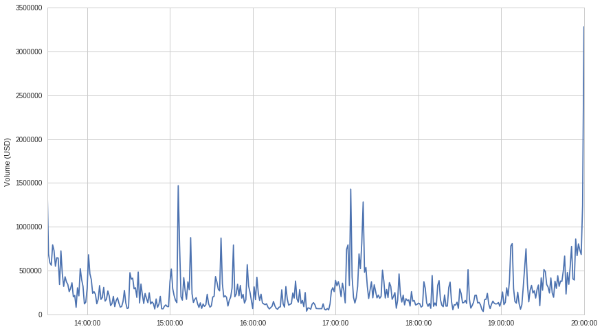
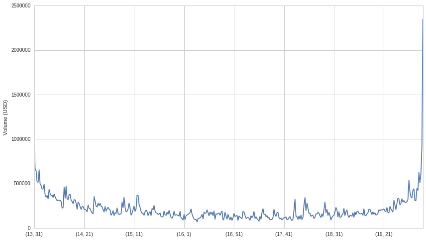
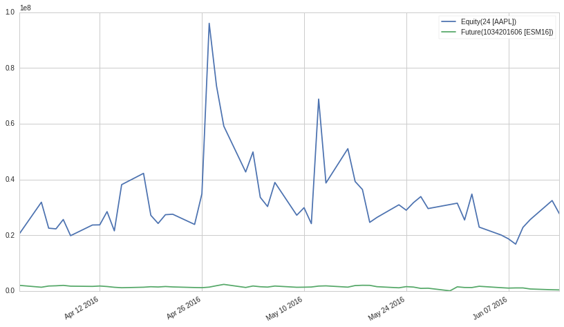
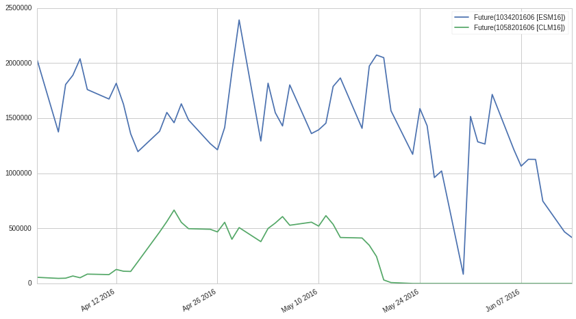

Introduction to Volume, Slippage, and Liquidity
===============================================

by Delaney Mackenzie and Maxwell Margenot

Part of the Quantopian Lecture Series:

-  `www.quantopian.com/lectures <www.quantopian.com/lectures>`__
-  `github.com/quantopian/research_public <github.com/quantopian/research_public>`__

What is Volume?
---------------

Volume is how much trading occurs for a given instrument, or set of
instruments, over a given time period.

Example Volume Computation
~~~~~~~~~~~~~~~~~~~~~~~~~~

For instance, consider a hypothetical equity asset :math:`A`. If, over
the course of a minute, :math:`100,000` shares of :math:`A` are bought,
then the shares traded volume of :math:`A` is :math:`100,000`. To find
the dollar volume traded for :math:`A`, which is the more often-used
statistic, we need to take a weighted average of all the different
prices :math:`A` traded for over the minute times the number of shares
that traded at each price. This is equivalent to adding up the dollar
volumes of all the individual trasnactions that occured. For instance,
let’s say in this case there were there separate transactions. One for
30,000 shares, one for :math:`60,000` shares, and one for :math:`10,000`
shares. The prices were :math:`30` USD, :math:`31` USD, and :math:`33`
USD, respectively. Let’s model this out.

.. code:: ipython2

    import numpy as np
    import pandas as pd
    
    import matplotlib.pyplot as plt

.. code:: ipython2

    num_shares = np.asarray([30000, 60000, 10000])
    prices = np.asarray([30, 31, 33])
    
    np.dot(num_shares, prices)

.. parsed-literal::

    3090000

So total dollar volume is :math:`3.09` million USD. Notice that this is
equivalent to taking the dollar volume averaged price and multiplying by
the number of shares traded over that bar.

.. code:: ipython2

    # Get the average trade price
    print "Average trade price: %s" % (np.mean(prices))
    
    # Get the volume weighted average
    vw = np.dot(num_shares, prices) / float(np.sum(num_shares))
    print "Volume weighted average trade price: %s" % (vw)
    
    # Go back to volume
    v = vw * np.sum(num_shares)
    print "Volume: %s" % (v)

.. parsed-literal::

    Average trade price: 31.3333333333
    Volume weighted average trade price: 30.9
    Volume: 3090000.0

Often in real datasets you will be given averaged or ‘last traded’ data
rather than individual trades. With averaged data, some average is taken
over a bar (time period). With last traded data, only the final
observation from that bar is reported. It is important to know if the
data is averaged, volume averaged, or simply last traded. All of these
will need to be treated differently.

For pricing data, Quantopian currently (as of April 2017) provides the
last traded prices at a minute resolution. The volume is the sum of all
volume in that bar. While we do not offer minutely volume-weighted
price, daily volume-weighted price can be approximated from the minute
bars.

Let’s look at some volume data.

.. code:: ipython2

    data = get_pricing('SPY', start_date='2015-6-1', end_date='2015-6-20', frequency='minute')

.. code:: ipython2

    data.head()

.. raw:: html

    

    <table border="1" class="dataframe">
      <thead>
        <tr style="text-align: right;">
          <th></th>
          <th>open_price</th>
          <th>high</th>
          <th>low</th>
          <th>close_price</th>
          <th>volume</th>
          <th>price</th>
        </tr>
      </thead>
      <tbody>
        <tr>
          <th>2015-06-01 13:31:00+00:00</th>
          <td>210.914</td>
          <td>211.033</td>
          <td>210.834</td>
          <td>211.013</td>
          <td>1130598.0</td>
          <td>211.013</td>
        </tr>
        <tr>
          <th>2015-06-01 13:32:00+00:00</th>
          <td>211.013</td>
          <td>211.083</td>
          <td>210.993</td>
          <td>211.043</td>
          <td>860265.0</td>
          <td>211.043</td>
        </tr>
        <tr>
          <th>2015-06-01 13:33:00+00:00</th>
          <td>211.043</td>
          <td>211.048</td>
          <td>210.934</td>
          <td>210.964</td>
          <td>466341.0</td>
          <td>210.964</td>
        </tr>
        <tr>
          <th>2015-06-01 13:34:00+00:00</th>
          <td>210.964</td>
          <td>210.983</td>
          <td>210.844</td>
          <td>210.854</td>
          <td>305119.0</td>
          <td>210.854</td>
        </tr>
        <tr>
          <th>2015-06-01 13:35:00+00:00</th>
          <td>210.864</td>
          <td>210.894</td>
          <td>210.725</td>
          <td>210.725</td>
          <td>420599.0</td>
          <td>210.725</td>
        </tr>
      </tbody>
    </table>
    

Notice that just plotting the volume gives us lots of gaps. This is
because we are plotting data with time on the x-axis, and equities are
only traded during part of the day. The rest of the day we have no data
for volume. There is a small amount of overnight trading that occurs for
equities, but it is often only useful as a data source as the liquidity
is too low to trade. Quantopian does not currently have data on
overnight trading, just for regular market hours.

.. code:: ipython2

    plt.plot(data['volume'])
    plt.ylabel('Volume (USD)');

.. image:: notebook_files/notebook_9_0.png

Let’s look at how this volume is balanced out over a single day.

.. code:: ipython2

    plt.plot(data['volume']['2015-6-4'])
    plt.ylabel('Volume (USD)');

This is pretty noisy, but with pandas we can easily take an average
across all the days in our sample to get a sense of how volume
fluctuates on average. Here is the average volume for a given minute
over the whole time period.

.. code:: ipython2

    avg_minute_volume = data.groupby([data.index.hour, data.index.minute]).mean()['volume']

.. code:: ipython2

    avg_minute_volume.plot()
    plt.ylabel('Volume (USD)');

High Equity Volume After Market Open
~~~~~~~~~~~~~~~~~~~~~~~~~~~~~~~~~~~~

There tends to be high volume right after market open. This is due to a
variety of factors including people wanting to update their positions
based on price changes and new information that emerged before trading
started. Since there was a ton of time and possibly news overnight while
the market could not react, trading right after the open can be a bit
volatile as pricing adjusts.

High Equity Volume Before Market Close
~~~~~~~~~~~~~~~~~~~~~~~~~~~~~~~~~~~~~~

There is a similar effect at the end of the day when people want to get
in their final orders before trading closes and they no longer have the
chance. Again there are a variety of factors that drive this increase,
but the effect tends to be consistent.

Modeling Volume
~~~~~~~~~~~~~~~

Volume can change a lot, and summary statistics such as mean volume may
not always be representative. Model it as you would any other quantity
and pay attention to whether your volume forecasts or measurements are
useful. We do not discuss any specific models in this lecture as the
models are often specific to the markets and instruments being traded.

As with any other model, a model of volume needs to be carefully
validated using rigorous statistics. As a rule of thumb you can expect
more volume at the start and end of day in the US Equity market, but
this will vary by equity and day, plus there will be shocks and half
days. In practice you should apply just as much care as you would trying
to model returns.

What is Slippage?
-----------------

Slippage occurs when large buy or sell orders drive the price of the
market up or down respectively. Remember that for every share bought, a
share must be sold by another party. If no parties are selling shares,
buy orders will not be filled. This is a simplification of what actually
occurs as there are complexities around issues such as bid/ask spread,
but we will not consider those here. To understand why price shifts
happen when large orders are placed, consider the following scenario:

1. Person A places a buy order for :math:`1000` shares of stock X.
   Currently trading at :math:`100` USD / share.
2. There is only one sell order for :math:`500` shares.
3. The broker fills :math:`500` shares of the order at :math:`100` USD /
   share.
4. There are :math:`500` shares remaining to fill. Other market
   participants notice that there is demand at :math:`100` USD / share,
   so they increase their sell price to :math:`101` USD / share.
5. Another sell order gets placed for :math:`500` shares at :math:`101`
   USD / share.
6. The broker fills the remaining :math:`500` shares of the original
   order at :math:`101` USD / share. Closing out the process.

As you can see, the large order for stock X was not immediately filled,
and the demand pushed the market price against the original order,
resulting in a fill price worse than expected. The opposite occurs for
sell orders. In general, the larger the order, the more slippage will be
experienced by a trade.

Complications with Forecasting Slippage
~~~~~~~~~~~~~~~~~~~~~~~~~~~~~~~~~~~~~~~

Modeling slippage is not trivial and is the subject of research by
professional quantitative teams. There are different parameters and the
behavior of slippage varies across markets and instruments. Things like
the bid/ask spread will influence it. Although we will not get into any
specific slippage models in this lecture, info on Quantopian’s
backtester slippage model can be found
`here <https://www.quantopian.com/help#ide-slippage>`__ and some more
in-depth research on it can be found
`here <https://blog.quantopian.com/accurate-slippage-model-comparing-real-simulated-transaction-costs/>`__.

Why is this Important to Quantitative Strategies?
~~~~~~~~~~~~~~~~~~~~~~~~~~~~~~~~~~~~~~~~~~~~~~~~~

Quantitative strategies often rely on finding small but consistent edges
across many instruments in a market or multiple markets. If the amount
of profit you expect to make off of each trade is very small, slippage
can eat a significant amount of that profit. Quantitative strategies
rely on executing orders as they have been defined, so anything that
counteracts the orders can break the strategy.

Where is Slippage Worst?
~~~~~~~~~~~~~~~~~~~~~~~~

Slippage is often worst on stocks with very little volume. Some
egregious offenders are small and micro cap stocks. They are very low
volume and develop large inefficiencies, but when you try to trade the
inefficiencies you are unable to due to the lack of trades on the other
side of the market. If you wait long enough you may be able to fill your
order, but in that time you will suffer a lot of slippage.

What is Liquidity?
------------------

Before we can define liquidity, we need to define a few key execution
parameters. This is certainly not an exhaustive list of parameters that
can decribe execution conditions, but they are the key ones for our
purposes here.

Execution Parameters
~~~~~~~~~~~~~~~~~~~~

-  Trade Size :math:`s`
-  Market Price :math:`p_m`
-  Time to Fill :math:`t`
-  Realized Fill Price :math:`p_f`

Defining Liquidity in Terms of Execution Feasibility
~~~~~~~~~~~~~~~~~~~~~~~~~~~~~~~~~~~~~~~~~~~~~~~~~~~~

Liquidity is a somewhat ambiguous term. There are different ways of
defining it and therefore different ways of measuring it. In general
it’s the ability to execute large trades quickly without experiencing
slippage. Another way to think about it is how easy it is to convert a
held asset to cash quickly. Rather than having one precise definition,
people often descibe liquidity according to their trading needs. For
instance, if one regularly needs to execute trades of size
:math:`s`\ =100,000USD, and market :math:`M_1` can regularly support
that with fills coming within :math:`t`\ =1s and slippage or
:math:`p_f / p_m` < 1.0001 (0.01% error), then we’d say that market
:math:`M` is sufficiently liquid for one’s purposes. On the other hand
if another market :math:`M_2` can support trades of larger size, fill
them in shorter time, or has consistently less slippage, then we would
say that :math:`M_2` is *more* liquid.

The takeaway is that liquidity depends on what you are trying to trade
and how, and once you’ve established a benchmark you can compare it to
other potential instruments, markets, brokers, or trading methods.

Liquidity vs. Volume
--------------------

Liquidity and volume are not the same thing. Liquidity is the important
property that affects how easily we can trade. Volume is a related but
indirect proxy for liquidity. In general people use volume as one of the
main ways to determine how liquid a trading environemnt will be. If
there is high volume, it’s likely you’ll be able to execute a trade
quickly and with minimal slippage. If you’re a high percentage of the
volume, then you’re in trouble. In general the higher the volume, the
lower your percentage and the better things will be.

Although volume is central to liquidity, one can have cases of high
volume with low liquidity.

One-Sided Market
~~~~~~~~~~~~~~~~

A market may have high volume, but with a lot of demand in one
direction. This can occur during a panic event in which case many people
want to sell. This can result in large bid-ask spreads and, while trades
may be closing, they will be closing at prices far away from what you
would like (AKA high slippage). The high slippage indicates that this is
an illiquid market. It is also more difficult to determine a fair market
price when spreads and volatility are high. Momentum strategies can have
higher slippage due to the fact that you’re jumping into the same side
of the market as everybody else.

Non-Continuous Prices
~~~~~~~~~~~~~~~~~~~~~

Sometimes there can be large block transactions occuring in a single
instrument. Imagine that a large shareholder is trying to get rid of
their stake in a company. Rather than selling it on the open market and
exposing themselves to a massive amount of slippage, they trade it
through other routes. There will still be a large amount of trading
volume, but because it’s not accessible to you, any trades you place
will be exposed to the same illiquid conditions as without that volume.

Transaction Costs
-----------------

Whenever a trade is placed, you will pay a fee to the broker to trade.
This fee can be based on trade size or just be flat, but is well defined
and not an uncertain quantity. You will also experience slippage, which
can be thought of as just another cost. Often both broker fees and
slippage costs will be grouped under the term ‘Transaction Costs’, which
describes generally how much it will cost to trade a specific strategy.
If transaction costs eat too much of your profits a strategy might
become infeasible.

Transaction Costs Vary by Broker and Market
~~~~~~~~~~~~~~~~~~~~~~~~~~~~~~~~~~~~~~~~~~~

Because transaction costs vary based on trading environments, strategies
that are inviable on a retail brokerage may be viable on an
institutional prime brokerage with lower costs. Often quant strategies
will fail on retail fees, but be fine for an institution. Just because
you can’t trade a strategy doesn’t mean it’s not valuable. You may be
able to sell it to an organization that can trade it. When evaluating
strategies for allocation Quantopian assumes trading conditions of a
prime brokerage.

Why is liquidity important?
---------------------------

Why do we actually care about modeling, forecasting, and understanding
liquidity?

It’s a bottleneck to trading any strategy.
~~~~~~~~~~~~~~~~~~~~~~~~~~~~~~~~~~~~~~~~~~

The final step of implementing any trading strategy is actually trading
it. If you have statistically verified a mathematical model and it’s
pumping out target positions, that’s not useful unless you can turn
those positions into reality by trading in the market. Liquidity
essentially defines your ability to move from current positions to
desired future positions. With low liquidity you will not be able to
execute on desired trades and there will be large infidelities between
your model’s requests and your real positions.

There’s no perfect case.
^^^^^^^^^^^^^^^^^^^^^^^^

You cannot completely eliminate liquidity concerns. Each instrument will
have variable liquidity and there may be exogenous system shocks. As
with any other quantity you can just model it and then try to trade
instruments for which you expect good liquidity. Every strategy will
have some liquidity drag during actual trading, but you can just try to
make it as small as possible by avoiding instruments with high liquidity
risk.

Capital Base vs. Liquidity
~~~~~~~~~~~~~~~~~~~~~~~~~~

The more capital you trade, the harder it is to fill trades without
experiencing slippage, so the more expensive your trading will be. In
general all strategies have capital ranges in which they are profitable.
The upper limit is defined by liquidity constraints. Once you become too
large a part of the market the slippage will eat all your returns. The
lower end is defined by broker comissions and position errors. If you’re
attempting to trade a small amount of capital, flat trading costs from
your broker may exceed returns. Likewise, if you are trading 100,000USD
and place 1% of your portfolio into a single stock, you will not be able
to buy precisely 100USD worth of the stock. The lack of fractional
shares will result in large portfolio infidelities from your desired
positions. Because trading few instruments results in `position
concentration
risk <https://www.quantopian.com/lectures/position-concentration-risk>`__,
trading small amounts of capital is often difficult.

Backtesting and Liquidity
-------------------------

The purpose of backtesting is not to determine whether a model has
predictive power. That should all be done at the `statistical analysis
stage <https://www.quantopian.com/lectures/hypothesis-testing>`__ and is
inefficient to do in a backtester, not to mention the `overfitting
risk <https://www.quantopian.com/lectures/the-dangers-of-overfitting>`__.

The purpose of backtesting is to check how robust a strategy is to real
market frictions like illiquidity, slippage, and the resulting
transaction costs. You can have highly predictive models that are simply
not tradeable because the underlying instruments are not liquid enough.

Backtest Under a Range of Liquidity Assumptions
~~~~~~~~~~~~~~~~~~~~~~~~~~~~~~~~~~~~~~~~~~~~~~~

It pays to backtest under a few different liquidity assumptions. This
tells you whether your strategy is robust, or whether it will fall apart
the moment you change liquidity conditions at all.

Liquidity Varies by Market, Instrument, and Broker
--------------------------------------------------

In general different instruments will experience broadly different
liquidity conditions. We’ll show an example of that here.

.. code:: ipython2

    start_date = '2016-04-01'
    end_date = '2016-06-14'
    aapl_volume = get_pricing('AAPL', start_date=start_date, end_date=end_date, fields='volume')
    spy_future_volume = get_pricing('ESM16', start_date=start_date, end_date=end_date, fields='volume')

.. code:: ipython2

    aapl_volume.plot()
    spy_future_volume.plot()
    plt.legend();

Broad Liquidity Considerations in Equities
~~~~~~~~~~~~~~~~~~~~~~~~~~~~~~~~~~~~~~~~~~

-  Liquidity will vary by market cap. Higher cap stocks experience more
   absolute trading volume and are more liquid. Micro-cap stocks are
-  Some stocks are hard to borrow/short, and may experience one sided
   liquidity. Longs are easy to purchase, but shorts are hard to obtain.
   Quantopian does not currently provide hard to borrow data.

Liquidity in Futures
~~~~~~~~~~~~~~~~~~~~

-  Futures have much higher liquidity per instrument compared to
   equities.
-  Liquidity varies by type/class of future. Certain types of futures
   will be far less illiquid. We’ll show an example here.
-  Liquidity has structure depending on expiration date. The volume of
   trading of a future contract will increase over time up to the
   expiration date. Far in advance there will be little volume as most
   people will be trading more current contracts. This volume effect
   must be considered when trying to trade futures. We’ll show an
   example of this here.

.. code:: ipython2

    crude_future_volume = get_pricing('CLM16', start_date=start_date, end_date=end_date, fields='volume')

.. code:: ipython2

    spy_future_volume.plot()
    crude_future_volume.plot()
    plt.legend();

.. code:: ipython2

    palladium_future_volume = get_pricing('PAM16', start_date=start_date, end_date=end_date, fields='volume')

.. code:: ipython2

    crude_future_volume.plot()
    palladium_future_volume.plot()
    plt.legend();

.. image:: notebook_files/notebook_30_0.png

Avoiding Illiquidity
--------------------

Use a good universe.
~~~~~~~~~~~~~~~~~~~~

Quantopian has defined a universe (QTradableStocksUS) of liquid stocks
in an effort to provide a nice clean starting point for people looking
to develop models. You can find more about that here:

https://www.quantopian.com/lectures/universe-selection

Execution Algorithms
~~~~~~~~~~~~~~~~~~~~

Algorithms exist that try to time orders and parcel them out into
smaller chunks across many markets or timeframes. These algorithms are
collectively known as execution algorithms and aim to reduce issues with
slippage and liquidity. We will not go into execution algorithms in this
lecture, but they are the subject of a huge amount of industry and
academic research. Often firms will have a quantitative research team
dedicated to developing strategies, and another dedicated to researching
ways to execute the trades.

*This presentation is for informational purposes only and does not
constitute an offer to sell, a solicitation to buy, or a recommendation
for any security; nor does it constitute an offer to provide investment
advisory or other services by Quantopian, Inc. (“Quantopian”). Nothing
contained herein constitutes investment advice or offers any opinion
with respect to the suitability of any security, and any views expressed
herein should not be taken as advice to buy, sell, or hold any security
or as an endorsement of any security or company. In preparing the
information contained herein, Quantopian, Inc. has not taken into
account the investment needs, objectives, and financial circumstances of
any particular investor. Any views expressed and data illustrated herein
were prepared based upon information, believed to be reliable, available
to Quantopian, Inc. at the time of publication. Quantopian makes no
guarantees as to their accuracy or completeness. All information is
subject to change and may quickly become unreliable for various reasons,
including changes in market conditions or economic circumstances.*
